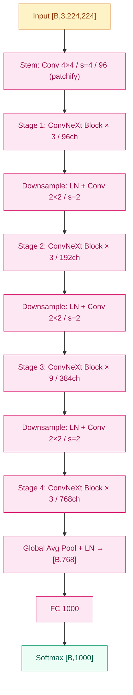

# ConvNeXt (2022)

## 之前卡在哪

2020 年 [ViT](../08-vit/) 把 Transformer 直接搬到视觉，用纯注意力 + 大规模预训练把 ImageNet Top-1 一把推到 85% 以上，紧跟着 Swin Transformer 在 2021 年又把分层 / 滑窗注意力做出来，在 detection / segmentation 上全面接管 CNN 的位置。两年时间，视觉社区的共识从"CNN 是默认 backbone"一路滑到"CNN 是不是要被 Transformer 替代了"——CVPR 2021 上几乎一半的 backbone 论文都换成了 Transformer 变种。

但有件事一直让人不踏实：ViT 和 Swin 的胜利里，到底有多少来自**注意力机制本身**，又有多少来自**和注意力一起搬过来的那一整套现代化设计**？ViT 用 LayerNorm 不用 BatchNorm、用 GELU 不用 ReLU、训练用 AdamW + Mixup + CutMix + RandAugment + Stochastic Depth + Label Smoothing 的全家桶，[ResNet](05-resnet.md) 2015 年的训练 recipe（SGD + 简单增强 + Dropout）一样都没用。**这是同一条赛道的公平比较吗**？

Saining Xie（[ResNeXt](05-resnet.md) 一作）和 Zhuang Liu（[DenseNet](06-densenet.md) 一作）——两个 CNN 家族的老熟人——决定把这件事彻底验一遍。他们提的问题非常干净：**不发明任何新算子**，从 ResNet-50（76.1% Top-1）出发，把 Swin Transformer 用到的每一项现代化设计逐条搬过来，每搬一项就跑一次 ImageNet 看精度涨多少。最后能涨到哪里？

## 核心思想

ConvNeXt 的全部贡献是一张"现代化路线图"——把 ResNet-50 当起点，按顺序加 7 类改造，每一步对应 ViT/Swin 用到的某个设计。最终得到的网络**没有任何注意力机制**，仍然全部由卷积构成，但在 ImageNet 上反超同等规模的 Swin Transformer。


*图 1：ConvNeXt-T 主干，4 stage 的 ConvNeXt block 堆叠 (3,3,9,3)。*

整网骨架仍然是 4 stage 的"逐步降分辨率、逐步升通道"格式——这件事和 ResNet 完全一样。差别在 stem、block 内部、归一化 / 激活函数和训练 recipe。下面这张表是论文里那张著名的"现代化路径图"，每一行都对应 Swin 用到的某个设计：

| 改造 | 来自 | 精度变化（ResNet-50 → ） | 累积 Top-1 |
|---|---|---|---|
| 起点（ResNet-50 原版 recipe） | — | — | 76.1% |
| **新训练 recipe**（AdamW + 强增强 + 300 epoch） | ViT/Swin | +2.7 | 78.8% |
| **Stage 比例调整**（3,4,6,3 → 3,3,9,3） | Swin | +0.6 | 79.4% |
| **Patchify stem**（7×7 s=2 → 4×4 s=4 conv） | ViT | +0.1 | 79.5% |
| **ResNeXt 化 / depthwise conv** | ResNeXt | +1.0 | 80.5% |
| **Inverted bottleneck**（4× hidden） | MobileNet v2 | +0.1 | 80.6% |
| **大 kernel**（3×3 → 7×7 depthwise） | Swin window 注意力 | +0.7 | 80.6% |
| **更少 act/norm + GELU + LayerNorm** | Transformer | +0.7 | 81.5% |
| **独立 downsample 层**（LN + 2×2 s=2 conv） | Swin patch merging | +0.5 | 82.0% |

最终 **ConvNeXt-T 拿到 82.1% Top-1**，比同算力的 Swin-T（81.3%）高 0.8 点。把同一套配方放大到 T / S / B / L / XL 五档，**ConvNeXt-XL 在 ImageNet-22K 预训练 + 微调下达到 87.8% Top-1**，与 Swin-XL 持平或更优，同时 wall-clock 吞吐量更高（卷积比注意力更 GPU 友好）。

> 你要记住：ConvNeXt 不是证明"卷积比注意力强"，而是证明**架构设计的现代化选择比"卷积 vs 注意力"的算子之争更重要**。CNN 这两年的差距，很大一部分是训练 recipe 没跟上，不是结构本身的天花板到了。

**改造细节中几条值得拎出来讲的：**

**Patchify stem**——原版 ResNet 的 stem 是 7×7 stride=2 conv + 3×3 maxpool，把分辨率一次性砍到 1/4，但卷积核之间有重叠。ViT 用的是不重叠的 16×16 patch（即 16×16 stride=16 conv），Swin 用 4×4 stride=4。ConvNeXt 取 4×4 stride=4——精度涨 0.1 点，本身意义不大，但**把后续所有 block 的输入对齐到"非重叠 patch"格式**，让 stage 之间的独立 downsample 层成为可能。

**Depthwise 7×7**——这一步是论文中最关键的"算子级"改造。把 ResNet 原本的 3×3 卷积换成 **depthwise 7×7 卷积**——depthwise 让 FLOPs 不爆炸（参数从 $C^2 k^2$ 降到 $C k^2$），7×7 让感受野扩到接近 Swin 的局部窗口（Swin-T window=7）。论文做过消融：3×3/5×5/7×7/9×9/11×11 五档，**精度到 7×7 饱和**，再大不涨。这条经验把"大 kernel 卷积 = 注意力的替代品"这件事的边界画清楚了——不需要做到 attention 那种全局，7×7 局部感受野配合层叠就够用。

**LayerNorm 取代 BatchNorm**——这是另一个关键替换。ResNet 时代每个 conv 后面都跟一个 BN，但 BN 依赖 batch 统计、对小 batch 不稳定、推理时还要切到 running mean 模式，工程上一直有麻烦（详见 [foundations/04-normalization](../foundations/04-normalization/)）。Transformer 全家桶用 LayerNorm——只对单样本的特征维做归一化，无 batch 依赖。ConvNeXt 把 BN 全替换成 LN（按 channel 维归一化的 2D 版本），精度涨 0.1 点不算亮眼，但**让训练在小 batch / 多机分布式下显著更稳**，工程价值远大于这 0.1 点。

**减少 activation 和 norm 的数量**——ResNet 的每个 conv 后都跟 BN 和 ReLU，一个 Bottleneck block 内 3 个 conv 就有 3 组 BN + 3 个 ReLU。Transformer block 不是这样——一个 block 内只有一次 LN（在 attention 之前）和一次 LN（在 FFN 之前），激活函数 GELU 也只在 FFN 中间出现一次。ConvNeXt 照搬这个思路：**每个 block 内只保留 1 个 LayerNorm（在 depthwise conv 之后）和 1 个 GELU**（在两次 pointwise conv 之间）。少这几层归一化和激活，反而涨了 0.5 点——说明 ResNet 时代到处堆 BN+ReLU 的做法有冗余。

**ConvNeXt Block** 的最终形态：

```
x → DWConv 7×7 → LN → PWConv 1×1 (4× hidden) → GELU → PWConv 1×1 (↓) → DropPath → +x
      └────────────────────── shortcut ──────────────────────────────────────┘
```

注意这个顺序在结构上**和 Transformer 的 FFN block 几乎一一对应**——把 DWConv 看作"局部 token mixer"（相当于 self-attention 的位置），中间的两次 PWConv + GELU 就是标准的 MLP（相当于 FFN）。整个 ConvNeXt block 可以被理解为"用 7×7 depthwise conv 替代 self-attention 的 Transformer block"。

## 训练细节

ConvNeXt 的"训练 recipe 全套现代化"在 ResNet-50 那一行就给出了 +2.7 的精度收益——这是所有改造里**单步收益最大**的一项，比任何结构改造都重要。这件事必须单独列出来。

| 维度 | ResNet-50 原版（2015） | ConvNeXt（2022） |
|---|---|---|
| 优化器 | SGD + Momentum 0.9 | **AdamW** (β₁=0.9, β₂=0.999) |
| 学习率 | 0.1，阶梯 decay | 4×10⁻³，**cosine decay** |
| 学习率 warmup | 无 | **20 epoch linear warmup** |
| 权重衰减 | 1×10⁻⁴ | 0.05 |
| Batch size | 256 | **4096** |
| Epochs | 90–120 | **300** |
| 激活函数 | ReLU | **GELU** |
| 归一化 | BatchNorm | **LayerNorm** |
| 标签平滑 | 无 | Label Smoothing 0.1 |
| Mixup | 无 | **α=0.8** |
| CutMix | 无 | **α=1.0** |
| RandAugment | 无 | **(9, 0.5)** |
| RandomErasing | 无 | **p=0.25** |
| Stochastic Depth | 无 | **0.1 (T) → 0.5 (XL)** |
| EMA | 无 | **decay=0.9999** |

**AdamW 取代 SGD** 是这套 recipe 里另一个有结构性影响的选择。SGD 在 CNN 时代是默认优化器，但它对学习率 schedule 和初始化非常敏感；AdamW 把 weight decay 从梯度更新里解耦出来（详见 [foundations/03-optimizers](../foundations/03-optimizers/)），在 Transformer 时代成了大模型训练的默认配置。ConvNeXt 把这条经验搬回 CNN——在 batch 4096、cosine schedule、20 epoch warmup 的现代训练设定下，AdamW 比 SGD 稳得多，最终精度也更高。

**强数据增强的全家桶** 是另一条隐藏关键。Mixup + CutMix + RandAugment + RandomErasing + Label Smoothing + Stochastic Depth——这六件套是 DeiT（2021）为了让 ViT 在 ImageNet-1K 上不靠 JFT-300M 预训练就跑出高精度而打磨出来的。把它直接搬到 ResNet-50 上训 300 epoch，光靠这个就能从 76.1% 涨到 78.8%。这条事实在 2022 年之前其实社区已经有人发现（如 *ResNet Strikes Back*, Wightman 2021），ConvNeXt 只是把它正式纳入 baseline。

**训练资源**：ConvNeXt-T 在 8 块 A100 上训 300 epoch 约 2 天，ConvNeXt-XL 在 32 块 A100 上训 ImageNet-22K 预训练约 1 周 + ImageNet-1K 微调 1 天。

**ImageNet Top-1 对比（224×224 输入，ImageNet-1K only）：**

| 模型 | 参数量 | FLOPs | Top-1 |
|---|---|---|---|
| ResNet-50（2015 recipe） | 25.6M | 4.1B | 76.1% |
| ResNet-50（现代 recipe） | 25.6M | 4.1B | 78.8% |
| EfficientNet-B4 | 19M | 4.2B | 82.9% |
| Swin-T | 28M | 4.5B | 81.3% |
| **ConvNeXt-T** | **29M** | **4.5B** | **82.1%** |
| Swin-B | 88M | 15.4B | 83.5% |
| **ConvNeXt-B** | **89M** | **15.4B** | **83.8%** |

**ImageNet-22K 预训练 + 1K 微调（384×384 输入）：**

| 模型 | 参数量 | Top-1 |
|---|---|---|
| Swin-L | 197M | 87.3% |
| **ConvNeXt-L** | **198M** | **87.5%** |
| Swin-XL（CLIP/SwinV2） | 350M | 87.6% |
| **ConvNeXt-XL** | **350M** | **87.8%** |

87.8% 这条线就是 2022 年 CNN 反超 Swin 的标志数字——同参数下 ConvNeXt 比 Swin 持平或略高，同时**推理 throughput 比 Swin 高 ~20%**（卷积比 window attention 更 GPU 友好）。

## 关键代码

下面这段实现 ConvNeXt block 的核心：depthwise 7×7 → LN → pointwise (4× hidden) → GELU → pointwise (↓) → DropPath → + shortcut。注意一个细节：LN 在 channel-last 格式上算（即 [B, H, W, C]），所以中间有 permute——这是 ConvNeXt 实现里最容易踩坑的一点。

```python
import torch
import torch.nn as nn

class ConvNeXtBlock(nn.Module):
    """ConvNeXt 的基本砖：DWConv 7×7 → LN → PWConv↑ → GELU → PWConv↓ → DropPath + shortcut。"""

    def __init__(self, dim: int, drop_path: float = 0.0, layer_scale_init: float = 1e-6):
        super().__init__()
        # Depthwise 7×7：局部 token mixer，替代 self-attention 的位置
        self.dwconv = nn.Conv2d(dim, dim, kernel_size=7, padding=3, groups=dim)
        # LayerNorm 作用在 channel 维（channel-last 格式）
        self.norm   = nn.LayerNorm(dim, eps=1e-6)
        # 两次 1×1 pointwise：先升 4× 再降回，对应 Transformer 的 FFN
        self.pwconv1 = nn.Linear(dim, 4 * dim)         # 用 Linear 实现 1×1 pwconv（更快）
        self.act     = nn.GELU()
        self.pwconv2 = nn.Linear(4 * dim, dim)
        # Layer Scale：每个通道一个可学习的缩放系数，初值极小（1e-6）
        self.gamma = nn.Parameter(layer_scale_init * torch.ones(dim))
        # Stochastic Depth：按概率随机丢整个 block
        self.drop_path = nn.Identity() if drop_path == 0.0 else DropPath(drop_path)

    def forward(self, x: torch.Tensor) -> torch.Tensor:
        identity = x                                   # [B, C, H, W]
        x = self.dwconv(x)                             # [B, C, H, W]
        x = x.permute(0, 2, 3, 1)                      # → [B, H, W, C] for LN/Linear
        x = self.norm(x)
        x = self.pwconv1(x); x = self.act(x); x = self.pwconv2(x)
        x = self.gamma * x                             # Layer Scale
        x = x.permute(0, 3, 1, 2)                      # → [B, C, H, W]
        return identity + self.drop_path(x)            # 残差连接，沿用 ResNet
```

整个 ConvNeXt-T 就是 stem (4×4 s=4) + 4 stage 的 ConvNeXt Block 堆叠 (3, 3, 9, 3)，stage 之间用 "LN + 2×2 s=2 conv" 做独立 downsample。`identity + drop_path(x)` 这一行就是 ConvNeXt 继承自 ResNet 的最重要遗产——shortcut connection 七年后依然没变。

## 影响 / 后续

ConvNeXt 是 CNN 家族这条主线上**最后一个"反扑性质"的大事件**。它的成绩——ImageNet-22K 预训练下 **87.8% Top-1**，吞吐量比 Swin 还高——让"CNN 是否被 Transformer 替代"这个 2020–2021 年悬而未决的问题有了答案：在视觉这个具体任务上，**架构设计的现代化选择比卷积 vs 注意力的算子之争更重要**，CNN 的局部归纳偏置 + Transformer 的现代训练方法是一组互补而非互斥的组合。

但 ConvNeXt 的"赢"也只是局部的。**视觉这条主线在 2022 年之后还是移交给了 ViT 路线**——不是因为 ViT 在 ImageNet 上更强，而是因为更下游的故事（多模态、视觉-语言对齐、大规模自监督预训练、SAM 这种通用视觉基础模型、CLIP 这种跨模态对齐）几乎全部沿着 Transformer 路线在长。ConvNeXt 自己 2023 年出了 V2 版本，加了 GRN（Global Response Normalization）和 MAE 风格的自监督预训练，把 CNN 在自监督方向上也跟到了 ViT 的水平——但社区注意力已经转向多模态大模型，纯视觉 backbone 的研究热度全面下降。

回望整条 CNN 弧线：[AlexNet](02-alexnet.md) 让端到端学到的特征碾压手工特征 → [VGG](03-vgg.md) / [Inception](04-inception.md) 把深度推到 20 层 → [ResNet](05-resnet.md) 用 shortcut 解锁 152 层 → [DenseNet](06-densenet.md) / [EfficientNet](07-efficientnet.md) 在参数效率赛道上做到极致 → ConvNeXt 用现代训练方法证明 CNN 没过时。这条十年的路在 ConvNeXt 这里画上了一个不算句号但已经很完整的逗号。视觉主线之后的故事，要去 ViT 那条线上读。

→ [../08-vit/](../08-vit/) · 视觉主线已移交，多模态 / 大模型大多从 ViT 路线展开
→ [../foundations/02-activations/](../foundations/02-activations/) · GELU 是 Transformer/ConvNeXt 的标配
→ [../foundations/04-normalization/](../foundations/04-normalization/) · LayerNorm 取代 BatchNorm 是关键改造之一
→ [../foundations/03-optimizers/](../foundations/03-optimizers/) · AdamW 取代 SGD 在大模型时代成为新标配
