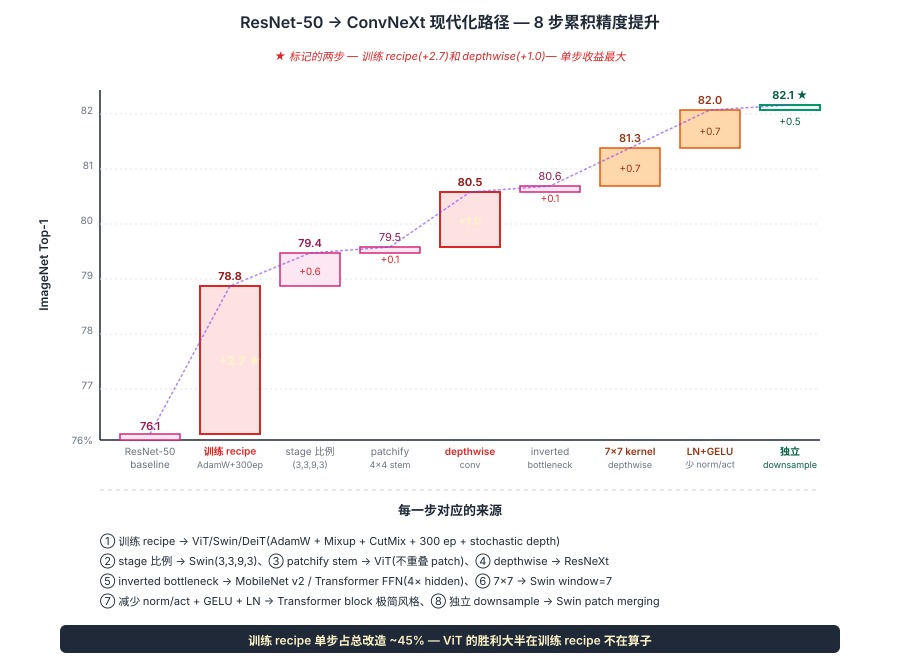
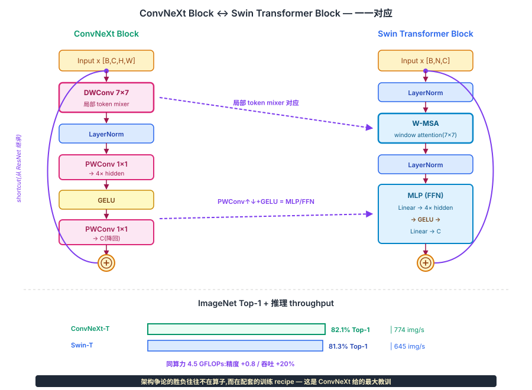

# ConvNeXt (2022)

## 前作进展

2020 年 [ViT](../08-vit/) 把 Transformer 直接应用到视觉，用纯注意力 + 大规模预训练把 ImageNet Top-1 提升至 85% 以上；Swin Transformer 在 2021 年又提出分层 / 滑窗注意力，在 detection / segmentation 上取代 CNN 的主流地位。两年时间内，视觉社区的关注点从"CNN 是默认 backbone"转向"CNN 是否会被 Transformer 替代"——CVPR 2021 上多数 backbone 论文转向 Transformer 变种。

但一个值得讨论的问题是：ViT 和 Swin 的优势中，有多少来自**注意力机制本身**，又有多少来自**和注意力一同引入的现代化设计组合**？ViT 用 LayerNorm 不用 BatchNorm、用 GELU 不用 ReLU、训练用 AdamW + Mixup + CutMix + RandAugment + Stochastic Depth + Label Smoothing 等组件，[ResNet](05-resnet.md) 2015 年的训练 recipe（SGD + 简单增强 + Dropout）则均未使用。**这是否构成公平的对比**？

Saining Xie（[ResNeXt](05-resnet.md) 一作）和 Zhuang Liu（[DenseNet](06-densenet.md) 一作）选择对这一问题进行系统对比。他们提的研究问题较为直接：**不引入任何新算子**，从 ResNet-50（76.1% Top-1）出发，把 Swin Transformer 用到的每一项现代化设计逐条引入，每引入一项就在 ImageNet 上测试精度变化。最终能达到怎样的精度？

## 核心思想

### 直觉:ViT 的优势其实大半来自训练 recipe,不是注意力机制本身

理解 ConvNeXt 真正需要先抓一件事:**2020-2021 视觉社区普遍认为 ViT / Swin 超过 CNN 是因为"注意力比卷积强"**。但 ViT 同时还引入了 LayerNorm 替代 BatchNorm / GELU 替代 ReLU / AdamW 替代 SGD / Mixup+CutMix+RandAugment 等强增强 / 300 epoch 训练 / stochastic depth 等一整套现代化设计组件,而 [ResNet](05-resnet.md) 2015 年的训练 recipe 完全没用。Liu & Xie 2022 反问:**这是不是公平对比?如果把 Swin 的所有现代化设计逐项搬回 ResNet,纯 CNN 能不能反超?**

三件事必须同时成立才让 ConvNeXt 在 2022 年 work:

- **训练 recipe 现代化是单步收益最大的改造** — ResNet-50 仅换 AdamW + 强增强 + 300 epoch 就涨 2.7%(76.1 → 78.8),比任何结构改造都重要
- **结构现代化按 Swin 路线图逐项移植** — patchify stem / depthwise 7×7 / inverted bottleneck / 减少 norm act / 独立 downsample,7 类改造逐项消融
- **LayerNorm + GELU 取代 BN + ReLU** — 不只是精度,也是工程鲁棒性 — 小 batch / 多机分布式更稳定,这是 Transformer 时代的标配组合

三件事合起来:**ConvNeXt-T 拿到 82.1% Top-1,比同算力 Swin-T(81.3%)高 0.8 点**;放大到 XL 在 ImageNet-22K 预训练下达到 **87.8% Top-1**,与 Swin-XL 持平/更优,推理 throughput 高 ~20%。这一结果给"CNN 是否被 Transformer 替代"的争论一个明确回答:**架构设计的现代化选择对结果的影响大于卷积 vs 注意力的算子之争**。


*图 1:论文 Figure 2 风格的累积精度提升瀑布图 — ResNet-50 起点 76.1%,逐项加 ① 训练 recipe(+2.7,最大单步)→ ② stage 比例(+0.6)→ ③ patchify stem(+0.1)→ ④ depthwise conv(+1.0)→ ⑤ inverted bottleneck(+0.1)→ ⑥ 7×7 大 kernel(+0.7)→ ⑦ 减少 norm/act + GELU + LN(+0.7)→ ⑧ 独立 downsample(+0.5),最终 82.0%。每一步标注来源(ViT / Swin / ResNeXt / MobileNet v2)。底部 callout:训练 recipe 单步贡献占总改造的 ~45%,说明 ViT 的胜利大半在训练 recipe 不在算子。*

### 机制一:训练 recipe 现代化 — 单步收益最大的一步

ConvNeXt 的"现代化路线图"里**最反直觉但最重要**的一步:仅把 ResNet-50 的训练 recipe 换成 ViT 时代的现代配置,精度从 76.1% → 78.8%(+2.7),**比所有结构改造单步收益加起来还多**。

| 维度 | ResNet-50 原版(2015) | ConvNeXt(2022) |
|---|---|---|
| 优化器 | SGD + Momentum 0.9 | **AdamW** |
| 学习率 schedule | 阶梯 decay | **cosine** + 20 epoch linear warmup |
| Batch size | 256 | **4096** |
| Epochs | 90-120 | **300** |
| 激活 | ReLU | **GELU** |
| 归一化 | BatchNorm | **LayerNorm** |
| 增强 | flip + crop | **Mixup + CutMix + RandAugment + RandomErasing** |
| 正则 | weight decay 1e-4 | **stochastic depth 0.1-0.5 + label smoothing + EMA** |

这套 recipe 主要由 DeiT(2021)调出来,为让 ViT 在 ImageNet-1K 上不依赖 JFT-300M 也能达到高精度。ConvNeXt 把它原样搬回 CNN —— 在 batch 4096 + cosine schedule + 20 epoch warmup 的现代设定下,AdamW 比 SGD 稳得多。**这一现象之前已有 *ResNet Strikes Back*(Wightman 2021)系统观察过,ConvNeXt 把它正式纳入 baseline**。

### 机制二:结构现代化 — depthwise 7×7 + inverted bottleneck + patchify

结构层面 ConvNeXt 按 Swin 的每个设计逐项移植:

- **Patchify stem** — 把 ResNet 的 "7×7 s=2 conv + 3×3 maxpool" 换成 "4×4 s=4 conv"(对齐 ViT/Swin 的不重叠 patch)。精度仅 +0.1,但**让后续 stage 之间的独立 downsample 成为可能**
- **Depthwise 7×7 conv** — ResNet 的 3×3 conv 换成 depthwise 7×7。depthwise 控制 FLOPs(参数从 $C^2 k^2$ 降到 $C k^2$),7×7 接近 Swin 的 window size。**论文消融 3×3/5×5/7×7/9×9/11×11 五档,7×7 饱和** —— 大 kernel 卷积可作为局部注意力的替代,不需要全局
- **Inverted bottleneck** — 借自 MobileNet v2 / Transformer FFN,通道顺序从 ResNet 的"大→小→大"反过来变成"小→大→小"(4× hidden)
- **独立 downsample 层** — Swin 风格的 patch merging:在 stage 之间用 "LN + 2×2 s=2 conv" 单独 downsample,而不是混在 block 里

整个 **ConvNeXt Block** 形态:

```
x → DWConv 7×7 → LN → PWConv 1×1(4× hidden)→ GELU → PWConv 1×1(↓)→ DropPath → +x
      └─────────────────── shortcut(从 ResNet 继承)──────────────────────┘
```

这个顺序和 **Transformer 的 FFN block 一一对应** — DWConv 7×7 是"局部 token mixer"(相当于 self-attention 位置),中间两次 PWConv + GELU 就是标准 MLP(相当于 FFN)。**整个 ConvNeXt block 可以被理解为"用 7×7 depthwise conv 替代 self-attention 的 Transformer block"**。

### 机制三:Norm/Act 极简化 — LayerNorm + GELU,每 block 只用一次

ResNet 时代每个 conv 后跟 BN + ReLU,一个 Bottleneck block 3 个 conv 就有 3 组 BN + 3 个 ReLU。Transformer block 不是这样 — 一个 block 只有 1 次 LN(attention 前)+ 1 次 LN(FFN 前)+ 1 次 GELU(FFN 中间)。

ConvNeXt 照搬这个思路:**每个 block 只保留 1 个 LayerNorm(DWConv 之后)+ 1 个 GELU(两次 PWConv 之间)**。少这几层 norm/act,精度反而涨 0.5 个点 —— ResNet 时代到处堆 BN + ReLU 的做法是有冗余的。

**为什么 LN 替代 BN?**
- BN 依赖 batch 统计,小 batch 不稳定;LN 只对单样本归一化,batch size 不敏感
- BN 推理时要切换到 running mean 模式,工程上不便
- 分布式训练里 BN 的同步开销大,LN 没有

LN 在 channel 维做归一化(channel-last 格式 [B,H,W,C]),精度涨 0.1 但**训练在小 batch / 多机分布式下更稳定**,工程价值远大于这 0.1。

### 三件套协同:训练 recipe + 结构现代化 + LN/GELU 极简 缺一不可

ConvNeXt 在 2022 年能让 CNN 反超 Swin,**不是单一改进**,而是三件套同时调到协同点 —— 任何一个抽掉 ConvNeXt 都不成立,这一点和 [ResNet](05-resnet.md) 的 `shortcut + BN + He 初始化` 协同关系一致:

- **只有训练 recipe 现代化,没有结构现代化** — 把 ResNet-50 训练 recipe 升级到 ConvNeXt 风格,精度只到 78.8%(比 Swin-T 81.3% 还差 2.5 点),无法反超
- **只有结构现代化,没有训练 recipe 升级** — 用 SGD + 弱增强训新结构,大约只能拿到 79-80% 量级,失去单步最大收益的 +2.7
- **只有训练 + 结构现代化,没有 norm/act 极简** — 仍堆 BN + ReLU,小 batch / 分布式训练不稳,大模型 ConvNeXt-L/XL 拿不到 87.8% 的 SOTA

三件套合起来才让 CNN 在 2022 年实现"对 ViT 路线的正面反超"。但 ConvNeXt 的胜利是**局部的** —— 2022 之后视觉主线整体仍转向 ViT,原因不在 ImageNet 精度,而在下游(多模态 / CLIP / SAM 等通用视觉基础模型)沿 Transformer 路线展开。ConvNeXt 给出的最大教训其实是:**架构争论的胜负往往不在算子,而在配套的训练 recipe**。


*图 2:**左** ConvNeXt Block 内部 — DWConv 7×7 → LN → PWConv↑(4× hidden)→ GELU → PWConv↓ → DropPath → + shortcut。**右** Swin Transformer Block 内部 — W-MSA(window attention)→ LN → MLP(4× hidden,GELU)→ + shortcut。中间画对应关系箭头:DWConv 7×7 ↔ W-MSA(局部 token mixer)、PWConv↑↓ + GELU ↔ MLP(FFN)。底部柱状图对比 ImageNet Top-1 + 推理 throughput:ConvNeXt-T(82.1%, 774 img/s)vs Swin-T(81.3%, 645 img/s);精度持平/略高、吞吐高 20%。*

## 训练细节

ConvNeXt 的"训练 recipe 全套现代化"在 ResNet-50 那一行就给出了 +2.7 的精度收益——这是所有改造里**单步收益最大**的一项，比任何结构改造都重要。这件事必须单独列出来。

| 维度 | ResNet-50 原版（2015） | ConvNeXt（2022） |
|---|---|---|
| 优化器 | SGD + Momentum 0.9 | **AdamW** (β₁=0.9, β₂=0.999) |
| 学习率 | 0.1，阶梯 decay | 4×10⁻³，**cosine decay** |
| 学习率 warmup | 无 | **20 epoch linear warmup** |
| 权重衰减 | 1×10⁻⁴ | 0.05 |
| Batch size | 256 | **4096** |
| Epochs | 90–120 | **300** |
| 激活函数 | ReLU | **GELU** |
| 归一化 | BatchNorm | **LayerNorm** |
| 标签平滑 | 无 | Label Smoothing 0.1 |
| Mixup | 无 | **α=0.8** |
| CutMix | 无 | **α=1.0** |
| RandAugment | 无 | **(9, 0.5)** |
| RandomErasing | 无 | **p=0.25** |
| Stochastic Depth | 无 | **0.1 (T) → 0.5 (XL)** |
| EMA | 无 | **decay=0.9999** |

**AdamW 取代 SGD** 是这套 recipe 里另一个有结构性影响的选择。SGD 在 CNN 时代是默认优化器，但它对学习率 schedule 和初始化非常敏感；AdamW 把 weight decay 从梯度更新里解耦出来（详见 [foundations/03-optimizers](../foundations/03-optimizers/)），在 Transformer 时代成了大模型训练的默认配置。ConvNeXt 把这条经验搬回 CNN——在 batch 4096、cosine schedule、20 epoch warmup 的现代训练设定下，AdamW 比 SGD 稳得多，最终精度也更高。

**强数据增强组合** 是另一项关键。Mixup + CutMix + RandAugment + RandomErasing + Label Smoothing + Stochastic Depth——这套组合由 DeiT（2021）为让 ViT 在 ImageNet-1K 上不依赖 JFT-300M 预训练也能达到高精度而调出。把这套组合应用到 ResNet-50 训练 300 epoch，仅此一项即可将精度从 76.1% 提升到 78.8%。这一结果在 2022 年之前已有研究观察到（如 *ResNet Strikes Back*, Wightman 2021），ConvNeXt 将其正式纳入 baseline。

**训练资源**：ConvNeXt-T 在 8 块 A100 上训 300 epoch 约 2 天，ConvNeXt-XL 在 32 块 A100 上训 ImageNet-22K 预训练约 1 周 + ImageNet-1K 微调 1 天。

**ImageNet Top-1 对比（224×224 输入，ImageNet-1K only）：**

| 模型 | 参数量 | FLOPs | Top-1 |
|---|---|---|---|
| ResNet-50（2015 recipe） | 25.6M | 4.1B | 76.1% |
| ResNet-50（现代 recipe） | 25.6M | 4.1B | 78.8% |
| EfficientNet-B4 | 19M | 4.2B | 82.9% |
| Swin-T | 28M | 4.5B | 81.3% |
| **ConvNeXt-T** | **29M** | **4.5B** | **82.1%** |
| Swin-B | 88M | 15.4B | 83.5% |
| **ConvNeXt-B** | **89M** | **15.4B** | **83.8%** |

**ImageNet-22K 预训练 + 1K 微调（384×384 输入）：**

| 模型 | 参数量 | Top-1 |
|---|---|---|
| Swin-L | 197M | 87.3% |
| **ConvNeXt-L** | **198M** | **87.5%** |
| Swin-XL（CLIP/SwinV2） | 350M | 87.6% |
| **ConvNeXt-XL** | **350M** | **87.8%** |

87.8% 这一数值是 2022 年 CNN 在 ImageNet 上对齐并略超 Swin 的代表性结果——同参数下 ConvNeXt 与 Swin 持平或略高，同时**推理 throughput 比 Swin 高约 20%**（卷积比 window attention 更 GPU 友好）。

## 关键代码

下面这段实现 ConvNeXt block 的核心：depthwise 7×7 → LN → pointwise (4× hidden) → GELU → pointwise (↓) → DropPath → + shortcut。注意一个细节：LN 在 channel-last 格式上算（即 [B, H, W, C]），所以中间有 permute——这是 ConvNeXt 实现里最容易踩坑的一点。

```python
import torch
import torch.nn as nn

class ConvNeXtBlock(nn.Module):
    """ConvNeXt 的基本砖：DWConv 7×7 → LN → PWConv↑ → GELU → PWConv↓ → DropPath + shortcut。"""

    def __init__(self, dim: int, drop_path: float = 0.0, layer_scale_init: float = 1e-6):
        super().__init__()
        # Depthwise 7×7：局部 token mixer，替代 self-attention 的位置
        self.dwconv = nn.Conv2d(dim, dim, kernel_size=7, padding=3, groups=dim)
        # LayerNorm 作用在 channel 维（channel-last 格式）
        self.norm   = nn.LayerNorm(dim, eps=1e-6)
        # 两次 1×1 pointwise：先升 4× 再降回，对应 Transformer 的 FFN
        self.pwconv1 = nn.Linear(dim, 4 * dim)         # 用 Linear 实现 1×1 pwconv（更快）
        self.act     = nn.GELU()
        self.pwconv2 = nn.Linear(4 * dim, dim)
        # Layer Scale：每个通道一个可学习的缩放系数，初值极小（1e-6）
        self.gamma = nn.Parameter(layer_scale_init * torch.ones(dim))
        # Stochastic Depth：按概率随机丢整个 block
        self.drop_path = nn.Identity() if drop_path == 0.0 else DropPath(drop_path)

    def forward(self, x: torch.Tensor) -> torch.Tensor:
        identity = x                                   # [B, C, H, W]
        x = self.dwconv(x)                             # [B, C, H, W]
        x = x.permute(0, 2, 3, 1)                      # → [B, H, W, C] for LN/Linear
        x = self.norm(x)
        x = self.pwconv1(x); x = self.act(x); x = self.pwconv2(x)
        x = self.gamma * x                             # Layer Scale
        x = x.permute(0, 3, 1, 2)                      # → [B, C, H, W]
        return identity + self.drop_path(x)            # 残差连接，沿用 ResNet
```

整个 ConvNeXt-T 就是 stem (4×4 s=4) + 4 stage 的 ConvNeXt Block 堆叠 (3, 3, 9, 3)，stage 之间用 "LN + 2×2 s=2 conv" 做独立 downsample。`identity + drop_path(x)` 这一行就是 ConvNeXt 继承自 ResNet 的最重要遗产——shortcut connection 七年后依然没变。

## 影响 / 后续

ConvNeXt 是 CNN 家族这条主线上**近期具有重要影响的工作之一**。其结果——ImageNet-22K 预训练下 **87.8% Top-1**，吞吐量高于 Swin——对"CNN 是否被 Transformer 替代"这一 2020–2021 年讨论较多的问题给出了一定的回答：在视觉这一具体任务上，**架构设计的现代化选择对结果的影响大于卷积 vs 注意力的算子之争**，CNN 的局部归纳偏置 + Transformer 的现代训练方法可以视为互补而非互斥的组合。

但 ConvNeXt 的优势是局部的。**2022 年之后视觉主线整体转向 ViT 路线**——原因不在 ImageNet 单任务的精度，而在更下游的方向（多模态、视觉-语言对齐、大规模自监督预训练、SAM 这类通用视觉基础模型、CLIP 这类跨模态对齐）多数沿 Transformer 路线展开。ConvNeXt 2023 年发布 V2 版本，加入 GRN（Global Response Normalization）和 MAE 风格的自监督预训练，使 CNN 在自监督方向上跟上 ViT 的水平——但社区关注度已转向多模态大模型，纯视觉 backbone 的研究关注度有所下降。

回望整条 CNN 演化路径：[AlexNet](02-alexnet.md) 让端到端学到的特征超过手工特征 → [VGG](03-vgg.md) / [Inception](04-inception.md) 把深度推到 20 层 → [ResNet](05-resnet.md) 用 shortcut 实现 152 层稳定训练 → [DenseNet](06-densenet.md) / [EfficientNet](07-efficientnet.md) 在参数效率方向上持续优化 → ConvNeXt 用现代训练方法说明 CNN 在视觉任务上仍具竞争力。这条十年的路径在 ConvNeXt 处形成了一个相对完整的阶段。视觉主线之后的发展请参考 ViT 章节。

→ [../08-vit/](../08-vit/) · 视觉主线已移交，多模态 / 大模型大多从 ViT 路线展开
→ [../foundations/02-activations/](../foundations/02-activations/) · GELU 是 Transformer/ConvNeXt 的标配
→ [../foundations/04-normalization/](../foundations/04-normalization/) · LayerNorm 取代 BatchNorm 是关键改造之一
→ [../foundations/03-optimizers/](../foundations/03-optimizers/) · AdamW 取代 SGD 在大模型时代成为新标配
