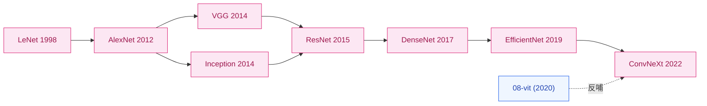

# CNN 卷积神经网络

> **把图像从手工特征解放出来，让模型自己学层级表征。**

## 一句话定位

CNN 家族解决的是视觉这件事里最根本的一个问题——**把"特征工程"换成"特征学习"**。AlexNet 之前，ImageNet Top-5 错误率被 SIFT/HOG + SVM 这类手工特征 + 浅分类器**卡在 25–26%** 寸步难行；2012 年 AlexNet 一脚把它踹到 15.3%，从那一刻起"端到端学到的特征碾压所有手工特征"成了视觉社区的新共识。这条路十年间从 8 层走到 152 层、从 60M 参数压到 5M、再从 5M 推到 87.8% Top-1。视觉主线在 2020 年被 [ViT](../08-vit/) 抢走，但 2022 年的 ConvNeXt 又用现代训练 recipe 证明：CNN 没死，只是设计选择需要现代化。

## 概念本身

CNN 之所以能换掉手工特征，靠的是把三件事一起写进结构里：

1. **局部连接**——每个神经元只看一小块输入，而不是像 MLP 那样全连接，"邻居像素更相关"这件先验事实直接进了结构
2. **参数共享**——同一组滤波器在空间上扫整张图，参数量与图像尺寸**解耦**（只取决于卷积核和通道数）
3. **层级特征**——浅层学边缘 / 纹理，中层学局部组件，深层学语义概念，特征自然按抽象级别堆叠

卷积层的数学是在二维平面共享一组小滤波器：

$$
y_{i,j,k} = \sum_{c,u,v} w_{c,u,v,k} \cdot x_{i+u,\, j+v,\, c} + b_k
$$

降采样（池化）把空间分辨率减半、让感受野逐层放大：

$$
y_{i,j,k} = \max_{(u,v)\in \mathcal{R}} x_{i+u,\, j+v,\, k}
$$

这套范式 1998 年由 LeNet 第一次完整提出来。后续 20 多年的视觉 CNN，骨架都没离开这三件事，变的只是**深度、宽度、连接方式、归一化与训练 recipe**。

*图 1：CNN 家族演进，箭头方向是技术继承关系；虚线表示 ViT 反哺 ConvNeXt。*

## 子时间线

| 年份 | 名字 | 关键贡献 | 之前卡在哪 |
|------|------|---------|-----------|
| 1998 | [LeNet](01-lenet.md) | 定义卷积+池化+全连接范式 | MLP 把图像压平丢失邻域信息 |
| 2012 | [AlexNet](02-alexnet.md) | 深 CNN + ReLU + Dropout + 双 GPU 训练 | 手工特征 Top-5 卡 26% |
| 2014 | [VGG](03-vgg.md) | 纯 3×3 堆叠，深度即正义 | 网络该深到哪、用什么 kernel 没共识 |
| 2014 | [Inception](04-inception.md) | 多分支并行 + 1×1 降维 | VGG 参数量太大、计算昂贵 |
| 2015 | [ResNet](05-resnet.md) | 残差连接终结深度退化 | 20 层之后训练误差反而上升 |
| 2017 | [DenseNet](06-densenet.md) | 稠密连接，每层接收所有前层 | ResNet 的"加法"还可以更激进 |
| 2019 | [EfficientNet](07-efficientnet.md) | 复合缩放，精度 × 效率帕累托最优 | depth/width/resolution 怎么平衡靠人手调 |
| 2022 | [ConvNeXt](08-convnext.md) | 用 ViT 设计哲学反哺纯 CNN | CNN 被 ViT 抢走主线后能否反扑 |

> ConvNeXt 之后，视觉主线已经事实上交给了 ViT 家族。但 CNN 的局部归纳偏置在数据少 / 空间结构强的场景仍然是首选。

## 依赖与延伸

**前置（foundations）：**

- [`../foundations/01-neural-network-basics/`](../foundations/01-neural-network-basics/) — 反向传播
- [`../foundations/02-activations/`](../foundations/02-activations/) — ReLU/GELU
- [`../foundations/03-optimizers/`](../foundations/03-optimizers/) — SGD/Adam/AdamW
- [`../foundations/04-normalization/`](../foundations/04-normalization/) — BatchNorm/LayerNorm
- [`../foundations/07-regularization/`](../foundations/07-regularization/) — Dropout

**通向哪些家族：**

- [`../04-gan/`](../04-gan/) — 把转置卷积用于生成
- [`../08-vit/`](../08-vit/) — Transformer 接管视觉主线
- [`../10-diffusion/`](../10-diffusion/) — UNet（CNN 变体）成为扩散模型骨架
