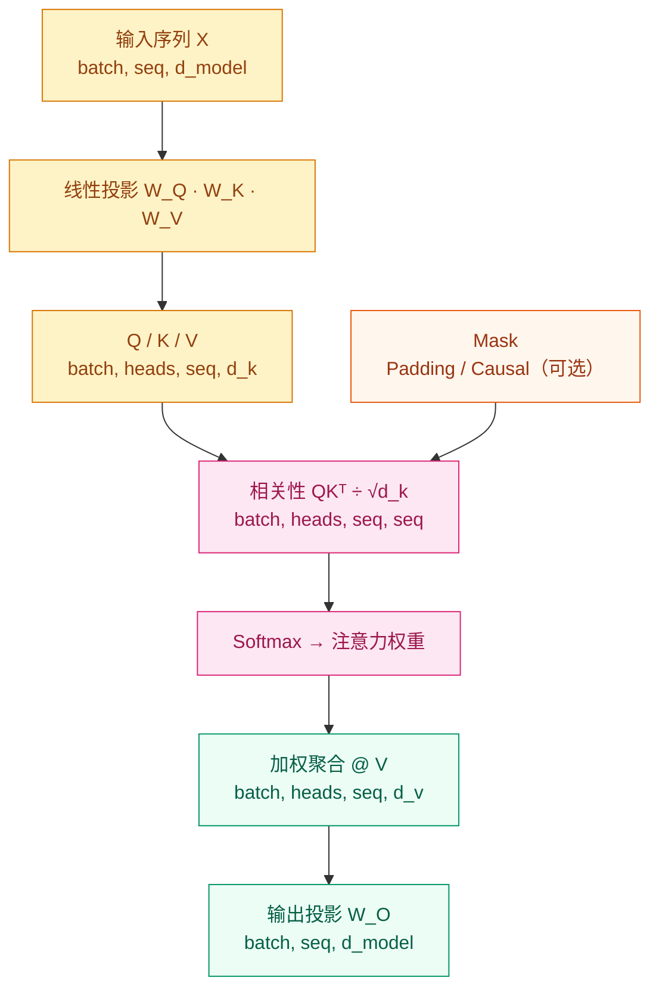

# 为什么 RNN 的"记忆"撑不住长句子？—— 注意力机制

## 这个问题从哪来

> 2014 年，Sutskever 等人用 Seq2Seq 做机器翻译，编码器把整段输入压缩成**一个**固定长度的向量，再由解码器生成译文。句子短的时候还好，句子一长，那个向量就装不下全部信息了——早期词的语义被后来的词覆盖，翻译质量随句子长度急速下滑。Bahdanau 注意到：翻译每个词时，解码器其实只需要关注输入的某几个位置，不需要把所有信息塞进一个瓶子。这就是注意力机制的起点。

## 学习目标

完成后你应能回答：

1. Query / Key / Value 各自承担什么角色？为什么要除以 √d_k？
2. 自注意力、交叉注意力、多头注意力分别解决什么问题？
3. 训练出现 NaN、推理显存爆炸时，优先排查哪几个点？

---

## 1. 直觉

想象你在一堆文档里检索信息：

- **Query**：你的检索请求（"猫在哪里"）
- **Key**：每份文档的索引标签（"sat on the mat"、"looked at the bird"……）
- **Value**：文档的真实内容

你先拿 Query 和每个 Key 比对相关性，得到一组权重，再按权重把 Value 加权混合——高度相关的文档贡献多，不相关的贡献接近零。

注意力机制做的就是这件事，只不过 Query、Key、Value 都是向量，"相关性"是点积。

> 你要记住：`QKᵀ` 算相关性，`softmax` 归一化成权重，`@ V` 做加权聚合。三步，缺一不可。

---

## 2. 机制

### 2.1 核心公式

$$\text{Attention}(Q,K,V) = \text{softmax}\left(\frac{QK^\top}{\sqrt{d_k}}\right)V$$

除以 √d_k 的原因：d_k 大时点积值方差随维度增大，softmax 进入饱和区，梯度消失，训练变慢。缩放把方差钉在 1 附近。

### 2.2 三类注意力

| 类型 | Q 来自 | K/V 来自 | 用在哪 |
|------|--------|----------|--------|
| 自注意力 | 本序列 | 本序列 | Encoder 内部建模上下文 |
| 因果自注意力 | 本序列 | 本序列（masked）| Decoder 自回归生成 |
| 交叉注意力 | Decoder | Encoder 输出 | Decoder 关注输入序列 |

### 2.3 计算流图



### 2.4 渐进式实现

**Step 1：最小可运行版**（验证 QKV 计算流程）

```python
# 按相关性做加权聚合
# softmax(QK^T / √d_k) @ V
# 时间 O(n²d)，空间 O(n²)
import math, torch

def attention(q, k, v):
    """
    Args:
        q, k, v: (batch, seq, d_k)
    Returns:
        context: (batch, seq, d_k)
        weights: (batch, seq, seq)
    """
    d_k = q.size(-1)
    scores = q @ k.transpose(-2, -1) / math.sqrt(d_k)
    weights = torch.softmax(scores, dim=-1)
    return weights @ v, weights
```

**Step 2：加 Mask**（防止 Decoder 看到未来 token，防止关注 padding 位置）

```python
def attention(q, k, v, mask=None):
    d_k = q.size(-1)
    scores = q @ k.transpose(-2, -1) / math.sqrt(d_k)
    if mask is not None:
        scores = scores.masked_fill(mask == 0, float("-inf"))
    weights = torch.softmax(scores, dim=-1)
    return weights @ v, weights
```

**Step 3：多头注意力**（单头只能建模一种关系，多头并行建模不同子空间——语法、语义、位置……）

```python
import torch.nn as nn

class MultiHeadAttention(nn.Module):
    # 将 d_model 切分为 num_heads 个子空间，各自独立计算注意力
    # MultiHead(Q,K,V) = Concat(head_1,...,head_h) W_O
    # 时间 O(n²d)，与单头相同；头数不改变总计算量
    def __init__(self, d_model: int, num_heads: int):
        super().__init__()
        assert d_model % num_heads == 0
        self.h = num_heads
        self.d_k = d_model // num_heads
        self.w_q = nn.Linear(d_model, d_model, bias=False)
        self.w_k = nn.Linear(d_model, d_model, bias=False)
        self.w_v = nn.Linear(d_model, d_model, bias=False)
        self.w_o = nn.Linear(d_model, d_model, bias=False)

    def forward(self, query, key, value, mask=None):
        """
        Args:
            query, key, value: (batch, seq, d_model)
            mask: (batch, 1, 1, seq_k) 或 None
        Returns:
            out:     (batch, seq, d_model)
            weights: (batch, heads, seq_q, seq_k)
        """
        bsz = query.size(0)
        q = self.w_q(query).view(bsz, -1, self.h, self.d_k).transpose(1, 2)
        k = self.w_k(key).view(bsz, -1, self.h, self.d_k).transpose(1, 2)
        v = self.w_v(value).view(bsz, -1, self.h, self.d_k).transpose(1, 2)
        ctx, weights = attention(q, k, v, mask)
        ctx = ctx.transpose(1, 2).contiguous().view(bsz, -1, self.h * self.d_k)
        return self.w_o(ctx), weights
```

**Step 4：生产级**（标准实现显存 O(n²)，Flash Attention 用分块计算降到 O(n)）

```python
# PyTorch 2.0+ 内置 Flash Attention，直接调用：
out = torch.nn.functional.scaled_dot_product_attention(
    q, k, v,
    attn_mask=mask,
    dropout_p=0.1 if self.training else 0.0,
    is_causal=False,  # 自回归生成时设为 True，自动构建 Causal Mask
)
# 等价于手写版，显存从 O(n²) 降至 O(n)，速度快 2–4×
```

---

## 3. 工程陷阱

1. **d_k 过大、未缩放** → softmax 饱和，梯度消失，loss 停止下降
2. **Causal mask 方向写反** → 训练时泄露未来 token，推理输出退化
3. **多头 reshape 顺序错误**（直接 `.view` 代替先 `.transpose` 再 `.view`）→ 头间数据混乱，注意力权重无意义
4. **长序列用标准注意力** → 显存 OOM，优先换 `scaled_dot_product_attention` 或降序列长度
5. **推理忘记 `model.eval()`** → Dropout 仍激活，注意力权重随机，输出不稳定

---

## 演进笔记

> 注意力机制解决了 Seq2Seq 的信息瓶颈，但 2017 年 Transformer 把 RNN 整个扔掉之后，Self-Attention 本身成了新的瓶颈——复杂度 O(n²)，序列一长显存爆掉。2019–2022 年，Longformer（稀疏化）、Linformer（低秩近似）、Flash Attention（IO 感知分块）从不同角度尝试突破。Flash Attention 最终成为工业标准，PyTorch 2.0 直接内置。

→ 下一步：[Transformer 架构](../transformer-architecture/README.md) — 看注意力如何和 FFN、归一化、位置编码组成完整的 Transformer Block

---

**上一章**: [序列模型 RNN/LSTM](../../02-Neural-Networks/sequence-models/README.md) | **下一章**: [Transformer 架构](../transformer-architecture/README.md)
