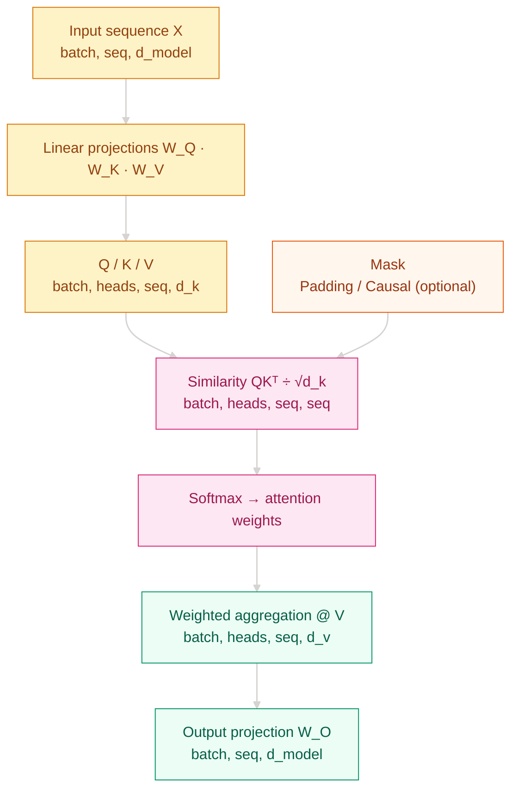

[English](README_EN.md) | [中文](README.md)

# Why RNN Memory Breaks on Long Sentences — Attention Mechanisms

## Where This Problem Came From

> In 2014, Seq2Seq translation models compressed an entire source sentence into one fixed-size vector, and the decoder had to recover everything from that bottleneck. Short sentences worked; long ones did not. Bahdanau noticed that the decoder did not need every source position equally. At each step, it only needed to focus on the relevant words.

## Learning Goals

After finishing this chapter, you should be able to answer:

1. What do Query, Key, and Value each do, and why do we divide by √d_k?
2. What problems do self-attention, cross-attention, and multi-head attention solve?
3. When training explodes into NaNs or inference runs out of memory, what should you check first?

---

## 1. Intuition

Think of searching through a pile of documents:

- **Query**: your search request, like "where is the cat?"
- **Key**: the index tags attached to each document
- **Value**: the actual content inside each document

You compare the Query with every Key, turn the relevance scores into weights, and then mix the Values according to those weights. Relevant documents contribute more; irrelevant ones contribute less.

Attention does the same thing, except the Query, Key, and Value are vectors and relevance is computed with a dot product.

> Key takeaway: `QKᵀ` measures relevance, `softmax` turns it into weights, and `@ V` performs the weighted aggregation.

## 2. Mechanism

### 2.1 Core Formula

$$\text{Attention}(Q,K,V) = \text{softmax}\left(\frac{QK^\top}{\sqrt{d_k}}\right)V$$

The √d_k scaling keeps dot-product variance under control. Without it, large d_k pushes softmax into saturation, gradients shrink, and training slows down.

### 2.2 Three Attention Types

| Type | Q Comes From | K/V Come From | Used For |
|------|--------------|---------------|----------|
| Self-attention | Same sequence | Same sequence | Context modeling inside the encoder |
| Causal self-attention | Same sequence | Same sequence, masked | Autoregressive decoding |
| Cross-attention | Decoder | Encoder outputs | Let the decoder focus on the source sequence |

### 2.3 Computation Flow



### 2.4 Progressive Implementation

**Step 1: Solve "compute relevance first"** - minimal runnable version.

```python
# Weighted aggregation by relevance
# softmax(QK^T / √d_k) @ V
# Time O(n²d), space O(n²)
import math, torch

def attention(q, k, v):
    """
    Args:
        q, k, v: (batch, seq, d_k)
    Returns:
        context: (batch, seq, d_k)
        weights: (batch, seq, seq)
    """
    d_k = q.size(-1)
    scores = q @ k.transpose(-2, -1) / math.sqrt(d_k)
    weights = torch.softmax(scores, dim=-1)
    return weights @ v, weights
```

**Step 2: Solve "do not look at future tokens or padding"** - add masking.

```python
def attention(q, k, v, mask=None):
    d_k = q.size(-1)
    scores = q @ k.transpose(-2, -1) / math.sqrt(d_k)
    if mask is not None:
        scores = scores.masked_fill(mask == 0, float("-inf"))
    weights = torch.softmax(scores, dim=-1)
    return weights @ v, weights
```

**Step 3: Solve "model multiple relationships in parallel"** - multi-head attention.

```python
import torch.nn as nn

class MultiHeadAttention(nn.Module):
    # Split d_model into num_heads subspaces and compute attention independently
    # MultiHead(Q,K,V) = Concat(head_1,...,head_h) W_O
    # Time O(n²d), same as single-head; heads do not change total compute
    def __init__(self, d_model: int, num_heads: int):
        super().__init__()
        assert d_model % num_heads == 0
        self.h = num_heads
        self.d_k = d_model // num_heads
        self.w_q = nn.Linear(d_model, d_model, bias=False)
        self.w_k = nn.Linear(d_model, d_model, bias=False)
        self.w_v = nn.Linear(d_model, d_model, bias=False)
        self.w_o = nn.Linear(d_model, d_model, bias=False)

    def forward(self, query, key, value, mask=None):
        """
        Args:
            query, key, value: (batch, seq, d_model)
            mask: (batch, 1, 1, seq_k) or None
        Returns:
            out: (batch, seq, d_model)
            weights: (batch, heads, seq_q, seq_k)
        """
        bsz = query.size(0)
        q = self.w_q(query).view(bsz, -1, self.h, self.d_k).transpose(1, 2)
        k = self.w_k(key).view(bsz, -1, self.h, self.d_k).transpose(1, 2)
        v = self.w_v(value).view(bsz, -1, self.h, self.d_k).transpose(1, 2)
        ctx, weights = attention(q, k, v, mask)
        ctx = ctx.transpose(1, 2).contiguous().view(bsz, -1, self.h * self.d_k)
        return self.w_o(ctx), weights
```

**Step 4: Solve "long sequences need better memory and throughput"** - production-grade attention.

```python
# PyTorch 2.0+ built-in Flash Attention
out = torch.nn.functional.scaled_dot_product_attention(
    q, k, v,
    attn_mask=mask,
    dropout_p=0.1 if self.training else 0.0,
    is_causal=False,
)
# Equivalent to the handwritten version, but faster and lower-memory on long sequences
```

---

## 3. Engineering Pitfalls

1. **d_k too large without scaling** → softmax saturates, gradients vanish, loss stops improving
2. **Causal mask direction is reversed** → future tokens leak during training, generation degrades
3. **Wrong reshape order in multi-head attention** → heads are mixed up and weights stop making sense
4. **Using standard attention on long sequences** → OOM; switch to `scaled_dot_product_attention` or shorten the sequence
5. **Forgetting `model.eval()` during inference** → dropout stays active and outputs become unstable

---

## Evolution Notes

> Attention solved the Seq2Seq bottleneck, but once Transformer removed recurrence in 2017, self-attention itself became the new bottleneck: O(n²) cost grows too fast on long sequences. From 2019 to 2022, Longformer, Linformer, and Flash Attention attacked that limit from different angles. Flash Attention eventually became the industrial default, and PyTorch 2.0 ships it directly.

→ Next: [Transformer Architecture](../transformer-architecture/README_EN.md) — see how attention combines with FFN, normalization, and positional encoding inside a Transformer block

---

**Previous**: [Recurrent Networks and Seq2Seq](../recurrent-networks/README_EN.md) | **Next**: [Transformer Architecture](../transformer-architecture/README_EN.md)
