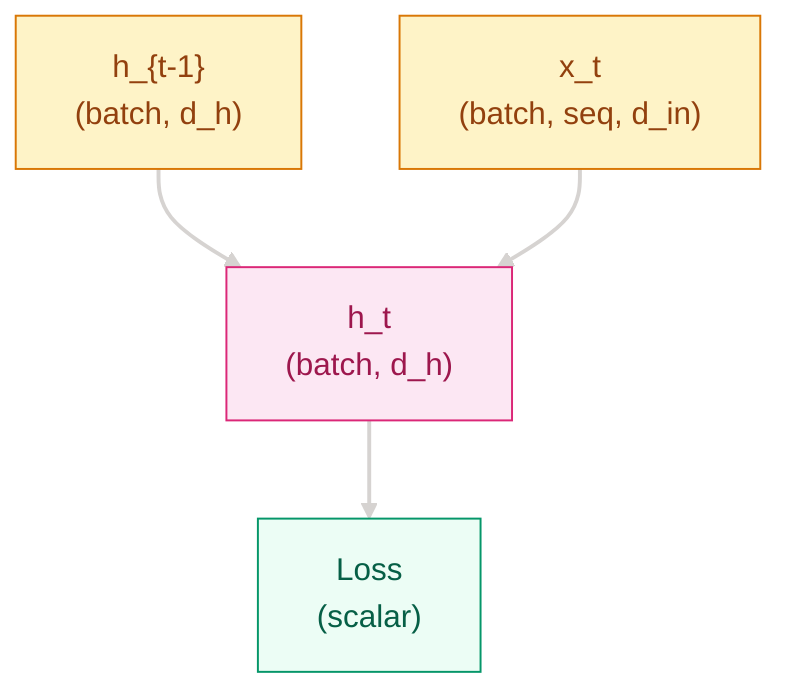

# 为什么固定窗口不够用了？—— 循环神经网络与 Seq2Seq

## 这个问题从哪来
> 1997 年，Hochreiter 与 Schmidhuber 提出 LSTM，核心动机是普通循环网络难以跨长时间步保留信息。到 2014 年，Sutskever、Vinyals、Le 把 LSTM 推到 Seq2Seq 机器翻译，Cho 等人提出更轻量的 GRU，循环网络正式成为语言序列建模主力。
> 它解决了“怎么把可变长上下文压进状态里”的问题，却也暴露出两个硬伤：长依赖难训，以及把整句压成固定向量的瓶颈。后面的 Attention，正是从这里长出来的。

## 学习目标

完成本章后，你应能回答：

1. RNN 为什么比固定窗口方法更适合序列建模？
2. LSTM / GRU 缓解了什么问题，代价是什么？
3. Seq2Seq 为什么有效，又为什么最终逼出了 Attention？

## 1. 直觉

用“读句子时要记住前文”的类比解释：
- 固定窗口像只看最近几个词，超出窗口就失忆
- RNN 像拿着一张会不断改写的便签，边读边更新上下文
- Seq2Seq 像先把整句话听完再复述，但如果便签太小，长句信息会被挤丢

> 你要记住：RNN 相比固定窗口方法的优势，不是“看得更复杂”，而是“能把历史状态持续带到下一步”。

## 2. 机制

### 2.1 基本 RNN：状态沿时间传递

给出最小公式：

$$
h_t = \tanh(W_h h_{t-1} + W_x x_t + b)
$$

说明时间展开与参数共享。

### 2.2 为什么难训：BPTT、梯度消失与梯度爆炸

解释反向传播沿时间链条展开，长链导致梯度连乘：
- 小于 1 时快速衰减
- 大于 1 时快速放大



> 你要记住：RNN 的核心瓶颈主要不是表达力不够，而是长链路优化太难。

### 2.3 LSTM：显式记忆通道

保留关键更新：

$$
f_t = \sigma(W_f[h_{t-1}, x_t] + b_f)
$$

$$
i_t = \sigma(W_i[h_{t-1}, x_t] + b_i)
$$

$$
o_t = \sigma(W_o[h_{t-1}, x_t] + b_o)
$$

$$
\tilde{C}_t = \tanh(W_C[h_{t-1}, x_t] + b_C)
$$

$$
C_t = f_t \odot C_{t-1} + i_t \odot \tilde{C}_t
$$

$$
h_t = o_t \odot \tanh(C_t)
$$

解释遗忘门、输入门、输出门分别在控制什么。

### 2.4 GRU：更轻量的门控

给出关键更新：

$$
z_t = \sigma(W_z[h_{t-1}, x_t]), \quad r_t = \sigma(W_r[h_{t-1}, x_t])
$$

$$
\tilde{h}_t = \tanh(W[r_t \odot h_{t-1}, x_t]), \quad
h_t = (1-z_t) \odot h_{t-1} + z_t \odot \tilde{h}_t
$$

补一个 `LSTM vs GRU` 对比表，列至少 5 列：

| 对比项 | LSTM | GRU | 训练速度 | 长依赖稳定性 | 适用场景 |
|------|------|------|----------|--------------|----------|
| 门控结构 | 输入门 + 遗忘门 + 输出门 | 更新门 + 重置门 | LSTM 较慢 | LSTM 更稳 | LSTM 适合更复杂记忆 |
| 参数量 | 更多 | 更少 | GRU 更快 | GRU 略弱但实用 | GRU 适合资源受限 |

### 2.5 Seq2Seq：编码器-解码器

解释：
- 编码器把输入序列压成上下文向量
- 解码器根据这个向量逐步生成输出
- 这让翻译、摘要、对话式生成第一次能端到端训练

再明确其瓶颈：
- 输入越长，固定长度上下文越容易信息拥塞

> 你要记住：Seq2Seq 把“序列理解”扩展成了“序列生成”，但也把固定长度上下文的瓶颈彻底暴露出来。

### 2.6 渐进式实现

必须包含 3 个步骤，且每步注释写“解决什么问题”：

```python
# 解决什么问题：先用最小 LSTM 跑通序列编码
import torch
import torch.nn as nn

torch.manual_seed(42)

lstm = nn.LSTM(
    input_size=64,
    hidden_size=128,
    num_layers=1,
    batch_first=True,
)
x = torch.randn(4, 10, 64)
out, (h_n, c_n) = lstm(x)
print(out.shape, h_n.shape, c_n.shape)
```

```python
# 解决什么问题：变长序列不能直接取 out[:, -1, :]
import torch
import torch.nn as nn
from torch.nn.utils.rnn import pack_padded_sequence, pad_packed_sequence

torch.manual_seed(42)

embed = torch.randn(3, 5, 16)
lengths = torch.tensor([5, 3, 2])
encoder = nn.GRU(16, 32, batch_first=True, bidirectional=True)
packed = pack_padded_sequence(
    embed, lengths.cpu(), batch_first=True, enforce_sorted=False
)
packed_out, _ = encoder(packed)
out, _ = pad_packed_sequence(packed_out, batch_first=True)
last_idx = (lengths - 1).clamp(min=0)
final = out[torch.arange(out.size(0)), last_idx]
print(final.shape)
```

```python
# 解决什么问题：长序列训练容易梯度爆炸，需要先做裁剪再更新
import torch
import torch.nn as nn

torch.manual_seed(42)

model = nn.LSTM(32, 64, batch_first=True)
head = nn.Linear(64, 2)
x = torch.randn(8, 20, 32)
y = torch.randint(0, 2, (8,))
criterion = nn.CrossEntropyLoss()
optimizer = torch.optim.Adam(list(model.parameters()) + list(head.parameters()), lr=1e-3)

out, _ = model(x)
logits = head(out[:, -1, :])
loss = criterion(logits, y)
loss.backward()
torch.nn.utils.clip_grad_norm_(list(model.parameters()) + list(head.parameters()), 1.0)
optimizer.step()
optimizer.zero_grad()
print(f"loss={loss.item():.4f}")
```

## 3. 工程陷阱

1. 长序列训练不稳定 -> 梯度爆炸，loss 突然飙升，先加 `clip_grad_norm_`
2. padding / length 处理错误 -> 取到了 padding 位置而不是真实最后一步
3. 误把 LSTM / GRU 当成长上下文万能解 -> 长输入仍受固定状态瓶颈限制
4. 低估串行计算成本 -> 序列越长，训练吞吐越吃亏

## 演进笔记

> RNN 解决了“序列能端到端建模”的问题，LSTM / GRU 让长依赖更可训练，Seq2Seq 把循环结构推进到生成任务；但固定长度上下文和串行计算仍然限制了规模化训练。于是问题自然推进到“能不能每一步直接看见所有输入位置”。
> → 详见 [注意力机制](../attention-mechanisms/README.md)

---
**上一章**：[语言线概览](../README.md) | **下一章**：[注意力机制](../attention-mechanisms/README.md)
