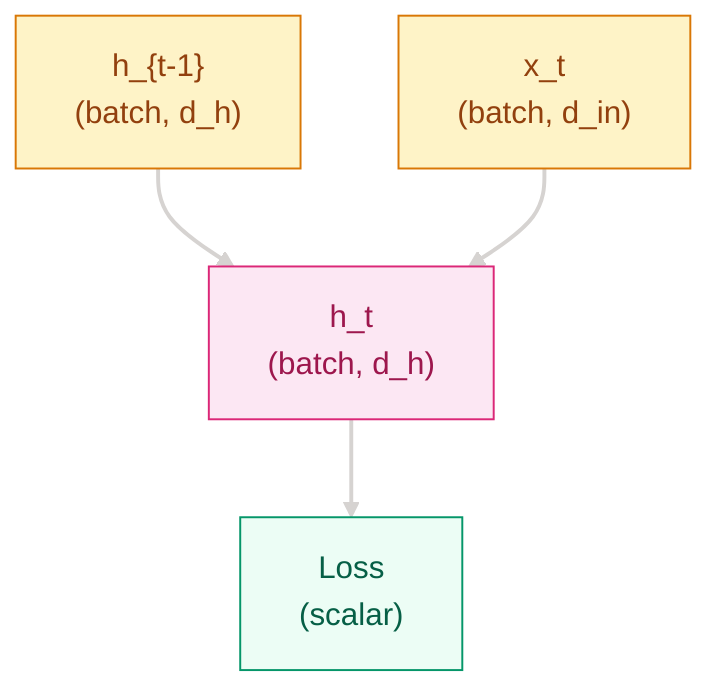

# Why Fixed Windows Fall Short — Recurrent Networks and Seq2Seq

**[English](README_EN.md) | [中文](README.md)**

## Where This Problem Came From
> In 1997, Hochreiter and Schmidhuber introduced LSTM to address a basic limitation of vanilla recurrent networks: they struggled to preserve information across long time steps. By 2014, Sutskever, Vinyals, and Le turned LSTM into Seq2Seq for machine translation, while Cho and others proposed the lighter GRU. Recurrent networks had become the main tool for sequence modeling.
> They solved the question of how to compress variable-length context into state, but they also exposed two hard problems: long-range dependencies were still difficult to optimize, and squeezing an entire sentence into a fixed-size vector created a bottleneck. Attention grew out of that gap.

## Learning Goals

By the end of this chapter, you should be able to answer:

1. Why are RNNs better suited than fixed windows for sequence modeling?
2. What problems do LSTM / GRU reduce, and what trade-offs do they introduce?
3. Why did Seq2Seq work, and why did it eventually force the move toward Attention?

## 1. Intuition

A useful analogy is "remembering earlier words while reading a sentence":
- Fixed windows are like only looking at the last few words; everything outside the window is forgotten
- RNNs are like a sticky note that gets rewritten at every step, carrying a rolling summary of the past
- Seq2Seq is like listening to a whole sentence first and then repeating it, but if the note is too small, long sentences get compressed too much

> Remember this: the advantage of RNNs over fixed-window methods is not that they "see more complexity," but that they can keep carrying history forward step by step.

## 2. Mechanism

### 2.1 Basic RNN: state flows through time

The minimal RNN update is:

$$
h_t = \tanh(W_h h_{t-1} + W_x x_t + b)
$$

When you unroll this across time, the network becomes a chain that keeps passing hidden state forward, while every time step reuses the same parameters $W_h$, $W_x$, and $b$. That parameter sharing is what lets RNNs handle variable-length inputs without creating a separate model for each sequence length.

### 2.2 Why training is hard: BPTT, vanishing gradients, and exploding gradients

Backpropagation unfolds through time, so gradients multiply along a long chain:
- If the factors are smaller than 1, gradients quickly shrink
- If the factors are larger than 1, gradients quickly grow



> Remember this: the main bottleneck of RNNs is not just limited expressiveness, but the difficulty of optimizing long chains.

### 2.3 LSTM: an explicit memory path

LSTM adds a dedicated cell-state path, with the core updates below:

$$
f_t = \sigma(W_f[h_{t-1}, x_t] + b_f)
$$

$$
i_t = \sigma(W_i[h_{t-1}, x_t] + b_i)
$$

$$
o_t = \sigma(W_o[h_{t-1}, x_t] + b_o)
$$

$$
\tilde{C}_t = \tanh(W_C[h_{t-1}, x_t] + b_C)
$$

$$
C_t = f_t \odot C_{t-1} + i_t \odot \tilde{C}_t
$$

$$
h_t = o_t \odot \tanh(C_t)
$$

The forget gate controls how much old memory to keep, the input gate controls how much new candidate information to write, and the output gate controls how much of the cell state to expose as the hidden state. The gain is not just extra structure, but finer control over what gets preserved across long spans.

### 2.4 GRU: a lighter gated alternative

GRU folds the gating logic into a smaller update rule:

$$
z_t = \sigma(W_z[h_{t-1}, x_t]), \quad r_t = \sigma(W_r[h_{t-1}, x_t])
$$

$$
\tilde{h}_t = \tanh(W[r_t \odot h_{t-1}, x_t]), \quad
h_t = (1-z_t) \odot h_{t-1} + z_t \odot \tilde{h}_t
$$

The trade-off is easier to see side by side:

| Comparison | LSTM | GRU | Training Speed | Long-Range Stability | Best Fit |
|------|------|------|----------|--------------|----------|
| Gating structure | Input gate + forget gate + output gate | Update gate + reset gate | LSTM is slower | LSTM is more stable | LSTM fits more complex memory |
| Parameter count | More | Fewer | GRU is faster | GRU is slightly weaker but practical | GRU fits resource-limited settings |

### 2.5 Seq2Seq: encoder-decoder

Seq2Seq turns sequence modeling into an encoder-decoder pipeline:
- The encoder compresses the input sequence into a context vector
- The decoder generates the output sequence step by step from that vector
- This made translation, summarization, and dialogue-style generation practical to train end to end

The bottleneck is straightforward:
- The longer the input, the easier it is for a fixed-length context to become overloaded with information

> Remember this: Seq2Seq extended "sequence understanding" into "sequence generation," but it also made the fixed-length context bottleneck impossible to ignore.

### 2.6 Progressive implementation

The four snippets below mirror a common implementation path, and each one targets a specific engineering problem:

```python
# Step 1 Minimal recurrent encoding: run the smallest LSTM end to end
import torch
import torch.nn as nn

torch.manual_seed(42)

lstm = nn.LSTM(
    input_size=64,
    hidden_size=128,
    num_layers=1,
    batch_first=True,
)
x = torch.randn(4, 10, 64)
out, (h_n, c_n) = lstm(x)
print(out.shape, h_n.shape, c_n.shape)
```

```python
# Step 2 Variable-length and padding safety: do not take out[:, -1, :] directly
import torch
import torch.nn as nn
from torch.nn.utils.rnn import pack_padded_sequence, pad_packed_sequence

torch.manual_seed(42)

embed = torch.randn(3, 5, 16)
lengths = torch.tensor([5, 3, 2])
encoder = nn.GRU(16, 32, batch_first=True)
packed = pack_padded_sequence(
    embed, lengths.cpu(), batch_first=True, enforce_sorted=False
)
packed_out, _ = encoder(packed)
out, _ = pad_packed_sequence(packed_out, batch_first=True)
last_idx = (lengths - 1).clamp(min=0)
final = out[torch.arange(out.size(0)), last_idx]
print(final.shape)
```

```python
# Step 3 Engineering completion: long sequences can explode gradients, so clip before updating
import torch
import torch.nn as nn

torch.manual_seed(42)

model = nn.LSTM(32, 64, batch_first=True)
head = nn.Linear(64, 2)
x = torch.randn(8, 20, 32)
y = torch.randint(0, 2, (8,))
criterion = nn.CrossEntropyLoss()
optimizer = torch.optim.Adam(list(model.parameters()) + list(head.parameters()), lr=1e-3)

out, _ = model(x)
logits = head(out[:, -1, :])
loss = criterion(logits, y)
loss.backward()
torch.nn.utils.clip_grad_norm_(list(model.parameters()) + list(head.parameters()), 1.0)
optimizer.step()
optimizer.zero_grad()
print(f"loss={loss.item():.4f}")
```

```python
# Step 4 Mixed-precision and stable training loop: build on variable-length safety with AMP and clipping
import torch
import torch.nn as nn
from torch.nn.utils.rnn import pack_padded_sequence, pad_packed_sequence

torch.manual_seed(42)

device = "cuda" if torch.cuda.is_available() else "cpu"
encoder = nn.LSTM(32, 64, batch_first=True).to(device)
head = nn.Linear(64, 2).to(device)
embed = torch.randn(3, 5, 32, device=device)
lengths = torch.tensor([5, 3, 2])
targets = torch.randint(0, 2, (3,), device=device)
criterion = nn.CrossEntropyLoss()
optimizer = torch.optim.Adam(list(encoder.parameters()) + list(head.parameters()), lr=1e-3)
scaler = torch.cuda.amp.GradScaler(enabled=device == "cuda")

packed = pack_padded_sequence(
    embed, lengths.cpu(), batch_first=True, enforce_sorted=False
)
optimizer.zero_grad(set_to_none=True)
with torch.cuda.amp.autocast(enabled=device == "cuda"):
    packed_out, _ = encoder(packed)
    out, _ = pad_packed_sequence(packed_out, batch_first=True)
    last_idx = (lengths - 1).clamp(min=0)
    final = out[torch.arange(out.size(0), device=device), last_idx]
    logits = head(final)
    loss = criterion(logits, targets)

scaler.scale(loss).backward()
scaler.unscale_(optimizer)
torch.nn.utils.clip_grad_norm_(list(encoder.parameters()) + list(head.parameters()), 1.0)
scaler.step(optimizer)
scaler.update()
print(f"device={device}, loss={loss.item():.4f}")
```

## 3. Engineering Pitfalls

1. Long-sequence training becomes unstable -> gradient explosion causes the loss to spike, so start with `clip_grad_norm_`
2. Padding / length handling is wrong -> you read from padding positions instead of the real final step
3. Treating LSTM / GRU as a universal fix for long context -> long inputs still face a fixed-state bottleneck
4. Underestimating sequential compute cost -> the longer the sequence, the worse the training throughput

## Evolution Notes

> RNNs solved the problem of end-to-end sequence modeling, LSTM / GRU made long dependencies easier to train, and Seq2Seq pushed recurrence into generation tasks. But the fixed-length context and sequential compute cost still limited scale. The natural next question became: can every step directly see every input position?
> → See [Attention Mechanisms](../attention-mechanisms/README_EN.md)

---
**Previous**: [Language Track Overview](../README_EN.md) | **Next**: [Attention Mechanisms](../attention-mechanisms/README_EN.md)
