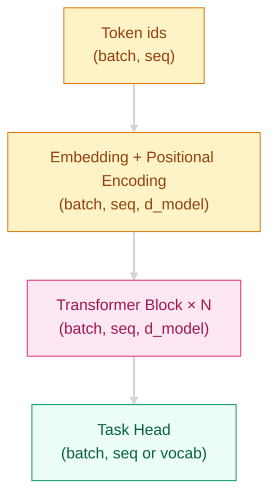
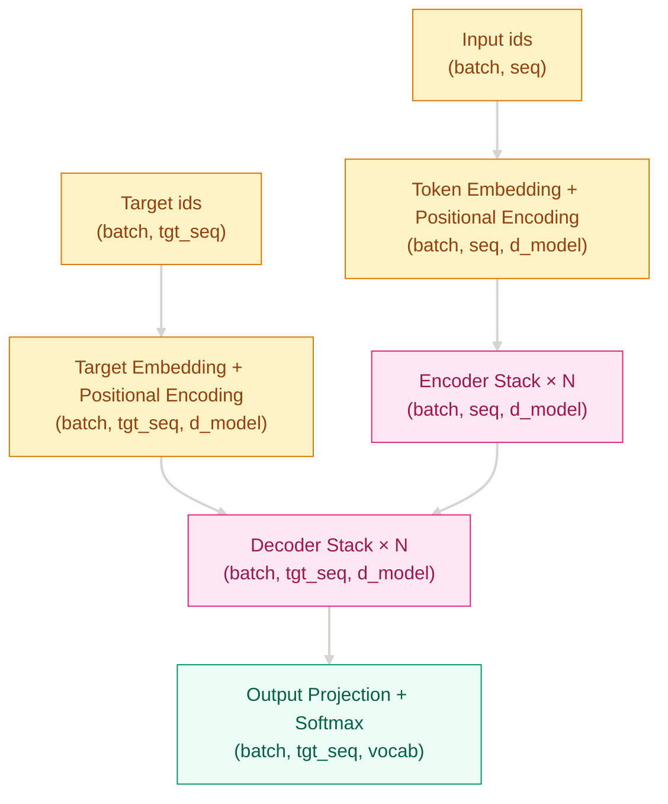

[English](README_EN.md) | [中文](README.md)

# 为什么 RNN 的递归记忆不够用了？—— Transformer 架构

## 这个问题从哪来

> 2017 年，Vaswani 等人在 “Attention Is All You Need” 里指出：RNN 把长句子拆成一步一步递推，信息要穿过很多时间步才能到达后面，长距离依赖容易衰减，而且训练很难并行。Transformer 不是给 RNN 打补丁，而是直接用注意力、前馈网络和残差归一化，把序列建模改成可并行的层叠计算。

## 学习目标

完成后你应能回答：

1. Transformer block 的最小组成和数据流是什么？
2. Encoder-only、Decoder-only、Encoder-Decoder 分别适合什么任务？
3. 位置编码、残差、LayerNorm、mask 各在解决什么工程问题？

## 1. 直觉

想象你在读一篇长文章。

RNN 像是一边读一边做单行笔记，后面的理解必须依赖前面逐字传下来的记忆。句子一长，笔记就容易漏掉前文重点。Transformer 则像把整篇文章摊开：每个 token 都能直接看见其他 token，再决定自己该向谁“借信息”。

这样做有两个直接好处：

- 信息传递路径变短，长距离依赖更容易学
- 同一层里可以并行处理所有 token，训练吞吐更高

> 你要记住：Transformer 不是“更强的 RNN”，而是“把序列递推改成并行注意力”的新范式。



## 2. 机制

### 2.1 核心公式

$$
\text{Transformer Block}(x)=x+\text{MHA}(\text{LN}(x)),\quad
x=x+\text{FFN}(\text{LN}(x))
$$

Self-Attention 负责 token 间通信，FFN 负责 token 内变换；残差让梯度穿过去，LayerNorm 让训练更稳，mask 则负责禁止看到不该看的位置。

> 你要记住：Self-Attention 负责 token 间通信，FFN 负责 token 内变换；mask 和 LayerNorm 负责让训练可控。

### 2.2 计算流图



### 2.3 渐进式实现

**Step 1：最小可运行版**（解决 token 间信息混合）

```python
# 解决 token 间信息混合
# QK^T 计算相关性，softmax 归一化，@V 聚合信息
# 时间 O(n^2d)，空间 O(n^2)
import math
import torch

def attention(q, k, v):
    scores = q @ k.transpose(-2, -1) / math.sqrt(q.size(-1))
    weights = torch.softmax(scores, dim=-1)
    return weights @ v
```

**Step 2：边界处理**（解决 padding 和因果约束）

```python
def attention(q, k, v, mask=None):
    scores = q @ k.transpose(-2, -1) / math.sqrt(q.size(-1))
    if mask is not None:
        scores = scores.masked_fill(mask == 0, float("-inf"))
    weights = torch.softmax(scores, dim=-1)
    return weights @ v
```

**Step 3：工程完善**（解决深层堆叠训练不稳定）

```python
import torch.nn as nn

class TransformerBlock(nn.Module):
    # 解决深层训练不稳定
    # Pre-LN + 残差让梯度更容易穿透堆叠层
    def __init__(self, d_model, n_heads, d_ff, dropout=0.1):
        super().__init__()
        self.ln1 = nn.LayerNorm(d_model)
        self.attn = nn.MultiheadAttention(d_model, n_heads, dropout=dropout, batch_first=True)
        self.ln2 = nn.LayerNorm(d_model)
        self.ffn = nn.Sequential(
            nn.Linear(d_model, d_ff),
            nn.GELU(),
            nn.Linear(d_ff, d_model),
        )
        self.drop = nn.Dropout(dropout)

    def forward(self, x, mask=None):
        a, _ = self.attn(self.ln1(x), self.ln1(x), self.ln1(x), attn_mask=mask)
        x = x + self.drop(a)
        return x + self.drop(self.ffn(self.ln2(x)))
```

**Step 4：生产级**（解决完整 Encoder-Decoder 堆栈接入）

```python
class Transformer(nn.Module):
    # 解决多层堆叠与任务头连接
    # 词嵌入、位置编码、编码器、解码器、输出投影串成完整模型
    def __init__(self, src_vocab, tgt_vocab, d_model=512):
        super().__init__()
        self.src_embed = nn.Embedding(src_vocab, d_model)
        self.tgt_embed = nn.Embedding(tgt_vocab, d_model)
        self.output = nn.Linear(d_model, tgt_vocab)

    def forward(self, src, tgt):
        src = self.src_embed(src)
        tgt = self.tgt_embed(tgt)
        return self.output(tgt)
```

## 3. 工程陷阱

1. 因果掩码缺失或方向错误 -> 训练泄露未来信息
2. `train()/eval()` 切换不正确 -> Dropout 行为异常
3. Padding mask 形状不匹配 -> 无效 token 干扰注意力
4. 学习率过高 -> loss 抖动、NaN
5. 上下文过长 -> OOM，需分块或高效注意力

## 演进笔记

Transformer 解决了 RNN 的序列递推瓶颈，但也把注意力的 O(n²) 成本带到前台。后续的预训练语言模型、长上下文注意力和高效推理优化，基本都在围绕“怎么保留并行优势，同时把算力和显存压下去”继续演进。

→ 详见 [预训练模型](../pretrained-models/README.md)，理解 BERT/GPT/T5 如何把 Transformer 变成通用底座。

---
**上一章**: [注意力机制](../attention-mechanisms/README.md) | **下一章**: [预训练模型](../pretrained-models/README.md)
