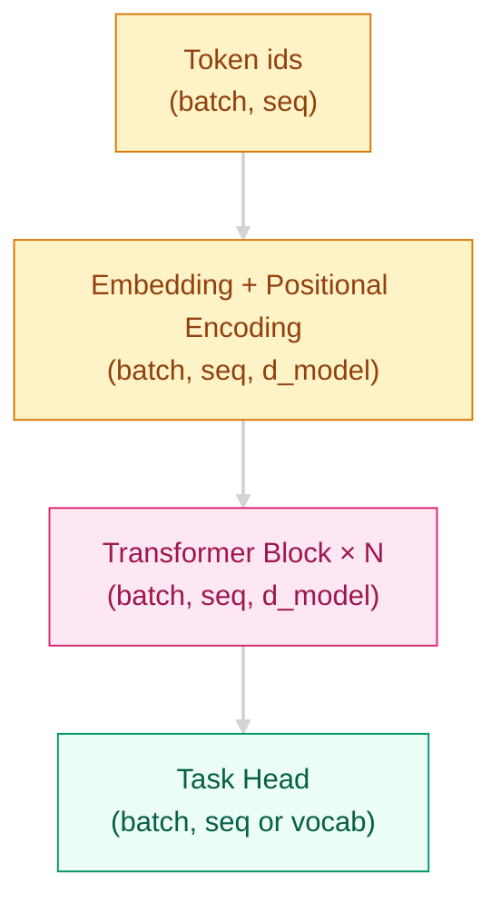
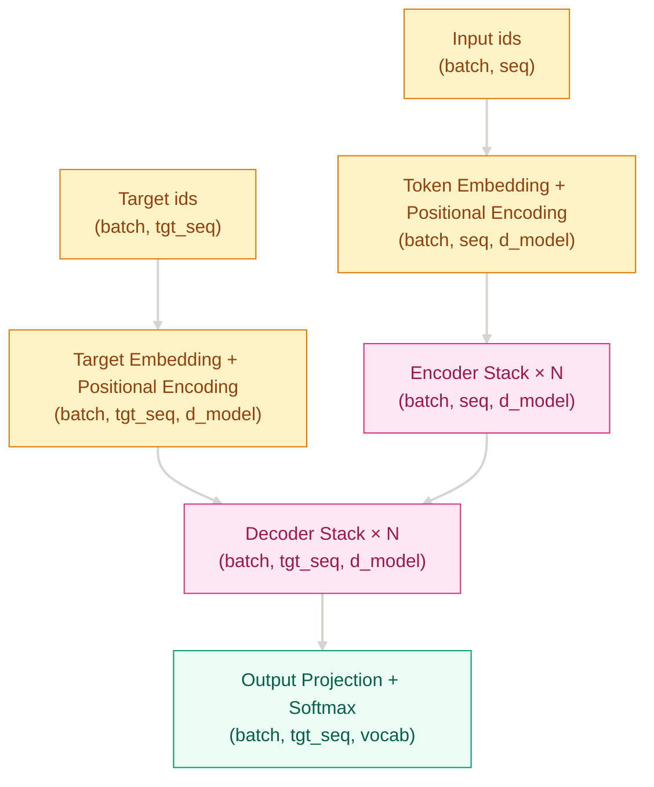

# Why RNN Recurrence Was No Longer Enough — Transformer Architecture

[English](README_EN.md) | [中文](README.md)

## Where This Problem Came From

> In 2017, Vaswani et al. showed in “Attention Is All You Need” that recurrence was not the only way to model sequences. RNNs move information step by step, so long-range dependencies travel through many operations, parallelism is poor, and long context becomes hard to train. Transformer replaces recurrence with attention, feed-forward layers, and normalization so the whole sequence can be processed as stacked matrix operations.

## Learning Goals

After finishing this chapter, you should be able to answer:

1. What is the smallest useful Transformer block and how does its data flow work?
2. When should you choose Encoder-only, Decoder-only, or Encoder-Decoder?
3. What engineering problems are solved by positional encoding, residuals, LayerNorm, and masks?

## 1. Intuition

Imagine reading a long article.

An RNN is like taking one line of notes as you read. Everything later depends on the memory passed forward from earlier words, so long sentences are easy to lose track of. A Transformer spreads the article out on a desk: each token can look at every other token directly and decide where to borrow information from.

That gives two immediate benefits:

- Shorter information paths make long-range dependencies easier to learn
- Every token can be processed in parallel inside the same layer, so throughput is higher

> Remember: Transformer is not a stronger RNN; it is a different sequence modeling paradigm.



## 2. Mechanism

### 2.1 Core Formula

$$
\text{Transformer Block}(x)=x+\text{MHA}(\text{LN}(x)),\quad
x=x+\text{FFN}(\text{LN}(x))
$$

Self-attention moves information across tokens, FFN transforms each token, residuals keep gradients flowing, LayerNorm stabilizes optimization, and masks block forbidden positions.

> Remember: self-attention moves information across tokens, FFN transforms each token, and masks plus LayerNorm keep training stable.

### 2.2 Data Flow



### 2.3 Progressive Implementation

**Step 1: Minimal runnable core** to solve token-to-token information mixing

```python
# Solve token-to-token information mixing
# QK^T measures relevance, softmax normalizes it, @V aggregates information
# Time O(n^2d), space O(n^2)
import math
import torch

def attention(q, k, v):
    scores = q @ k.transpose(-2, -1) / math.sqrt(q.size(-1))
    weights = torch.softmax(scores, dim=-1)
    return weights @ v
```

**Step 2: Boundary handling** to solve padding and causal constraints

```python
def attention(q, k, v, mask=None):
    scores = q @ k.transpose(-2, -1) / math.sqrt(q.size(-1))
    if mask is not None:
        scores = scores.masked_fill(mask == 0, float("-inf"))
    weights = torch.softmax(scores, dim=-1)
    return weights @ v
```

**Step 3: Engineering polish** to solve instability in deep stacks

```python
import torch.nn as nn

class TransformerBlock(nn.Module):
    # Solve instability in deep stacks
    # Pre-LN plus residual paths make optimization easier
    def __init__(self, d_model, n_heads, d_ff, dropout=0.1):
        super().__init__()
        self.ln1 = nn.LayerNorm(d_model)
        self.attn = nn.MultiheadAttention(d_model, n_heads, dropout=dropout, batch_first=True)
        self.ln2 = nn.LayerNorm(d_model)
        self.ffn = nn.Sequential(
            nn.Linear(d_model, d_ff),
            nn.GELU(),
            nn.Linear(d_ff, d_model),
        )
        self.drop = nn.Dropout(dropout)

    def forward(self, x, mask=None):
        a, _ = self.attn(self.ln1(x), self.ln1(x), self.ln1(x), attn_mask=mask)
        x = x + self.drop(a)
        return x + self.drop(self.ffn(self.ln2(x)))
```

**Step 4: Production-ready wiring** to solve full encoder-decoder integration

```python
class Transformer(nn.Module):
    # Solve the connection between stacked layers and the task head
    # Token embeddings, positional signals, encoder, decoder, and projection form one model
    def __init__(self, src_vocab, tgt_vocab, d_model=512):
        super().__init__()
        self.src_embed = nn.Embedding(src_vocab, d_model)
        self.tgt_embed = nn.Embedding(tgt_vocab, d_model)
        self.output = nn.Linear(d_model, tgt_vocab)

    def forward(self, src, tgt):
        src = self.src_embed(src)
        tgt = self.tgt_embed(tgt)
        return self.output(tgt)
```

## 3. Engineering Pitfalls

1. Missing or reversed causal masks -> future-token leakage during training
2. Incorrect `train()/eval()` switching -> Dropout behaves unexpectedly
3. Padding mask shape mismatch -> useless tokens interfere with attention
4. Learning rate too high -> loss spikes and NaNs
5. Context too long -> OOM, so use chunking or efficient attention

## Evolution Notes

Transformer removed the sequential bottleneck of RNNs, but it also exposed the O(n²) cost of attention. The next wave of progress, from pretrained language models to long-context attention and efficient inference, is mostly about keeping the parallelism while reducing the compute and memory burden.

→ See [Pretrained Models](../pretrained-models/README_EN.md) to understand how BERT, GPT, and T5 turn Transformer into a general-purpose foundation.

---
**Previous Chapter**: [Attention Mechanisms](../attention-mechanisms/README_EN.md) | **Next Chapter**: [Pretrained Models](../pretrained-models/README_EN.md)
