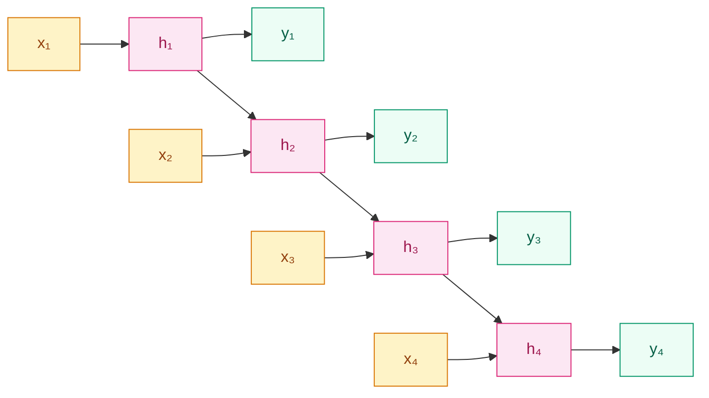
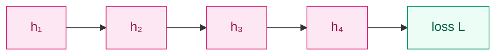

# RNN (1986)

## 前作进展

1980 年代中期神经网络刚从 1969 年 Minsky & Papert《Perceptrons》引发的"AI 寒冬"中爬出来。这次复兴的核心事件是 1986 年 Rumelhart、Hinton、Williams 在 *Nature* 上发表《Learning Representations by Back-propagating Errors》,把反向传播算法系统化地引入多层神经网络——这是连续函数逼近问题的转折点,后人称之为"反传革命"。同期 Hopfield 在 1982 年提出 Hopfield 网络,Hinton 与 Sejnowski 在 1985 年提出 Boltzmann 机,这两条线都引入了"网络存在动态/状态"的思想,但它们的"状态"是为了求解能量极小化或采样,不是为了处理序列。

当时主流的神经网络是 **MLP(多层感知机)**:输入层、隐藏层、输出层全连接,信号从输入端单向流到输出端。MLP 在分类、回归这类"固定大小输入 → 固定大小输出"的任务上工作得很好,但语言、语音、时间序列这些**变长**的数据进不了 MLP。当时主流的解法有两类,各有硬伤:

- **时延神经网络(TDNN, Waibel 1989)**:把一个滑窗内的 N 个时间步拼成一个长向量喂给 MLP。优点是直接复用现有反传机器;缺点是窗口长度必须事先固定,跨窗口的依赖完全看不到,等同于"用 MLP 假装在做序列"
- **统计语言模型(n-gram)**:`P(w_t | w_{t-1}, ..., w_{t-n+1})`。靠概率表存所有 n-gram 频次,n=3 时词表 50k 就需要 1.25×10^14 个条目,组合爆炸限制了上下文长度只能到 3–5

两条路的共性问题是——**序列的"历史"被强行截断到一个固定长度窗口**。一句话里的"它"指代 20 个词之前的某个名词,或一段对话里的语义跨越多轮,这些跨距长的依赖根本进不了模型。

序列建模需要一个完全不同的范式:**模型自己维护一个内部状态,这个状态在读取每一个新输入时被更新,从而把"历史信息"压在状态里带着走**。

## 核心思想

Jordan(1986)和 Elman(1990)几乎同时给出了同一个方案——**让网络的隐藏层既接收当前时刻的输入,也接收上一时刻自己的输出**。形式上写出来非常简洁:

$$
h_t = f(W_x x_t + W_h h_{t-1} + b_h)
$$

$$
y_t = g(W_y h_t + b_y)
$$

`x_t` 是 t 时刻的输入(比如一个词的 embedding),`h_t` 是 t 时刻的隐状态,`y_t` 是 t 时刻的输出。`f` 通常取 tanh,`g` 取 softmax(分类)或恒等(回归)。



*图 1:RNN 按时间展开的结构——同一组 `(W_x, W_h, W_y)` 在每个时间步重复使用,隐状态 `h_t` 沿时间链向前传递。*

关键有三件事:

**1. 同一组权重在所有时间步共享**——`W_x, W_h, W_y` 不随时间步变化。这一点和 CNN 的"卷积核在空间上扫"完全同构,只是共享方向从"空间"换成了"时间"。代价是序列长度可以任意,但参数量与序列长度无关。

**2. 隐状态是固定维度的"信息瓶颈"**——任意长度的序列,所有历史信息都被压进一个 `d` 维向量(典型 `d = 100~500`)。模型必须自己学会"什么该记、什么该忘"。

**3. Jordan vs Elman 的区别只是"反馈源"**——Jordan 网络反馈的是上一时刻的**输出** `y_{t-1}`,Elman 网络反馈的是上一时刻的**隐状态** `h_{t-1}`。Elman 的方案胜出,因为隐状态比输出维度更高、信息更丰富,后续所有循环网络都沿用了这一套。

## 用 BPTT 训练

RNN 怎么训?Rumelhart 等人在 1986 年的反传论文里已经隐含给出了答案:**把循环按时间展开**。考虑一个长度 T 的序列,把同一个 RNN cell "复制"T 份首尾相接,就变成了一个深度 T 的前馈网络——只不过每一层的参数都是同一组 `(W_x, W_h)`。在这个展开图上跑标准反传,这就是 **BPTT(Backpropagation Through Time)**。



*图 2:BPTT 梯度回传路径——损失 `L` 对 `h_1` 的梯度要经过 4 次 `∂h_{t+1}/∂h_t` 的连乘。*

具体推导:`L` 对 `h_1` 的梯度是

$$
\frac{\partial L}{\partial h_1} = \frac{\partial L}{\partial h_T} \cdot \prod_{t=1}^{T-1} \frac{\partial h_{t+1}}{\partial h_t} = \frac{\partial L}{\partial h_T} \cdot \prod_{t=1}^{T-1} W_h^\top \, \text{diag}(f'(h_t))
$$

这个乘积里的 `f'(h_t)` 是 tanh 的导数,值域 `(0, 1]`,而且越靠近饱和区越接近 0。所以梯度沿时间反传时,**每一步都要乘一个谱半径接近于 1 的矩阵 + 一个 (0,1] 的导数**。乘 T 次的结果是:

- 若 `W_h` 谱半径 < 1,梯度按指数衰减 → **梯度消失**:loss 对早期时刻 `h_1` 的梯度趋近于 0,模型学不到长依赖
- 若 `W_h` 谱半径 > 1,梯度按指数放大 → **梯度爆炸**:loss 梯度数值上溢,训练直接 NaN

这就是 Bengio 等人在 1994 年那篇著名的《Learning Long-Term Dependencies with Gradient Descent is Difficult》正式证明的事:**简单 RNN 在序列长度超过 10–20 步后无法用梯度下降学到长依赖**,且这个问题不是优化技巧能解决的,是结构本身的。这一结论直接导致 1990s 中后期循环网络研究陷入低潮,直到 1997 年 LSTM 用门控加细胞状态高速公路绕过这一困境。

工程上对梯度爆炸的实用补丁是 **gradient clipping**:计算梯度后,若梯度范数 `||g||` 超过阈值 `τ`(典型 `τ = 5` 或 `10`),把梯度缩放到 `g · τ / ||g||`。这一招简单但有效,至今 Transformer 训练里也在用。

## 两个早期任务

简单 RNN 在 1990 年代被用在两类任务上,做出了一些当时看来惊艳的结果:

**Elman 1990 任务**——给一个由 2–3 词句子拼成的长字符串,让 RNN 逐字符预测下一个字符。Elman 发现:RNN 在没有任何监督信号告诉它"哪里是词边界"的情况下,**预测误差的曲线在词与词之间出现尖峰**——也就是说,RNN 自己学到了"词是一个有结构的单元"。这是神经网络第一次被证明可以从原始序列里**无监督地发现语言结构**,在当时(1990)是个相当强的论断。

**Mikolov 2010 RNN 语言模型**——这是简单 RNN 的工程化应用,把 RNN 用作 n-gram 的连续替代:`P(w_t | w_{<t}) = softmax(W_y h_t)`。论文报告在 Penn Treebank 上把 perplexity 从 KN5-gram 的 141 降到 112,首次让神经网络在主流语言模型 benchmark 上超过统计模型。这个工作直接催生了 2013 年的 Word2Vec(用 RNN 风格的预测任务学词向量),并把 RNN 推回到 NLP 的舞台中心。

## 训练细节

| 维度 | 简单 RNN 时代的典型做法 |
|------|------|
| 隐状态维度 `d` | 50–500(受当时算力限制,2010 之后才到 1000+) |
| 激活函数 | tanh(隐藏层)、softmax(输出层分类) |
| 初始化 `W_h` | 早期用小高斯;Bengio 1994 后开始关注谱半径,逐步引入正交初始化 |
| 优化器 | SGD + Momentum,梯度爆炸时配合 gradient clipping(`τ = 5`) |
| 截断 BPTT | 长序列上完整 BPTT 计算量爆炸,实际用 **truncated BPTT**:每 `k`(典型 20–50)步截断一次,只回传 k 步内的梯度 |
| 学习率 | `10^-2` ~ `10^-3`,需要随训练衰减;loss spike 比 MLP 频繁 |

## 关键代码

PyTorch 里手写一个最简单的 Elman RNN cell 是这样:

```python
import torch
import torch.nn as nn

class SimpleRNNCell(nn.Module):
    def __init__(self, input_dim, hidden_dim):
        super().__init__()
        self.W_x = nn.Linear(input_dim, hidden_dim, bias=False)
        self.W_h = nn.Linear(hidden_dim, hidden_dim)  # bias 在 W_h 上

    def forward(self, x_t, h_prev):
        # x_t: [B, input_dim], h_prev: [B, hidden_dim]
        h_t = torch.tanh(self.W_x(x_t) + self.W_h(h_prev))
        return h_t

def rnn_forward(cell, x_seq, h_0):
    # x_seq: [B, T, input_dim], h_0: [B, hidden_dim]
    h = h_0
    outputs = []
    for t in range(x_seq.size(1)):
        h = cell(x_seq[:, t, :], h)
        outputs.append(h)
    return torch.stack(outputs, dim=1)  # [B, T, hidden_dim]
```

注意 `for t in range(T)` 这一行——RNN 本质上是**串行的**,第 `t` 步必须等第 `t-1` 步算完。这一点 GPU 无法加速,直接导致循环网络在长序列上训练慢、推理慢,这是 2017 年 Transformer 用 self-attention 把这条循环主轴彻底扔掉的根本动机。

## 影响 / 后续

简单 RNN 在 1986–1996 这十年里是序列建模的唯一通用工具,但实用中的两个问题——**梯度消失/爆炸** 和 **串行不可并行**——决定了它无法独立扛起 NLP 的大规模建模任务。这两件事的解决分别由 LSTM(1997)和 Transformer(2017)接力完成。

但简单 RNN 留下的核心思想——**用一个固定维度的隐状态在时间上递推,共享同一组参数处理变长序列**——是所有后续序列模型的共同祖先。LSTM、GRU 是它的"门控加固版";Seq2Seq 是它的"编码器-解码器封装版";Transformer 抛弃了循环但保留了"序列上下文压进固定维度向量"的瓶颈思想——只不过 Transformer 用 attention 让每个位置同时看到所有其他位置,把"沿时间逐步压缩"换成了"全局并行聚合"。

→ [02-lstm.md](02-lstm.md) · 用门控加上一条细胞状态高速公路,让梯度能稳定走过 100+ 步
→ [04-seq2seq.md](04-seq2seq.md) · 把 RNN 封装成 encoder-decoder,变长输入→变长输出的统一范式
→ [../05-transformer/](../05-transformer/) · 用 self-attention 替代循环,把"串行展开"变成"并行聚合"
→ [../foundations/04-normalization/](../foundations/04-normalization/) · LayerNorm 在 RNN 上的应用是 Transformer 之前稳定深层循环的关键技术
