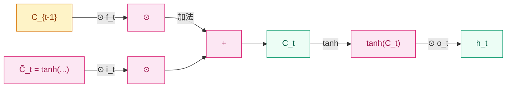

## 前作进展

[简单 RNN](01-rnn.md) 1986 年提出后,在序列建模上覆盖了几乎所有可能场景——语音识别、字符级语言建模、机械控制、时间序列预测。但 1990 年代初有一个反复出现的工程现象:**网络在短序列上工作得不错,但只要序列长度超过 10–20 步,模型就无法学到跨距长的依赖**。直观的例子是:训练一个 RNN 去预测"The cat that sat on the mat _is_ tired"里的 `is`,只要 cat 和 is 之间的从句够长,RNN 就会忘掉前面是"cat"还是"cats",变成随机预测。

1991 年 Hochreiter 在他的硕士论文里第一次把这个现象写成数学。1994 年他和 Bengio、Frasconi 在 IEEE TNN 上正式发表《Learning Long-Term Dependencies with Gradient Descent is Difficult》,给出了刚性的结论:

$$
\frac{\partial L}{\partial h_t} = \frac{\partial L}{\partial h_T} \cdot \prod_{k=t}^{T-1} W_h^\top \, \text{diag}(f'(h_k))
$$

这个连乘的谱半径如果小于 1,梯度按 `γ^(T-t)` 指数衰减;大于 1,按指数爆炸。简单 RNN 的 tanh 非线性使得 `f'(h)` 的取值在饱和区接近 0(tanh 的导数最大值是 1,在 |h|>2 时迅速降到 0.1 以下),`W_h` 即便初始化得很谨慎,长期下来连乘很难保持 O(1)。

这篇论文的副标题——*Gradient Descent is Difficult*——其实是绝望的。它的结论暗示:**在原有 RNN 结构下,光靠优化器调参解决不了长依赖,必须改结构**。当时社区给出的几个绕路方案:

- **Mozer 1992**:layered/hierarchical RNN,用不同时间尺度的多层结构,但严重依赖人工设计层级
- **Lin 1996**:NARX(Nonlinear Auto-Regressive eXogenous)网络,直接把 `h_{t-D}` 作为输入接进当前时刻,用恒等连接保留长距离信号——这个思路后来被 ResNet 用更通用的方式继承
- **El Hihi & Bengio 1995**:多时间尺度连接,每隔 `k^l` 步加一条 skip 连接

这些方案都有"还是 RNN 的形式 + 局部补丁"的味道。Hochreiter 和 Schmidhuber 选择了一条更激进的路:**不修补简单 RNN,而是从零设计一个新的循环单元,让长距离梯度按 O(1) 传递而不是按 γ^T 衰减**。这就是 1997 年的 LSTM。

## 核心思想:细胞状态 + 三道门

LSTM 的核心是把 RNN 的"一个隐状态 `h_t` 包揽所有职责"拆成两件事:

- **细胞状态 `C_t`**:专门负责"记住信息"的载体,在时间上沿一条几乎线性的通道传递,梯度可以无障碍回传——这就是"细胞状态高速公路"
- **隐状态 `h_t`**:对外暴露给后续层(或下一步循环)的输出,从 `C_t` 经过门控筛选得到

围绕这两个状态,LSTM 用三道**门**控制信息流——遗忘门 `f_t`、输入门 `i_t`、输出门 `o_t`。每道门是一个 sigmoid 单元,输出 0–1 之间的"权重",用元素级乘法 `⊙` 作用在被门控的张量上:

$$
\begin{aligned}
f_t &= \sigma(W_f [h_{t-1}, x_t] + b_f) \\
i_t &= \sigma(W_i [h_{t-1}, x_t] + b_i) \\
o_t &= \sigma(W_o [h_{t-1}, x_t] + b_o) \\
\tilde{C}_t &= \tanh(W_C [h_{t-1}, x_t] + b_C) \\
C_t &= f_t \odot C_{t-1} + i_t \odot \tilde{C}_t \\
h_t &= o_t \odot \tanh(C_t)
\end{aligned}
$$

`[h_{t-1}, x_t]` 是把上一时刻隐状态和当前输入拼起来的向量。



*图 1:LSTM 内部数据流——细胞状态 `C` 沿一条加法主干传递,所有门控只用乘法"调音量",从不直接覆盖 `C`。*

每道门的语义:

- **遗忘门 `f_t`**:决定上一时刻细胞状态 `C_{t-1}` 里**保留多少**信息进入新状态。`f_t = 0` 完全清空,`f_t = 1` 完整保留
- **输入门 `i_t`**:决定候选状态 `\tilde{C}_t` 里**写入多少**信息到新状态。配合 `tanh` 输出范围 [-1, 1] 的候选,实际可以做"加上正向信号"或"减去负向信号"
- **输出门 `o_t`**:决定新细胞状态 `C_t`(经过 tanh 压缩到 [-1, 1])**暴露多少**作为对外输出 `h_t`

最关键的是细胞状态更新这一行:

$$
C_t = f_t \odot C_{t-1} + i_t \odot \tilde{C}_t
$$

注意这里是**加法 + 门控**,不是简单 RNN 那种 `h_t = tanh(W_h h_{t-1} + ...)`。`f_t` 接近 1 时,`C_t ≈ C_{t-1} + (新信息)`——细胞状态像一条传送带,旧信息几乎无损穿过,新信息按需叠加。这一结构和 18 年后的 ResNet 残差块 `y = F(x) + x` 是同一个数学操作,只不过 ResNet 用恒等映射作为 default,LSTM 用一个学到的门作为 default。

## 梯度高速公路

LSTM 为什么能让梯度稳定回传?把上面的更新式对 `C_{t-1}` 求导:

$$
\frac{\partial C_t}{\partial C_{t-1}} = f_t + (\text{其他项})
$$

主项是 `f_t`(一个 0–1 的门),而不是简单 RNN 里的 `W_h^\top \, \text{diag}(f'(h_{t-1}))`。这是两个关键差异:

**1. 没有 `W_h^\top` 连乘**——梯度沿 `C_t → C_{t-1} → ... → C_1` 的路径只乘门 `f_t`,不再乘权重矩阵的转置。连乘 `f_t f_{t-1} ... f_1` 不会因为 `W_h` 的谱半径而爆炸或衰减。

**2. 没有 `tanh'` 这种迅速饱和的因子**——主项 `f_t` 本身就是 sigmoid 输出,但 sigmoid 输入是 `[h_{t-1}, x_t]` 的线性组合,模型可以学到"在需要长距离传递时把 `f_t` 推到接近 1"——这相当于给梯度装了一条"可学习的高速公路"。

具体到工程意义:Hochreiter 在论文里测了一个对照实验,给 RNN 喂一个"延迟回声"任务——序列前几步是要记的关键信号 `s`,中间穿插 100 步无关噪声,最后一步要求模型输出 `s`。简单 RNN 在延迟超过 10 步时彻底失败,LSTM 可以稳定学会 100+ 步的延迟。这是 RNN 家族第一次有结构能跨越 100 步以上的长依赖。

但 1997 年原版 LSTM 里**没有遗忘门**。Hochreiter 原始论文里的细胞状态更新是 `C_t = C_{t-1} + i_t ⊙ \tilde{C}_t`——只能"加",不能"清"。这导致细胞状态会持续累积,最终饱和。1999 年 Gers、Schmidhuber、Cummins 在《Learning to Forget》里补上了遗忘门,这才是今天教科书里的标准 LSTM 形式。"原版 LSTM"和"标准 LSTM"在论文/工程中混用了 10 年才统一术语,这是一个常见的历史细节坑。

## 训练细节

| 维度 | LSTM 时代的典型做法 |
|------|------|
| 隐状态维度 `d` | 128–1024(机器翻译常用 512 或 1024) |
| 门偏置初始化 | **遗忘门 bias 设为 1**(Jozefowicz 2015 经验法则):让训练初期门保持开启,信息默认能传过去 |
| 其他权重 | Xavier 或正交初始化,避免初始连乘谱半径远离 1 |
| 激活函数 | sigmoid(门控)+ tanh(候选/输出)。不能换成 ReLU——门必须在 [0,1] 之间 |
| 优化器 | Adam(2014 之后成为 RNN 默认),早期常用 SGD + Momentum + gradient clipping(`τ = 5`) |
| Dropout | 只用在**层间**,不能用在**时间上**(Zaremba 2014 *RNN Regularization*)。后来 Gal 2016 *Variational Dropout* 给出了在时间上重复掩码的正确做法 |
| 截断 BPTT | 标准做法,典型截断窗口 32 或 64 步 |

参数量计算:每道门和候选都有 `[h_{t-1}, x_t] → d` 这一组 `W`,所以单个 LSTM 单元有 **4** 组权重矩阵,参数总量大约 `4 × d × (d + x)`。这是简单 RNN 的 4 倍,也是后来 GRU 想压缩到 3 组的动机。

## 关键代码

PyTorch 里手写 LSTM cell:

```python
import torch
import torch.nn as nn

class LSTMCell(nn.Module):
    def __init__(self, input_dim, hidden_dim):
        super().__init__()
        # 一次性算 4 个门,矩阵乘合并加速
        self.W = nn.Linear(input_dim + hidden_dim, 4 * hidden_dim)
        self.hidden_dim = hidden_dim
        # 经验:遗忘门 bias 初始化为 1
        with torch.no_grad():
            self.W.bias[hidden_dim:2*hidden_dim].fill_(1.0)

    def forward(self, x_t, state):
        h_prev, c_prev = state
        combined = torch.cat([x_t, h_prev], dim=-1)
        gates = self.W(combined)  # [B, 4 * hidden_dim]
        i, f, g, o = gates.chunk(4, dim=-1)
        i = torch.sigmoid(i)            # 输入门
        f = torch.sigmoid(f)            # 遗忘门
        g = torch.tanh(g)               # 候选 C̃
        o = torch.sigmoid(o)            # 输出门
        c_t = f * c_prev + i * g        # ← 这就是细胞状态高速公路
        h_t = o * torch.tanh(c_t)
        return h_t, (h_t, c_t)
```

注意 `self.W = nn.Linear(input_dim + hidden_dim, 4 * hidden_dim)` 这一行——四个门的线性变换合并成一个大矩阵乘,GPU 跑起来比单独算四次快得多。这是工业级实现的标准技巧,PyTorch、TensorFlow 内置的 LSTM 都是这么干的。

但仍然要 `for t in range(T)` 一步一步算,LSTM 和简单 RNN 一样**串行不可并行**——单 GPU 上一个长度 100 的序列要跑 100 次顺序 forward,这是 LSTM 训练慢的根因,也是 2017 年 Transformer 把循环主轴扔掉的直接动机。

## 影响 / 后续

LSTM 在 1997–2017 这二十年里几乎是序列建模的唯一答案。它在这些领域成为主流骨干:

- **语音识别**:2013 Graves *Speech Recognition with Deep Recurrent Neural Networks*,LSTM + CTC 把 TIMIT 字音错误率刷到当时最低
- **机器翻译**:2014 [Seq2Seq](04-seq2seq.md) 用 LSTM 做 encoder-decoder,谷歌翻译 2016 上线 GNMT 用的是 8 层 LSTM
- **图像描述**:2014 *Show and Tell*,CNN 编码图像 + LSTM 解码描述
- **手写识别**:2009 Graves 用 BiLSTM + CTC 拿了 ICDAR 冠军

工程上有几个变体被广泛使用,但都没改变核心结构:

- **BiLSTM**(Schuster 1997 同年):同时跑一个正向 LSTM 和一个反向 LSTM,把两个隐状态拼起来。在所有"读完整个句子再决策"的任务(命名实体识别、词性标注、阅读理解)上是默认骨干,2018 ELMo 也是 BiLSTM 堆叠
- **Peephole LSTM**(Gers 2000):让门控除了看 `[h_{t-1}, x_t]` 之外,也看 `C_{t-1}`。理论上更强,实际效果差异不大
- **[GRU](03-gru.md)**(2014):把 LSTM 三门简成两门,参数少 25% 性能基本持平,是 LSTM 的轻量化替代

LSTM 留下的核心思想——**用门控 + 加法主干让信息选择性流动**——被后续几乎所有架构继承。ResNet 的残差连接 `y = F(x) + x` 是 LSTM 加法主干的特殊化(把门固定为 1);Transformer 每个 sublayer 后的 residual + LayerNorm 也是同样思路;Highway Networks(Srivastava 2015)甚至直接用 LSTM 门控形式 `y = T·F(x) + (1-T)·x` 解决前馈网的深度训练问题。在这个意义上,LSTM 不只是循环网络的一个版本,而是"门控加法主干"这一**通用机制**最早的系统化案例。

→ [03-gru.md](03-gru.md) · 把三门简成两门,参数减少 25% 而性能基本持平
→ [04-seq2seq.md](04-seq2seq.md) · LSTM 真正大规模应用的入口,encoder-decoder 范式定型
→ [05-attention.md](05-attention.md) · Bahdanau 在 LSTM Seq2Seq 上加 attention,解决长句信息瓶颈
→ [../05-transformer/](../05-transformer/) · 用 self-attention + residual 替代循环,但保留了"门控加法主干"思想
→ [../foundations/04-normalization/](../foundations/04-normalization/) · LayerNorm 在 LSTM 上的应用是稳定深层循环训练的关键
