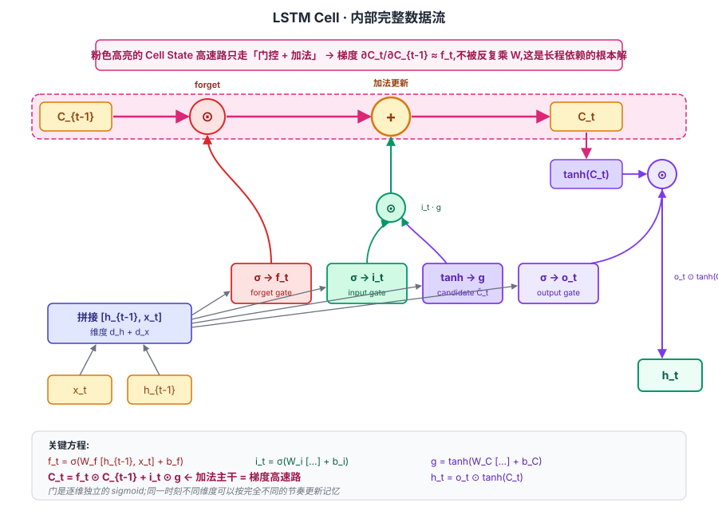
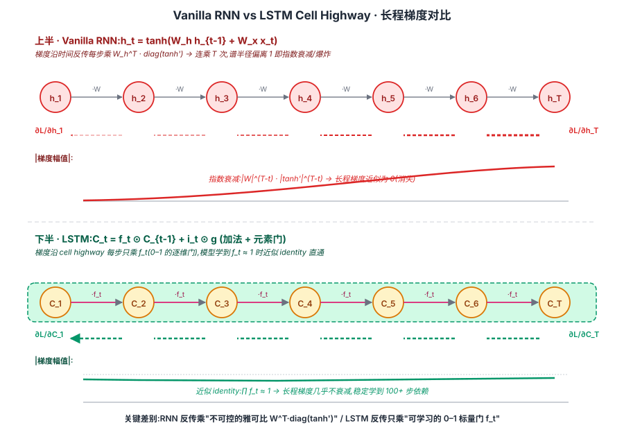

## 前作进展

[简单 RNN](01-rnn.md) 1986 年提出后,在序列建模上覆盖了几乎所有可能场景——语音识别、字符级语言建模、机械控制、时间序列预测。但 1990 年代初有一个反复出现的工程现象:**网络在短序列上工作得不错,但只要序列长度超过 10–20 步,模型就无法学到跨距长的依赖**。直观的例子是:训练一个 RNN 去预测"The cat that sat on the mat _is_ tired"里的 `is`,只要 cat 和 is 之间的从句够长,RNN 就会忘掉前面是"cat"还是"cats",变成随机预测。

1991 年 Hochreiter 在他的硕士论文里第一次把这个现象写成数学。1994 年他和 Bengio、Frasconi 在 IEEE TNN 上正式发表《Learning Long-Term Dependencies with Gradient Descent is Difficult》,给出了刚性的结论:

$$
\frac{\partial L}{\partial h_t} = \frac{\partial L}{\partial h_T} \cdot \prod_{k=t}^{T-1} W_h^\top \, \text{diag}(f'(h_k))
$$

这个连乘的谱半径如果小于 1,梯度按 `γ^(T-t)` 指数衰减;大于 1,按指数爆炸。简单 RNN 的 tanh 非线性使得 `f'(h)` 的取值在饱和区接近 0(tanh 的导数最大值是 1,在 |h|>2 时迅速降到 0.1 以下),`W_h` 即便初始化得很谨慎,长期下来连乘很难保持 O(1)。

这篇论文的副标题——*Gradient Descent is Difficult*——其实是绝望的。它的结论暗示:**在原有 RNN 结构下,光靠优化器调参解决不了长依赖,必须改结构**。当时社区给出的几个绕路方案:

- **Mozer 1992**:layered/hierarchical RNN,用不同时间尺度的多层结构,但严重依赖人工设计层级
- **Lin 1996**:NARX(Nonlinear Auto-Regressive eXogenous)网络,直接把 `h_{t-D}` 作为输入接进当前时刻,用恒等连接保留长距离信号——这个思路后来被 ResNet 用更通用的方式继承
- **El Hihi & Bengio 1995**:多时间尺度连接,每隔 `k^l` 步加一条 skip 连接

这些方案都有"还是 RNN 的形式 + 局部补丁"的味道。Hochreiter 和 Schmidhuber 选择了一条更激进的路:**不修补简单 RNN,而是从零设计一个新的循环单元,让长距离梯度按 O(1) 传递而不是按 γ^T 衰减**。这就是 1997 年的 LSTM。

## 核心思想

### 直觉:用"细胞状态 + 门"显式管理长程记忆

理解 LSTM 真正需要先抓一件事:**简单 RNN 把"记忆"和"计算"混在同一个隐状态 `h_t` 里,LSTM 把它们拆开,并给记忆专门修一条"梯度不被反复乘"的高速路**。

回到 1994 年 Bengio 那条让人绝望的公式——简单 RNN 的梯度沿时间反传 `T-t` 步,每步都要乘 `W_h^\top \cdot \text{diag}(f'(h_k))`。这是一连串雅可比矩阵的连乘,任何项的谱半径偏离 1 都会让长程梯度指数级衰减或爆炸。tanh 一旦进入饱和区导数趋近 0,连乘衰减更是不可避免。**只要"信息靠 `h_t = f(W h_{t-1} + ...)` 的乘法-非线性更新"这条范式不变,梯度的指数式衰减就绕不开**。

Hochreiter 和 Schmidhuber 的反问是:能不能让记忆的更新走**加法**而不是乘法?能不能让梯度沿着记忆的传递路径**接近 1 倍直通**,而不必每步都乘一个不可控的矩阵?

LSTM 的答案是引入一条独立的**细胞状态 `C_t`**——它专门承担"长期记忆",更新式是 `C_t = f_t ⊙ C_{t-1} + i_t ⊙ \tilde{C}_t`,旧记忆通过遗忘门 `f_t` 做元素级"调音量"后**加法**叠加新信息,完全没有 `W` 连乘、也没有 tanh 饱和。梯度 `∂C_t/∂C_{t-1} ≈ f_t`,只要模型学到"在需要长距离传递时把 `f_t` 推到接近 1",梯度就能近似 identity 一路传回去——这就是 LSTM 真正的根本创新,18 年后 ResNet 的残差连接 `y = F(x) + x` 是同一思想的特殊化(把门固定为 1)。

围绕这条"加法高速路",LSTM 用三道门(forget / input / output)精细控制读写,再把"长期记忆 `C`"和"对外接口 `h`"分离开。下面三个机制缺一不可。

### 机制一:Cell State 高速路 — 梯度不被反复乘

LSTM 把"记住信息"的职责从 `h_t` 里剥出来,交给一条独立的细胞状态 `C_t`:

$$
C_t = f_t \odot C_{t-1} + i_t \odot \tilde{C}_t
$$

注意这是**加法 + 元素级门控**,不是简单 RNN 的 `h_t = \tanh(W_h h_{t-1} + W_x x_t)`。`f_t` 是 0–1 的遗忘门(sigmoid 输出),`⊙` 是 Hadamard 乘积——**没有任何 `W` 矩阵作用在 `C_{t-1}` 上**,旧记忆直接乘一个 0–1 的标量门(逐维独立)再叠加新信息。

这条加法路径最关键的性质是它对梯度的影响。把更新式对 `C_{t-1}` 求导:

$$
\frac{\partial C_t}{\partial C_{t-1}} = f_t + \underbrace{(\text{通过 } f_t, i_t, \tilde{C}_t \text{ 的间接项})}_{\text{量级很小}}
$$

主项就是 `f_t` 本身。模型只要学到"在需要长程依赖时把 `f_t` 推到接近 1",梯度沿 `C_T → C_{T-1} → ... → C_1` 的连乘就近似 `1 · 1 · ... · 1 ≈ 1`——**梯度近似 identity 直通,完全规避了 `W_h^\top` 连乘的谱半径问题**。

对照简单 RNN 的连乘 `∏ W_h^\top \cdot \text{diag}(f'(h_k))`:LSTM 的 cell highway 把这个不可控的雅可比连乘换成了一串可学习的标量门连乘。这是 RNN 家族第一次有结构能稳定跨越 100+ 步长依赖——Hochreiter 论文里那个"延迟 100 步回声"任务,简单 RNN 在延迟超过 10 步就完全失败,LSTM 能稳定学会。


*图 1:LSTM 一个 cell 内部完整数据流——四个门(f / i / g / o)由 `[h_{t-1}, x_t]` 同时算出,粉色高亮的 cell state 高速路只走"门控 + 加法",梯度从 `C_t` 回传 `C_{t-1}` 几乎 identity 直通。这是 LSTM 解决长依赖的根本机制。*


*图 2:同样长度 T 的反传——上半 RNN 沿 `h_1 → h_T` 每步乘 `W`,梯度曲线指数式衰减(或爆炸);下半 LSTM 沿 `C_1 → C_T` 每步乘 `f_t ≈ 1`,梯度曲线几乎平直。这就是"细胞状态高速路"四个字的几何含义。*

### 机制二:三门控制 — forget / input / output

光有加法主干还不够——总要有人决定"什么时候保留 / 什么时候写入 / 什么时候读出"。LSTM 用三道 sigmoid 门做"可学习的信息阀门":

$$
\begin{aligned}
f_t &= \sigma(W_f [h_{t-1}, x_t] + b_f) \quad \text{遗忘门:旧记忆保留多少} \\
i_t &= \sigma(W_i [h_{t-1}, x_t] + b_i) \quad \text{输入门:新信息写入多少} \\
\tilde{C}_t &= \tanh(W_C [h_{t-1}, x_t] + b_C) \quad \text{候选信息:写入什么} \\
o_t &= \sigma(W_o [h_{t-1}, x_t] + b_o) \quad \text{输出门:从 cell 读出多少} \\
\end{aligned}
$$

每道门都是 sigmoid 单元,输出 0–1 之间的"权重",用元素级乘法 `⊙` 作用在被门控的张量上。**门是逐维独立的**——`f_t` 的第 17 维可以是 0.99(几乎保留),第 18 维可以是 0.02(几乎清空),所以同一时刻不同维度的记忆能按不同节奏更新。

三道门各管一件事:

- **遗忘门 `f_t`**——决定上一时刻细胞状态 `C_{t-1}` 里**保留多少**进入新状态。`f_t → 0` 完全清空(常见于"句子结束,重置上下文");`f_t → 1` 完整保留(常见于"还在记主语,要传到很远的从句之外")
- **输入门 `i_t`**——决定候选 `\tilde{C}_t` 里**写入多少**到新状态。配合 tanh 输出 [-1, 1] 的候选,实际可以做"加正向信号"或"减负向信号"
- **输出门 `o_t`**——决定从新 cell `C_t`(经 tanh 压到 [-1, 1])**暴露多少**作为对外 `h_t`

工程上有一个经验法则常被忽略但很重要:**遗忘门 bias 初始化为 1**(Jozefowicz 2015)。sigmoid(1) ≈ 0.73,这让训练初期门默认"开着",信息能传过去——避免模型在还没学到什么之前就把记忆全清空。这条 trick 让 LSTM 训练稳定性提升一大截。

1997 年原版 LSTM 其实**没有遗忘门**,只有 input/output 两门——细胞状态只能"加"不能"清",运行久了必然饱和。1999 年 Gers、Schmidhuber、Cummins 的《Learning to Forget》补上遗忘门后才是今天的标准 LSTM。论文社区把两个版本混用了 10 年才统一术语,是个常见历史坑。

### 机制三:Hidden State 与 Cell State 分离 — 短期 vs 长期

LSTM 的第三件事是把"记忆"和"对外输出"也拆开:

$$
h_t = o_t \odot \tanh(C_t)
$$

- **细胞状态 `C_t`**——**内部**长期记忆,不直接对外。它沿 cell highway 在时间上传递,可以保留几十上百步前的信息
- **隐状态 `h_t`**——**对外**接口,承担短期工作记忆。当前 step 的输出层、下一时刻 attention 等下游模块拿到的都是 `h_t` 而不是 `C_t`

这种"对内对外分离"的好处在于:`C_t` 不需要"既保留所有长程信息又适配下游"——后者交给 `o_t` 的门控去筛选;`o_t` 也不会污染 `C_t`——`h_t` 经过 tanh + 门控后才输出,不直接覆盖 cell 的内容。

类比一下:`C_t` 像一个"档案柜",存着所有要长期保留的信息;`h_t` 像"今天要带去开会的几份文件",由 `o_t` 这位秘书从档案柜里挑出来。如果像简单 RNN 那样把档案柜和会议袋合二为一,**每次开会就把所有档案重写一遍**——这正是 RNN 长程记忆不稳定的根本原因。

实践中这种分离有一个具体后果:把 LSTM 当 encoder 用时(如 Seq2Seq、ELMo),下游模块通常取 `h_t` 而不是 `C_t`。但有些任务(如某些 hierarchical 模型)会把整个 `(h_t, C_t)` 一起传给下一层——本质上是利用了 `C_t` 这条没有被 `o_t` 过滤的"原始长程信息"。

### 三件套协同:cell highway + 三门 + h/C 分离 缺一不可

类比 ResNet 三件套(shortcut + BN + He 初始化),LSTM 的三个机制也是协同的工程契约——**任何一个单拿出来都不够,三者一起才让"循环网络稳定学 100+ 步长依赖"从一个绝望的目标变成可训练的方案**:

- **只有 cell highway,没有三门**——cell state 没有"清空"和"写入控制",信息无差别累积,最终饱和(就是 1997 年原版 LSTM 的状况,所以 1999 年必须补 forget gate)
- **只有三门,没有 cell highway**——门控仍然作用在乘法-非线性更新上,`W_h^\top · \text{diag}(σ')` 连乘的衰减问题依然存在,梯度仍然消失(这其实是 GRU 之外许多门控变体失败的根因)
- **只有 cell highway + 三门,没有 h/C 分离**——长期记忆被下游的输出需求频繁污染,等于把"档案柜"当"会议袋"用,长程信息很快被改写丢失

这条三件套在 LSTM 之后的二十年里**被反复以不同形式继承**:GRU 把三门简成两门、把 h/C 合并;Highway Networks 把 LSTM 的门控形式 `y = T·F(x) + (1-T)·x` 搬到前馈网解决深度训练;ResNet 把门固定为 1 得到残差连接;Transformer 每个 sublayer 后的 `x + Sublayer(x)` 是同一加法主干思想的极简化。**"门控加法主干"这一通用机制最早的系统化案例就是 LSTM**——这是它在深度学习史上不可替代的位置。

## 训练细节

| 维度 | LSTM 时代的典型做法 |
|------|------|
| 隐状态维度 `d` | 128–1024(机器翻译常用 512 或 1024) |
| 门偏置初始化 | **遗忘门 bias 设为 1**(Jozefowicz 2015 经验法则):让训练初期门保持开启,信息默认能传过去 |
| 其他权重 | Xavier 或正交初始化,避免初始连乘谱半径远离 1 |
| 激活函数 | sigmoid(门控)+ tanh(候选/输出)。不能换成 ReLU——门必须在 [0,1] 之间 |
| 优化器 | Adam(2014 之后成为 RNN 默认),早期常用 SGD + Momentum + gradient clipping(`τ = 5`) |
| Dropout | 只用在**层间**,不能用在**时间上**(Zaremba 2014 *RNN Regularization*)。后来 Gal 2016 *Variational Dropout* 给出了在时间上重复掩码的正确做法 |
| 截断 BPTT | 标准做法,典型截断窗口 32 或 64 步 |

参数量计算:每道门和候选都有 `[h_{t-1}, x_t] → d` 这一组 `W`,所以单个 LSTM 单元有 **4** 组权重矩阵,参数总量大约 `4 × d × (d + x)`。这是简单 RNN 的 4 倍,也是后来 GRU 想压缩到 3 组的动机。

## 关键代码

PyTorch 里手写 LSTM cell:

```python
import torch
import torch.nn as nn

class LSTMCell(nn.Module):
    def __init__(self, input_dim, hidden_dim):
        super().__init__()
        # 一次性算 4 个门,矩阵乘合并加速
        self.W = nn.Linear(input_dim + hidden_dim, 4 * hidden_dim)
        self.hidden_dim = hidden_dim
        # 经验:遗忘门 bias 初始化为 1
        with torch.no_grad():
            self.W.bias[hidden_dim:2*hidden_dim].fill_(1.0)

    def forward(self, x_t, state):
        h_prev, c_prev = state
        combined = torch.cat([x_t, h_prev], dim=-1)
        gates = self.W(combined)  # [B, 4 * hidden_dim]
        i, f, g, o = gates.chunk(4, dim=-1)
        i = torch.sigmoid(i)            # 输入门
        f = torch.sigmoid(f)            # 遗忘门
        g = torch.tanh(g)               # 候选 C̃
        o = torch.sigmoid(o)            # 输出门
        c_t = f * c_prev + i * g        # ← 这就是细胞状态高速公路
        h_t = o * torch.tanh(c_t)
        return h_t, (h_t, c_t)
```

注意 `self.W = nn.Linear(input_dim + hidden_dim, 4 * hidden_dim)` 这一行——四个门的线性变换合并成一个大矩阵乘,GPU 跑起来比单独算四次快得多。这是工业级实现的标准技巧,PyTorch、TensorFlow 内置的 LSTM 都是这么干的。

但仍然要 `for t in range(T)` 一步一步算,LSTM 和简单 RNN 一样**串行不可并行**——单 GPU 上一个长度 100 的序列要跑 100 次顺序 forward,这是 LSTM 训练慢的根因,也是 2017 年 Transformer 把循环主轴扔掉的直接动机。

## 影响 / 后续

LSTM 在 1997–2017 这二十年里几乎是序列建模的唯一答案。它在这些领域成为主流骨干:

- **语音识别**:2013 Graves *Speech Recognition with Deep Recurrent Neural Networks*,LSTM + CTC 把 TIMIT 字音错误率刷到当时最低
- **机器翻译**:2014 [Seq2Seq](04-seq2seq.md) 用 LSTM 做 encoder-decoder,谷歌翻译 2016 上线 GNMT 用的是 8 层 LSTM
- **图像描述**:2014 *Show and Tell*,CNN 编码图像 + LSTM 解码描述
- **手写识别**:2009 Graves 用 BiLSTM + CTC 拿了 ICDAR 冠军

工程上有几个变体被广泛使用,但都没改变核心结构:

- **BiLSTM**(Schuster 1997 同年):同时跑一个正向 LSTM 和一个反向 LSTM,把两个隐状态拼起来。在所有"读完整个句子再决策"的任务(命名实体识别、词性标注、阅读理解)上是默认骨干,2018 ELMo 也是 BiLSTM 堆叠
- **Peephole LSTM**(Gers 2000):让门控除了看 `[h_{t-1}, x_t]` 之外,也看 `C_{t-1}`。理论上更强,实际效果差异不大
- **[GRU](03-gru.md)**(2014):把 LSTM 三门简成两门,参数少 25% 性能基本持平,是 LSTM 的轻量化替代

LSTM 留下的核心思想——**用门控 + 加法主干让信息选择性流动**——被后续几乎所有架构继承。ResNet 的残差连接 `y = F(x) + x` 是 LSTM 加法主干的特殊化(把门固定为 1);Transformer 每个 sublayer 后的 residual + LayerNorm 也是同样思路;Highway Networks(Srivastava 2015)甚至直接用 LSTM 门控形式 `y = T·F(x) + (1-T)·x` 解决前馈网的深度训练问题。在这个意义上,LSTM 不只是循环网络的一个版本,而是"门控加法主干"这一**通用机制**最早的系统化案例。

→ [03-gru.md](03-gru.md) · 把三门简成两门,参数减少 25% 而性能基本持平
→ [04-seq2seq.md](04-seq2seq.md) · LSTM 真正大规模应用的入口,encoder-decoder 范式定型
→ [05-attention.md](05-attention.md) · Bahdanau 在 LSTM Seq2Seq 上加 attention,解决长句信息瓶颈
→ [../05-transformer/](../05-transformer/) · 用 self-attention + residual 替代循环,但保留了"门控加法主干"思想
→ [../foundations/04-normalization/](../foundations/04-normalization/) · LayerNorm 在 LSTM 上的应用是稳定深层循环训练的关键
