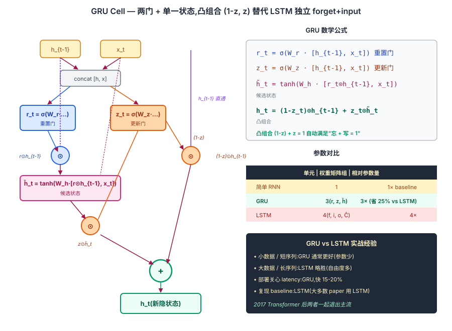
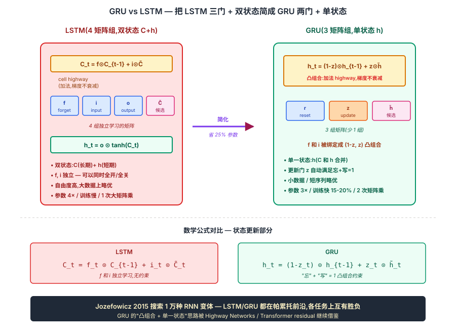

## 前作进展

2014 年 Cho 等人在做机器翻译时碰到一个实际问题:[LSTM](02-lstm.md) 虽然能稳定学到长依赖,但单元里有 4 组权重矩阵(三道门 + 候选状态),参数量是简单 RNN 的 4 倍。在他们当时设计的 RNN 编码器-解码器框架(就是同年提出的 [Seq2Seq](04-seq2seq.md))里,encoder 和 decoder 各自堆几层 LSTM,参数量很容易爆掉 GPU 显存。

工程上希望有一个**比 LSTM 更轻、但保留它解决长依赖能力**的循环单元。同时 LSTM 内部有几个看起来冗余的设计——遗忘门和输入门像是"互补"的(忘多少 + 写多少加起来差不多就是 1),细胞状态 `C` 和隐状态 `h` 也有信息重叠。Cho 团队的想法是:**把这些冗余合并掉,看看保留多少性能**。

## 核心思想

### 直觉:把 LSTM 的"忘 + 写"两件事绑成一个凸组合

理解 GRU 真正需要先抓一件事:**[LSTM](02-lstm.md) 的三门设计里,遗忘门 f 和输入门 i 看起来"互补"** —— 忘多少 + 写多少加起来差不多就是 1;细胞状态 C 和隐状态 h 也有信息重叠。Cho 等人 2014 反问:**能不能把这两个独立门绑成 `(1-z, z)` 互补关系,把 C 和 h 合并成单一状态,保留长依赖能力的同时砍掉 25% 参数?**

三件事必须同时成立才让 GRU 在 2014 年成立:

- **(1-z, z) 凸组合替代独立的 forget + input gate** — `h_t = (1-z_t)⊙h_{t-1} + z_t⊙h̃_t`,自动满足"忘多少 + 写多少 = 1",参数省一组矩阵
- **单一状态 h 替代 LSTM 的 C + h 两个状态** — 不再分长期 / 短期记忆,所有信息在一个 d 维向量里,接口更简单
- **重置门 r 提供"短期局部上下文" capability** — 计算候选 h̃ 时用 r⊙h_{t-1} 而不是 h_{t-1},允许模型在某些 step "忽略历史从头算"

三件事合起来:**GRU 比 LSTM 参数省 25%、训练快 15-20%**,在多数任务上性能持平。Bahdanau 2014 的原始 attention 论文 + Cho 自己的 RNN encoder-decoder 都基于 GRU 实现。但 GRU 没解决 RNN 串行不可并行的根本问题,2017 Transformer 后和 LSTM 一起退出 NLP 主流,现在主要见于嵌入式语音 / 时序预测等算力受限场景。


*图 1:GRU cell 内部 — 输入 x_t 和 h_{t-1} → 算两道门 r_t / z_t(sigmoid)→ 候选 h̃_t 用 r⊙h_{t-1} 调制后的历史 + x_t 经 tanh → 最终 h_t = (1-z)⊙h_{t-1} + z⊙h̃。底部 callout 强调凸组合 (1-z) + z = 1 自动满足"忘 + 写 = 1"。*

### 机制一:重置门 r — 决定候选状态用多少历史

GRU 的第一道门 **重置门 r_t** 决定在计算候选 h̃ 时用多少上一时刻的 h_{t-1}:

$$
r_t = \sigma(W_r [h_{t-1}, x_t] + b_r)
$$

$$
\tilde{h}_t = \tanh(W_h [r_t \odot h_{t-1}, x_t] + b_h)
$$

`r_t = 0` 意味着完全忽略历史,把当前时刻当作新序列的起点;`r_t = 1` 完全使用历史。这给模型"在某个 step 重启上下文"的能力 —— 比如句子边界、话题切换处。

注意 r_t 作用在**候选 h̃ 的计算上**,不直接作用在 h_t 上 —— 它影响的是"新写入的内容"而不是"保留的历史"。

### 机制二:更新门 z — 凸组合替代 LSTM 的独立 forget + input

GRU 的第二道门 **更新门 z_t** 同时承担 LSTM 的 forget gate 和 input gate 职责:

$$
z_t = \sigma(W_z [h_{t-1}, x_t] + b_z)
$$

$$
h_t = (1 - z_t) \odot h_{t-1} + z_t \odot \tilde{h}_t
$$

这是一个**凸组合** —— `(1-z) + z = 1` 自动满足。`z_t = 0` 完全保留旧状态(h_t = h_{t-1}),`z_t = 1` 完全采用新候选(h_t = h̃_t),中间值是加权平均。

对比 LSTM:`C_t = f_t ⊙ C_{t-1} + i_t ⊙ C̃_t`,其中 f 和 i 是独立学习的(没有 f + i = 1 的约束),理论上 LSTM 能学到"完全忘 + 完全写"(f=0, i=1)或"完全保留 + 不写"(f=1, i=0)甚至"既忘又不写"(f=0, i=0,清空状态)。GRU 用凸组合绑定后失去了"清空状态"的能力,但**实践上这一约束几乎不损害性能**,是合理的参数节省。

### 机制三:单一状态 h — 不再分长期 / 短期记忆

GRU 的第三个简化:**去掉 LSTM 的 cell state C,只保留 hidden state h**。LSTM 用 C 作"长期记忆 highway"、h 作"短期对外接口";GRU 把两者合并,所有信息都在 h 里。

参数账:

| 单元 | 权重矩阵组数 | 参数量(d = hidden, x = input) |
|------|------|------|
| 简单 RNN | 1 | d × (d + x) |
| GRU | 3(r, z, h̃) | 3 × d × (d + x) |
| LSTM | 4(f, i, o, C̃) | 4 × d × (d + x) |

GRU 比 LSTM 省 25% 参数。同等 d 下训练快 15-20% —— 但**速度优势会被一个工程细节削掉**:GRU 不像 LSTM 那样能把 3 个门 + 候选合并成一次矩阵乘,因为候选 h̃ 用的是 `r_t ⊙ h_{t-1}`,要等 r_t 算出来才能算。所以 GRU 至少要 2 次大矩阵乘(LSTM 可以 1 次),实际只快 15-20% 而非参数比例暗示的 25%。

去掉 C 后梯度怎么走?GRU 的 h 自身就是凸组合(`(1-z)⊙h_{t-1} + z⊙h̃`),`z_t` 接近 0 时 h_t ≈ h_{t-1},梯度近似 *1 直通 —— 这和 LSTM cell highway 的本质一样,只是路径走在 h 上而不是单独的 C 上。

### 三件套协同:重置门 + 更新门 + 单一状态 缺一不可

GRU 在 2014 年能用 75% LSTM 参数达到等价精度,**不是单一改进**,而是三件套同时调到协同点 —— 任何一个抽掉 GRU 都不成立,这一点和 [ResNet](../01-cnn/05-resnet.md) 的 `shortcut + BN + He 初始化` 协同关系一致:

- **只有重置门 + 单一状态,没有更新门凸组合** — 退化成"带门控的简单 RNN",h_t 的更新仍然是 tanh(W·...) 这种乘性形式,没有加法 highway,梯度消失问题回来
- **只有更新门 + 单一状态,没有重置门** — 失去"在 step 内忽略部分历史"的能力,候选 h̃ 永远基于完整 h_{t-1},某些任务(如句子边界 / 短期局部模式)上性能下降
- **只有两门,没有单一状态(还留着 C)** — 退化成 "LSTM 但少一个门",参数节省效果减半,且 C/h 分离的复杂性还在,设计意义不大

三件套合起来才让 GRU 成为 LSTM 的合理轻量替代。也正是这三件的耦合,GRU 不能进一步简化 —— 任何一项再省,要么失去长依赖能力(梯度消失回来),要么失去模型表达力(短期模式学不到)。这给后续门控设计提供了重要参考:**凸组合 + 单一状态**这一思路被 Highway Networks / Transformer residual 等后续工作不同程度借鉴。


*图 2:**左 LSTM** — 4 矩阵组(f / i / o / C̃)+ 双状态(C 长期 highway + h 短期接口),f 和 i 独立学习,自由度高但参数 4×。**右 GRU** — 3 矩阵组(r / z / h̃)+ 单一状态 h,把 f + i 绑定成 (1-z) + z 凸组合,参数 3×(省 25%)。底部公式对比:`C_t = f⊙C_{t-1} + i⊙C̃` vs `h_t = (1-z)⊙h_{t-1} + z⊙h̃`。底部 callout:Jozefowicz 2015 搜索 1 万种 RNN 变体,LSTM/GRU 都在帕累托前沿,凸组合 + 单一状态思路被 Transformer residual 间接继承。*

## 性能和实际选择

GRU 提出后,社区做过几轮系统比较:

- **Chung 2014 *Empirical Evaluation of Gated Recurrent Neural Networks***:在音乐建模和语音任务上,GRU 与 LSTM 性能基本持平,GRU 略优
- **Jozefowicz 2015 *An Empirical Exploration of RNN Architectures***:搜索了 1 万种 RNN 变体,结论是 LSTM/GRU 都是接近帕累托前沿的设计,在不同任务上各自略胜——**没有哪个版本能在所有任务上稳定超过另一个**
- **Greff 2017 *LSTM: A Search Space Odyssey***:对 LSTM 的每个门和连接做消融,发现遗忘门和输出门是关键、peephole 和输入门偏置可有可无

工程经验上的实际选择:

- **小数据 / 短序列**:GRU 通常更好,参数少不易过拟合
- **大数据 / 长序列**:LSTM 略胜,细胞状态的额外自由度在难任务上有用
- **生产部署关心 latency**:GRU,训练和推理都快 15–20%
- **保留兼容性 / 复现 paper**:LSTM,大多数 baseline 都是 LSTM

实际工业 NLP(Seq2Seq 时代的 GNMT、ELMo)更多用 LSTM;而注重轻量化的语音、嵌入式场景偏向 GRU。

## 关键代码

```python
import torch
import torch.nn as nn

class GRUCell(nn.Module):
    def __init__(self, input_dim, hidden_dim):
        super().__init__()
        # 重置门 r 和更新门 z 合并算
        self.W_rz = nn.Linear(input_dim + hidden_dim, 2 * hidden_dim)
        # 候选状态 h̃ 单独算,因为它要用 r ⊙ h_{t-1}
        self.W_h = nn.Linear(input_dim + hidden_dim, hidden_dim)
        self.hidden_dim = hidden_dim

    def forward(self, x_t, h_prev):
        combined = torch.cat([x_t, h_prev], dim=-1)
        rz = self.W_rz(combined)
        r, z = rz.chunk(2, dim=-1)
        r = torch.sigmoid(r)
        z = torch.sigmoid(z)

        # 候选 h̃ 用 r 调制后的历史
        combined_r = torch.cat([x_t, r * h_prev], dim=-1)
        h_cand = torch.tanh(self.W_h(combined_r))

        h_t = (1 - z) * h_prev + z * h_cand
        return h_t
```

注意 GRU 不像 LSTM 那样能把 3 个门 + 候选合并成一次矩阵乘——因为候选 `\tilde{h}` 用的是 `r_t ⊙ h_{t-1}`,要等 `r_t` 算出来才能算。所以 GRU 至少要两次大矩阵乘,这把"参数少 25%"的速度优势削掉一部分。

## 影响 / 后续

GRU 在 2014–2018 期间和 LSTM 并列为 RNN 的两个主力选项。它的两个具体贡献:

**1. 证明了 LSTM 的设计有冗余**——把三门压到两门、把 `C` 和 `h` 合并,性能不掉。这一发现影响了后续所有门控网络的设计:Highway Networks(Srivastava 2015)直接用 GRU 风格的 `T ⊙ F(x) + (1-T) ⊙ x` 作为前馈深度门;Transformer 的 residual + LayerNorm 实际可以看作是把 GRU 的 `(1-z, z)` 凸组合退化成 `(1, 1)`——没有门,但保留了加法主干

**2. 给 RNN 在 2014–2017 这个窗口期提供了一个更轻的选择**——大量机器翻译、对话、语言建模工作选 GRU 是因为单卡能塞更大的模型。Bahdanau 自己的 attention 工作就是用 GRU 实现的

但 GRU 没有改变 RNN 家族的根本问题——**串行不可并行**。2017 年 Transformer 把整条循环主轴扔掉之后,GRU 和 LSTM 一起退出 NLP 主流。今天看到 GRU 还是日常工作骨干的场景主要在两类:小数据上的传统 NLP 任务(还在用 BiLSTM-CRF/BiGRU-CRF 做 NER 的工业管线)、嵌入式语音和时序预测(算力受限,Transformer 太重)。

→ [04-seq2seq.md](04-seq2seq.md) · Cho 同一篇论文同时提出了 GRU 和 RNN encoder-decoder 框架
→ [05-attention.md](05-attention.md) · Bahdanau attention 的原始实现就是用 GRU 跑的
→ [02-lstm.md](02-lstm.md) · 父结构;GRU 的所有简化都是从 LSTM 开始
