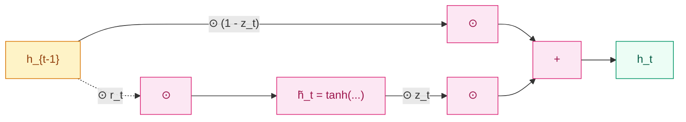

## 前作进展

2014 年 Cho 等人在做机器翻译时碰到一个实际问题:[LSTM](02-lstm.md) 虽然能稳定学到长依赖,但单元里有 4 组权重矩阵(三道门 + 候选状态),参数量是简单 RNN 的 4 倍。在他们当时设计的 RNN 编码器-解码器框架(就是同年提出的 [Seq2Seq](04-seq2seq.md))里,encoder 和 decoder 各自堆几层 LSTM,参数量很容易爆掉 GPU 显存。

工程上希望有一个**比 LSTM 更轻、但保留它解决长依赖能力**的循环单元。同时 LSTM 内部有几个看起来冗余的设计——遗忘门和输入门像是"互补"的(忘多少 + 写多少加起来差不多就是 1),细胞状态 `C` 和隐状态 `h` 也有信息重叠。Cho 团队的想法是:**把这些冗余合并掉,看看保留多少性能**。

## 核心思想:两门 + 单一状态

GRU 把 LSTM 的三道门压成两道,同时把 `C` 和 `h` 合成一个状态:

$$
\begin{aligned}
r_t &= \sigma(W_r [h_{t-1}, x_t] + b_r) \\
z_t &= \sigma(W_z [h_{t-1}, x_t] + b_z) \\
\tilde{h}_t &= \tanh(W_h [r_t \odot h_{t-1}, x_t] + b_h) \\
h_t &= (1 - z_t) \odot h_{t-1} + z_t \odot \tilde{h}_t
\end{aligned}
$$

两道门的语义:

- **重置门 `r_t`**:决定在计算候选 `\tilde{h}_t` 时,要用多少上一时刻的 `h_{t-1}`。`r_t = 0` 意味着完全忽略历史,把当前时刻当作新序列的起点
- **更新门 `z_t`**:同时承担 LSTM 的遗忘门和输入门的职责。`z_t = 0` 完全保留旧状态(`h_t = h_{t-1}`),`z_t = 1` 完全采用新候选(`h_t = \tilde{h}_t`)

关键是 `h_t` 的更新式:

$$
h_t = (1 - z_t) \odot h_{t-1} + z_t \odot \tilde{h}_t
$$

这是一个**凸组合**(`(1 - z) + z = 1`),保证 `h_t` 永远是 `h_{t-1}` 和 `\tilde{h}_t` 的加权平均。和 LSTM 的 `C_t = f_t ⊙ C_{t-1} + i_t ⊙ \tilde{C}_t` 相比,差异是:LSTM 的两个门是独立学习的,而 GRU 把它们绑成了 `1-z` 和 `z` 的互补关系——参数省下来了,但表达能力略受限。



*图 1:GRU 内部数据流——单一状态 `h` 在 `(1-z, z)` 凸组合下更新,重置门 `r` 只控制候选 `\tilde{h}` 用多少历史。*

参数量对比:

| 单元 | 权重矩阵组数 | 参数量(`d` = hidden, `x` = input) |
|------|------|------|
| 简单 RNN | 1 | `d × (d + x)` |
| GRU | 3(`r`, `z`, `\tilde{h}`) | `3 × d × (d + x)` |
| LSTM | 4(`f`, `i`, `o`, `\tilde{C}`) | `4 × d × (d + x)` |

GRU 比 LSTM 省 25% 参数。在同等 `d` 下,GRU 训练大约快 15–20%。

## 性能和实际选择

GRU 提出后,社区做过几轮系统比较:

- **Chung 2014 *Empirical Evaluation of Gated Recurrent Neural Networks***:在音乐建模和语音任务上,GRU 与 LSTM 性能基本持平,GRU 略优
- **Jozefowicz 2015 *An Empirical Exploration of RNN Architectures***:搜索了 1 万种 RNN 变体,结论是 LSTM/GRU 都是接近帕累托前沿的设计,在不同任务上各自略胜——**没有哪个版本能在所有任务上稳定超过另一个**
- **Greff 2017 *LSTM: A Search Space Odyssey***:对 LSTM 的每个门和连接做消融,发现遗忘门和输出门是关键、peephole 和输入门偏置可有可无

工程经验上的实际选择:

- **小数据 / 短序列**:GRU 通常更好,参数少不易过拟合
- **大数据 / 长序列**:LSTM 略胜,细胞状态的额外自由度在难任务上有用
- **生产部署关心 latency**:GRU,训练和推理都快 15–20%
- **保留兼容性 / 复现 paper**:LSTM,大多数 baseline 都是 LSTM

实际工业 NLP(Seq2Seq 时代的 GNMT、ELMo)更多用 LSTM;而注重轻量化的语音、嵌入式场景偏向 GRU。

## 关键代码

```python
import torch
import torch.nn as nn

class GRUCell(nn.Module):
    def __init__(self, input_dim, hidden_dim):
        super().__init__()
        # 重置门 r 和更新门 z 合并算
        self.W_rz = nn.Linear(input_dim + hidden_dim, 2 * hidden_dim)
        # 候选状态 h̃ 单独算,因为它要用 r ⊙ h_{t-1}
        self.W_h = nn.Linear(input_dim + hidden_dim, hidden_dim)
        self.hidden_dim = hidden_dim

    def forward(self, x_t, h_prev):
        combined = torch.cat([x_t, h_prev], dim=-1)
        rz = self.W_rz(combined)
        r, z = rz.chunk(2, dim=-1)
        r = torch.sigmoid(r)
        z = torch.sigmoid(z)

        # 候选 h̃ 用 r 调制后的历史
        combined_r = torch.cat([x_t, r * h_prev], dim=-1)
        h_cand = torch.tanh(self.W_h(combined_r))

        h_t = (1 - z) * h_prev + z * h_cand
        return h_t
```

注意 GRU 不像 LSTM 那样能把 3 个门 + 候选合并成一次矩阵乘——因为候选 `\tilde{h}` 用的是 `r_t ⊙ h_{t-1}`,要等 `r_t` 算出来才能算。所以 GRU 至少要两次大矩阵乘,这把"参数少 25%"的速度优势削掉一部分。

## 影响 / 后续

GRU 在 2014–2018 期间和 LSTM 并列为 RNN 的两个主力选项。它的两个具体贡献:

**1. 证明了 LSTM 的设计有冗余**——把三门压到两门、把 `C` 和 `h` 合并,性能不掉。这一发现影响了后续所有门控网络的设计:Highway Networks(Srivastava 2015)直接用 GRU 风格的 `T ⊙ F(x) + (1-T) ⊙ x` 作为前馈深度门;Transformer 的 residual + LayerNorm 实际可以看作是把 GRU 的 `(1-z, z)` 凸组合退化成 `(1, 1)`——没有门,但保留了加法主干

**2. 给 RNN 在 2014–2017 这个窗口期提供了一个更轻的选择**——大量机器翻译、对话、语言建模工作选 GRU 是因为单卡能塞更大的模型。Bahdanau 自己的 attention 工作就是用 GRU 实现的

但 GRU 没有改变 RNN 家族的根本问题——**串行不可并行**。2017 年 Transformer 把整条循环主轴扔掉之后,GRU 和 LSTM 一起退出 NLP 主流。今天看到 GRU 还是日常工作骨干的场景主要在两类:小数据上的传统 NLP 任务(还在用 BiLSTM-CRF/BiGRU-CRF 做 NER 的工业管线)、嵌入式语音和时序预测(算力受限,Transformer 太重)。

→ [04-seq2seq.md](04-seq2seq.md) · Cho 同一篇论文同时提出了 GRU 和 RNN encoder-decoder 框架
→ [05-attention.md](05-attention.md) · Bahdanau attention 的原始实现就是用 GRU 跑的
→ [02-lstm.md](02-lstm.md) · 父结构;GRU 的所有简化都是从 LSTM 开始
