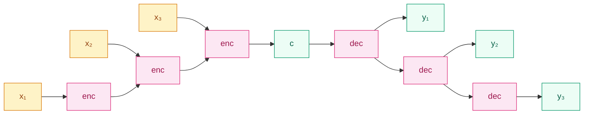

## 前作进展

2014 年之前,**机器翻译**这个领域的主流方法是 **SMT(Statistical Machine Translation)**——从大规模平行语料中统计短语对齐 + 翻译概率 + 语言模型,典型代表是 2003 年的 *Phrase-Based SMT*(Koehn et al.)和 Moses 系统。SMT 的工程化做得很彻底,但它的核心机制——**短语级查表 + 概率组合**——决定了几个硬伤:

- **流水线复杂**:词对齐、短语抽取、调序模型、语言模型每一步都是独立训练的子系统,任何一环出错都会传到下游
- **语义信息丢失**:短语表本质是字符串到字符串的映射,无法捕捉"国王 - 男人 + 女人 = 女王"这种语义关系
- **长距离调序困难**:英语 SVO、日语 SOV、阿拉伯语 VSO,SMT 的调序模型基本是局部的,跨从句重组靠概率剪枝勉强工作

NLP 社区在 2010 年前后用神经网络做语言模型(Bengio 2003 / Mikolov 2010)已经显示出"端到端学习能逼近统计模型"。自然的下一步是:**能不能用一个神经网络直接做翻译,把整条 SMT 流水线一口气替换掉?**

困难是显然的——翻译是**变长输入到变长输出**的任务,英语句子 12 个词,翻译成中文可能是 8 个汉字,可能是 18 个汉字,事先不知道。当时神经网络架构——MLP、CNN、RNN——都需要"固定大小输入"和"固定大小输出"。RNN 至少能吃变长输入,但每一步对应一个输出,长度天然绑定。

2014 年几乎同时出现了两篇论文,各自独立给出了解法:

- **Cho et al.(EMNLP 2014, June)**——*Learning Phrase Representations using RNN Encoder–Decoder*。用一个 GRU encoder 读入源句压成上下文向量,一个 GRU decoder 从向量生成目标句。**第一次提出"encoder-decoder"这一架构名称**
- **Sutskever et al.(NIPS 2014, September)**——*Sequence to Sequence Learning with Neural Networks*。用 LSTM 做同样的事,但工程上做出了 WMT'14 英法翻译 SOTA。**第一次让端到端神经翻译在生产 benchmark 上超过 SMT**

两篇论文给的是同一个范式——**Sequence to Sequence**——只是用不同的循环单元和工程 trick 实现。这个范式后来不只用在翻译上,而是覆盖了对话、摘要、问答、代码生成、语音转写,成为 NLP 在 Transformer 之前的核心架构。

## 核心思想:Encoder + Decoder + 上下文向量

Seq2Seq 把翻译拆成两步:**编码**和**解码**。



*图 1:Seq2Seq 整体——encoder 把任意长输入 `x_1, ..., x_T` 压进一个固定维度的上下文向量 `c`,decoder 从 `c` 起步逐步生成 `y_1, ..., y_T'`,输入输出长度独立。*

**Encoder** 是一个标准的 RNN(原版用 LSTM 或 GRU)。它读完整个输入序列 `x_1, x_2, ..., x_T`,把最后一时刻的隐状态当作整个句子的语义向量:

$$
h_t = \text{LSTM}(x_t, h_{t-1}), \quad c = h_T
$$

`c` 称为 **context vector**,典型维度 500–1000。所有信息——词序、句法、语义——都被压在这个固定维度向量里。

**Decoder** 也是一个 RNN,但它的初始状态是 `c`,每一步根据上一时刻的输出 `y_{t-1}` 和当前隐状态 `s_t` 生成下一个词:

$$
s_t = \text{LSTM}(y_{t-1}, s_{t-1}), \quad s_0 = c
$$

$$
p(y_t | y_{<t}, x) = \text{softmax}(W_o s_t)
$$

特殊 token `<SOS>`(start of sentence)作为 `y_0` 起步,生成到 `<EOS>`(end of sentence)停止。这种"自回归"生成方式——逐字预测、上一步的输出作为下一步输入——是后来所有语言模型(GPT/BERT 解码端/Transformer)的标准做法。

**训练目标**是最大化目标序列的对数似然:

$$
\mathcal{L} = -\sum_{t=1}^{T'} \log p(y_t | y_{<t}, x)
$$

训练时用 **teacher forcing**:decoder 的输入用 ground truth 的 `y_{t-1}`(而不是模型自己上一步预测的),让训练更稳定。

## Sutskever 的两个工程 trick

Sutskever 那篇 NIPS 论文真正让 Seq2Seq 在 WMT'14 上超过 SMT 的不是基本架构(基本架构和 Cho 同年提出),而是几个看起来微小但关键的工程选择:

**1. 4 层深 LSTM**——encoder 和 decoder 各堆 4 层 LSTM,每层 1000 维。当时大多数神经网络模型只用 1 层,堆深的设计提升了模型容量,在 WMT'14 上从浅模型的 BLEU 28.5 推到了 34.8。

**2. 倒序输入**——Sutskever 发现把源句**反过来**喂给 encoder(`x_T, x_{T-1}, ..., x_1`)能显著改善翻译质量,BLEU 提升 4–5 个点。直观解释:正序情况下源句开头 `x_1` 离最终上下文向量 `c` 的距离是 `T` 步,模型要记 `T` 步才能用上;倒序后 `x_1` 离 `c` 只有 1 步,**缩短了源句和目标句开头之间的"梯度路径"**,让 LSTM 更容易学到对齐。这个 trick 后来被 Bahdanau 的 attention 直接淘汰掉(attention 让每个目标词可以直接看任意源词),但在 attention 出来之前是工业翻译的标配。

**3. Beam search 解码**——推理时不只取每步概率最高的词(greedy),而是同时维护 top-`k`(典型 `k = 5` 或 `10`)候选序列,每步扩展所有候选,最后取整体 log-prob 最高的。BLEU 提升 1–2 个点,代价是推理慢 `k` 倍。这是序列生成的标准做法,沿用到今天。

## 信息瓶颈

Seq2Seq 的核心局限来自架构本身:**整个输入序列被压成一个固定维度的上下文向量 `c`**。这导致一个明显的现象——**翻译质量随源句长度急剧下降**。

Sutskever 论文里有一张曲线图:在 WMT'14 法英任务上,源句 < 20 词时 BLEU ≈ 35,源句长度增长到 70 词时 BLEU 跌到 25 以下。SMT 在长句上的表现反而更稳定——因为 SMT 是局部短语级查表,不依赖一个全局压缩向量。

这就是后来 Bahdanau attention 要解决的"信息瓶颈"问题:一个 500 维向量承载不下一句 50 词的所有语义细节,模型在解码长句时会"忘记"前面的源词。解决方案是 [05-attention.md](05-attention.md)——让 decoder 每一步直接回头看 encoder 的所有时刻,通过加权对齐绕过单一上下文向量。

## 训练细节

| 维度 | Sutskever 2014 WMT'14 英法 |
|------|------|
| 数据 | WMT'14 平行语料,12M 句子对,348M 法语词 |
| 词表 | 源端 160K 最常见词,目标端 80K,其他用 `<UNK>` |
| 模型 | encoder 4 层 LSTM × 1000 维 + decoder 4 层 LSTM × 1000 维 + softmax,~380M 参数 |
| 优化器 | SGD,学习率 0.7,5 epoch 后每 0.5 epoch 减半 |
| Batch | 128 序列,按长度分桶减少 padding |
| 梯度裁剪 | 范数超过 5 时缩放 |
| 训练时间 | 8 GPU 并行(每层 LSTM 一块 GPU),10 天 |
| 解码 | Beam size 12,长度惩罚归一化 |
| 结果 | BLEU 34.8(集成 5 个模型 reverse + 解码),首次超过 SMT 系统 baseline 33.3 |

## 关键代码

```python
import torch
import torch.nn as nn

class Encoder(nn.Module):
    def __init__(self, vocab_src, embed_dim, hidden_dim, num_layers=4):
        super().__init__()
        self.embed = nn.Embedding(vocab_src, embed_dim)
        self.lstm = nn.LSTM(embed_dim, hidden_dim, num_layers, batch_first=True)

    def forward(self, x):
        # x: [B, T_src],倒序输入
        x = x.flip(dims=[1])
        emb = self.embed(x)
        _, (h, c) = self.lstm(emb)  # 只要最后一层最后一步状态
        return h, c  # [num_layers, B, hidden_dim]

class Decoder(nn.Module):
    def __init__(self, vocab_tgt, embed_dim, hidden_dim, num_layers=4):
        super().__init__()
        self.embed = nn.Embedding(vocab_tgt, embed_dim)
        self.lstm = nn.LSTM(embed_dim, hidden_dim, num_layers, batch_first=True)
        self.out = nn.Linear(hidden_dim, vocab_tgt)

    def forward(self, y, state):
        # y: [B, T_tgt],训练时是 ground truth(teacher forcing)
        emb = self.embed(y)
        out, state = self.lstm(emb, state)
        logits = self.out(out)  # [B, T_tgt, vocab_tgt]
        return logits, state

class Seq2Seq(nn.Module):
    def __init__(self, enc, dec):
        super().__init__()
        self.enc, self.dec = enc, dec

    def forward(self, x_src, y_tgt_in):
        state = self.enc(x_src)
        logits, _ = self.dec(y_tgt_in, state)
        return logits
```

注意 `Encoder.forward` 里 `x.flip(dims=[1])`——这就是 Sutskever 的倒序输入 trick。推理时 decoder 要手写一个 greedy/beam search 循环,因为不能用 teacher forcing。

## 影响 / 后续

Seq2Seq 在 2014–2017 期间是 NLP 的统一范式。几乎所有"输入一段文本 → 输出一段文本"的任务都被改写成 Seq2Seq:

- **机器翻译**:Google 2016 上线的 [GNMT](https://arxiv.org/abs/1609.08144) 是 8 层 LSTM Seq2Seq + 残差连接 + attention,把英中翻译质量推到当时 SOTA
- **对话系统**:2015 Vinyals & Le *Neural Conversational Model*,把"上一句"作为源、"下一句"作为目标
- **文本摘要**:Rush 2015 / Nallapati 2016,把整篇文章作为源、摘要作为目标
- **代码生成**:2016 之后的 code-completion / docstring → code 任务
- **语音识别**:Listen-Attend-Spell(Chan 2015),音频特征 → 文本

更深远的影响是**架构层面的统一**:在 Seq2Seq 之前,翻译/摘要/对话/语音各有专门的流水线;Seq2Seq 之后,这些任务**共用一个 encoder-decoder 骨架**,只是输入输出 token 化方式不同。这一抽象在 Transformer 时代被发扬光大——T5(2019)把所有 NLP 任务都改写成"text → text"的 Seq2Seq 形式,GPT(2018)进一步简化成"全 decoder"的自回归生成,但 encoder-decoder 这一基本骨架始终被沿用。

但 Seq2Seq 留下两个明确的尾巴:

1. **信息瓶颈**——固定上下文向量在长输入上失效。**[05-attention.md](05-attention.md) 解决**
2. **串行不可并行**——encoder 和 decoder 都是 RNN,训练和推理都要逐步展开。**[../05-transformer/](../05-transformer/) 解决**

→ [05-attention.md](05-attention.md) · 在 Seq2Seq 上加 attention,让 decoder 直接看 encoder 所有时刻
→ [../05-transformer/](../05-transformer/) · 把整条循环主轴换成 self-attention,encoder-decoder 骨架保留
→ [../07-gpt-scaling/](../07-gpt-scaling/) · GPT 用纯 decoder + 自回归生成,继承 Seq2Seq 的解码端
→ [03-gru.md](03-gru.md) · Cho 那篇 EMNLP 同时提出 GRU 和 encoder-decoder
