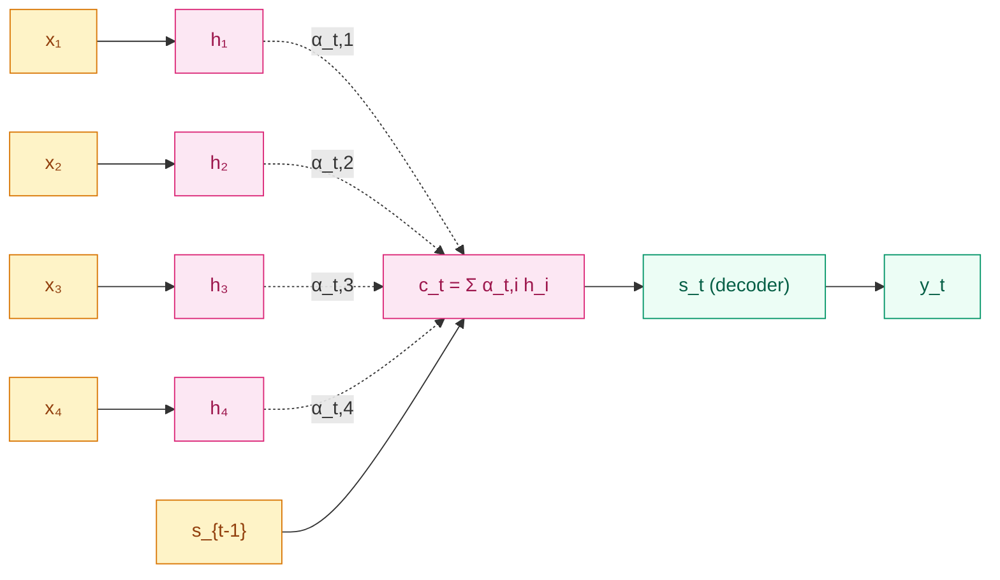

## 前作进展

[Seq2Seq](04-seq2seq.md) 在 2014 年把神经机器翻译从概念推到了 SOTA,但它的核心局限——**整个源句被压成一个固定维度的上下文向量 `c`**——在长句翻译上暴露得很明显。Sutskever 2014 的实验里源句超过 30 词后 BLEU 开始掉,超过 60 词后掉得很快。Cho 同年在 *On the Properties of Neural Machine Translation* 里把这个现象量化得更彻底:在英法翻译上,SMT 的翻译质量随源句长度基本平稳,而 RNN encoder-decoder 在长句上 BLEU 单调下降到几乎不可用。

直觉上原因是清楚的:一个 500–1000 维向量装不下一句 50 词的所有语义细节,模型在生成第 30 个目标词时,encoder 早期的源词信号已经被后续输入"覆盖"得差不多了。Sutskever 的倒序输入 trick 缓解了这个问题——把源句反过来让 `x_1` 离 `c` 更近——但本质上只是把"忘记的位置"从开头挪到了结尾,治标不治本。

Bahdanau、Cho、Bengio 在 2014 年 9 月发表(ICLR 2015 接收)了 *Neural Machine Translation by Jointly Learning to Align and Translate*,给出的解决方案是结构性的:**不要再压成一个向量,而是让 decoder 每一步直接回头看 encoder 的所有时刻,学一个该步该关注哪些源词的加权分布**。这就是后来主导整个 NLP 的 **attention** 机制的第一次正式出场。

## 核心思想

Bahdanau 把 Seq2Seq 改造成这样:



*图 1:Bahdanau attention——decoder 第 `t` 步的上下文 `c_t` 是 encoder 所有隐状态 `h_1, ..., h_T` 的加权和,权重 `α_t,i` 由 `s_{t-1}` 和 `h_i` 的兼容度学到。*

具体三件事:

**1. Encoder 用 BiRNN,保留全部时刻的隐状态**——不再只取最后一时刻 `h_T` 当 `c`。Bahdanau 用双向 GRU,前向 `\overrightarrow{h}_i` 看到 `x_1...x_i`,反向 `\overleftarrow{h}_i` 看到 `x_T...x_i`,拼起来 `h_i = [\overrightarrow{h}_i; \overleftarrow{h}_i]` 既覆盖左上下文又覆盖右上下文。所有 `T` 个 `h_i` 都保留下来。

**2. Decoder 每一步算一个对齐分数 `α_t,i`**——给定 decoder 上一步状态 `s_{t-1}` 和 encoder 第 `i` 个隐状态 `h_i`,用一个小 MLP 算"兼容度":

$$
e_{t,i} = v^\top \tanh(W_a s_{t-1} + U_a h_i)
$$

这是 **additive attention**(也叫 Bahdanau attention),`v, W_a, U_a` 是要学的参数。然后用 softmax 归一化成一个分布:

$$
\alpha_{t,i} = \frac{\exp(e_{t,i})}{\sum_{j=1}^{T} \exp(e_{t,j})}
$$

`α_t = (α_t,1, ..., α_t,T)` 满足 `Σ α_t,i = 1`,可以解释为"decoder 第 `t` 步分配给源词 `x_i` 的注意力"。

**3. 上下文向量随时间变化**——把 encoder 隐状态按 `α_t` 加权,得到第 `t` 步专用的上下文:

$$
c_t = \sum_{i=1}^{T} \alpha_{t,i} \, h_i
$$

decoder 用 `c_t` 替代原来的固定 `c`,计算下一步隐状态:

$$
s_t = \text{GRU}(s_{t-1}, [y_{t-1}; c_t])
$$

注意 `c_t` 随时间步变化——decoder 生成第 1 个目标词时,`α_1` 可能集中在源句开头;生成第 10 个词时,`α_{10}` 可能集中在源句中部。每一步都"按需"从 encoder 拉取最相关的信息。

## 为什么 attention 解决了信息瓶颈

固定 `c` 的瓶颈来自一个数学事实:**单个 `d` 维向量的信息容量是 `O(d)`,但一句 `T` 个词的语义量是 `O(T·d)`**。`T = 50, d = 500` 时,源信息总量是 25K 单位,装进 500 维向量必然有 50× 的压缩,长句必然丢失细节。

Attention 把信息载体从单个向量换成了 `T` 个向量的集合 `(h_1, ..., h_T)`,**总容量随源句长度线性增长**。decoder 不再需要在 `c` 里同时保留 50 个词的细节,而是每一步只取该步需要的几个词——`α_t` 通常很稀疏(80% 集中在 2–3 个源词上)。

Bahdanau 在论文里给出对比数据,在 WMT'14 英法上:

| 源句长度 | RNN encdec(固定 c) | RNN encdec + attention |
|------|------|------|
| ≤ 20 | BLEU 25 | BLEU 28 |
| 20–40 | 22 | 27 |
| 40–60 | 18 | 26 |
| > 60 | 12 | 24 |

固定 c 在长句上几乎不可用,attention 让长句质量回到与短句基本平行的水平。这是序列建模在长上下文上的第一次真正突破,直接铺平了 2017 年 Transformer 把整条循环主轴扔掉、彻底依赖 attention 的路径。

## Luong attention 的两个改进

2015 年 Luong et al. *Effective Approaches to Attention-based Neural Machine Translation* 给出了几个工程上更顺手的改动,后来在生产系统里更常见:

**1. Dot-product / multiplicative attention**——把 Bahdanau 的加法兼容度换成内积:

$$
e_{t,i} = s_t^\top h_i
$$

或者带一个矩阵 `W`:

$$
e_{t,i} = s_t^\top W h_i
$$

少一个 MLP,GPU 上更快;后来 Transformer 用的是同款 **scaled dot-product attention** —— `softmax(QK^T / sqrt(d))V`。

**2. Global vs local attention**——global attention 是对所有 `T` 个源时刻算分数(Bahdanau 默认做法),local attention 只看一个小窗口减少计算。今天 Transformer 也有类似的稀疏 attention / sliding window attention 变体。

## 训练细节

Bahdanau 原文(WMT'14 英法):

| 维度 | 取值 |
|------|------|
| 数据 | WMT'14,348M 法语词,30K 词表 |
| 模型 | encoder 1 层 BiGRU × 1000 维 + decoder 1 层 GRU × 1000 维 + attention,~60M 参数(比 Sutskever Seq2Seq 小 6 倍) |
| 优化器 | Adadelta(ε=10⁻⁶, ρ=0.95) |
| Batch | 80 句子,按长度分桶 |
| 训练时间 | 单 GPU 约 5 天 |
| 解码 | Beam size 12 |
| 结果 | BLEU 28.45(单模型 vs Sutskever 5 模型集成 34.8;但 Bahdanau 的关键不是 SOTA 而是长句质量) |

注意 Bahdanau 用 GRU 不是 LSTM,Seq2Seq 论文里 Sutskever 用 LSTM。两者在性能上无显著差异,选哪个主要看实验室习惯。

## 关键代码

```python
import torch
import torch.nn as nn
import torch.nn.functional as F

class BahdanauAttention(nn.Module):
    def __init__(self, hidden_dim):
        super().__init__()
        self.W_a = nn.Linear(hidden_dim, hidden_dim, bias=False)  # decoder state proj
        self.U_a = nn.Linear(hidden_dim, hidden_dim, bias=False)  # encoder states proj
        self.v   = nn.Linear(hidden_dim, 1, bias=False)

    def forward(self, s_prev, enc_hidden):
        # s_prev: [B, hidden_dim]
        # enc_hidden: [B, T_src, hidden_dim]
        s_proj = self.W_a(s_prev).unsqueeze(1)        # [B, 1, hidden_dim]
        h_proj = self.U_a(enc_hidden)                 # [B, T_src, hidden_dim]
        e = self.v(torch.tanh(s_proj + h_proj)).squeeze(-1)  # [B, T_src]
        alpha = F.softmax(e, dim=-1)                  # [B, T_src]
        c_t = torch.bmm(alpha.unsqueeze(1), enc_hidden).squeeze(1)  # [B, hidden_dim]
        return c_t, alpha
```

用法:在 decoder 每一步先用 `s_{t-1}` 算 attention 拿到 `c_t`,再把 `[y_{t-1}; c_t]` 一起喂给 decoder GRU。`alpha` 还可以作为副产品输出,做翻译时画**对齐矩阵热图**——`α_{t,i}` 大的地方就是"目标词 `y_t` 主要由源词 `x_i` 翻译来",这是 Bahdanau 论文里最直观的 figure,也是 attention 在 NLP 里"可解释性"的起点。

## 影响 / 后续

Bahdanau attention 在 NLP 历史上的位置很特殊:它**单点解决了 Seq2Seq 的瓶颈问题**,但更重要的是它**第一次把"加权对齐"这个机制从循环网络里抽离出来,变成一个独立的可复用组件**。这一抽象后来彻底改写了整个 NLP:

- **2015–2016**:几乎所有 Seq2Seq 模型都加 attention,机器翻译、对话、摘要全部上 attention。Luong 2015 给出工程更轻的 dot-product 版本
- **2017 Transformer**:Vaswani 等人意识到——既然 attention 已经能完成 decoder 看 encoder 的工作,那循环本身可以扔掉。把 attention 推到极致(self-attention 取代循环、cross-attention 取代 encoder-decoder 通信、multi-head 增加表达力),Seq2Seq 的循环骨架被换成纯 attention,获得完全的并行化
- **2018 之后**:BERT(self-attention only,无循环)、GPT(self-attention only,无循环)、ViT(self-attention 应用到视觉)、CLIP(self-attention 跨模态对齐)——整个 2018 之后的深度学习,核心组件都是某种 attention

从这个角度,Bahdanau 这篇 2014 年的论文是 NLP 历史的分水岭——**循环结构在 attention 出现之后逐步失去主导地位**。Transformer 不是从天上掉下来的,它是把 Bahdanau attention 推到逻辑终点的产物:

| Bahdanau 2014 | Transformer 2017 |
|------|------|
| Decoder 看 Encoder(cross-attention) | 同样有 cross-attention,几乎一样 |
| Encoder 用 BiRNN 保留所有时刻 | Encoder 用 self-attention,完全去掉循环 |
| Additive attention(MLP 兼容度) | Scaled dot-product attention(更快) |
| Decoder GRU 串行展开 | Decoder 训练时全并行(只在推理时串行) |

→ [../05-transformer/](../05-transformer/) · 把 attention 推到逻辑终点,完全去掉循环
→ [04-seq2seq.md](04-seq2seq.md) · attention 的直接前作,共享 encoder-decoder 骨架
→ [02-lstm.md](02-lstm.md) · 加权对齐这种"按需取信息"的思想其实在 LSTM 的门控里就有原型
→ [../foundations/04-normalization/](../foundations/04-normalization/) · LayerNorm 在深层 attention 网络里的必要性
