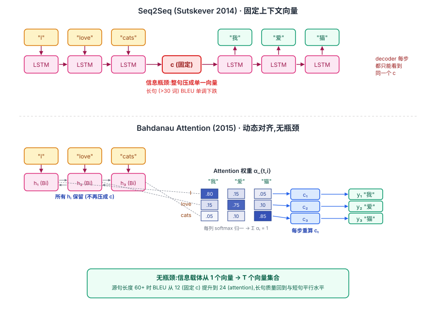
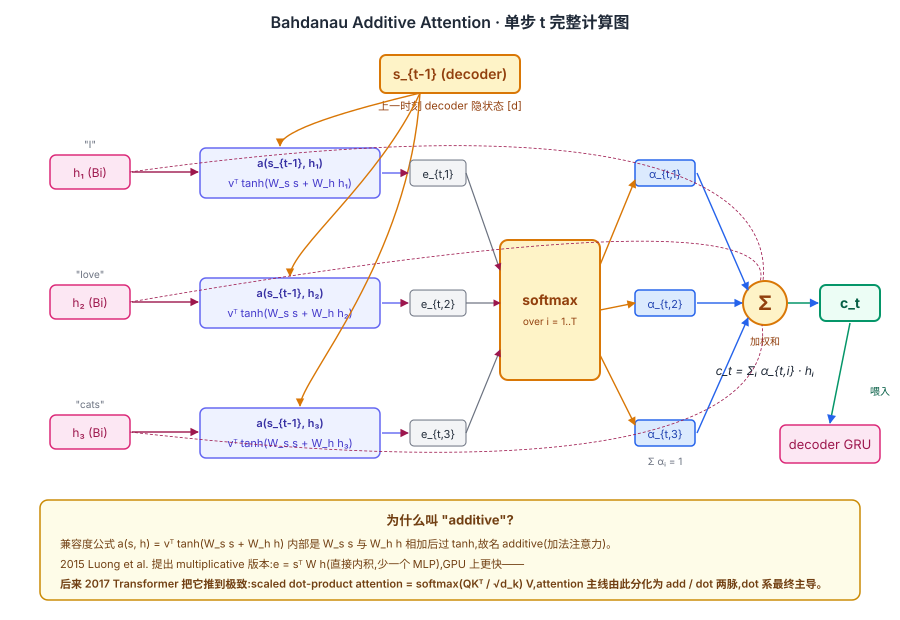

## 前作进展

[Seq2Seq](04-seq2seq.md) 在 2014 年把神经机器翻译从概念推到了 SOTA,但它的核心局限——**整个源句被压成一个固定维度的上下文向量 `c`**——在长句翻译上暴露得很明显。Sutskever 2014 的实验里源句超过 30 词后 BLEU 开始掉,超过 60 词后掉得很快。Cho 同年在 *On the Properties of Neural Machine Translation* 里把这个现象量化得更彻底:在英法翻译上,SMT 的翻译质量随源句长度基本平稳,而 RNN encoder-decoder 在长句上 BLEU 单调下降到几乎不可用。

直觉上原因是清楚的:一个 500–1000 维向量装不下一句 50 词的所有语义细节,模型在生成第 30 个目标词时,encoder 早期的源词信号已经被后续输入"覆盖"得差不多了。Sutskever 的倒序输入 trick 缓解了这个问题——把源句反过来让 `x_1` 离 `c` 更近——但本质上只是把"忘记的位置"从开头挪到了结尾,治标不治本。

Bahdanau、Cho、Bengio 在 2014 年 9 月发表(ICLR 2015 接收)了 *Neural Machine Translation by Jointly Learning to Align and Translate*,给出的解决方案是结构性的:**不要再压成一个向量,而是让 decoder 每一步直接回头看 encoder 的所有时刻,学一个该步该关注哪些源词的加权分布**。这就是后来主导整个 NLP 的 **attention** 机制的第一次正式出场。

## 核心思想

### 直觉:解码端每步都"回头看"源序列,不被固定 context 卡死

理解 Bahdanau attention 真正需要先抓一件事:**Seq2Seq 把整个源句子压成一个固定 vector,长句翻译时信息丢失严重;Bahdanau 反问——解码每个目标词时,能不能动态地从源序列里"挑相关位置"看?**

在 Sutskever 2014 的 Seq2Seq 视角下,encoder LSTM 把整个源句"I love cats"逐步累积成一个 `c`,然后 decoder 每一步都只能看到同一个 `c` 来生成"我 / 爱 / 猫"。这本质是一次"全句先打包,再分批译"——信息载体是**单个 `d` 维向量**,容量是 `O(d)`,而一句 `T` 个词的语义量是 `O(T·d)`,长句必然挤掉细节。Sutskever 倒序输入只是把"忘记的位置"从开头挪到结尾,治标不治本。

Bahdanau 的反问把这个心智模型彻底替换掉:**译"我"时只盯"I",译"猫"时只盯"cats"——人类译者本来就这么做,为什么神经网络非要先压成一个向量再展开?** 解法是让 decoder 每一步**直接回头看 encoder 的所有时刻**,学一个该步该关注哪些源词的加权分布。这就是 **attention** 机制的第一次正式出场——比 Transformer 早整整 3 年,后来主导整个 NLP 的所有注意力路线都从这里发源。


*图 1:上半是原 Seq2Seq——"I love cats"经 encoder LSTM 压成单一向量 `c`,decoder 每步都只能看同一个 `c`,出现信息瓶颈;下半是 Bahdanau attention——encoder 输出 h₁/h₂/h₃ 三个 hidden state 全部保留,decoder 每步算一个 3 维 attention 分布(右侧 heatmap 中"我↔I"、"爱↔love"、"猫↔cats"高亮对角线),按权重加权得到该步专用的 `c_t`,**信息载体从 1 个向量换成 T 个向量的集合,长句质量回到与短句平行水平**。*

### 机制一:Encoder 输出每个位置的 hidden state(不只是最后一个)

要让 decoder 能"回头看",前提是 encoder 必须把每个位置的信息**都留下来**,而不是压成一个 `c`。Bahdanau 在 encoder 端用 **双向 GRU**:

- 前向 GRU 从左到右读源句,产生 `\overrightarrow{h}_i`——它看到了 `x_1...x_i`(左上下文)
- 反向 GRU 从右到左读源句,产生 `\overleftarrow{h}_i`——它看到了 `x_T...x_i`(右上下文)
- 拼接得到 `h_i = [\overrightarrow{h}_i ; \overleftarrow{h}_i]`,**该位置的表示同时编码了它两侧的语境**

所有 `T` 个 `h_i` 都保留下来,encoder 的输出是一个 `T × 2d` 的矩阵而不是单个向量。这一步是 attention 能"回头看"的物理前提——**信息源不再是漏斗末端的一个点,而是一整条 hidden state 序列**。

注意双向是 Bahdanau 的实现选择,不是 attention 机制本身的要求(单向 RNN 也能加 attention,只是少了右上下文)。但"保留全部时刻"这件事是**强制的**——如果只留 `h_T`,就退化回 Seq2Seq。

### 机制二:Alignment Score——解码端 s_{t-1} 和每个 encoder h_i 算相关性

有了完整的 `(h_1, ..., h_T)`,接下来要回答的问题是:**第 t 步该给哪些 `h_i` 多大权重?** Bahdanau 用一个小 feedforward 网络(单隐层 MLP)算每对 `(s_{t-1}, h_i)` 的"兼容度":

$$
e_{t,i} = v^\top \tanh(W_s\, s_{t-1} + W_h\, h_i)
$$

这里 `W_s, W_h, v` 是三个待学参数。**因为公式内部是 `W_s s` 与 `W_h h` 先相加再过 tanh,所以这种打分方式叫 additive attention(加法注意力)——Bahdanau 的名字由来正是这里**。

然后用 softmax 把 `T` 个分数归一化成一个分布:

$$
\alpha_{t,i} = \frac{\exp(e_{t,i})}{\sum_{j=1}^{T} \exp(e_{t,j})}, \quad \sum_i \alpha_{t,i} = 1
$$

`α_t = (α_{t,1}, ..., α_{t,T})` 可以解释为"decoder 第 t 步分配给源词 `x_i` 的注意力比例"。实际训练出来的 `α_t` 通常很稀疏——80% 的权重集中在 2–3 个源词上,可视化出来就是论文里那张著名的对齐热图("European Economic Area" ↔ "zone économique européenne")。

这是 attention 第一次把"按相关性分配权重"这件事**显式参数化、可学化、可解释化**——也是后来 Transformer `softmax(QK^T / sqrt(d_k))` 的直接祖先。

### 机制三:Context Vector——加权和后输入解码器

有了权重 `α_t`,把 encoder 隐状态按权重加和,就得到第 t 步专用的上下文向量:

$$
c_t = \sum_{i=1}^{T} \alpha_{t,i}\, h_i
$$

decoder 用 `c_t` 替代原来的固定 `c`,作为额外输入喂给 GRU:

$$
s_t = \text{GRU}(s_{t-1},\ [y_{t-1}\,;\, c_t])
$$

关键是 **`c_t` 随 t 变化**——decoder 生成第 1 个目标词时,`α_1` 可能集中在源句开头;生成第 10 个词时,`α_{10}` 可能集中在源句中部。每一步都"按需"从 encoder 拉取最相关的信息,**不再像 Seq2Seq 那样所有步都共享同一个被压扁的 `c`**。


*图 2:Bahdanau attention 单步 t 的完整数据流——decoder 上一时刻 `s_{t-1}`(顶部)与每个 encoder `h_i`(左侧 h₁/h₂/h₃)分别送入小 MLP `a(s, h) = vᵀ tanh(W_s s + W_h h)`,得到 3 个 score `e_{t,i}` → softmax → 3 个权重 `α_{t,i}` → 与对应的 `h_i` 加权求和 → 得到 `c_t` → 喂入 decoder GRU。底部 callout 强调:`a(s, h)` 内部是 `W_s s + W_h h` 相加,故名 **additive**;2015 Luong 提出的 **multiplicative**(直接内积)版本更快,后来被 2017 Transformer 推到极致变成 scaled dot-product attention。*

### 三件套协同:全 encoder 输出 + alignment score + 动态 context 缺一不可

上面三个机制不是独立改进,而是**协同的工程契约**——少任何一个,Bahdanau attention 都不成立:

- **只有 alignment score + 动态 context,没有全 encoder 输出**——如果 encoder 仍然只输出 `h_T`,那 attention 只能在一个 (s, h_T) 对上算分数,退化成 trivial 的 `α = 1`,等价于 Seq2Seq
- **只有全 encoder 输出 + 动态 context,没有 alignment score**——没有学到的权重,只能均匀平均或简单启发式,无法分辨"译'猫'时该看'cats'而不是'I'",对齐质量崩塌
- **只有全 encoder 输出 + alignment score,没有动态 context**——分数算出来不用,decoder 仍走固定 `c`,前两步白做

这三件套的协同关系类似 [ResNet](../01-cnn/05-resnet.md) 里 `shortcut + BN + He 初始化` 的关系——任何一个单拿出来都不够,**三者一起才让"解码端动态回头看"从一个直觉变成可训练、可对齐、可解释的工程方案**。

更深远的是,这三件套定义了**所有后续 attention 路线必须保留的骨架**。[Transformer](../05-transformer/01-transformer.md) 后来把这个思路推到极致:

| Bahdanau 2014 三件套 | Transformer 2017 对应 |
|------|------|
| Encoder 全输出(BiRNN 保留 `h_1..h_T`) | Self-attention 每层都让所有位置互相看,天然"全输出" |
| Alignment score(additive MLP) | Scaled dot-product `softmax(QK^T/√d_k)`(multiplicative + 缩放) |
| 动态 context `c_t = Σ α h_i` | `Attention(Q,K,V) = αV`,所有 query 一次矩阵乘并行算 |

Transformer 的革命是把这三件套从"decoder 看 encoder"的单一场景**推广到 self-attention + multi-head**,但 Bahdanau 的"动态对齐"是所有路线的起点——这也是为什么 Vaswani 2017 论文标题里 "Attention" 这个词不是凭空造的,它来自 2014 年这篇论文。

### 长句质量数据:为什么 attention 真的解决了瓶颈

Bahdanau 在论文里给出 WMT'14 英法上按源句长度切分的 BLEU 对比:

| 源句长度 | RNN encdec(固定 c) | RNN encdec + attention |
|------|------|------|
| ≤ 20 | BLEU 25 | BLEU 28 |
| 20–40 | 22 | 27 |
| 40–60 | 18 | 26 |
| > 60 | 12 | 24 |

固定 `c` 在长句上几乎不可用(>60 词时 BLEU 跌到 12),attention 让长句质量回到与短句基本平行的水平(>60 词时 BLEU 24,只比短句低 4 点)。这是序列建模在长上下文上的第一次真正突破,直接铺平了 2017 年 Transformer 把整条循环主轴扔掉、彻底依赖 attention 的路径。

## Luong attention 的两个改进

2015 年 Luong et al. *Effective Approaches to Attention-based Neural Machine Translation* 给出了几个工程上更顺手的改动,后来在生产系统里更常见:

**1. Dot-product / multiplicative attention**——把 Bahdanau 的加法兼容度换成内积:

$$
e_{t,i} = s_t^\top h_i
$$

或者带一个矩阵 `W`:

$$
e_{t,i} = s_t^\top W h_i
$$

少一个 MLP,GPU 上更快;后来 Transformer 用的是同款 **scaled dot-product attention** —— `softmax(QK^T / sqrt(d))V`。

**2. Global vs local attention**——global attention 是对所有 `T` 个源时刻算分数(Bahdanau 默认做法),local attention 只看一个小窗口减少计算。今天 Transformer 也有类似的稀疏 attention / sliding window attention 变体。

## 训练细节

Bahdanau 原文(WMT'14 英法):

| 维度 | 取值 |
|------|------|
| 数据 | WMT'14,348M 法语词,30K 词表 |
| 模型 | encoder 1 层 BiGRU × 1000 维 + decoder 1 层 GRU × 1000 维 + attention,~60M 参数(比 Sutskever Seq2Seq 小 6 倍) |
| 优化器 | Adadelta(ε=10⁻⁶, ρ=0.95) |
| Batch | 80 句子,按长度分桶 |
| 训练时间 | 单 GPU 约 5 天 |
| 解码 | Beam size 12 |
| 结果 | BLEU 28.45(单模型 vs Sutskever 5 模型集成 34.8;但 Bahdanau 的关键不是 SOTA 而是长句质量) |

注意 Bahdanau 用 GRU 不是 LSTM,Seq2Seq 论文里 Sutskever 用 LSTM。两者在性能上无显著差异,选哪个主要看实验室习惯。

## 关键代码

```python
import torch
import torch.nn as nn
import torch.nn.functional as F

class BahdanauAttention(nn.Module):
    def __init__(self, hidden_dim):
        super().__init__()
        self.W_a = nn.Linear(hidden_dim, hidden_dim, bias=False)  # decoder state proj
        self.U_a = nn.Linear(hidden_dim, hidden_dim, bias=False)  # encoder states proj
        self.v   = nn.Linear(hidden_dim, 1, bias=False)

    def forward(self, s_prev, enc_hidden):
        # s_prev: [B, hidden_dim]
        # enc_hidden: [B, T_src, hidden_dim]
        s_proj = self.W_a(s_prev).unsqueeze(1)        # [B, 1, hidden_dim]
        h_proj = self.U_a(enc_hidden)                 # [B, T_src, hidden_dim]
        e = self.v(torch.tanh(s_proj + h_proj)).squeeze(-1)  # [B, T_src]
        alpha = F.softmax(e, dim=-1)                  # [B, T_src]
        c_t = torch.bmm(alpha.unsqueeze(1), enc_hidden).squeeze(1)  # [B, hidden_dim]
        return c_t, alpha
```

用法:在 decoder 每一步先用 `s_{t-1}` 算 attention 拿到 `c_t`,再把 `[y_{t-1}; c_t]` 一起喂给 decoder GRU。`alpha` 还可以作为副产品输出,做翻译时画**对齐矩阵热图**——`α_{t,i}` 大的地方就是"目标词 `y_t` 主要由源词 `x_i` 翻译来",这是 Bahdanau 论文里最直观的 figure,也是 attention 在 NLP 里"可解释性"的起点。

## 影响 / 后续

Bahdanau attention 在 NLP 历史上的位置很特殊:它**单点解决了 Seq2Seq 的瓶颈问题**,但更重要的是它**第一次把"加权对齐"这个机制从循环网络里抽离出来,变成一个独立的可复用组件**。这一抽象后来彻底改写了整个 NLP:

- **2015–2016**:几乎所有 Seq2Seq 模型都加 attention,机器翻译、对话、摘要全部上 attention。Luong 2015 给出工程更轻的 dot-product 版本
- **2017 Transformer**:Vaswani 等人意识到——既然 attention 已经能完成 decoder 看 encoder 的工作,那循环本身可以扔掉。把 attention 推到极致(self-attention 取代循环、cross-attention 取代 encoder-decoder 通信、multi-head 增加表达力),Seq2Seq 的循环骨架被换成纯 attention,获得完全的并行化
- **2018 之后**:BERT(self-attention only,无循环)、GPT(self-attention only,无循环)、ViT(self-attention 应用到视觉)、CLIP(self-attention 跨模态对齐)——整个 2018 之后的深度学习,核心组件都是某种 attention

从这个角度,Bahdanau 这篇 2014 年的论文是 NLP 历史的分水岭——**循环结构在 attention 出现之后逐步失去主导地位**。Transformer 不是从天上掉下来的,它是把 Bahdanau attention 推到逻辑终点的产物:

| Bahdanau 2014 | Transformer 2017 |
|------|------|
| Decoder 看 Encoder(cross-attention) | 同样有 cross-attention,几乎一样 |
| Encoder 用 BiRNN 保留所有时刻 | Encoder 用 self-attention,完全去掉循环 |
| Additive attention(MLP 兼容度) | Scaled dot-product attention(更快) |
| Decoder GRU 串行展开 | Decoder 训练时全并行(只在推理时串行) |

→ [../05-transformer/](../05-transformer/) · 把 attention 推到逻辑终点,完全去掉循环
→ [04-seq2seq.md](04-seq2seq.md) · attention 的直接前作,共享 encoder-decoder 骨架
→ [02-lstm.md](02-lstm.md) · 加权对齐这种"按需取信息"的思想其实在 LSTM 的门控里就有原型
→ [../foundations/04-normalization/](../foundations/04-normalization/) · LayerNorm 在深层 attention 网络里的必要性
