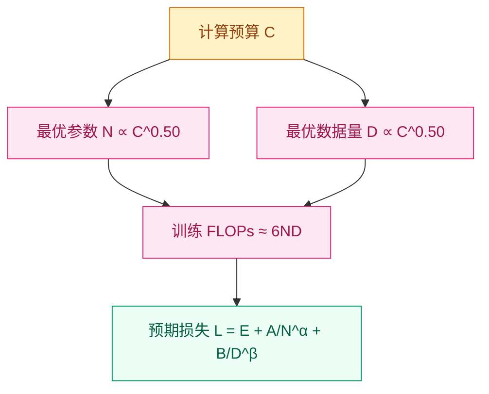

# 为什么小模型不够用了？—— LLM 预训练与规模

[English](README_EN.md) | [中文](README.md)

## 这个问题从哪来

> 2020年，GPT-3 以 175B 参数展示了 few-shot 涌现能力；同年 OpenAI 的 Scaling Laws 论文证明：模型性能随规模（参数、数据、算力）呈可预测的幂律增长。预训练从此不再是"微调前的热身"，而成为了决定模型能力的根本阶段。

## 学习目标

完成后你应能回答：
1. 为什么 GPT-3 之后"堆参数"变成了系统科学？
2. 数据、参数、算力之间的幂律如何指导训练决策？
3. 大模型预训练在工程上需要哪些分布式训练技术？

## 1. 直觉

想象你在建一座图书馆。小模型像是社区阅览室，只能摆下最常借阅的几百本书，管理员也只能记住有限的借阅规律。大模型则像是国家图书馆，不仅藏书量巨大，管理员还能通过书名、作者、主题之间的微妙关联，帮你找到连你自己都没意识到的相关资料。

但建大图书馆不只是把面积放大十倍。书架数量（参数）、藏书总量（数据）、施工队规模（算力）必须同步增长，否则就会出现空书架或书堆满地无法整理的窘境。Scaling Laws 告诉我们：在固定预算下，这三者之间存在最优配比，盲目堆砌任何单一维度都是浪费。

> 你要记住：预训练不是"记住标准答案"，而是让模型在巨量文本中习得语言的统计结构和世界的隐含关联。

## 2. 机制

### 2.1 预训练目标：模型在学什么？

预训练本质上是一个自监督填空游戏。根据任务设计不同，主要有三种目标：

**因果语言建模 (Causal Language Modeling, CLM)** — GPT 风格
基于前文预测下一个 token。

```
L_CLM = -Σ_t log P(x_t | x_{<t}; θ)
```

**掩码语言建模 (Masked Language Modeling, MLM)** — BERT 风格
从双向上下文预测被掩码的 token。掩码策略：80% 替换为 `[MASK]`，10% 替换为随机 token，10% 保持不变。

**前缀语言建模 (Prefix LM)** — T5 风格
前缀部分使用双向注意力，生成部分使用因果注意力。

| Model | Primary Objective | Secondary |
|-------|------------------|-----------|
| GPT-4 | CLM | - |
| LLaMA | CLM | - |
| BERT | MLM | NSP |
| RoBERTa | MLM | - |
| T5 | Span Corruption | - |
| UL2 | Mixture of Denoisers | Multiple |

### 2.2 Scaling Laws：规模是一种可预测的科学

**Chinchilla 缩放定律**（Hoffmann et al., 2022）指出：给定计算预算 C（FLOPs），最优参数 N_opt 与最优 token 数 D_opt 均与 C^0.50 成正比。

训练总 FLOPs ≈ 6ND，其中：
- 2N 用于前向传播（矩阵乘法）
- 4N 用于反向传播（梯度计算）



| Compute (FLOPs) | Optimal Params | Optimal Tokens |
|----------------|---------------|----------------|
| 1e18 | 400M | 8B |
| 1e19 | 1.3B | 26B |
| 1e20 | 4B | 80B |
| 1e21 | 13B | 260B |
| 1e22 | 40B | 800B |
| 1e23 | 130B | 2.6T |

损失作为参数和数据的函数可预测：

```
L(N, D) = E + A/N^α + B/D^β

其中:
- E: 不可约熵
- A, B: 缩放系数
- α ≈ 0.34, β ≈ 0.28
```

> 你要记住：给定固定算力，参数 N 与数据 D 应按同等比例增长（N ∝ C^0.50, D ∝ C^0.50），这正是 Chinchilla 最优的核心。

### 2.3 数据工程：从原始互联网到训练语料

数据来源通常按以下比例混合：

| Source | Proportion | Examples |
|--------|-----------|----------|
| **Web Text** | 60-80% | Common Crawl, C4 |
| **Books** | 10-15% | Gutenberg, Books3 |
| **Code** | 10-20% | GitHub, StackOverflow |
| **Wikipedia** | 5-10% | Wikimedia dumps |
| **Academic** | 5% | ArXiv, PubMed |

```python
# 数据混合配置
data_weights = {
    'common_crawl': 0.67,
    'c4': 0.15,
    'github': 0.045,
    'wikipedia': 0.045,
    'books': 0.045,
    'arxiv': 0.025,
    'stackexchange': 0.02
}
```

数据处理流水线包括清洗、质量过滤、去重与分词分块：

```python
import re
from typing import List, Iterator
import multiprocessing as mp

# 构建从原始文本到训练语料的完整处理流水线
# 包含清洗、质量过滤、去重与分词分块
# 输出符合长度要求的 token chunks
class DataProcessor:
    def __init__(self, min_length=100, max_length=100000):
        self.min_length = min_length
        self.max_length = max_length

    def clean_text(self, text: str) -> str:
        text = re.sub(r'\s+', ' ', text)
        text = re.sub(r'[\x00-\x08\x0b-\x0c\x0e-\x1f]', '', text)
        text = text.strip()
        return text

    def quality_filter(self, text: str) -> bool:
        if len(text) < self.min_length or len(text) > self.max_length:
            return False
        alpha_ratio = sum(c.isalpha() for c in text) / len(text)
        if alpha_ratio < 0.5:
            return False
        lines = text.split('\n')
        if len(lines) != len(set(lines)):
            return False
        return True

    def deduplicate(self, texts: List[str]) -> List[str]:
        from datasketch import MinHashLSH, MinHash

        lsh = MinHashLSH(threshold=0.9, num_perm=128)
        unique_texts = []

        for text in texts:
            m = MinHash(num_perm=128)
            for word in text.split()[:100]:
                m.update(word.encode('utf8'))
            if not lsh.query(m):
                lsh.insert(text, m)
                unique_texts.append(text)

        return unique_texts

    def tokenize_batch(self, texts: List[str], tokenizer) -> Iterator[List[int]]:
        max_seq_length = 2048
        for text in texts:
            tokens = tokenizer.encode(text, add_special_tokens=False)
            for i in range(0, len(tokens), max_seq_length):
                chunk = tokens[i:i + max_seq_length]
                if len(chunk) > 10:
                    yield chunk
```

常用存储格式为 JSONL、Arrow 或 Parquet：

```python
import pyarrow as pa
import pyarrow.parquet as pq

# 将分词后的数据保存为 Parquet 列式格式
# 支持高效加载与大规模训练流水线
# 输出文件可直接被 datasets 库读取
def save_to_parquet(examples, output_path):
    table = pa.table({
        'input_ids': pa.array(examples, type=pa.list_(pa.int64()))
    })
    pq.write_table(table, output_path)
```

### 2.4 分布式训练：当模型装不进一张 GPU

当模型达到数十亿甚至数千亿参数时，单卡显存放不下模型、梯度和优化器状态。分布式训练策略的选择取决于模型规模：

| Strategy | What is Split | When to Use |
|----------|--------------|-------------|
| **Data Parallel (DP)** | 数据 batch 跨 GPU | < 1B params |
| **Tensor Parallel (TP)** | 层权重跨 GPU | 1-10B params |
| **Pipeline Parallel (PP)** | 层跨 GPU | > 10B params |
| **FSDP** | 参数、梯度、优化器状态 | 1-100B params |
| **3D Parallel** | DP + TP + PP | > 100B params |

## 3. 渐进式实现

### Step 1 因果语言建模损失（核心逻辑）

```python
import torch.nn as nn

# 基于前文预测下一个 token
# 将 logits 与 targets 平移一位对齐
# 返回交叉熵损失
def compute_clm_loss(logits, targets, ignore_index=-100):
    shift_logits = logits[..., :-1, :].contiguous()
    shift_targets = targets[..., 1:].contiguous()
    loss_fct = nn.CrossEntropyLoss(ignore_index=ignore_index)
    loss = loss_fct(
        shift_logits.view(-1, shift_logits.size(-1)),
        shift_targets.view(-1)
    )
    return loss
```

### Step 2 掩码语言建模标签（边界处理）

```python
import torch

# 按 BERT 策略生成 MLM 掩码
# 处理特殊 token 掩码与 80/10/10 替换规则
# 返回处理后的 inputs 与 labels
def create_mlm_mask(inputs, tokenizer, mlm_prob=0.15):
    labels = inputs.clone()
    prob_matrix = torch.full(labels.shape, mlm_prob)

    special_tokens_mask = [
        tokenizer.get_special_tokens_mask(val, already_has_special_tokens=True)
        for val in labels.tolist()
    ]
    prob_matrix.masked_fill_(
        torch.tensor(special_tokens_mask, dtype=torch.bool), value=0.0
    )

    masked_indices = torch.bernoulli(prob_matrix).bool()
    labels[~masked_indices] = -100

    indices_replaced = (
        torch.bernoulli(torch.full(labels.shape, 0.8)).bool() & masked_indices
    )
    inputs[indices_replaced] = tokenizer.mask_token_id

    indices_random = (
        torch.bernoulli(torch.full(labels.shape, 0.5)).bool()
        & masked_indices
        & ~indices_replaced
    )
    random_words = torch.randint(len(tokenizer), labels.shape, dtype=torch.long)
    inputs[indices_random] = random_words[indices_random]

    return inputs, labels
```

### Step 3 缩放定律与成本估算（机制验证）

```python
# 根据 Chinchilla 缩放定律估算预训练损失
# 损失 = 不可约熵 + 参数项 + 数据项
# 输入 N(参数) 与 D(token 数)，返回预期 loss
def estimate_loss(num_params, num_tokens,
                  E=1.69, A=406.4, B=410.7,
                  alpha=0.34, beta=0.28):
    loss = E + A / (num_params ** alpha) + B / (num_tokens ** beta)
    return loss


# 估算训练所需 GPU 时数与成本
# 总 FLOPs ≈ 6 * N * D
# 按硬件峰值算力与利用率折算时间
def estimate_training_compute(params, tokens, hardware_flops=312e12,
                               utilization=0.3, num_gpus=1024):
    total_flops = 6 * params * tokens
    gpu_flops_per_second = hardware_flops * utilization
    total_seconds = total_flops / (gpu_flops_per_second * num_gpus)
    gpu_hours = total_seconds * num_gpus / 3600
    cost = gpu_hours * 2
    return {
        'total_flops': total_flops,
        'gpu_hours': gpu_hours,
        'days': total_seconds / 86400,
        'estimated_cost_usd': cost
    }
```

### Step 4 大模型分布式训练（生产级）

```python
from torch.distributed.fsdp import FullyShardedDataParallel as FSDP
from torch.distributed.fsdp.wrap import transformer_auto_wrap_policy
import torch.distributed as dist
from pathlib import Path

# 使用 PyTorch FSDP 分片模型参数与梯度
# 配置自动包裹、BF16 混合精度与通信优化
# 返回可分布式训练的大模型
def setup_fsdp_model(model, world_size):
    auto_wrap_policy = transformer_auto_wrap_policy(
        transformer_layer_cls={TransformerBlock}
    )
    model = FSDP(
        model,
        auto_wrap_policy=auto_wrap_policy,
        mixed_precision=torch.bfloat16,
        device_id=torch.cuda.current_device(),
        limit_all_gathers=True,
        forward_prefetch=True,
        backward_prefetch=True,
    )
    return model


# 保存与清理训练检查点
# 保留最近 N 个 checkpoint 防止存储爆炸
# 支持分布式多 rank 命名
class CheckpointManager:
    def __init__(self, checkpoint_dir, keep_last_n=3):
        self.checkpoint_dir = Path(checkpoint_dir)
        self.keep_last_n = keep_last_n
        self.checkpoints = []

    def save_checkpoint(self, model, optimizer, scheduler, step, loss):
        checkpoint = {
            'step': step,
            'model_state_dict': model.state_dict(),
            'optimizer_state_dict': optimizer.state_dict(),
            'scheduler_state_dict': scheduler.state_dict(),
            'loss': loss,
            'rng_state': torch.get_rng_state(),
        }
        if torch.distributed.is_initialized():
            checkpoint_path = (
                self.checkpoint_dir /
                f'checkpoint_step_{step}_rank_{dist.get_rank()}.pt'
            )
        else:
            checkpoint_path = (
                self.checkpoint_dir / f'checkpoint_step_{step}.pt'
            )
        torch.save(checkpoint, checkpoint_path)
        self.checkpoints.append(checkpoint_path)
        if len(self.checkpoints) > self.keep_last_n:
            old_checkpoint = self.checkpoints.pop(0)
            old_checkpoint.unlink(missing_ok=True)
        return checkpoint_path

    def load_checkpoint(self, model, optimizer, scheduler, checkpoint_path):
        checkpoint = torch.load(checkpoint_path)
        model.load_state_dict(checkpoint['model_state_dict'])
        optimizer.load_state_dict(checkpoint['optimizer_state_dict'])
        scheduler.load_state_dict(checkpoint['scheduler_state_dict'])
        torch.set_rng_state(checkpoint['rng_state'])
        return checkpoint['step'], checkpoint['loss']
```

DeepSpeed ZeRO-3 是另一种主流的百亿参数训练方案：

```python
# 配置 DeepSpeed ZeRO-3 以支持百亿参数模型训练
# 划分优化器状态、梯度与参数到多卡或 CPU 内存
# 包含激活检查点、BF16 与梯度裁剪设置
ds_config = {
    "train_batch_size": 512,
    "train_micro_batch_size_per_gpu": 1,
    "gradient_accumulation_steps": 16,
    "optimizer": {
        "type": "AdamW",
        "params": {
            "lr": 1e-4,
            "betas": [0.9, 0.95],
            "eps": 1e-8,
            "weight_decay": 0.1
        }
    },
    "scheduler": {
        "type": "WarmupDecayLR",
        "params": {
            "warmup_min_lr": 0,
            "warmup_max_lr": 1e-4,
            "warmup_num_steps": 2000,
            "total_num_steps": 100000
        }
    },
    "zero_optimization": {
        "stage": 3,
        "offload_optimizer": {
            "device": "cpu",
            "pin_memory": True
        },
        "offload_param": {
            "device": "cpu",
            "pin_memory": True
        },
        "overlap_comm": True,
        "contiguous_gradients": True,
        "reduce_bucket_size": 5e8,
        "stage3_prefetch_bucket_size": 5e8,
        "stage3_param_persistence_threshold": 1e6
    },
    "gradient_clipping": 1.0,
    "fp16": {
        "enabled": True,
        "loss_scale": 0,
        "loss_scale_window": 1000,
        "initial_scale_power": 16
    },
    "activation_checkpointing": {
        "partition_activations": True,
        "cpu_checkpointing": True,
        "contiguous_memory_optimization": False
    }
}
```

## 4. 工程陷阱

| 陷阱 | 原因 | 现象 | 对策 |
|------|------|------|------|
| **数据质量 > 数据数量** | 低质量、重复文本污染损失面 | loss 长期不降、下游性能差、输出垃圾 | 积极去重、质量过滤、平衡来源 |
| **损失尖峰** | 坏数据点、学习率过高、数值不稳定 | 训练曲线突然尖锐向上 | 梯度裁剪（norm=1.0）、混合精度检查、warmup |
| **分布式通信瓶颈** | all-reduce 通信量随参数线性增长 | GPU 利用率低（<30%），实际耗时远高于理论 | FSDP/DeepSpeed ZeRO、优化通信拓扑、重叠计算通信 |
| **检查点存储灾难** | 百亿参数 checkpoint 达数百 GB | 存储告警、保存期间训练停滞 | 限制保留最近 N 个、异步保存、分层存储 |

大模型训练稳定性的关键代码实践：

```python
from torch.cuda.amp import autocast, GradScaler

# 使用混合精度与梯度裁剪稳定大模型训练
# BF16 前向 + 损失缩放反向，配合 norm=1.0 裁剪
# 有效抑制损失尖峰与数值不稳定
scaler = GradScaler()
with autocast(dtype=torch.bfloat16):
    loss = model(batch)
scaler.scale(loss).backward()
scaler.unscale_(optimizer)
torch.nn.utils.clip_grad_norm_(model.parameters(), 1.0)
scaler.step(optimizer)
scaler.update()
```

```python
from transformers import get_cosine_schedule_with_warmup

# 余弦退火配合 warmup 稳定大模型预训练
# 2000 步预热后按半余弦衰减至 10% 峰值学习率
# 避免早期训练震荡与后期过拟合
scheduler = get_cosine_schedule_with_warmup(
    optimizer,
    num_warmup_steps=2000,
    num_training_steps=100000,
    num_cycles=0.5,
    min_lr_ratio=0.1
)
```

> 你要记住：预训练是一场数据、算法、工程的三位一体战役，任何一角的短板都会让巨额算力打水漂。

## 5. 演进笔记

> 这一技术的遗产：预训练确立了"规模即能力"的范式，让通用语言理解成为可能；但它也留下了数据即将耗尽、算力壁垒高企、模型行为难以控制等新问题。
→ 详见 [PEFT](../../04-Alignment-OpenSource/peft/README.md)

---

**上一章**: [预训练模型](../../02-Language-Transformers/pretrained-models/README.md) | **下一章**: [PEFT](../../04-Alignment-OpenSource/peft/README.md)
