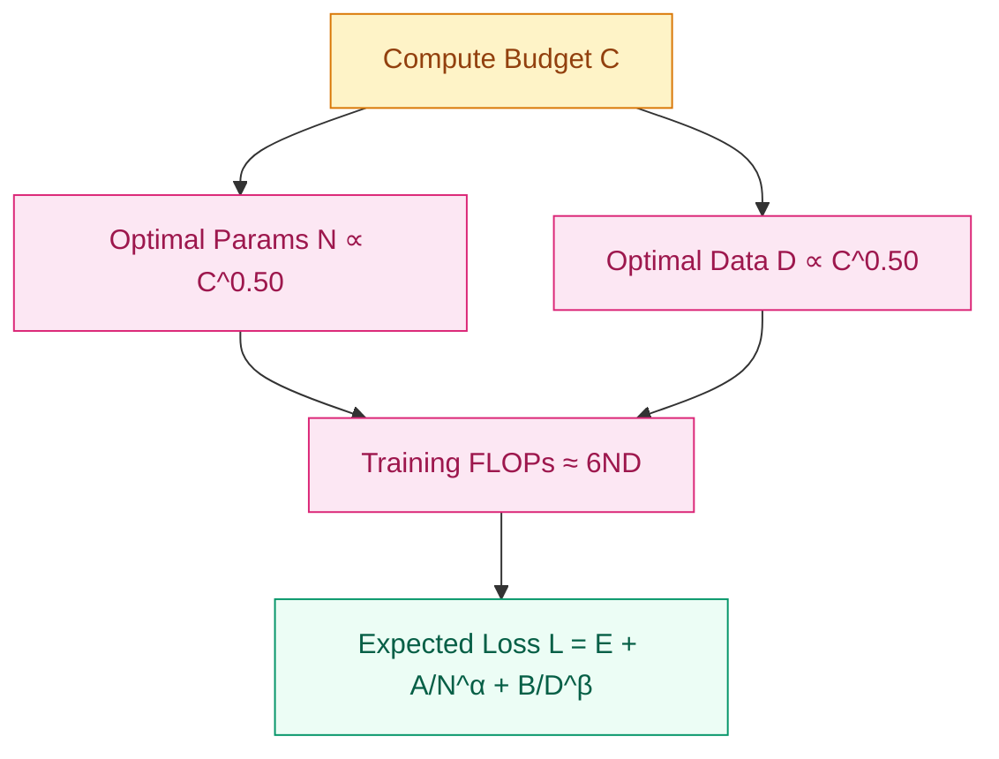

# Why Small Models Stopped Being Enough? — LLM Pre-training and Scale

[English](README_EN.md) | [中文](README.md)

## Where does this problem come from?

> In 2020, GPT-3 demonstrated few-shot emergent abilities with 175B parameters; in the same year, OpenAI's Scaling Laws paper proved that model performance follows predictable power-law relationships with scale (parameters, data, and compute). Pre-training was no longer just a "warm-up before fine-tuning"—it became the fundamental stage that determines model capability.

## Learning Objectives

After completing this module, you should be able to answer:
1. Why did "scaling parameters" become a systematic science after GPT-3?
2. How do the power laws among data, parameters, and compute guide training decisions?
3. What distributed training techniques are essential for large-model pre-training in practice?

## 1. Intuition

Imagine you are building a library. A small model is like a community reading room: it can only hold a few hundred of the most frequently borrowed books, and the librarian can only remember limited borrowing patterns. A large model is like a national library: not only does it have a massive collection, but the librarian can also find subtle connections between titles, authors, and topics to help you discover relevant materials you didn't even know existed.

But building a large library isn't just about making the space ten times bigger. The number of bookshelves (parameters), the total collection size (data), and the construction crew size (compute) must grow in sync. Otherwise, you end up with empty shelves or piles of books scattered on the floor with no way to organize them. Scaling Laws tell us: under a fixed budget, there is an optimal ratio among these three factors, and blindly stacking any single dimension is wasteful.

> Remember this: pre-training is not about "memorizing standard answers"—it is about letting the model learn the statistical structure of language and implicit associations about the world from massive text.

## 2. Mechanism

### 2.1 Pre-training Objectives: What Is the Model Learning?

Pre-training is essentially a self-supervised fill-in-the-blank game. Depending on the task design, there are three main objectives:

**Causal Language Modeling (CLM)** — GPT-style
Predict the next token based on previous context.

```
L_CLM = -Σ_t log P(x_t | x_{<t}; θ)
```

**Masked Language Modeling (MLM)** — BERT-style
Predict masked tokens from bidirectional context. Masking strategy: 80% replaced with `[MASK]`, 10% replaced with a random token, 10% kept unchanged.

**Prefix Language Modeling (Prefix LM)** — T5-style
Use bidirectional attention on the prefix and causal attention on the generation part.

| Model | Primary Objective | Secondary |
|-------|------------------|-----------|
| GPT-4 | CLM | - |
| LLaMA | CLM | - |
| BERT | MLM | NSP |
| RoBERTa | MLM | - |
| T5 | Span Corruption | - |
| UL2 | Mixture of Denoisers | Multiple |

### 2.2 Scaling Laws: Scale as a Predictable Science

The **Chinchilla Scaling Laws** (Hoffmann et al., 2022) state that, given a compute budget C (in FLOPs), the optimal number of parameters N_opt and optimal number of tokens D_opt both scale with C^0.50.

Total training FLOPs ≈ 6ND, where:
- 2N for the forward pass (matrix multiplications)
- 4N for the backward pass (gradient computation)



| Compute (FLOPs) | Optimal Params | Optimal Tokens |
|----------------|---------------|----------------|
| 1e18 | 400M | 8B |
| 1e19 | 1.3B | 26B |
| 1e20 | 4B | 80B |
| 1e21 | 13B | 260B |
| 1e22 | 40B | 800B |
| 1e23 | 130B | 2.6T |

Loss is predictable as a function of parameters and data:

```
L(N, D) = E + A/N^α + B/D^β

where:
- E: irreducible entropy
- A, B: scaling coefficients
- α ≈ 0.34, β ≈ 0.28
```

> Remember this: given fixed compute, parameters N and data D should grow proportionally (N ∝ C^0.50, D ∝ C^0.50). This is the core of Chinchilla optimality.

### 2.3 Data Engineering: From Raw Internet to Training Corpus

Data sources are typically mixed in the following proportions:

| Source | Proportion | Examples |
|--------|-----------|----------|
| **Web Text** | 60-80% | Common Crawl, C4 |
| **Books** | 10-15% | Gutenberg, Books3 |
| **Code** | 10-20% | GitHub, StackOverflow |
| **Wikipedia** | 5-10% | Wikimedia dumps |
| **Academic** | 5% | ArXiv, PubMed |

```python
# Data mixture configuration
data_weights = {
    'common_crawl': 0.67,
    'c4': 0.15,
    'github': 0.045,
    'wikipedia': 0.045,
    'books': 0.045,
    'arxiv': 0.025,
    'stackexchange': 0.02
}
```

The data processing pipeline includes cleaning, quality filtering, deduplication, and tokenization chunking:

```python
import re
from typing import List, Iterator
import multiprocessing as mp

# Build a full pipeline from raw text to training corpus
# Includes cleaning, quality filtering, deduplication, and tokenization
# Outputs token chunks that satisfy length requirements
class DataProcessor:
    def __init__(self, min_length=100, max_length=100000):
        self.min_length = min_length
        self.max_length = max_length

    def clean_text(self, text: str) -> str:
        text = re.sub(r'\s+', ' ', text)
        text = re.sub(r'[\x00-\x08\x0b-\x0c\x0e-\x1f]', '', text)
        text = text.strip()
        return text

    def quality_filter(self, text: str) -> bool:
        if len(text) < self.min_length or len(text) > self.max_length:
            return False
        alpha_ratio = sum(c.isalpha() for c in text) / len(text)
        if alpha_ratio < 0.5:
            return False
        lines = text.split('\n')
        if len(lines) != len(set(lines)):
            return False
        return True

    def deduplicate(self, texts: List[str]) -> List[str]:
        from datasketch import MinHashLSH, MinHash

        lsh = MinHashLSH(threshold=0.9, num_perm=128)
        unique_texts = []

        for text in texts:
            m = MinHash(num_perm=128)
            for word in text.split()[:100]:
                m.update(word.encode('utf8'))
            if not lsh.query(m):
                lsh.insert(text, m)
                unique_texts.append(text)

        return unique_texts

    def tokenize_batch(self, texts: List[str], tokenizer) -> Iterator[List[int]]:
        max_seq_length = 2048
        for text in texts:
            tokens = tokenizer.encode(text, add_special_tokens=False)
            for i in range(0, len(tokens), max_seq_length):
                chunk = tokens[i:i + max_seq_length]
                if len(chunk) > 10:
                    yield chunk
```

Common storage formats are JSONL, Arrow, or Parquet:

```python
import pyarrow as pa
import pyarrow.parquet as pq

# Save tokenized data as Parquet columnar format
# Supports efficient loading and large-scale training pipelines
# Output files can be directly read by the datasets library
def save_to_parquet(examples, output_path):
    table = pa.table({
        'input_ids': pa.array(examples, type=pa.list_(pa.int64()))
    })
    pq.write_table(table, output_path)
```

### 2.4 Distributed Training: When the Model Doesn't Fit on One GPU

When models reach billions or even hundreds of billions of parameters, a single GPU cannot hold the model, gradients, and optimizer states. The choice of distributed training strategy depends on model scale:

| Strategy | What is Split | When to Use |
|----------|--------------|-------------|
| **Data Parallel (DP)** | data batch across GPUs | < 1B params |
| **Tensor Parallel (TP)** | layer weights across GPUs | 1-10B params |
| **Pipeline Parallel (PP)** | layers across GPUs | > 10B params |
| **FSDP** | params, gradients, optimizer states | 1-100B params |
| **3D Parallel** | DP + TP + PP | > 100B params |

## 3. Progressive Implementation

### Step 1 Causal Language Modeling Loss (Core Logic)

```python
import torch.nn as nn

# Predict the next token based on previous context
# Shift logits and targets by one position to align
# Return cross-entropy loss
def compute_clm_loss(logits, targets, ignore_index=-100):
    shift_logits = logits[..., :-1, :].contiguous()
    shift_targets = targets[..., 1:].contiguous()
    loss_fct = nn.CrossEntropyLoss(ignore_index=ignore_index)
    loss = loss_fct(
        shift_logits.view(-1, shift_logits.size(-1)),
        shift_targets.view(-1)
    )
    return loss
```

### Step 2 Masked Language Modeling Labels (Boundary Handling)

```python
import torch

# Generate MLM masks following the BERT strategy
# Handle special token masking and the 80/10/10 replacement rule
# Return processed inputs and labels
def create_mlm_mask(inputs, tokenizer, mlm_prob=0.15):
    labels = inputs.clone()
    prob_matrix = torch.full(labels.shape, mlm_prob)

    special_tokens_mask = [
        tokenizer.get_special_tokens_mask(val, already_has_special_tokens=True)
        for val in labels.tolist()
    ]
    prob_matrix.masked_fill_(
        torch.tensor(special_tokens_mask, dtype=torch.bool), value=0.0
    )

    masked_indices = torch.bernoulli(prob_matrix).bool()
    labels[~masked_indices] = -100

    indices_replaced = (
        torch.bernoulli(torch.full(labels.shape, 0.8)).bool() & masked_indices
    )
    inputs[indices_replaced] = tokenizer.mask_token_id

    indices_random = (
        torch.bernoulli(torch.full(labels.shape, 0.5)).bool()
        & masked_indices
        & ~indices_replaced
    )
    random_words = torch.randint(len(tokenizer), labels.shape, dtype=torch.long)
    inputs[indices_random] = random_words[indices_random]

    return inputs, labels
```

### Step 3 Scaling Laws and Cost Estimation (Mechanism Verification)

```python
# Estimate pre-training loss using the Chinchilla scaling law
# Loss = irreducible entropy + parameter term + data term
# Input N (params) and D (tokens), return expected loss
def estimate_loss(num_params, num_tokens,
                  E=1.69, A=406.4, B=410.7,
                  alpha=0.34, beta=0.28):
    loss = E + A / (num_params ** alpha) + B / (num_tokens ** beta)
    return loss


# Estimate required GPU-hours and cost for training
# Total FLOPs ≈ 6 * N * D
# Convert to time based on peak hardware FLOPs and utilization
def estimate_training_compute(params, tokens, hardware_flops=312e12,
                               utilization=0.3, num_gpus=1024):
    total_flops = 6 * params * tokens
    gpu_flops_per_second = hardware_flops * utilization
    total_seconds = total_flops / (gpu_flops_per_second * num_gpus)
    gpu_hours = total_seconds * num_gpus / 3600
    cost = gpu_hours * 2
    return {
        'total_flops': total_flops,
        'gpu_hours': gpu_hours,
        'days': total_seconds / 86400,
        'estimated_cost_usd': cost
    }
```

### Step 4 Large-Model Distributed Training (Production-Grade)

```python
from torch.distributed.fsdp import FullyShardedDataParallel as FSDP
from torch.distributed.fsdp.wrap import transformer_auto_wrap_policy
import torch.distributed as dist
from pathlib import Path

# Shard model parameters and gradients with PyTorch FSDP
# Configure auto-wrapping, BF16 mixed precision, and communication optimization
# Return a large model ready for distributed training
def setup_fsdp_model(model, world_size):
    auto_wrap_policy = transformer_auto_wrap_policy(
        transformer_layer_cls={TransformerBlock}
    )
    model = FSDP(
        model,
        auto_wrap_policy=auto_wrap_policy,
        mixed_precision=torch.bfloat16,
        device_id=torch.cuda.current_device(),
        limit_all_gathers=True,
        forward_prefetch=True,
        backward_prefetch=True,
    )
    return model


# Save and rotate training checkpoints
# Keep the most recent N checkpoints to prevent storage explosion
# Support distributed multi-rank filenames
class CheckpointManager:
    def __init__(self, checkpoint_dir, keep_last_n=3):
        self.checkpoint_dir = Path(checkpoint_dir)
        self.keep_last_n = keep_last_n
        self.checkpoints = []

    def save_checkpoint(self, model, optimizer, scheduler, step, loss):
        checkpoint = {
            'step': step,
            'model_state_dict': model.state_dict(),
            'optimizer_state_dict': optimizer.state_dict(),
            'scheduler_state_dict': scheduler.state_dict(),
            'loss': loss,
            'rng_state': torch.get_rng_state(),
        }
        if torch.distributed.is_initialized():
            checkpoint_path = (
                self.checkpoint_dir /
                f'checkpoint_step_{step}_rank_{dist.get_rank()}.pt'
            )
        else:
            checkpoint_path = (
                self.checkpoint_dir / f'checkpoint_step_{step}.pt'
            )
        torch.save(checkpoint, checkpoint_path)
        self.checkpoints.append(checkpoint_path)
        if len(self.checkpoints) > self.keep_last_n:
            old_checkpoint = self.checkpoints.pop(0)
            old_checkpoint.unlink(missing_ok=True)
        return checkpoint_path

    def load_checkpoint(self, model, optimizer, scheduler, checkpoint_path):
        checkpoint = torch.load(checkpoint_path)
        model.load_state_dict(checkpoint['model_state_dict'])
        optimizer.load_state_dict(checkpoint['optimizer_state_dict'])
        scheduler.load_state_dict(checkpoint['scheduler_state_dict'])
        torch.set_rng_state(checkpoint['rng_state'])
        return checkpoint['step'], checkpoint['loss']
```

DeepSpeed ZeRO-3 is another mainstream solution for training hundred-billion-parameter models:

```python
# Configure DeepSpeed ZeRO-3 to train 100B+ parameter models
# Shard optimizer states, gradients, and params across GPUs or CPU memory
# Includes activation checkpointing, BF16, and gradient clipping settings
ds_config = {
    "train_batch_size": 512,
    "train_micro_batch_size_per_gpu": 1,
    "gradient_accumulation_steps": 16,
    "optimizer": {
        "type": "AdamW",
        "params": {
            "lr": 1e-4,
            "betas": [0.9, 0.95],
            "eps": 1e-8,
            "weight_decay": 0.1
        }
    },
    "scheduler": {
        "type": "WarmupDecayLR",
        "params": {
            "warmup_min_lr": 0,
            "warmup_max_lr": 1e-4,
            "warmup_num_steps": 2000,
            "total_num_steps": 100000
        }
    },
    "zero_optimization": {
        "stage": 3,
        "offload_optimizer": {
            "device": "cpu",
            "pin_memory": True
        },
        "offload_param": {
            "device": "cpu",
            "pin_memory": True
        },
        "overlap_comm": True,
        "contiguous_gradients": True,
        "reduce_bucket_size": 5e8,
        "stage3_prefetch_bucket_size": 5e8,
        "stage3_param_persistence_threshold": 1e6
    },
    "gradient_clipping": 1.0,
    "fp16": {
        "enabled": True,
        "loss_scale": 0,
        "loss_scale_window": 1000,
        "initial_scale_power": 16
    },
    "activation_checkpointing": {
        "partition_activations": True,
        "cpu_checkpointing": True,
        "contiguous_memory_optimization": False
    }
}
```

## 4. Engineering Pitfalls

| Pitfall | Cause | Symptom | Fix |
|---------|-------|---------|-----|
| **Data quality > Data quantity** | Low-quality or duplicated texts pollute the loss landscape | Loss plateaus, poor downstream performance, garbage outputs | Aggressive deduplication, quality filtering, balanced sources |
| **Loss spikes** | Bad data points, high learning rate, numerical instability | Sharp upward spikes in the training curve | Gradient clipping (norm=1.0), mixed-precision checks, warmup |
| **Distributed communication bottleneck** | all-reduce communication grows linearly with parameters | Low GPU utilization (<30%), actual time far above theory | FSDP / DeepSpeed ZeRO, optimize topology, overlap compute/comm |
| **Checkpoint storage disaster** | A 10B+ checkpoint can reach hundreds of GB | Storage alerts, training stalls during saves | Keep only the last N checkpoints, async saving, tiered storage |

Key code practices for training stability at scale:

```python
from torch.cuda.amp import autocast, GradScaler

# Stabilize large-model training with mixed precision and gradient clipping
# BF16 forward + scaled backward with norm=1.0 clipping
# Effectively suppresses loss spikes and numerical instability
scaler = GradScaler()
with autocast(dtype=torch.bfloat16):
    loss = model(batch)
scaler.scale(loss).backward()
scaler.unscale_(optimizer)
torch.nn.utils.clip_grad_norm_(model.parameters(), 1.0)
scaler.step(optimizer)
scaler.update()
```

```python
from transformers import get_cosine_schedule_with_warmup

# Cosine annealing with warmup stabilizes large-model pre-training
# 2000-step warmup then half-cosine decay to 10% peak learning rate
# Avoids early training oscillation and late-stage overfitting
scheduler = get_cosine_schedule_with_warmup(
    optimizer,
    num_warmup_steps=2000,
    num_training_steps=100000,
    num_cycles=0.5,
    min_lr_ratio=0.1
)
```

> Remember this: pre-training is a three-in-one battle of data, algorithm, and engineering. A shortcoming in any corner will waste enormous compute budgets.

## 5. Evolution Notes

> The legacy of this technology: pre-training established the "scale is capability" paradigm, making general language understanding possible. But it also left new problems—impending data exhaustion, high compute barriers, and difficulty controlling model behavior.
→ See [PEFT](../../04-Alignment-OpenSource/peft/README.md)

---

**Previous**: [Pre-trained Models](../../02-Language-Transformers/pretrained-models/README.md) | **Next**: [PEFT](../../04-Alignment-OpenSource/peft/README.md)
