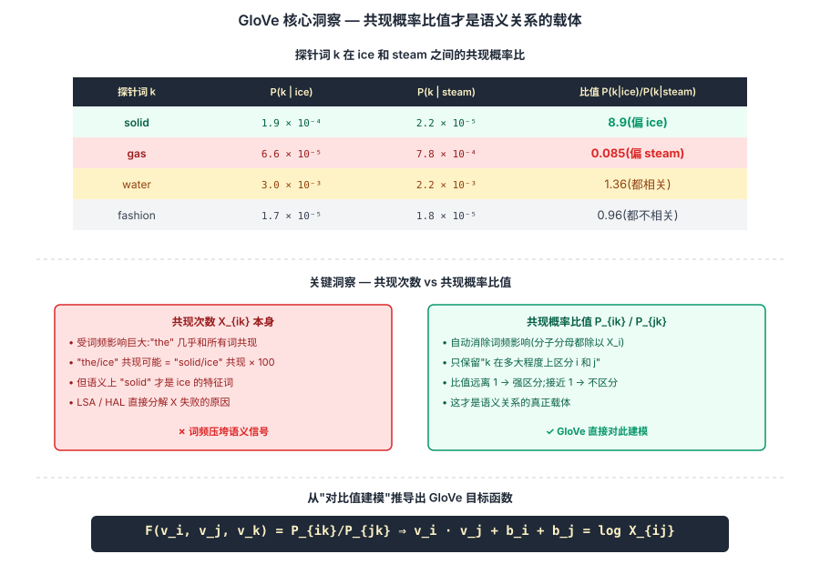
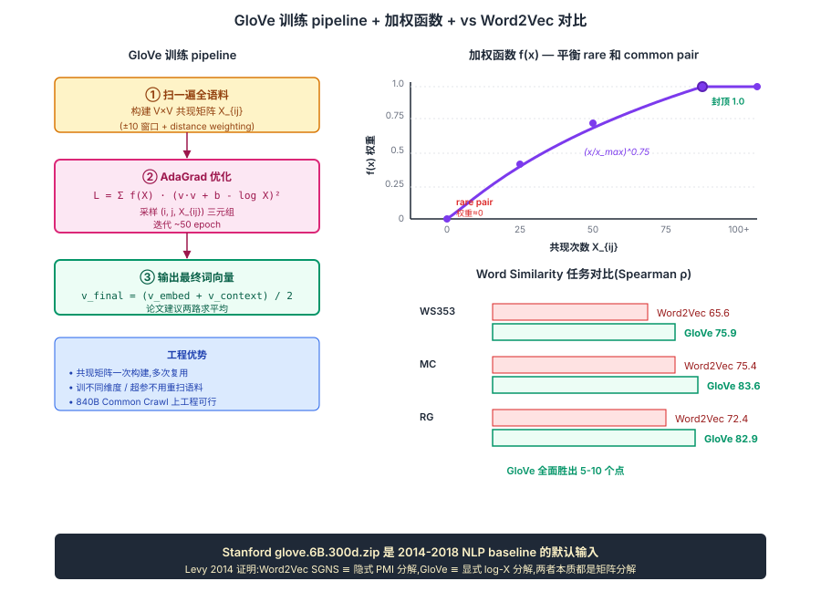

## 前作进展

[Word2Vec](01-word2vec.md)(2013)用 prediction-based 方法(skip-gram / CBOW)学词向量,效果好但有几个理论上不优雅的地方:

**1. 只用局部窗口** —— Skip-gram 每次只看 ±5 词上下文,**忽略了全局共现统计**(整个语料里"king"和"queen"出现在一起的总次数)

**2. NEG 不是真正的 likelihood** —— Negative Sampling 是工程 trick,理论上没有清晰的最优解

**3. 训练目标不直观** —— "预测上下文"是辅助任务,词向量是副产品

历史上 NLP 还有一条 **count-based**(计数式)路线:

- **LSA(Latent Semantic Analysis,1990)** —— 对 document-term 矩阵做 SVD,得到词向量。但 SVD 在大矩阵上慢
- **HAL / COALS** —— 对 word-word 共现矩阵做处理,得到词向量
- **Hellinger PCA** —— 对共现概率开根号后 PCA

这些方法理论清晰但**效果不如 Word2Vec**——直接矩阵分解没有抓住对的统计结构。

Pennington 等人(Stanford NLP,2014 年 10 月,EMNLP 2014)的 GloVe 论文给出关键洞察:**应该分解的不是共现次数本身,而是共现概率的比值**。这个量编码了词之间的语义关系。

GloVe 的工程影响立竿见影:

- 论文同时发布 **预训练 GloVe 向量**(Wikipedia + Gigaword 6B / Common Crawl 42B / Common Crawl 840B 三个版本)
- 这些 GloVe 向量成为 2014-2018 NLP 工业 / 学术界的事实标配 input
- Stanford NLP 组的开源策略让 GloVe 影响力一度超过 Word2Vec

GloVe 与 Word2Vec 不是替代关系,而是 **两条路线并存** —— 不同任务上各有优势,大量论文同时用两者做实验对比。

## 核心思想

### 直觉:共现概率的比值,而非共现次数本身,才编码语义

理解 GloVe 真正需要先抓一件事:**[Word2Vec](01-word2vec.md) 用局部窗口的预测任务学词向量,理论上有点绕**——它的本意是学词向量,却用"预测上下文"作辅助任务,词向量是副产品。同期 count-based 路线(LSA / HAL)直接分解共现矩阵,理论清晰但效果不如 Word2Vec。Pennington 等人 2014 反问:**count-based 路线没胜 prediction-based,不是矩阵分解本身的问题,而是分解错了对象 —— 应该分解的不是共现次数本身,而是共现概率的比值**。

为什么是比值?考虑 i="ice" / j="steam" / 探针 k:

| 探针 k | P(k\|ice) | P(k\|steam) | 比值 P(k\|i)/P(k\|j) |
|---|---|---|---|
| solid | 1.9e-4 | 2.2e-5 | **8.9**(强区分,solid 偏 ice) |
| gas | 6.6e-5 | 7.8e-4 | **0.085**(强区分,gas 偏 steam) |
| water | 3.0e-3 | 2.2e-3 | 1.36(都相关) |
| fashion | 1.7e-5 | 1.8e-5 | 0.96(都不相关) |

比值 $P_{ik}/P_{jk}$ **天然消除了共现绝对频次的影响,只保留"区分 i 和 j 的能力"** — 这才是语义关系的载体。

三件事必须同时成立才让 GloVe 在 2014 年成立:

- **目标是拟合 log 共现而非共现本身** — `v_i·v_j + b_i + b_j = log X_{ij}`,这一推导直接来自"对比值建模"的要求
- **加权 loss `f(x)` 平衡 rare 和 common pair** — rare pair 给小权重(噪声大),common pair 上限封顶 1.0(防止主导 loss)
- **全局共现矩阵替代局部窗口** — Word2Vec 每次只看 ±5 窗口,GloVe 一次性遍历全语料构建 V×V 共现矩阵,**全局统计 + 一次拟合**

三件事合起来:GloVe 在 word similarity 任务上**全面超过 Word2Vec 5-10 点**(WS353: 75.9 vs 65.6),analogy / NER 略优。但真正让 GloVe 成为 2014-2018 NLP 标配的是 Stanford 团队**预训练向量的开源策略** — glove.6B.300d.zip 几乎是所有 NLP baseline 的默认输入。


*图 1:ice / steam 与 4 个探针词的共现概率比值表 + 直觉图解 — solid 偏 ice(比值 8.9)、gas 偏 steam(比值 0.085)、water/fashion 都中性(比值 ≈1)。**比值才是语义关系载体**,这一观察直接决定 GloVe 的目标函数形式 `v_i·v_j = log X_{ij}`。底部 callout:Word2Vec 用"预测上下文"间接学,GloVe 用"拟合比值"直接学。*

### 机制一:Log 共现拟合 — `v_i·v_j + b_i + b_j = log X_{ij}`

从"拟合比值"的要求出发,Pennington 等人推导出:词向量内积应该等于 log 共现次数。推导逻辑简化版:

1. 想要 $F(v_i, v_j, v_k) = P_{ik}/P_{jk}$
2. 假设 F 仅依赖向量差和探针:$F((v_i - v_j)^T v_k) = P_{ik}/P_{jk}$
3. 取 F = exp,得到 $v_i^T v_k = \log P_{ik} = \log X_{ik} - \log X_i$
4. 把 $-\log X_i$ 吸收为 bias,最终目标:

$$
v_i^T v_j + b_i + b_j = \log X_{ij}
$$

- $v_i, v_j$:词向量(典型 300 维)
- $b_i, b_j$:bias 项,吸收边际频率
- $X_{ij}$:词 i 和 j 在全语料共现次数(用 ±10 窗口 + distance weighting 统计)

**这一目标的清晰性是 GloVe 相对 Word2Vec NEG 的理论优势** — NEG 是工程 trick,GloVe 是从假设出发的封闭推导。

### 机制二:加权 loss — 平衡 rare 和 common pair

直接 fit `log X_{ij}` 有两个问题:rare co-occurrence(X_{ij}=0)是 log(0) 不可算;common pair(像 "the / and" 的共现频次极高)会主导 loss,稀有但语义丰富的 pair 学不动。

GloVe 加一个加权函数 f:

$$
\mathcal{L} = \sum_{i,j=1}^V f(X_{ij}) \cdot (v_i^T v_j + b_i + b_j - \log X_{ij})^2
$$

$$
f(x) = \begin{cases} (x / x_{\max})^\alpha & x < x_{\max} \\ 1 & x \geq x_{\max} \end{cases}
$$

- $x_{\max} = 100$(经验封顶)
- $\alpha = 3/4$(和 Word2Vec NEG 的 0.75 巧合相同)

直觉:rare pair(X 接近 0)权重接近 0,**不学也不亏**;common pair 权重封顶 1.0,**不再无限主导 loss**。中间 pair 按 $x^{0.75}$ 缓慢上升,把训练算力集中在"既不太稀也不太密"的中频 pair —— 这些恰恰是携带最多语义信息的 pair。

### 机制三:全局共现矩阵 — 一次扫语料替代每步采样

Word2Vec 每步 SGD 都要扫一个新 mini-batch 的窗口对,**整个训练扫语料若干 epoch**(典型 5-15)。GloVe 走完全不同的路线:

1. **预处理一次** — 扫一遍全语料,构建 V×V 稀疏共现矩阵 $X_{ij}$,带 distance weighting(距离 d 的共现 = 1/d)
2. **训练只看共现矩阵** — 不再回到原始语料,SGD 采样 (i, j, X_{ij}) 三元组拟合 weighted log loss
3. **一次构建多次复用** — 共现矩阵建好后,训不同维度 / 不同超参的词向量都不用重扫语料

这种"全局统计 + 一次拟合"的范式在 Common Crawl 840B token 规模上有显著工程优势 —— Word2Vec 在 840B 上要扫几遍才能收敛,GloVe 只需扫一次构建矩阵 + 50 轮 AdaGrad。Stanford 在 840B 上训出 300d 向量,词表 2.2M,这一规模在当时(2014)是 NLP 最大开源 embedding。

后续研究(Levy & Goldberg 2014)证明:**Word2Vec skip-gram NEG 在数学上等价于隐式分解 PMI 矩阵**;GloVe 显式做 `log X_{ij}` 分解;**两者本质都是矩阵分解**,只是 framing 不同。这部分解释了为何 GloVe 和 Word2Vec 效果接近但 GloVe 在大规模上略优 — 因为 GloVe 的全局统计利用更充分。

### 三件套协同:log 共现拟合 + 加权 loss + 全局共现矩阵 缺一不可

GloVe 在 2014 年能成为 Word2Vec 的强力对手,**不是单一改进**,而是三件套同时调到协同点 —— 任何一个抽掉 GloVe 都不成立,这一点和 [ResNet](../01-cnn/05-resnet.md) 的 `shortcut + BN + He 初始化` 协同关系一致:

- **只有 log 共现目标,没有加权 loss** — 高频 pair("the / and" 共现 10⁶ 次)的 squared loss 主导优化,低频但语义丰富的 pair(如 "deep / learning")学不动,效果直接掉 5-10 个点
- **只有加权 loss,没有 log 共现目标** — 拟合 $X_{ij}$ 本身而不是 $\log X_{ij}$,失去"对比值建模"的理论支撑;退化成 LSA 那类直接计数分解,效果显著差
- **只有 log 拟合 + 加权,没有全局共现矩阵(还在用 Word2Vec 的局部窗口 SGD)** — 失去"一次扫语料 + 多次复用"的工程优势,大规模训练成本回到 Word2Vec 量级

三件套合起来才让 GloVe 在 word similarity 上全面胜过 Word2Vec、在 NER 等下游略优、且在 Common Crawl 840B 这种超大语料上工程上可行。Stanford 开源的 glove.6B / 42B / 840B 三个版本直接定义了 2014-2018 NLP 标配 input。


*图 2:**左** GloVe 训练 pipeline — 1️⃣ 扫一遍全语料构建 V×V 共现矩阵(distance weighting)→ 2️⃣ AdaGrad 优化 weighted squared loss → 3️⃣ 输出 (embed + context_embed) / 2 作最终词向量。**右上** 加权函数 f(x) 曲线 — x < 100 时按 (x/100)^0.75 上升,x ≥ 100 封顶 1.0,直观展示"rare pair 权重 ≈0,common pair 权重封顶"。**右下** GloVe vs Word2Vec 在 WS353 / MC / RG 三个 similarity 任务上的对比柱状图 — GloVe 全面胜出 5-10 点。底部 callout:Stanford glove.6B.300d 是 2014-2018 NLP 默认输入。*

## 关键代码

GloVe 训练 PyTorch 简化版(实际官方实现用 C):

```python
import torch
import torch.nn as nn
from collections import Counter, defaultdict
import math

# Step 1: 构建共现矩阵
def build_cooccurrence(corpus, window=10):
    co_matrix = defaultdict(float)
    for sentence in corpus:
        for i, word_i in enumerate(sentence):
            for j in range(max(0, i-window), min(len(sentence), i+window+1)):
                if i != j:
                    distance = abs(i - j)
                    co_matrix[(word_i, sentence[j])] += 1.0 / distance
    return co_matrix

# Step 2: GloVe 模型
class GloVe(nn.Module):
    def __init__(self, vocab_size, embed_dim=300, x_max=100, alpha=0.75):
        super().__init__()
        self.embed = nn.Embedding(vocab_size, embed_dim)
        self.context_embed = nn.Embedding(vocab_size, embed_dim)
        self.bias = nn.Embedding(vocab_size, 1)
        self.context_bias = nn.Embedding(vocab_size, 1)
        self.x_max = x_max
        self.alpha = alpha

    def forward(self, i_ids, j_ids, x_ij):
        """
        i_ids: (B,) 中心词
        j_ids: (B,) 上下文词
        x_ij:  (B,) 共现次数
        """
        v_i = self.embed(i_ids)              # (B, D)
        v_j = self.context_embed(j_ids)      # (B, D)
        b_i = self.bias(i_ids).squeeze()
        b_j = self.context_bias(j_ids).squeeze()

        pred = (v_i * v_j).sum(dim=-1) + b_i + b_j  # (B,)
        target = torch.log(x_ij + 1e-8)

        # 加权 squared loss
        weight = torch.where(
            x_ij < self.x_max,
            (x_ij / self.x_max) ** self.alpha,
            torch.ones_like(x_ij)
        )
        return (weight * (pred - target) ** 2).mean()

# Step 3: 训练
vocab_size = 50000
model = GloVe(vocab_size, embed_dim=300).cuda()
optimizer = torch.optim.Adagrad(model.parameters(), lr=0.05)

for epoch in range(50):
    for i_batch, j_batch, x_batch in cooc_loader:
        loss = model(i_batch.cuda(), j_batch.cuda(), x_batch.cuda())
        optimizer.zero_grad()
        loss.backward()
        optimizer.step()

# 训完后:词向量通常 = (embed + context_embed) / 2(论文建议)
final_vec = (model.embed.weight + model.context_embed.weight) / 2
```

实际使用:直接下载 Stanford 预训练 GloVe:

```python
import numpy as np

def load_glove(path):
    word2vec = {}
    with open(path) as f:
        for line in f:
            parts = line.strip().split(' ')
            word = parts[0]
            vec = np.array(parts[1:], dtype=float)
            word2vec[word] = vec
    return word2vec

# glove.6B.300d.txt:400K vocab,300 维
vectors = load_glove("glove.6B.300d.txt")
print(vectors["king"][:10])
# → [-0.30, 0.42, ...]
```

## 性能数据

GloVe 论文与 Word2Vec 在 word analogy / similarity / NER 任务上对比:

### Word Analogy(GloVe vs Word2Vec)

| Model | Corpus(tokens)| Semantic | Syntactic | Total |
|------|------|------|------|------|
| ivLBL | 1.5B | 60.0 | 50.1 | 53.2 |
| HPCA | 1.6B | 4.2 | 16.4 | 10.8 |
| GloVe(300d, 6B) | 6B | 77.4 | 67.0 | 71.7 |
| **Word2Vec SG**(6B) | 6B | 73.0 | 66.0 | 69.1 |
| **GloVe**(300d, 42B) | 42B | **81.9** | **69.3** | **75.0** |

GloVe 在 semantic analogy 上比 Word2Vec 略好(77 vs 73),syntactic 上接近。论文强调 GloVe 在大语料(42B / 840B)上扩展性更好。

### Word Similarity(Spearman correlation,越高越好)

| Model | WS353 | MC | RG | SCWS | RW |
|------|------|------|------|------|------|
| Word2Vec SG | 65.6 | 75.4 | 72.4 | 60.7 | 38.5 |
| **GloVe** | **75.9** | **83.6** | **82.9** | **62.9** | **47.8** |

GloVe 在 word similarity 任务上全面胜过 Word2Vec,差距 5-10 个点。

### NER(CoNLL-2003 F1)

| Input | F1 |
|------|------|
| Discrete features only | 84.43 |
| HPCA + features | 85.65 |
| GloVe + features | **88.30** |
| Word2Vec + features | 87.93 |

GloVe 在下游 NER 任务上略优于 Word2Vec。

### Stanford 预训练向量发布版本

GloVe 论文之后 Stanford NLP 发布了几个流行版本:

- **glove.6B.zip**(Wikipedia + Gigaword,6B tokens,400K vocab,50d/100d/200d/300d)
- **glove.42B.300d.zip**(Common Crawl,42B tokens,1.9M vocab)
- **glove.840B.300d.zip**(Common Crawl,840B tokens,2.2M vocab)
- **glove.twitter.27B.zip**(Twitter,27B tokens,1.2M vocab,25d/50d/100d/200d)

这些向量被全球 NLP 研究者下载使用,**glove.6B.300d 在 2014-2018 几乎是所有 NLP baseline 的默认输入**。

## 影响 / 后续

GloVe 在 NLP 历史的位置:**与 Word2Vec 并列为静态词嵌入两大代表,工业 / 学术界事实标配 input**。

**1. Stanford 预训练 GloVe 向量被全球大量使用** —— 2014-2018 年发表的 NLP 论文中,GloVe 是使用最广的预训练词向量。一定意义上 GloVe 的开源策略(预训练 + 论文 + 代码)是 Word2Vec 之外的重要补充

**2. count-based vs prediction-based 路线之争** —— GloVe 论文 + Levy & Goldberg 2014 等工作让"prediction vs counting"成 NLP 圈热议话题。结论:**两条路线本质相同,只是 framing 不同**

**3. 启发后续 embedding 方法** —— GloVe 的"加权矩阵分解"框架被推广到多种场景:
   - LexVec(2016)用 PPMI 加权
   - SPPMI(Levy 2015)Shifted PPMI 分解
   - 跨语言 GloVe(MUSE)

**4. 大规模共现统计计算的工程标杆** —— GloVe 在 840B Common Crawl 上训练,共现矩阵巨大。Stanford 团队的工程实现成为大规模 NLP 数据处理的参考

**5. Manning + Socher 团队的 NLP 影响** —— 论文作者 Manning 是 Stanford NLP 元老,Socher 是 NLP 圈最重要的早期实践者之一,后来创办 MetaMind(被 Salesforce 收购)。GloVe 是 Stanford NLP 组对深度学习 NLP 时代的关键贡献

**6. 仍在某些场景被使用** —— 即使在 BERT/GPT 时代,GloVe 在轻量推理场景(嵌入式设备、实时搜索匹配)、跨语言对齐研究、词嵌入可解释性分析等仍被使用

GloVe 留下的开放问题(由后续工作解答):

- **静态词向量无法处理多义** —— "bank" 河岸 vs 银行 → [ELMo](04-elmo.md) / BERT
- **OOV 词无法处理** —— Common Crawl 预训练再大也覆盖不了所有词 → [FastText](03-fasttext.md)
- **训练目标仍简单** —— 只看 word-word 共现,没有句子 / 文档级语义 → Doc2Vec / Sentence-BERT
- **没有上下文** —— 与 Word2Vec 同样的根本局限 → contextualized embedding 时代

→ [01-word2vec.md](01-word2vec.md) · 兄弟方法,prediction-based 路线
→ [03-fasttext.md](03-fasttext.md) · subword 扩展,处理 OOV
→ [04-elmo.md](04-elmo.md) · 静态到动态的桥梁
→ [../06-bert-family/01-bert.md](../06-bert-family/01-bert.md) · contextualized embedding 集大成
