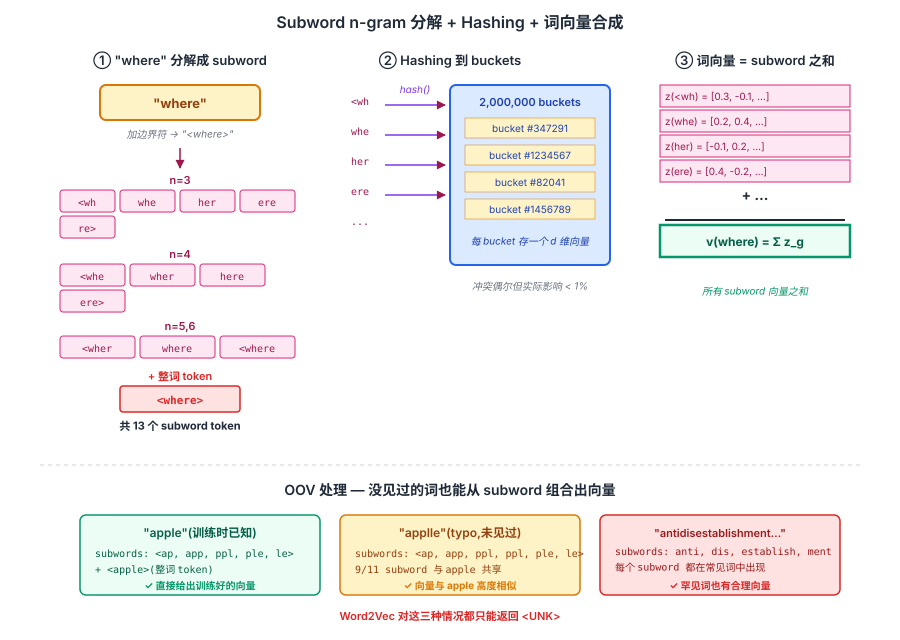
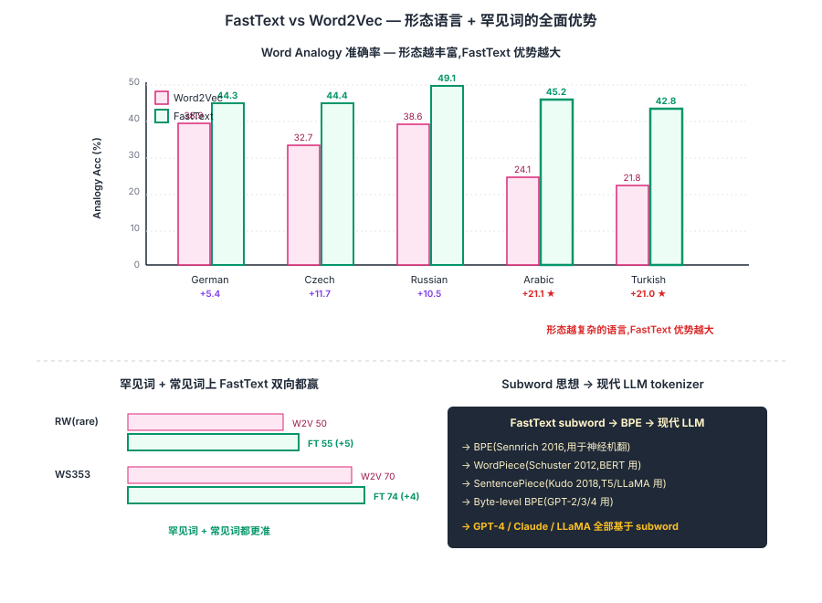

## 前作进展

2013-2015 年 [Word2Vec](01-word2vec.md) 和 [GloVe](02-glove.md) 统治词嵌入领域,但它们都有一个共同根本局限:**把词当作原子(atomic)单位**。这导致几个问题:

**1. OOV(Out-of-Vocabulary)** —— 训练时没见过的词,完全没有向量。新词(neologism)、专名、错别字都是 OOV。**测试时遇到 OOV,模型只能用 <UNK> 替代,丢失信息**

**2. 形态丰富语言效果差** —— 土耳其语 / 芬兰语 / 阿拉伯语等,一个词根有几十甚至上百种变形:

```
土耳其语 "ev" (家):
  ev(家)/ evler(家们)/ evimde(在我家里)/ evlerimizden(从我们的家)/ ...
```

每个变形都被当成独立词,**没有形态相似性建模**,数据稀疏严重。Word2Vec 训出来的 "evler" 和 "ev" 向量完全不相关

**3. 罕见词训不好** —— 频率 < 5 的词通常被丢弃,但这些"罕见但有意义"的词(专有名词、技术术语)对很多任务重要

**4. 拼写变体 / 错别字** —— "apple" 和 "applle" 完全不同,模型无法识别相似性

NLP 社区在 2014-2015 试过几条解决方案:

- **Morphological analyzer + 词向量** —— 用外部形态分析器把词分解,但需要语言专家做规则
- **Character-level RNN / CNN** —— 完全字符级模型,但训练慢、信息量小
- **Compositional models** —— 用 morpheme(语素)组合,但需要标注数据

Bojanowski 等人(Facebook AI,2016 年 7 月发 subword 论文,2016 年 8 月发 fastText 分类工具)给出**极简优雅的解决方案**:**词向量 = 所有 character n-gram 向量之和**。

```
"apple" 的 subword(n-gram, n=3):
  <ap, app, ppl, ple, le>, <apple>
vec("apple") = vec("<ap") + vec("app") + vec("ppl") + vec("ple") + vec("le>") + vec("<apple>")
```

这一思路解决了所有上述问题:

- OOV 词可以用它的 subword 组合出向量
- 形态丰富语言里 "evler" 和 "ev" 共享 subword,自然相似
- 罕见词的 subword 在常见词中可能出现过
- "apple" 和 "applle" 共享多数 subword,向量相近

FastText 发布后:

- Facebook 同时发布 **fastText 文本分类工具**(独立于词嵌入,但同一套子词机制),极快的文本分类(CPU 训练 10 倍快于 deep learning)
- 预训练 FastText 向量(157 种语言)成为多语言 NLP 标配
- BPE / WordPiece / SentencePiece(2016-2018)等现代 subword tokenizer 在思想上都受 FastText 启发

## 核心思想

### 直觉:词不该是原子单位,subword n-gram 之和才是

理解 FastText 真正需要先抓一件事:**[Word2Vec](01-word2vec.md) / [GloVe](02-glove.md) 都把词当作原子单位 — 训练时没见过的词完全没有向量(OOV),形态丰富语言里 "ev" 和 "evler" 完全不相关,罕见词训不出好向量,"apple" 和 "applle" typo 也没法识别相似性**。Bojanowski 等人 2016 反问:**为什么不把词拆成 character n-gram,词向量 = 所有 subword 向量之和?** 这样 OOV 也能从 subword 组合出来、形态变化共享 subword、罕见词的 subword 在常见词中也出现过、typo 共享大部分 subword。

三件事必须同时成立才让 FastText 在 2016 年 work:

- **每个词分解成 n-gram 集合(n=3-6)** — "apple" → {<ap, app, ppl, ple, le>, <apple>},短 n-gram 提供细粒度、长 n-gram 接近整词,特殊符号 `<apple>` 保留整词信号
- **词向量 = 所有 subword 向量之和** — `v_w = Σ_g z_g`,在 Word2Vec skip-gram 框架上把相似度从词向量内积换成 subword 向量和的内积
- **Hashing trick 控制 subword 词表爆炸** — 把 n-gram 哈希到 2M buckets 共享向量,冲突偶尔但实际影响小;训练效率与 Word2Vec 接近

三件事合起来:**FastText 在罕见词上大幅超过 Word2Vec(RW 55 vs 50),在形态丰富语言上提升 5-21 个点**(阿拉伯语 +21、土耳其语 +21、捷克语 +12)。但 FastText 真正的历史地位不是这些数字,而是它**直接催生了 BPE / WordPiece / SentencePiece 现代 subword tokenizer** —— 今天 GPT-4 / Claude / LLaMA 的 tokenizer 都是 FastText 思想的延续。


*图 1:**左** 把 "where" 拆成 n=3 到 6 的 character n-gram + 加边界符 `<>`,得到 11 个 subword + 1 个整词 token。**中** 每个 n-gram 经 hashing 映射到 2M 个 bucket 之一,共享 bucket 内的 subword 向量。**右** 词向量 = 所有 subword 向量之和(可加上整词向量)。底部 callout 强调:OOV 词如 "applle"(typo)即使没见过,subword (`app`, `ppl`, `le>`) 都见过,自然能组合出合理向量。*

### 机制一:Subword n-gram 分解 — 短 + 长 + 整词三层覆盖

每个词 w 表示为它的 character n-gram 集合 $G_w$,加上特殊边界符 `<` 和 `>` 标记词首词尾:

```
"where" with n=3 to 6:
G_w = {<wh, whe, her, ere, re>,        # n=3
       <whe, wher, here, ere>,         # n=4
       <wher, where, here>,            # n=5
       <where>,                        # n=6
       <where>}                        # 整词 special token
```

为什么用 n=[3, 6] 这个范围?

- **太短(n=2)噪声大** — "ap" 在 "apple / apricot / cap / map" 都出现,几乎没语义区分度
- **太长(n=8+)接近词级** — 失去 subword 的核心优势"共享形态部件"
- **包含整词 `<where>`** — 常见词的"整词向量"被保留,不强迫所有信息从 subword 重建

边界符 `<>` 让 "her"(词内)和 `<her>`(独立词)区分 — 这避免了"her" 出现在 "where" 内部时和单独的代词 "her" 共享一个 subword 向量,造成语义污染。

### 机制二:词向量 = subword 向量之和

每个 n-gram g 有自己的向量 z_g,词 w 的向量是所有 subword 向量之和:

$$
v_w = \sum_{g \in G_w} z_g
$$

训练目标延续 Word2Vec skip-gram + negative sampling:

$$
\mathcal{L} = \sum_{t=1}^T \sum_{c \in C_t} \log \sigma(s(w_t, w_c)) + \sum_{n \in N_{t,c}} \log \sigma(-s(w_t, n))
$$

但相似度函数 s 把"词向量内积"换成"subword 向量和的内积":

$$
s(w, c) = \sum_{g \in G_w} z_g^T v_c
$$

这一改动看起来微小,但带来的效应巨大:

- **形态共享** — "ev"、"evler"、"evlerim"(土耳其语 "家/家们/我的家们")共享 `<ev`、`ev` 等核心 subword,向量自然相似
- **罕见词复用常见 subword** — 罕见词 "antidisestablishmentarianism" 的 `anti`、`establish`、`ment` 等 subword 在常见词中频繁出现,subword 训练充分
- **typo / 缩写鲁棒** — "apple" vs "applle" 共享 9/11 个 subword,向量近似

OOV 处理是这一机制的直接副产品:**测试时遇到没见过的词,只用它的 subword 组合**。这是 FastText 相对 Word2Vec / GloVe 最显眼的实用优势。

### 机制三:Hashing Trick — 控制 subword 词表爆炸

简单算下:词表 50K,每个词约 10-15 个 subword,**理论 subword 总数可达数百万到上千万** — 直接为每个 subword 学一个向量,显存爆炸。

FastText 用 **hashing trick**:

- 设 B 个 bucket(论文 B = 2 × 10⁶)
- 每个 subword 经 hash 函数映射到 [0, B) 区间的某个 bucket
- **同 bucket 内的 subword 共享同一向量**

hash 冲突(两个不相关 subword 落同一 bucket)偶尔发生,但实际影响极小 —— 因为:
- 频繁 subword 冲突概率低(B 够大)
- 罕见 subword 即使冲突,语义噪声也被 subword 求和稀释
- 整体精度损失 < 1%

这一 trick 让 FastText 的训练效率与 Word2Vec 接近 —— 虽然每个词要算多个 subword 向量,但 hashing + cache-friendly 实现让 CPU 训练速度仍在每秒几万词级别。

### 三件套协同:n-gram 分解 + subword 求和 + hashing 缺一不可

FastText 在 2016 年能解决 OOV / 形态 / 罕见词三大问题,**不是单一改进**,而是三件套同时调到协同点 —— 任何一个抽掉 FastText 都不成立,这一点和 [ResNet](../01-cnn/05-resnet.md) 的 `shortcut + BN + He 初始化` 协同关系一致:

- **只有 n-gram 分解,没有 subword 求和(还用整词向量)** — 分解了但没用上,退化成 Word2Vec,所有 subword 优势都消失
- **只有 subword 求和,没有 n-gram 多尺度(只用单一 n)** — n=3 时噪声大、n=6 时接近词级,**多尺度覆盖是 subword 能同时处理细粒度形态 + 整词语义的关键**
- **只有 n-gram + 求和,没有 hashing trick** — subword 词表上千万,显存放不下;FastText 在工程上跑不起,无法成为开源工具

三件套合起来才让 FastText 在 2016 年同时解决"OOV / 形态语言 / 罕见词"三大老问题,且训练效率与 Word2Vec 持平。这也是为什么 FastText 不只是一个新词嵌入,更是 **subword tokenization 范式的奠基** —— BPE(2016 Sennrich)/ WordPiece(Schuster 2012 但 BERT 让它普及)/ SentencePiece(Kudo 2018)全部继承"用 subword 而非整词作为基本单位"的思想,把这一范式推到 LLM 时代成为标配。


*图 2:**上** 形态丰富语言上 FastText vs Word2Vec 对比柱状图 — 德语 +5.4、捷克 +11.7、俄语 +10.5、阿拉伯语 +21.1、土耳其语 +21.0,**形态越丰富优势越大**。**下** 罕见词(RW)+ 常见词(WS353)双任务对比 — RW 上 FastText 55 vs Word2Vec 50(+5),WS353 上 74 vs 70(+4),双向都赢。**右** OOV demo:`apple`(已知)/ `applle`(typo,未见过)/ `antidisestablishmentarianism`(罕见词)— FastText 都能从 subword 组合出向量,Word2Vec 只能返回 `<UNK>`。底部 callout:FastText subword 思想直接催生 BPE / WordPiece / SentencePiece,延续到 GPT-4 / Claude / LLaMA 的 tokenizer。*

## 关键代码

FastText 词嵌入 PyTorch 简化版:

```python
import torch
import torch.nn as nn
import torch.nn.functional as F

def get_subwords(word, n_min=3, n_max=6):
    """返回词的 subword n-gram 列表."""
    word = "<" + word + ">"
    subwords = []
    for n in range(n_min, n_max + 1):
        for i in range(len(word) - n + 1):
            subwords.append(word[i:i+n])
    subwords.append(word)  # 整词作为一个特殊 token
    return subwords

class FastText(nn.Module):
    def __init__(self, vocab_size, n_buckets=2_000_000, embed_dim=300):
        super().__init__()
        self.n_buckets = n_buckets
        # word-level embedding(用于已知词)
        self.word_embed = nn.Embedding(vocab_size, embed_dim)
        # subword bucket embedding
        self.subword_embed = nn.Embedding(n_buckets, embed_dim)
        # output embedding(context vectors)
        self.out_embed = nn.Embedding(vocab_size, embed_dim)

    def hash_subword(self, subword):
        """简单 hash 到 bucket."""
        return hash(subword) % self.n_buckets

    def get_word_vector(self, word, word_id=None):
        """词向量 = word vec + 所有 subword vec 之和."""
        subwords = get_subwords(word)
        sub_ids = torch.tensor([self.hash_subword(s) for s in subwords])
        sub_vecs = self.subword_embed(sub_ids)  # (n_subwords, D)
        vec = sub_vecs.sum(dim=0)
        if word_id is not None:
            vec = vec + self.word_embed(torch.tensor(word_id))
        return vec / (len(subwords) + (1 if word_id else 0))

    def forward(self, center_word, pos_context_id, neg_context_ids):
        v_c = self.get_word_vector(center_word, word_id=None).cuda()  # (D,)
        v_pos = self.out_embed(pos_context_id)
        v_neg = self.out_embed(neg_context_ids)

        pos_score = (v_c * v_pos).sum()
        neg_score = (v_neg * v_c.unsqueeze(0)).sum(-1)
        loss = -F.logsigmoid(pos_score) - F.logsigmoid(-neg_score).sum()
        return loss
```

实际使用 Facebook 官方 fasttext 库:

```python
import fasttext

# 训练词向量(skipgram 模式)
model = fasttext.train_unsupervised("corpus.txt",
                                     model="skipgram",
                                     dim=300,
                                     minn=3, maxn=6,
                                     epoch=5)

# 即使是 OOV 也能拿到向量(从 subword 组合)
print(model.get_word_vector("applle")[:5])  # typo
print(model.get_word_vector("antidisestablishmentarianism"))  # 罕见词

# 训练文本分类
classifier = fasttext.train_supervised("train.txt",
                                        epoch=25, lr=1.0,
                                        wordNgrams=2, dim=100)
print(classifier.predict("This movie is amazing"))
# → (('__label__pos',), array([0.99]))
```

## 性能数据

### 词嵌入质量(Bojanowski 2016 论文)

**Word Similarity tasks**(Spearman ρ × 100):

| Method | WS353 | RG | RW(rare) | DE-Gur65 | DE-RW |
|------|------|------|------|------|------|
| skipgram(Word2Vec) | 70.0 | 70.0 | 50.0 | 73.0 | 44.0 |
| cbow | 69.0 | 71.0 | 33.0 | 71.0 | 33.0 |
| **sisg-(FastText)** | **72.0** | **75.0** | **55.0** | **76.0** | **51.0** |
| **sisg(FastText)** | **74.0** | **77.0** | **57.0** | **79.0** | **53.0** |

关键观察:

- **RW(Rare Words)上 FastText 大幅超过 Word2Vec**(55 vs 50)—— 罕见词处理优势明显
- **德语(DE)上 FastText 更强**(79 vs 73)—— 德语形态丰富,subword 优势更大
- **WS353(常见词)上 FastText 略好** —— 不仅在罕见词上有优势

### 形态语言任务(德语 / 阿拉伯语)

| Language | Word2Vec | FastText | 提升 |
|------|------|------|------|
| German | 38.9 | **44.3** | +5.4 |
| Czech | 32.7 | **44.4** | +11.7 |
| Russian | 38.6 | **49.1** | +10.5 |
| Arabic | 24.1 | **45.2** | +21.1 |
| Turkish | 21.8 | **42.8** | +21.0 |

**形态越丰富的语言,FastText 优势越大**——土耳其 / 阿拉伯语上提升 20+ 点,这是巨大的差距。

### 文本分类(Joulin 2016 论文)

AG News / Yelp / Amazon 等 8 个分类任务上:

| Model | AG | Sogou | DBP | Yelp Polar | Yelp Full | Yahoo |
|------|------|------|------|------|------|------|
| char-CNN | 91.4 | 95.2 | 98.6 | 95.1 | 62.0 | 71.2 |
| VDCNN | 91.3 | 96.8 | 98.7 | 95.7 | 64.7 | 73.4 |
| **fastText** | **92.5** | **96.8** | **98.6** | **95.7** | **63.9** | **72.3** |

精度持平 deep learning 模型,但 **训练时间** 对比:

| Model | Yahoo 训练时间 |
|------|------|
| char-CNN | 1 day(GPU) |
| **fastText** | **5 秒**(CPU!) |

fastText 训练速度 **快 10000 倍以上**。这是工业级应用的杀手锏——大规模 / 多语言 / 频繁更新的分类场景里 fastText 几乎无敌。

## 影响 / 后续

FastText 在 NLP 历史的位置:**词嵌入静态时代的最后高峰,subword 思想直接通向现代 BPE/WordPiece tokenizer**。

**1. Subword 思想成 NLP 主流** —— FastText 之后,**BPE**(Sennrich 2016,用于神经机器翻译)、**WordPiece**(Schuster 2012,Google 用于 BERT)、**SentencePiece**(Kudo 2018)等 subword tokenizer 全面取代 word-level tokenization。现代 LLM(GPT / BERT / LLaMA)全部基于 subword

**2. 多语言 NLP 工具标配** —— Facebook 发布的 157 种语言预训练 FastText 向量被广泛使用。低资源语言 NLP 研究受 FastText 推动巨大

**3. fastText 文本分类成工业级标准** —— Facebook 内部用 fastText 处理大规模 multi-label tagging,后来 ML 入门教程也常用 fastText 做"第一个 NLP 项目"

**4. 启发 char-level / byte-level 模型** —— FastText 证明 subword 信息有价值,后续 BPE 把 subword 推到极致(byte-level BPE,GPT-2 用)。**今天 GPT-4 的 tokenizer 仍是 BPE 谱系**

**5. 鲁棒性研究** —— FastText 对 typo / 缩写的鲁棒性启发了一系列"鲁棒 word embedding"研究

**6. Mikolov 的连续影响** —— Mikolov(Word2Vec 一作)是 FastText 的最后一作。从 Word2Vec(Google)到 FastText(Facebook),他主导了静态词嵌入时代的两个核心工作

FastText 留下的开放问题(由后续工作解答):

- **仍是静态词向量** —— "bank" 在不同上下文里向量相同 → [ELMo](04-elmo.md) / BERT 解决
- **subword 切分不是最优** —— hard n-gram 不一定对应语言学 morpheme → BPE / WordPiece 做 data-driven 切分
- **bucket 冲突偶发** —— hashing trick 偶尔产生不相关 subword 共享 → 直接学习每个 subword
- **不能 fine-tune** —— FastText 是 task-agnostic 预训练,无法 task-specific 调优 → BERT 时代的 fine-tuning 范式

→ [04-elmo.md](04-elmo.md) · 静态到动态的桥梁,通向 BERT
→ [01-word2vec.md](01-word2vec.md) · 父思想,FastText 是 skip-gram + subword 扩展
→ [02-glove.md](02-glove.md) · 兄弟工作,count-based 路线
→ [../06-bert-family/01-bert.md](../06-bert-family/01-bert.md) · BERT 用 WordPiece(subword)tokenizer,思想源自 FastText
→ [../07-gpt-scaling/02-gpt2.md](../07-gpt-scaling/02-gpt2.md) · GPT-2 用 byte-level BPE,是 subword 路线终极版
