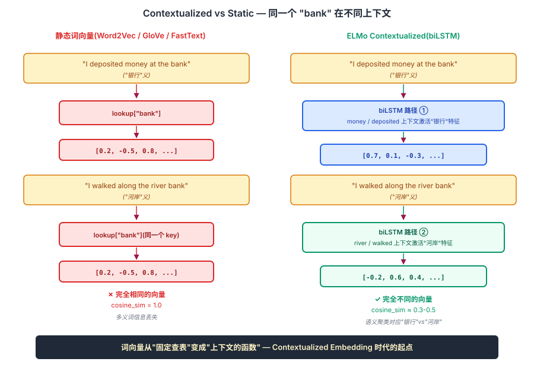
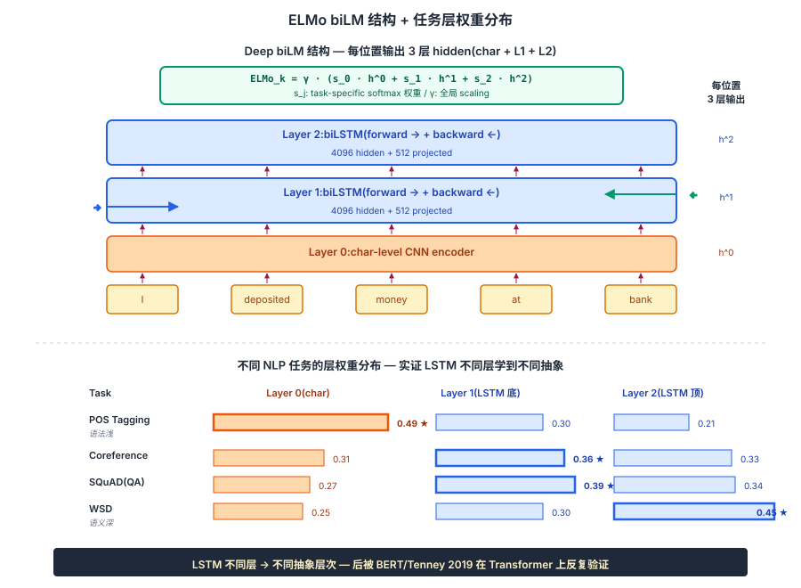

## 前作进展

2013-2017 年,词嵌入家族([Word2Vec](01-word2vec.md) / [GloVe](02-glove.md) / [FastText](03-fasttext.md))成为 NLP 任务标配 input。但所有这些方法有一个**共同根本局限**:**静态词向量**。

```
vec("bank") = [0.2, -0.5, ...]  # 永远固定

在 "I walked along the river bank" 里 → vec("bank") = [0.2, -0.5, ...]
在 "I deposited money at the bank" 里 → vec("bank") = [0.2, -0.5, ...]
```

完全一样!但 "bank" 的两个义项("河岸" vs "银行")应该有不同的向量。这就是 **多义词(polysemy)** 问题。

2014-2017 年大量研究尝试解决:

- **Sense Embedding** —— 每个义项一个向量。但需要词义标注数据 / 难以自动判断有几个义项
- **Topic-Word Embedding** —— 用 LDA 主题区分。粗粒度,不解决细粒度上下文差异
- **context2vec**(Melamud 2016) —— 用双向 LSTM 学上下文向量,但只用 top layer 输出
- **CoVe**(McCann 2017) —— 用机器翻译 encoder 输出作 contextualized representation。受限于翻译数据规模

Peters 等人(AllenAI + UW,2018 年 2 月,NAACL 2018 best paper)的 ELMo(**E**mbeddings from **L**anguage **Mo**dels)给出关键创新:

**1. 预训练双向语言模型** —— 用大语料无监督训练 deep biLM(两层双向 LSTM)
**2. 取所有层的 hidden state** —— 而不只是 top layer
**3. 任务相关的加权组合** —— 不同任务对不同层信息的偏好不同

这一组合让 ELMo 在 6 个 NLP 任务上全面 SOTA,被誉为 "NLP 的 ImageNet 时刻"。

ELMo 之后 6 个月,Google 发布 [BERT](../06-bert-family/01-bert.md),用 Transformer + masked LM 把 contextualized embedding 推到更高水平。**ELMo 是 LSTM 时代的最后辉煌,也是 BERT/GPT 时代的直接前驱**。

## 核心思想

### 直觉:词向量应该是"上下文的函数",不是固定查表

理解 ELMo 真正需要先抓一件事:**[Word2Vec](01-word2vec.md) / [GloVe](02-glove.md) / [FastText](03-fasttext.md) 都是静态查表 — 同一个 "bank" 在 "river bank" 和 "money bank" 里向量完全相同**,多义词信息丢失。之前的 sense embedding / topic-word 等尝试都没有彻底解决,因为它们仍然把"义项"当成预定义的离散类别。Peters 等人 2018 反问:**为什么不让词向量直接从上下文 LSTM 计算出来?同一个 "bank" 在不同句子里走过不同的 LSTM 路径,自然得到不同向量**。

三件事必须同时成立才让 ELMo 在 2018 年成为 NLP 范式转折:

- **预训练双向 LSTM 语言模型** — 用大语料(1B Word Benchmark)无监督训 2 层 biLSTM,正向 + 反向各预测下一个词
- **取所有层的 hidden state 而非只取顶层** — input(char-CNN)+ LSTM-L1 + LSTM-L2 三层各自输出,**底层偏语法 / 顶层偏语义**
- **task-specific 加权组合** — 对每个下游任务学一组 softmax 权重 s_j 加 γ scale,让任务自己决定用哪层多

三件事合起来:ELMo 在 SQuAD / SNLI / SRL / Coref / NER / SST 六个主流 NLP 任务上**全面 SOTA**,平均提升 2-5 个 F1/Acc 点 — 媒体把这一时刻称为 **"NLP 的 ImageNet 时刻"**(类比 AlexNet 2012)。8 个月后 Google 发布 [BERT](../06-bert-family/01-bert.md),用 Transformer + masked LM 把这一范式推到更高水平。**ELMo 是 LSTM 时代的最后辉煌,也是 LLM 时代的真正起点**。


*图 1:**左** 静态词向量(Word2Vec/GloVe)— "bank" 在 "I deposited money at the bank" 和 "I walked along the river bank" 里都是同一个 [0.2, -0.5, ...],无法区分。**右** ELMo contextualized — 同一个 "bank" 走过两条不同的 biLSTM 路径(蓝色和绿色),输出的向量明显不同,语义聚类对应"银行"和"河岸"。底部 callout 给出余弦相似度:静态 ≡ 1.0,ELMo ≈ 0.3-0.5,清晰区分。*

### 机制一:Deep biLM 预训练 — 正向 + 反向独立 LSTM

ELMo 训练一个双向 LSTM 语言模型(biLM):

**正向 LM**:从左到右预测下一个词

$$
p(t_1, ..., t_N) = \prod_{k=1}^N p(t_k | t_1, ..., t_{k-1};\, \Theta_{\text{fwd}})
$$

**反向 LM**:从右到左预测前一个词

$$
p(t_1, ..., t_N) = \prod_{k=1}^N p(t_k | t_{k+1}, ..., t_N;\, \Theta_{\text{bwd}})
$$

联合目标是两者对数似然之和。**关键细节**:ELMo 的"双向"是**两个独立 LSTM 训完拼接**,不像 BERT 那种 self-attention 真双向(BERT 论文专门指出这是 ELMo 的局限)。

网络结构:

```
Input: char-level CNN encoder(借鉴 FastText subword 思想)
   ↓
biLSTM Layer 1: 4096 hidden + 512 projected, 双向
   ↓
biLSTM Layer 2: 4096 hidden + 512 projected, 双向
```

对长度 N 的句子,每个位置 k 有 **2L+1 = 5 个表示**:char-CNN 输出 + LSTM-L1(forward+backward 各 1)+ LSTM-L2(各 1)。这一"分层输出"是 ELMo 区别于 CoVe / context2vec 等前作的关键 — **不丢弃中间层信息**。

### 机制二:多层 hidden 加权组合 — 不同任务偏好不同层

ELMo 的核心创新:**不固定用哪一层,而是对每个下游任务学一组权重**:

$$
\text{ELMo}_k^{\text{task}} = \gamma^{\text{task}} \sum_{j=0}^L s_j^{\text{task}} \cdot h_k^{LM,j}
$$

- $s_j^{\text{task}}$:softmax-normalized 权重(对 L+1 层归一化)
- $\gamma^{\text{task}}$:全局 scaling factor

论文实测不同任务的 layer 权重分布显著不同:

| Task | Layer 0(char-CNN) | Layer 1(LSTM 底) | Layer 2(LSTM 顶) |
|---|---|---|---|
| POS Tagging | **0.49** | 0.30 | 0.21 |
| Coref | 0.31 | **0.36** | 0.33 |
| SQuAD | 0.27 | **0.39** | 0.34 |
| WSD | 0.25 | 0.30 | **0.45** |

**这是 ELMo 最具洞察力的实证**:LSTM 不同层学到不同抽象层次的语言信息 — 底层(char-CNN / LSTM-L1)偏语法,顶层(LSTM-L2)偏语义。词嵌入(Word2Vec/GloVe)只有"一层",**根本没法区分这种层次**。

这一发现后来在 BERT / GPT 时代被反复验证:Tenney 2019 *BERT Rediscovers the Classical NLP Pipeline* 证明 BERT 不同层对应不同语言学层次(POS → 句法 → 语义角色 → 指代消解),思想直接源于 ELMo。

### 机制三:Frozen Feature 拼接到下游 — 不修改 ELMo 参数

ELMo 不替换原 word embedding,而是**作为额外 feature 拼接到下游模型 input**:

```python
input = concat([glove_embedding, elmo_embedding])  # [B, T, 300 + 1024]
```

下游模型(典型是 BiLSTM-CRF)在拼接后的 input 上训练,**ELMo 参数本身完全冻结**(只学下游模型 + 加权 s_j / γ)。

这种 "frozen feature" 使用方式有两个工程优势:

- **下游训练快** — 不用反传 ELMo 那 94M 参数
- **多任务可共享** — 同一份 ELMo 表示喂给不同下游任务,每个任务只学自己的加权

但也是 ELMo 与 BERT 的最大使用方式差异 —— **BERT 是端到端 fine-tune,ELMo 通常是 frozen feature**。这导致 ELMo 在下游任务上的表达力不如 BERT(因为 ELMo 内部参数不能针对任务调优),也是 ELMo 被 BERT 取代的关键原因之一。

### 三件套协同:biLM 预训练 + 多层加权 + frozen feature 缺一不可

ELMo 在 2018 年能开启"NLP 的 ImageNet 时刻",**不是单一改进**,而是三件套同时调到协同点 —— 任何一个抽掉 ELMo 都不成立,这一点和 [ResNet](../01-cnn/05-resnet.md) 的 `shortcut + BN + He 初始化` 协同关系一致:

- **只有 biLM 预训练,没有多层加权(只用顶层)** — 退化成 CoVe / context2vec 那类工作,失去"按任务选层"的核心创新,**SQuAD / NER 等任务的提升直接减半**
- **只有多层加权,没有 biLM 预训练(随机初始化 biLSTM 直接 fine-tune)** — 没有大规模无监督预训练带来的语言知识,**6 任务 SOTA 拿不到**,与从零训 BiLSTM-CRF 无差别
- **只有 biLM + 加权,没有 frozen feature 这种工程范式** — 早期 NLP 社区没有"用 LM 预训练 + 下游任务"的成熟流程,ELMo 必须给出明确的接入方式才能被快速采纳。frozen feature 让下游任务零成本接入,是 ELMo 火起来的工程关键

三件套合起来才让 ELMo 在 2018 年同时验证"预训练 LM 学到通用语言表示"+ "不同层不同抽象" + "工程上可被广泛采纳" 三件事。这直接启发了 BERT(Transformer + 真双向 + fine-tune)+ GPT(decoder-only + 大规模自回归)两条主线,把整个 NLP 推进 LLM 时代。


*图 2:**上** ELMo 双向 LSTM 结构 — 输入经 char-CNN 编码 → 两层 biLSTM(forward + backward 独立) → 每位置输出 3 层 hidden(char + L1 + L2)。**下** 不同 NLP 任务的层权重分布 — POS Tagging 偏 char-CNN(语法浅) / Coref + SQuAD 偏 LSTM-L1(中等) / WSD 偏 LSTM-L2(语义深),实证 LSTM 不同层学到不同抽象层次。底部 callout:这一发现后来被 BERT/Tenney 2019 在 Transformer 上反复验证,**LSTM 时代的洞察直接迁移到 Transformer**。*

## 关键代码

ELMo 加载与使用(用 AllenNLP 库):

```python
from allennlp.modules.elmo import Elmo, batch_to_ids

options_file = "elmo_2x4096_512_2048cnn_2xhighway_options.json"
weight_file = "elmo_2x4096_512_2048cnn_2xhighway_weights.hdf5"

# num_output_representations=1 表示输出一层(用学到的权重组合)
elmo = Elmo(options_file, weight_file, num_output_representations=1, dropout=0)

# 输入:list of token list
sentences = [
    ["I", "deposited", "money", "at", "the", "bank"],
    ["I", "walked", "along", "the", "river", "bank"],
]
character_ids = batch_to_ids(sentences)  # (B, seq, 50)
elmo_output = elmo(character_ids)

# elmo_representations: list of (B, seq, 1024) tensor(1024 = 2 × 512 双向)
elmo_vecs = elmo_output["elmo_representations"][0]
print(elmo_vecs.shape)  # torch.Size([2, 6, 1024])

# 同一个 "bank" 在两个句子里的向量
bank_vec_1 = elmo_vecs[0, 5]  # "money at the bank" 里的 bank
bank_vec_2 = elmo_vecs[1, 5]  # "river bank" 里的 bank
similarity = torch.cosine_similarity(bank_vec_1.unsqueeze(0), bank_vec_2.unsqueeze(0))
print(similarity)  # ~0.3-0.5(不像静态向量是 1.0)
```

下游任务集成(典型 NER pipeline):

```python
class NER_with_ELMo(nn.Module):
    def __init__(self, num_tags):
        super().__init__()
        self.glove = nn.Embedding(vocab_size, 300)  # 预训练 GloVe
        self.elmo = Elmo(options_file, weight_file, 1, dropout=0.5)
        # GloVe (300) + ELMo (1024) → concat
        self.lstm = nn.LSTM(300 + 1024, 200, bidirectional=True, batch_first=True)
        self.classifier = nn.Linear(400, num_tags)

    def forward(self, word_ids, char_ids):
        glove_vec = self.glove(word_ids)        # (B, seq, 300)
        elmo_vec = self.elmo(char_ids)["elmo_representations"][0]  # (B, seq, 1024)
        x = torch.cat([glove_vec, elmo_vec], dim=-1)  # (B, seq, 1324)
        x, _ = self.lstm(x)
        return self.classifier(x)
```

## 性能数据

ELMo 论文在 6 个主流 NLP 任务上对比 baseline + ELMo:

| Task | Previous SOTA | Baseline | **+ ELMo** | Improvement |
|------|------|------|------|------|
| **SQuAD**(QA F1) | 84.4 | 81.1 | **85.8** | +4.7 |
| **SNLI**(NLI Acc) | 88.6 | 88.0 | **88.7** | +0.7 |
| **SRL**(Semantic Role Labeling F1) | 81.7 | 81.4 | **84.6** | +3.2 |
| **Coref**(Coreference F1) | 67.2 | 67.2 | **70.4** | +3.2 |
| **NER**(F1) | 91.93 | 90.15 | **92.22** | +2.06 |
| **SST-5**(Sentiment Acc) | 53.7 | 51.4 | **54.7** | +3.3 |

关键观察:

- **6 个任务全部 SOTA** —— ELMo 是 2018 上半年的 NLP 全能王
- **平均提升 2-5 个 F1/Acc 点** —— 在 NLP 任务上是巨大改进(很多任务在 90%+ 区间,每点都很难)
- **SRL / SQuAD 提升最大** —— 这些任务需要语义理解,ELMo 的 contextualized 优势最明显

### Layer Importance 分析

ELMo 论文分析不同任务的 layer weight:

| Task | Layer 0(char-CNN)| Layer 1(LSTM 底)| Layer 2(LSTM 顶) |
|------|------|------|------|
| Coref | 0.31 | 0.36 | 0.33 |
| SQuAD | 0.27 | **0.39** | 0.34 |
| SST-5 | 0.34 | 0.34 | 0.32 |
| POS Tagging | **0.49** | 0.30 | 0.21 |
| WSD | 0.25 | 0.30 | **0.45** |

- **POS Tagging 偏好底层**(语法信息浅)
- **WSD 偏好顶层**(语义信息深)
- 大多数任务平均使用各层

这一发现验证了 LSTM 不同层学到不同抽象层次的语言信息,是 ELMo 设计的核心 insight。

## 影响 / 后续

ELMo 在 NLP 历史的位置:**Contextualized Embedding 时代起点,词嵌入家族的终章,BERT/GPT 的直接前驱**。

**1. NLP 的 ImageNet 时刻** —— ELMo 在 6 个任务上同时 SOTA,引发 NLP 圈巨大震动。媒体把 ELMo 称为 "NLP 的 ImageNet 时刻"(类比 AlexNet 2012 在 ImageNet 引爆 CV 深度学习时代)

**2. 直接催生 BERT** —— ELMo 之后 8 个月,Google 发布 BERT(2018.10)。BERT 论文明确把 ELMo 作为主要 baseline,在结构上做关键改进:
   - Transformer 替代 LSTM(更并行)
   - 真正双向(masked LM)替代两个单向拼接
   - 端到端 fine-tune 替代 frozen feature

BERT 几乎全面超越 ELMo,但**没有 ELMo 就没有 BERT 的设计思路**

**3. AllenNLP 库的兴起** —— ELMo 由 AllenAI 发布,配 AllenNLP 库提供端到端 NLP 实验框架。AllenNLP 在 BERT 时代被 HuggingFace transformers 取代,但作为 ELMo 时代的标杆框架影响巨大

**4. 启发"用 LM 预训练学表示"范式** —— ELMo 第一次大规模验证"预训练语言模型 + 下游任务"范式,后续 BERT / GPT / T5 / RoBERTa 全部基于这一思路。**ELMo 是 LLM 时代的真正起点**

**5. 多任务通用表示研究热潮** —— ELMo 启发后续 USE(Universal Sentence Encoder)、InferSent、CoVe 等 sentence-level 通用表示工作

**6. NLP 任务标配从 Word2Vec/GloVe 切换到 ELMo / BERT** —— 2018 年下半年,NLP 论文标配 input 从静态词向量切换到 ELMo / BERT。Word2Vec / GloVe / FastText 退守到资源受限场景

**7. LSTM 时代的终章** —— ELMo 是 LSTM 在 NLP 上的最后辉煌。BERT 之后 LSTM 在 NLP 主流任务上几乎被 Transformer 完全取代。ELMo 是承前启后的关键节点

ELMo 留下的开放问题(由后续工作解答):

- **不是真双向** —— forward + backward 独立训,只在最后 concat → BERT 的 masked LM 是真双向
- **LSTM 慢** —— 不能并行 → Transformer 解决
- **frozen feature 不够灵活** —— 下游任务不能修改 ELMo 参数 → BERT fine-tuning 范式
- **每个任务要单独训 weighted average** —— 工程复杂 → BERT 直接 fine-tune CLS
- **模型规模小**(94M 参数) —— 受限于 LSTM 计算 → BERT-large(340M)、GPT-3(175B)

→ [../06-bert-family/01-bert.md](../06-bert-family/01-bert.md) · 直接继承者,真正引爆 NLP 革命
→ [../06-bert-family/02-roberta.md](../06-bert-family/02-roberta.md) · BERT 的工程化改进
→ [../05-transformer/01-transformer.md](../05-transformer/01-transformer.md) · BERT 用的 Transformer 架构
→ [../02-rnn-lstm/02-lstm.md](../02-rnn-lstm/02-lstm.md) · ELMo 的 LSTM 基础
→ [01-word2vec.md](01-word2vec.md) · 静态词嵌入起源,ELMo 的对照
→ [03-fasttext.md](03-fasttext.md) · ELMo 的 char-CNN 受 FastText subword 思想启发
