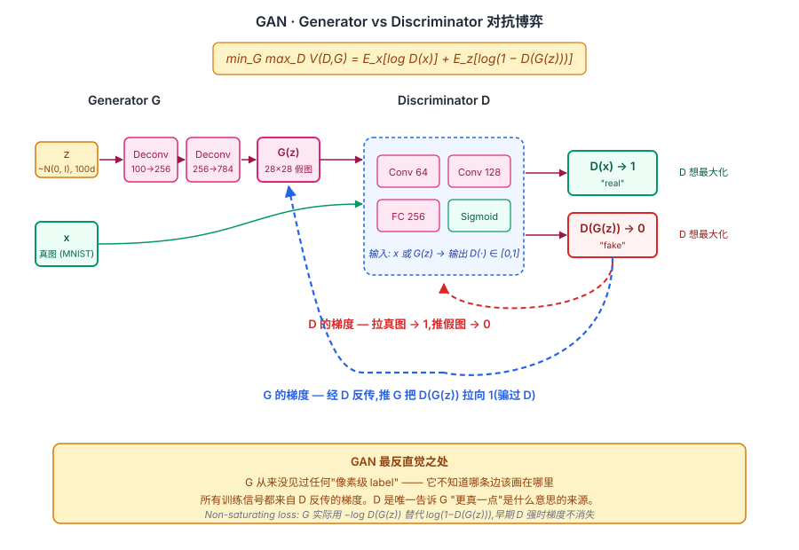
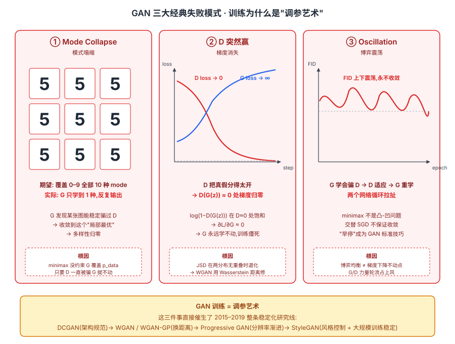

## 前作进展

2014 年之前,深度生成模型主要有几条路:

**1. RBM / DBN**(Hinton 2006)—— Restricted Boltzmann Machine 是早期深度学习的代表,但需要 MCMC 采样,生成慢且质量差

**2. VAE**(Kingma 2013,与 GAN 同年)—— Variational Autoencoder 通过最大化 ELBO 训练,有理论保证但生成的图像**模糊**(L2 reconstruction loss 把所有可能模式平均化)

**3. Autoregressive**(PixelRNN 2016 / 早期 NADE)—— 逐像素生成,精确建模 likelihood 但生成极慢

**4. Energy-based Models** —— 理论优雅但训练不稳定,partition function 难算

所有这些方法的共同问题:**显式建模 likelihood 或 partition function 太难,生成图像受限于 loss 函数的"平均化"特性**。

Goodfellow 等人(Bengio 组,2014 年 6 月)的 GAN 论文给出完全不同的思路:**根本不显式建模 likelihood,通过对抗训练让 G 隐式学到数据分布**。这一思路有几个革命性优势:

- **不需要 partition function** —— 完全避开 likelihood 计算的数学困难
- **G 可以是任意 differentiable 函数** —— 任意神经网络都可以做 G
- **生成清晰** —— 没有 L2 平均化,生成的图像有细节

Goodfellow 在论文里讲了一个传说级故事:他在蒙特利尔的一家酒吧 brainstorm 时想出 GAN 的对抗博弈思路,当晚回家就实现并跑通了。从想法到 paper 投稿仅几周。**GAN 是深度学习历史上最有"a-ha moment"特征的工作之一**。

## 核心思想

### 直觉:让两个网络互相对抗,把"生成是否真实"这件事显化成可微目标

理解 GAN 真正需要先抓一件事:**VAE / RBM / autoregressive 这些前作都在间接代理"图像是否真实"这个真目标** —— 它们最大化 likelihood / ELBO / pixel L2,但这些数学目标和"人看着像不像真"之间隔了一层,导致生成结果模糊或慢。Goodfellow 2014 的洞察:**直接造一个二分类器 D 来打分"像不像真",再让生成器 G 朝着"骗过 D"的方向更新**。这一招把"真实性"这个原本无法直接优化的隐目标,变成了一个可微的对抗损失。

为什么这件事在 2014 年才出现?三件事必须同时成立:

- **G 可以是任意 differentiable 网络** —— 不需要 likelihood 可算,任何 NN 都行
- **D 反传的梯度足够 informative** —— D 必须接近最优才能给 G 有用的梯度;太弱 G 学错,太强 G 没梯度
- **交替优化能近似 minimax** —— 严格 minimax 不可解,但 1:1 或 k:1 交替 SGD 在实际工程里能 work

把这三件事合在一起:GAN 给出了一个**无需 partition function、无需 likelihood、可生成清晰图像**的全新生成范式。生成模型从此分裂成"显式建模 likelihood(VAE / Diffusion)"和"隐式对抗(GAN)"两条主线,一直延续到今天。


*图 1:**左侧 G** 把噪声 z (100d) 经几层 deconv 映射成假图 G(z) (28×28);**中间 D** 接收真图 x 或假图 G(z),经几层 conv → sigmoid → "real / fake" 概率;**右侧** 两条梯度流:D 朝"真图 → 1, 假图 → 0"更新,G 经 D 反传朝"骗 D 把假图判 1"更新。底部 callout 强调:G 没见过任何像素级 label,所有信号来自 D 的反传梯度 —— 这是 GAN 最反直觉处。*

### 机制一:Generator G — 从噪声 z 映射到图像

G 是一个普通 deterministic 神经网络,输入是从 $\mathcal{N}(0, I)$ 采的低维噪声 $z \in \mathbb{R}^{100}$,输出是一张图 $G(z)$(MNIST 28×28、CIFAR 32×32 等)。

实现上 G 是几层 MLP 或 deconv,输出通常用 tanh 激活把像素压到 $[-1, 1]$。**关键反直觉点**:G 在整个训练里**从来没看过一张真图**。它不像 VAE 有 encoder 提供 reconstruction target,也不像 autoregressive 模型有 next-pixel ground truth。G 的所有学习信号都来自 D 的反传梯度 —— D 说"这像真图",G 朝那个方向更新。

这意味着 z 空间和真实数据 manifold 之间的映射,完全靠对抗压力学出来。z → image 没有"标准答案",只有"D 是否觉得真"。

### 机制二:Discriminator D — 区分真图 vs G 生成图

D 是一个二分类器,真图标 1、G 图标 0,训练它就是普通监督学习:

$$
\max_D \mathbb{E}_{x \sim p_{\text{data}}}[\log D(x)] + \mathbb{E}_{z \sim p_z}[\log(1 - D(G(z)))]
$$

但 D 的真正作用不是"分类",而是**给 G 提供梯度方向**。论文里有一个漂亮的理论结果:给定 G,最优 D 是

$$
D^*(x) = \frac{p_{\text{data}}(x)}{p_{\text{data}}(x) + p_G(x)}
$$

代入回 V 后 G 的等价优化目标变成:

$$
C(G) = -\log 4 + 2 \cdot \text{JSD}(p_{\text{data}} \| p_G)
$$

JSD 是 Jensen-Shannon Divergence。**全局最优在 $p_G = p_{\text{data}}$ 取得,此时 JSD = 0,D(x) ≡ 1/2(分不清真假)**。这是 GAN 的理论基石 —— 只要训练能收敛,G 就学到真实数据分布。问题恰恰在"训练能收敛"这一前提 —— 后续大量工作(WGAN / SN-GAN / Progressive GAN)都是在处理 JSD 在分布不重叠时梯度消失的病态。

### 机制三:Minimax 交替优化 + Non-Saturating Loss

理论是 minimax,实际训练是交替更新:

```
for each iteration:
    # Step 1: 训练 D 一步
    采样真数据 x, 假数据 G(z)
    更新 D 最大化:log D(x) + log(1 - D(G(z)))

    # Step 2: 训练 G 一步
    采样新的噪声 z
    更新 G 最小化:log(1 - D(G(z)))
    # 实际改用 -log D(G(z))(non-saturating loss)
```

**Non-saturating loss 是 GAN 论文里一个不起眼但至关重要的工程 trick** —— 原始 `log(1-D(G(z)))` 在训练早期 D 很强、D(G(z)) ≈ 0 时梯度几乎消失(sigmoid 饱和段);改用 `-log D(G(z))` 后梯度在同样情形下反而最大,G 在早期能快速逃出"全被识破"的劣势。这条 trick 是几乎所有 GAN 实现的默认配置。

另一个关键工程经验:**D 和 G 的能力必须平衡**。D 太强 → G 没梯度(被一边倒压制);G 太强 → D 退化成随机猜(没法提供 informative 梯度)。论文里给的经验是 D 训 k 步、G 训 1 步,k 通常 1 或 5,实际中需要按数据 / 网络规模反复调。

### 三件套协同:对抗目标 + 交替优化 + 能力平衡 缺一不可

GAN 在 2014 年能成立,**不是单一改进**,而是这三件事同时调到协同点 —— 任何一个抽掉 GAN 就崩,这一点和 [ResNet](../01-cnn/05-resnet.md) 的 `shortcut + BN + He 初始化` 协同关系一致:

- **只有对抗目标,没有交替优化** —— minimax 严格闭式不可解,纯理论一步也走不出来
- **只有交替优化,没有 non-saturating loss / 能力平衡** —— D 早期一压倒 G 就梯度消失,训练直接卡死(2014 年大量复现失败正是这个原因)
- **只有交替 + 平衡,没有对抗目标本身** —— 退化成 VAE 那种 reconstruction 路线,生成又回到模糊

三件套合起来才让"对抗生成"这个看似简单的想法第一次跑通。也正因为三件事的协同窗口非常窄,GAN 训练以"调参艺术"闻名,直接催生了 DCGAN / WGAN / Progressive GAN / StyleGAN 一整条稳定化路线。


*图 2:GAN 训练失败的三种典型形态。**左 Mode Collapse**——G 学到一种能骗 D 的图就反复输出,9 张几乎一样的小图代表 G 只覆盖了数据分布的一个 mode。**中 D 突然赢**——D loss 直降到 0、G loss 直升到 ∞,sigmoid 饱和,梯度归零,训练直接死掉。**右 Oscillation**——G/D 来回拉扯,FID 上下震荡,博弈永远不收敛。这三件事直接催生了 DCGAN、WGAN、Progressive GAN、StyleGAN 等一系列稳定化工作。*

## 关键代码

PyTorch 实现最简 GAN(MLP-based,跑 MNIST):

```python
import torch
import torch.nn as nn

# 1. Generator
class Generator(nn.Module):
    def __init__(self, z_dim=100, img_dim=784):
        super().__init__()
        self.net = nn.Sequential(
            nn.Linear(z_dim, 256),
            nn.LeakyReLU(0.2),
            nn.Linear(256, 512),
            nn.LeakyReLU(0.2),
            nn.Linear(512, img_dim),
            nn.Tanh(),  # 输出 [-1, 1]
        )
    def forward(self, z):
        return self.net(z)

# 2. Discriminator
class Discriminator(nn.Module):
    def __init__(self, img_dim=784):
        super().__init__()
        self.net = nn.Sequential(
            nn.Linear(img_dim, 512),
            nn.LeakyReLU(0.2),
            nn.Linear(512, 256),
            nn.LeakyReLU(0.2),
            nn.Linear(256, 1),
            nn.Sigmoid(),
        )
    def forward(self, x):
        return self.net(x)

# 3. Training loop
G = Generator().cuda()
D = Discriminator().cuda()
opt_G = torch.optim.Adam(G.parameters(), lr=2e-4, betas=(0.5, 0.999))
opt_D = torch.optim.Adam(D.parameters(), lr=2e-4, betas=(0.5, 0.999))
criterion = nn.BCELoss()

for epoch in range(200):
    for real_imgs, _ in mnist_loader:
        bs = real_imgs.size(0)
        real_imgs = real_imgs.view(bs, -1).cuda()
        real_labels = torch.ones(bs, 1).cuda()
        fake_labels = torch.zeros(bs, 1).cuda()

        # Train D
        opt_D.zero_grad()
        real_loss = criterion(D(real_imgs), real_labels)
        z = torch.randn(bs, 100).cuda()
        fake_imgs = G(z)
        fake_loss = criterion(D(fake_imgs.detach()), fake_labels)
        d_loss = real_loss + fake_loss
        d_loss.backward()
        opt_D.step()

        # Train G(non-saturating loss)
        opt_G.zero_grad()
        z = torch.randn(bs, 100).cuda()
        fake_imgs = G(z)
        g_loss = criterion(D(fake_imgs), real_labels)  # 让 D 判为真
        g_loss.backward()
        opt_G.step()
```

跑通 MNIST 大概要 200 epoch,生成的数字勉强能看(2014 年水平)。

## 性能数据

GAN 原论文没有定量 benchmark(2014 年还没有 IS / FID 这些指标)。论文用 MNIST、Toronto Face Database(TFD)、CIFAR-10 做定性 demo:

- **MNIST** —— 生成的数字模糊但能识别
- **TFD** —— 生成的人脸有基本五官但细节差
- **CIFAR-10** —— 生成的图像高度模糊(32×32 仍勉强)

**Parzen window log-likelihood**(GAN 时代主要的量化指标,粗糙):

| 模型 | MNIST | TFD |
|------|------|------|
| DBN | 138 ± 2 | 1909 ± 66 |
| Stacked CAE | 121 ± 1.6 | 2110 ± 50 |
| Deep GSN | 214 ± 1.1 | 1890 ± 29 |
| **GAN** | **225 ± 2** | **2057 ± 26** |

GAN 在 MNIST 上最好,TFD 上接近 SOTA。但 Parzen window 不可靠,后来研究证明这个指标几乎和质量无关。

**真正让 GAN 出圈的是定性结果**——尤其在 [DCGAN](02-dcgan.md) 之后,GAN 生成的人脸 / 卧室让人直观看到"机器在创造图像"。

## 影响 / 后续

GAN 在深度学习历史的位置:**深度生成模型新范式,2014-2020 图像生成的绝对主流**。

**1. GAN 引爆生成模型研究** —— 2014-2018 年 GAN 论文数量爆发式增长,arXiv 上每周几十篇 GAN 变体(称为 "GAN Zoo"——SAGAN, BigGAN, ProGAN, ...)。Goodfellow 这一篇论文引用 60K+,是深度学习史上最高引用论文之一

**2. 直接催生 DCGAN / WGAN / CycleGAN 等里程碑** —— GAN 的工程化(DCGAN)、稳定化(WGAN)、应用化(CycleGAN)等后续工作都基于这个 minimax 框架

**3. Adversarial 思想扩散** —— Adversarial training 思路从生成模型扩散到其他领域:adversarial examples / adversarial robustness / adversarial domain adaptation 等。"对抗"成为深度学习核心概念之一

**4. 工业应用爆发** —— Deepfake、StyleGAN 生成的"this person does not exist"、艺术 GAN(GANbreeder, ArtBreeder)、超分辨率(SRGAN)、图像翻译(CycleGAN)等。GAN 第一次让"AI 创作内容"进入大众视野

**5. 启发 Diffusion** —— Diffusion 2020 年崛起后部分取代 GAN,但 Diffusion 设计上仍受 GAN 影响。Classifier-Free Guidance / ControlNet 等 Diffusion 控制思路与 GAN 的 conditional 路线一脉相承

**6. Goodfellow 个人成为 AI 圈代表人物** —— GAN 论文一作,2016 年出版《Deep Learning》教材,后任职 Google Brain / Apple ML / DeepMind。在 LeCun / Hinton / Bengio "深度学习三巨头"之外的下一代代表

GAN 留下的开放问题(由后续工作解答):

- **训练不稳定** —— 怎么让 GAN 训练可靠?→ [DCGAN](02-dcgan.md) 给出 CNN-GAN 工程方案,WGAN 用 Wasserstein 距离替代 JSD
- **Mode collapse** —— G 只生成数据分布的一部分?→ Unrolled GAN / minibatch discrimination
- **没法控制生成内容** —— G(z) 给随机噪声出随机图,怎么按要求生成?→ Conditional GAN / [CycleGAN](03-cyclegan.md) / [StyleGAN](04-stylegan.md)
- **质量上限** —— 怎么生成 1024×1024 高分辨率?→ Progressive GAN / [StyleGAN](04-stylegan.md)
- **评估难** —— 没有 likelihood 怎么量化质量?→ Inception Score / FID

→ [02-dcgan.md](02-dcgan.md) · CNN-GAN 工程化,首次稳定训练
→ [03-cyclegan.md](03-cyclegan.md) · 无配对图像翻译,GAN 应用爆发
→ [04-stylegan.md](04-stylegan.md) · 风格控制 + 高分辨率,GAN 巅峰
→ [../10-diffusion/01-ddpm.md](../10-diffusion/01-ddpm.md) · 后继生成模型路线,部分取代 GAN
→ [../01-cnn/](../01-cnn/) · DCGAN 之后 GAN 普遍基于 CNN
