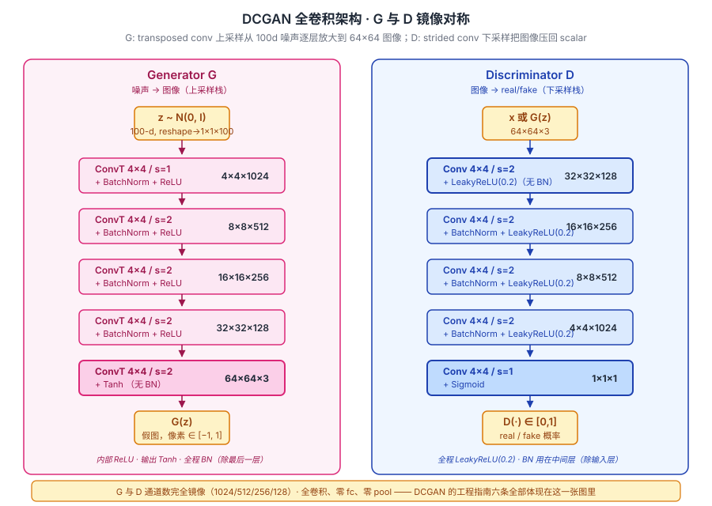
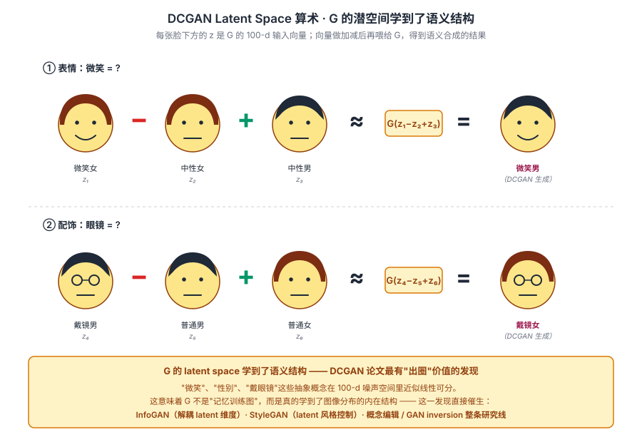

## 前作进展

[GAN](01-gan.md) 2014 年发表后,理论很优雅但**工程极其脆弱**:

**1. 训练不稳定** —— 大半实验崩溃。D 损失迅速下降到 0,G 学不到东西;或 G 损失爆炸,生成噪声

**2. Mode Collapse 频发** —— G 只生成几种固定 pattern。MNIST 上 G 可能只生成数字 "1",其他数字一个都没

**3. 全连接层效率低** —— Goodfellow 2014 用 MLP 做 G/D,在 32×32 以上图像直接 OOM 或不收敛

**4. 没有可复现方案** —— 不同论文用的超参数千差万别,社区一直没有"GAN 标准训练食谱"

2014-2015 年大量人尝试改进 GAN 但都失败。直到 Radford 等人(Indico,2015 年 11 月)发现:**把 GAN 完全用 CNN 替代 MLP,配合几条工程规则,GAN 能稳定训练**。

DCGAN 论文标题虽然是"Unsupervised Representation Learning"(强调无监督表示学习),但真正影响是它给出了 **GAN 训练食谱**——之后几年所有 GAN 工作的基础设施。

论文的影响立竿见影:

- 论文里的 latent 空间算术(eye-glasses man - man + woman = eye-glasses woman)成 AI 圈火爆 meme
- 64×64 卧室 / 人脸生成质量震撼,让生成模型第一次"出圈"
- Soumith Chintala(论文三作)后来成为 PyTorch 创始人,DCGAN 也成为 PyTorch 教程经典案例

**没有 DCGAN 就没有后续 GAN 黄金时代**——CycleGAN、StyleGAN 等都建立在 DCGAN 的 CNN-GAN 范式上。

## 核心思想

### 直觉:原版 GAN 训练靠运气,DCGAN 给出"几乎一定能训出来"的 CNN 配方

理解 DCGAN 真正需要先抓一件事:**[GAN](01-gan.md) 2014 概念优雅但训练失败率极高** —— 2014-2015 几乎只有 Goodfellow 团队和少数实验室能复现,大量人尝试都失败(D 突然赢、mode collapse、梯度爆炸三件事循环出现)。Radford & Metz 2016 反问:**能不能找出一组架构 / 优化 / 初始化的"recipe",让 GAN 在大多数图像数据上稳定训出来?**

DCGAN 不是数学创新,而是**工程食谱** —— 它把 GAN 从"研究概念"变成"工程可复现"。三件事必须同时成立:

- **全卷积架构** —— MLP 学不到图像的空间结构,GAN 加深加宽时崩溃;CNN 通过 strided conv / deconv 上下采样,空间结构和图像本身对齐
- **训练稳定剂三件套**(BatchNorm + LeakyReLU + Adam β₁=0.5) —— GAN 训练对 BN / 激活 / 优化器超敏感,DCGAN 把这三件钉死成默认值
- **明确的架构 guideline 6 条** —— 去 fc、加 BN、G 用 ReLU+tanh、D 用 LeakyReLU、strided conv 替代 pool、不用 max-pool。这套指南是 GAN 第一次有"工程标准"的版本

三件套合起来才让 GAN 在 2016 年从"少数人的玩具"变成"任何人能跑"——DCGAN 之前 GAN 复现成功率 <30%,之后接近 90%+。这是后续 WGAN / Progressive GAN / CycleGAN / StyleGAN 一整条 GAN 黄金时代得以展开的根本前提。


*图 1:**左 Generator** — z (100d) 经几层 transposed conv 上采样(4×4×1024 → 8×8×512 → 16×16×256 → 32×32×128 → 64×64×3),每层 BN + ReLU,输出层 tanh。**右 Discriminator** — 64×64×3 经 strided conv 下采样到 4×4×1024 → flatten → sigmoid,每层 BN + LeakyReLU。两个网络结构完全对称 —— 一个把图像 conv 到 scalar,另一个把 scalar 反 conv 到图像,这种对称设计成后续所有 GAN 标配。*

### 机制一:全卷积架构 — 用 strided conv / transposed conv 替代 pool 和 fc

原版 GAN 是 MLP,DCGAN 全部用 conv:

- **D**:用 strided conv(stride=2)下采样,**不用 max-pool**
- **G**:用 transposed conv(stride=2)上采样,**不用 fc 层 reshape**

为什么?Pooling 是固定不可学的算子,strided conv 让网络**自己学下/上采样方式**。这让模型学到的空间结构和图像本身的空间结构对齐,而不是被 pooling 的固定 stride 限制。

去掉 fc 层是另一个关键 —— 原版 GAN 在 MLP 输入输出端用 fc 把 z reshape 成图像 / 把图像 flatten 成 scalar,这破坏了空间结构。DCGAN 直接从 1×1×100 噪声 conv 出图像、把图像 conv 到 1×1×1 输出,**整个网络全程在空间网格上操作**。

### 机制二:BatchNorm + LeakyReLU + Adam(β₁=0.5) — 三个"必装"的训练稳定剂

DCGAN 的训练稳定靠三件具体的工程默认:

- **BatchNorm 用在 G 和 D 几乎所有层** —— 除了 G 的输出层(避免污染像素分布)和 D 的输入层(避免污染真实图像统计)。BN 让训练稳定,显著减少 mode collapse
- **D 用 LeakyReLU(slope=0.2)** —— 替代 ReLU。让负梯度不消失(避免 dying ReLU),D 在区分难样本时仍有梯度流回。G 内部仍用 ReLU,因为 G 输出层用 tanh 已经处理了负区间
- **Adam(lr=2e-4, β₁=0.5, β₂=0.999)** —— β₁ 从默认 0.9 改到 0.5 是关键!动量太大会把 G/D 推向极端(D 突然全赢或 G 突然崩溃),降低动量让两者博弈"软"一点

这三件单独都是 2014-2015 已有的技术,**DCGAN 把它们钉死成默认值**,后来 4 年所有 GAN 工作几乎都用这套超参数,没人改。

### 机制三:架构指南 6 条 — 让任何人都能复现

DCGAN 论文最具影响力的部分是给出了 6 条明确的架构 guideline:

1. **去 fc** —— G/D 全程在 conv 上操作
2. **加 BN** —— G 和 D 几乎所有层都用,除了 G output 和 D input
3. **G 用 ReLU 内部 + tanh 输出** —— 输出 normalize 到 [-1, 1]
4. **D 用 LeakyReLU(0.2)** —— 避免 dying ReLU
5. **strided conv 替代 pool** —— G 用 transposed conv 上采样,D 用 strided conv 下采样
6. **不用 max-pool** —— 让网络学采样方式而不是用固定算子

这 6 条规则在 2016 年之后成为所有 GAN 论文的隐含默认。即使 WGAN / SAGAN / Progressive GAN 改进 GAN 的损失函数或架构,核心仍基于 DCGAN 的 CNN 食谱。这种"明确写下来 + 实证有效"的工程指南,让大量研究者能进入 GAN 领域,直接推动 GAN 在 2016-2020 年的黄金时代。

### 三件套协同:全卷积 + BN/LeakyReLU/Adam + 架构 guideline 缺一不可

DCGAN 在 2016 年能把 GAN 从"研究概念"变成"工程可复现",**不是单一改进**,而是三件套同时调到协同点 —— 任何一个抽掉 DCGAN 都不成立,这一点和 [ResNet](../01-cnn/05-resnet.md) 的 `shortcut + BN + He 初始化` 协同关系一致:

- **只有全卷积,没有 BN / LeakyReLU / Adam β₁=0.5** —— 训练仍然崩溃。光把 MLP 换成 CNN 不够,GAN 对优化超参数 / 归一化 / 激活函数极其敏感
- **只有训练稳定剂,没有全卷积** —— MLP 学不到图像空间结构,GAN 加深后崩溃。Goodfellow 2014 原版的 MLP-GAN 即使加 BN 也跑不到 64×64
- **只有全卷积 + 稳定剂,没有明确 guideline** —— 每个人凭运气调参,有人 work 有人不 work。DCGAN 6 条指南让"成功率"从 <30% 跳到 >90%,这是工程复现性的关键

三件套合起来才让 GAN 在 2016 年从"少数人的玩具"变成"任何人能跑"。DCGAN 的最大遗产不在某一项技术,而在"提供可复现工程食谱"这件事本身 —— 后来所有 GAN 工作都站在它的肩膀上。

### 一个意外发现:Latent Space Arithmetic

DCGAN 论文里有一个"非工程"的副产品 —— **latent 空间算术**。把训完的 G 的 z 向量做加减,能得到语义合成的结果:

```
G(z_smiling_woman) − G(z_neutral_woman) + G(z_neutral_man) ≈ G(z_smiling_man)
G(z_glasses_man) − G(z_no_glasses_man) + G(z_woman) ≈ G(z_glasses_woman)
```

这个现象第一次让人直观看到 **G 学到了语义结构化的 latent 空间** —— GAN 不只是"乱画",而是真的"理解"了图像分布,把语义属性(性别、表情、戴不戴眼镜)对应到 latent 空间的某些方向。这一发现催生了 InfoGAN / BiGAN / StyleGAN 等"可解释 GAN"路线,也是 StyleGAN 后来能做 face editing / style mixing 的根本前提。


*图 2:DCGAN 论文最著名的可视化。**上行** smiling woman − neutral woman + neutral man ≈ smiling man;**下行** glasses man − no-glasses man + no-glasses woman ≈ glasses woman。这证明 G 的 latent space 学到了语义结构,是 StyleGAN / 概念编辑等后续工作的基础。*

## 关键代码

DCGAN Generator + Discriminator(PyTorch):

```python
import torch
import torch.nn as nn

class DCGAN_Generator(nn.Module):
    def __init__(self, z_dim=100, img_channels=3, ngf=64):
        super().__init__()
        self.net = nn.Sequential(
            # input: z, (z_dim, 1, 1)
            nn.ConvTranspose2d(z_dim, ngf*8, 4, 1, 0, bias=False),
            nn.BatchNorm2d(ngf*8),
            nn.ReLU(True),
            # (ngf*8, 4, 4)
            nn.ConvTranspose2d(ngf*8, ngf*4, 4, 2, 1, bias=False),
            nn.BatchNorm2d(ngf*4),
            nn.ReLU(True),
            # (ngf*4, 8, 8)
            nn.ConvTranspose2d(ngf*4, ngf*2, 4, 2, 1, bias=False),
            nn.BatchNorm2d(ngf*2),
            nn.ReLU(True),
            # (ngf*2, 16, 16)
            nn.ConvTranspose2d(ngf*2, ngf, 4, 2, 1, bias=False),
            nn.BatchNorm2d(ngf),
            nn.ReLU(True),
            # (ngf, 32, 32)
            nn.ConvTranspose2d(ngf, img_channels, 4, 2, 1, bias=False),
            nn.Tanh(),
            # (img_channels, 64, 64)
        )

    def forward(self, z):
        return self.net(z)


class DCGAN_Discriminator(nn.Module):
    def __init__(self, img_channels=3, ndf=64):
        super().__init__()
        self.net = nn.Sequential(
            # (img_channels, 64, 64)
            nn.Conv2d(img_channels, ndf, 4, 2, 1, bias=False),
            nn.LeakyReLU(0.2, inplace=True),
            # (ndf, 32, 32)
            nn.Conv2d(ndf, ndf*2, 4, 2, 1, bias=False),
            nn.BatchNorm2d(ndf*2),
            nn.LeakyReLU(0.2, inplace=True),
            # (ndf*2, 16, 16)
            nn.Conv2d(ndf*2, ndf*4, 4, 2, 1, bias=False),
            nn.BatchNorm2d(ndf*4),
            nn.LeakyReLU(0.2, inplace=True),
            # (ndf*4, 8, 8)
            nn.Conv2d(ndf*4, ndf*8, 4, 2, 1, bias=False),
            nn.BatchNorm2d(ndf*8),
            nn.LeakyReLU(0.2, inplace=True),
            # (ndf*8, 4, 4)
            nn.Conv2d(ndf*8, 1, 4, 1, 0, bias=False),
            nn.Sigmoid(),
        )

    def forward(self, x):
        return self.net(x).view(-1)


# 权重初始化(论文推荐)
def weights_init(m):
    classname = m.__class__.__name__
    if classname.find('Conv') != -1:
        nn.init.normal_(m.weight.data, 0.0, 0.02)
    elif classname.find('BatchNorm') != -1:
        nn.init.normal_(m.weight.data, 1.0, 0.02)
        nn.init.constant_(m.bias.data, 0)

G = DCGAN_Generator().cuda()
D = DCGAN_Discriminator().cuda()
G.apply(weights_init)
D.apply(weights_init)

# 训练用 Adam(lr=2e-4, betas=(0.5, 0.999))
opt_G = torch.optim.Adam(G.parameters(), lr=2e-4, betas=(0.5, 0.999))
opt_D = torch.optim.Adam(D.parameters(), lr=2e-4, betas=(0.5, 0.999))
```

## 性能数据

DCGAN 没有用 IS / FID(那时还没发明)。论文用几种定性 / 间接评估:

### 1. CIFAR-10 监督学习(用 D 作为特征提取器)

把训完的 DCGAN 的 D 当 feature extractor,接一个 SVM 做 CIFAR-10 分类:

| Model | CIFAR-10 Acc |
|------|------|
| K-means(unsupervised baseline)| 80.6 |
| **DCGAN + L2-SVM** | **82.8** |
| Supervised CNN | 84.8 |

DCGAN 学到的特征接近监督学习水平,证明 GAN 训练学到了有意义的表示。

### 2. Latent space arithmetic

最著名的"DCGAN demo":

```
G(z_man_with_glasses) - G(z_man) + G(z_woman) ≈ G(z_woman_with_glasses)
```

把 latent 向量做算术,能得到语义合成的结果。这一现象第一次让人直观看到 **G 学到了语义结构化的 latent 空间**,GAN 不只是"乱画",而是真的"理解"了图像分布。

### 3. 卧室生成质量

LSUN bedroom 数据集 64×64 生成:

- DCGAN 1 epoch 生成:模糊但有"床 / 窗 / 灯"轮廓
- DCGAN 5 epoch:细节丰富,几乎能看出真实卧室
- 论文展示的 256 张生成卧室排在一起,大部分让人难以分辨真假

### 4. 人脸生成

CelebA 人脸:64×64 生成质量震撼,虽然分辨率低但五官、头发、表情都自然。

## 影响 / 后续

DCGAN 在 GAN 历史的位置:**GAN 工程化的奠基,后续所有 GAN 工作的基础设施**。

**1. 标准 GAN 训练食谱** —— DCGAN 的几条规则(strided conv、BatchNorm、Adam lr=2e-4 β₁=0.5)成为 2015-2018 年所有 GAN 工作的默认配置。即使 WGAN / SAGAN 等改进 GAN,核心结构仍基于 DCGAN

**2. GAN 训练可复现性大幅提升** —— DCGAN 之前 GAN 训练成功率 < 30%,DCGAN 之后接近 90%+。这一可复现性让大量研究者能进入 GAN 领域

**3. Latent space 算术成 GAN 标志性现象** —— DCGAN 的人脸 latent 算术后来被 InfoGAN / BiGAN / StyleGAN 等系统化,成为 GAN 可解释性研究的核心方向

**4. 直接催生后续大量 GAN 变体** —— Improved GAN(2016)、CoGAN(2016)、SeqGAN(2017)、pix2pix(2017)、CycleGAN(2017)等都用 DCGAN 风格的 CNN 架构

**5. Soumith Chintala 与 PyTorch 的渊源** —— DCGAN 三作 Soumith 后来在 Facebook 主导 PyTorch 开发。PyTorch 教程里 DCGAN 是经典 GAN 案例,影响了一代 PyTorch 学习者

**6. 学术影响延续到今天** —— 即使在 Diffusion 时代,SD 的 VAE encoder 仍受 DCGAN-style 卷积结构启发。U-Net 也借鉴了 G 和 D 的对称设计

DCGAN 留下的开放问题:

- **质量上限** —— DCGAN 只能稳定到 64×64,128×128 经常 mode collapse → Progressive GAN 解决
- **训练仍偶发不稳** —— BatchNorm + Adam 帮助大但不彻底 → WGAN / Spectral Norm 进一步解决
- **mode collapse 没根治** —— DCGAN 还是会塌缩到部分模式 → minibatch discrimination / unrolled GAN
- **可控性差** —— G(z) 给随机噪声出随机图,没法指定生成"戴眼镜的男人" → [Conditional GAN](https://arxiv.org/abs/1411.1784) / [CycleGAN](03-cyclegan.md)

→ [03-cyclegan.md](03-cyclegan.md) · 应用层突破,GAN 进入艺术 / 风格迁移
→ [04-stylegan.md](04-stylegan.md) · 质量飞跃,1024² 高分辨率人脸
→ [01-gan.md](01-gan.md) · 数学起源,DCGAN 是其工程化版本
→ [../01-cnn/](../01-cnn/) · DCGAN 把 CNN 系统性移植到 GAN
→ [../foundations/](../foundations/) · BatchNorm、Adam 是 DCGAN 训练成功的关键
