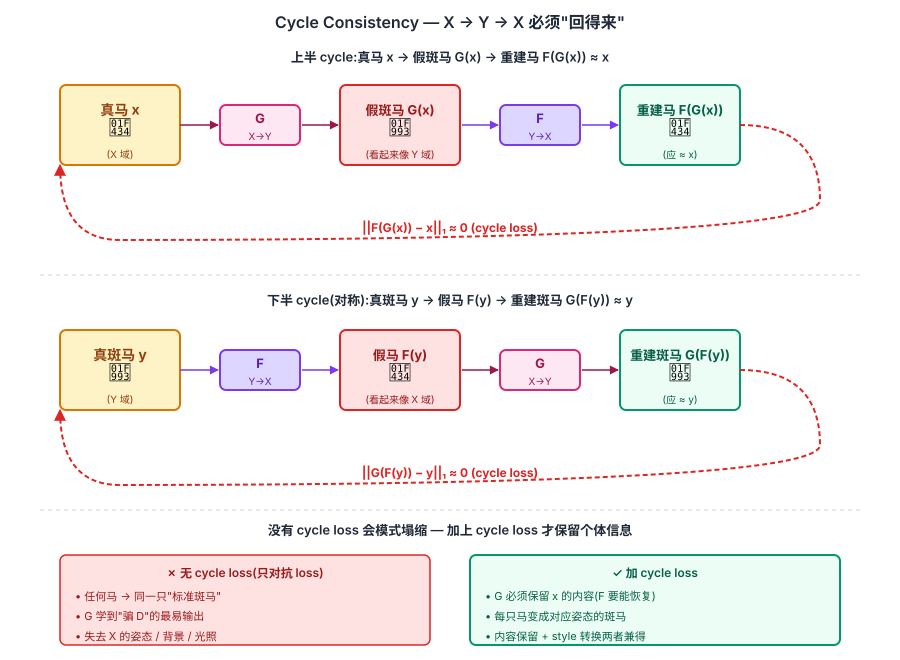
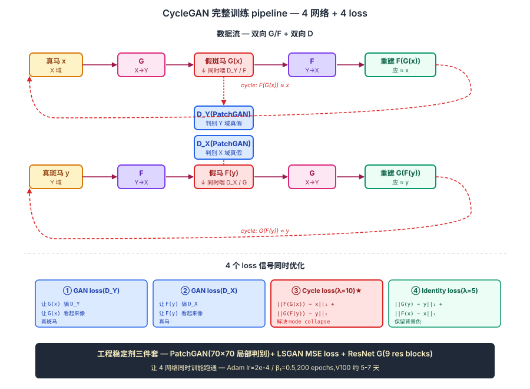

## 前作进展

2016-2017 年图像翻译(image-to-image translation)是 CV 热门方向。代表工作 **pix2pix**(Isola 2017,与 CycleGAN 同组)用 conditional GAN 学 X → Y 的映射:

```
输入:配对数据 {(x_i, y_i)},如(边缘图, 真实照片)
训练:G(x_i) ≈ y_i,D 判别 (x_i, G(x_i)) 是否真实
```

pix2pix 在配对数据上效果惊艳——边缘图变照片、夜景变白天、街景变标注图。但**真实世界很多翻译任务没有配对数据**:

- 马 → 斑马:不存在"同一动物同一姿态"的马和斑马照片
- 莫奈画风 → 真实照片:莫奈画的是想象场景,没有对应真实照片
- 夏季 → 冬季:同一地点同一角度的夏冬照片极难收集

如果只用单边 GAN(G: X → Y),会出现**模式塌缩**:G 学到任何 X 都映射到一个"最容易骗 D"的 Y,失去 X 的内容信息。

Zhu 等人(Berkeley + UCB + UC Davis,2017 年 3 月)的 CycleGAN 给出关键洞察:**用"循环一致性"约束 G**。如果 X → Y → X 后能恢复原 X,说明 G 保留了 X 的内容。

CycleGAN 发布后立即引爆社区:

- 马↔斑马、夏↔冬、橙↔苹果、莫奈↔照片等 demo 成 AI 圈热门 GIF
- "把我的自拍变成动漫"成大众想象
- 后续 StarGAN(多域)、MUNIT、UNIT 等延续 cycle consistency 路线

CycleGAN 不是 GAN 训练技术上的突破,而是**应用层的爆发**——它把 GAN 从"实验室生成 MNIST"推到"普通人能玩的艺术工具"。

## 核心思想

### 直觉:用 X → Y → X 的"回得来"约束,绕过配对数据

理解 CycleGAN 真正需要先抓一件事:**pix2pix(2017)证明 conditional GAN 能学 X→Y,但需要严格配对(x_i, y_i)训练数据 — 而真实世界很多翻译任务根本拿不到配对**。马变斑马没有"同一姿态"的成对照、莫奈画风没有对应真实照、夏冬同地同角度的照片极难收集。如果只用单边 GAN(G: X→Y),会**模式塌缩** — G 学到任何 X 都映射到一个"最骗 D"的 Y,失去 X 的内容。Zhu 等人 2017 反问:**为什么不加一个 F: Y→X,然后要求 F(G(x)) ≈ x?如果"回得来",说明 G 保留了 X 的内容**。

三件事必须同时成立才让 CycleGAN 在 2017 年成立:

- **双向 G + 双向 D**(G: X→Y、F: Y→X、D_Y、D_X)— 没有反向 mapping 就没法形成 cycle
- **Cycle consistency L1 loss** — `||F(G(x)) - x||₁` 强迫 G 保留内容信息,这是绕过配对数据的真正核心
- **PatchGAN + LSGAN + ResNet G** — 工程稳定剂三件套,让"4 个网络同时训"在实际工程中能跑通

三件事合起来:CycleGAN 把"无配对图像翻译"从概念变成可工程化的方法。**马↔斑马、夏↔冬、莫奈↔照片** 等 demo 引爆 2017-2018 AI 圈,把 GAN 从"实验室生成 MNIST"推到"普通人能玩的艺术工具"。这一思想后被 StarGAN(多域)/ UNIT / MUNIT / 机器翻译 back-translation 等延续。


*图 1:**上半** X → Y → X 循环 — 真马 x 经 G 变成假斑马 G(x),F 把这个假斑马变回 F(G(x)),要求 ≈ 原 x(L1 loss)。**下半** Y → X → Y 循环对称。**中央 callout** 强调:如果 F 能从 G(x) 恢复原 x,说明 G(x) 保留了 x 的内容信息(姿态/背景/光照)— 这是绕过配对数据的核心。底部对比:没有 cycle loss 时 G 模式塌缩成"任何马都变成同一只标准斑马";加上 cycle loss 后 G 保留个体特征。*

### 机制一:双向 G + 双向 D — 形成 cycle 的结构前提

CycleGAN 同时维护 **两个 generator + 两个 discriminator**:

- $G: X \to Y$(把马变斑马)
- $F: Y \to X$(把斑马变回马)
- $D_Y$:判别图像是否真 Y 域
- $D_X$:判别图像是否真 X 域

对抗 loss 是两个标准 GAN loss 之和(LSGAN 形式):

$$
\mathcal{L}_{\text{GAN}} = \mathcal{L}_{\text{GAN}}(G, D_Y, X, Y) + \mathcal{L}_{\text{GAN}}(F, D_X, Y, X)
$$

对抗 loss 本身只保证"G(x) 看起来像 Y 域、F(y) 看起来像 X 域",**不保证内容保留** — 这就是为什么需要机制二的 cycle loss 配合。单独跑对抗 loss,G 会模式塌缩。

### 机制二:Cycle Consistency L1 Loss — 强迫保留内容

CycleGAN 的核心创新一行公式:

$$
\mathcal{L}_{\text{cyc}}(G, F) = \mathbb{E}_{x \sim X}[\|F(G(x)) - x\|_1] + \mathbb{E}_{y \sim Y}[\|G(F(y)) - y\|_1]
$$

直觉:**如果 G 把马变成斑马,F 把斑马变回去,应该还是原来那只马**(同样的姿态、同样的草地、同样的光照)。这一约束以"内容必须可恢复"的方式,**强迫 G 在改变 style/texture 的同时保留 X 的全部 content**。

总 loss 加权组合:

$$
\mathcal{L} = \mathcal{L}_{\text{GAN}} + \lambda \cdot \mathcal{L}_{\text{cyc}}, \quad \lambda = 10
$$

为什么用 **L1 而非 L2**?L1 给出 sharper 重建(L2 倾向平均化),对图像内容保留更友好。这是借鉴 pix2pix 的经验。

**Identity Loss**(可选,论文实际用):额外加 `||G(y) - y||₁ + ||F(x) - x||₁`,要求"输入已经是目标域时输出原样"。防止 G 在马→斑马时同时改变背景色,保留风格。

### 机制三:PatchGAN + LSGAN + ResNet G — 让 4 网络同时训能跑通

CycleGAN 同时训 4 个网络(G/F/D_X/D_Y),工程复杂度高,需要一组稳定剂:

- **PatchGAN Discriminator** — 不是整图判别,而是 70×70 局部判别。D 只判断"每个 patch 看起来像不像真",输出一个 patch grid 而非单个 scalar。**减少 D 参数 + 加快训练 + 提升纹理细节**
- **LSGAN loss** — 用 MSE 替代原 GAN 的 BCE 作对抗 loss。BCE 在 D 强 G 弱时梯度饱和,LSGAN 用 squared loss 让梯度永远有意义。这是 2017 年 GAN 稳定化的常见 trick
- **ResNet Generator** — G 用 ResNet-based(9 个 residual blocks),不用 DCGAN 的纯 deconv。residual 让生成器学到"在输入上叠加修改"而不是"从零重建",对图像翻译这类"局部修改"任务更适合

四个网络的训练用一个共享 Adam optimizer 训 G + F、两个独立 optimizer 训 D_X / D_Y,lr=2e-4 / β₁=0.5(DCGAN 经验)。训练 200 epochs,单卡 V100 约 5-7 天。

### 三件套协同:双向 G/D + cycle loss + 工程稳定剂 缺一不可

CycleGAN 在 2017 年能引爆 GAN 应用层,**不是单一改进**,而是三件套同时调到协同点 —— 任何一个抽掉 CycleGAN 都不成立,这一点和 [ResNet](../01-cnn/05-resnet.md) 的 `shortcut + BN + He 初始化` 协同关系一致:

- **只有双向 G/D,没有 cycle loss** — 退化成"两个独立的单边 GAN",G 模式塌缩(所有马 → 一只标准斑马),失去内容保留能力,完全失败
- **只有 cycle loss + 单边 G(X→Y)** — 没有 F: Y→X,F(G(x)) 无定义,cycle 公式无法成立,核心 loss 项空缺
- **只有双向 G/D + cycle loss,没有工程稳定剂** — 4 个网络用原 GAN BCE + 整图 D + 纯 deconv G,训练崩(BCE 梯度饱和、整图 D 参数爆、deconv G 学不到 identity-like 修改),即使理论成立也跑不出 paper 里的效果

三件套合起来才让 CycleGAN 成为"无配对图像翻译"第一个可工程复现的方法。也正是因为三件套的耦合,后续 CycleGAN 变体的演化方向都是"在保留这三件的前提下扩展功能"—— StarGAN 用一个 G 处理多域,UNIT/MUNIT 加入 shared latent,CUT 用 contrastive loss 替代 cycle loss 等。


*图 2:CycleGAN 4 网络 + 4 loss 完整训练图。**上半** 数据流:马 x → G → 假斑马 → F → 重建马 / 真斑马 y → F → 假马 → G → 重建斑马。**下半** 4 个 loss 信号:① D_Y adversarial(让 G(x) 骗 D_Y)② D_X adversarial(让 F(y) 骗 D_X)③ cycle loss F(G(x))≈x + G(F(y))≈y ④ identity loss G(y)≈y + F(x)≈x。底部三栏对比:**无 cycle loss**(mode collapse,所有马变同一斑马)/ **加 cycle loss**(保留个体)/ **加 cycle + identity**(还保留背景色) — 每加一项 loss 解决一类失效模式。*

## 关键代码

简化版 CycleGAN 训练循环:

```python
import torch
import torch.nn as nn
import itertools

# G_xy: X → Y,F_yx: Y → X
G_xy = ResNetGenerator().cuda()
F_yx = ResNetGenerator().cuda()
D_x = PatchGAN().cuda()
D_y = PatchGAN().cuda()

opt_G = torch.optim.Adam(
    itertools.chain(G_xy.parameters(), F_yx.parameters()),
    lr=2e-4, betas=(0.5, 0.999)
)
opt_Dx = torch.optim.Adam(D_x.parameters(), lr=2e-4, betas=(0.5, 0.999))
opt_Dy = torch.optim.Adam(D_y.parameters(), lr=2e-4, betas=(0.5, 0.999))

mse_loss = nn.MSELoss()
l1_loss = nn.L1Loss()
lambda_cyc = 10.0
lambda_idt = 5.0

for epoch in range(200):
    for x, y in zip(loader_X, loader_Y):  # 无配对
        x, y = x.cuda(), y.cuda()

        # ===== 训 G =====
        opt_G.zero_grad()
        # adversarial
        fake_y = G_xy(x)
        fake_x = F_yx(y)
        adv_loss = mse_loss(D_y(fake_y), torch.ones_like(D_y(fake_y))) \
                 + mse_loss(D_x(fake_x), torch.ones_like(D_x(fake_x)))
        # cycle
        cyc_x = F_yx(fake_y)
        cyc_y = G_xy(fake_x)
        cyc_loss = l1_loss(cyc_x, x) + l1_loss(cyc_y, y)
        # identity
        idt_y = G_xy(y)  # y 已经是 Y 域,G_xy 应原样输出
        idt_x = F_yx(x)
        idt_loss = l1_loss(idt_y, y) + l1_loss(idt_x, x)

        g_loss = adv_loss + lambda_cyc * cyc_loss + lambda_idt * idt_loss
        g_loss.backward()
        opt_G.step()

        # ===== 训 D_Y =====
        opt_Dy.zero_grad()
        d_loss_y = mse_loss(D_y(y), torch.ones_like(D_y(y))) \
                 + mse_loss(D_y(fake_y.detach()), torch.zeros_like(D_y(fake_y)))
        d_loss_y *= 0.5
        d_loss_y.backward()
        opt_Dy.step()

        # ===== 训 D_X =====
        opt_Dx.zero_grad()
        d_loss_x = mse_loss(D_x(x), torch.ones_like(D_x(x))) \
                 + mse_loss(D_x(fake_x.detach()), torch.zeros_like(D_x(fake_x)))
        d_loss_x *= 0.5
        d_loss_x.backward()
        opt_Dx.step()
```

注意 CycleGAN 用 **LSGAN loss**(MSE 替代 BCE)而非原 GAN 的 BCE。这是 2017 年的 trick,让 GAN 训练更稳定。

## 性能数据

CycleGAN 主要是定性结果突出。论文里几个标志性任务:

### 1. 马 ↔ 斑马

ImageNet 上马和斑马各 ~1000 张图,无配对。CycleGAN 训完后:

- 给一张马的照片,输出几乎完美的斑马(保留姿态、背景、光照)
- 反向也 work

### 2. 风景照 ↔ 莫奈 / 梵高 / 塞尚画风

- 莫奈画(1074 张)+ Flickr 风景照(6287 张),无配对
- 训完后照片能转成各画家风格,保留构图但改变笔触 / 色调

### 3. 夏 ↔ 冬(优胜美地照片)

- 同一国家公园不同季节照片,无配对
- 把绿草夏景变成雪覆冬景,保留地形和构图

### 4. 苹果 ↔ 橙子、橘子 ↔ 桃子等

- 简单形状的水果在外观上互转
- 但**几何形状变化时失败** ——CycleGAN 改不了 shape,只能改 texture / color

### 定量评估(Cityscapes labels↔photos)

| Method | per-pixel acc | per-class acc | class IoU |
|------|------|------|------|
| pix2pix(配对监督) | 0.71 | 0.25 | 0.18 |
| CoGAN(无配对) | 0.40 | 0.10 | 0.06 |
| **CycleGAN**(无配对) | **0.52** | **0.17** | **0.11** |

CycleGAN 在无配对数据上接近 pix2pix(配对监督)的一半,远超之前的无配对方法。

### Human Perceptual Study(AMT 真假判别)

让 25 个 AMT 用户判断"哪个是真照片,哪个是 CycleGAN 生成":

- 在 maps→aerial 任务上,**26% 用户被骗**(随机猜 50%)
- 在街景→labels 任务上,**23% 被骗**

数字看起来不高,但考虑 2017 年的技术水平,这是震撼的——人类无法可靠分辨 CycleGAN 输出与真实图像。

## 影响 / 后续

CycleGAN 在 GAN 历史的位置:**GAN 应用层的爆发,把 GAN 从实验室带到大众视野**。

**1. 无配对学习成新范式** —— CycleGAN 之前 image translation 必须要配对数据,之后 unpaired translation 成主流。后续 StarGAN(2018,多域翻译)、UNIT、MUNIT(disentangled)、DRIT 等都基于 cycle consistency 思想

**2. 文化影响巨大** —— CycleGAN 的"马变斑马"是 AI 圈 2017-2018 年最病毒式 demo。被引用、被模仿、被改编无数次。CycleGAN 是少数让"普通人也理解 GAN 在做什么"的工作

**3. 启发后续艺术 GAN 工具** —— PaintsChainer、StyleTransfer App、Prisma 等大众艺术 AI 工具都受 CycleGAN 启发

**4. Cycle consistency 思想扩散到其他领域** —— 机器翻译里的 back-translation、语音转换、视频生成等都用 cycle consistency 增强训练

**5. PatchGAN 成 GAN 标配** —— CycleGAN 的 PatchGAN discriminator(局部判别)成为后续 GAN 默认设计(StyleGAN、Pix2PixHD 都用)

**6. Phillip Isola / Alexei Efros 等成视觉 GAN 代表人物** —— Isola 现任 MIT 教授,Efros 是 Berkeley 教授,两人在 CycleGAN 之后继续做 GAN / image synthesis,影响整个 CV 生成方向

CycleGAN 留下的开放问题:

- **几何形状变化失败** —— CycleGAN 只能改 texture,改不了形状(猫↔狗失败)→ U-GAT-IT、Multimodal CycleGAN 部分解决
- **训练慢** —— 4 个网络同时训,内存和算力消耗大 → Lite 版本如 CycleGAN-Turbo
- **质量上限** —— 256×256 以上质量下降明显 → Pix2PixHD、SPADE
- **同语义内容失真** —— 偶尔出现"马变斑马时丢掉腿"等内容失真 → Contrastive Unpaired Translation (CUT)
- **Diffusion 时代部分被取代** —— [Stable Diffusion + ControlNet](../10-diffusion/02-ldm.md) 后能做更精细的图像翻译,但 CycleGAN 在计算成本上仍有优势

→ [04-stylegan.md](04-stylegan.md) · GAN 质量巅峰,与 CycleGAN 并列 GAN 后期代表
→ [02-dcgan.md](02-dcgan.md) · 父技术,CycleGAN 的 G/D 基于 DCGAN-style CNN
→ [01-gan.md](01-gan.md) · 数学起源,CycleGAN 加 cycle 约束扩展 GAN 应用
→ [../10-diffusion/](../10-diffusion/) · Diffusion 时代部分取代 CycleGAN
→ [../09-multimodal-clip/](../09-multimodal-clip/) · CLIP + Diffusion 让 text-guided translation 成为现代主流
