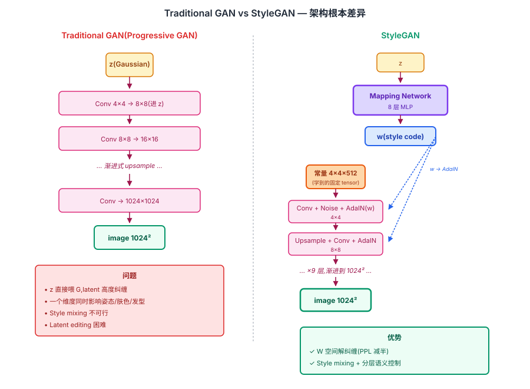
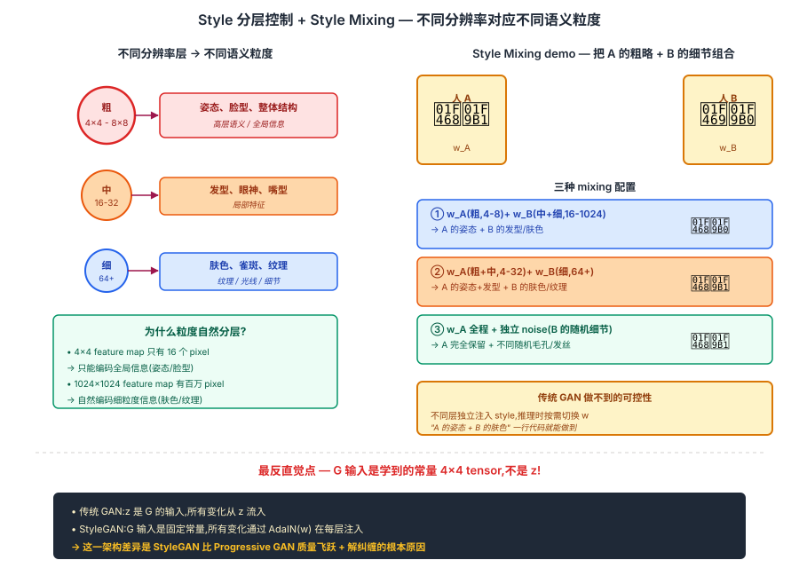

## 前作进展

2017 年底,GAN 质量演化到一个关键节点:

- **DCGAN**(2015)64×64 卧室 / 人脸,生成质量初步可信
- **WGAN / Improved GAN**(2017)训练稳定性大幅改进
- **Progressive GAN**(Karras 2017,与 StyleGAN 同作者)第一次做到 **1024×1024 高分辨率人脸**——通过"渐进式从低到高分辨率训练"的工程方案

Progressive GAN 是 StyleGAN 直接前作,但有几个根本局限:

**1. 风格不可控** —— 输入 z 给 G,出来什么图全靠 G 内部决定,没法独立控制"姿态"、"发型"、"肤色"等不同属性

**2. Latent 空间高度纠缠** —— z 的一个维度同时影响多个语义属性,做 latent space editing 困难

**3. 缺少 style mixing** —— 不能"把 A 的姿态 + B 的发型"组合生成新人脸

NVIDIA 的 Karras 等人(2018 年 12 月)从一个完全不同的角度重新设计 G——**借鉴 neural style transfer 的思路,把 generation 变成"用 style 控制内容"的过程**。这就是 StyleGAN。

StyleGAN 发布后产生了 2018-2020 GAN 圈最大的文化影响:

- **"This Person Does Not Exist"**(2019.2,Wang 用 StyleGAN 做的网站)每次刷新生成一张真实感人脸,病毒式传播,把 GAN 推到主流媒体视野
- **Deepfake 技术升级** —— StyleGAN 让 face swap / synthesis 质量飞跃,引发媒体对 AI 伪造的广泛讨论
- **艺术圈震撼** —— 苏富比 2018 年拍卖第一幅 GAN 艺术品 Edmond de Belamy(43 万美元),其中部分技术受 StyleGAN 影响

后续 **StyleGAN2**(2019)、**StyleGAN3**(2021)继续改进,StyleGAN 系列成为 GAN 时代的巅峰代表。

## 核心思想

### 直觉:把 generation 重设计为"用 style 控制 content",粒度自然分层

理解 StyleGAN 真正需要先抓一件事:**Progressive GAN 已经做到 1024×1024 高分辨率人脸,但 z 直接喂 G 让 latent 高度纠缠** — z 的一个维度同时影响姿态/发型/肤色等多个属性,无法独立控制;style mixing 不可行;latent editing 困难。Karras 等人 2018 反问:**为什么不借鉴 neural style transfer 的思路,把 generation 重构成"用 style 在每层注入控制内容"?如果每层 style 控制不同分辨率,就自然得到"粗(姿态)/ 中(发型)/ 细(肤色)"的分层控制**。

三件事必须同时成立才让 StyleGAN 在 2018 年成立:

- **Mapping Network 把 z 解纠缠成 w** — 8 层 MLP 把 Gaussian z 投射到 W 空间,让维度自然 disentangle(因为真实数据分布不是 Gaussian)
- **AdaIN 在每层注入 style** — 每个 Conv layer 后用 AdaIN(w 控制 feature 的均值方差),style 改变外观不改变空间结构
- **分层 style + Noise + Constant 输入** — 不同分辨率层 = 不同语义粒度;独立 noise 输入控制随机细节(头发走向 / 毛孔);G 输入是学到的常量 4×4 而非 z,所有变化通过 style 注入

三件事合起来:**StyleGAN 在 FFHQ 上 FID 4.40**(vs Progressive GAN 8.04),1024×1024 人脸质量逼近真实照片。"This Person Does Not Exist" 网站 2019 年单月 100M+ 访问,把 GAN 推到主流媒体视野。后续 StyleGAN2 / 3 继续改进,成为 2018-2022 GAN 主导架构。


*图 1:**左 传统 GAN** — z 直接喂 G,经 conv 栈生成图像。z 的每个维度同时控制多个属性(姿态 + 肤色 + 发型),latent 纠缠。**右 StyleGAN** — z 经 8 层 mapping MLP 变成 w → w 经 AdaIN 在每层注入 style → G 的输入是学到的常量 4×4 → 各层加独立 noise → 1024² 输出。关键反直觉点:**G 的输入是常量,不是 z;z 只决定 w,w 通过 AdaIN 注入每一层**。底部 callout:这一架构差异是 StyleGAN 比 Progressive GAN 质量飞跃的根本原因。*

### 机制一:Mapping Network — 把 z 投射到解纠缠的 W 空间

StyleGAN 加一个 **8 层 MLP** 把 latent z 映射到中间 latent w:

$$
w = f_{\text{MLP}}(z), \quad z \in \mathbb{R}^{512}, w \in \mathbb{R}^{512}
$$

**为什么需要 mapping?** 因为 z 服从 Gaussian 分布,而真实数据(人脸)的隐含分布**不是 Gaussian** — 它有"年轻人多 / 老人少"、"白人多 / 黑人少"等不均衡。把 z 直接喂 G,G 必须学一个"扭曲的映射"把 Gaussian 强制对齐到真实分布,这一扭曲让 latent 各维度耦合。

加 8 层 MLP 后,**z → w 这一步把扭曲吸收了** — w 空间不再要求是 Gaussian,可以自然贴合真实数据形状,让每个维度对应一个相对独立的语义属性。

StyleGAN 论文用 **Perceptual Path Length(PPL)** 指标实证 W 比 Z 更"线性":Z 空间 PPL=412.0,W 空间 PPL=228.9,**W 的解纠缠度是 Z 的两倍**。这是 W 空间能做精细 latent editing 的根本。

### 机制二:AdaIN — 用 style 控制每层 feature 的统计量

StyleGAN 在每个 Conv layer 后用 AdaIN(Adaptive Instance Normalization)注入 w:

$$
\text{AdaIN}(x_i, w) = y_{s,i} \cdot \frac{x_i - \mu(x_i)}{\sigma(x_i)} + y_{b,i}
$$

其中 (y_s, y_b) = affine(w) 是 w 通过 learned linear 得到的 scale 和 bias。

工作机制两步:
1. **Instance Normalize** — 把 feature map 归一化到零均值单位方差,"擦掉"原本的统计信息
2. **重新 rescale** — 用 style 的 (s, b) 重新调制,把新 style 写入

**AdaIN 的妙处**:style 改变 feature 的**统计量**(均值 / 方差),等于改变图像的**整体外观**(颜色 / 纹理 / 风格)但**不改变空间结构**(图像里物体的位置 / 形状)。这就是为什么"换 style 不换姿态"成为可能。

AdaIN 借自 neural style transfer(Huang 2017),但 StyleGAN 把它推到 GAN generator 里、且对每层用不同的 w 注入,这是它的关键创新。

### 机制三:分层 Style + Noise + Constant 输入 — 自然得到粒度分层

StyleGAN 的 G **不接收 z 作为输入**,而是从一个**学到的常量 4×4×512 tensor** 起步。所有变化通过 style w 在每层 AdaIN 注入。

**不同分辨率层注入的 style 控制不同语义粒度** — 这是 StyleGAN 最具洞察力的实证发现:

| Layer 分辨率 | 控制粒度 | 例子 |
|------|------|------|
| 4×4 - 8×8 | **粗** | 姿态、脸型、整体结构 |
| 16×16 - 32×32 | **中** | 发型、眼神、嘴型 |
| 64×64 - 1024×1024 | **细** | 肤色、雀斑、毛发纹理、光线 |

**Style Mixing** — 训练时随机把 w₁(前 N 层用)和 w₂(后续层用)拼起来,让网络学到"不同层 style 独立"。推理时可以:`w_A(前 4 层:姿态) + w_B(后续层:肤色) = 人 A 姿态 + 人 B 肤色`。

**Per-pixel Noise Input** — 每层额外加 noise:`x' = x + learned_scale · noise`。直觉:头发具体走向、皮肤毛孔分布、痘痘位置等"stochastic detail"应该独立于 style,从 noise 直接产生而非压缩到 z 里。这让 G 学得更精细。

### 三件套协同:Mapping + AdaIN + 分层 style 缺一不可

StyleGAN 在 2018 年能让 GAN 质量和可控性同时跃升,**不是单一改进**,而是三件套同时调到协同点 —— 任何一个抽掉 StyleGAN 都不成立,这一点和 [ResNet](../01-cnn/05-resnet.md) 的 `shortcut + BN + He 初始化` 协同关系一致:

- **只有 AdaIN + 分层 style,没有 mapping(直接用 z)** — z 是 Gaussian,直接做 AdaIN 注入仍然纠缠,style mixing 失败,latent editing 困难,**Progressive GAN 的本质问题没解决**
- **只有 mapping + 分层,没有 AdaIN(用普通拼接 / 加法注入 w)** — w 无法稳定控制 feature 统计量,"换 style 不换姿态"做不到,粗/中/细分层失效
- **只有 mapping + AdaIN,没有分层 style 注入(只在一层用 w)** — 失去"不同分辨率对应不同粒度"的自然性质,style mixing 不成立,latent editing 退化成 traditional GAN 水平

三件套合起来才让 StyleGAN 在 2018 年同时拿到 SOTA 质量(FFHQ FID 4.40) + 自然可控性(W 空间 PPL 减半) + 风格组合能力(style mixing)。这一架构后被 StyleGAN2 / 3 持续打磨,**至今(2024)在人脸生成最高质量上仍是 SOTA,即使 Diffusion 在通用文生图上取代了 GAN**。


*图 2:**左** StyleGAN 各层分辨率对应的语义粒度图解 — 4×4 / 8×8 控制姿态、脸型(粗);16-32 控制发型、眼神(中);64×64+ 控制肤色、纹理、光线(细)。每层一个圆圈,大小表示对应的语义粒度。**右** Style Mixing demo — 人 A 的 w 注入前 4 层(姿态)+ 人 B 的 w 注入后续层(肤色)→ 生成"A 姿态 + B 肤色"的新人脸,展示三种 mixing 配置。底部 callout:**G 输入是学到的常量 4×4 tensor,不是 z** — 所有变化通过 style 注入,这是 StyleGAN 与传统 GAN 的根本架构差异。*

## 关键代码

StyleGAN G 简化版(伪代码):

```python
import torch
import torch.nn as nn

class MappingNetwork(nn.Module):
    """z (512) → w (512),8 层 MLP."""
    def __init__(self, z_dim=512, w_dim=512, num_layers=8):
        super().__init__()
        layers = []
        for _ in range(num_layers):
            layers += [nn.Linear(z_dim, w_dim), nn.LeakyReLU(0.2)]
        self.net = nn.Sequential(*layers)

    def forward(self, z):
        z = z / (z.norm(dim=-1, keepdim=True) + 1e-8)  # normalize z
        return self.net(z)


class AdaIN(nn.Module):
    def __init__(self, w_dim, channels):
        super().__init__()
        self.affine = nn.Linear(w_dim, 2 * channels)

    def forward(self, x, w):
        style = self.affine(w)
        scale, bias = style.chunk(2, dim=1)
        scale = scale.unsqueeze(2).unsqueeze(3)  # (B, C, 1, 1)
        bias = bias.unsqueeze(2).unsqueeze(3)
        # instance normalize
        x = (x - x.mean([2, 3], keepdim=True)) / (x.std([2, 3], keepdim=True) + 1e-8)
        return scale * x + bias


class StyleBlock(nn.Module):
    """一个 style block:Conv → +Noise → AdaIN."""
    def __init__(self, in_ch, out_ch, w_dim, up=False):
        super().__init__()
        self.up = up
        self.conv = nn.Conv2d(in_ch, out_ch, 3, padding=1)
        self.noise_scale = nn.Parameter(torch.zeros(1, out_ch, 1, 1))
        self.adain = AdaIN(w_dim, out_ch)

    def forward(self, x, w):
        if self.up:
            x = nn.functional.interpolate(x, scale_factor=2, mode="bilinear")
        x = self.conv(x)
        # 加 noise
        noise = torch.randn(x.size(0), 1, x.size(2), x.size(3), device=x.device)
        x = x + self.noise_scale * noise
        # AdaIN
        return self.adain(x, w)


class StyleGAN_Generator(nn.Module):
    def __init__(self, w_dim=512):
        super().__init__()
        self.mapping = MappingNetwork(512, w_dim)
        # 学到的常量输入
        self.const = nn.Parameter(torch.randn(1, 512, 4, 4))
        # 各分辨率 style block(简化:只列几层)
        self.blocks = nn.ModuleList([
            StyleBlock(512, 512, w_dim, up=False),  # 4×4
            StyleBlock(512, 512, w_dim, up=True),   # 8×8
            StyleBlock(512, 512, w_dim, up=True),   # 16×16
            StyleBlock(512, 256, w_dim, up=True),   # 32×32
            StyleBlock(256, 128, w_dim, up=True),   # 64×64
            StyleBlock(128, 64, w_dim, up=True),    # 128×128
            StyleBlock(64, 32, w_dim, up=True),     # 256×256
            StyleBlock(32, 16, w_dim, up=True),     # 512×512
            StyleBlock(16, 3, w_dim, up=True),      # 1024×1024
        ])

    def forward(self, z, style_mix_z=None, mix_layer=None):
        w = self.mapping(z)
        w_main = w
        w_mix = self.mapping(style_mix_z) if style_mix_z is not None else None

        x = self.const.expand(z.size(0), -1, -1, -1)
        for i, block in enumerate(self.blocks):
            # Style mixing: 在 mix_layer 之后切换到 w_mix
            cur_w = w_mix if (w_mix is not None and i >= mix_layer) else w_main
            x = block(x, cur_w)
        return x  # 1024×1024 image
```

实际 StyleGAN 实现(NVIDIA 官方 PyTorch)还有 equalized learning rate、weight modulation 等细节,代码量 1000+ 行。

## 性能数据

StyleGAN 在主流人脸生成 benchmark 上的成绩:

### 1. FFHQ(Flickr-Faces-HQ,Karras 同作者发布)

| Model | FID ↓(越低越好) |
|------|------|
| Progressive GAN | 8.04 |
| **StyleGAN** | **4.40** |
| StyleGAN2(2019)| 2.84 |

FID 从 8.04 降到 4.40 是质量上的明显跃迁。

### 2. CelebA-HQ

| Model | FID ↓ |
|------|------|
| Progressive GAN | 7.32 |
| **StyleGAN** | **5.06** |

### 3. LSUN Bedroom / Car / Cat

CelebA-HQ 主要是脸,LSUN 多类:

| Class | Progressive GAN | StyleGAN |
|------|------|------|
| Bedroom | 8.34 | **2.65** |
| Car | 12.99 | **5.07** |
| Cat | 37.52 | **8.53** |

LSUN-Cat 上 FID 从 37 降到 8.5——StyleGAN 在不规则形状(猫的姿态多样)上提升尤其显著,说明 style-based 结构对复杂分布更友好。

### 4. Disentanglement Metric(Perceptual Path Length)

StyleGAN 论文提出 PPL 指标衡量 latent 空间的"光滑度"(线性 interpolation 是否产生平滑过渡):

| Latent space | PPL(full) | PPL(end) |
|------|------|------|
| Z(传统 GAN) | 412.0 | 415.3 |
| **W(StyleGAN)** | **228.9** | **200.5** |

W 空间的 PPL 是 Z 的一半,证明 W 更"线性"(更适合做 latent editing)。

### 5. 文化影响 demos

- **This Person Does Not Exist** —— 病毒式传播,2019 年 2 月单月 100M+ 访问
- **GAN 艺术品拍卖** —— 苏富比、佳士得等开始拍卖 GAN 生成艺术
- **Deepfake 升级** —— FaceApp、Deepfake App 等大众产品质量飞跃

## 影响 / 后续

StyleGAN 在 GAN 历史的位置:**GAN 质量与可控性的巅峰,后续 StyleGAN2 / 3 成为 2018-2022 GAN 主导架构**。

**1. Style-based generator 成主流** —— StyleGAN 之后几乎所有 GAN 工作都用 mapping network + AdaIN 结构。BigGAN、AnyCostGAN、Alias-Free GAN 等都基于这个范式

**2. Latent Space Editing 兴起** —— StyleGAN 的 W 空间可控性催生大量 latent editing 工作:GANSpace、StyleSpace、InterFaceGAN、StyleCLIP 等。"在 latent 空间里走一步改变年龄/性别/表情"成研究热点

**3. StyleGAN2 / 3 持续改进** —— StyleGAN2(2019)去掉 AdaIN 用 weight modulation,fix"水滴"伪影;StyleGAN3(2021)解决 alias 问题让动画时图像稳定。Karras 团队的 StyleGAN 系列是 GAN 工程化的最高水准

**4. 文化与伦理影响** —— Deepfake、伪造身份、AI 艺术等社会议题在 StyleGAN 推动下进入主流讨论。许多国家开始立法 deepfake

**5. 直接催生应用** —— Artbreeder、This Person Does Not Exist、各种 face aging / face swap app 都基于 StyleGAN

**6. 启发 Diffusion 的可控性研究** —— StyleGAN 的 W 空间编辑思想启发了 Diffusion 时代的 prompt editing、ControlNet、IP-Adapter 等控制方法

**7. GAN 时代的"终点"** —— StyleGAN3 之后,2022 年 Stable Diffusion 横空出世,Diffusion 在文生图任务上质量超过 GAN。但在**人脸生成的最高质量**上,StyleGAN 仍是 SOTA(2024 年 FFHQ FID 上 StyleGAN3 仍领先大多数 Diffusion 模型)

StyleGAN 留下的开放问题:

- **训练成本高** —— StyleGAN 训 FFHQ 需要 8× V100 × 一周。StyleGAN-XL(2022)继续推大但成本爆炸
- **泛化到非人脸数据** —— StyleGAN 在结构化数据(人脸、车)上效果好,但在自然场景上不如 Diffusion 通用
- **Text-conditioned 困难** —— StyleGAN 自己难做 text-to-image,后来 StyleGAN-T(2023)结合 CLIP 才部分解决
- **被 Diffusion 取代主流地位** —— Stable Diffusion / DALL-E / Midjourney 等成为今天图像生成主流,GAN 退守到特定 niche(超分、风格迁移、实时生成)

→ [03-cyclegan.md](03-cyclegan.md) · 兄弟工作,GAN 后期两大代表(StyleGAN 质量 / CycleGAN 应用)
→ [02-dcgan.md](02-dcgan.md) · GAN 工程化基础
→ [01-gan.md](01-gan.md) · 数学起源
→ [../10-diffusion/](../10-diffusion/) · 后继生成模型路线,部分取代 GAN
→ [../09-multimodal-clip/](../09-multimodal-clip/) · CLIP + Diffusion 成为现代文生图主流
→ [../08-vit/04-dit.md](../08-vit/04-dit.md) · Diffusion Transformer 是生成模型最新方向
