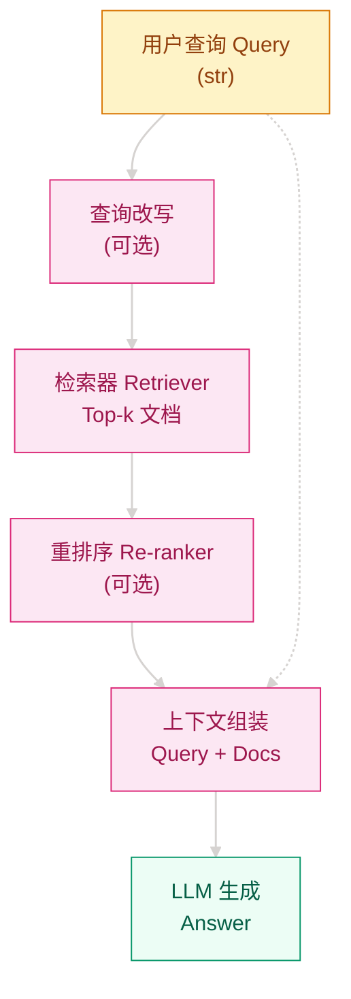

# 为什么让 LLM 直接硬答知识类问题总是出错？—— RAG 与检索增强生成

## 这个问题从哪来

> 2020 年，Lewis 等人在 Facebook AI 提出 RAG（Retrieval-Augmented Generation）。当时 GPT-3 虽然能生成流畅文本，但面对需要精确事实的问题时经常"自信地胡说"——模型没有外部知识库，全靠参数记忆，训练数据有截止日期，专业领域知识更是匮乏。
>
> RAG 的核心思路是：让模型在生成回答之前，先从外部知识库中检索相关文档，把检索结果作为上下文喂给生成模型，从而把"纯靠记忆"变成"先查资料再回答"。

## 学习目标

完成本章后，你应能回答：

1. RAG 与 Fine-tuning 在什么场景下应如何选择？
2. Naive RAG、Advanced RAG、Modular RAG 的演进逻辑是什么？
3. 如何评估并优化一个 RAG 系统的检索质量？

---

## 1. 直觉

想象一个闭卷考试的学生和一个开卷考试的学生。LLM 纯生成就像闭卷考试——只能靠脑子里记住的东西回答，记错了就答错了。RAG 就像允许带参考资料的开卷考试：先翻书找到相关章节，再基于找到的内容组织答案。翻书这个动作（检索）不替学生思考，但大大降低了"记错"和"根本不知道"的概率。

关键区别还不止于此。闭卷学生即使答错也充满自信；开卷学生至少能指着资料说"根据第几页"，答错了也有据可查。

> 你要记住：RAG 不是给 LLM 灌输新知识，而是给 LLM 配一副"眼镜"——让它在回答前先看清相关事实。

---

## 2. 机制

### 2.1 核心架构

RAG 系统由两个核心组件构成：**检索器**（Retriever）负责从知识库中找到相关文档，**生成器**（Generator）基于检索到的文档生成最终回答。

```
传统 LLM:  Query → LLM → Answer
RAG:       Query → Retriever → [Docs] → LLM → Answer
                ↑_________________________↓
                      (增强上下文)
```

### 2.2 检索评分的两种范式

**双编码器（Bi-Encoder）**：查询和文档分别独立编码为向量，通过余弦相似度评分。

$$
\mathbf{e}_q = f_\theta(q), \quad \mathbf{e}_d = f_\theta(d), \quad s(q, d) = \frac{\mathbf{e}_q \cdot \mathbf{e}_d}{\|\mathbf{e}_q\| \|\mathbf{e}_d\|}
$$

优点：文档向量可预计算，检索极快。缺点：查询和文档没有细粒度交互。

**交叉编码器（Cross-Encoder）**：把查询和文档拼接后一起送进模型，输出相关性分数。

$$
s(q, d) = f_\theta([q; d])
$$

优点：能捕捉细粒度语义交互，精度高。缺点：无法预计算，每次都要过一遍模型，速度慢。

### 2.3 计算流图



### 2.4 渐进式实现

**Step 1 · 最小 RAG（理解检索 + 生成流程）**

```python
# 解决什么问题：建立"先检索、后生成"的最小闭环
# 验证向量相似度能否把相关文档排到前面
# 依赖: numpy, sentence-transformers (或 mock)
import numpy as np


def cosine_similarity(a, b):
    return np.dot(a, b) / (np.linalg.norm(a) * np.linalg.norm(b) + 1e-9)


class NaiveRAG:
    def __init__(self, documents, embed_fn):
        self.docs = documents
        self.embed_fn = embed_fn
        # 预计算所有文档向量
        self.doc_vectors = [self.embed_fn(d) for d in documents]

    def retrieve(self, query, k=3):
        q_vec = self.embed_fn(query)
        scores = [cosine_similarity(q_vec, d_vec) for d_vec in self.doc_vectors]
        top_k = np.argsort(scores)[::-1][:k]
        return [(i, scores[i]) for i in top_k]

    def answer(self, query, k=3):
        retrieved = self.retrieve(query, k)
        context = "\n".join([self.docs[i] for i, _ in retrieved])
        # 实际系统中这里调用 LLM；最小实现只返回上下文
        return {"query": query, "context": context, "sources": retrieved}
```

**Step 2 · 加入混合检索（关键词 + 语义互补）**

```python
# 解决什么问题：纯向量检索对精确术语匹配弱，纯关键词检索对语义同义词弱
# 用加权融合让两者互补
# 依赖: numpy, rank_bm25 (或简化实现)
import numpy as np


class HybridRetriever:
    def __init__(self, documents, embed_fn, alpha=0.5):
        self.docs = documents
        self.embed_fn = embed_fn
        self.alpha = alpha
        self.doc_vectors = [self.embed_fn(d) for d in documents]
        # 简化 BM25：用词频做 proxy
        self.term_freq = [set(d.lower().split()) for d in documents]

    def bm25_score(self, query, idx):
        terms = set(query.lower().split())
        return len(terms & self.term_freq[idx]) / max(len(terms), 1)

    def dense_score(self, query, idx):
        q_vec = self.embed_fn(query)
        return cosine_similarity(q_vec, self.doc_vectors[idx])

    def retrieve(self, query, k=3):
        scores = []
        for i in range(len(self.docs)):
            s = self.alpha * self.bm25_score(query, i) + (1 - self.alpha) * self.dense_score(query, i)
            scores.append((i, s))
        scores.sort(key=lambda x: x[1], reverse=True)
        return scores[:k]
```

**Step 3 · 加入重排序与上下文压缩（精度优先）**

```python
# 解决什么问题：召回的 Top-k 不一定按真正相关度排序；上下文太长会挤占生成预算
# 用交叉编码器重排 + 按相关性截断上下文
class RerankRAG:
    def __init__(self, retriever, cross_encoder, max_ctx_tokens=2000):
        self.retriever = retriever
        self.cross_encoder = cross_encoder  # 输入 (query, doc) → score
        self.max_ctx = max_ctx_tokens

    def retrieve(self, query, k=10, rerank_top=3):
        # 第一阶段：召回更多候选
        candidates = self.retriever.retrieve(query, k=k)
        # 第二阶段：交叉编码器重排
        scored = [(i, self.cross_encoder(query, self.retriever.docs[i])) for i, _ in candidates]
        scored.sort(key=lambda x: x[1], reverse=True)
        return scored[:rerank_top]

    def build_context(self, query, retrieved):
        # 按相关性累加文档，直到接近窗口上限
        context = []
        tokens = 0
        for i, _ in retrieved:
            doc = self.retriever.docs[i]
            # 简化：用字符数 proxy token 数
            if tokens + len(doc) > self.max_ctx:
                break
            context.append(doc)
            tokens += len(doc)
        return "\n".join(context)
```

**Step 4 · 生产级评估与多跳检索**

```python
# 解决什么问题：没有评估就不知道怎么优化；复杂问题需要多次检索才能凑齐证据
# 生产级：Recall/Precision/NDCG + 多跳检索链路
class MultiHopRAG:
    def __init__(self, retriever, max_hops=2):
        self.retriever = retriever
        self.max_hops = max_hops

    def rewrite_query(self, original, context_docs):
        # 简化：实际应用使用 LLM 重写查询
        return original + " " + " ".join(context_docs[:1])

    def retrieve_multi_hop(self, query, k=3):
        all_docs = set()
        current_query = query
        for _ in range(self.max_hops):
            results = self.retriever.retrieve(current_query, k)
            doc_ids = [i for i, _ in results]
            all_docs.update(doc_ids)
            # 基于已检索内容重写查询，进入下一轮
            contents = [self.retriever.docs[i] for i in doc_ids]
            current_query = self.rewrite_query(query, contents)
        return list(all_docs)


class RAGEvaluator:
    def evaluate_retrieval(self, queries, ground_truth, retriever, k=5):
        recalls, precisions = [], []
        for query, truth in zip(queries, ground_truth):
            results = retriever.retrieve(query, k)
            retrieved = set([i for i, _ in results])
            truth_set = set(truth)
            recall = len(retrieved & truth_set) / len(truth_set) if truth_set else 0
            precision = len(retrieved & truth_set) / len(retrieved) if retrieved else 0
            recalls.append(recall)
            precisions.append(precision)
        return {
            f"recall@{k}": sum(recalls) / len(recalls),
            f"precision@{k}": sum(precisions) / len(precisions),
        }
```

---

## 3. 工程陷阱（按严重度排序）

1. **检索质量差 → 生成被无关文档带偏**
   现象：LLM 根据错误上下文生成错误答案，且因为文档"看起来相关"而更难发现。
   处置：引入混合检索（BM25 + Dense）+ 交叉编码器重排序；建立人工标注的评估集持续监控召回率。

2. **上下文过长 → 超出窗口限制，重要信息被截断**
   现象：检索到 10 篇文档，拼接后超出 LLM 上下文窗口，关键证据在末尾被截断。
   处置：上下文压缩（只保留最相关段落）、动态调整 Top-k、使用支持长上下文的模型。

3. **查询与文档语义鸿沟 → 检索不到相关内容**
   现象：用户问"怎么修打印机"，但文档里写的是"打印机故障排除指南"，向量相似度很低。
   处置：查询改写（Query Rewriting）、HyDE（用 LLM 生成假设文档后再检索）、同义词扩展。

4. **静态知识库 → 信息过时**
   现象：产品已更新，但知识库还是旧版文档，模型根据过时信息回答。
   处置：建立知识库更新流水线，定期重索引；对时间敏感问题加入"知识截止日期"提示。

5. **缺少重排序 → 召回多但精度低**
   现象：双编码器召回 50 篇，前 5 篇真正相关的只有 1 篇。
   处置：两阶段检索（召回 → 重排），用交叉编码器对 Top-50 重排后取 Top-5。

> 你要记住：RAG 的效果天花板首先是**检索质量**，其次才是**生成质量**。检索错了，模型再强也救不回来。

---

## 演进笔记

> **这一技术的遗产**：RAG 以低成本、高可解释性的方式显著扩展了大模型的知识边界。它把"模型知道什么"和"模型能查到什么"解耦，让知识更新不再需要重新训练。检索结果提供的引用来源，也让生成内容变得可验证。
>
> **留下的新问题**：检索质量不稳定、上下文窗口瓶颈、以及多跳复杂查询的局限，仍在推动 Agentic RAG（让模型自主决定何时检索、检索什么）与检索-生成深度融合的演进。

→ 详见 [向量数据库](../vector-databases/README.md) — 理解语义搜索的存储引擎如何选择与优化。

---

**上一章**: [多模态](../../03-Scale-Multimodal/multimodal/README.md) | **下一章**: [向量数据库](../vector-databases/README.md)
