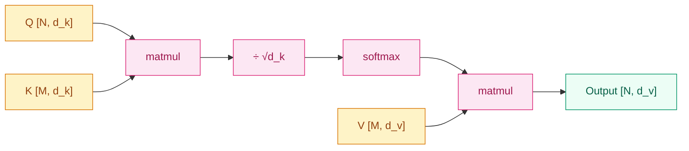
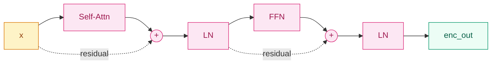

## 前作进展

2014–2016 这三年里,**机器翻译**已经成为神经网络应用的标杆战场。这条线的演化:

- **2014 [Seq2Seq](../02-rnn-lstm/04-seq2seq.md)**——用 LSTM encoder + decoder 端到端学翻译,把 SMT 流水线压成单一神经网络
- **2015 [Bahdanau Attention](../02-rnn-lstm/05-attention.md)**——在 Seq2Seq 上加 attention,绕开固定上下文向量的信息瓶颈,长句翻译质量回到与短句平行水平
- **2016 GNMT**——Google 把 8 层 LSTM + attention + residual 上线生产,英中翻译质量再上一个台阶

到 2017 年初,机器翻译的"标准架构"基本定型——**多层 RNN(LSTM 或 GRU)+ attention**。但这个架构里有两块明显跟不上工程发展的硬伤:

**1. 串行训练慢**——RNN 的 `h_t = f(h_{t-1}, x_t)` 强制按时间逐步展开。GPU 在 2017 年已经能轻松并行 10⁶ 次矩阵乘,但 RNN 一次 forward 还是要走 T 个 sequential step。一个长度 100 的序列,RNN 至少要 100 个 sequential GPU launch,无论硬件多强都被这条串行链锁死。GNMT 训练一个英法模型在 96 个 GPU 上要跑一周,大部分时间被串行展开吃掉。

**2. 长距离依赖路径仍然长**——attention 让 decoder 看到 encoder 所有时刻,但 encoder 内部信息流仍走 RNN 链。源句开头到结尾的语义关联要经过 T 步的循环传递,梯度回传走的还是那条容易衰减的 RNN 链。Bahdanau 的 BiRNN 只是把"单向 T 步"换成"双向各 T/2 步",没有从根本上缩短路径。

当时社区给出过几条绕路方案:

- **2016 ByteNet**(Kalchbrenner)——用 dilated causal convolution 做序列建模,卷积天然并行;但感受野受 kernel size × depth 限制,长依赖仍要堆深
- **2017 ConvS2S**(Gehring,Facebook)——纯卷积 Seq2Seq + attention,在 WMT'14 上超过 GNMT 且训练快 9 倍;但仍是局部感受野,需要堆很多层才能覆盖整句
- **2016 Decomposable Attention**(Parikh)——在自然语言推理上,用纯 attention(无循环无卷积)做 Q-K 配对,证明了 attention 单独就能做对齐

Vaswani 等人的论文把这些零散观察推到了逻辑终点:**既然 attention 单独就能做对齐,卷积可以完全并行——那为什么不试试纯 attention?把循环和卷积都扔掉,只留 attention + FFN**。

这就是 2017 年 6 月 NIPS 投稿的 *Attention Is All You Need*。标题本身就是一句宣言。

## 核心思想:Scaled Dot-Product Attention

Transformer 的所有 attention 模块都由同一个基本操作构成——**scaled dot-product attention**:

$$
\text{Attention}(Q, K, V) = \text{softmax}\!\left(\frac{Q K^\top}{\sqrt{d_k}}\right) V
$$

三个张量:

- **Query `Q ∈ R^{N×d_k}`** —— "我在找什么"
- **Key `K ∈ R^{M×d_k}`** —— "我能被找到的标识"
- **Value `V ∈ R^{M×d_v}`** —— "实际承载的信息"

计算分三步:

**1. 内积打分**——`QK^T ∈ R^{N×M}`,每个 `(i, j)` 位置是 query `q_i` 和 key `k_j` 的相似度
**2. 缩放 + softmax**——除以 `sqrt(d_k)` 后逐行 softmax,得到归一化的注意力权重 `α ∈ R^{N×M}`
**3. 加权值**——`α V ∈ R^{N×d_v}`,每个 query 拿到 value 的加权平均



*图 1:Scaled Dot-Product Attention 数据流——两次矩阵乘 + 一次 softmax,全程无循环,GPU 上一次跑完。*

**为什么除以 `sqrt(d_k)`?** 论文里给的解释:当 `d_k` 较大时,`q_i · k_j = Σ q_{i,m} k_{j,m}` 是 `d_k` 项独立随机变量的和,方差是 `d_k`(假设每项方差为 1)。如果不缩放,内积的量级会随 `d_k` 增长,推到 softmax 后会进入饱和区——梯度变得极小、训练不稳定。除以 `sqrt(d_k)` 把方差归一到 1,softmax 落在合理范围。这一缩放后来在 LayerNorm + 较小初始化下 partially 冗余,但仍然是默认做法。

**Self-attention vs Cross-attention**——只是 Q/K/V 来源不同的术语区分:

- **Self-attention**: Q, K, V 都来自同一个序列(`Q = X W_Q, K = X W_K, V = X W_V`)。Encoder 每层、decoder 每层都用 self-attention 让位置间互相看
- **Cross-attention**: Q 来自 decoder 当前层,K, V 来自 encoder 最终输出。这是 Bahdanau attention 的并行化版本,decoder 用它"回看 encoder"

数学结构完全一样,差异只在 Q/K/V 的来源。

## Multi-Head Attention

Vaswani 等人注意到单个 attention 头只能学一种"关系模式"——比如词法依赖,或者指代关系。把不同关系强行混在一个头里学,容易互相干扰。解法是**并行跑 `h` 个 attention 头,各自学不同的关系**:

$$
\text{MultiHead}(Q, K, V) = \text{Concat}(\text{head}_1, \ldots, \text{head}_h) W^O
$$

$$
\text{head}_i = \text{Attention}(Q W_i^Q, K W_i^K, V W_i^V)
$$

具体做法:

1. 把 `d_model` 维的输入投影到 `h` 组 `(Q_i, K_i, V_i)`,每个头里的维度 `d_k = d_v = d_model / h`(原版 `d_model = 512, h = 8, d_k = 64`)
2. 每个头独立跑 scaled dot-product attention,输出 `[N, d_v]`
3. 把 `h` 个头的输出沿特征维度拼起来,过一个 `W^O` 投影回 `d_model`

参数量上,multi-head 的 `4` 个投影矩阵(`W^Q, W^K, W^V, W^O`)总参数和单头 attention 一样——`4 × d_model × d_model`,因为每个头的维度是 `d_model / h`。**多头不增加参数,只是把同样的参数预算分给 `h` 个角色**。

实际中,不同头确实学到不同模式:某些头专注语法依赖、某些头专注共指、某些头专注词法。这一观察后来催生了 BertViz 等可视化工具,也催生了"attention 头可剪枝"的发现(Michel 2019 *Are Sixteen Heads Really Better than One?*——多达 80% 的头可以剪掉而性能基本不掉)。

## Position Encoding

Attention 有一个数学性质:**置换等变**。把输入序列的 token 顺序打乱,attention 的输出也只是相应打乱,数值不变。RNN 天然有时序(`h_t` 依赖 `h_{t-1}`),CNN 通过 kernel 的局部连接隐含位置信息;但 attention 看不到位置。这对语言建模是致命的——"狗咬人"和"人咬狗"在 attention 看来完全等价。

解法是**显式给每个位置加一个位置编码**:

$$
x_t = \text{Embedding}(token_t) + PE_t
$$

`PE_t ∈ R^{d_model}` 是 t 位置的固定向量,直接加到 token embedding 上。原版用正余弦函数:

$$
PE_{t, 2i} = \sin(t / 10000^{2i/d_{model}}), \quad PE_{t, 2i+1} = \cos(t / 10000^{2i/d_{model}})
$$

每个维度 `2i / 2i+1` 对应一个不同周期的正弦/余弦——浅维度变化快(短距离敏感)、深维度变化慢(长距离敏感)。

**为什么用正余弦?** 论文给的理由是"模型可能学到相对位置关系"——任意 `PE_{t+k}` 都可以表示成 `PE_t` 的线性组合(因为 `sin(t+k) = sin(t)cos(k) + cos(t)sin(k)`),所以理论上模型可以推理出"位置 `t+k` 相对于 `t` 偏移了 `k`"。实际上原版正余弦 PE 在训练长度内工作良好,但**外推到训练长度之外效果不好**——这是 2021 [RoPE](04-rope.md) 要解决的核心问题。

实践中也存在 **learned positional embedding**(BERT 用):像 token embedding 一样直接学 `max_len` 个位置向量。和正余弦差异不大,但完全不能外推。

## Encoder / Decoder 完整结构

Transformer 沿用了 Seq2Seq 的 encoder-decoder 骨架,但每个 block 内部全是 attention + FFN:



*图 2:Encoder 单层结构——self-attention + residual + LayerNorm + FFN + residual + LayerNorm,六层堆叠组成 encoder。*

**Encoder** 6 层,每层两个 sublayer:

1. **Multi-head self-attention** —— 让每个位置看到序列里所有位置
2. **Position-wise Feed-Forward Network**(FFN)—— 每个位置独立过一个两层 MLP:
   $$
   \text{FFN}(x) = \text{ReLU}(x W_1 + b_1) W_2 + b_2
   $$
   中间维度 `d_ff = 2048`(`d_model = 512` 的 4 倍),这"先升维到 4x 再降回"的设计后来成为标准配方,沿用到 GPT/LLaMA。FFN 占模型参数的大头(约 2/3),attention 只占 1/3

每个 sublayer 外面包一个 **residual + LayerNorm**(原版是 **Post-LN**,即 `LayerNorm(x + Sublayer(x))`,而不是后来主流的 Pre-LN):

$$
\text{Output} = \text{LayerNorm}(x + \text{Sublayer}(x))
$$

**Decoder** 6 层,每层三个 sublayer:

1. **Masked multi-head self-attention** —— self-attention 加 mask,让位置 `t` 只能看 `1..t`(自回归生成需要,防止训练时偷看未来 token)。Mask 实现是在 softmax 前给 `QK^T` 矩阵的上三角部分填 `-∞`,softmax 后这些位置权重变 0
2. **Multi-head cross-attention** —— Q 来自 decoder 当前层、K/V 来自 encoder 最终输出,这是 Bahdanau attention 的并行化对应
3. **FFN** —— 同 encoder 结构

最终输出过一个 linear + softmax 得到 `vocab_size` 维的概率分布。

完整 encoder + decoder + embedding + 输出投影,参数量约 65M(`d_model=512, h=8, N=6`),在 WMT'14 英德上拿到 BLEU 28.4(超过 GNMT 的 24.6);更大的版本(`d_model=1024, h=16, d_ff=4096`)拿到 BLEU 28.4 → 41.0 英法、28.4 英德,**新 SOTA + 训练时间是 ConvS2S 的 1/4、GNMT 的 1/100**。

## Post-LN 是原版细节

原版 Transformer 用的是 **Post-LN**:`y = LayerNorm(x + Sublayer(x))`——残差后接 LayerNorm。这一选择当时没什么争议,但后来发现在深层(> 12 层)训练时会有梯度爆炸/消失问题,导致**需要非常精心调 learning rate warmup**才能训得稳定。

2019 *On Layer Normalization in the Transformer Architecture* 系统分析后给出 **Pre-LN** 的替代方案:`y = x + Sublayer(LayerNorm(x))`——LayerNorm 先作用在 sublayer 输入上,残差直接走原始 x。Pre-LN 训练稳定得多,可以跳过 warmup,深度推到 100+ 层不掉点。

GPT-2 之后所有大模型(BERT-large 之后大多数版本、GPT-2/3/4、LLaMA)都用 Pre-LN。原版 Post-LN 现在主要在 BERT-base 这种"按原始论文复现"的实现里见到。LLaMA 进一步把 LayerNorm 换成 [RMSNorm](04-rope.md),省掉减均值一步,推理快 7%。

记住这条历史:**原版 Transformer 的 Post-LN 是当年的选择,但今天的工业实践已经全部转向 Pre-LN/Pre-RMSNorm**。如果你看一份 LLaMA 实现里的残差结构,它已经不长得像原版 Transformer。

## 训练细节

| 维度 | 原版 Transformer Base / Big |
|------|------|
| 数据 | WMT'14 英德 4.5M 句对、WMT'14 英法 36M 句对 |
| Tokenization | Byte-Pair Encoding (BPE),32K / 37K subword 词表 |
| Base 模型 | `d_model = 512, h = 8, d_ff = 2048, N = 6` → 65M 参数 |
| Big 模型 | `d_model = 1024, h = 16, d_ff = 4096, N = 6` → 213M 参数 |
| 优化器 | **Adam(β1=0.9, β2=0.98, ε=10⁻⁹)** —— β2=0.98(不是常见的 0.999)是 Transformer 训练特有 |
| Learning rate | $\text{lr} = d_{model}^{-0.5} \cdot \min(\text{step}^{-0.5}, \text{step} \cdot \text{warmup}^{-1.5})$,warmup 4000 步 |
| Label smoothing | ε = 0.1 —— 防止模型对 ground truth 过度自信,把 1 的目标概率平均散 0.1 到其他词上,BLEU 提升 ~0.5 |
| Dropout | 0.1(sublayer output / embedding sum) |
| Batch | 25K source + 25K target token / batch(按 token 数动态分桶,不按句子数) |
| 训练时间 | Base: 8 × P100 GPU × 12 小时;Big: 8 × P100 × 3.5 天 |
| 推理 | Beam search size 4,length penalty α=0.6 |

这套 hyperparameter 是**调出来的**——Vaswani 团队跑了 10+ 次完整实验,发现 β2=0.98、warmup 4000、label smoothing 0.1 是必需的;少了任何一个 BLEU 都掉 1+ 点。后来很多人尝试用更"主流"的 Adam β2=0.999 训 Transformer,几乎都会发现训练不稳定。这一历史细节直接催生了后续 Transformer 训练的多个改进:Pre-LN(去掉 warmup 依赖)、AdamW(权重衰减解耦)、cosine learning rate schedule。

## 关键代码

PyTorch 里写一个 scaled dot-product attention + multi-head:

```python
import torch
import torch.nn as nn
import torch.nn.functional as F

def scaled_dot_product_attention(q, k, v, mask=None):
    # q, k, v: [B, h, N, d_k]
    d_k = q.size(-1)
    scores = torch.matmul(q, k.transpose(-2, -1)) / (d_k ** 0.5)  # [B, h, N, M]
    if mask is not None:
        scores = scores.masked_fill(mask == 0, float('-inf'))
    attn = F.softmax(scores, dim=-1)
    return torch.matmul(attn, v), attn   # [B, h, N, d_k], [B, h, N, M]

class MultiHeadAttention(nn.Module):
    def __init__(self, d_model, num_heads):
        super().__init__()
        assert d_model % num_heads == 0
        self.d_model, self.h = d_model, num_heads
        self.d_k = d_model // num_heads
        # 合并 Q/K/V 三个投影成一次大矩阵乘
        self.qkv_proj = nn.Linear(d_model, 3 * d_model)
        self.out_proj = nn.Linear(d_model, d_model)

    def forward(self, x, mask=None):
        B, N, _ = x.shape
        qkv = self.qkv_proj(x)                      # [B, N, 3*d_model]
        q, k, v = qkv.chunk(3, dim=-1)              # 3 个 [B, N, d_model]
        # 拆头: [B, N, d_model] → [B, h, N, d_k]
        q = q.view(B, N, self.h, self.d_k).transpose(1, 2)
        k = k.view(B, N, self.h, self.d_k).transpose(1, 2)
        v = v.view(B, N, self.h, self.d_k).transpose(1, 2)
        out, _ = scaled_dot_product_attention(q, k, v, mask)
        # 合头: [B, h, N, d_k] → [B, N, d_model]
        out = out.transpose(1, 2).contiguous().view(B, N, self.d_model)
        return self.out_proj(out)
```

整个 attention 实现里**没有一个 for 循环**——所有位置一次矩阵乘算完,序列长度变化不影响代码结构。这就是 Transformer 相对 RNN 的根本工程优势。`qkv_proj` 把 Q/K/V 三次线性合并成一次,矩阵乘 GPU 利用率比 3 次小矩阵乘高 30%——这是工业实现的标准 trick,PyTorch 2.0 的 `F.scaled_dot_product_attention` 直接内置了这一融合。

完整一个 encoder block:

```python
class EncoderBlock(nn.Module):
    def __init__(self, d_model, num_heads, d_ff=2048, dropout=0.1):
        super().__init__()
        self.attn = MultiHeadAttention(d_model, num_heads)
        self.ffn = nn.Sequential(
            nn.Linear(d_model, d_ff),
            nn.ReLU(),
            nn.Linear(d_ff, d_model),
        )
        self.ln1 = nn.LayerNorm(d_model)
        self.ln2 = nn.LayerNorm(d_model)
        self.drop = nn.Dropout(dropout)

    def forward(self, x, mask=None):
        # Post-LN(原版)
        x = self.ln1(x + self.drop(self.attn(x, mask)))
        x = self.ln2(x + self.drop(self.ffn(x)))
        return x
```

注意 `self.ln1(x + self.drop(self.attn(x, mask)))` 这一行——LayerNorm 在残差**外面**。这是原版的 Post-LN 写法。现代实现(GPT-2 之后)改成 Pre-LN:`x + self.drop(self.attn(self.ln1(x), mask))`——LayerNorm 作用在 sublayer 输入,残差直接传 x。

## 影响 / 后续

Transformer 是深度学习史上影响最大的单篇架构论文,没有之一。它在 2017 年发表时只是 WMT 机器翻译 SOTA,但接下来 5 年里它吞掉了整个领域:

- **2018 BERT**(Devlin)——encoder-only Transformer + masked LM 预训练,GLUE/SQuAD 全面 SOTA
- **2018 GPT-1**(Radford)——decoder-only Transformer + 自回归预训练,scaling law 时代的起点
- **2019 GPT-2 / T5**——参数推到 1.5B / 11B,zero-shot 任务能力涌现
- **2020 ViT**(Dosovitskiy)——把 Transformer 直接用到图像,patch as token,ImageNet 上击败 ResNet
- **2020 GPT-3** —— 175B 参数,in-context learning,LLM 时代正式开启
- **2021 CLIP**(Radford)——Transformer 视觉塔 + 文本塔做跨模态对齐,文生图基座
- **2022 Diffusion Transformers**(Peebles)——把 U-Net 换成 Transformer,Stable Diffusion 3 / Sora 都用这条路
- **2023 LLaMA** —— 开源 Transformer 系列,Pre-RMSNorm + RoPE + SwiGLU + GQA 几乎成为现代 LLM 默认配方

这一影响的根因是 Transformer 做对的几件事**都是结构性、可扩展的**:

1. **完全并行**——天然适合 GPU 大规模训练。RNN 没法 scale 到 100B+ 参数,Transformer 可以
2. **同构堆叠**——每个 block 结构一致,堆 6 层和堆 96 层只是数量差异。这让 scaling law 成为可能
3. **模块化**——attention / FFN / LayerNorm 可以独立改进。后续家族(MoE 改 FFN、稀疏 attention 改 attention、RMSNorm 改 LayerNorm)都是局部替换
4. **跨模态通用**——Q/K/V 不在乎数据是文本、图像 patch、还是音频帧。这是 ViT/CLIP/Whisper 都用 Transformer 的根因

但 2017 原版留下的几个具体瓶颈,推动了后续 5 年这家族的演化:

- **复杂度 O(N²)**——长上下文不可行 → [03-sparse-attention.md](03-sparse-attention.md) / [05-flash-attention.md](05-flash-attention.md)
- **位置编码外推差**——超出训练长度性能崩 → [02-transformer-xl.md](02-transformer-xl.md) / [04-rope.md](04-rope.md)
- **Post-LN 深层不稳**——需要精细 warmup → Pre-LN 在后续家族里成为默认(见 [04-rope.md](04-rope.md) 内 callout)
- **多头 KV cache 大**——长上下文推理内存爆炸 → GQA/MQA(见 [05-flash-attention.md](05-flash-attention.md) 内 callout)

→ [02-transformer-xl.md](02-transformer-xl.md) · 长上下文 + segment-level recurrence + 相对位置编码
→ [03-sparse-attention.md](03-sparse-attention.md) · Longformer/BigBird,O(N²) → O(N)
→ [04-rope.md](04-rope.md) · 旋转位置编码,LLaMA/GPT 系标配
→ [05-flash-attention.md](05-flash-attention.md) · IO-aware 实现,attention 的系统级革命
→ [../06-bert-family/](../06-bert-family/) · encoder-only + masked LM
→ [../07-gpt-scaling/](../07-gpt-scaling/) · decoder-only + scaling laws
→ [../08-vit/](../08-vit/) · patch as token,Transformer 应用到视觉
→ [../02-rnn-lstm/05-attention.md](../02-rnn-lstm/05-attention.md) · Bahdanau attention 是 cross-attention 的直系前作
