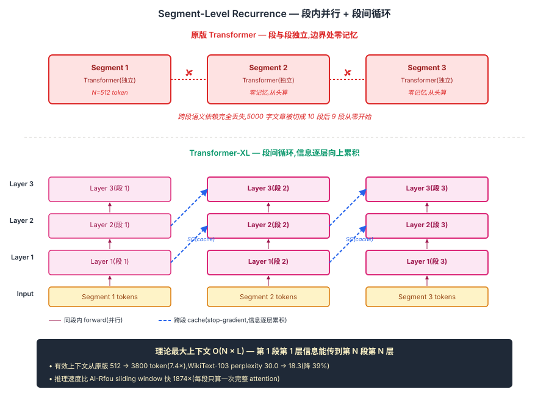
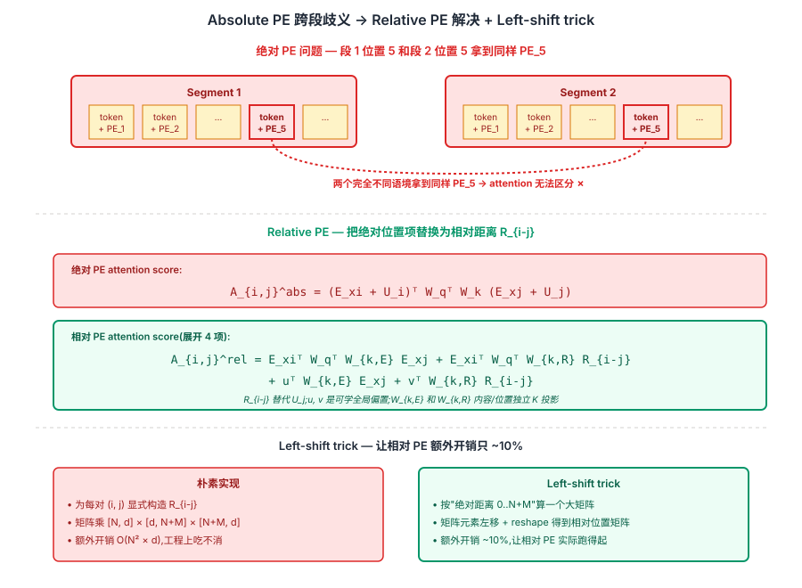

## 前作进展

[2017 原版 Transformer](01-transformer.md) 在机器翻译上取得巨大成功后,自然的下一步是把它用到**语言建模**——给一段文本逐字预测下一个字符 / token。Al-Rfou 等人在 2018 年的 *Character-Level Language Modeling with Deeper Self-Attention* 把 Transformer 直接套用到字符级建模上,堆 64 层、上下文窗口 512,在 enwik8/text8 上拿了 SOTA。但这一套用过程暴露了原版 Transformer 在长上下文上的两个结构性问题:

**1. 上下文被硬截断**——Al-Rfou 的做法是把长文本切成不重叠的 512 字符段,每段独立训练。这意味着**段边界处的字符看不到前面任何上下文**——一篇 5000 字的文章会被切成 10 段,后 9 段都从"零记忆"重新开始,跨段的语义依赖完全丢失。推理时也一样:每生成 512 个字符就要把全部 cache 重置,长文本生成质量在段边界处会有可观察的"重启"现象。

**2. 训练效率低**——为了在推理时保留部分上下文,Al-Rfou 用 **stride 1 sliding window**(每生成 1 个字符,把窗口向右滑 1 步,重算整段 attention),计算量是 batch training 的 512 倍。这种效率代价让模型几乎无法用到生产。

更深层的问题是**位置编码**。原版 Transformer 用的是绝对正余弦 PE——`x_t = embed(token_t) + PE_t`。在段内这没问题,但跨段处理时,**两个不同段里的"位置 0"会被赋予相同的 PE**,模型完全没法区分"这是新段的开头"和"这是上一段的开头"。绝对 PE 把"位置"和"具体的段内偏移量"硬绑定,跨段语义建模在结构上不可能。

Dai 等人 2019 的 Transformer-XL(extra long)对这两件事一起出手:**用段级循环让信息跨段流动 + 用相对位置编码让跨段位置可计算**。这是 Transformer 在长上下文方向的第一个结构性突破。

## 核心思想

### 直觉:让上一段的隐状态作为这段的"记忆",同时换掉绝对 PE

理解 Transformer-XL 真正需要先抓一件事:**[原版 Transformer](01-transformer.md) 在语言建模上有两个结构性病** — 上下文被硬切成 512 段、段边界处看不到前文;绝对 PE 让"第 1 段的位置 5"和"第 2 段的位置 5"拿到同样的位置信号,**结构上就无法跨段建模**。Al-Rfou 2018 用 stride-1 sliding window 暴力推理,慢 512 倍。Dai 等人 2019 反问:**为什么不从 [RNN](../02-rnn-lstm/01-rnn.md) 偷"段级循环"思想 + 把绝对 PE 换成相对 PE,两件事一起解?**

三件事必须同时成立才让 Transformer-XL 在 2019 年成立:

- **Segment-Level Recurrence** — 上一段每层隐状态 stop-gradient 缓存,作为当前段 attention 的 K/V 前缀;**段内并行 + 段间循环**,既不丢 Transformer 的并行性又有 RNN 的跨段记忆
- **Relative Position Encoding** — 把位置从"加在输入上的绝对 PE"换成"加在 attention score 上的相对距离 R_{i-j}",跨段时无歧义
- **Left-shift trick + 独立 K_R 投影** — 让相对 PE 的计算开销只多 ~10%,工程上跑得起;内容和位置用独立 K 投影,两类信号不干扰

三件事合起来:**有效上下文从 512 → 3800 token(7.4×)**,WikiText-103 perplexity 从 30.0 → 18.3(降 39%),推理速度比 sliding window 快 1874×。但 Transformer-XL 真正的历史地位不在自己用得多 — 而在它**第一次系统验证"相对位置编码 + 跨段记忆"路线**,直接催生 T5(relative bias)/ [RoPE](04-rope.md)(旋转 PE)/ ALiBi 等几乎所有现代 LLM 的位置编码方案。


*图 1:**上半** 原版 Transformer 切段处理 — 段与段独立,段边界处"零记忆",跨段依赖丢失。**下半** Transformer-XL — 每段每层隐状态缓存(stop-gradient)+ 下段 K/V 拼上 `[memory; current]`,Q 只来自当前段。蓝色虚线展示信息"逐层向上累积"路径:第 1 段第 1 层信息 → 第 2 段第 2 层 → 第 3 段第 3 层 → 理论最大上下文 O(N×L)。底部 callout:有效上下文 512 → 3800 token,推理快 1874×。*

### 机制一:Segment-Level Recurrence — 段内并行 + 段间循环

第 τ 段第 n 层的输出 `h_τ^{(n)}` 在处理第 τ+1 段时被作为额外 K/V 序列前缀拼进来:

$$
\tilde{h}_{\tau+1}^{(n-1)} = [\text{SG}(h_\tau^{(n-1)});\, h_{\tau+1}^{(n-1)}]
$$

$$
Q_{\tau+1} = h_{\tau+1}^{(n-1)} W_Q, \quad K_{\tau+1} = \tilde{h}_{\tau+1}^{(n-1)} W_K, \quad V_{\tau+1} = \tilde{h}_{\tau+1}^{(n-1)} W_V
$$

关键工程细节:

- **`SG(·)` 是 stop-gradient** — 上一段隐状态只参与 forward,不回传梯度。这避免梯度跨段累积导致训练成本爆炸,实测影响极小(loss 不掉)
- **Q 只来自当前段,K/V 来自"缓存 + 当前"** — 当前段可以 attend 到上一段全部 token,但上一段 token 不参与本段输出生成。**信息单向流动**
- **每层独立缓存,信息逐层向上累积** — 第 n 层 cache 来自上一段第 n-1 层输出(注意是 n-1)。这让第 1 段第 1 层信息能传到第 2 段第 2 层、第 3 段第 3 层…**理论最大上下文 O(N × L)**

和 RNN 的本质区别:RNN 在 token 粒度做循环(逐 token 不能并行),Transformer-XL 在**段的粒度**做循环 — **段内仍完全并行**,只是段之间通过缓存接力。这保留了 Transformer 的核心优势(并行计算)。

### 机制二:Relative Position Encoding — 用相对距离替代绝对 PE

Segment-level recurrence 立刻引入一个问题:**绝对 PE 跨段重复**。第 1 段位置 5 的 PE = `PE_5`,第 2 段位置 5 的 PE 也 = `PE_5`,两个不同语境拿到同样的位置信号,attention 无法区分。

解法是把位置信号从"加在输入上"换成"加在 attention score 上"。原版 attention score 展开:

$$
A_{i,j}^{\text{abs}} = (E_{x_i} + U_i)^\top W_q^\top W_k (E_{x_j} + U_j)
$$

E_x 是 token embedding,U_i 是绝对 PE。Dai 把它改造成只依赖**相对位置 i−j** 的形式:

$$
A_{i,j}^{\text{rel}} = E_{x_i}^\top W_q^\top W_{k,E} E_{x_j} + E_{x_i}^\top W_q^\top W_{k,R} R_{i-j} + u^\top W_{k,E} E_{x_j} + v^\top W_{k,R} R_{i-j}
$$

关键改动:

- **`R_{i-j}` 替代 `U_j`** — 位置项变成相对距离的正余弦编码,跨段无歧义
- **`u, v` 是可学的全局偏置** — 替代原版 q_i 中的 U_i 项;意义是"无论 query 在哪个绝对位置,它对 key 的位置偏好一致"
- **`W_{k,E}` 和 `W_{k,R}` 内容/位置独立 K 投影** — 让两类信号互不干扰

### 机制三:Left-shift trick + 工程加速 — 让 relative PE 实际跑得起

朴素实现 relative PE 需要为每对 (i, j) 算 R_{i-j},如果 N=384、M=384,N×(N+M)=384×768 ≈ 30 万对,每对 d 维 dot product,**额外开销 O(N²×d)**。

Dai 给出 **left-shift trick**:先按"假设所有位置都是绝对距离 0 到 N+M"算一个大矩阵 [N, N+M],然后通过**矩阵元素左移 + reshape**直接得到等价的相对位置矩阵,避免显式构造 R_{i-j}。

```python
def relative_shift(x):
    """[B, h, N, N+M] 绝对位置矩阵 → 相对位置矩阵"""
    B, H, N, M = x.shape
    zero_pad = torch.zeros(B, H, N, 1, device=x.device)
    x = torch.cat([zero_pad, x], dim=-1)
    x = x.view(B, H, M + 1, N)
    return x[:, :, 1:].view(B, H, N, M)
```

这一 trick 把相对 PE 的额外开销从 O(N²·d) 降到 ~10%,**让 Transformer-XL 在工程上跑得起**。这是论文里非常 systems-level 的一个细节,但它决定了"相对 PE 能否被广泛采用"。

### 三件套协同:Segment Cache + Relative PE + Left-shift Trick 缺一不可

Transformer-XL 在 2019 年能让 Transformer 第一次跨越固定窗口,**不是单一改进**,而是三件套同时调到协同点 —— 任何一个抽掉 Transformer-XL 都不成立,这一点和 [ResNet](../01-cnn/05-resnet.md) 的 `shortcut + BN + He 初始化` 协同关系一致:

- **只有 segment cache,没有 relative PE** — 跨段时绝对 PE 重复,模型无法区分"段内位置 5"和"段间位置 5",**结构上跨段建模不成立**,缓存了上段也无意义
- **只有 relative PE,没有 segment cache** — 模型仍然只看当前段 N token,有效上下文还是 N,**relative PE 只解决了跨段位置歧义但没扩展实际上下文**
- **只有 segment cache + relative PE,没有 left-shift trick** — 相对 PE 朴素实现额外开销 O(N²·d),工程上跑不动,Transformer-XL 只能停在 paper 不能开源

三件套合起来才让 Transformer-XL 在 2019 年同时拿到长上下文 + 工程可行性。也正是因为 segment-level recurrence 仍然有点笨重(每段都要拼缓存),后续工作[Sparse Attention](03-sparse-attention.md) / [RoPE](04-rope.md) / [FlashAttention](05-flash-attention.md) 从不同方向继续优化 — 但**相对位置编码"必须可学且鲁棒外推"的理念是 Transformer-XL 第一次系统提出的**,T5 / RoPE / ALiBi 等全部沿这条路线。


*图 2:**上半** 绝对 PE 问题 — 段 1 位置 5 和段 2 位置 5 拿到同样 `PE_5`,模型无法区分。**中** Transformer-XL 改造 attention score:把 `U_j` 替换为相对距离 `R_{i-j}` + 加可学全局偏置 u/v + 独立 K_R 投影,公式展开成 4 项。**下半** Left-shift trick — 朴素相对 PE 需 O(N²·d) 开销,通过矩阵左移 + reshape 等价得到 [N, M] 相对位置矩阵,**额外开销降到 ~10%**。底部 callout:这一相对 PE 思想被 T5 relative bias / RoPE 旋转 PE / ALiBi 线性偏置等几乎所有现代 LLM 继承。*

## 性能数据

Transformer-XL 在三个标准语言建模 benchmark 上拿到 SOTA(2019 年初):

| Benchmark | 模型 | Perplexity / BPC |
|------|------|------|
| WikiText-103 | LSTM-based SOTA(2018) | 40.8 |
| WikiText-103 | Transformer 64 层(Al-Rfou) | 30.0 |
| WikiText-103 | **Transformer-XL Large** | **18.3** |
| enwik8(char-level) | Transformer 64 层 | 1.06 BPC |
| enwik8 | **Transformer-XL Large(18 层)** | **0.99 BPC** |
| One Billion Word | LSTM | 23.7 |
| One Billion Word | **Transformer-XL** | **21.8** |

WikiText-103 上从 30.0 降到 18.3 是个巨大跨度——Transformer 时代单跳通常只能降几个点的指标,Transformer-XL 直接砍掉了 39%。这一结果让"长上下文建模"成为接下来 4 年 Transformer 演化的主要方向。

推理速度也是关键:相比 Al-Rfou 的 sliding window 推理,Transformer-XL 在 WikiText-103 上推理速度**快 1874 倍**(论文 Table 5)——因为它每段只算一次完整 attention,不需要逐 token 滑窗重算。

## 训练细节

| 维度 | Transformer-XL Large(WikiText-103) |
|------|------|
| 模型 | 18 层, `d_model = 1024, h = 16, d_ff = 4096`,~257M 参数 |
| Segment length | 训练时 384 token,推理时可设到 1600 token |
| Cache length | 训练时 384(等于 segment length),推理时设到 1600+ 充分利用长上下文 |
| Vocabulary | 267K word-level(adaptive softmax 分桶) |
| 优化器 | Adam,lr=2.5e-4,cosine schedule,warmup 0 步(因为相对 PE 训练稳定) |
| Dropout | 0.2(attention)/ 0.2(FFN)/ 0.2(embedding) |
| 训练时间 | 4 × V100 GPU × 8 天 |

注意 warmup 是 0 步——相对位置编码 + segment cache 训练稳定性显著好于原版,不需要 Vaswani 那套精细的 lr schedule。这是后续 Pre-LN + relative PE 组合成为现代 LLM 默认配方的早期信号。

## 关键代码

相对位置编码的核心是**改造 attention score 计算**:

```python
import torch
import torch.nn as nn

class RelativeMultiHeadAttention(nn.Module):
    def __init__(self, d_model, num_heads):
        super().__init__()
        self.h = num_heads
        self.d_k = d_model // num_heads
        self.qkv_proj = nn.Linear(d_model, 3 * d_model)
        # 内容和位置使用独立的 K 投影
        self.W_k_R = nn.Linear(d_model, d_model, bias=False)
        # 可学的全局偏置 u, v
        self.u = nn.Parameter(torch.zeros(num_heads, self.d_k))
        self.v = nn.Parameter(torch.zeros(num_heads, self.d_k))
        self.out_proj = nn.Linear(d_model, d_model)

    def forward(self, x, memory, R):
        # x: [B, N, d_model] 当前段
        # memory: [B, M, d_model] 上一段缓存(stop-gradient)
        # R: [N+M, d_model] 相对位置编码 R_{i-j}
        B, N, _ = x.shape
        x_full = torch.cat([memory.detach(), x], dim=1)  # SG(memory)
        qkv = self.qkv_proj(x_full)
        q, k, v = qkv.chunk(3, dim=-1)
        q = q[:, -N:]  # Q 只来自当前段
        # ...拆头、shape 为 [B, h, N or N+M, d_k]

        # 内容-内容: (q+u) · k
        ac = torch.matmul(q + self.u, k.transpose(-2, -1))
        # 内容-位置: (q+v) · k_R
        k_R = self.W_k_R(R).view(-1, self.h, self.d_k).transpose(0, 1)  # [h, N+M, d_k]
        bd = torch.matmul(q + self.v, k_R.transpose(-2, -1))
        bd = relative_shift(bd)  # left-shift trick 把绝对距离 → 相对距离

        scores = (ac + bd) / (self.d_k ** 0.5)
        # ...softmax + 加权 V + 输出投影

def relative_shift(x):
    """把 [B, h, N, N+M] 的绝对位置 attention 矩阵 shift 成相对位置"""
    B, H, N, M = x.shape
    zero_pad = torch.zeros(B, H, N, 1, device=x.device)
    x = torch.cat([zero_pad, x], dim=-1)
    x = x.view(B, H, M + 1, N)
    x = x[:, :, 1:].view(B, H, N, M)
    return x
```

`relative_shift` 这个 trick 把"算所有绝对位置对再筛相对距离"的 `O(N² × M)` 操作压成 `O(N × M)`——通过把矩阵元素巧妙地左移一格实现等价计算。这是 Dai 论文里非常工程的一个细节,但它让相对 PE 的额外开销可以接受。

`memory.detach()` 这一行就是 `SG(·)` 的实现——上一段的 K/V 参与当前段的 forward 但不回传梯度。

## 影响 / 后续

Transformer-XL 在 Transformer 家族里的位置很特殊:**它在概念上提出了两个重要东西,但作为完整模型本身用得不多**。原因是 segment-level recurrence 这条思路被后续工作部分淘汰——稀疏 attention([03-sparse-attention.md](03-sparse-attention.md))、FlashAttention([05-flash-attention.md](05-flash-attention.md))、RoPE([04-rope.md](04-rope.md))分别从不同方向解决了"长上下文"问题,且都不需要段级循环这个有点笨重的机制。

但它的**相对位置编码思想**被几乎所有现代 LLM 继承:

- **T5**(2019)用 relative position bias(简化版),后来 mBART/Flan-T5/T5x 沿用
- **DeBERTa**(2020)在 BERT 上加 relative PE,GLUE/SuperGLUE 拿了多次 SOTA
- **RoPE**(2021)把相对位置思想推到几何旋转,LLaMA/PaLM/Mistral 全用
- **ALiBi**(2021)更激进:不用 PE,直接给 attention score 加一个与 `|i-j|` 成正比的负偏置;BLOOM/MPT 用

而 **segment-level recurrence** 的思想在 long-context 场景也没死,只是换了形式:

- **XLNet**(2019)用 Transformer-XL 作为骨架做 permutation LM
- **Compressive Transformer**(2020)在 Transformer-XL cache 基础上加压缩
- **Memorizing Transformer**(2022)/ **kNN-LM** 用外部 memory 做近似的"cross-segment attention"
- **Mamba**(2023)/ **RWKV** 重新拥抱循环——某种意义上是 Transformer-XL 思想的回潮

→ [03-sparse-attention.md](03-sparse-attention.md) · 长上下文的另一条路线,O(N²) → O(N)
→ [04-rope.md](04-rope.md) · 相对位置编码的几何化推广,LLaMA/GPT 系标配
→ [05-flash-attention.md](05-flash-attention.md) · 用 IO-aware 实现支持更长序列,正交于 Transformer-XL 的算法路线
→ [01-transformer.md](01-transformer.md) · 父结构,绝对 PE 和固定窗口正是本节点要破的
→ [../07-gpt-scaling/](../07-gpt-scaling/) · 长上下文是 LLM scaling 的关键维度之一
