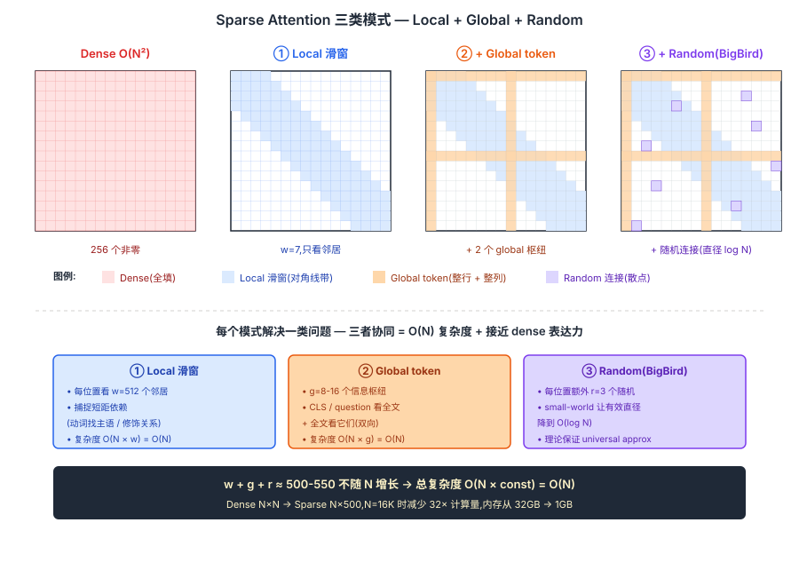
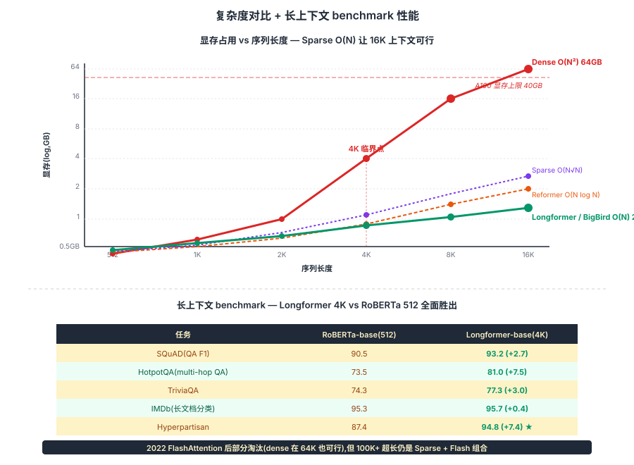

## 前作进展

[原版 Transformer](01-transformer.md) 的 attention 是 **O(N²)** ——每个 token 对所有其他 token 算一次内积,N=512 时算 26 万个 attention 分数,N=4096 时算 1670 万,N=16384 时算 2.7 亿。**计算量和内存都按平方增长**,而且内存压力比计算更早成为瓶颈——`QK^T` 矩阵本身要在 HBM 上物化 `N × N × num_heads × batch_size × 4 bytes` 这么大,16K × 16K × 16 heads × 4 batch × 2 bytes(fp16)= 32 GB,直接超出 A100 的 40GB 显存。

到 2020 年初,有四类典型场景被这个 O(N²) 卡住:

- **长文档理解**——法律文书、学术论文、医疗记录,典型长度 8K–32K token,BERT-512 完全放不下
- **代码理解**——一个函数文件几百行 = 几千 token,跨文件理解上万 token
- **生物序列**——蛋白质序列、DNA 片段,典型几千 amino acid 或几万 base
- **多轮对话 / 长 prompt**——这条线在 2022 ChatGPT 之后变成头号需求

[Transformer-XL](02-transformer-xl.md) 用 segment-level recurrence 部分缓解了这个问题,但它的代价是**段内仍然 O(L²)**——段长不能开很大,而且 segment cache 只能"向前传递"信息,当前段看不到未来段。

社区在 2019–2020 集中爆发了一波"稀疏 attention"工作,核心思想都是:**大多数 token 对其他 token 的 attention 权重接近 0,何必算所有对?选一个稀疏子集就够**。代表工作:

- **Sparse Transformer**(OpenAI 2019)——固定步长的 strided attention,O(N√N)。GPT-3 的论文里提到他们在某些层用了 sparse attention,但训练复杂
- **Reformer**(Kitaev 2020)——用 LSH 把相似 query 聚到同一 bucket,O(N log N)。理论优雅但 LSH 引入随机性,工程复杂
- **Longformer**(AllenAI 2020)——滑窗 + 全局 token 的工业实现,O(N)
- **BigBird**(Google 2020)——滑窗 + 全局 + 随机连接,理论证明是 Transformer 的通用近似器,O(N)

这一节聚焦 **Longformer 和 BigBird** 这两个最有影响力的工业实现。它们的方案高度相似——**用结构化稀疏模式取代 dense attention**——只是稀疏模式的具体形式略有差异。

## 核心思想

### 直觉:大多数 attention 权重接近 0,何必算所有对

理解 sparse attention 真正需要先抓一件事:**[原版 Transformer](01-transformer.md) attention 是 O(N²)** — 16K 上下文要算 2.7 亿个 attention 分数,QK^T 矩阵物化到 HBM 要 32GB,直接超出 A100 显存。但 dense attention 算完后,你会发现**大多数 (i, j) 位置的 attention 权重接近 0** — token 关心的几乎都是局部邻居 + 少数关键概念。Beltagy / Zaheer 等人 2020 反问:**为什么不直接选一个稀疏子集只算它们?如果选择得当,既保留表达力又把复杂度降到 O(N)**。

三件事必须同时成立才让 sparse attention 在 2020 年成立:

- **局部滑窗** — 每个 token 只看周围 w=512 个邻居,捕捉短距依赖(动词找主语 / 形容词修饰名词等)
- **全局 token** — 少量 g=8-16 个特殊位置(CLS / question tokens)对所有人做 dense,作为"信息枢纽"
- **随机连接(BigBird)+ CUDA kernel** — random edges 让稀疏图的有效直径降到 O(log N),理论保证 universal approximation;但工程上必须有手写 CUDA kernel,否则 dense mask 实现仍是 O(N²)

三件事合起来:**Longformer / BigBird 把 attention 复杂度从 O(N²) 降到 O(N)**,4K 上下文显存从 16GB 降到 1GB,让 Transformer 第一次能在 4K-16K 长上下文上跑训练和推理。但 sparse attention 真正的历史地位是**它定义了"长上下文 = sparsity"的早期范式** — 2022 [FlashAttention](05-flash-attention.md) 出现后部分被取代(dense + IO-aware 优化让 dense 在 64K 也可行),但思想被 [Swin Transformer](../08-vit/) / [Mixtral MoE](../13-moe-efficient/) 等"结构化稀疏"工作继承。


*图 1:N×N attention 矩阵可视化,三类稀疏连接组合 —— **① local 滑窗**(对角线带,每个 token 看周围 w 个邻居)+ **② global token**(几行几列,少量特殊位置看 / 被看所有)+ **③ random 连接**(BigBird,散点)。底部 callout 强调:三者加起来 (w + g + r) ≈ 500-550 不随 N 增长 → 复杂度 O(N × const) = O(N),而非朴素 dense 的 O(N²)。右侧对比 dense 全黑矩阵 vs sparse 稀疏点 — 视觉直观展示 99% 的 attention 位置实际可省。*

### 机制一:Local 滑窗 — 每个 token 看周围 w 个邻居

每个位置 i 只 attend 到 `[i-w/2, i+w/2]` 这 w 个邻居(典型 w=512),复杂度 O(N × w) = O(N)。

**直觉**:语言里大多数 token 的关键上下文是局部的 — 动词找主语、形容词修饰名词、代词找指代,通常都在 10-50 词之内。即使做长文档理解,大部分语义关系也集中在段落 / 句子级别的局部窗口。

**Dilated Sliding Window 扩展**(Longformer 用):像 CNN dilated convolution 一样,每隔 d 个位置取一个邻居 — 同样 w 个 attention 邻居但有效感受野扩大 d 倍。这一思想在 Swin Transformer 的"shifted window"里被进一步推广。

**为什么 w=512 是经验最优**?太小(w=64)丢失中距依赖,太大(w=2048)接近 dense 失去稀疏化意义。512 恰好覆盖大多数语言学局部依赖。

### 机制二:Global Token — 少量"信息枢纽"看所有人

指定少量特殊位置(g=8-16 个)作为 **global token**:它们对所有其他位置做 dense attention,**所有其他位置也 attend 到它们**。复杂度 O(N × g) = O(N)。

Global token 的两种选择策略:

- **任务相关**(Longformer 默认) — 分类时 `[CLS]` 设为 global,QA 时整个 question 设为 global → 关键问题 token 能直接看到全文每个位置
- **位置固定**(BigBird 用) — 每隔 k 个位置选一个 → 不需要任务先验,通用性更强

**直觉**:每篇文章里总有几个关键概念(主题、问题、答案),它们应该能和全文每个位置直接双向交互。Global token 就是这些"信息枢纽" — 没有它们,远端 token 之间要传信息只能靠多层 attention 间接,效率极低。

工程上 global token 的 attention pattern 是 N×N 矩阵里 g 行 + g 列填满的"十字形",和 local 滑窗的对角线带组合形成稀疏图。

### 机制三:Random 连接 + CUDA Kernel — 理论保证 + 工程落地

**Random connections**(BigBird 独有):每个位置额外 attend 到 r 个随机选的 token(典型 r=3),复杂度 O(N × r) = O(N)。

**直觉来自图论**:local + global 构成的图直径仍可能很大(两个远端 token 之间要绕道 global 枢纽中转,经过 2 层)。加少量随机边后,根据 small-world network 理论,**图的有效直径降到 O(log N)** — 任意两点信息能在常数层内交互。

BigBird 论文给出三个理论结果:

- **Universal Approximation** — 堆 O(N) 层 BigBird 可逼近任意 seq-to-seq 函数,与 dense Transformer 表达力等价
- **Turing Completeness** — 加 position-based 计算后可模拟图灵机
- **某些对抗任务上 sparse 严格弱于 dense** — 但实际 NLP 任务上几乎没差距

**CUDA Kernel 是工程关键**。Dense attention 在 PyTorch 里就两次 `torch.matmul`,但 sparse attention 如果用 dense mask 实现(先算 N×N 再 mask 掉 0),**计算量和内存仍是 O(N²)**!Longformer 提供了**手写 CUDA kernel**(`diagonaled_mm.cu`),只计算非零位置,**真正把内存压到 O(N)**。这是论文之外但落地必备的一块工作 — 没有它 sparse attention 只能停在 paper。

### 三件套协同:Local 滑窗 + Global Token + Random/CUDA 缺一不可

Sparse attention 在 2020 年能把 attention 复杂度从 O(N²) 降到 O(N),**不是单一改进**,而是三件套同时调到协同点 —— 任何一个抽掉 sparse attention 都不成立,这一点和 [ResNet](../01-cnn/05-resnet.md) 的 `shortcut + BN + He 初始化` 协同关系一致:

- **只有 local 滑窗,没有 global token** — 远端 token 之间无法直接交互,要经过 O(N/w) 层才能传信息,长依赖(跨段语义)学不到,长文档 QA 直接崩
- **只有 global + random,没有 local 滑窗** — 局部信息(动词找主语等短依赖)被严重削弱,模型在短距任务上反而比 dense 差,综合性能拖后腿
- **只有理论(local + global + random),没有 CUDA kernel** — dense mask 实现仍是 O(N²),"稀疏"只在数学定义上稀疏,工程上不带来任何加速。Longformer 不会成为生产可用方案

三件套合起来才让 sparse attention 在 2020 年同时拿到 O(N) 复杂度 + 接近 dense 表达力 + 工程可部署。这一组合直接定义了 2020-2022 长上下文的主流范式,直到 FlashAttention(2022)让 dense 在 64K 也可行才被部分取代 — 但 **"结构化稀疏"思想被 Swin Transformer / Mixtral MoE / MQA/GQA 等后续工作沿用至今**。


*图 2:**上半** 复杂度 vs 序列长度曲线 — Dense O(N²) 在 N=4K 已 16GB,N=8K 超 A100 40GB;Sparse Transformer O(N√N)、Reformer O(N log N)、Longformer/BigBird O(N) 在 N=16K 仅几 GB。**下半** 几个长上下文 benchmark 对比 — Longformer 4K vs RoBERTa 512 在 SQuAD / HotpotQA / IMDb 上全面胜出;BigBird WGR 在 LRA / TriviaQA 上和 Longformer 持平。右侧 callout:**FlashAttention 2022 后部分淘汰** sparse attention(dense 在 64K 也可行),但 100K+ 超长上下文场景仍是 sparse + Flash 组合。*

## 复杂度对比

| 模型 | Attention 复杂度 | 4K 上下文显存 | 8K 上下文显存 |
|------|------|------|------|
| 原版 Transformer(dense) | O(N²) | ~16 GB | ~64 GB(超出 A100) |
| Transformer-XL(段长 512) | O(L²),分段 | 段内同 dense | 段内同 dense |
| Sparse Transformer(strided) | O(N√N) | ~2 GB | ~5.6 GB |
| Reformer(LSH) | O(N log N) | ~1 GB | ~2 GB(+ LSH 开销) |
| **Longformer / BigBird** | **O(N)** | **~1 GB** | **~2 GB** |

(显存数字按 12 层、16 头、d=768、fp16 估算,不含权重和 activation)

4K 上下文是临界点——4K 以下 dense attention 还能勉强跑,4K 以上稀疏 attention 是必需的。Longformer/BigBird 是第一批让 4K–16K 长上下文成为常态的模型。

## 训练细节

Longformer-base 在长文档任务上的典型配置:

| 维度 | 值 |
|------|------|
| 模型 | 12 层, `d_model = 768, h = 12`,~149M 参数 |
| 上下文长度 | 4096 token |
| 局部窗口 | 512 |
| 全局 token | 任务相关(QA 时是 question) |
| 预训练 | 从 RoBERTa-base 初始化,继续 MLM 预训练 65K 步 |
| 微调任务 | SQuAD/HotpotQA/IMDb/Hyperpartisan |
| 硬件 | 8 × V100 GPU |

注意 Longformer 通常**不从零训练**,而是从 RoBERTa 等短上下文模型初始化,然后扩展位置嵌入(把 512 个位置 PE 复制 8 份变成 4096)继续预训练。这是工程上的标准技巧,2024 年的 LongLLaMA、Yarn 等长上下文方案都用类似策略。

## 关键代码

简化版滑窗 attention(只展示 mask 构造,真实实现需要 CUDA kernel 才高效):

```python
import torch
import torch.nn as nn
import torch.nn.functional as F

def make_sliding_window_mask(N, window_size=512, global_idx=None):
    """构造 [N, N] 的 attention mask:
    - 局部:每个位置看周围 window_size 个邻居
    - 全局:global_idx 里的位置对所有人做 dense
    """
    mask = torch.zeros(N, N, dtype=torch.bool)
    w = window_size // 2
    for i in range(N):
        lo, hi = max(0, i - w), min(N, i + w + 1)
        mask[i, lo:hi] = True
    if global_idx is not None:
        mask[global_idx, :] = True   # global token 看所有人
        mask[:, global_idx] = True   # 所有人看 global token
    return mask  # True = attend, False = mask out

class LongformerAttention(nn.Module):
    def __init__(self, d_model, num_heads, window_size=512):
        super().__init__()
        self.h = num_heads
        self.d_k = d_model // num_heads
        self.qkv_proj = nn.Linear(d_model, 3 * d_model)
        self.out_proj = nn.Linear(d_model, d_model)
        self.window_size = window_size

    def forward(self, x, global_idx=None):
        B, N, _ = x.shape
        qkv = self.qkv_proj(x)
        q, k, v = [t.view(B, N, self.h, self.d_k).transpose(1, 2)
                   for t in qkv.chunk(3, dim=-1)]
        scores = torch.matmul(q, k.transpose(-2, -1)) / (self.d_k ** 0.5)
        mask = make_sliding_window_mask(N, self.window_size, global_idx).to(x.device)
        scores = scores.masked_fill(~mask, float('-inf'))
        attn = F.softmax(scores, dim=-1)
        out = torch.matmul(attn, v).transpose(1, 2).reshape(B, N, -1)
        return self.out_proj(out)
```

这个实现**语义正确但仍是 O(N²)**——`torch.matmul(q, k.transpose(-2, -1))` 算了完整的 `N × N` 矩阵,只是 mask 掉了大部分项。要真正达到 O(N),需要写**只计算非零位置的 CUDA kernel**,这是 Longformer 仓库里 `diagonaled_mm.cu` 的核心。今天 PyTorch 2.0 的 `F.scaled_dot_product_attention` 通过 FlexAttention API 也支持稀疏模式,但 2020 年时需要手写。

## 影响 / 后续

稀疏 attention 在 2020–2022 是长上下文的主流方案,但 2022 年之后被两件事部分淘汰:

**1. [FlashAttention](05-flash-attention.md)(2022)** 让 dense attention 在工程上变得高效——通过 IO-aware 实现,不再需要把 `N × N` 矩阵物化到 HBM。FlashAttention 把 dense attention 的实际可行上下文从 4K 推到 64K+,**让"稀疏化"在很多场景下不再必需**。LLaMA、GPT-4 等主流模型都用 dense + FlashAttention,而不是稀疏。

**2. State Space Models** (Mamba 2023, RWKV) 给出了 O(N) 的根本不同路线——回到循环 + 卷积,但用精心设计的状态空间让信息有效传递。这是稀疏 attention 之外另一条 O(N) 思路。

但稀疏 attention 在两个场景仍是主流:

- **超长上下文(100K+ 到 1M+ token)**——FlashAttention 在 100K 以上也开始吃力,Longformer-style 稀疏 + FlashAttention 的组合是主流。Anthropic 的 Claude、Google 的 Gemini 1.5(1M 上下文)很可能在用类似策略
- **生物序列 / 时间序列**——结构化稀疏 attention 在这类数据上仍有优势,因为长度可以到几十万,且数据有明确的局部 + 全局结构

更广义地说,稀疏 attention 这条路线的**结构化设计思想**——区分"局部"和"全局"信息流——影响了后续很多工作:

- **Swin Transformer**(2021,视觉)——窗口 attention + shifted window,本质是 Longformer 在 2D 图像上的版本
- **MoE Transformer**——把 FFN 改成 sparsely-activated experts,和稀疏 attention 是两条平行的 sparsity 路线
- **MQA/GQA**——稀疏 head(共享 K/V 头)是 head 维度的 sparsity,和 attention 矩阵的 sparsity 互补

→ [04-rope.md](04-rope.md) · 位置编码现代化,与稀疏 attention 正交
→ [05-flash-attention.md](05-flash-attention.md) · 部分替代稀疏 attention,让 dense 在长上下文也可行
→ [02-transformer-xl.md](02-transformer-xl.md) · 长上下文的另一条早期路线(段级循环)
→ [../13-moe-efficient/](../13-moe-efficient/) · FFN 层的 sparsity,和 attention sparsity 是互补关系
→ [../08-vit/](../08-vit/) · Swin Transformer 把 Longformer 思想用到视觉
