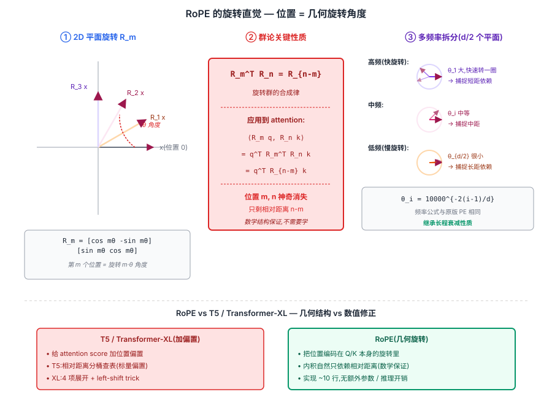
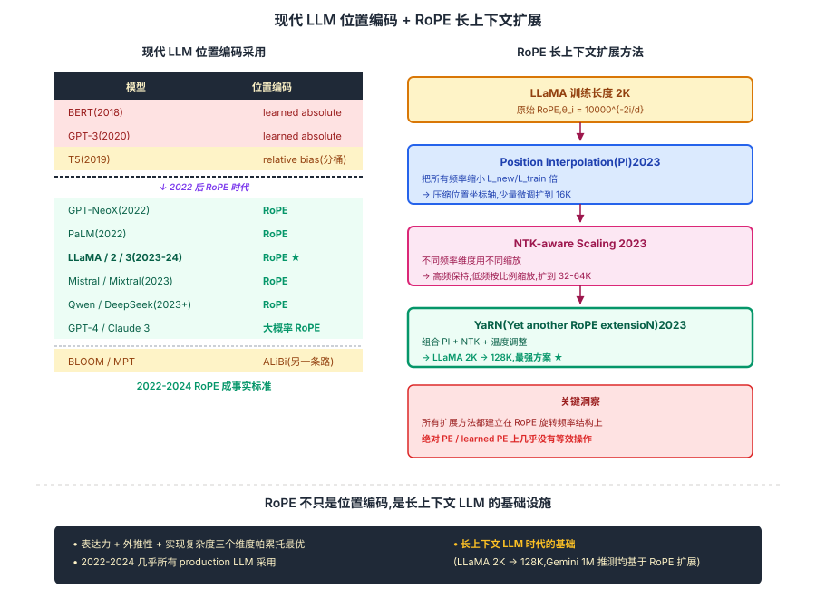

## 前作进展

[原版 Transformer](01-transformer.md) 用绝对正余弦 PE 把位置加到输入 embedding 上,这一方案在训练长度内工作良好但有几个一直没解决的问题:

**1. 外推差**——训练长度是 2048 token 的话,推理时遇到 2049 位置就开始出问题。正余弦 PE 理论上有外推能力(因为 sin/cos 是周期函数),但实践中绝对位置加在输入上后,**模型的 attention 行为在训练长度外快速退化**。learned PE 更糟,完全不能外推。

**2. 不是真正的相对位置**——`x_i + PE_i` 和 `x_j + PE_j` 做 attention 时,模型理论上能学到 `i - j` 的依赖,但需要模型自己从大量数据中"反推"出来,效率低。

**3. PE 和 token embedding 加在一起会污染语义**——两个不同位置的同一个 token,它们的 embedding 完全相同只是 PE 不同;加起来后 attention score 既包含语义相似度也包含位置相似度,两个信号纠缠在一起。

[Transformer-XL](02-transformer-xl.md) 的相对位置编码是第一次系统性的改进——把位置信息从输入移到 attention score 里,且只用相对距离 `i - j`。但 Transformer-XL 的方案是把 attention 公式展开成 4 项,每项各自处理位置——形式复杂,工程实现要 left-shift trick。**T5** 的 relative position bias 简化成"给 attention score 加一个标量偏置",更容易实现但表达力略弱。

苏剑林(Jianlin Su)2021 年 4 月发表的 *RoFormer*(RoPE = Rotary Position Embedding)给出了一个**几何上极其优雅、工程上极其简单**的方案——**把位置信息编码进 Q/K 向量的旋转角度里**。事后看,RoPE 在表达力 + 外推性 + 实现复杂度三个维度上都达到帕累托最优,后来被 LLaMA、PaLM、Mistral、Qwen 等几乎所有现代 LLM 采用,成为 2023+ 时代的事实标准。

## 核心思想

### 直觉:位置不该加在 token 上,该编码进 Q/K 的旋转角度里

理解 RoPE 真正需要先抓一件事:**原版 Transformer 的"x_i + PE_i"把语义和位置加在一起**——两个不同位置的同一个 token,embedding 完全一样只差 PE,加起来后 attention score 里语义和位置信号纠缠。[Transformer-XL](02-transformer-xl.md) 把位置从输入移到 score 里,但公式展开 4 项 + 需要 left-shift trick;T5 简化成"score 加分桶偏置"表达力略弱。苏剑林 2021 反问:**能不能让 attention 的内积 `q_m·k_n` 天然只依赖相对距离 m-n,从数学结构上保证、不需要模型反推?**

数学上要找 `f(x, m)`(把 token x 和位置 m 映射成带位置的向量)满足:

$$
\langle f(q, m), f(k, n) \rangle = g(q, k, m - n)
$$

苏剑林给出的解:**`f(x, m) = R_m · x`,R_m 是把 x 旋转 m·θ 角度的旋转矩阵**。因为旋转矩阵满足 `R_m^T R_n = R_{n-m}`,所以 `(R_m q)·(R_n k) = q·R_{n-m}·k` —— **内积自然只依赖相对距离**,数学保证不需要学。

三件事必须同时成立才让 RoPE 在 2021 年成立:

- **旋转的群论结构** — `R_m^T R_n = R_{n-m}` 保证内积只依赖 m-n,这是 RoPE 与 T5 加偏置的本质区别
- **多频率拆分(d/2 个 2D 平面)** — 频率 `θ_i = 10000^{-2(i-1)/d}` 让不同维度旋转速度不同,自然产生长程衰减,**继承原版正余弦 PE 的核心性质**
- **只对 Q/K 应用,V 不动** — V 承载内容信息,不该被位置污染;且 cos/sin 表预计算,推理无额外开销

三件事合起来:**RoPE 在表达力 + 外推性 + 实现复杂度三个维度上达到帕累托最优** — 2023+ 几乎所有现代 LLM(LLaMA / PaLM / Mistral / Qwen / GPT-4 推测)都用 RoPE。更重要的是,RoPE 的旋转数学结构让**长上下文扩展(Position Interpolation / NTK / YaRN)** 成为可能 —— LLaMA 2K 训练直接扩到 128K 推理,这在绝对 PE 上几乎做不到。从这角度,**RoPE 不只是位置编码,是长上下文 LLM 的基础设施**。


*图 1:**左** 2D 平面 R_m 旋转图解 — token 向量 x 在第 m 个位置被旋转 m·θ 角度;m 越大旋转越多,**位置直接对应几何旋转角度**。**中** 群论性质 — `(R_m q)·(R_n k) = q·R_{n-m}·k`,内积自然约去绝对位置,只剩相对距离 n-m。**右** 多频率拆分 — d/2 个 2D 平面,每个用不同频率 θ_i = 10000^{-2(i-1)/d};高频(快旋转)捕捉短距、低频(慢旋转)捕捉长距,**自然产生长程衰减**。底部 callout:对比 T5 relative bias(给 score 加标量)— RoPE 是把位置编码在 Q/K 本身,几何结构 vs 数值修正。*

### 机制一:旋转矩阵的群论结构 — 内积自然只依赖相对距离

核心数学:在 2D 平面上,旋转矩阵

$$
R_m = \begin{pmatrix} \cos m\theta & -\sin m\theta \\ \sin m\theta & \cos m\theta \end{pmatrix}
$$

满足 **`R_m^T R_n = R_{n-m}`**(旋转群的合成律)。所以:

$$
\langle R_m q, R_n k \rangle = q^T R_m^T R_n k = q^T R_{n-m} k
$$

**位置 m 和 n 神奇地消失了,只剩 n-m**。这一性质是几何结构保证,不需要训练学。

对比 Transformer-XL 的相对 PE:它把 attention score 展开成 4 项(内容-内容、内容-位置、位置-内容、位置-位置),每项加可学偏置。形式上能表达"只依赖 i-j",但需要 left-shift trick 实现 + 训练学到合适权重。**RoPE 把同一件事从"数值修正"提升到"几何结构"**,简单而严格。

### 机制二:多频率拆分 — d/2 个 2D 平面 + 长程衰减

实际 d_head 是几十到上百维,RoPE 把它拆成 d/2 个 2D 平面,每个平面用不同频率:

$$
\theta_i = 10000^{-2(i-1)/d}, \quad i = 1, 2, \ldots, d/2
$$

频率公式和原版正余弦 PE 一模一样 —— **故意继承"长程衰减"性质**:

- **高频维度**(θ_i 大,旋转快):相对距离稍微大一点就转过 2π,**只能捕捉短距依赖**(相邻几个 token)
- **低频维度**(θ_i 小,旋转慢):相对距离要很大才转过一圈,**捕捉长距依赖**(跨段语义)

把所有维度的内积加起来,**远距离时 q·R_{n-m}·k 在不同维度上"散开"成不相关的旋转,内积期望值下降** — 自然得到"远的词关系弱"的注意力衰减,不需要显式 attention mask。

每个 2D 平面单独旋转,合起来等价于给整个 q/k 向量一个 d 维旋转。代码上不需要构造 d×d 旋转矩阵,利用旋转的稀疏结构在 O(d) 时间完成:

```python
def apply_rope(x, cos, sin):
    x1, x2 = x[..., 0::2], x[..., 1::2]  # 偶数项 / 奇数项配对成 2D
    rotated = torch.stack([
        x1 * cos - x2 * sin,
        x1 * sin + x2 * cos,
    ], dim=-1)
    return rotated.flatten(-2)
```

### 机制三:只对 Q/K 应用 + cos/sin 预计算 — 工程零开销

RoPE 的两个关键工程细节:

- **只对 Q 和 K 应用 RoPE,V 不动** — V 承载内容信息(经 attention 加权后输出),**不应该被位置污染**;如果对 V 也旋转,输出 vector 会含位置信号,污染下一层的语义
- **cos/sin 表预计算 + buffer 缓存** — 它们只依赖位置 m 和频率 θ_i,不依赖输入。一次预计算所有 [seq_len, d] 大小的 cos/sin 表,推理时直接 lookup + 两次乘加,**完全没有额外可学参数,没有 left-shift 之类的特殊 kernel**

完整 RoPE attention(LLaMA 风格)只多 ~10 行代码 vs 原版 attention,推理无额外计算开销。这是 RoPE 战胜 Transformer-XL relative PE / T5 bucket bias 等所有相对位置方案的核心工程优势 —— **比"加偏置"更简单,但比"加偏置"理论更优雅**。

### 三件套协同:旋转结构 + 多频率 + 工程零开销 缺一不可

RoPE 在 2021 年发表后两年内被几乎所有现代 LLM 采用,**不是单一改进**,而是三件套同时调到协同点 —— 任何一个抽掉 RoPE 都不成立,这一点和 [ResNet](../01-cnn/05-resnet.md) 的 `shortcut + BN + He 初始化` 协同关系一致:

- **只有旋转结构,没有多频率拆分(单一频率)** — 失去长程衰减性质,远距离 token 内积仍可能很大;模型在长上下文上的"近词偏好"消失,长依赖学习困难
- **只有多频率,没有旋转(还用绝对 PE 加在输入)** — 频率公式继承自正余弦 PE,但加在输入端的纠缠问题没解决,attention 仍要从数据中"反推"相对位置
- **只有旋转 + 多频率,没有 cos/sin 预计算和"只对 Q/K"两个工程细节** — RoPE 在 paper 上理论优雅,但每次推理重算 cos/sin 或污染 V,**工程上不会被 LLaMA 这种 production-grade 模型采用**

三件套合起来才让 RoPE 同时拿到:几何严格的相对位置编码 + 自然长程衰减 + 零额外参数零额外开销。这也是为什么 2023 年的 **Position Interpolation / NTK-aware / YaRN** 等长上下文扩展方法**只能建立在 RoPE 上** — 它们都是利用 RoPE 的旋转频率结构做缩放,绝对 PE / learned PE 上没有对应的等效操作。


*图 2:**左** 现代 LLM 位置编码采用对比表 — GPT-3 / BERT(learned absolute)→ T5(relative bucket bias)→ GPT-NeoX / LLaMA / PaLM / Mistral / Qwen(**RoPE**),BLOOM / MPT(ALiBi);RoPE 在 2022-2024 成为事实标准。**右** RoPE 长上下文扩展方法 — Position Interpolation(把频率缩小 L_new/L_train 倍)/ NTK-aware Scaling(高频保持低频缩放)/ YaRN(组合 + 温度调整);LLaMA 2K → 16K → 128K 的扩展全部建立在 RoPE 旋转数学上。底部 callout:**绝对 PE / learned PE 上没有对应等效扩展** — RoPE 不只是位置编码,是长上下文 LLM 的基础设施。*

## Pre-LN 和 RMSNorm:配套的现代化

RoPE 在 2021–2023 流行起来的同时,Transformer block 内部的另外几件事也在同步现代化,几乎和 RoPE 一起成为现代 LLM 的标配:

**Pre-LN**(2019 Xiong, On Layer Normalization)——把 [原版 Transformer](01-transformer.md) 的 `LayerNorm(x + Sublayer(x))` 改成 `x + Sublayer(LayerNorm(x))`。LayerNorm 移到 sublayer 输入,残差直通。这让深层 Transformer 训练稳定得多,可以跳过 lr warmup,深度推到 100+ 层不掉。GPT-2 之后所有大模型都用 Pre-LN。

**RMSNorm**(2019 Zhang & Sennrich)——把 LayerNorm 的"减均值 + 除方差"简化成"只除 RMS":

$$
\text{LayerNorm}(x) = \gamma \cdot \frac{x - \mu}{\sigma} + \beta
$$

$$
\text{RMSNorm}(x) = \gamma \cdot \frac{x}{\sqrt{\frac{1}{d}\sum_i x_i^2}}
$$

去掉减均值和加偏置,参数少一半、计算快 ~7%,效果基本持平甚至略好(因为均值是冗余的)。LLaMA、Mistral 都用 Pre-RMSNorm。

**SwiGLU**(2020 Shazeer)——把 FFN 的 ReLU 换成 Gated Linear Unit + SiLU(Swish):

$$
\text{FFN}_{\text{vanilla}}(x) = \text{ReLU}(xW_1) W_2
$$

$$
\text{FFN}_{\text{SwiGLU}}(x) = (\text{SiLU}(xW_1) \odot xV) W_2
$$

多了一个 `V` 投影,FFN 参数从 2 个矩阵变 3 个,所以 `d_ff` 通常调小(`8/3 × d_model` 而不是 `4 × d_model`)保持参数量不变。SwiGLU 在所有 scaling law 实验里都比 ReLU/GeLU 略好,LLaMA 用它,GPT-4 大概率也用。

**所以一个 LLaMA 2 block 长这样**:

```python
class LlamaBlock(nn.Module):
    def forward(self, x, freqs_cos, freqs_sin):
        # Pre-RMSNorm + Attention + RoPE
        h = x + self.attn(self.norm1(x), freqs_cos, freqs_sin)
        # Pre-RMSNorm + SwiGLU FFN
        h = h + self.ffn(self.norm2(h))
        return h
```

对比原版 Transformer block——RoPE 替代正余弦 PE、Pre-RMSNorm 替代 Post-LayerNorm、SwiGLU 替代 ReLU FFN。三件事在概念上独立,但工程上一起成为 2023+ 的默认配方。

## 关键代码

完整的 RoPE attention 实现(简化版,基于 LLaMA 风格):

```python
import torch
import torch.nn as nn

def precompute_freqs(dim, max_len, base=10000.0):
    """预计算所有位置和频率的 cos/sin 表"""
    freqs = 1.0 / (base ** (torch.arange(0, dim, 2).float() / dim))  # [d/2]
    t = torch.arange(max_len).float()                                # [seq_len]
    freqs = torch.outer(t, freqs)                                    # [seq_len, d/2]
    cos = freqs.cos().repeat_interleave(2, dim=-1)                   # [seq_len, d]
    sin = freqs.sin().repeat_interleave(2, dim=-1)                   # [seq_len, d]
    return cos, sin

def apply_rope(x, cos, sin):
    """对 [B, h, N, d] 应用 RoPE"""
    # x_rot: 把每对相邻维度做 90 度旋转 (x_{2i+1}, -x_{2i})
    x_rot = torch.stack([-x[..., 1::2], x[..., 0::2]], dim=-1).flatten(-2)
    # 注意 cos 和 sin 已经 repeat 成 d 维,直接相乘即可
    return x * cos + x_rot * sin

class RoPEAttention(nn.Module):
    def __init__(self, d_model, num_heads, max_len=4096):
        super().__init__()
        self.h = num_heads
        self.d_k = d_model // num_heads
        self.qkv_proj = nn.Linear(d_model, 3 * d_model)
        self.out_proj = nn.Linear(d_model, d_model)
        cos, sin = precompute_freqs(self.d_k, max_len)
        self.register_buffer("cos", cos)
        self.register_buffer("sin", sin)

    def forward(self, x):
        B, N, _ = x.shape
        qkv = self.qkv_proj(x)
        q, k, v = [t.view(B, N, self.h, self.d_k).transpose(1, 2)
                   for t in qkv.chunk(3, dim=-1)]
        # 关键:对 Q 和 K 应用 RoPE(V 不动)
        cos, sin = self.cos[:N], self.sin[:N]
        q = apply_rope(q, cos, sin)
        k = apply_rope(k, cos, sin)
        # 后面就是标准 scaled dot-product attention
        scores = torch.matmul(q, k.transpose(-2, -1)) / (self.d_k ** 0.5)
        attn = torch.softmax(scores, dim=-1)
        out = torch.matmul(attn, v).transpose(1, 2).reshape(B, N, -1)
        return self.out_proj(out)
```

注意几个工程要点:

- **只对 Q 和 K 应用 RoPE,V 不动**——V 是承载内容信息的,不应该被位置污染
- **cos/sin 可以预计算并缓存**——它们只依赖位置和频率,不依赖输入
- **`x_rot` 那一行实现的是 90 度旋转的等价形式**——`(x_{2i}, x_{2i+1}) → (-x_{2i+1}, x_{2i})`,然后 `x*cos + x_rot*sin` 就是完整的 RoPE 旋转

整个 RoPE 实现 ~10 行,没有额外参数(`cos/sin` 是 buffer 不是 parameter),推理时也没有额外计算开销——这是 RoPE 战胜其他相对位置方案的核心工程优势。

## 影响 / 后续

RoPE 在 2021 年发表后两年内被几乎所有现代 LLM 采用:

| 模型 | 位置编码 | 发布 |
|------|------|------|
| GPT-3(2020) | learned absolute | 2020 |
| BERT(2018) | learned absolute | 2018 |
| T5(2019) | relative bias(分桶) | 2019 |
| GPT-NeoX(2022) | **RoPE** | 2022 |
| LLaMA(2023) | **RoPE** | 2023 |
| LLaMA 2 / 3(2023–24) | **RoPE** | 2023 |
| PaLM(2022) | **RoPE** | 2022 |
| Mistral / Mixtral(2023) | **RoPE** | 2023 |
| Qwen(2023) | **RoPE** | 2023 |
| GPT-4 / Claude 3(推测) | 大概率 RoPE 或类似 | 2023–24 |

唯一持续使用其他方案的主流模型是 BLOOM 和 MPT,它们用 **ALiBi**(Press 2021)——不用 PE,直接给 attention score 加一个与 `|i-j|` 成正比的负偏置。ALiBi 在外推性上更激进(理论上无限长),但表达力略弱,主流选择仍是 RoPE。

RoPE 的成功也催生了 2023 年的 **长上下文扩展**子领域。原版 LLaMA 训练长度 2K,但通过 RoPE 的几个简单 trick 就能扩到长得多的上下文:

- **Position Interpolation(PI)** —— 把 RoPE 的频率缩小 `L_new / L_train` 倍,等价于"压缩位置坐标轴"。少量微调就能让 LLaMA 2K → 16K
- **NTK-aware Scaling** —— 不同频率维度用不同缩放因子,高频(短程)保持原样,低频(长程)按比例缩放
- **YaRN**(Yet another RoPE extensioN)—— 组合 PI + NTK + 温度调整,LLaMA 2K → 128K 的最强方案

这些方法都是建立在 RoPE 的旋转数学结构上的——**绝对 PE 和 learned PE 上几乎不存在等效的"上下文扩展"方法**。从这个角度,RoPE 不只是一个位置编码,它是**长上下文 LLM 的基础设施**。

→ [05-flash-attention.md](05-flash-attention.md) · 与 RoPE 完全正交,attention 算法 + RoPE 位置 = 现代 LLM 标配
→ [02-transformer-xl.md](02-transformer-xl.md) · 相对位置思想的早期推广
→ [03-sparse-attention.md](03-sparse-attention.md) · 长上下文的另一条路线,可以和 RoPE 组合
→ [01-transformer.md](01-transformer.md) · 父结构,原版绝对 PE 被本节点取代
→ [../07-gpt-scaling/](../07-gpt-scaling/) · LLaMA / GPT 系都用 RoPE
