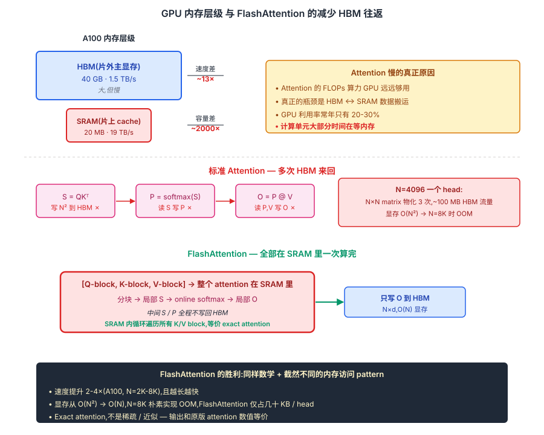
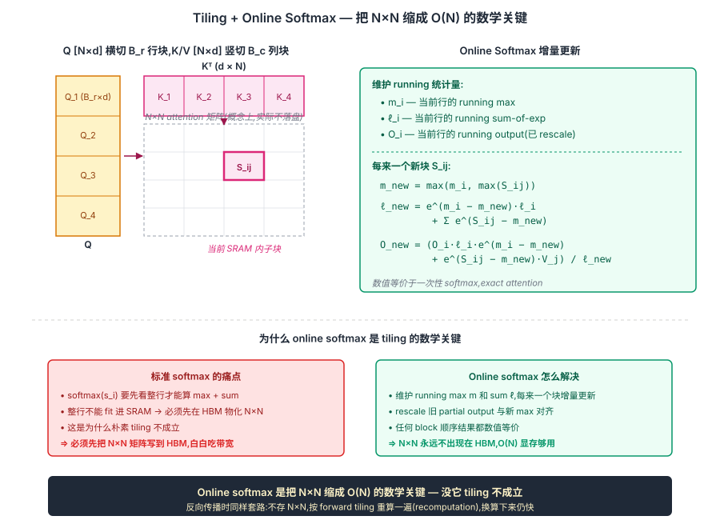

## 前作进展

到 2022 年初,Transformer 在 NLP / 视觉 / 多模态全面统治后,长上下文成为最持续的瓶颈。前面三个节点各自从算法层面尝试解决:

- [Transformer-XL](02-transformer-xl.md) — segment cache,但段内仍 O(L²)
- [Sparse Attention](03-sparse-attention.md) — O(N) 但需要稀疏模式设计 + CUDA kernel
- [RoPE](04-rope.md) — 改善 PE 外推,但 attention 本身复杂度没变

但所有这些方案都在**算法层面**改 attention 的数学定义。Tri Dao 等人在斯坦福(Christopher Ré 组)从一个完全不同的角度看这件事:**原版 dense attention 慢/吃显存,不是因为 FLOPs 多,而是因为 HBM 访存太多**。

这个观察来自对 GPU 内存层级的认真分析:

| 层级 | 容量 | 带宽 | 延迟 |
|------|------|------|------|
| **SRAM**(片上,L1/L2 cache 级别) | 20 MB(A100) | **19 TB/s** | ~10 ns |
| **HBM**(片外,主显存) | 40-80 GB | **1.5-2 TB/s** | ~400 ns |

SRAM 比 HBM 快 **10×**,但容量小 **3000×**。当你做 attention 时:

```python
# 朴素实现
S = Q @ K.T          # [N, N] — 要写到 HBM
P = softmax(S)       # 读 S,写回 [N, N] — 又一次 HBM 来回
O = P @ V            # 读 P 和 V,写 O — 再一次 HBM 来回
```

每个 attention 都要把 `N × N` 矩阵在 HBM 上**物化三次**,N=4096 时是 `4096² × 2 bytes × 3 次 ≈ 100 MB / head / layer / batch`。GPU 的算力(312 TFLOPs A100)远远大于带宽能喂的数据量,**计算单元大部分时间在等内存**,GPU 利用率只有 20–30%。

更糟的是,反向传播需要 `S` 和 `P` 重新算梯度,所以要把它们**存到 HBM 等反传**——`O(N²)` 显存代价。

FlashAttention 的核心观察:**`N × N` 矩阵根本不应该物化,attention 应该完全在 SRAM 里算**。

## 核心思想

### 直觉:Attention 慢不是算得多,是 HBM 读写多

理解 FlashAttention 真正需要先抓一件事:**标准 attention 在 GPU 上的瓶颈不是 FLOPs,而是 HBM ↔ SRAM 的数据搬运**。GPU 的算力(A100 312 TFLOPs)早就远远大于带宽能喂的数据量,attention 慢的根因是 N×N 矩阵被反复写回 / 读出 HBM —— softmax 看一次、`P @ V` 再看一次,每一步都在 HBM 上多走一个来回。GPU 计算单元大部分时间在等内存,利用率常年 20-30%。

Tri Dao 等人 2022 的洞察:**整个 N×N matrix 根本不应该在 HBM 上物化,attention 应该完全在 SRAM 里算完只把最终 O 写出去**。这件事在 2022 年才被做出来,因为它需要三件事同时成立:

- **tiling 能把 Q/K/V 切成 SRAM 装得下的块** —— SRAM 20MB,N=4096 时 N×N 矩阵 32MB 装不下,必须分块
- **online softmax 允许 softmax 流式更新** —— 普通 softmax 要看整行,流式版本数学等价但能按 block 增量算
- **recomputation 接受反向多算一遍换显存** —— 反向需要的 S/P 不存,按 forward tiling 重算一遍

三件事合起来才让"在 SRAM 里一次算完 attention"在 2022 年第一次工程实现。重要的是 FlashAttention 是 **exact attention**(数值等价于原版 dense attention),不是 sparse / linear / kernel approximation —— 它**完全没改 attention 的数学定义**,只重写了内存访问 pattern。这是它能被无痛接入所有现代 LLM 的根因。


*图 1:**顶部** A100 内存层级——HBM 40GB @ 1.5TB/s vs SRAM 20MB @ 19TB/s,速度差 13× 容量差 2000×。**中间 标准 Attention**——S = QKᵀ 写 HBM、softmax 读写 HBM、P @ V 读写 HBM,N×N 矩阵被物化 3 次,N=8K OOM。**底部 FlashAttention**——整个 attention 在 SRAM 一次算完,只把 O 写回 HBM,中间 S/P 全程不落盘。同样数学 + 截然不同的内存访问 pattern,速度提升 2-4× 且 N 越长越快。*

### 机制一:Tiling — 把 Q/K/V 切块在 SRAM 里 blockwise 算

第一个 trick 是把 Q [N×d] 横切成 B_r 行的块,K/V [N×d] 竖切成 B_c 列的块(典型 B_r = B_c = 128),每次只把一对 Q-block 和 K/V-block 加载到 SRAM:

```
对每个 Q_i (Q 的第 i 行块):
    对每个 K_j, V_j (K/V 的第 j 列块):
        把 Q_i, K_j, V_j 加载到 SRAM
        在 SRAM 里算 S_ij = Q_i @ K_j.T  (B_r × B_c, 小到能装下)
        更新输出 O_i 和 softmax 统计量
```

整个 N×N attention 矩阵从来不在 HBM 里实体化 —— 每个 S_ij 算完用一下就被覆盖。这一改动直接把显存从 O(N²) 降到 O(N) ,N=8K 朴素实现 OOM 而 FlashAttention 只占几十 KB / head。

但 tiling 单独不成立 —— softmax 需要看整行才能算 max + sum,看似必须先把整行算完。这正是机制二要解决的。

### 机制二:Online Softmax — 不落盘 N×N 的数学关键

普通 softmax 数学上必须看整行:`softmax(s)_i = exp(s_i - max(s)) / sum_k exp(s_k - max(s))` —— max 和 sum 都是 row-level reduce。如果 attention 按列 block 切,每次只看一段 K,根本不知道全行的 max 和 sum。

FlashAttention 用 **online softmax**(Milakov 2018 提出,Tri Dao 把它接进 attention 是核心创新):**只维护当前 running max m_i 和 running sum-of-exp ℓ_i,每来一个新 block 用一次 rescale 把旧 partial output 更新到与新 max 一致**:

$$
m_i^{\text{new}} = \max(m_i, \max(S_{ij}))
$$

$$
\ell_i^{\text{new}} = e^{m_i - m_i^{\text{new}}} \ell_i + \sum_k e^{S_{ij,k} - m_i^{\text{new}}}
$$

$$
O_i^{\text{new}} = \frac{\ell_i \cdot e^{m_i - m_i^{\text{new}}}}{\ell_i^{\text{new}}} O_i + \frac{1}{\ell_i^{\text{new}}} \sum_k e^{S_{ij,k} - m_i^{\text{new}}} V_{j,k}
$$

任意 block 顺序的最终结果**与一次性 softmax 数值完全等价**。这是 FlashAttention 是 exact attention 的数学保证 —— 没有任何近似,只是用增量计算替代一次性。


*图 2:**左** Q 横切 B_r 行块、K 竖切 B_c 列块,中间虚线 N×N 矩阵表示"概念上存在但实际不落盘",高亮当前正在 SRAM 内处理的 S_ij 小块。**右** online softmax 增量更新:维护 m_i / ℓ_i / O_i 三个 running 统计量,每来一个新块用一次 rescale 把旧 partial 与新 max 对齐,任意 block 顺序数值等价。**下** 对比 callout:标准 softmax 要看整行,必须在 HBM 物化 N×N;online softmax 只看局部块,N×N 永远不出现在 HBM。底部强调:online softmax 是把 N×N 缩成 O(N) 的数学关键 — 没它 tiling 不成立。*

### 机制三:Recomputation in Backward — 反向不存中间,直接重算

反向传播 attention 需要 forward 算过的 S 和 P 来算梯度。标准做法是 forward 时把它们存在 HBM,反向时读出来用。但这又把 O(N²) 显存吃回去 —— 整个机制一二的努力被反向吃光。

FlashAttention 的反向选择 **不存 S/P,按 forward 同样的 tiling 重算一遍**。只在 HBM 存最终输出 O、softmax 统计量 (m, ℓ)、原始 Q/K/V。反向时用这些一边重新 tile 一边算梯度。

代价:反向 FLOPs 多 2.5× —— 但因为大部分时间被内存带宽卡住,**实际 wall-clock 时间反而短**。这是经典的"以计算换内存" trade-off。换算下来:省了 N²·batch 大的显存,多 ~20% 总训练算力,但**端到端训练时间还更短**,因为内存搬运也省掉。

### 三件套协同:tiling + online softmax + recomputation 缺一不可

FlashAttention 在 2022 年能成立并改写 LLM 工业基础设施,**不是单一改进**,而是三件套同时调到协同点 —— 任何一个抽掉 FlashAttention 都不成立,这一点和 [ResNet](../01-cnn/05-resnet.md) 的 `shortcut + BN + He 初始化` 协同关系一致:

- **只有 tiling,没有 online softmax** —— softmax 还是要看整行,必须先把 N×N 物化到 HBM 再 softmax,tiling 没意义,还是 O(N²) HBM 流量
- **只有 online softmax,没有 tiling** —— 仍然按整行算,SRAM 装不下,online 算法在算法层面成立但 GPU 上跑不动
- **只有 tiling + online softmax,没有 recomputation** —— 反向时 N²·b 的 S/P 还是要写 HBM,机制一二把 forward 优化了但 backward 把显存吃回去,整体显存 / 速度都退化

三件套合起来才让 attention 在 **2-4× 速度 + 5-20× 长度** 两个维度上同时双赢。这是为什么 FlashAttention 在 2022 年发表后两年内成为 PyTorch / HuggingFace / vLLM 的默认 attention backend —— 它不是"另一个 attention 变体",它是 attention 该有的样子。

## 性能数据

FlashAttention 的论文报告(A100,fp16):

| 序列长度 | 朴素 PyTorch attention | FlashAttention | 加速 |
|------|------|------|------|
| 512 | 1.4 ms | 0.4 ms | 3.5× |
| 1024 | 5.7 ms | 1.0 ms | 5.7× |
| 2048 | 22.8 ms | 2.4 ms | 9.5× |
| 4096 | OOM | 7.1 ms | ∞ |
| 8192 | OOM | 26.8 ms | ∞ |

**显存:O(N²) → O(N)**。N=8K 时朴素实现要 256 MB / head / layer / batch,FlashAttention 只要 64 KB / head / layer / batch——少 **4000×**。

端到端训练:GPT-2 medium 训练快 **2.4×**(因为模型里其他部分也吃时间),BERT-large 训练快 **15%**。看起来不夸张,但这个加速是**免费的、完全等价**——和 sparse attention 用精度换速度不同。

## 三个版本的演化

- **FlashAttention v1**(2022 May)—— Tri Dao 单作者的原版,确立分块 + online softmax + 重计算的核心算法
- **FlashAttention v2**(2023 July)—— 重排循环顺序、更好的 warp 分工,A100 上再快 **2×**(理论极限的 ~70%)
- **FlashAttention v3**(2024 July)—— H100-specific 优化,利用 Hopper 的 WGMMA 和异步执行,H100 上达到理论极限的 **75%**;fp8 路径下达到 **1.2 PFLOPs/s**

每一代都是"算法不变 + 硬件特定优化"——这种持续投入也反映了 FlashAttention 在 LLM 工业链里的核心地位:**几乎所有现代 LLM 训练/推理都跑在 FlashAttention 上**。

## GQA / MQA:推理时代的多头演化

FlashAttention 让训练时的 attention 不再是瓶颈,但**推理时**(尤其长上下文生成)又冒出新瓶颈——**KV cache**。

自回归生成时,每个新 token 都要 attend 到所有之前的 token。为了避免每步重算前面所有 K/V,标准做法是把 K/V cache 在显存里,每步只算新 token 的 K/V 并 append。但 KV cache 的大小是:

$$
\text{KV cache} = 2 \times N \times L \times h \times d_k \times \text{bytes}
$$

LLaMA-2-70B 在 N=4096 上下文上:`2 × 4096 × 80 × 64 × 128 × 2 bytes = 10.7 GB / batch`。一个 80GB 的 A100 在 batch=4 时 cache 就占 43 GB,严重限制并发。

**Multi-Query Attention(MQA, Shazeer 2019)** 和 **Grouped-Query Attention(GQA, Ainslie 2023)** 给出的方案是 **共享 K/V 头**:

- **MHA**(原版):每个 head 有独立的 Q、K、V → `h` 套 K/V
- **MQA**:`h` 套 Q,但所有 head 共享 1 套 K/V → KV cache 降到 1/h
- **GQA**:把 `h` 个 head 分成 `g` 组,每组共享 1 套 K/V → KV cache 降到 g/h

MQA 太激进,质量掉点;GQA 是平衡选择,`g=8` 时质量几乎不掉、KV cache 降到 1/4。LLaMA 2 在 7B 上用 MHA、在 34B/70B 上用 GQA(`g=8`),Mistral / Mixtral / Qwen / Claude 3 也都用 GQA。

这是 attention 在头维度上的"稀疏化"——和 FlashAttention 在序列维度上的优化完全正交、可以同时用。**现代 LLM 推理 = FlashAttention + GQA**。

## 关键代码

完整 FlashAttention CUDA kernel 几千行(在 `flash-attn` 仓库),核心算法用 Python 写大概是这样:

```python
import torch

def flash_attention(Q, K, V, block_size=128):
    """简化版 FlashAttention(教学用,真实实现要 CUDA kernel)"""
    B, h, N, d = Q.shape
    scale = 1.0 / (d ** 0.5)

    # 输出和 softmax 统计量
    O = torch.zeros_like(Q)
    L = torch.zeros(B, h, N, device=Q.device)  # row sum of exp
    M = torch.full((B, h, N), -float('inf'), device=Q.device)  # row max

    Br = Bc = block_size
    Tr = (N + Br - 1) // Br  # Q 的 block 数
    Tc = (N + Bc - 1) // Bc  # K 的 block 数

    for i in range(Tr):
        Q_i = Q[:, :, i*Br:(i+1)*Br]                          # [B, h, Br, d]
        O_i = O[:, :, i*Br:(i+1)*Br]
        l_i = L[:, :, i*Br:(i+1)*Br]                          # [B, h, Br]
        m_i = M[:, :, i*Br:(i+1)*Br]

        for j in range(Tc):
            K_j = K[:, :, j*Bc:(j+1)*Bc]
            V_j = V[:, :, j*Bc:(j+1)*Bc]

            # 在 SRAM 里算这个 block 的 partial attention
            S_ij = (Q_i @ K_j.transpose(-2, -1)) * scale     # [B, h, Br, Bc]
            m_ij = S_ij.max(dim=-1).values                    # [B, h, Br]
            P_ij = torch.exp(S_ij - m_ij.unsqueeze(-1))       # 数值稳定 exp
            l_ij = P_ij.sum(dim=-1)

            # online softmax 更新
            m_new = torch.maximum(m_i, m_ij)
            alpha = torch.exp(m_i - m_new)                    # 旧统计量的 rescale
            beta = torch.exp(m_ij - m_new)
            l_new = alpha * l_i + beta * l_ij

            # 更新输出 — 用 rescale 把 O_i 调到与 m_new 一致的尺度
            O_i = (l_i.unsqueeze(-1) * alpha.unsqueeze(-1) * O_i +
                   beta.unsqueeze(-1) * (P_ij @ V_j)) / l_new.unsqueeze(-1)
            m_i, l_i = m_new, l_new

        O[:, :, i*Br:(i+1)*Br] = O_i
        L[:, :, i*Br:(i+1)*Br] = l_i
        M[:, :, i*Br:(i+1)*Br] = m_i

    return O
```

这个 Python 实现**比朴素 PyTorch attention 慢很多**——因为它没在 SRAM 里跑,每个 block 仍要走 HBM。真正的加速来自 CUDA kernel——把内部双重循环融合到一个 kernel 里,Q-block / K-block 直接从 HBM 加载到 SRAM,中间所有 `S_ij, P_ij` 都不写回 HBM。教学版只是为了说明"online softmax + 分块计算 = exact attention"的算法等价性。

实际用 FlashAttention 的代码非常简单:

```python
# PyTorch 2.0+ 内置
import torch.nn.functional as F
O = F.scaled_dot_product_attention(Q, K, V)  # 后端自动选 FlashAttention

# 直接用 flash-attn 库(更多控制)
from flash_attn import flash_attn_func
O = flash_attn_func(Q, K, V, causal=True)
```

一行替代,**所有 attention 自动加速**。这是 FlashAttention 工业影响力的关键——零开发成本接入。

## 影响 / 后续

FlashAttention 在 2022 年发表后两年内成为深度学习基础设施的一部分:

- **PyTorch 2.0**(2023 March)把 FlashAttention 集成进 `F.scaled_dot_product_attention`,所有 PyTorch attention 默认走它
- **HuggingFace Transformers** 添加 `attn_implementation="flash_attention_2"` flag,一行启用
- **vLLM / TGI / TensorRT-LLM** 等推理框架全部内置 FlashAttention 作为 default backend
- **xFormers**(Meta)、**FlashAttention-2/3** 持续优化迭代,跟进新硬件(A100 → H100 → B200)

FlashAttention 的更深影响是**重新定义了 attention 优化的方向**——从"算法层面减少 FLOPs"(稀疏 attention)转向"系统层面优化内存访问"。这一思路被推广到很多其他算子:

- **Linear Attention 的工业实现** — 类似的分块 + recompute 思路被用到 Linear Attention(RWKV、Mamba 等),让 O(N) 算法的工程效率匹配 FlashAttention
- **Flash Decoding**(2023) — 推理特定优化,把 KV cache 划分到多个 SM 并行
- **PagedAttention**(vLLM)— KV cache 的分页管理,和 FlashAttention 互补
- **Triton 编程模型** — Tri Dao 把 FlashAttention 用 Triton 重写后,Triton 成为写自定义 GPU kernel 的主流选择(替代手写 CUDA)

更广义地说,FlashAttention 是**深度学习从"算法优先"转向"硬件协同设计"的标志事件**。在它之前,论文里几乎只关心 FLOPs;在它之后,内存带宽、SRAM 利用率、kernel fusion 这些系统指标进入了主流讨论。今天的 LLM 训练已经几乎完全是"系统问题"——FlashAttention、3D parallelism、FSDP、ZeRO 这些工程优化的影响超过了算法本身。

→ [01-transformer.md](01-transformer.md) · 父结构;FlashAttention 是 attention 的系统级实现
→ [03-sparse-attention.md](03-sparse-attention.md) · 算法路线;FlashAttention 部分淘汰了它在 64K 以下的场景
→ [04-rope.md](04-rope.md) · 位置编码,与 FlashAttention 完全正交
→ [../07-gpt-scaling/](../07-gpt-scaling/) · 现代 LLM 的训练和推理都跑在 FlashAttention + GQA 上
→ [../13-moe-efficient/](../13-moe-efficient/) · 高效化的系统路线,与 FlashAttention 同源
