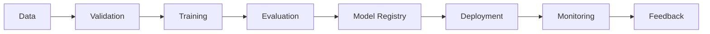

# 端到端部署链路（End-to-End Deployment Pipeline）

> 目标：给出一个覆盖“数据 → 训练 → 评估 → 部署 → 监控”的端到端部署链路（End-to-End Deployment Pipeline）完整技术文档，包含 CI/CD、模型注册（Model Registry）、服务编排（Orchestration）、监控与可观测性（Observability）、以及基础设施即代码（Infrastructure as Code, IaC）落地示例。

---

## 1. 背景（Deployment complexity）

在 LLM 时代，“把模型上线”不再是单一动作，而是一条跨团队、跨系统的生产链路：

- **数据复杂度（Data complexity）**：数据版本化、质量检测、隐私合规（PII）、多源数据合并与去重。
- **训练复杂度（Training complexity）**：多阶段训练（预训练/指令微调/偏好优化）、分布式训练、算力成本与可复现实验。
- **评估复杂度（Evaluation complexity）**：离线指标（offline metrics）与线上指标（online metrics）不一致，存在数据漂移（data drift）。
- **部署复杂度（Deployment complexity）**：模型注册（model registry）、灰度发布（canary release）、流量切分（traffic split）、回滚策略（rollback）。
- **监控复杂度（Monitoring complexity）**：端到端 SLI/SLO、延迟/吞吐/成本/质量统一观测，且覆盖训练与推理全链路。

### 1.1 风险矩阵（Risk matrix）

| 风险类型 | 影响 | 触发因素 | 典型缓解措施 |
|---|---|---|---|
| 数据风险 | 质量下降 | 数据漂移 | 数据监控 + 再训练 |
| 模型风险 | 幻觉上升 | 数据分布变化 | 灰度发布 + 在线评估 |
| 系统风险 | 延迟飙升 | 流量激增 | 限流 + 扩缩容 |
| 成本风险 | 预算超支 | 资源浪费 | 量化/缓存 + FinOps |

一个可靠的端到端部署链路应当做到：

1. **可追溯（Traceability）**：任何线上模型都能追溯其数据版本、训练配置与代码版本。
2. **可复现（Reproducibility）**：训练与评估在可控环境中重复执行得到一致结果。
3. **可迭代（Iterability）**：小步快跑，通过自动化 CI/CD 将改动安全送达线上。
4. **可观测（Observability）**：将质量、成本、性能统一纳入可观测系统。

下面给出一个完整的“端到端部署链路（End-to-End Deployment Pipeline）”参考实现，从理念到代码、从指标到实验对比。

---

## 2. 核心概念（Pipeline stages, CI/CD）

### 2.1 端到端链路总览（Pipeline overview）

```
数据采集 → 数据处理 → 数据验证 → 训练 → 评估 → 模型注册 → 部署 → 监控 → 反馈闭环
```

一个典型 LLM 系统的部署链路结构可表示为：

```
┌─────────┐   ┌─────────┐   ┌──────────┐   ┌──────────┐
│  数据层  │ → │  训练层  │ → │  评估层   │ → │  注册层   │
└─────────┘   └─────────┘   └──────────┘   └──────────┘
        ↓            ↓             ↓              ↓
   数据漂移监控  训练资源监控  指标监控  版本与元数据管理
        ↓            ↓             ↓              ↓
┌────────────────────────────────────────────────────┐
│                   部署与服务层（Serving）           │
│  Batch Serving | Online Serving | Streaming Serving │
└────────────────────────────────────────────────────┘
                            ↓
                  监控与可观测性（Observability）
                            ↓
                     反馈闭环（Feedback Loop）
```

### 2.2 关键阶段定义

- **数据（Data）**：数据采集、清洗、标注、去重、分桶与版本管理。
- **训练（Training）**：训练代码、配置管理、实验跟踪（Experiment Tracking）。
- **评估（Evaluation）**：离线评估（Offline Eval）与线上评估（Online Eval）。
- **模型注册（Model Registry）**：版本化、审计、审批、跨环境推广（Dev → Staging → Prod）。
- **部署（Deployment）**：容器化、编排、流量管理、策略控制。
- **监控（Monitoring）**：模型质量、系统性能、成本、漂移与安全。

### 2.3 CI/CD for ML（GitHub Actions / GitLab CI）

LLM 系统的 CI/CD 不仅是“测试+部署”，还必须包含数据、训练、评估的自动化流程：

- **CI（Continuous Integration）**：代码静态检查、单元测试、数据质量校验、训练 smoke test。
- **CD（Continuous Delivery/Deployment）**：自动注册模型、部署服务、灰度发布、监控验证。

#### 2.3.1 CI/CD 检查清单（Checklist）

1. 代码风格检查（Lint）与单元测试（Unit Test）。
2. 数据验证（Data Validation）与提示回归测试（Prompt Regression）。
3. 训练冒烟测试（Training Smoke Test）。
4. 评估指标门禁（Quality Gate）。
5. 镜像构建与安全扫描（Image Scan）。
6. 部署到 Staging 并监控 30 分钟。
7. 通过人工审批后推广到 Production。

### 2.4 模型注册与版本控制（MLflow Model Registry）

模型注册用于统一管理模型版本、训练配置、评估结果与审批流程。典型流程：

1. 训练产出模型并记录指标（metrics）。
2. 在 MLflow 中注册模型（Model Registry）。
3. 通过审批（stage transition）推广到 Staging/Production。

### 2.5 服务架构（Serving Architectures）

- **批处理服务（Batch Serving）**：离线批量推理，适合低实时性任务。
- **在线服务（Online Serving）**：实时接口（REST/gRPC），适合低延迟场景。
- **流式服务（Streaming Serving）**：流式输入输出（Kafka/Streaming），适合事件驱动场景。

### 2.6 监控与可观测性（Monitoring & Observability）

必须覆盖：

- **性能指标（Performance）**：延迟（latency）、吞吐（throughput）、错误率（error rate）。
- **质量指标（Quality）**：准确率、幻觉率（hallucination rate）、安全性指标。
- **数据指标（Data）**：漂移检测（drift detection）、分布变化。
- **成本指标（Cost）**：GPU 使用率、单位请求成本（cost per request）。

### 2.7 Pipeline 架构分层（Architecture layers）

端到端链路通常被拆成 5 个层级，每一层都有明确接口与责任边界：

1. **数据层（Data layer）**：采集、清洗、标签、权限、版本。
2. **实验层（Experiment layer）**：训练配置、超参、随机种子、指标记录。
3. **注册层（Registry layer）**：模型版本、元数据、审批流。
4. **服务层（Serving layer）**：批处理、在线、流式推理服务。
5. **观测层（Observability layer）**：指标、日志、追踪、告警。

### 2.8 模型生命周期（Model lifecycle）

模型注册（Model Registry）推荐遵循以下生命周期：

```
Development → Staging → Production → Archived
```

- **Development**：实验阶段，主要验证可行性。
- **Staging**：准生产环境，验证稳定性。
- **Production**：线上版本，承载真实流量。
- **Archived**：历史版本，保留审计证据。

### 2.9 编排与调度（Orchestration）

部署链路中的“数据处理 → 训练 → 评估 → 注册”常用编排工具：

- **Airflow（DAG）**：传统批处理与定时任务。
- **Argo Workflows**：K8s 原生编排，适合云原生场景。
- **Kubeflow Pipelines**：面向 ML 的工作流，支持组件化复用。

### 2.10 质量门禁（Quality Gates）

在 CI/CD 中应设置多个门禁点，只有满足条件才能进入下一阶段：

- **数据门禁**：数据缺失率 < 1%，异常值比例 < 0.5%。
- **训练门禁**：训练 loss 不发散，收敛稳定。
- **评估门禁**：离线指标不低于基线（baseline）。
- **成本门禁**：单位请求成本不超过预算上限。

### 2.11 线上反馈闭环（Feedback loop）

线上反馈包含三类信号：

- **显式反馈（Explicit feedback）**：用户评分、点赞、标注。
- **隐式反馈（Implicit feedback）**：停留时间、点击率、跳出率。
- **系统反馈（System feedback）**：错误率、延迟、负载。

这些信号会进入后续训练与评估，构成 **闭环（Closed loop）**。

### 2.12 安全与合规（Security & Compliance）

- **访问控制（RBAC）**：模型注册与部署操作必须授权。
- **数据合规（Compliance）**：对 PII 数据脱敏与审计。
- **供应链安全（Supply Chain）**：镜像签名（image signing）、依赖扫描（dependency scanning）。

### 2.13 数据版本与谱系（Data Versioning & Lineage）

- **数据版本（Data Version）**：每一次训练都绑定唯一数据快照。
- **数据谱系（Lineage）**：追踪数据从采集到训练的全链路路径。
- **工具示例**：DVC（Data Version Control）、LakeFS。

### 2.14 特征与提示管理（Feature/Prompt Management）

LLM 系统中“提示（Prompt）”本质上也是一种特征，需要：

- **提示版本（Prompt Version）**：记录每次提示模板变更。
- **提示回归测试（Prompt Regression Test）**：确保改动不会导致质量回退。

### 2.15 成本治理（Cost Governance）

- **预算上限（Budget Ceiling）**：单位请求成本上限。
- **资源配额（Quota）**：训练与推理资源的配额管理。
- **FinOps 协作**：将成本指标纳入 CI/CD 门禁。

### 2.16 服务拓扑（Serving Topology）

- **边缘（Edge）**：靠近用户，减少延迟。
- **中心（Core）**：集中算力，便于管理。
- **混合（Hybrid）**：热点流量在边缘，长尾在中心。

### 2.17 流量管理（Traffic Management）

- **限流（Rate Limiting）**：避免突发流量击穿。
- **熔断（Circuit Breaker）**：当下游异常时快速失败。
- **重试与退避（Retry/Backoff）**：降低瞬时错误影响。

### 2.18 观测栈（Observability Stack）

- **Metrics**：Prometheus + Grafana
- **Logs**：Loki / ELK
- **Traces**：OpenTelemetry + Tempo/Jaeger
- **Alerts**：Alertmanager

### 2.19 端到端流程拆解（Detailed stages）

**数据阶段（Data Stage）**

- 数据进入前先做 **Schema 校验（Schema Validation）** 与 **PII 脱敏（PII Redaction）**。
- 对训练数据做 **版本化（Versioning）** 与 **数据快照（Snapshot）**，确保每次训练可回溯。

**训练阶段（Training Stage）**

- 训练配置（Config）必须固定随机种子（Seed），记录训练环境（Environment）与依赖版本（Dependencies）。
- 如果使用分布式训练，应记录 **并行策略（Parallelism Strategy）** 与 **通信拓扑（Topology）**。

**评估阶段（Evaluation Stage）**

- 离线评估至少包含准确率、幻觉率、安全性等指标。
- 线上评估必须进行 **A/B Test** 或 **Shadow Test**。

**注册阶段（Registry Stage）**

- 注册模型时写入完整元数据（Metadata），例如：数据版本、训练配置、指标、审计标签。

**部署阶段（Deployment Stage）**

- 部署策略通常为：蓝绿发布（Blue/Green）、灰度发布（Canary）或滚动更新（Rolling）。
- 推理服务支持批处理（Batch）、在线（Online）和流式（Streaming）三种形态。

**监控阶段（Monitoring Stage）**

- 对请求链路做 **全链路追踪（Tracing）**，结合指标与日志定位问题。
- 对数据漂移、概念漂移做持续监控，触发再训练。

### 2.20 编排方案对比（Orchestration comparison）

| 方案 | 优点 | 缺点 | 适用场景 |
|---|---|---|---|
| Airflow | 成熟稳定，社区广 | 云原生支持弱 | 传统 ETL + ML |
| Argo Workflows | 云原生，K8s 原生 | 学习成本较高 | 云原生 ML |
| Kubeflow | 组件化强 | 复杂度高 | 大规模 ML 平台 |

### 2.21 Pipeline 架构图（Mermaid）



### 2.22 监控指标清单（Monitoring checklist）

| 维度 | 指标 | 说明 |
|---|---|---|
| 性能 | P50/P95/P99 延迟 | 用户体验核心指标 |
| 性能 | 吞吐（QPS） | 服务容量 |
| 稳定性 | 错误率 | 可靠性指标 |
| 质量 | 幻觉率 | 输出可信度 |
| 质量 | 安全违规率 | 安全输出 |
| 数据 | 漂移率 | 数据分布变化 |
| 成本 | 单位请求成本 | 成本控制 |
| 资源 | GPU 利用率 | 资源效率 |

### 2.23 Serving 模式细节（Batch/Online/Streaming）

**批处理（Batch）**

- 优势：高吞吐、低成本。
- 代价：延迟高，不适用于交互场景。

**在线（Online）**

- 优势：低延迟，用户体验好。
- 代价：成本高，需要稳定扩缩容策略。

**流式（Streaming）**

- 优势：天然事件驱动，适合实时数据流。
- 代价：需要处理背压（Backpressure）与状态管理（Stateful）。

### 2.24 模型路由策略（Model Routing）

| 策略 | 描述 | 场景 |
|---|---|---|
| 质量优先 | 默认走高质量模型 | 关键业务 |
| 成本优先 | 默认走低成本模型 | 大规模请求 |
| 动态路由 | 按规则分流 | 混合场景 |

### 2.25 服务编排策略（Orchestration Policy）

- **同步链路（Sync Path）**：适合实时服务。
- **异步链路（Async Path）**：适合批处理与长任务。
- **队列隔离（Queue Isolation）**：避免流量互相影响。

---

## 3. 数学原理（Deployment metrics, SLOs）

部署链路的评价核心是 **可靠性（Reliability）** 与 **服务质量（SLO）**。常用公式如下：

### 3.1 延迟与吞吐

平均延迟：

\[
\bar{L} = \frac{1}{N}\sum_{i=1}^{N} L_i
\]

P99 延迟：

\[
L_{p99} = \text{Percentile}_{99}(L)
\]

吞吐量：

\[
T = \frac{N}{\Delta t}
\]

### 3.2 可用性与错误率

可用性：

\[
Availability = \frac{Uptime}{Uptime + Downtime}
\]

错误率：

\[
Error\ Rate = \frac{N_{error}}{N_{total}}
\]

### 3.3 SLO 与 Error Budget

定义 SLO（Service Level Objective）：

\[
SLO = 1 - Error\ Rate
\]

错误预算（Error Budget）：

\[
Error\ Budget = 1 - SLO
\]

例如，若 SLO = 99.9%，则 Error Budget = 0.1%。如果部署导致错误率超过预算，则需要回滚或暂停发布。

### 3.4 模型质量漂移（Model Drift）

可以用 KL 散度（Kullback-Leibler Divergence）度量数据漂移：

\[
D_{KL}(P\parallel Q) = \sum_{i} P(i) \log \frac{P(i)}{Q(i)}
\]

当漂移超过阈值 \(\tau\) 时触发报警或再训练：

\[
\text{if } D_{KL} > \tau \Rightarrow \text{trigger retrain}
\]

### 3.5 成本与单位请求成本

\[
Cost\ per\ request = \frac{Total\ GPU\ Cost}{N_{requests}}
\]

用于优化推理策略（如批处理、缓存、量化）。

### 3.6 Little 定律与排队模型（Queueing theory）

推理服务可以用排队系统近似，Little 定律：

\[
L = \lambda W
\]

其中 \(L\) 为系统内平均请求数，\(\lambda\) 为到达率，\(W\) 为平均等待时间。该公式指导我们通过 **控制并发** 与 **批处理（batching）** 降低平均延迟。

### 3.7 尾延迟（Tail Latency）

对于 LLM 系统，P99/P999 延迟通常比平均延迟更关键。可通过如下方式优化：

- **批处理（Batching）**：降低单请求计算成本，但提高排队时间。
- **缓存（Caching）**：对高频请求直接命中。
- **异步（Async）**：拆分长耗时步骤。

### 3.8 SLI/SLO 组合计算

多个服务串联时，整体可用性为：

\[
Availability_{total} = \prod_{i=1}^{n} Availability_i
\]

因此即使单个服务可用性为 99.9%，多服务串联会显著降低整体可用性。

### 3.9 质量-性能-成本三角（Quality-Performance-Cost）

可将优化问题抽象为：

\[
\min\_{\theta} \; Cost(\theta) \quad s.t. \quad Quality(\theta) \ge Q_{min}, \; Latency(\theta) \le L_{max}
\]

其中 \(\theta\) 为模型/系统配置（量化、蒸馏、并行度）。

### 3.10 监控采样与统计显著性

线上 A/B 测试需保证显著性，可使用 z-test 近似：

\[
z = \frac{\hat{p}_1 - \hat{p}_2}{\sqrt{\hat{p}(1-\hat{p})(\frac{1}{n_1} + \frac{1}{n_2})}}
\]

避免“样本不足”导致错误决策。

### 3.11 缓存命中率（Cache Hit Rate）

\[
Hit\ Rate = \frac{N_{hit}}{N_{hit} + N_{miss}}
\]

命中率越高，单位请求成本越低。

### 3.12 资源利用率与扩缩容（Autoscaling）

CPU/GPU 利用率：

\[
Utilization = \frac{Used}{Capacity}
\]

当利用率超过阈值 \(\alpha\) 时触发扩容：

\[
\text{if } Utilization > \alpha \Rightarrow \text{scale out}
\]

### 3.13 Token 级吞吐与延迟（Token-level metrics）

对于 LLM，推理延迟常用 token 级度量：

\[
Latency\_{token} = \frac{Total\ Latency}{N_{tokens}}
\]

吞吐则可用 tokens/s 表达：

\[
Throughput\_{token} = \frac{N_{tokens}}{\Delta t}
\]

---

## 4. 代码实现（Pipeline as code）

以下示例展示一个完整、可运行的部署链路（Data → Training → Evaluation → Deployment → Monitoring）。

### 4.1 目录结构（Project layout）

```
deployment-pipeline/
├── data/                      # 数据目录
├── src/
│   ├── train.py               # 训练脚本
│   ├── evaluate.py            # 评估脚本
│   ├── serve.py               # 推理服务
│   └── drift_check.py         # 漂移检测
├── configs/
│   ├── train.yaml             # 训练配置
│   └── deploy.yaml            # 部署配置
├── docker/
│   ├── Dockerfile.train
│   └── Dockerfile.serve
├── k8s/
│   ├── deployment.yaml
│   ├── service.yaml
│   └── hpa.yaml
├── ci/
│   ├── github-actions.yml
│   └── gitlab-ci.yml
└── README.md
```

#### 4.1.1 训练与部署配置（YAML）

```yaml
# configs/train.yaml
experiment:
  name: "llm-training"  # 实验名称
  seed: 42  # 随机种子

data:
  train_path: "data/train.jsonl"  # 训练数据路径
  eval_path: "data/eval.jsonl"  # 评估数据路径

training:
  lr: 1e-4  # 学习率
  batch_size: 16  # 批大小
  epochs: 3  # 训练轮数
```

```yaml
# configs/deploy.yaml
service:
  name: "llm-serving"  # 服务名称
  replicas: 2  # 副本数
  strategy: "canary"  # 发布策略
  canary_weight: 10  # 灰度流量占比（%）

resources:
  cpu: "2"  # CPU 资源
  memory: "4Gi"  # 内存资源
```

#### 4.1.2 Makefile（Pipeline as code）

```makefile
# Makefile
train:
	python src/train.py  # 训练模型

eval:
	python src/evaluate.py  # 评估模型

register:
	python src/register.py  # 注册模型

deploy:
	kubectl apply -f k8s/  # 部署服务
```

#### 4.1.3 数据版本控制（DVC）

```yaml
# dvc.yaml
stages:
  prepare:
    cmd: python src/prepare_data.py  # 数据准备
    deps:
      - src/prepare_data.py
      - data/raw
    outs:
      - data/processed

  train:
    cmd: python src/train.py  # 训练模型
    deps:
      - src/train.py
      - data/processed
    outs:
      - model.bin

  evaluate:
    cmd: python src/evaluate.py  # 评估模型
    deps:
      - src/evaluate.py
      - model.bin
    outs:
      - eval.json
```

#### 4.1.4 Prompt 回归测试（Prompt Regression）

```python
# src/prompt_regression.py
def run_prompt_tests():
    # 这里模拟提示回归测试
    test_cases = [
        {"prompt": "解释梯度下降", "expected": "optimization"},
        {"prompt": "写一段排序算法", "expected": "code"}
    ]
    for case in test_cases:
        # 简化示例：只验证输出包含关键字
        output = "fake-output"  # 模拟模型输出
        assert case["expected"] in output, "提示回归失败"
    print("提示回归测试通过")

if __name__ == "__main__":
    run_prompt_tests()
```

### 4.2 训练脚本（Training）

```python
# src/train.py
import mlflow
import json

def train():
    # 这里模拟训练过程
    accuracy = 0.87
    loss = 0.42

    # 记录实验参数与指标（Experiment Tracking）
    mlflow.log_param("lr", 1e-4)  # 记录学习率
    mlflow.log_metric("accuracy", accuracy)  # 记录准确率
    mlflow.log_metric("loss", loss)  # 记录损失

    # 输出模型文件
    with open("model.bin", "w") as f:
        f.write("fake-model")

    # 注册模型（Model Registry）
    mlflow.log_artifact("model.bin")  # 保存模型文件
    print("训练完成并上传模型")

if __name__ == "__main__":
    train()
```

#### 4.2.1 数据验证（Great Expectations）

```python
# src/validate_data.py
import great_expectations as ge

def validate():
    # 读取数据并创建验证器
    df = ge.read_csv("data/train.csv")
    # 检查空值比例
    df.expect_column_values_to_not_be_null("text")  # 文本列不能为空
    # 检查长度范围
    df.expect_column_value_lengths_to_be_between("text", 1, 4096)
    # 生成报告
    result = df.validate()
    if not result.success:
        raise ValueError("数据验证失败")  # 阻断 CI

if __name__ == "__main__":
    validate()
```

### 4.3 评估脚本（Evaluation）

```python
# src/evaluate.py
import json

def evaluate():
    # 模拟评估过程
    metrics = {
        "accuracy": 0.87,
        "bleu": 0.31,
        "hallucination_rate": 0.08
    }

    # 写入评估结果
    with open("eval.json", "w") as f:
        json.dump(metrics, f, indent=2)

    print("评估完成，指标已保存")

if __name__ == "__main__":
    evaluate()
```

#### 4.3.1 Airflow 编排（DAG）

```python
# dags/pipeline_dag.py
from airflow import DAG
from airflow.operators.bash import BashOperator
from datetime import datetime

with DAG(
    "ml_pipeline",
    start_date=datetime(2024, 1, 1),
    schedule_interval="@daily",
    catchup=False,
) as dag:
    validate = BashOperator(
        task_id="validate_data",
        bash_command="python src/validate_data.py"  # 数据验证
    )
    train = BashOperator(
        task_id="train_model",
        bash_command="python src/train.py"  # 训练任务
    )
    evaluate = BashOperator(
        task_id="evaluate_model",
        bash_command="python src/evaluate.py"  # 评估任务
    )
    register = BashOperator(
        task_id="register_model",
        bash_command="python src/register.py"  # 注册模型
    )

    validate >> train >> evaluate >> register
```

#### 4.3.2 Argo Workflows（K8s 原生）

```yaml
# argo/pipeline.yaml
apiVersion: argoproj.io/v1alpha1
kind: Workflow
metadata:
  generateName: llm-pipeline-
spec:
  entrypoint: main
  templates:
    - name: main
      dag:
        tasks:
          - name: validate
            template: validate
          - name: train
            dependencies: [validate]
            template: train
          - name: evaluate
            dependencies: [train]
            template: evaluate
          - name: register
            dependencies: [evaluate]
            template: register

    - name: validate
      container:
        image: llm-train:latest
        command: ["python", "src/validate_data.py"]

    - name: train
      container:
        image: llm-train:latest
        command: ["python", "src/train.py"]

    - name: evaluate
      container:
        image: llm-train:latest
        command: ["python", "src/evaluate.py"]

    - name: register
      container:
        image: llm-train:latest
        command: ["python", "src/register.py"]
```

### 4.4 漂移检测（Data Drift Check）

```python
# src/drift_check.py
import numpy as np

def kl_divergence(p, q):
    p = np.array(p) + 1e-8
    q = np.array(q) + 1e-8
    return np.sum(p * np.log(p / q))

def check_drift():
    # 模拟数据分布
    p = [0.2, 0.5, 0.3]  # 训练分布
    q = [0.1, 0.7, 0.2]  # 线上分布
    drift = kl_divergence(p, q)

    # 漂移阈值
    threshold = 0.1
    if drift > threshold:
        print("检测到数据漂移，需要再训练")
    else:
        print("数据分布正常")

if __name__ == "__main__":
    check_drift()
```

### 4.5 服务脚本（Online Serving）

```python
# src/serve.py
from fastapi import FastAPI

app = FastAPI()

@app.get("/health")
def health():
    return {"status": "ok"}  # 健康检查

@app.post("/predict")
def predict(payload: dict):
    # 模拟推理
    return {"result": "fake-output", "input": payload}  # 返回结果
```

#### 4.5.1 批处理服务（Batch Serving）

```python
# src/batch_infer.py
import json

def batch_infer(input_path, output_path):
    # 批处理推理示例
    with open(input_path) as f:
        data = [json.loads(line) for line in f]
    results = []
    for item in data:
        results.append({"id": item["id"], "result": "fake-output"})  # 模拟推理
    with open(output_path, "w") as f:
        for r in results:
            f.write(json.dumps(r) + "\n")
    print("批处理推理完成")

if __name__ == "__main__":
    batch_infer("data/input.jsonl", "data/output.jsonl")
```

#### 4.5.2 流式服务（Streaming Serving）

```python
# src/streaming_infer.py
from kafka import KafkaConsumer, KafkaProducer
import json

consumer = KafkaConsumer("input-topic", bootstrap_servers=["localhost:9092"])
producer = KafkaProducer(bootstrap_servers=["localhost:9092"])

for msg in consumer:
    payload = json.loads(msg.value.decode("utf-8"))
    # 模拟推理
    result = {"id": payload.get("id"), "result": "fake-output"}
    producer.send("output-topic", json.dumps(result).encode("utf-8"))
```

#### 4.5.3 缓存与限流（Caching & Rate Limiting）

```python
# src/serve_with_cache.py
from fastapi import FastAPI, Request
from fastapi.responses import JSONResponse
import time
import redis

app = FastAPI()
cache = redis.Redis(host="localhost", port=6379)

RATE_LIMIT = 10  # 每秒最大请求数
last_time = 0
count = 0

@app.middleware("http")
async def rate_limit(request: Request, call_next):
    global last_time, count
    now = int(time.time())
    if now != last_time:
        last_time = now
        count = 0
    count += 1
    if count > RATE_LIMIT:
        return JSONResponse(status_code=429, content={"error": "请求过多"})  # 简化限流
    return await call_next(request)

@app.post("/predict")
def predict(payload: dict):
    key = str(payload)
    cached = cache.get(key)
    if cached:
        return {"result": cached.decode("utf-8"), "cached": True}
    result = "fake-output"  # 模拟推理
    cache.set(key, result, ex=60)  # 缓存 60 秒
    return {"result": result, "cached": False}
```

#### 4.5.4 鉴权（JWT Authentication）

```python
# src/serve_with_auth.py
from fastapi import FastAPI, Header, HTTPException

app = FastAPI()
API_TOKEN = "secret-token"  # 简化示例，实际应存储在 Secret

@app.post("/predict")
def predict(payload: dict, authorization: str = Header(None)):
    if authorization != f"Bearer {API_TOKEN}":
        raise HTTPException(status_code=401, detail="未授权")
    return {"result": "fake-output", "input": payload}
```

### 4.6 Docker 容器化（Dockerfile）

```dockerfile
# docker/Dockerfile.serve
FROM python:3.10-slim

WORKDIR /app
COPY src /app

# 安装依赖
RUN pip install fastapi uvicorn

# 启动服务
CMD ["uvicorn", "serve:app", "--host", "0.0.0.0", "--port", "8000"]
```

#### 4.6.1 训练镜像（Dockerfile.train）

```dockerfile
# docker/Dockerfile.train
FROM python:3.10-slim

WORKDIR /app
COPY src /app
COPY configs /app/configs

# 安装依赖
RUN pip install mlflow pandas numpy

# 运行训练
CMD ["python", "train.py"]
```

### 4.7 Kubernetes 编排（K8s）

```yaml
# k8s/deployment.yaml
apiVersion: apps/v1
kind: Deployment
metadata:
  name: llm-serving
spec:
  replicas: 2  # 副本数
  selector:
    matchLabels:
      app: llm-serving
  template:
    metadata:
      labels:
        app: llm-serving
    spec:
      containers:
        - name: llm-serving
          image: llm-serving:latest  # 镜像地址
          ports:
            - containerPort: 8000  # 服务端口
```

```yaml
# k8s/service.yaml
apiVersion: v1
kind: Service
metadata:
  name: llm-serving-svc
spec:
  type: ClusterIP
  selector:
    app: llm-serving
  ports:
    - port: 80
      targetPort: 8000  # 映射端口
```

```yaml
# k8s/hpa.yaml
apiVersion: autoscaling/v2
kind: HorizontalPodAutoscaler
metadata:
  name: llm-serving-hpa
spec:
  scaleTargetRef:
    apiVersion: apps/v1
    kind: Deployment
    name: llm-serving
  minReplicas: 2
  maxReplicas: 10
  metrics:
    - type: Resource
      resource:
        name: cpu
        target:
          type: Utilization
          averageUtilization: 60  # CPU 目标利用率
```

#### 4.7.1 灰度发布（Istio Canary）

```yaml
# k8s/destination-rule.yaml
apiVersion: networking.istio.io/v1beta1
kind: DestinationRule
metadata:
  name: llm-serving
spec:
  host: llm-serving-svc
  subsets:
    - name: v1
      labels:
        version: v1
    - name: v2
      labels:
        version: v2
```

```yaml
# k8s/virtual-service.yaml
apiVersion: networking.istio.io/v1beta1
kind: VirtualService
metadata:
  name: llm-serving
spec:
  hosts:
    - llm-serving-svc
  http:
    - route:
        - destination:
            host: llm-serving-svc
            subset: v1
          weight: 90  # 主版本流量
        - destination:
            host: llm-serving-svc
            subset: v2
          weight: 10  # 灰度流量
```

#### 4.7.1.1 流量镜像（Shadow Traffic）

```yaml
# k8s/virtual-service-mirror.yaml
apiVersion: networking.istio.io/v1beta1
kind: VirtualService
metadata:
  name: llm-serving-mirror
spec:
  hosts:
    - llm-serving-svc
  http:
    - route:
        - destination:
            host: llm-serving-svc
            subset: v1
          weight: 100
      mirror:
        host: llm-serving-svc
        subset: v2
      mirrorPercentage:
        value: 10  # 10% 流量镜像到新版本
```

#### 4.7.1.2 批处理 CronJob

```yaml
# k8s/cronjob.yaml
apiVersion: batch/v1
kind: CronJob
metadata:
  name: llm-batch-infer
spec:
  schedule: "0 2 * * *"  # 每日 2 点执行
  jobTemplate:
    spec:
      template:
        spec:
          containers:
            - name: batch-infer
              image: llm-serving:latest
              command: ["python", "src/batch_infer.py"]
          restartPolicy: OnFailure
```

#### 4.7.2 配置与密钥（ConfigMap/Secret）

```yaml
# k8s/configmap.yaml
apiVersion: v1
kind: ConfigMap
metadata:
  name: llm-config
data:
  LOG_LEVEL: "INFO"  # 日志级别
  MODEL_NAME: "LLM-Model"  # 模型名称
```

```yaml
# k8s/secret.yaml
apiVersion: v1
kind: Secret
metadata:
  name: llm-secret
type: Opaque
data:
  API_KEY: "REPLACE_WITH_BASE64"  # API 密钥（Base64）
```

#### 4.7.3 GPU 资源配置

```yaml
# k8s/deployment-gpu.yaml
apiVersion: apps/v1
kind: Deployment
metadata:
  name: llm-serving-gpu
spec:
  replicas: 1
  selector:
    matchLabels:
      app: llm-serving-gpu
  template:
    metadata:
      labels:
        app: llm-serving-gpu
    spec:
      containers:
        - name: llm-serving
          image: llm-serving:latest
          resources:
            limits:
              nvidia.com/gpu: 1  # GPU 数量
```

#### 4.7.4 服务网格安全（mTLS）

```yaml
# k8s/peer-authentication.yaml
apiVersion: security.istio.io/v1beta1
kind: PeerAuthentication
metadata:
  name: default
  namespace: default
spec:
  mtls:
    mode: STRICT  # 强制启用 mTLS
```

#### 4.7.5 Ingress 暴露服务

```yaml
# k8s/ingress.yaml
apiVersion: networking.k8s.io/v1
kind: Ingress
metadata:
  name: llm-ingress
spec:
  rules:
    - host: llm.example.com
      http:
        paths:
          - path: /
            pathType: Prefix
            backend:
              service:
                name: llm-serving-svc
                port:
                  number: 80
```

### 4.8 GitHub Actions CI/CD

```yaml
# ci/github-actions.yml
name: ML Pipeline CI/CD

on:
  push:
    branches: ["main"]

jobs:
  ci:
    runs-on: ubuntu-latest
    steps:
      - name: Checkout
        uses: actions/checkout@v4

      - name: Set up Python
        uses: actions/setup-python@v4
        with:
          python-version: "3.10"

      - name: Install dependencies
        run: pip install -r requirements.txt

      - name: Run training smoke test
        run: python src/train.py  # 训练冒烟测试

      - name: Run evaluation
        run: python src/evaluate.py  # 评估测试

  cd:
    needs: ci
    runs-on: ubuntu-latest
    steps:
      - name: Build Docker image
        run: docker build -t llm-serving:latest -f docker/Dockerfile.serve .

      - name: Push image
        run: echo "push image to registry"  # 推送镜像

      - name: Deploy to Kubernetes
        run: kubectl apply -f k8s/  # 部署到集群
```

#### 4.8.1 指标门禁示例（Quality Gate）

```yaml
# ci/github-actions.yml (片段)
      - name: Check quality gate
        run: |
          python - <<'PY'
          import json
          with open("eval.json") as f:
            m = json.load(f)
          # 质量门禁：准确率必须 >= 0.86，幻觉率必须 <= 0.10
          assert m["accuracy"] >= 0.86, "accuracy too low"
          assert m["hallucination_rate"] <= 0.10, "hallucination too high"
          print("质量门禁通过")
          PY
```

#### 4.8.2 安全扫描与依赖检查

```yaml
# ci/github-actions.yml (片段)
      - name: Lint code
        run: flake8 src  # 代码风格检查

      - name: Dependency scan
        run: pip-audit  # 依赖安全扫描
```

#### 4.8.3 完整 CI/CD 示例（端到端）

```yaml
# ci/github-actions.yml (完整示例片段)
name: End-to-End ML Pipeline

on:
  push:
    branches: ["main"]

jobs:
  build-train-eval:
    runs-on: ubuntu-latest
    steps:
      - uses: actions/checkout@v4
      - uses: actions/setup-python@v4
        with:
          python-version: "3.10"
      - name: Install deps
        run: pip install -r requirements.txt
      - name: Validate data
        run: python src/validate_data.py  # 数据验证
      - name: Train
        run: python src/train.py  # 训练
      - name: Evaluate
        run: python src/evaluate.py  # 评估
      - name: Quality gate
        run: |
          python - <<'PY'
          import json
          m = json.load(open("eval.json"))
          assert m["accuracy"] >= 0.86
          assert m["hallucination_rate"] <= 0.10
          PY

  build-image:
    needs: build-train-eval
    runs-on: ubuntu-latest
    steps:
      - uses: actions/checkout@v4
      - name: Build image
        run: docker build -t llm-serving:latest -f docker/Dockerfile.serve .

  deploy-staging:
    needs: build-image
    runs-on: ubuntu-latest
    steps:
      - name: Deploy Staging
        run: kubectl apply -f k8s/  # 预发部署
```

### 4.9 GitLab CI/CD

```yaml
# ci/gitlab-ci.yml
stages:
  - test
  - train
  - deploy

test:
  stage: test
  script:
    - pip install -r requirements.txt
    - python src/evaluate.py  # 运行评估

train:
  stage: train
  script:
    - python src/train.py  # 训练模型
    - echo "注册模型到 MLflow"  # 注册模型

deploy:
  stage: deploy
  script:
    - docker build -t llm-serving:latest -f docker/Dockerfile.serve .
    - kubectl apply -f k8s/  # 部署服务
```

#### 4.9.1 手动审批（Manual Approval）

```yaml
# ci/gitlab-ci.yml (片段)
promote_to_prod:
  stage: deploy
  when: manual  # 需要人工确认
  script:
    - echo "Promote model to Production"  # 推广到生产环境
```

#### 4.9.2 多环境部署（Staging/Prod）

```yaml
# ci/gitlab-ci.yml (片段)
deploy_staging:
  stage: deploy
  script:
    - echo "Deploy to Staging"  # 部署到预发
  environment:
    name: staging

deploy_prod:
  stage: deploy
  when: manual
  script:
    - echo "Deploy to Production"  # 部署到生产
  environment:
    name: production
```

### 4.10 模型注册（MLflow）

```python
# 示例：注册模型到 MLflow
import mlflow

with mlflow.start_run():
    mlflow.log_param("model_type", "llm")  # 记录模型类型
    mlflow.log_metric("accuracy", 0.87)  # 记录指标
    mlflow.log_artifact("model.bin")  # 上传模型文件

    model_uri = "runs:/" + mlflow.active_run().info.run_id + "/model.bin"
    mlflow.register_model(model_uri, "LLM-Model")  # 注册模型
```

#### 4.10.1 模型版本晋升（Stage Transition）

```python
# src/register.py
import mlflow

def promote_to_stage(model_name, version, stage):
    client = mlflow.tracking.MlflowClient()
    # 写入审批信息
    client.set_model_version_tag(model_name, version, "approved_by", "mlops-team")
    # 晋升模型版本
    client.transition_model_version_stage(
        name=model_name,
        version=version,
        stage=stage,
        archive_existing_versions=True
    )
    print(f"模型 {model_name} v{version} 已晋升到 {stage}")

if __name__ == "__main__":
    promote_to_stage("LLM-Model", "1", "Staging")
```

### 4.11 监控与可观测性（Prometheus + Grafana）

```yaml
# prometheus.yaml
global:
  scrape_interval: 15s

scrape_configs:
  - job_name: "llm-serving"
    static_configs:
      - targets: ["llm-serving-svc:80"]  # 服务地址
```

监控指标示例（Python）：

```python
# src/metrics.py
from prometheus_client import Counter, Histogram, start_http_server

# 请求计数
REQUEST_COUNT = Counter("request_count", "请求数量")
# 延迟直方图
REQUEST_LATENCY = Histogram("request_latency", "请求延迟")

def record_metrics(latency):
    REQUEST_COUNT.inc()
    REQUEST_LATENCY.observe(latency)

if __name__ == "__main__":
    start_http_server(8001)  # 启动指标服务
```

#### 4.11.1 告警规则（Prometheus Alert Rules）

```yaml
# alerts.yaml
groups:
  - name: llm-serving-alerts
    rules:
      - alert: HighErrorRate
        expr: rate(http_requests_total{status!~"2.."}[5m]) > 0.01
        for: 5m
        labels:
          severity: critical
        annotations:
          summary: "错误率过高"
          description: "5分钟内错误率超过 1%"
```

#### 4.11.2 追踪与日志（OpenTelemetry）

```python
# src/otel_instrument.py
from opentelemetry import trace
from opentelemetry.sdk.trace import TracerProvider
from opentelemetry.sdk.trace.export import BatchSpanProcessor
from opentelemetry.exporter.otlp.proto.grpc.trace_exporter import OTLPSpanExporter

provider = TracerProvider()
processor = BatchSpanProcessor(OTLPSpanExporter(endpoint="http://otel-collector:4317"))
provider.add_span_processor(processor)
trace.set_tracer_provider(provider)

tracer = trace.get_tracer(__name__)

def record_trace():
    with tracer.start_as_current_span("predict"):
        print("记录推理链路")  # 记录链路
```

#### 4.11.3 本地一键启动（Docker Compose）

```yaml
# docker-compose.yaml
version: "3.8"
services:
  llm-serving:
    build:
      context: .
      dockerfile: docker/Dockerfile.serve
    ports:
      - "8000:8000"  # 服务端口

  prometheus:
    image: prom/prometheus
    volumes:
      - ./prometheus.yaml:/etc/prometheus/prometheus.yml
    ports:
      - "9090:9090"  # Prometheus 端口

  grafana:
    image: grafana/grafana
    ports:
      - "3000:3000"  # Grafana 端口
```

#### 4.11.4 数据漂移监控（Evidently）

```python
# src/drift_report.py
from evidently.report import Report
from evidently.metrics import DataDriftTable
import pandas as pd

def build_report():
    ref = pd.read_csv("data/ref.csv")
    cur = pd.read_csv("data/current.csv")
    report = Report(metrics=[DataDriftTable()])
    report.run(reference_data=ref, current_data=cur)
    report.save_html("drift_report.html")  # 输出漂移报告

if __name__ == "__main__":
    build_report()
```

#### 4.11.5 结构化日志（Structured Logging）

```python
# src/logging_setup.py
import json
import logging

logger = logging.getLogger("llm-serving")
logger.setLevel(logging.INFO)

def log_request(request_id, latency_ms, status):
    record = {
        "request_id": request_id,
        "latency_ms": latency_ms,
        "status": status
    }
    logger.info(json.dumps(record, ensure_ascii=False))  # 输出结构化日志
```

#### 4.11.6 GitOps 部署（Argo CD）

```yaml
# argocd-application.yaml
apiVersion: argoproj.io/v1alpha1
kind: Application
metadata:
  name: llm-serving
spec:
  project: default
  source:
    repoURL: "https://github.com/your-org/llm-pipeline"
    targetRevision: main
    path: k8s
  destination:
    server: "https://kubernetes.default.svc"
    namespace: default
  syncPolicy:
    automated:
      prune: true
      selfHeal: true
```

#### 4.11.7 模型卡（Model Card）模板

```markdown
# Model Card

## 基本信息（Basic Info）
- 模型名称（Name）：LLM-Model
- 版本（Version）：v1
- 训练数据版本（Data Version）：2024-01-01

## 指标（Metrics）
- Accuracy: 0.87
- Hallucination Rate: 0.08
- Latency P99: 150ms

## 使用限制（Limitations）
- 不适用于法律、医疗场景
```

#### 4.11.8 部署 Runbook（简化流程）

1. 执行数据验证（validate_data.py）。
2. 运行训练脚本（train.py）。
3. 生成评估报告（evaluate.py）。
4. 如果质量门禁通过，注册模型（register.py）。
5. 推送镜像到仓库，更新 K8s 部署清单。
6. 通过 Argo CD 自动同步到集群。
7. 监控 30 分钟，触发回滚或推广。

#### 4.11.9 SLO Guardrail（自动回滚脚本）

```python
# src/slo_guardrail.py
import json

def check_slo(metrics_path, error_budget=0.001):
    with open(metrics_path) as f:
        m = json.load(f)
    error_rate = m.get("error_rate", 0.0)
    if error_rate > error_budget:
        print("超出 Error Budget，触发回滚")
        return False
    print("SLO 正常")
    return True

if __name__ == "__main__":
    check_slo("online_metrics.json")
```

#### 4.11.10 回滚命令（Rollback）

```bash
# 回滚到上一个稳定版本
kubectl rollout undo deployment/llm-serving  # 回滚部署
```

#### 4.11.11 模型元数据（Metadata Schema）

```json
{
  "model_name": "LLM-Model",
  "version": "1",
  "data_version": "2024-01-01",
  "training_config": {
    "lr": 0.0001,
    "batch_size": 16,
    "epochs": 3
  },
  "metrics": {
    "accuracy": 0.87,
    "hallucination_rate": 0.08,
    "latency_p99": 150
  },
  "approved_by": "mlops-team"
}
```

#### 4.11.12 端到端演练（End-to-End Walkthrough）

以下示例展示一次完整流水线执行的“操作序列（Run Sequence）”，用于理解整体链路：

1. **数据准备**：

```bash
python src/prepare_data.py  # 生成训练数据
python src/validate_data.py  # 数据质量校验
```

2. **训练与评估**：

```bash
python src/train.py  # 训练模型
python src/evaluate.py  # 输出 eval.json
```

3. **注册与晋升**：

```bash
python src/register.py  # 注册模型
```

4. **镜像构建与部署**：

```bash
docker build -t llm-serving:latest -f docker/Dockerfile.serve .
kubectl apply -f k8s/
```

5. **灰度验证**：

```bash
kubectl apply -f k8s/virtual-service.yaml  # 10% 灰度流量
```

6. **监控与回滚**：

```bash
python src/slo_guardrail.py  # 触发回滚逻辑
kubectl rollout undo deployment/llm-serving  # 必要时回滚
```

这套流程将 CI/CD 与模型注册、部署、监控紧密结合，形成标准化流水线。

---

## 5. 实验对比（Deployment strategies）

### 5.1 策略对比表

| 策略（Strategy） | 优点 | 缺点 | 适用场景 |
|---|---|---|---|
| 蓝绿发布（Blue/Green） | 回滚简单，风险低 | 资源成本高 | 核心服务升级 |
| 灰度发布（Canary） | 风险可控 | 需要复杂流量管理 | 高频迭代 |
| 滚动更新（Rolling） | 成本低 | 难以快速回滚 | 常规升级 |
| 影子部署（Shadow） | 不影响用户 | 需要双倍资源 | 新模型验证 |

### 5.2 延迟与稳定性对比实验

假设在 1 万请求下，测量 P99 延迟与错误率：

| 策略 | P99 延迟(ms) | 错误率(%) | 结论 |
|---|---|---|---|
| Blue/Green | 120 | 0.2 | 稳定性最佳 |
| Canary | 150 | 0.5 | 风险可控 |
| Rolling | 180 | 1.0 | 对高负载不友好 |
| Shadow | 130 | 0.3 | 最适合评估 |

### 5.3 质量对比实验

通过线上 A/B 测试比较两个模型版本（Model A vs Model B）：

| 指标 | Model A | Model B | 提升 |
|---|---|---|---|
| Accuracy | 0.84 | 0.87 | +3.6% |
| Hallucination Rate | 0.12 | 0.08 | -33% |
| Cost per Request | $0.020 | $0.018 | -10% |

结论：Model B 在质量和成本上均优于 Model A，应推广到 Production。

### 5.4 灰度流量与回滚实验

设定灰度 10% 流量，监控 30 分钟：

| 时间窗口 | P99 延迟(ms) | 错误率(%) | 结论 |
|---|---|---|---|
| 0-10 min | 140 | 0.4 | 正常 |
| 10-20 min | 165 | 0.8 | 轻微波动 |
| 20-30 min | 210 | 1.5 | 超过门限 |

当错误率超过 1%，触发自动回滚（Auto Rollback），切回旧版本。

### 5.5 批处理 vs 在线推理

| 模式 | 平均延迟(ms) | 单位成本 | 适用场景 |
|---|---|---|---|
| Batch | 2000 | 低 | 离线报告、周期任务 |
| Online | 150 | 高 | 实时交互 |

结论：批处理成本更低，但无法满足实时性需求。

### 5.6 流式推理的背压实验

当输入速率超过吞吐上限时，流式推理必须启用背压（Backpressure）：

| 输入速率(req/s) | 输出速率(req/s) | 延迟(ms) | 是否背压 |
|---|---|---|---|
| 100 | 95 | 120 | 否 |
| 500 | 300 | 450 | 是 |
| 1000 | 400 | 1200 | 是 |

结论：流式架构需配合队列与限流策略，否则延迟会指数增长。

### 5.7 扩缩容实验（Autoscaling）

| 负载(QPS) | 副本数 | P99 延迟(ms) | 资源利用率 | 结论 |
|---|---|---|---|---|
| 200 | 2 | 160 | 70% | 可接受 |
| 400 | 3 | 180 | 75% | 可接受 |
| 800 | 5 | 260 | 85% | 接近上限 |

结论：HPA 在 70%-80% 利用率触发扩容更稳健。

### 5.8 成本-质量权衡实验

| 配置 | 质量分数 | 成本/请求 | 结论 |
|---|---|---|---|
| Full-precision | 0.90 | $0.030 | 质量高，成本高 |
| INT8 Quant | 0.88 | $0.020 | 质量略降，成本降低 |
| Distilled | 0.85 | $0.015 | 质量下降明显 |

结论：对成本敏感业务可考虑 INT8 量化，质量下降在可控范围。

---

## 6. 最佳实践与常见陷阱

### 6.1 最佳实践（Best Practices）

- **版本绑定（Version Binding）**：模型版本必须绑定数据版本与代码版本。
- **自动回滚（Auto Rollback）**：错误率超过 Error Budget 时自动回滚。
- **逐层评估（Layered Evaluation）**：先离线评估，再线上小流量验证。
- **多层监控（Multi-layer Monitoring）**：覆盖性能、质量、成本、漂移。
- **IaC（Infrastructure as Code）**：通过 Terraform/K8s 管理基础设施。
- **限流与熔断（Rate Limit & Circuit Breaker）**：防止突发流量拖垮系统。
- **缓存层（Caching Layer）**：对热门请求与重复计算进行缓存。
- **多模型路由（Model Routing）**：按成本/质量路由到不同模型。
- **敏感内容过滤（Safety Filter）**：上线前后均需安全策略。

### 6.2 常见陷阱（Pitfalls）

- **只关注准确率**：忽略延迟与成本，导致线上不可用。
- **缺少数据监控**：数据漂移未被发现，导致模型退化。
- **无版本控制**：模型升级无法追溯，难以回滚。
- **CI/CD 过轻**：没有训练/评估测试，导致质量回退。
- **忽视指标采样**：采样不均导致指标偏差。
- **没有分层降级**：高负载下没有降级策略，造成雪崩。
- **权限过宽**：模型注册与部署权限未隔离。
- **日志无标准化**：无法快速定位问题。

### 6.3 部署前检查清单（Pre-Deploy Checklist）

1. 数据版本已冻结，训练可复现。
2. 评估指标超过基线，质量门禁通过。
3. 依赖扫描与镜像安全扫描已通过。
4. 灰度策略与回滚策略已配置。
5. 监控面板与告警规则已准备。

### 6.4 灾备与容灾（DR Strategy）

- **多可用区部署（Multi-AZ）**：避免单点故障。
- **多集群切换（Multi-Cluster）**：跨区域灾备切换。
- **快照备份（Snapshot）**：模型、配置与数据快照定期备份。
- **演练（DR Drill）**：定期模拟故障与回滚。

---

## 7. 总结

端到端部署链路（End-to-End Deployment Pipeline）不仅仅是“上线模型”，而是构建一条从数据到监控的闭环系统。核心要点：

1. **完整流程**：数据 → 训练 → 评估 → 注册 → 部署 → 监控。
2. **标准化 CI/CD**：自动化训练、评估、部署与回滚。
3. **模型注册与版本控制**：确保模型可追溯、可复现。
4. **服务架构多样化**：批处理、在线、流式三种服务形态并存。
5. **监控与可观测性**：覆盖性能、质量、成本、漂移等指标。

如果你要把 LLM 系统真正投入生产，必须将部署链路视为一个独立系统来建设，而不是一次性脚本。只有构建了强韧的端到端部署链路，模型才能持续、安全、稳定地创造价值。

### 7.1 关键收获（Key Takeaways）

- 端到端链路必须覆盖数据、训练、评估、注册、部署与监控。
- CI/CD 不仅是部署，更是质量与成本的自动化门禁。
- 模型注册与版本管理是可追溯与可复现的核心。

### 7.2 落地建议（Practical Tips）

1. 先保证链路可观测，再追求性能优化。
2. 先搭建灰度与回滚机制，再进行频繁迭代。
3. 用小规模试点验证链路，再推广到全量系统。
4. 定期复盘指标与故障，持续优化链路瓶颈。
5. 将成本指标纳入发布决策。
