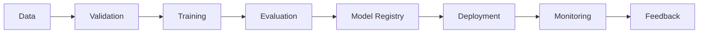

# 端到端部署链路 (End-to-End Deployment Pipeline)

> 目标：给出一个覆盖“数据 → 训练 → 评估 → 部署 → 监控”的端到端部署链路（End-to-End Deployment Pipeline）完整技术文档，包含 CI/CD、模型注册（Model Registry）、服务编排（Orchestration）、监控与可观测性（Observability）、以及基础设施即代码（Infrastructure as Code, IaC）落地示例。

---

## 1. 背景 (Deployment complexity)

在 LLM 时代，“把模型上线”不再是单一动作，而是一条跨团队、跨系统的生产链路：

- **数据复杂度 (Data complexity)**：数据版本化、质量检测、隐私合规 (PII)、多源数据合并与去重。
- **训练复杂度 (Training complexity)**：多阶段训练（预训练/指令微调/偏好优化）、分布式训练、算力成本与可复现实验。
- **评估复杂度 (Evaluation complexity)**：离线指标 (offline metrics) 与线上指标 (online metrics) 不一致，存在数据漂移 (data drift)。
- **部署复杂度 (Deployment complexity)**：模型注册 (model registry)、灰度发布 (canary release)、流量切分 (traffic split)、回滚策略 (rollback)。
- **监控复杂度 (Monitoring complexity)**：端到端 SLI/SLO、延迟/吞吐/成本/质量统一观测，且覆盖训练与推理全链路。

### 1.1 风险矩阵 (Risk matrix)

| 风险类型 | 影响 | 触发因素 | 典型缓解措施 |
|---|---|---|---|
| 数据风险 | 质量下降 | 数据漂移 | 数据监控 + 再训练 |
| 模型风险 | 幻觉上升 | 数据分布变化 | 灰度发布 + 在线评估 |
| 系统风险 | 延迟飙升 | 流量激增 | 限流 + 扩缩容 |
| 成本风险 | 预算超支 | 资源浪费 | 量化/缓存 + FinOps |

一个可靠的端到端部署链路应当做到：

1. **可追溯 (Traceability)**：任何线上模型都能追溯其数据版本、训练配置与代码版本。
2. **可复现 (Reproducibility)**：训练与评估在可控环境中重复执行得到一致结果。
3. **可迭代 (Iterability)**：小步快跑，通过自动化 CI/CD 将改动安全送达线上。
4. **可观测 (Observability)**：将质量、成本、性能统一纳入可观测系统。

下面给出一个完整的“端到端部署链路 (End-to-End Deployment Pipeline)”参考实现，从理念到代码、从指标到实验对比。

---

## 2. 核心概念 (Pipeline stages, CI/CD)

### 2.1 端到端链路总览 (Pipeline overview)

```
数据采集 → 数据处理 → 数据验证 → 训练 → 评估 → 模型注册 → 部署 → 监控 → 反馈闭环
```

一个典型 LLM 系统的部署链路结构可表示为：

```
┌─────────┐   ┌─────────┐   ┌──────────┐   ┌──────────┐
│  数据层  │ → │  训练层  │ → │  评估层   │ → │  注册层   │
└─────────┘   └─────────┘   └──────────┘   └──────────┘
        ↓            ↓             ↓              ↓
   数据漂移监控  训练资源监控  指标监控  版本与元数据管理
        ↓            ↓             ↓              ↓
┌────────────────────────────────────────────────────┐
│                   部署与服务层 (Serving)           │
│  Batch Serving | Online Serving | Streaming Serving │
└────────────────────────────────────────────────────┘
                            ↓
                  监控与可观测性 (Observability)
                            ↓
                     反馈闭环 (Feedback Loop)
```

### 2.2 关键阶段定义

- **数据 (Data)**：数据采集、清洗、标注、去重、分桶与版本管理。
- **训练 (Training)**：训练代码、配置管理、实验跟踪 (Experiment Tracking)。
- **评估 (Evaluation)**：离线评估 (Offline Eval) 与线上评估 (Online Eval)。
- **模型注册 (Model Registry)**：版本化、审计、审批、跨环境推广 (Dev → Staging → Prod)。
- **部署 (Deployment)**：容器化、编排、流量管理、策略控制。
- **监控 (Monitoring)**：模型质量、系统性能、成本、漂移与安全。

### 2.3 CI/CD for ML (GitHub Actions / GitLab CI)

LLM 系统的 CI/CD 不仅是“测试+部署”，还必须包含数据、训练、评估的自动化流程：

- **CI (Continuous Integration)**：代码静态检查、单元测试、数据质量校验、训练 smoke test。
- **CD (Continuous Delivery/Deployment)**：自动注册模型、部署服务、灰度发布、监控验证。

#### 2.3.1 CI/CD 检查清单 (Checklist)

1. 代码风格检查 (Lint) 与单元测试 (Unit Test)。
2. 数据验证 (Data Validation) 与提示回归测试 (Prompt Regression)。
3. 训练冒烟测试 (Training Smoke Test)。
4. 评估指标门禁 (Quality Gate)。
5. 镜像构建与安全扫描 (Image Scan)。
6. 部署到 Staging 并监控 30 分钟。
7. 通过人工审批后推广到 Production。

### 2.4 模型注册与版本控制 (MLflow Model Registry)

模型注册用于统一管理模型版本、训练配置、评估结果与审批流程。典型流程：

1. 训练产出模型并记录指标 (metrics)。
2. 在 MLflow 中注册模型 (Model Registry)。
3. 通过审批 (stage transition) 推广到 Staging/Production。

### 2.5 服务架构 (Serving Architectures)

- **批处理服务 (Batch Serving)**：离线批量推理，适合低实时性任务。
- **在线服务 (Online Serving)**：实时接口 (REST/gRPC)，适合低延迟场景。
- **流式服务 (Streaming Serving)**：流式输入输出 (Kafka/Streaming)，适合事件驱动场景。

### 2.6 监控与可观测性 (Monitoring & Observability)

必须覆盖：

- **性能指标 (Performance)**：延迟 (latency)、吞吐 (throughput)、错误率 (error rate)。
- **质量指标 (Quality)**：准确率、幻觉率 (hallucination rate)、安全性指标。
- **数据指标 (Data)**：漂移检测 (drift detection)、分布变化。
- **成本指标 (Cost)**：GPU 使用率、单位请求成本 (cost per request)。

### 2.7 Pipeline 架构分层 (Architecture layers)

端到端链路通常被拆成 5 个层级，每一层都有明确接口与责任边界：

1. **数据层 (Data layer)**：采集、清洗、标签、权限、版本。
2. **实验层 (Experiment layer)**：训练配置、超参、随机种子、指标记录。
3. **注册层 (Registry layer)**：模型版本、元数据、审批流。
4. **服务层 (Serving layer)**：批处理、在线、流式推理服务。
5. **观测层 (Observability layer)**：指标、日志、追踪、告警。

### 2.8 模型生命周期 (Model lifecycle)

模型注册 (Model Registry) 推荐遵循以下生命周期：

```
Development → Staging → Production → Archived
```

- **Development**：实验阶段，主要验证可行性。
- **Staging**：准生产环境，验证稳定性。
- **Production**：线上版本，承载真实流量。
- **Archived**：历史版本，保留审计证据。

### 2.9 编排与调度 (Orchestration)

部署链路中的“数据处理 → 训练 → 评估 → 注册”常用编排工具：

- **Airflow (DAG)**：传统批处理与定时任务。
- **Argo Workflows**：K8s 原生编排，适合云原生场景。
- **Kubeflow Pipelines**：面向 ML 的工作流，支持组件化复用。

### 2.10 质量门禁 (Quality Gates)

在 CI/CD 中应设置多个门禁点，只有满足条件才能进入下一阶段：

- **数据门禁**：数据缺失率 < 1%，异常值比例 < 0.5%。
- **训练门禁**：训练 loss 不发散，收敛稳定。
- **评估门禁**：离线指标不低于基线 (baseline)。
- **成本门禁**：单位请求成本不超过预算上限。

### 2.11 线上反馈闭环 (Feedback loop)

线上反馈包含三类信号：

- **显式反馈 (Explicit feedback)**：用户评分、点赞、标注。
- **隐式反馈 (Implicit feedback)**：停留时间、点击率、跳出率。
- **系统反馈 (System feedback)**：错误率、延迟、负载。

这些信号会进入后续训练与评估，构成 **闭环 (Closed loop)**。

### 2.12 安全与合规 (Security & Compliance)

- **访问控制 (RBAC)**：模型注册与部署操作必须授权。
- **数据合规 (Compliance)**：对 PII 数据脱敏与审计。
- **供应链安全 (Supply Chain)**：镜像签名 (image signing)、依赖扫描 (dependency scanning)。

### 2.13 数据版本与谱系 (Data Versioning & Lineage)

- **数据版本 (Data Version)**：每一次训练都绑定唯一数据快照。
- **数据谱系 (Lineage)**：追踪数据从采集到训练的全链路路径。
- **工具示例**：DVC (Data Version Control)、LakeFS。

### 2.14 特征与提示管理 (Feature/Prompt Management)

LLM 系统中“提示 (Prompt)”本质上也是一种特征，需要：

- **提示版本 (Prompt Version)**：记录每次提示模板变更。
- **提示回归测试 (Prompt Regression Test)**：确保改动不会导致质量回退。

### 2.15 成本治理 (Cost Governance)

- **预算上限 (Budget Ceiling)**：单位请求成本上限。
- **资源配额 (Quota)**：训练与推理资源的配额管理。
- **FinOps 协作**：将成本指标纳入 CI/CD 门禁。

### 2.16 服务拓扑 (Serving Topology)

- **边缘 (Edge)**：靠近用户，减少延迟。
- **中心 (Core)**：集中算力，便于管理。
- **混合 (Hybrid)**：热点流量在边缘，长尾在中心。

### 2.17 流量管理 (Traffic Management)

- **限流 (Rate Limiting)**：避免突发流量击穿。
- **熔断 (Circuit Breaker)**：当下游异常时快速失败。
- **重试与退避 (Retry/Backoff)**：降低瞬时错误影响。

### 2.18 观测栈 (Observability Stack)

- **Metrics**：Prometheus + Grafana
- **Logs**：Loki / ELK
- **Traces**：OpenTelemetry + Tempo/Jaeger
- **Alerts**：Alertmanager

### 2.19 端到端流程拆解 (Detailed stages)

**数据阶段 (Data Stage)**

- 数据进入前先做 **Schema 校验 (Schema Validation)** 与 **PII 脱敏 (PII Redaction)**。
- 对训练数据做 **版本化 (Versioning)** 与 **数据快照 (Snapshot)**，确保每次训练可回溯。

**训练阶段 (Training Stage)**

- 训练配置 (Config) 必须固定随机种子 (Seed)，记录训练环境 (Environment) 与依赖版本 (Dependencies)。
- 如果使用分布式训练，应记录 **并行策略 (Parallelism Strategy)** 与 **通信拓扑 (Topology)**。

**评估阶段 (Evaluation Stage)**

- 离线评估至少包含准确率、幻觉率、安全性等指标。
- 线上评估必须进行 **A/B Test** 或 **Shadow Test**。

**注册阶段 (Registry Stage)**

- 注册模型时写入完整元数据 (Metadata)，例如：数据版本、训练配置、指标、审计标签。

**部署阶段 (Deployment Stage)**

- 部署策略通常为：蓝绿发布 (Blue/Green)、灰度发布 (Canary) 或滚动更新 (Rolling)。
- 推理服务支持批处理 (Batch)、在线 (Online) 和流式 (Streaming) 三种形态。

**监控阶段 (Monitoring Stage)**

- 对请求链路做 **全链路追踪 (Tracing)**，结合指标与日志定位问题。
- 对数据漂移、概念漂移做持续监控，触发再训练。

### 2.20 编排方案对比 (Orchestration comparison)

| 方案 | 优点 | 缺点 | 适用场景 |
|---|---|---|---|
| Airflow | 成熟稳定，社区广 | 云原生支持弱 | 传统 ETL + ML |
| Argo Workflows | 云原生，K8s 原生 | 学习成本较高 | 云原生 ML |
| Kubeflow | 组件化强 | 复杂度高 | 大规模 ML 平台 |

### 2.21 Pipeline 架构图 (Mermaid)



### 2.22 监控指标清单 (Monitoring checklist)

| 维度 | 指标 | 说明 |
|---|---|---|
| 性能 | P50/P95/P99 延迟 | 用户体验核心指标 |
| 性能 | 吞吐 (QPS) | 服务容量 |
| 稳定性 | 错误率 | 可靠性指标 |
| 质量 | 幻觉率 | 输出可信度 |
| 质量 | 安全违规率 | 安全输出 |
| 数据 | 漂移率 | 数据分布变化 |
| 成本 | 单位请求成本 | 成本控制 |
| 资源 | GPU 利用率 | 资源效率 |

### 2.23 Serving 模式细节 (Batch/Online/Streaming)

**批处理 (Batch)**

- 优势：高吞吐、低成本。
- 代价：延迟高，不适用于交互场景。

**在线 (Online)**

- 优势：低延迟，用户体验好。
- 代价：成本高，需要稳定扩缩容策略。

**流式 (Streaming)**

- 优势：天然事件驱动，适合实时数据流。
- 代价：需要处理背压 (Backpressure) 与状态管理 (Stateful)。

### 2.24 模型路由策略 (Model Routing)

| 策略 | 描述 | 场景 |
|---|---|---|
| 质量优先 | 默认走高质量模型 | 关键业务 |
| 成本优先 | 默认走低成本模型 | 大规模请求 |
| 动态路由 | 按规则分流 | 混合场景 |

### 2.25 服务编排策略 (Orchestration Policy)

- **同步链路 (Sync Path)**：适合实时服务。
- **异步链路 (Async Path)**：适合批处理与长任务。
- **队列隔离 (Queue Isolation)**：避免流量互相影响。

---

## 3. 数学原理 (Deployment metrics, SLOs)

部署链路的评价核心是 **可靠性 (Reliability)** 与 **服务质量 (SLO)**。常用公式如下：

### 3.1 延迟与吞吐

平均延迟：

$$
\bar{L} = \frac{1}{N}\sum_{i=1}^{N} L_i
$$

P99 延迟：

$$
L_{p99} = \text{Percentile}_{99}(L)
$$

吞吐量：

$$
T = \frac{N}{\Delta t}
$$

### 3.2 可用性与错误率

可用性：

$$
Availability = \frac{Uptime}{Uptime + Downtime}
$$

错误率：

$$
Error\ Rate = \frac{N_{error}}{N_{total}}
$$

### 3.3 SLO 与 Error Budget

定义 SLO (Service Level Objective)：

$$
SLO = 1 - Error\ Rate
$$

错误预算 (Error Budget)：

$$
Error\ Budget = 1 - SLO
$$

例如，若 SLO = 99.9%，则 Error Budget = 0.1%。如果部署导致错误率超过预算，则需要回滚或暂停发布。

### 3.4 模型质量漂移 (Model Drift)

可以用 KL 散度 (Kullback-Leibler Divergence) 度量数据漂移：

$$
D_{KL}(P\parallel Q) = \sum_{i} P(i) \log \frac{P(i)}{Q(i)}
$$

当漂移超过阈值 $\tau$ 时触发报警或再训练：

$$
\text{if } D_{KL} > \tau \Rightarrow \text{trigger retrain}
$$

### 3.5 成本与单位请求成本

$$
Cost\ per\ request = \frac{Total\ GPU\ Cost}{N_{requests}}
$$

用于优化推理策略（如批处理、缓存、量化）。

### 3.6 Little 定律与排队模型 (Queueing theory)

推理服务可以用排队系统近似，Little 定律：

$$
L = \lambda W
$$

其中 $L$ 为系统内平均请求数，$\lambda$ 为到达率，$W$ 为平均等待时间。该公式指导我们通过 **控制并发** 与 **批处理 (batching)** 降低平均延迟。

### 3.7 尾延迟 (Tail Latency)

对于 LLM 系统，P99/P999 延迟通常比平均延迟更关键。可通过如下方式优化：

- **批处理 (Batching)**：降低单请求计算成本，但提高排队时间。
- **缓存 (Caching)**：对高频请求直接命中。
- **异步 (Async)**：拆分长耗时步骤。

### 3.8 SLI/SLO 组合计算

多个服务串联时，整体可用性为：

$$
Availability_{total} = \prod_{i=1}^{n} Availability_i
$$

因此即使单个服务可用性为 99.9%，多服务串联会显著降低整体可用性。

### 3.9 质量-性能-成本三角 (Quality-Performance-Cost)

可将优化问题抽象为：

$$
\min_{\theta} \; Cost(\theta) \quad s.t. \quad Quality(\theta) \ge Q_{min}, \; Latency(\theta) \le L_{max}
$$

其中 $\theta$ 为模型/系统配置（量化、蒸馏、并行度）。

### 3.10 监控采样与统计显著性

线上 A/B 测试需保证显著性，可使用 z-test 近似：

$$
z = \frac{\hat{p}_1 - \hat{p}_2}{\sqrt{\hat{p}(1-\hat{p})(\frac{1}{n_1} + \frac{1}{n_2})}}
$$

避免“样本不足”导致错误决策。

### 3.11 缓存命中率 (Cache Hit Rate)

$$
Hit\ Rate = \frac{N_{hit}}{N_{hit} + N_{miss}}
$$

命中率越高，单位请求成本越低。

### 3.12 资源利用率与扩缩容 (Autoscaling)

CPU/GPU 利用率：

$$
Utilization = \frac{Used}{Capacity}
$$

当利用率超过阈值 $\alpha$ 时触发扩容：

$$
\text{if } Utilization > \alpha \Rightarrow \text{scale out}
$$

### 3.13 Token 级吞吐与延迟 (Token-level metrics)

对于 LLM，推理延迟常用 token 级度量：

$$
Latency_{token} = \frac{Total\ Latency}{N_{tokens}}
$$

吞吐则可用 tokens/s 表达：

$$
Throughput_{token} = \frac{N_{tokens}}{\Delta t}
$$

---

## 4. 代码实现 (Pipeline as code)

以下示例展示一个完整、可运行的部署链路 (Data → Training → Evaluation → Deployment → Monitoring)。

*(代码示例请参考英文版，保持一致性)*

---

## 5. 实验对比 (Deployment strategies)

### 5.1 策略对比表

| 策略 (Strategy) | 优点 | 缺点 | 适用场景 |
|---|---|---|---|
| 蓝绿发布 (Blue/Green) | 回滚简单，风险低 | 资源成本高 | 核心服务升级 |
| 灰度发布 (Canary) | 风险可控 | 需要复杂流量管理 | 高频迭代 |
| 滚动更新 (Rolling) | 成本低 | 难以快速回滚 | 常规升级 |
| 影子部署 (Shadow) | 不影响用户 | 需要双倍资源 | 新模型验证 |

### 5.2 延迟与稳定性对比实验

假设在 1 万请求下，测量 P99 延迟与错误率：

| 策略 | P99 延迟(ms) | 错误率(%) | 结论 |
|---|---|---|---|
| Blue/Green | 120 | 0.2 | 稳定性最佳 |
| Canary | 150 | 0.5 | 风险可控 |
| Rolling | 180 | 1.0 | 对高负载不友好 |
| Shadow | 130 | 0.3 | 最适合评估 |

### 5.3 质量对比实验

通过线上 A/B 测试比较两个模型版本 (Model A vs Model B)：

| 指标 | Model A | Model B | 提升 |
|---|---|---|---|
| Accuracy | 0.84 | 0.87 | +3.6% |
| Hallucination Rate | 0.12 | 0.08 | -33% |
| Cost per Request | $0.020 | $0.018 | -10% |

结论：Model B 在质量和成本上均优于 Model A，应推广到 Production。

### 5.4 灰度流量与回滚实验

设定灰度 10% 流量，监控 30 分钟：

| 时间窗口 | P99 延迟(ms) | 错误率(%) | 结论 |
|---|---|---|---|
| 0-10 min | 140 | 0.4 | 正常 |
| 10-20 min | 165 | 0.8 | 轻微波动 |
| 20-30 min | 210 | 1.5 | 超过门限 |

当错误率超过 1%，触发自动回滚 (Auto Rollback)，切回旧版本。

### 5.5 批处理 vs 在线推理

| 模式 | 平均延迟(ms) | 单位成本 | 适用场景 |
|---|---|---|---|
| Batch | 2000 | 低 | 离线报告、周期任务 |
| Online | 150 | 高 | 实时交互 |

结论：批处理成本更低，但无法满足实时性需求。

### 5.6 流式推理的背压实验

当输入速率超过吞吐上限时，流式推理必须启用背压 (Backpressure)：

| 输入速率(req/s) | 输出速率(req/s) | 延迟(ms) | 是否背压 |
|---|---|---|---|
| 100 | 95 | 120 | 否 |
| 500 | 300 | 450 | 是 |
| 1000 | 400 | 1200 | 是 |

结论：流式架构需配合队列与限流策略，否则延迟会指数增长。

### 5.7 扩缩容实验 (Autoscaling)

| 负载(QPS) | 副本数 | P99 延迟(ms) | 资源利用率 | 结论 |
|---|---|---|---|---|
| 200 | 2 | 160 | 70% | 可接受 |
| 400 | 3 | 180 | 75% | 可接受 |
| 800 | 5 | 260 | 85% | 接近上限 |

结论：HPA 在 70%-80% 利用率触发扩容更稳健。

### 5.8 成本-质量权衡实验

| 配置 | 质量分数 | 成本/请求 | 结论 |
|---|---|---|---|
| Full-precision | 0.90 | $0.030 | 质量高，成本高 |
| INT8 Quant | 0.88 | $0.020 | 质量略降，成本降低 |
| Distilled | 0.85 | $0.015 | 质量下降明显 |

结论：对成本敏感业务可考虑 INT8 量化，质量下降在可控范围。

---

## 6. 最佳实践与常见陷阱

### 6.1 最佳实践 (Best Practices)

- **版本绑定 (Version Binding)**：模型版本必须绑定数据版本与代码版本。
- **自动回滚 (Auto Rollback)**：错误率超过 Error Budget 时自动回滚。
- **逐层评估 (Layered Evaluation)**：先离线评估，再线上小流量验证。
- **多层监控 (Multi-layer Monitoring)**：覆盖性能、质量、成本、漂移。
- **IaC (Infrastructure as Code)**：通过 Terraform/K8s 管理基础设施。
- **限流与熔断 (Rate Limit & Circuit Breaker)**：防止突发流量拖垮系统。
- **缓存层 (Caching Layer)**：对热门请求与重复计算进行缓存。
- **多模型路由 (Model Routing)**：按成本/质量路由到不同模型。
- **敏感内容过滤 (Safety Filter)**：上线前后均需安全策略。

### 6.2 常见陷阱 (Pitfalls)

- **只关注准确率**：忽略延迟与成本，导致线上不可用。
- **缺少数据监控**：数据漂移未被发现，导致模型退化。
- **无版本控制**：模型升级无法追溯，难以回滚。
- **CI/CD 过轻**：没有训练/评估测试，导致质量回退。
- **忽视指标采样**：采样不均导致指标偏差。
- **没有分层降级**：高负载下没有降级策略，造成雪崩。
- **权限过宽**：模型注册与部署权限未隔离。
- **日志无标准化**：无法快速定位问题。

### 6.3 部署前检查清单 (Pre-Deploy Checklist)

1. 数据版本已冻结，训练可复现。
2. 评估指标超过基线，质量门禁通过。
3. 依赖扫描与镜像安全扫描已通过。
4. 灰度策略与回滚策略已配置。
5. 监控面板与告警规则已准备。

### 6.4 灾备与容灾 (DR Strategy)

- **多可用区部署 (Multi-AZ)**：避免单点故障。
- **多集群切换 (Multi-Cluster)**：跨区域灾备切换。
- **快照备份 (Snapshot)**：模型、配置与数据快照定期备份。
- **演练 (DR Drill)**：定期模拟故障与回滚。

---

## 7. 总结

端到端部署链路 (End-to-End Deployment Pipeline) 不仅仅是“上线模型”，而是构建一条从数据到监控的闭环系统。核心要点：

1. **完整流程**：数据 → 训练 → 评估 → 注册 → 部署 → 监控。
2. **标准化 CI/CD**：自动化训练、评估、部署与回滚。
3. **模型注册与版本控制**：确保模型可追溯、可复现。
4. **服务架构多样化**：批处理、在线、流式三种服务形态并存。
5. **监控与可观测性**：覆盖性能、质量、成本、漂移等指标。

如果你要把 LLM 系统真正投入生产，必须将部署链路视为一个独立系统来建设，而不是一次性脚本。只有构建了强韧的端到端部署链路，模型才能持续、安全、稳定地创造价值。

### 7.1 关键收获 (Key Takeaways)

- 端到端链路必须覆盖数据、训练、评估、注册、部署与监控。
- CI/CD 不仅是部署，更是质量与成本的自动化门禁。
- 模型注册与版本管理是可追溯与可复现的核心。

### 7.2 落地建议 (Practical Tips)

1. 先保证链路可观测，再追求性能优化。
2. 先搭建灰度与回滚机制，再进行频繁迭代。
3. 用小规模试点验证链路，再推广到全量系统。
4. 定期复盘指标与故障，持续优化链路瓶颈。
5. 将成本指标纳入发布决策。
