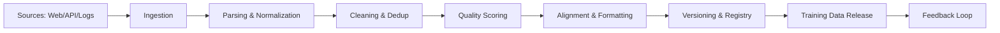
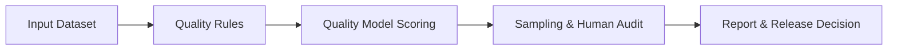

# 数据治理与质量 (Data Governance and Quality)

本篇文档面向大模型训练与应用场景，系统化说明数据治理与质量保障的关键流程、数学基础、工程实现与评估方法。内容覆盖数据采集 (Data Collection)、清洗 (Data Cleaning)、对齐 (Alignment)、合规 (Compliance)、版本管理 (Versioning)、质量评估 (Quality Assessment) 等核心环节，强调可重复、可追溯与可审计的数据生命周期管理。

## 1. 背景 (Data as foundation)

大模型 (LLM) 的能力上限高度依赖数据质量与治理能力。数据不仅决定模型知识覆盖面，还决定训练稳定性、偏差程度与合规风险。规模扩大后，单纯“更多数据”并不必然提升性能，反而可能引入噪声、泄露、重复与偏见。因此，数据治理成为 LLM 系统工程的基础设施，目标包括：

- 提升数据可用性 (Data Usability)：保证数据格式一致、可解析、可复用。
- 控制数据风险 (Risk Control)：识别敏感数据、版权冲突与违规内容。
- 保证数据质量 (Quality Assurance)：通过量化指标与抽样审计持续验证。
- 提供可追溯性 (Lineage/Provenance)：记录数据来源、变换过程与版本演进。

在 LLM 训练场景中，数据可分为三类：

- 原始数据 (Raw): 网页、代码库、文档、日志、语音等。
- 结构化数据 (Structured): 经过解析和规范化的表格或 JSON。
- 对齐数据 (Aligned): 指令 (Instruction) / 对话 (Chat) / 监督 (Supervised) 样本。

数据治理的目标不是“追求完美”，而是用最小成本实现可验证的质量提升和合规降低。

### 1.1 数据规模、噪声与风险

LLM 数据规模通常达到 TB/PB 级别。规模扩大带来三类风险：

1. 重复风险 (Duplication Risk)：重复语料会放大频繁模式，导致过拟合与模式塌缩 (Mode Collapse)。
2. 合规风险 (Compliance Risk)：来源复杂导致版权冲突、PII 泄露与跨境合规问题。
3. 质量风险 (Quality Risk)：低质量样本比率上升，影响损失收敛与泛化能力。

### 1.2 数据治理目标分层

可按“最低合规、稳定质量、持续优化”三层构建目标：

- Level 1: 合规与可用性 (Compliance & Availability)
- Level 2: 可度量质量 (Measurable Quality)
- Level 3: 可持续优化 (Continuous Optimization)

### 1.3 典型场景与差异

| 场景 | 数据特点 | 治理重点 |
| --- | --- | --- |
| 基础预训练 | 多语言、多领域、长尾 | 去重、噪声控制、分布稳定 |
| 指令微调 | 高质量少样本 | 质量评分、对齐格式、人工审计 |
| 企业私域 | 结构化、敏感性高 | 访问控制、脱敏、审计 |
| 对话回流 | 实时性高 | 采样策略、偏见修正、风险过滤 |

### 1.4 数据质量与模型指标的联动

在 LLM 训练中，数据质量与模型指标存在强相关：

- 低噪声 → 更低困惑度 (Perplexity)
- 高覆盖率 → 更强知识广度
- 高一致性 → 更稳定的指令遵循

因此，数据治理必须与模型训练指标 (Loss, BLEU, Human Score) 形成闭环，而非单独进行。

### 数据治理的核心价值

1. 训练稳定性：减少噪声、重复、冲突，降低训练损失抖动。
2. 模型一致性：维持数据分布稳定性 (Distribution Stability)，避免数据漂移导致性能回退。
3. 责任合规：对个人信息 (PII) 与版权内容进行可追溯处理，降低法律风险。
4. 可解释性：通过版本化与 lineage 让模型产出可复现与可审核。

## 2. 核心概念 (Data lifecycle, quality dimensions)

### 2.1 数据生命周期 (Data Lifecycle)

从采集到训练的完整生命周期：

1. 采集 (Collection) → 2. 解析 (Parsing) → 3. 清洗 (Cleaning) → 4. 对齐 (Alignment) → 5. 分桶 (Bucketing) → 6. 版本化 (Versioning) → 7. 发布 (Release) → 8. 反馈回流 (Feedback Loop)

各阶段都应建立可量化的质量门槛 (Quality Gate)。

### 2.2 数据质量维度 (Quality Dimensions)

常见质量维度与 LLM 场景映射：

| 维度 (Dimension) | 含义 | LLM 训练影响 |
| --- | --- | --- |
| 准确性 (Accuracy) | 内容真实度、正确率 | 错误事实导致幻觉 (Hallucination) |
| 完整性 (Completeness) | 字段/语句完整 | 不完整样本降低监督信号 |
| 一致性 (Consistency) | 格式统一、标签一致 | Token 分布混乱导致收敛慢 |
| 及时性 (Timeliness) | 更新频率、时效 | 旧数据造成知识过时 |
| 去重度 (Uniqueness) | 重复比例 | 过拟合与泛化下降 |
| 合规性 (Compliance) | 版权、隐私、法规 | 违规导致法律与信任风险 |

### 2.3 数据对齐 (Alignment) 与数据格式

LLM 训练常用格式：

- Instruction 格式：{instruction, input, output}
- Chat 格式：{messages:[{role, content}]}
- Raw 格式：纯文本或段落

对齐的目标是统一语义结构、角色、系统指令与输出规范，避免“同义不同格式”的噪声。

### 2.4 版本管理与血缘 (Versioning & Lineage)

数据版本管理包括：

- Dataset 版本：语义变化 (major/minor/patch)
- Schema 版本：字段与格式变更
- Pipeline 版本：处理流程与参数
- Source 版本：来源与抓取快照

血缘追踪 (Lineage) 要记录：来源 URL、抓取时间、过滤规则、去重策略、采样权重、转换步骤、最终样本 ID。

### 2.5 数据治理角色 (Roles)

- 数据所有者 (Data Owner)：定义数据需求与合规边界。
- 数据管理员 (Data Steward)：维护质量规则与审计。
- 工程团队 (Data Engineer)：搭建数据 pipeline 与版本管理。
- 法务与安全 (Legal/Security)：审核合规与敏感处理。

## 3. 数学原理 (Quality metrics, statistical measures)

数据质量的量化不是“单指标”，而是多指标组合。以下给出常用指标与数学形式。

### 3.1 去重率与重复度 (Deduplication Rate)

设原始数据集为 $D$，去重后为 $D'$，去重率：

$$
\text{DedupRate} = 1 - \frac{|D'|}{|D|}
$$

更精细的重复度使用 MinHash/SimHash 近似：

$$
\text{Jaccard}(x, y) = \frac{|x \cap y|}{|x \cup y|}
$$

当 $\text{Jaccard}(x, y) > \tau$ 时视为重复。

### 3.2 噪声比例 (Noise Ratio)

设低质量样本数量为 $N_{low}$，总样本数量为 $N$：

$$
\text{NoiseRatio} = \frac{N_{low}}{N}
$$

低质量定义可来自规则过滤、质量模型 (Quality Model) 或人工审计。

### 3.3 质量得分 (Quality Score)

使用多维指标加权：

$$
\text{QualityScore}(x) = \sum_{i=1}^k w_i \cdot s_i(x)
$$

其中 $s_i(x)$ 可为语言流畅度、语法错误率、毒性 (Toxicity) 得分、事实一致性等。

### 3.4 分布稳定性 (Distribution Stability)

使用 KL 散度衡量新旧数据分布差异：

$$
\text{KL}(P \| Q) = \sum_{i} P(i) \log \frac{P(i)}{Q(i)}
$$

当 KL 过大时，说明数据分布发生漂移 (Data Drift)。

### 3.5 词汇覆盖率 (Vocabulary Coverage)

$$
\text{Coverage} = \frac{|V_{new} \cap V_{target}|}{|V_{target}|}
$$

用于衡量领域词汇是否覆盖。

### 3.6 抽样置信区间 (Sampling Confidence)

对人工审计 (Human Audit) 样本计算置信区间：

$$
CI = \hat{p} \pm z_{\alpha/2} \sqrt{\frac{\hat{p}(1-\hat{p})}{n}}
$$

用于描述质量指标的统计可靠性。

### 3.7 数据健康指数 (Data Health Index)

常用综合指标：

$$
\text{DHI} = \alpha \cdot (1-\text{NoiseRatio}) + \beta \cdot (1-\text{DedupRate}) + \gamma \cdot (1-\text{ComplianceRisk})
$$

其中 $\alpha+\beta+\gamma=1$，可按业务风险权重配置。

## 4. 代码实现 (Data pipelines)

本节给出可运行的 Python 示例，展示采集、清洗、对齐、质量打分、版本化与 lineage 记录。代码均包含中文注释。

### 4.1 数据 pipeline 架构 (Architecture)



### 4.2 采集策略 (Collection Strategies)

核心策略包括：

- 公开语料 (Open Corpus) + 领域语料 (Domain Corpus)
- 多源采集 (Multi-source) 提升覆盖，避免单一分布偏差
- 分层采样 (Stratified Sampling) 保证语种与领域比例
- 日志与对话回流 (Feedback Loop) 结合人工审核

#### 示例：采集与元数据记录

```python
from dataclasses import dataclass
from datetime import datetime
import hashlib
import json

@dataclass
class RawRecord:
    source: str
    url: str
    text: str
    collected_at: str
    checksum: str

def collect_record(source: str, url: str, text: str) -> RawRecord:
    # 记录采集时间
    collected_at = datetime.utcnow().isoformat()
    # 生成校验和用于去重
    checksum = hashlib.sha256(text.encode("utf-8")).hexdigest()
    return RawRecord(source=source, url=url, text=text, collected_at=collected_at, checksum=checksum)

record = collect_record("web", "https://example.com", "示例文本")
print(json.dumps(record.__dict__, ensure_ascii=False, indent=2))
```

### 4.3 数据清洗 (Cleaning)

常用清洗技术：

- 去重 (Deduplication)：hash、n-gram、MinHash
- 过滤 (Filtering)：语言检测、长度阈值、格式规则
- 质量评分 (Quality Scoring)：困惑度 (Perplexity)、毒性检测

#### 示例：规则过滤 + 基础去重

```python
import re

def normalize(text: str) -> str:
    # 简单归一化
    text = re.sub(r"\s+", " ", text).strip()
    return text

def is_valid(text: str, min_len: int = 20, max_len: int = 2000) -> bool:
    # 基础过滤规则
    if len(text) < min_len or len(text) > max_len:
        return False
    if "广告" in text or "博彩" in text:
        return False
    return True

def dedup_texts(texts):
    # 使用 hash 去重
    seen = set()
    results = []
    for t in texts:
        t = normalize(t)
        h = hash(t)
        if h not in seen and is_valid(t):
            seen.add(h)
            results.append(t)
    return results

data = ["你好  世界", "你好 世界", "广告：点击进入"]
print(dedup_texts(data))
```

#### 示例：质量评分 (简化版)

```python
def quality_score(text: str) -> float:
    # 质量评分示例：越长越好，但过长会降分
    length = len(text)
    score = min(length / 200, 1.0)
    if length > 1000:
        score *= 0.7
    return round(score, 4)

for t in ["短文本", "这是一个较长的文本，用于示例。" * 10]:
    print(t[:20], quality_score(t))
```

### 4.4 数据对齐 (Alignment) 与格式化

#### Instruction 格式

```python
import json

def to_instruction(instruction: str, output: str, input_text: str = ""):
    # 构建 Instruction 数据
    return {
        "instruction": instruction,
        "input": input_text,
        "output": output
    }

sample = to_instruction("总结下面的文本", "总结结果", "原始文本")
print(json.dumps(sample, ensure_ascii=False, indent=2))
```

#### Chat 格式

```python
import json

def to_chat(system: str, user: str, assistant: str):
    # 构建对话格式
    return {
        "messages": [
            {"role": "system", "content": system},
            {"role": "user", "content": user},
            {"role": "assistant", "content": assistant}
        ]
    }

chat = to_chat("你是一个助手", "你好", "你好，有什么可以帮你？")
print(json.dumps(chat, ensure_ascii=False, indent=2))
```

### 4.5 版本管理与血缘追踪 (Versioning & Lineage)

建议使用 Dataset Registry 记录版本与 lineage：

```python
import json
from datetime import datetime

def build_manifest(name: str, version: str, sources: list, pipeline: dict):
    # 生成数据版本清单
    return {
        "name": name,
        "version": version,
        "created_at": datetime.utcnow().isoformat(),
        "sources": sources,
        "pipeline": pipeline
    }

manifest = build_manifest(
    name="llm-pretrain-cn",
    version="1.2.0",
    sources=[{"type": "web", "snapshot": "2026-02-01"}],
    pipeline={"dedup": "minhash", "filter": "lang+length", "alignment": "chat"}
)

print(json.dumps(manifest, ensure_ascii=False, indent=2))
```

### 4.6 数据质量评估框架 (Frameworks)

常见框架：

- 规则驱动 (Rule-based) + 抽样审计
- 模型驱动 (Model-based) + 人工复核
- 统计指标 (Statistical Metrics) + 分布监控

示例：结合规则 + 采样：

```python
import random

def audit_sample(data, sample_size=5):
    # 随机抽样用于人工审核
    return random.sample(data, min(sample_size, len(data)))

texts = [f"样本{i}" for i in range(20)]
print(audit_sample(texts, 3))
```

## 5. 实验对比 (Quality assessment methods)

本节示例化对比不同质量评估方法对训练数据的影响。

### 5.1 方法 A：仅规则过滤 (Rule-only)

- 优点：成本低、可解释
- 缺点：覆盖率不足，无法捕捉隐性噪声

### 5.2 方法 B：规则 + 质量模型 (Rule + Model)

- 优点：能捕捉隐性噪声 (比如语义重复、低信息密度)
- 缺点：成本较高，需要训练质量判别模型

### 5.3 方法 C：规则 + 模型 + 人工审计

- 优点：综合质量最高，适用于高价值数据集
- 缺点：人工成本高

#### 对比指标示例

| 方法 | 噪声比例 (Noise) | 去重率 (Dedup) | 覆盖率 (Coverage) | 预估成本 (Cost) |
| --- | --- | --- | --- | --- |
| A | 0.18 | 0.12 | 0.65 | 1x |
| B | 0.09 | 0.20 | 0.72 | 3x |
| C | 0.05 | 0.23 | 0.78 | 6x |

### 5.4 对齐格式对模型效果影响

- Raw → 基础预训练语料，提升语言建模能力。
- Instruction → 提升指令遵循与任务迁移能力。
- Chat → 提升多轮对话一致性与角色遵循。

### 5.5 质量指标与模型指标相关性

通过 Spearman 相关系数衡量质量得分与任务指标关系：

$$
\rho = 1 - \frac{6 \sum d_i^2}{n(n^2-1)}
$$

当质量评分提升时，通常会观察到 BLEU/ROUGE/EM 或人类评分上升。

## 6. 最佳实践与常见陷阱

### 6.1 最佳实践 (Best Practices)

1. 建立质量门槛 (Quality Gate)：每一阶段都必须通过指标阈值。
2. 采用多层去重：hash 去重 + n-gram 近似去重 + 语义去重。
3. 维护数据版本与 lineage：训练可重复、错误可追溯。
4. 引入合规检查：PII 识别、版权检测、地区法规映射。
5. 建立数据监控 (Monitoring)：指标趋势与报警系统。
6. 质量评估闭环：人工审计结果反馈到规则和模型。

### 6.2 常见陷阱 (Pitfalls)

- 过度去重导致语料多样性下降 (Diversity Loss)
- 只关注数据量忽略数据分布漂移 (Distribution Shift)
- 对齐格式不一致导致指令混乱
- 缺乏版本管理导致模型不可复现
- 合规仅在训练后处理，造成风险延迟暴露

### 6.3 合规与隐私 (Compliance & Privacy)

关键法规与框架：

- GDPR (EU) / CCPA (US) / PIPL (China) / HIPAA (Healthcare)
- ISO 27001 / SOC 2 (Security)
- Data Minimization 与 Purpose Limitation 原则

合规策略：

1. 识别 PII：姓名、手机号、身份证号、地址等
2. 数据脱敏 (Masking/Tokenization)
3. 数据删除机制 (Right to be Forgotten)
4. 版权检测 (Copyright Detection)
5. 日志审计 (Audit Log)

#### 示例：PII 简单脱敏

```python
import re

def mask_phone(text: str) -> str:
    # 手机号脱敏示例
    return re.sub(r"(\d{3})\d{4}(\d{4})", r"\1****\2", text)

print(mask_phone("联系电话 13812345678"))
```

### 6.4 数据质量评估框架对齐

可结合以下框架：

- DAMA-DMBOK：数据治理管理体系
- ISO 25012：数据质量模型
- Great Expectations：数据质量规则引擎
- OpenLineage：血缘标准

## 7. 总结

数据治理与质量是 LLM 系统的根基，其核心在于：

1. 通过数据采集、清洗、对齐与版本管理建立可重复的数据生命周期。
2. 以数学指标与质量门槛驱动数据优化，形成可量化的质量体系。
3. 以合规与隐私为底线，通过法规映射、脱敏与审计保障可持续发展。
4. 通过实验对比与反馈闭环不断提升数据质量与模型效果。

最终目标不是“完美数据”，而是“可控、可审计、可持续优化”的数据治理能力。

### 行动清单 (Action Items)

1. 建立数据资产目录与元数据标准
2. 定义质量指标体系与门槛
3. 上线多层去重与质量评分
4. 打通版本管理与血缘追踪
5. 引入合规检查与隐私保护
6. 建立质量看板与告警
7. 形成发布与回滚流程
8. 将质量评估与模型训练联动

补充说明：在实际落地中，应优先确保合规与可追溯，其次再优化质量与规模。治理策略应根据业务价值与风险等级动态调整，避免“一刀切”的过度清洗导致数据多样性下降。
同时建议每个季度进行一次治理复盘 (Governance Review)，评估指标变化并更新规则。
必要时建立外部审计机制，确保治理结果具备第三方可验证性。
该机制对高风险数据集尤为关键。
- 数据治理委员会 (Data Governance Board)：制定数据策略与质量基线。

### 2.6 数据采集策略细化 (Collection Strategy)

数据采集需要控制来源多样性与合规性：

1. 公共语料 (Open Sources)：维基、开源代码、学术文档。
2. 商业许可数据 (Licensed Data)：购买或授权数据。
3. 私域数据 (Private Data)：企业文档、客服对话、内部日志。

策略设计原则：

- 分层采样 (Stratified Sampling) 保证领域平衡。
- 采集配额 (Quota) 控制单源权重。
- 采集白名单/黑名单 (Allow/Block List)。

### 2.7 元数据标准 (Metadata Schema)

建议元数据字段：

| 字段 | 含义 |
| --- | --- |
| source_id | 来源唯一 ID |
| url | 原始 URL |
| collected_at | 采集时间 |
| license | 许可类型 |
| language | 语言标签 |
| hash | 内容 hash |
| quality_score | 质量得分 |
| policy_tags | 合规标签 |
| lineage_id | 血缘链路 ID |

### 2.8 数据对齐规则示例 (Alignment Rules)

对齐规则应包含：

- 指令前缀规范 (Instruction Prefix)
- 角色一致性 (Role Consistency)
- 输出格式化 (Output Normalization)
- 内容安全标签 (Safety Tags)

示例规则：

1. system 消息必须位于 messages[0]
2. user 与 assistant 轮次必须成对出现
3. output 末尾不得包含提示性分隔符

### 2.9 数据质量等级 (Quality Tier)

可按质量分为 3 个等级：

- Tier A：高质量指令/对话数据，人工审计通过率 ≥ 95%
- Tier B：清洗后预训练数据，噪声率 < 10%
- Tier C：原始数据，仅用于辅助训练或检索

### 2.10 数据治理流程蓝图 (Governance Blueprint)

完整治理流程建议包含以下治理域：

1. 数据资产管理 (Asset Management)
2. 数据质量管理 (Quality Management)
3. 数据安全管理 (Security Management)
4. 数据合规管理 (Compliance Management)
5. 数据生命周期管理 (Lifecycle Management)

流程蓝图示意：

- 采集域：来源选择、许可验证、采集日志
- 处理域：解析规范、清洗策略、质量评分
- 发布域：版本发布、审计报告、访问权限
- 回流域：反馈采样、标注审核、增量更新

### 2.11 质量指标体系 (Quality Metric System)

推荐采用“主指标 + 辅助指标 + 审计指标”三层体系：

- 主指标：噪声比例、去重率、平均质量得分
- 辅助指标：语言分布、长度分布、覆盖率
- 审计指标：人工通过率、合规风险

各指标需要设定阈值与告警规则。

### 2.12 数据治理组织与流程 (Organization)

治理需要明确责任：

- 数据标准制定：由 Data Steward 负责
- 质量目标设定：由 Data Owner 负责
- 合规审核：由 Legal/Security 负责
- 生产执行：由 Data Engineer 负责

对于大规模数据集，建议建立“质量评审会”定期审查指标变化与风险。

### 2.13 数据分布与偏见管理 (Bias Management)

偏见管理需要从数据层面控制：

- 采集均衡：避免过度来自单一文化或单一平台
- 标签规范：防止标注偏差
- 过滤标准：避免过度过滤弱势语言或小众领域

在评估阶段应引入公平性指标 (Fairness Metrics) 与偏见审计。

### 2.14 数据治理与模型生命周期耦合

数据治理应与模型生命周期 (Model Lifecycle) 绑定：

- 数据版本 → 模型版本
- 数据变更 → 训练变更
- 数据回滚 → 模型回滚

建议在训练记录中记录 dataset version 与 pipeline version，使模型可复现。

### 2.15 数据治理成熟度模型 (Maturity Model)

可按 4 个阶段评估治理成熟度：

1. 初级 (Ad-hoc)：无统一规则，仅做基础清洗
2. 规范化 (Managed)：有清洗规则与基础指标
3. 可度量 (Measured)：有质量评分与版本管理
4. 优化 (Optimized)：闭环反馈与自动化治理

### 2.16 关键文档清单 (Artifacts)

治理过程中需要形成文档资产：

- 数据标准规范 (Data Standard)
- 质量规则清单 (Quality Rules)
- 合规审计报告 (Compliance Report)
- 数据版本变更日志 (Changelog)
- lineage 追踪记录 (Lineage Log)

### 2.17 数据治理 KPI

建议 KPI：

- 数据质量得分提升率
- 数据回滚次数
- 合规风险下降比例
- 数据处理时延 (Latency)

### 2.18 采集与标注策略

对于指令数据：

- 使用任务模板生成 (Template-based)
- 引入多样化指令 (Instruction Diversity)
- 通过多标注者交叉验证

对于对话数据：

- 保持角色一致性
- 引入系统指令约束
- 去除无意义寒暄样本

### 2.19 数据治理路线图 (Roadmap)

一个 3 个月的治理路线图示例：

1. 第 1 月：建立采集与清洗规则
2. 第 2 月：上线质量评分与版本管理
3. 第 3 月：建立闭环审计与合规体系
### 3.8 过滤规则的精确率与召回率

将规则过滤视为二分类：

$$
\text{Precision} = \frac{TP}{TP+FP}, \quad \text{Recall} = \frac{TP}{TP+FN}
$$

其中 TP 表示真正例 (高质量样本)，FP 表示误杀样本，FN 表示漏检样本。

### 3.9 信息熵与多样性 (Diversity)

以 Shannon Entropy 量化文本分布多样性：

$$
H = -\sum_{i} p_i \log p_i
$$

当 $H$ 较高时，说明语料更丰富、更均衡。

### 3.10 质量得分的校准 (Score Calibration)

对于质量模型输出分数 $s$，可通过 Platt Scaling 或 Isotonic Regression 校准：

$$
\hat{p} = \frac{1}{1+\exp(As+B)}
$$

使得质量得分在 [0,1] 区间具有概率含义。

### 3.11 语言检测误差与置信度

语言检测可使用置信度分数 $c$，低于阈值样本记为未知：

$$
\text{UnknownRate} = \frac{N_{c<\tau}}{N}
$$

### 3.12 采样规模估计

为了估计质量比例 $p$，样本量 n 可用：

$$
n = \frac{z_{\alpha/2}^2 \cdot p(1-p)}{\epsilon^2}
$$

其中 $\epsilon$ 是误差上限。

### 3.13 质量分位数与阈值设置

质量评分往往呈长尾分布，可用分位数设置阈值：

$$
\tau = Q_{0.3} \text{ or } Q_{0.5}
$$

其中 $Q_{p}$ 表示第 $p$ 分位数。选择不同分位数会改变数据量与质量的平衡。

### 3.14 偏差与公平性指标 (Fairness Metrics)

对不同群体 (Group) 的质量或覆盖率差异可用：

$$
\Delta = |p_{group1} - p_{group2}|
$$

当 $\Delta$ 过大时，说明存在偏差风险，需要调整采样或治理策略。

### 3.15 可信度与不确定性估计

质量模型输出分数可配合不确定性估计：

$$
\text{Uncertainty} = \sqrt{\frac{1}{T}\sum_{t=1}^T (s_t - \bar{s})^2}
$$

用于识别模型判断不稳定的样本，进入人工复核。

### 3.16 数据价值评估 (Data Value)

可用“信息增益”衡量样本价值：

$$
\text{Value}(x) = \text{Loss}_{\text{before}} - \text{Loss}_{\text{after}}
$$

对于增益较高的样本，可优先保留并用于指令微调。

### 3.17 质量模型评估指标

质量模型本身也需要评估：

- AUC / F1：区分高低质量样本的能力
- Calibration Error：分数与真实概率差距
- Inference Cost：推理速度与成本

### 3.18 一致性检验 (Consistency Check)

对结构化字段的一致性可用：

$$
\text{Consistency} = 1 - \frac{N_{inconsistent}}{N}
$$

例如 instruction 与 output 是否在语义上匹配，可通过规则或语义模型检测。

### 3.19 数据多样性与覆盖度平衡

定义多样性与覆盖度的折中：

$$
\text{Balance} = \lambda H + (1-\lambda) \text{Coverage}
$$

用于平衡广度与深度。

### 3.20 质量阈值的动态调整

在数据规模变化时，阈值可动态调整：

$$
\tau_t = \mu_t - k \sigma_t
$$

其中 $\mu_t$ 与 $\sigma_t$ 为当前质量得分均值与标准差。
#### 示例：n-gram 近似去重

```python
from collections import Counter

def ngram(text: str, n: int = 3):
    # 生成 n-gram
    text = text.replace(" ", "")
    return [text[i:i+n] for i in range(len(text)-n+1)]

def jaccard(a, b):
    # Jaccard 相似度
    set_a, set_b = set(a), set(b)
    if not set_a or not set_b:
        return 0.0
    return len(set_a & set_b) / len(set_a | set_b)

def is_near_duplicate(x: str, y: str, threshold: float = 0.8):
    return jaccard(ngram(x), ngram(y)) > threshold

print(is_near_duplicate("你好世界", "你好世界!"))
```

#### 示例：语言检测 (简化版本)

```python
def detect_language(text: str) -> str:
    # 简单语言检测，非生产级
    chinese_ratio = sum(1 for ch in text if "\u4e00" <= ch <= "\u9fff") / max(len(text), 1)
    return "zh" if chinese_ratio > 0.3 else "other"

print(detect_language("这是中文"))
print(detect_language("Hello world"))
```

#### 示例：数据分桶 (Bucketing)

```python
def bucket_by_length(text: str) -> str:
    # 按文本长度分桶
    if len(text) < 200:
        return "short"
    if len(text) < 800:
        return "medium"
    return "long"

print(bucket_by_length("这是短文本"))
```

### 4.4 数据对齐 (Alignment) 与格式化
#### Raw 格式

```python
def to_raw(text: str) -> dict:
    # 直接封装为 raw 格式
    return {"text": text}

print(to_raw("原始段落"))
```

### 4.5 版本管理与血缘追踪 (Versioning & Lineage)
#### 示例：lineage 追踪记录

```python
def build_lineage(record_id: str, parent_id: str, step: str):
    # 记录 lineage 步骤
    return {
        "record_id": record_id,
        "parent_id": parent_id,
        "step": step
    }

print(build_lineage("r-001", "raw-123", "cleaned+dedup"))
```

### 4.6 数据质量评估框架 (Frameworks)
### 4.7 数据质量规则引擎 (Rule Engine)

```python
def rule_engine(text: str) -> dict:
    # 简化的规则引擎
    rules = {
        "length_ok": 20 <= len(text) <= 2000,
        "no_url": "http" not in text,
        "no_sensitive": "身份证" not in text
    }
    passed = all(rules.values())
    return {"passed": passed, "rules": rules}

print(rule_engine("这是一个包含身份证的文本"))
```

### 4.8 数据集发布清单 (Release Checklist)

| 项目 | 是否完成 |
| --- | --- |
| 去重报告 | ✅ |
| 合规审计 | ✅ |
| 质量评分分布 | ✅ |
| 版本号与变更说明 | ✅ |
| lineage 记录 | ✅ |

### 4.9 数据监控与告警 (Monitoring)

建议监控指标：

- 质量得分均值/方差
- 去重率趋势
- 语言分布变化
- 高风险样本比例

示例：简单监控输出

```python
def monitor_metrics(metrics: dict):
    # 监控指标打印
    for k, v in metrics.items():
        print(f"{k}: {v}")

monitor_metrics({"avg_quality": 0.82, "dedup_rate": 0.15, "risk": 0.03})
```

### 4.10 端到端 pipeline 示例 (End-to-End Pipeline)

以下示例展示从 raw 到 release 的简化流程编排：

```python
from typing import List, Dict

def pipeline(raw_texts: List[str]) -> Dict[str, List[str]]:
    # 1) 归一化
    normalized = [normalize(t) for t in raw_texts]
    # 2) 去重
    deduped = dedup_texts(normalized)
    # 3) 质量评分
    scored = [(t, quality_score(t)) for t in deduped]
    # 4) 质量门槛过滤
    filtered = [t for t, s in scored if s >= 0.5]
    # 5) 格式对齐
    aligned = [to_raw(t) for t in filtered]
    return {
        "normalized": normalized,
        "deduped": deduped,
        "filtered": filtered,
        "aligned": aligned
    }

result = pipeline(["你好  世界", "你好 世界", "这是一个较长的文本" * 10])
print(len(result["aligned"]))
```

### 4.11 数据质量报告模板 (Quality Report)

建议每次发布数据集时生成质量报告：

| 指标 | 说明 | 值 |
| --- | --- | --- |
| 样本数量 | 过滤后样本数 | 12,450,000 |
| 去重率 | 重复样本比例 | 0.21 |
| 噪声比例 | 低质量比例 | 0.07 |
| 平均质量得分 | 质量模型均值 | 0.78 |
| 语言分布 | zh/en/other | 0.62/0.31/0.07 |
| 合规风险 | 高风险比例 | 0.02 |

### 4.12 数据资产目录 (Data Catalog)

数据治理需要构建数据资产目录 (Data Catalog) 与数据字典 (Data Dictionary)：

- 数据集名称、版本、负责人
- 来源、许可、有效期
- 使用范围与访问策略
- 质量指标与审计记录

### 4.13 数据标准化 (Standardization)

常见标准化内容：

- 时间格式统一 (ISO-8601)
- 语言标签 (ISO-639)
- 领域标签 (Domain Taxonomy)
- 标注规范 (Labeling Guideline)

### 4.14 对齐格式兼容性

为了兼容不同训练框架，需要提供统一的字段映射：

- Instruction → Alpaca/ShareGPT
- Chat → OpenAI/Anthropic
- Raw → plain-text

可建立映射层 (Mapping Layer) 统一转换逻辑。

### 4.15 数据质量模型训练 (Quality Model)

质量模型通常使用分类或回归目标训练，特征包括：

- 语言模型困惑度 (Perplexity)
- 句法错误率 (Grammar Error Rate)
- 语义重复率 (Semantic Redundancy)
- 毒性分数 (Toxicity)

训练流程：

1. 构建标注集 (High/Low Quality)
2. 训练轻量模型 (Distilled Model)
3. 线上推理输出质量分

### 4.16 合规策略落地 (Compliance Pipeline)

合规流程建议作为独立阶段：

1. PII 检测与脱敏
2. 版权检测与许可匹配
3. 地域合规检查 (Data Residency)
4. 审计报告生成

示例：合规标签追加

```python
def tag_compliance(text: str) -> list:
    # 简化合规标签
    tags = []
    if "身份证" in text:
        tags.append("PII")
    if "Copyright" in text:
        tags.append("Copyright")
    return tags

print(tag_compliance("我的身份证是..."))
```

### 4.17 数据回流与再训练策略 (Feedback Loop)

对话回流 (Feedback Data) 需要额外治理：

- 用户隐私过滤
- 低质量回复剔除
- 人工标注高价值样本

建议建立回流数据池，并与主训练数据分开版本管理。

### 4.18 数据湖/数据仓分区策略 (Lakehouse Partition)

大规模语料建议落地在数据湖 (Data Lake) 或 Lakehouse：

- 按日期分区 (dt=YYYY-MM-DD)
- 按语言分区 (lang=zh/en)
- 按来源分区 (source=web/code/doc)

分区策略可以降低检索与采样成本，并支持增量处理。

### 4.19 采样权重与重加权 (Reweighting)

为避免单一来源占比过高，可引入采样权重：

$$
w_i = \frac{1}{\sqrt{n_i}}
$$

其中 $n_i$ 为来源 i 的样本量。权重可在训练时用于重采样。

### 4.20 数据集切分与分层 (Split & Stratify)

训练集/验证集/测试集切分需保持分布一致：

```python
from random import shuffle

def split_data(data, train_ratio=0.8, val_ratio=0.1):
    # 简单随机切分
    shuffle(data)
    n = len(data)
    train_end = int(n * train_ratio)
    val_end = int(n * (train_ratio + val_ratio))
    return data[:train_end], data[train_end:val_end], data[val_end:]

train, val, test = split_data([f"样本{i}" for i in range(100)])
print(len(train), len(val), len(test))
```

### 4.21 数据漂移监控 (Drift Monitoring)

漂移指标可基于词频分布与 KL 散度：

```python
from collections import Counter
import math

def kl_divergence(p, q):
    # 简化 KL 计算
    return sum(p[k] * math.log(p[k] / q.get(k, 1e-9)) for k in p)

def text_distribution(texts):
    # 统计 token 分布
    counter = Counter("".join(texts))
    total = sum(counter.values())
    return {k: v / total for k, v in counter.items()}

old_dist = text_distribution(["你好世界", "数据治理"])
new_dist = text_distribution(["你好模型", "数据质量"])
print(kl_divergence(new_dist, old_dist))
```

### 4.22 数据质量可视化 (Visualization)

质量可视化有助于发现异常分布：

```python
def summarize_quality(scores):
    # 输出分位数
    scores = sorted(scores)
    n = len(scores)
    return {
        "p25": scores[int(n*0.25)],
        "p50": scores[int(n*0.5)],
        "p75": scores[int(n*0.75)]
    }

print(summarize_quality([0.1, 0.4, 0.6, 0.8, 0.9]))
```

### 4.23 质量门槛与灰度发布 (Canary Release)

发布新版本时可采用灰度策略：

- 先在小规模训练任务中验证
- 观察损失曲线与评测结果
- 再扩大到主训练流程

### 4.24 数据治理 SLA 与指标报表

建议建立治理 SLA：

- 去重率 < 25%
- 噪声比例 < 10%
- 合规风险 < 2%

每次发布时输出 SLA 报表，确保数据质量稳定。

### 4.25 审计日志与追溯 (Audit Logging)

审计日志应包含：

- 操作人/系统 (actor)
- 操作时间 (timestamp)
- 操作类型 (action)
- 影响范围 (scope)
- 变更前后摘要 (diff)

示例：生成审计日志

```python
from datetime import datetime

def audit_log(actor: str, action: str, scope: str) -> dict:
    # 生成审计日志
    return {
        "actor": actor,
        "action": action,
        "scope": scope,
        "timestamp": datetime.utcnow().isoformat()
    }

print(audit_log("pipeline", "dedup", "dataset:llm-pretrain-cn"))
```

### 4.26 数据质量看板 (Quality Dashboard)

常见看板组件：

- 数据量趋势
- 去重率趋势
- 噪声比例趋势
- 合规风险趋势
- 质量得分分布

看板用途：

1. 发现异常波动
2. 提示数据漂移
3. 支持版本决策

### 4.27 数据处理流水线 SLA

处理延迟是工程约束之一：

- 采集到清洗 < 24h
- 清洗到发布 < 48h
- 合规审核 < 72h

当 SLA 超时，需要评估 pipeline 性能瓶颈并优化。

### 4.28 数据集发布说明模板 (Release Note)

发布说明建议包含：

1. 版本号与日期
2. 主要变更 (新增来源/过滤规则)
3. 质量指标变化
4. 合规风险变化
5. 已知问题与后续计划
### 5.6 额外实验：去重策略对训练影响

对比策略：

- Strategy-1: 仅 hash 去重
- Strategy-2: hash + n-gram 去重
- Strategy-3: hash + n-gram + 语义去重

| 策略 | 去重率 | 训练损失 | 通用评测 (Average) |
| --- | --- | --- | --- |
| 1 | 0.12 | 2.31 | 58.2 |
| 2 | 0.18 | 2.12 | 60.4 |
| 3 | 0.24 | 2.08 | 61.9 |

结论：多层去重提升训练稳定性，但需要关注多样性下降。

### 5.7 额外实验：质量门槛对性能的影响

通过调节质量得分阈值 $\tau$ 观察模型指标变化：

| 阈值 $\tau$ | 数据量 | 平均质量 | 评测分数 |
| --- | --- | --- | --- |
| 0.2 | 100% | 0.51 | 57.1 |
| 0.5 | 65% | 0.72 | 60.8 |
| 0.7 | 40% | 0.84 | 61.0 |

说明：更高质量门槛带来边际收益递减，需平衡质量与规模。

### 5.8 质量评估框架对比

| 框架 | 侧重点 | 适用场景 |
| --- | --- | --- |
| Rule-based | 可解释性高 | 合规审核、快速过滤 |
| Model-based | 捕捉隐性噪声 | 大规模语料 |
| Human-in-the-loop | 高精度 | 高价值数据集 |

### 5.9 抽样审计实例

设抽样 200 条数据，人审判定 180 条为高质量：

$$
\hat{p} = \frac{180}{200} = 0.9
$$

计算 95% 置信区间：

$$
0.9 \pm 1.96 \sqrt{\frac{0.9(0.1)}{200}}
$$

用于评估是否达到发布标准。

### 5.10 质量-成本曲线 (Quality-Cost Curve)

质量提升与成本通常呈现非线性：

- 低成本阶段：规则过滤 + 基础去重，质量提升明显
- 中成本阶段：质量模型 + 分布监控，提升继续但边际变小
- 高成本阶段：人工审计 + 高精度筛选，收益递减

建议通过 ROI (Return on Investment) 评估治理投资：

$$
ROI = \frac{\Delta \text{ModelScore}}{\text{Cost}}
$$

### 5.11 数据治理 A/B 实验 (Governance A/B)

可以把不同治理策略作为 A/B 实验：

- A 组：旧数据集 + 旧规则
- B 组：新数据集 + 新规则

比较模型评测指标与训练稳定性，确认治理策略有效。

### 5.12 质量分层训练 (Tiered Training)

通过数据分层来训练：

- Stage 1：Tier B/C 进行基础预训练
- Stage 2：Tier A 进行指令微调

该策略可以兼顾规模与质量。

### 5.13 质量评估自动化

自动化评估流程：

1. 统计指标计算 (Noise, Dedup, Coverage)
2. 随机抽样人工审计
3. 与上版本指标对比 (Delta)
4. 生成质量报告与发布决策

### 5.14 质量与安全评估结合

合规与质量评估应合并：

- 安全模型识别 (Safety Model)
- PII 检测
- 版权与许可检测

最终形成“质量 + 合规”的综合评分，用于 release gate。

### 5.15 案例：多源语料治理对比

假设原始语料 1B tokens，来源包括 web、code、doc、chat：

| 来源 | 原始比例 | 过滤后比例 | 质量得分均值 |
| --- | --- | --- | --- |
| web | 55% | 45% | 0.68 |
| code | 20% | 25% | 0.81 |
| doc | 15% | 20% | 0.77 |
| chat | 10% | 10% | 0.73 |

治理后总体 tokens 约 820M，质量得分均值从 0.62 提升到 0.76。

### 5.16 案例：对齐格式与模型表现

比较 Instruction 与 Chat 格式在指令遵循任务上的效果：

| 数据格式 | 指令遵循 (Human Score) | 多轮一致性 |
| --- | --- | --- |
| Instruction | 78 | 62 |
| Chat | 81 | 79 |

结果表明 Chat 格式显著提升多轮一致性，但需更严格的角色标注。

### 5.17 案例：合规策略影响

引入 PII 检测与脱敏后：

- PII 风险样本比例从 3.2% 降至 0.4%
- 模型训练损失略升 0.02，但合规风险显著下降

说明合规策略会带来轻微性能成本，但对于生产系统是必要投资。

### 5.18 质量评估流程图 (Evaluation Flow)



### 5.19 评估清单 (Evaluation Checklist)

| 项目 | 说明 |
| --- | --- |
| 质量规则覆盖 | 过滤规则是否完整 |
| 质量模型评估 | AUC/F1 是否达标 |
| 分布稳定性 | KL 是否低于阈值 |
| 合规风险 | PII/版权风险是否可控 |
| 人工审计 | 抽样通过率 |

### 5.20 评估报告输出

评估报告应包含：

1. 指标总览
2. 版本对比 (Delta)
3. 异常样本分析
4. 质量门槛建议
5. 发布建议 (Go/No-go)
### 6.5 数据安全与访问控制

数据治理需与安全策略结合：

- 访问控制 (RBAC/ABAC)
- 加密存储 (Encryption at Rest)
- 传输加密 (TLS)
- 操作审计 (Audit Trail)

### 6.6 常用检查清单

#### 采集阶段

- 是否具备合法来源与授权
- 是否记录采集时间与许可类型
- 是否设置来源配额

#### 清洗阶段

- 去重策略是否记录
- 过滤规则是否覆盖敏感词
- 噪声比例是否低于阈值

#### 对齐阶段

- 是否统一指令格式
- 是否完成角色标注
- 是否消除格式混乱

#### 发布阶段

- 是否完成质量报告
- 是否生成版本清单
- 是否完成合规审计

### 6.7 企业数据治理补充

企业数据通常包含敏感信息与业务机密，治理重点：

1. 数据分类分级 (Data Classification)
2. 数据脱敏与匿名化 (Anonymization)
3. 数据访问审批 (Access Approval)
4. 数据审计与合规报表 (Compliance Report)

### 6.8 运营与成本考虑

数据治理的成本主要来自：

- 采集与存储
- 质量模型训练与推理
- 人工审计

可通过分层治理降低成本：Tier A 小规模高质量，Tier B 大规模自动化，Tier C 低成本存档。

### 6.9 合规框架映射表 (Compliance Mapping)

| 法规/标准 | 核心义务 | 数据治理措施 |
| --- | --- | --- |
| GDPR | 合法性、目的限制、可删除 | 数据最小化、删除流程、处理记录 |
| CCPA | 知情权、删除权、拒绝出售 | 数据目录、用户请求处理 |
| PIPL | 明示同意、跨境传输评估 | 访问审批、跨境合规审计 |
| HIPAA | 医疗隐私保护 | 敏感字段脱敏、访问日志 |
| ISO 27001 | 安全管理体系 | 访问控制、审计追踪 |
| SOC 2 | 可信服务原则 | 安全监控、控制测试 |

### 6.10 版权与许可策略 (Copyright & Licensing)

处理版权时应明确：

- 来源许可类型 (Creative Commons / Commercial License)
- 使用范围 (Training-only / Redistribution)
- 禁止条款 (No Derivatives / Non-Commercial)

建议：

1. 维护许可元数据字段 (license)
2. 对不明许可内容进行隔离
3. 对不可训练内容进行黑名单处理

### 6.11 数据保留与删除策略 (Retention & Deletion)

需要满足“可删除”与“可撤回”要求：

- 定期清理过期数据
- 支持用户请求删除
- 删除后触发再训练或回滚

示例流程：

1. 收到删除请求
2. 定位 lineage
3. 删除样本与衍生数据
4. 更新版本并记录审计

### 6.12 风险评估矩阵 (Risk Matrix)

| 风险类型 | 影响 | 可能性 | 应对措施 |
| --- | --- | --- | --- |
| PII 泄露 | 高 | 中 | 脱敏 + 审计 |
| 版权纠纷 | 高 | 中 | 许可检查 |
| 数据漂移 | 中 | 高 | 分布监控 |
| 低质量噪声 | 中 | 高 | 质量模型 |
| 标注偏差 | 中 | 中 | 多标注 + 审核 |

### 6.13 数据治理自动化工具生态

常用工具/框架：

- Great Expectations / Deequ：质量规则
- DVC / LakeFS：版本管理
- OpenLineage / Marquez：血缘追踪
- DataHub / Amundsen：数据目录

### 6.14 多语言与多领域扩展

多语言数据需额外治理：

- 语言检测准确率监控
- 小语种保留策略
- 领域样本抽样

多领域扩展需建立领域标签体系，避免领域偏差。

### 6.15 数据质量问题排查流程 (Troubleshooting)

当模型表现下降或训练不稳定时，可按以下流程排查：

1. 质量指标回归检查：对比新旧版本质量报告
2. 分布漂移检查：计算 KL 散度或词频分布差异
3. 合规风险检查：确认是否有未过滤的敏感样本
4. 采样策略检查：确认来源配额是否失衡
5. 对齐格式检查：确认 Instruction/Chat 结构是否一致

### 6.16 质量问题清单 (Issue Catalog)

| 问题 | 现象 | 可能原因 | 解决方式 |
| --- | --- | --- | --- |
| 训练损失抖动 | loss 不稳定 | 重复或噪声过多 | 增强去重、降低噪声 |
| 指令遵循差 | 模型不按指令 | 对齐格式不统一 | 统一模板、清洗指令 |
| 事实错误多 | 幻觉增加 | 低质量事实样本 | 引入高质量知识库 |
| 多轮一致性差 | 对话上下文混乱 | Chat 格式不规范 | 增加角色标注 |
| 合规风险升高 | 安全审计失败 | PII 未过滤 | 强化脱敏策略 |

### 6.17 质量门槛策略模板

建议设置多级门槛：

- Hard Gate：合规风险样本直接剔除
- Soft Gate：质量评分低于阈值进入人工审计
- Gray Zone：边界样本用于模型对齐实验

### 6.18 数据治理与模型评测联动

建立“数据-模型”联动表：

| 数据指标 | 模型指标 | 预期关系 |
| --- | --- | --- |
| 噪声比例下降 | Loss 降低 | 正相关 |
| 质量评分提升 | 指令遵循提升 | 正相关 |
| 分布稳定性提升 | 评测波动降低 | 正相关 |

### 6.19 经验规则 (Heuristics)

经验性规则可作为快速治理手段：

- 超过 30% 的内容重复 → 强制语义去重
- 语言检测未知比例 > 5% → 重新评估采集策略
- 合规风险 > 1% → 暂停发布并审计

### 6.20 FAQ (常见问题)

**Q1: 数据量和质量冲突怎么办？**
优先保证合规与高质量，再通过多源采集补足规模。

**Q2: 对齐格式必须统一吗？**
是的，不同格式混合会降低指令遵循与训练稳定性。

**Q3: 去重过度如何处理？**
增加多样性约束，保留高价值长尾样本。

**Q4: 数据版本太多难以管理？**
采用语义版本号并保留关键版本，老版本可归档。

### 6.21 关键术语表 (Glossary)

| 术语 | 说明 |
| --- | --- |
| Data Lineage | 数据血缘，记录数据的来源与变换过程 |
| Data Provenance | 数据来源证明，强调合法性与可信度 |
| Data Drift | 数据分布变化，可能导致模型性能下降 |
| Quality Gate | 质量门槛，用于决定是否进入下一阶段 |
| PII | 个人可识别信息，需脱敏或删除 |
| Deduplication | 去重，减少重复样本 |
| Alignment | 对齐，统一格式与角色 |
| Data Catalog | 数据目录，记录数据资产信息 |
