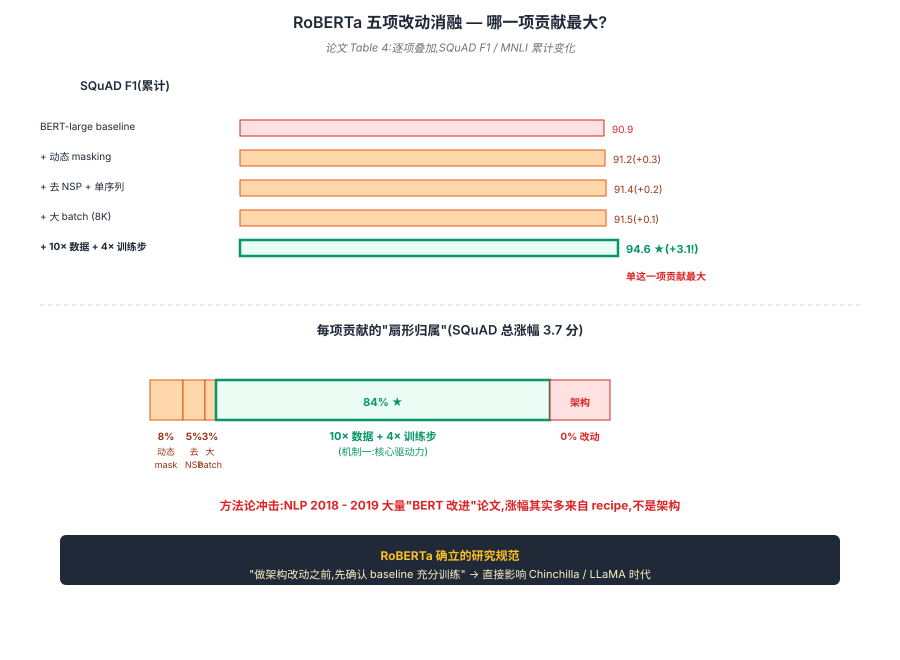

## 前作进展

[BERT](01-bert.md) 2018 年 10 月发表后引爆 NLP,但 2019 年上半年学界出现一个让人困惑的现象:**几乎每周都有"改进 BERT"的论文,大多数声称自己的某个架构改动让 BERT 更好**。XLNet、SpanBERT、MASS、UniLM、ELECTRA、ALBERT...每篇都报告自己在某些任务上击败了原版 BERT。

但 Facebook AI 的 Liu 等人(后来 RoBERTa 的作者)做了大量复现实验后发现一个尴尬的事实:**许多"BERT 改进"其实改的不是架构,而是训练 recipe**——更大 batch、更长训练、更多数据。如果给 BERT 同样的训练资源,它的效果一样能涨。换句话说,**BERT 原版严重 under-trained**——Devlin 团队 2018 年发表时受限于算力,没把 BERT 训到收敛。

2019 年 7 月发表的 *RoBERTa: A Robustly Optimized BERT Pretraining Approach* 系统证明了这一假设。**架构和 BERT 完全相同**(同样 encoder-only Transformer,同样 12 / 24 层),只改了 5 件训练相关的事:

1. 训练时间从 1M steps 推到 500K steps × 8K batch ≈ **4× 训练 FLOPs**
2. 训练数据从 16GB BookCorpus + Wiki 推到 **160GB**(加 CC-News, OpenWebText, Stories)
3. **去掉 NSP**——证明它对下游任务无益
4. **动态 masking**——每次见到同一句子重新 mask(BERT 是预处理时一次性 mask 固定)
5. **更大 batch size**——从 256 推到 8K,用大 batch 的更高 learning rate

结果:**RoBERTa-large 在 GLUE 上平均比 BERT-large 涨 5+ 分**,在多个任务上超过了所有 2019 年的"改进 BERT"工作。这一结果对学界冲击巨大——它说明 BERT 之上的大量架构创新其实是"训练不足导致的假象",真正的瓶颈是训练 recipe 而不是结构。

RoBERTa 的方法论也成为后续所有大模型工作的范例:**做架构改动之前,先确认 baseline 是充分训练的**。这一原则在 [Chinchilla](../07-gpt-scaling/04-scaling-laws.md) 修正 Kaplan 时再次体现——很多"加规模没用"的结论其实是因为 baseline 训练不足。

## 核心思想:Robustly Optimized BERT

### 直觉

2018 - 2019 年学界一窝蜂改 BERT 架构(XLNet、SpanBERT、MASS、ELECTRA...),每篇都报告自己更好。但 Facebook AI 的 Liu 等人复现后发现:**许多"BERT 改进"其实不是架构胜出,是训练 recipe 胜出**——Devlin 2018 受限于算力,BERT 原版严重 under-trained。

RoBERTa 的洞察反常识到几乎反潮流:**架构一行都不改,只把训练 recipe 调对**——5 件事下去,GLUE 平均涨 5+ 分,超过所有同期"BERT 改进"工作。这一论点的方法论价值在于把"架构创新 vs 训练充分"两个变量第一次解开,确立"做架构改动之前先确认 baseline 是充分训练的"研究规范。

但要让这 5 件事 work 且贡献可量化,可以归为三个互相独立的机制:

1. **10× 数据 + 4× 训练步** —— 真正起决定作用的(论文消融:单这一项涨 3 分)
2. **去掉 NSP + 单序列输入** —— 把负累去掉,让 512 token 上下文完整连续
3. **动态 masking + 大 batch + byte-level BPE** —— 训练 recipe 工程优化

→ 三机制串成"同架构,recipe 调对" 完整方案,见图 1 五项改动的独立消融。



## 机制一:10× 数据 + 4× 训练步 — 真正起决定作用的

## 五个改动的具体贡献

RoBERTa 论文最大的工程价值是**系统化消融**——逐个评估这五个改动的独立贡献,而不是把它们打包卖。论文 Table 4 给出关键数据:

| 改动 | SQuAD F1 | MNLI |
|------|------|------|
| BERT-large(原版 baseline) | 90.9 | 86.6 |
| + 动态 masking | 91.2 | 86.7 |
| + 去 NSP + 单序列输入 | 91.4 | 87.0 |
| + 大 batch(8K) | 91.5 | 87.1 |
| + 更多数据(160GB)+ 更长训练 | **94.6** | **89.4** |

**关键观察**:**最大的提升来自第 5 项("更多数据 + 更长训练")**——单这一项就涨了 ~3 分。其他 4 项加起来涨不到 1 分。这是 RoBERTa 论文最反直觉的结论:**前 4 项细节都重要但是次要的,真正起决定作用的是训练算力**。

这一发现的方法论意义:NLP 研究在 2018–2019 一窝蜂改架构,但很多"架构改进"的真实增益来源其实是配套使用的"更好训练 recipe"。RoBERTa 把这件事说穿后,2020 之后的研究开始更严肃地汇报 compute-matched comparison(同算力对比),这一规范持续到 [Chinchilla](../07-gpt-scaling/04-scaling-laws.md) 时代。

## 机制二:去掉 NSP + 单序列输入

(详细辩论见下方"去掉 NSP 的辩论"小节)

## 机制三:动态 Masking + 大 Batch + Byte-level BPE

### 动态 Masking

[BERT](01-bert.md) 的 masking 是**静态**的——在数据预处理阶段,每个训练样本被 mask 一次,固定下来后整个训练过程都用这同样的 mask 版本。如果一个句子被训练 40 次(40 epoch),模型看到的是**同一组 mask 位置**重复 40 次。

RoBERTa 改成**动态 masking**——每次喂给模型一个样本时**重新随机选 15% 的 token mask**。这样同一个句子在不同 epoch 看到不同 mask 位置,数据多样性提升。

实现上几乎不增加成本——masking 在 dataloader 里做,不影响训练 step。RoBERTa 的 Table 1 显示动态 vs 静态的差异是 +0.3 分(小但稳定)。

这一改进后来被所有 MLM 模型沿用。ALBERT / ELECTRA / DeBERTa 等都用动态 masking。

### 去掉 NSP 的辩论

NSP(Next Sentence Prediction)是 [BERT](01-bert.md) 的第二个预训练任务——判断句子 B 是不是紧跟在句子 A 后面。Devlin 团队设计 NSP 是希望它帮助句子级别的下游任务(NLI、QA)。

但 RoBERTa 做了对照实验(Table 2)发现:

| 输入格式 | MNLI | SQuAD F1 |
|------|------|------|
| BERT 原版:句对 + NSP | 87.3 | 91.1 |
| 句对但去掉 NSP loss | 87.4 | 91.4 |
| 单序列(无句对)+ 无 NSP | **87.9** | **92.0** |

**去 NSP 反而略好,而且改成单序列输入比双句子还好**。

为什么?有几个推测:

- **NSP 任务太简单**——50% 时随机选的句子在主题/风格上和 A 差异巨大,模型很快学会用浅层信号区分(不需要理解语义)。这一信号占用了预训练算力但学不到深表征
- **句对输入浪费了 50% 上下文**——512 token 上下文被分成两段,每段只有 ~256;单序列输入让模型一次看到完整 512 token 的连续文本,长依赖学得更好
- **NSP 数据收集成本高**——需要标记句子边界,扩展到 web 数据时麻烦

RoBERTa 直接去掉 NSP,所有训练都用单一连续序列(从同一文档采样直到填满 512 token)。这一改动后被 ALBERT(用 SOP 替代 NSP)、ELECTRA、DeBERTa 等沿用,**NSP 基本被判死刑**。

但 ALBERT 给出了一个"修正方案"——SOP(Sentence Order Prediction):同样是二分类任务,但 negative sample 是**调换顺序的同一对句子**(不是随机句子)。这迫使模型学到真正的句间连贯性,而不是主题相似度。详见 [03-albert.md](03-albert.md)。

### 大 Batch + 大数据

RoBERTa 的第三个关键改动是**显著增加 batch size 和数据规模**。BERT 原版用 256 序列的 batch,RoBERTa 推到 8K——大 32×。

为什么大 batch 这么重要?有两个理由:

**1. 大 batch 配合大 learning rate**——梯度估计更准,允许 lr 更大。RoBERTa 用 lr 4e-4(BERT 用 1e-4),训练快很多。这是 Goyal 2017 *Accurate, Large Minibatch SGD* 的发现的延伸

**2. 让"更多训练 step"有意义**——同样数据量,大 batch 意味着每个 step 见更多样本,模型见到的有效信号更多。RoBERTa 训了 500K steps × 8K batch ≈ 4B 序列 ≈ 1500B token,比 BERT 多 ~10×

数据上 RoBERTa 从 16GB 扩到 160GB:

| 数据集 | 大小 |
|------|------|
| BookCorpus | 16 GB(BERT 原版) |
| **+ CC-News** | + 76 GB |
| **+ OpenWebText** | + 38 GB |
| **+ Stories** | + 31 GB |
| **总计** | **160 GB** |

CC-News(英文 CommonCrawl 子集)和 OpenWebText(EleutherAI 复现 OpenAI WebText)是关键贡献——它们提供了"高质量 web 文本",比单纯 BookCorpus + Wiki 多样得多。这一数据组合后来被多个工作沿用,包括 GPT-NeoX、BLOOM 等开源 LLM。

## 三件套协同 — 同架构,recipe 调对就涨 5+ 分

> **10× 数据 + 4× 训练步(主力)+ 去 NSP 解放上下文 + 工程优化稳大 batch** —— 三者协同 → 架构 0 改动,GLUE 平均 +5+ 分。

- 只有 **10× 数据 + 4× 步**:NSP 还在,占 50% 算力学浅层信号 → 训得多但 ceiling 被压低,涨幅打 6 折
- 只有 **去 NSP**:数据 / 步数没加,模型仍 under-trained → 涨幅 < 1 分,远不足以 explain 5 分
- 只有 **工程优化**:数据 / 任务都没改 → byte-BPE / 动态 mask / 大 batch 共贡献 ~1 分,撑不起 RoBERTa

三件套协同 → SQuAD F1 94.6(BERT 90.9)/ MNLI 89.4(BERT 86.6),架构 0 改动 — 见图 2 BERT vs RoBERTa 训练资源与结果对比。


## 训练细节

| 维度 | RoBERTa-large |
|------|------|
| 架构 | **完全同 BERT-large**:24 层, d_model=1024, h=16, d_ff=4096, 355M 参数 |
| Tokenization | **byte-level BPE 50K** ←(差异:BERT 是 WordPiece 30K) |
| Masking | 动态(每次重新选)+ 仅 `MASK` token(去掉 80/10/10,简化) |
| 预训练任务 | **仅 MLM**(去掉 NSP) |
| 输入 | 单一连续序列,直到填满 512 token |
| 数据 | 160GB(BookCorpus + CC-News + OpenWebText + Stories)+ Wiki |
| 优化器 | Adam(β1=0.9, β2=0.98, ε=1e-6) ←(β2 改成 0.98,同 Transformer) |
| Learning rate | 4e-4(BERT 是 1e-4) |
| Warmup | 30K steps |
| Batch | **8K 序列 × 512 token = 4M token / batch**(BERT 是 128K) |
| 训练步 | 500K |
| 总训练 token | ~2 trillion(BERT 是 ~130 billion,差 15×) |
| 训练硬件 | 1024 × V100 GPU |
| 训练时间 | ~1 天 |

注意几个工程细节:

- **byte-level BPE 替代 WordPiece**——BPE 可以处理任何 Unicode,不需要 unknown token,后来被 GPT-2 / GPT-3 / LLaMA 沿用
- **简化 80/10/10 → 仅 `MASK` token**——RoBERTa 在消融里发现 80/10/10 的复杂 mask 策略和简单 `MASK` token 差异不大,简化能省点 dataloader 复杂度
- **β2 = 0.98**——和原版 Transformer 一致,大 batch 下更稳定

## 关键代码

RoBERTa 在代码层面和 BERT 几乎完全一样,差异主要在 dataloader 和 training loop:

```python
# 动态 masking 在 collate function 里做(BERT 是 preprocessing 时一次性做)
def roberta_collate_fn(batch_texts, tokenizer, mask_token_id, vocab_size, mask_prob=0.15):
    """每次 batch 加载时重新 mask,而不是 preprocessing 时一次性 mask"""
    input_ids = tokenizer(batch_texts, padding=True, return_tensors='pt').input_ids
    labels = input_ids.clone()

    # 动态 mask:每次重新选 15%
    mask = torch.rand(input_ids.shape) < mask_prob
    labels[~mask] = -100  # 不参与 loss

    # RoBERTa 简化版:全部换 [MASK]
    input_ids[mask] = mask_token_id
    return input_ids, labels

# 训练循环(去掉 NSP,只算 MLM loss)
for step in range(500_000):
    input_ids, labels = next(dataloader)
    hidden = model(input_ids)
    logits = mlm_head(hidden)
    loss = F.cross_entropy(logits.view(-1, vocab_size),
                           labels.view(-1),
                           ignore_index=-100)
    # 注意:没有 NSP head,只有 MLM head
    loss.backward()
    optimizer.step()
```

对比 [BERT](01-bert.md) 的代码,RoBERTa 的简化是显著的——少了 NSP head、少了 segment embedding(因为是单序列)、少了 80/10/10 复杂逻辑。**架构改进 0,训练 recipe 改进 5**——这就是 RoBERTa 的核心论点。

## 影响 / 后续

RoBERTa 在 NLP 历史的位置:**确立了"训练 recipe 比架构更重要"的研究规范**。具体影响:

**1. "充分训练 baseline" 成为研究规范**——RoBERTa 之后,论文里"我的新方法比 BERT 好 X 分"这种说法越来越被审视——审稿人会问"你的训练 budget 和 BERT 一样吗?"这一规范持续到 LLaMA 时代

**2. RoBERTa 替代 BERT 成为新的 baseline**——2020 之后所有 BERT-family 工作的对比基准都是 RoBERTa 而不是 BERT。HuggingFace 上 RoBERTa 的下载量也长期超过 BERT

**3. 数据规模意识提升**——"160GB 数据训了 1500B token"在 2019 年是惊人的规模,RoBERTa 把"用更多数据"做成了主流方法学。后续 GPT-3 175B 训 300B token、Chinchilla 70B 训 1.4T token 都受此启发

**4. byte-level BPE 成为标准**——RoBERTa 推动 byte-level BPE 在 NLP 领域普及,GPT-2 / GPT-3 / LLaMA 全部用 BPE 系列,不再用 WordPiece / SentencePiece

**5. NSP 被淘汰**——RoBERTa 之后没有人再用 NSP,新模型要么去掉(RoBERTa, ELECTRA),要么改成 SOP(ALBERT)

**6. 大 batch 训练的工程实践**——8K batch + 1024 GPU 是 2019 年学界最大的 NLP 训练之一,推动了 PyTorch DDP、混合精度训练等工程工具的成熟

RoBERTa 留下的几个方向:

- **架构改动的真实价值**——既然 BERT under-trained,那么 XLNet、SpanBERT 等架构改动相对 RoBERTa 的真实增益是什么?这一问题催生了后续 ELECTRA(用更高效的 RTD 任务替代 MLM)等工作
- **参数效率**:RoBERTa 仍是 355M,部署成本高 → [ALBERT](03-albert.md)、[DistilBERT](04-distilbert.md)
- **预训练任务的进一步改进**:ELECTRA(2020)用 replaced token detection 替代 MLM,15% 信号利用率推到 100%

→ [03-albert.md](03-albert.md) · 参数共享和因式分解,RoBERTa 之后的"参数效率"路线
→ [04-distilbert.md](04-distilbert.md) · 知识蒸馏,工业部署默认
→ [01-bert.md](01-bert.md) · 父方法,RoBERTa 不动架构只改训练 recipe
→ [../07-gpt-scaling/04-scaling-laws.md](../07-gpt-scaling/04-scaling-laws.md) · Chinchilla 修正 Kaplan 的精神延续 — "baseline 充分训练" 的方法论
