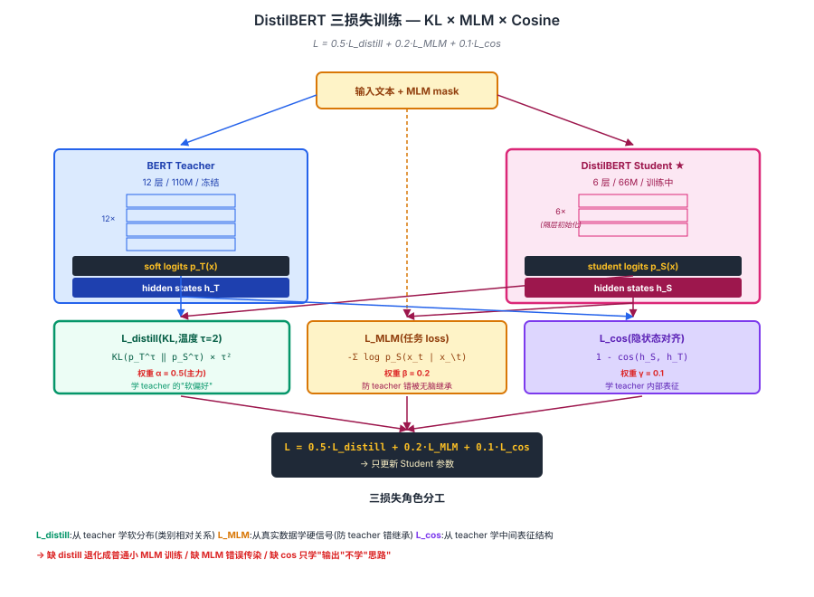
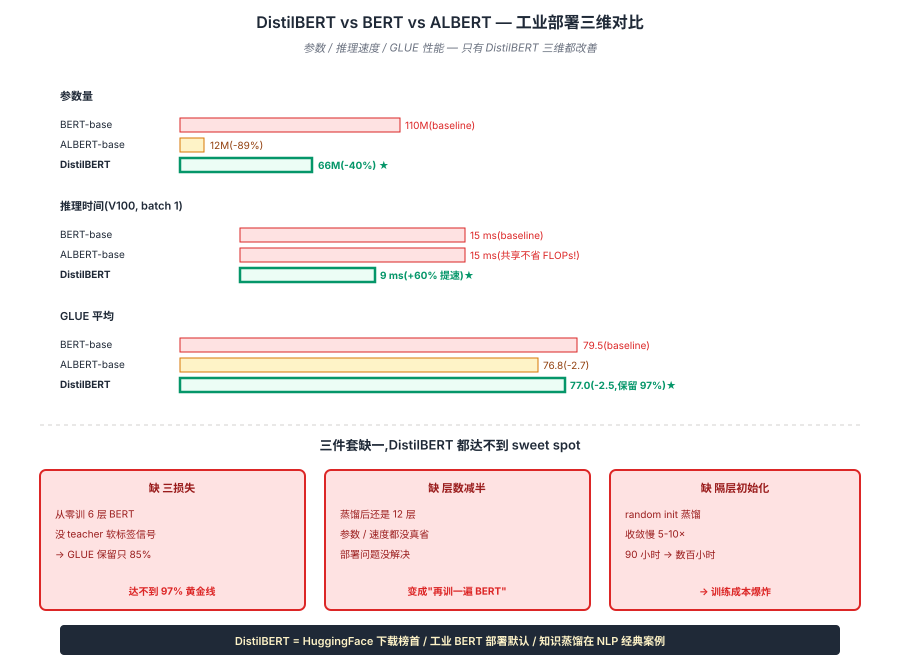

## 前作进展

[BERT](01-bert.md) 在 NLP 上是巨大成功,但工业部署一直是个问题。BERT-base 110M 参数在 V100 上推理 batch 1 大约 15ms,放到 CPU 上要 100ms+,放到移动端基本不可行。对于大规模服务(搜索、推荐、广告等),延迟和成本是硬指标。

社区在 2019 年探索了几条压缩 BERT 的路线:

- **[ALBERT](03-albert.md)** —— 参数共享,显存省但速度不省(forward 仍要走 24 层)
- **量化**(INT8 BERT)—— 把 fp32 权重量化到 int8,模型小 4× 速度快 2-3×,但精度有损失
- **剪枝**(Distill-BERT, FastBERT)—— 删除不重要的 attention head 和 layer
- **知识蒸馏**(Distilling-BERT, BERT-PKD)—— 用大模型作为 teacher 训练小模型 student

知识蒸馏(Knowledge Distillation, Hinton 2015)是其中最成熟的方向。基本思想:

1. 训一个大 "teacher" 模型(BERT-base)
2. 训一个小 "student" 模型(6 层 BERT)
3. **不让 student 直接学硬标签**(原始任务的 ground truth),而是让 student **模仿 teacher 的输出分布**

为什么模仿 teacher 比直接学硬标签好?因为 teacher 的 softmax 输出包含了**类别间的相对关系**——比如做情感分类时 teacher 可能给"正面"0.8、"负面"0.15、"中性"0.05,这告诉 student"中性比负面更不像",而硬标签只说"是正面"。这些"软信息"对小模型学习极其有用。

HuggingFace 团队 2019 年 10 月发表 *DistilBERT, a distilled version of BERT* 把 Hinton 蒸馏方法应用到 BERT 上,做了几个关键工程优化,产出了**工业 BERT 部署的事实默认**:

- 参数 **66M**(BERT-base 110M,少 40%)
- 推理速度快 **60%**
- 显存少 40%
- GLUE 上保留 **97%** 的 BERT-base 性能

HuggingFace Transformers 库里 DistilBERT 的下载量长期是所有 BERT 系列里最高的——简单、轻量、易部署。

## 核心思想:三损失蒸馏 + 层数减半 + 隔层初始化

### 直觉

[BERT-base](01-bert.md) 110M 在 CPU 推理 100ms+、移动端基本不可行。直接训一个小 BERT 从零开始,效果会差很多(数据 + 算力相同,容量小学到的少)。

Hinton 2015 的洞察:**让小 student 模仿大 teacher 的"软分布"**——teacher 的 softmax 输出包含类别间的相对关系(情感分类时"正面 0.8 / 负面 0.15 / 中性 0.05"),这些"软信息"对小模型学习极其有用,远比硬标签 ground truth 信息量大。

但要把 BERT 真正压成可工业部署的版本,**只蒸馏 logit 还不够**。HuggingFace 团队加了两个工程关键:

1. **三损失联合训练** —— KL 蒸馏 + MLM 原任务 + 隐状态 cosine 对齐
2. **层数减半(12→6)** —— 真省 FLOPs(不像 [ALBERT](03-albert.md) 共享不省 FLOPs)
3. **隔层初始化** —— 用 BERT 第 1,3,5,7,9,11 层权重初始化 student,收敛快得多

→ 三机制串起来,DistilBERT 比 BERT-base 参数 -40% / 速度 +60% / 性能保留 97%,见图 1 三损失训练全景。



## 机制一:三损失联合训练

DistilBERT 的核心是**三损失联合训练**:

$$
\mathcal{L} = \alpha \cdot \mathcal{L}_{\text{distill}} + \beta \cdot \mathcal{L}_{\text{MLM}} + \gamma \cdot \mathcal{L}_{\text{cos}}
$$

**Loss 1: Distillation loss(蒸馏损失)**——student 模仿 teacher 的预测分布:

$$
\mathcal{L}_{\text{distill}} = \text{KL}\!\left(p_T^{(\tau)} \,\|\, p_S^{(\tau)}\right)
$$

`p_T^{(\tau)}` 和 `p_S^{(\tau)}` 是 teacher 和 student 加了**温度 `\tau`** 的 softmax:

$$
p_i^{(\tau)} = \frac{\exp(z_i / \tau)}{\sum_j \exp(z_j / \tau)}
$$

`\tau > 1` 让概率分布更**平滑**,凸显类别间的相对关系。Hinton 2015 论文的关键洞察:**蒸馏时用温度 5-10**,让 student 学到"哪个类别比哪个更不像"的细粒度信号。DistilBERT 用 `\tau = 2`,在 inference 时换回 `\tau = 1`。

**Loss 2: MLM loss(原始任务)**——student 仍然要做 BERT 的 masked language modeling:

$$
\mathcal{L}_{\text{MLM}} = -\sum_{t \in \text{Masked}} \log p_S(x_t | x_{\setminus t})
$$

这保证 student 不只学 teacher 的"软偏好",也直接受真实数据信号约束——防止 teacher 的错误被无脑继承。

**Loss 3: Cosine loss(隐状态对齐)**——让 student 的隐状态和 teacher 的隐状态在**方向上**对齐:

$$
\mathcal{L}_{\text{cos}} = 1 - \cos(h_S, h_T)
$$

这一损失迫使 student 不只学 teacher 的最终输出,还学 teacher 的**中间表征**。从知识蒸馏理论看,中间层对齐让 student 学到"teacher 内部是怎么想的"而不只是"teacher 最后说什么"。

DistilBERT 的论文超参:`α = 0.5, β = 0.2, γ = 0.1`(蒸馏权重最大,符合直觉)。

## 机制二 + 机制三:层数减半 + 隔层初始化

DistilBERT 的架构和 [BERT-base](01-bert.md) 一致,但**层数从 12 减到 6**:

| 维度 | BERT-base | DistilBERT |
|------|------|------|
| 层数 | 12 | **6** |
| d_model | 768 | 768(同 BERT) |
| h | 12 | 12(同) |
| d_ff | 3072 | 3072(同) |
| 参数量 | 110M | **66M** |
| 推理速度(V100) | 1× | **1.6×** |
| GLUE 平均 | 79.5 | **77.0** |

**关键工程 trick:用 BERT-base 的权重初始化 DistilBERT**。具体做法是把 BERT-base 的 12 层**每隔一层**取一层作为 DistilBERT 的初始权重:取 BERT 的第 1, 3, 5, 7, 9, 11 层作为 DistilBERT 的 6 层。这一初始化让蒸馏训练**收敛快得多**——从 random init 训 DistilBERT 要几天,从 BERT 权重初始化只要 1 天。

为什么"减半层数"而不是"减小 hidden_size"?DistilBERT 团队的消融显示:

- 减层数:推理时间近线性减小,效果略损
- 减 hidden size:推理时间近平方减小但效果损失更大(因为 attention 的表达力被压缩)

层数减半是 6 层 BERT 在 latency 和 quality 之间的最佳平衡。后续 TinyBERT、MobileBERT 等更小的模型探索过减 hidden size,但工业上 DistilBERT 这个"6 层 768 维"配置最受欢迎。

## 三件套协同 — 真正的工业部署 sweet spot

> **三损失把 teacher 知识完整传过去 + 层数减半真省 FLOPs + 隔层初始化让训练快得起来** —— 三者协同 → DistilBERT 保留 97% 性能、参数 -40%、速度 +60%,成为工业 BERT 部署默认。

- 只有 **三损失蒸馏**:架构和 BERT 一样大,蒸馏后还是 110M 参数 → 没解决部署问题,只是再训一遍 BERT
- 只有 **层数减半**:从零训 6 层 BERT,没 teacher 软标签信号 → 效果损失大,GLUE 保留只 85% 左右
- 只有 **隔层初始化**:不蒸馏只用初始化的 6 层 → 等于 truncated BERT 继续训 MLM,失去蒸馏的核心收益

三件套首次组合 → DistilBERT vs BERT-base vs ALBERT 完整对比见图 2:**DistilBERT 是少数真正"参数 + 速度 + 性能"三维都改善的方案**。



## 性能 vs 速度

DistilBERT 在 GLUE 9 任务的成绩(论文 Table 1):

| 任务 | BERT-base | DistilBERT | 保留 % |
|------|------|------|------|
| MNLI | 86.7 | 82.2 | 95% |
| QNLI | 91.8 | 89.2 | 97% |
| QQP | 89.6 | 88.5 | 99% |
| SST-2 | 93.5 | 91.3 | 98% |
| CoLA | 56.3 | 51.3 | 91% |
| MRPC | 88.6 | 87.5 | 99% |
| **GLUE 平均** | **79.5** | **77.0** | **97%** |

**平均保留 97% 性能**——只损 2.5 分换 40% 参数 + 60% 速度。这是知识蒸馏在 NLP 上最经典的成本-收益比之一,直接成为工业 BERT 部署的事实默认。

速度对比(V100,batch 1,序列 128):

| 模型 | 参数 | 推理时间 | 推理 TPS(单 GPU) |
|------|------|------|------|
| BERT-large | 340M | 60 ms | 15 |
| BERT-base | 110M | 15 ms | 60 |
| **DistilBERT** | **66M** | **9 ms** | **100+** |

DistilBERT 比 BERT-base 快 60%,比 BERT-large 快 6×——这一速度差异在大规模服务里意味着**部署成本差 4-10 倍**。

## 训练细节

| 维度 | DistilBERT |
|------|------|
| Teacher | BERT-base-uncased(冻结) |
| Student 架构 | 6 层 Transformer, d=768, h=12, d_ff=3072, 66M 参数 |
| Student 初始化 | BERT-base 的第 1, 3, 5, 7, 9, 11 层权重 |
| 预训练任务 | MLM(动态 masking,同 RoBERTa)+ 蒸馏 |
| 损失权重 | α=0.5(distill), β=0.2(MLM), γ=0.1(cosine) |
| 温度 | 2 |
| 数据 | 同 BERT(BookCorpus + Wiki,~16 GB) |
| Batch | 4K(相对大,但比 RoBERTa 8K 小) |
| 训练步 | ~28 万 steps |
| 优化器 | Adam(β2=0.999),warmup 后线性衰减 |
| 训练硬件 | 8 × V100 |
| 训练时间 | ~90 小时 |

注意 DistilBERT 的训练**比 BERT 还短**——因为只有 6 层、且从 BERT 初始化所以收敛快。这是知识蒸馏的另一个工程优势:**比直接训小模型从零开始快得多**。

## 关键代码

DistilBERT 的核心是蒸馏损失实现:

```python
import torch
import torch.nn as nn
import torch.nn.functional as F

class DistillationLoss(nn.Module):
    def __init__(self, temperature=2.0, alpha=0.5, beta=0.2, gamma=0.1):
        super().__init__()
        self.t = temperature
        self.alpha, self.beta, self.gamma = alpha, beta, gamma

    def forward(self, student_logits, teacher_logits, student_hidden,
                teacher_hidden, mlm_labels):
        # Loss 1: 蒸馏 — KL(p_T ‖ p_S),带温度软化
        loss_distill = F.kl_div(
            F.log_softmax(student_logits / self.t, dim=-1),
            F.softmax(teacher_logits / self.t, dim=-1),
            reduction='batchmean'
        ) * (self.t ** 2)  # 标准 KD 公式里要 × t² 抵消梯度缩放

        # Loss 2: MLM — student 直接学 ground truth
        loss_mlm = F.cross_entropy(
            student_logits.view(-1, student_logits.size(-1)),
            mlm_labels.view(-1),
            ignore_index=-100,
        )

        # Loss 3: cosine — 隐状态方向对齐
        # 只对非 padding 位置算
        target = torch.ones(student_hidden.size(0), student_hidden.size(1),
                            device=student_hidden.device)
        loss_cos = F.cosine_embedding_loss(
            student_hidden.view(-1, student_hidden.size(-1)),
            teacher_hidden.view(-1, teacher_hidden.size(-1)),
            target.view(-1),
        )

        return self.alpha * loss_distill + self.beta * loss_mlm + self.gamma * loss_cos

# 训练循环
teacher = BertModel.from_pretrained("bert-base-uncased").eval()
student = DistilBertModel(num_layers=6, hidden_size=768, ...)
# 关键:用 teacher 的每隔一层初始化 student
init_student_from_teacher(student, teacher, layer_indices=[1,3,5,7,9,11])

criterion = DistillationLoss(temperature=2.0, alpha=0.5, beta=0.2, gamma=0.1)
optimizer = torch.optim.AdamW(student.parameters(), lr=5e-4)

for batch in dataloader:
    with torch.no_grad():
        t_outputs = teacher(batch.input_ids, output_hidden_states=True)
    s_outputs = student(batch.input_ids, output_hidden_states=True)

    loss = criterion(
        student_logits=s_outputs.logits,
        teacher_logits=t_outputs.logits,
        student_hidden=s_outputs.hidden_states[-1],
        teacher_hidden=t_outputs.hidden_states[-1],
        mlm_labels=batch.mlm_labels,
    )
    loss.backward()
    optimizer.step()
```

工程要点:

- **`teacher.eval()` + `torch.no_grad()`**:teacher 完全冻结,不算梯度
- **`× t²` 抵消梯度缩放**:温度软化后 logit 变小,梯度也按 1/t² 缩放,乘 t² 抵消(Hinton 原始 KD 公式)
- **`output_hidden_states=True`**:让 transformers 返回每层隐状态,用于 cosine loss
- **layer_indices 初始化**:这一行直接决定 DistilBERT 训练快慢

## 影响 / 后续

DistilBERT 在 BERT-family 历史的位置:**让 BERT 进入大规模生产部署**。具体影响:

**1. HuggingFace 生态的下载榜首**——DistilBERT 长期是 HuggingFace Hub 下载量最高的 BERT 系列模型。简单易用、效果可接受、部署友好,成为初学者和生产工程师的默认选择

**2. 知识蒸馏作为通用模型压缩范式**——DistilBERT 之后几乎每个大模型都有"蒸馏版":TinyBERT(2019)、MobileBERT(2020)、MiniLM(2020)、DistilGPT2、DistilRoBERTa 等;视觉领域 DeiT(2021)等也用类似蒸馏方法

**3. "保留 97% 性能"成为蒸馏黄金线**——后续蒸馏工作把"保留 95%+ 性能"作为成功标准。能保留 90%+ 算优秀,80% 以下基本不会上 paper

**4. 三损失联合训练范式被广泛沿用**——KD loss + 任务 loss + 中间层对齐这一组合是后续大多数蒸馏工作的标配。TinyBERT 进一步加 attention map alignment、embedding alignment 等更多中间信号

**5. 工业部署默认"先做蒸馏"**——大规模服务部署的 BERT 系模型几乎没有用原版的,都是 DistilBERT 或自定义蒸馏版。蒸馏成为部署前必做的工程步骤

**6. 推动 LLM 时代的蒸馏研究**——LLaMA 的"小模型 + 大数据"路线一定程度上是 DistilBERT 思想的延伸——"蒸馏"在 LLM 时代变成"用大模型生成的数据训练小模型"(Alpaca/Vicuna 风格)

DistilBERT 留下的开放方向:

- **更激进的压缩**——TinyBERT(<10M)、MiniLMv2 等推到极致;但效果损失也更大
- **任务特定蒸馏**——通用蒸馏的 DistilBERT 在某些任务上不如"任务特定蒸馏"的小模型;catered distillation 是后续研究方向
- **LLM 时代的蒸馏**——把 GPT-3.5/GPT-4 当 teacher 蒸馏小模型是 2023+ 的活跃方向(Alpaca、Vicuna、Orca 都是这条路)

至此 06-bert-family 家族 4 节点完整:**[BERT](01-bert.md)(奠基)→ [RoBERTa](02-roberta.md)(训练优化)→ [ALBERT](03-albert.md)(参数压缩)→ [DistilBERT](04-distilbert.md)(知识蒸馏)**——覆盖 encoder-only 路线的核心演化,从 2018 概念证明到 2019 工业化的完整路径。

→ [03-albert.md](03-albert.md) · 参数效率路线,但推理速度不变;DistilBERT 是它的"工程实际版"
→ [02-roberta.md](02-roberta.md) · 训练优化路线;DistilBERT 通常以 RoBERTa 而不是 BERT 为 teacher
→ [01-bert.md](01-bert.md) · 父结构,DistilBERT 是 BERT 的工业部署版
→ [../07-gpt-scaling/05-gpt4-llama.md](../07-gpt-scaling/05-gpt4-llama.md) · LLaMA 系列 "小模型 + 大数据" 是 DistilBERT 精神的 LLM 延伸
→ [../11-peft-lora/](../11-peft-lora/) · LoRA 也是参数效率方向,与蒸馏正交可叠加
