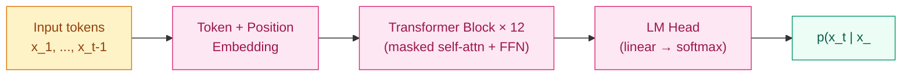

## 前作进展

2017 年末的 NLP 研究有一个尴尬的局面:[Transformer](../05-transformer/01-transformer.md) 刚在机器翻译上击败了所有 RNN baseline,但 NLP 其他任务——分类、阅读理解、自然语言推理、命名实体识别——都各有专门模型,**每个任务从头训一个网络是默认范式**。这造成几个明显问题:

**1. 标注数据稀缺**——情感分类、自然语言推理这些任务的标注数据往往只有几千到几万条,从头训一个深度模型容易过拟合。SQuAD 1.0(2016)算大的也才 10 万条问答对
**2. 模型不通用**——给某个任务训一个 BiLSTM-Attention 模型,完全没法迁移到另一个任务。换任务就要换数据、换网络、换超参,工程成本高
**3. 浪费了海量无标注文本**——互联网上有 TB 级别的自然语言文本,但当时的监督学习范式只能用上其中带标签的极小一部分(≪ 1%)

这条线上前作主要有两类尝试:

**预训练词向量**(Word2Vec 2013, GloVe 2014, FastText 2016)——把"无标注文本"压成"每个词一个向量"。在 RNN 时代是标配,但词向量是**静态的**——"bank"作为"银行"和"河岸"得到同一个向量,且只解决最底层 embedding,上层 RNN 仍要从头训

**上下文相关词表征**——ULMFiT(Howard 2018, AWD-LSTM-based)和 ELMo(Peters 2018, BiLSTM-based)是这条线的两个关键节点。它们都做了"先在 LM 任务上预训练,再迁移到下游"——但 backbone 仍是 LSTM,无法 scale,且预训练任务和微调任务的接口不统一

OpenAI 的 Radford 团队 2018 年 6 月发表的 *Improving Language Understanding by Generative Pre-Training*(GPT-1)做了三件事的组合:

1. **backbone 换成 Transformer**(具体是 decoder-only)
2. **预训练任务用纯生成式语言模型**——自回归地预测下一个 token,不需要任何标注
3. **微调时把所有任务转成"序列输入 → 标签"的统一接口**

这一组合在 12 个标准 NLP benchmark 上拿到 9 个 SOTA,证明了"预训练 + 微调"是一条通用范式。同年 10 月 Google 的 BERT 用 encoder-only + masked LM 给出了双向版本,在 GLUE 上更亮眼,把整个 NLP 社区拖进了"预训练时代"。

## 核心思想:Decoder-only + 自回归预训练

GPT-1 的架构是 [原版 Transformer](../05-transformer/01-transformer.md) 的 **decoder 部分**——只保留 masked self-attention + FFN,去掉 cross-attention(因为没有 encoder),layer 数 12,`d_model = 768, h = 12, d_ff = 3072`,总参数 **117M**。



*图 1:GPT-1 整体结构——decoder-only Transformer,输入是历史 token,输出是下一个 token 的概率分布。所有层共享同一个架构,无任何任务特定模块。*

**预训练目标**——标准的语言模型最大似然:

$$
\mathcal{L}_{\text{pre}} = -\sum_{t=1}^{T} \log p(x_t | x_{t-k}, \ldots, x_{t-1}; \theta)
$$

`k` 是上下文窗口(GPT-1 是 512),`θ` 是 Transformer 参数。这就是 [Bengio 2003 NPLM](https://www.jmlr.org/papers/volume3/bengio03a/bengio03a.pdf) 的现代化版本——用 Transformer 替代 MLP,用大语料替代 100M token 的小数据集。

**预训练数据**用 **BookCorpus**:7000 本未发表小说,约 **800M token**。选小说而不是 Wikipedia 的理由是论文里特别强调的——**长程依赖更丰富**。小说里一个伏笔可以隔几页才有回应,这迫使模型学习"看到 t-500 位置的语义结构"的能力。Wiki 文章短、独立,长依赖弱。

**预训练硬件**:8 × P6000 GPU × 30 天。117M 参数 + 800M token,按现代标准是非常小的训练量,但 2018 年还是相当于一次"大规模实验"。

## 微调:统一接口

GPT-1 真正的工程贡献是**把所有 NLP 任务转成统一的序列输入格式**,让同一个预训练模型可以适配几乎任何任务,只需要换最后一层 head。论文给出 4 种任务格式:

**分类**(单句输入)
```
<s> 文本 </s>  →  [LM 输出最后位置接 linear classifier]
```

**自然语言推理**(句对)
```
<s> 前提 <$> 假设 </s>  →  [分类]
```

**句子相似度**(对称句对,需要无序)
```
<s> 句 A <$> 句 B </s>  和  <s> 句 B <$> 句 A </s>
→ 两次 forward,输出相加后接 linear
```

**多项选择**(QA / 推理)
```
对每个候选答案 c_i:<s> 文档 + 问题 <$> 候选答案 c_i </s>
→ N 次 forward,每个输出取最后位置接 linear,合起来 softmax 出最优
```

这些格式的核心 trick 是 **`<s>` `<$>` `</s>` 三个特殊 token**——分别标记开始、字段分隔、结束。在 Transformer 看来这些 token 和普通词一样,但任务特定的"哪个位置代表什么"被显式编码进序列里。模型本身不需要任何任务特定模块,微调时只多一个 task-specific linear head。

**微调目标**——预训练 LM loss + 任务监督 loss 联合:

$$
\mathcal{L}_{\text{ft}} = \mathcal{L}_{\text{task}} + \lambda \cdot \mathcal{L}_{\text{LM}}
$$

`λ = 0.5` 是论文默认值。加 LM loss 的作用是**正则化**——防止微调时模型"忘掉"预训练学到的通用语言能力,这是 catastrophic forgetting 的早期工程解。后续 ULMFiT、BERT、GPT-2 等模型也都用类似技巧。

## 性能数据

GPT-1 在 12 个 benchmark 上的成绩(按论文 Table 2):

| 任务 | 之前 SOTA | GPT-1 | 提升 |
|------|------|------|------|
| MNLI(自然语言推理) | 80.6 | **82.1** | +1.5 |
| SNLI(自然语言推理) | 89.3 | **89.9** | +0.6 |
| QNLI(QA 推理) | 82.3 | **88.1** | +5.8 |
| RTE(蕴含) | 61.7 | **56.0** | -5.7 ⚠ |
| SciTail(科学推理) | 83.3 | **88.3** | +5.0 |
| RACE-h(中文阅读理解) | 53.3 | **59.0** | +5.7 |
| RACE-m | 55.7 | **62.9** | +7.2 |
| Story Cloze | 77.6 | **86.5** | +8.9 |
| MRPC(改写) | 86.0 | **82.3** | -3.7 ⚠ |
| QQP(问题相似度) | 70.3 | **70.3** | 0.0 |
| SST-2(情感) | 91.6 | **91.3** | -0.3 |
| CoLA(语法接受度) | 35.0 | **45.4** | +10.4 |

12 个任务里 9 个 SOTA(论文统计口径),最显著的提升是**长上下文推理类**(QNLI / Story Cloze / RACE)——这正好印证了 BookCorpus 长程依赖训练的价值。失利的几个(RTE / MRPC)是小数据任务(几千条),论文里也承认 GPT-1 在数据极少时不如专门的 BiLSTM 模型。

但 GPT-1 的真正意义不在这些数字,而在**它证明了一个方法论假设**:无监督预训练 + 任务微调 + 统一 Transformer backbone,可以替代当时所有 NLP 任务的专门架构。这一假设在 4 个月后被 BERT 用更激进的方式(更大模型 + 双向 MLM)进一步验证,从此 NLP 的研究范式被永久改变。

## 训练细节

| 维度 | GPT-1 |
|------|------|
| 架构 | 12 层 decoder-only Transformer, `d_model = 768, h = 12, d_ff = 3072`, GELU 激活, 117M 参数 |
| 上下文窗口 | 512 token |
| Tokenization | BPE,40K 词表 |
| 预训练数据 | BookCorpus,800M token |
| 预训练优化器 | Adam, lr=2.5e-4, warmup 2000 步后 cosine 衰减到 0 |
| 预训练 batch | 64 序列 × 512 token = 32K token / batch |
| 预训练时间 | 8 × P6000 × 100 epoch ≈ 30 天 |
| 微调 lr | 6.25e-5(比预训练小 4 倍,经典"小 lr 微调"做法) |
| 微调 epoch | 通常 3,小任务多到 10 |
| LM auxiliary loss 系数 | λ = 0.5 |
| Dropout | 0.1 |
| Position encoding | learned absolute(不是正余弦,和 BERT 一致;后来被 [RoPE](../05-transformer/04-rope.md) 取代) |

注意 GPT-1 用 **learned PE 而不是正余弦**——原版 Transformer 论文比较过两种,效果差不多,GPT-1 选了 learned PE 是因为实现略简单。BERT 也是 learned PE。直到 [RoPE](../05-transformer/04-rope.md) 出现,learned PE 才被淘汰。

## 关键代码

GPT-1 的 decoder-only block,几乎就是原版 Transformer encoder block + causal mask:

```python
import torch
import torch.nn as nn
import torch.nn.functional as F

class GPT1Block(nn.Module):
    def __init__(self, d_model, num_heads, d_ff, dropout=0.1):
        super().__init__()
        self.attn = MaskedMultiHeadAttention(d_model, num_heads)
        self.ffn = nn.Sequential(
            nn.Linear(d_model, d_ff),
            nn.GELU(),                            # ← 不是 ReLU
            nn.Linear(d_ff, d_model),
        )
        self.ln1 = nn.LayerNorm(d_model)
        self.ln2 = nn.LayerNorm(d_model)
        self.drop = nn.Dropout(dropout)

    def forward(self, x):
        # Post-LN(原版风格,GPT-2 之后改为 Pre-LN)
        x = self.ln1(x + self.drop(self.attn(x)))
        x = self.ln2(x + self.drop(self.ffn(x)))
        return x

class GPT1(nn.Module):
    def __init__(self, vocab_size, max_len=512, d_model=768,
                 num_heads=12, num_layers=12, d_ff=3072):
        super().__init__()
        self.tok_emb = nn.Embedding(vocab_size, d_model)
        self.pos_emb = nn.Embedding(max_len, d_model)  # learned PE
        self.blocks = nn.ModuleList([
            GPT1Block(d_model, num_heads, d_ff) for _ in range(num_layers)
        ])
        self.ln_f = nn.LayerNorm(d_model)
        self.lm_head = nn.Linear(d_model, vocab_size, bias=False)
        # 关键:weight tying — LM head 和 token embedding 共享权重
        self.lm_head.weight = self.tok_emb.weight

    def forward(self, x):
        # x: [B, T] token ids
        B, T = x.shape
        pos = torch.arange(T, device=x.device)
        h = self.tok_emb(x) + self.pos_emb(pos)
        for block in self.blocks:
            h = block(h)
        h = self.ln_f(h)
        logits = self.lm_head(h)  # [B, T, vocab_size]
        return logits

def causal_mask(T):
    """生成 [T, T] 下三角 mask:位置 t 只能看 [0, t]"""
    return torch.tril(torch.ones(T, T)).bool()
```

两个工程要点:

- **GELU 激活而不是 ReLU** —— GPT-1 是第一个在 Transformer 里用 GELU 的主流模型。GELU 的论文(Hendrycks 2016)证明它在 NLP 任务上略优于 ReLU,GPT/BERT 全部采用,后来成为 LLM 默认激活直到 [SwiGLU](../05-transformer/04-rope.md)
- **Weight tying** —— LM head 的线性投影 `W_{lm}` 和 token embedding `W_{emb}` 共享权重(Press 2016)。这把 30%+ 的参数省下来(`vocab_size × d_model` 这一大块),且在标准 LM 任务上反而略好

## 影响 / 后续

GPT-1 在历史上的位置很特殊——**它单独看影响不大**(同年 BERT 在 GLUE 上更亮眼,把它抢了风头),但**它确立的范式定义了之后 5 年的 LLM 路线**。具体几条线:

**1. "预训练 + 微调"成为 NLP 默认范式**——2018 之后所有任务都从 BERT/GPT 预训练权重起步,从头训成为例外。HuggingFace 的 Transformers 库就是为这个范式服务的工程化产物

**2. Decoder-only Transformer 路线**——GPT-1 选 decoder-only 在 2018 是非主流选择(BERT 双向更亮眼)。但生成式建模的通用性在 [GPT-2](02-gpt2.md) / [GPT-3](03-gpt3.md) 后被全面验证,decoder-only 成为 LLM 默认架构。今天 LLaMA / Mistral / Qwen 全是 decoder-only

**3. 任务统一接口的种子**——GPT-1 的"所有任务转成序列输入"思想直接预示了 [GPT-3](03-gpt3.md) 的 in-context learning(任务描述 + 例子全部用自然语言写在 prompt 里)。从这个角度,GPT-3 就是 GPT-1 任务接口的极端化——连 task-specific head 都不要,任务完全用自然语言描述

**4. Weight tying / GELU / 联合 LM loss 等具体工程细节**被几乎所有后续 LM 沿用

GPT-1 的局限也很明确,这些局限推动了后续节点的方向:

- **117M 参数 + 800M token 还是太小**,zero-shot 能力几乎为 0 → [GPT-2](02-gpt2.md) 推到 1.5B + 40B token
- **仍然需要任务微调**——每个任务还是要标注数据 → [GPT-3](03-gpt3.md) 用 in-context learning 消除微调依赖
- **Scaling 关系未知**——加规模会不会一直 work?最优 N/D 配比是什么? → [Scaling Laws](04-scaling-laws.md) 节点
- **Post-LN + 正余弦/learned PE + ReLU/GELU FFN 是 2018 配方** → 2023 LLaMA 全套换成 Pre-RMSNorm + [RoPE](../05-transformer/04-rope.md) + SwiGLU,见 [05-gpt4-llama.md](05-gpt4-llama.md)

→ [02-gpt2.md](02-gpt2.md) · 1.5B 参数 + WebText,zero-shot 能力首次涌现
→ [03-gpt3.md](03-gpt3.md) · 175B + in-context learning,LLM 时代正式开启
→ [04-scaling-laws.md](04-scaling-laws.md) · Kaplan + Chinchilla,把 scaling 从经验推到定律
→ [05-gpt4-llama.md](05-gpt4-llama.md) · 多模态 + 开源,现代 LLM 配方定型
→ [../06-bert-family/](../06-bert-family/) · 同年 BERT 用 encoder-only + masked LM 的双向版本
→ [../05-transformer/01-transformer.md](../05-transformer/01-transformer.md) · 父结构,GPT-1 是 Transformer decoder 的第一个大型应用
