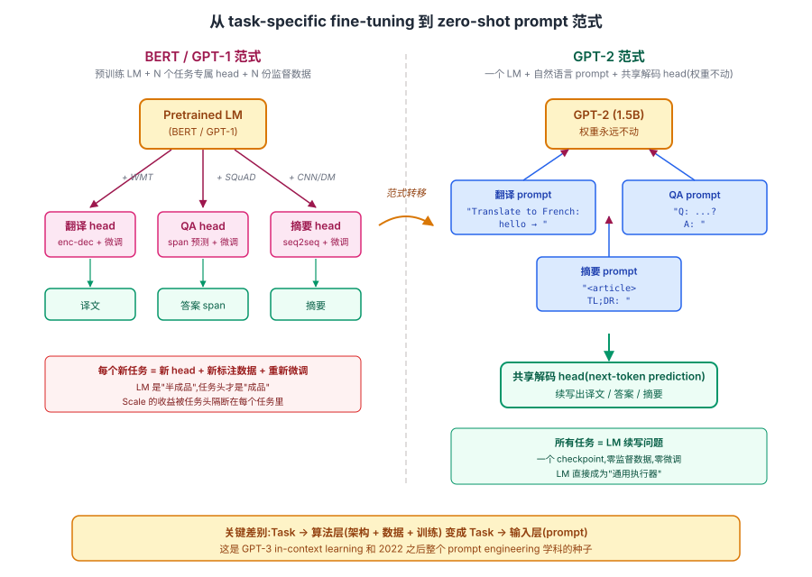
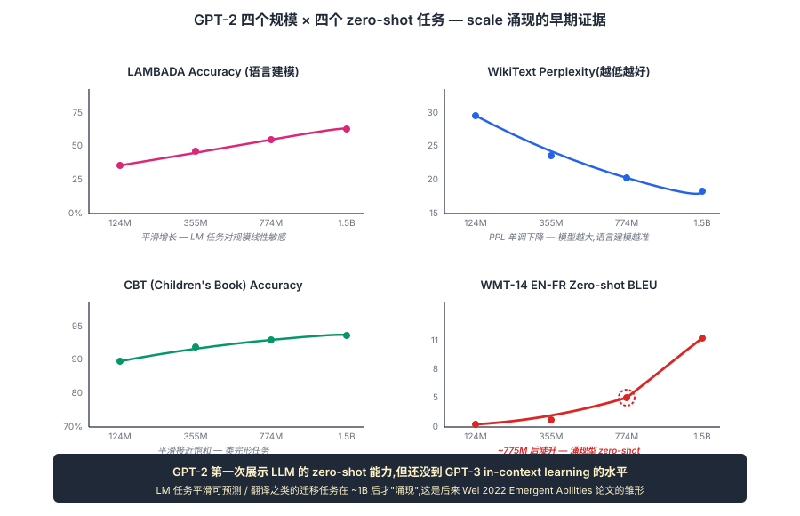

## 前作进展

[GPT-1](01-gpt1.md) 在 2018 年 6 月证明了"无监督预训练 + 任务微调"的范式可行,4 个月后 BERT 用 encoder-only + masked LM 把这条路线在 GLUE 上推到了新高度。到 2018 年底,NLP 社区已经全面接受"预训练 + 微调"是默认范式,但所有人(包括 GPT-1 团队自己)都默认**微调环节是必需的**——预训练模型只能学到通用语言能力,任何具体任务都还要标注数据 + 监督学习。

OpenAI 团队在 2018 年底开始思考一个更激进的问题:**如果继续 scaling 预训练,能不能让模型不微调就直接做任务?**

这个问题的动机是:GPT-1 训练时模型见过非常多样的文本(小说里有对话、描写、推理、问答),理论上**任何 NLP 任务都可以表述成"给定一段上下文,生成一段文本"**——分类任务可以让模型生成类别名,翻译任务可以让模型在源句后生成目标句,QA 任务可以让模型在问题后生成答案。如果训练数据足够多样化、模型容量足够大,模型应该能从预训练里自然学到这些"以语言形式呈现的任务"。

2019 年 2 月发表的 *Language Models are Unsupervised Multitask Learners*(GPT-2)就是这个想法的实证:**把 GPT-1 的架构基本不变,模型推到 1.5B 参数,数据扩到 40B token 的 WebText**——然后看 zero-shot 任务表现。结果非常惊人:模型在多个标准 NLP benchmark 上不微调直接 zero-shot 就拿到接近 SOTA 的成绩;在某些生成任务(摘要、翻译)上质量好到肉眼可分辨。这是 LLM 时代第一次"涌现现象"的实证——**模型规模到达临界点后,质变式的新能力突然出现**。

GPT-2 也是 OpenAI 从研究机构转向"半商业"的转折点。论文里提到"由于担心潜在滥用",团队最初**只发布了 117M 的小版本**,直到 9 个月后才逐步开放 345M / 762M / 1.5B 完整模型。这是 AI 模型 staged release 政策的开端,后来 GPT-3 / GPT-4 / Claude 等大模型都沿用了"先小后大、先 API 后开源"的发布节奏。

## 核心思想

### 直觉:把"task-specific fine-tuning"换成"无监督多任务学习"

要理解 GPT-2 真正需要先抓一件事:**BERT / GPT-1 时代,所有人默认"预训练 + 每个下游任务单独 fine-tune"是 NLP 的工业范式**。预训练模型学到通用语言能力,但要做翻译就接翻译头 + 平行语料微调,要做 QA 就接 QA 头 + SQuAD 微调,要做分类就接分类头 + 标注数据微调。预训练模型是"半成品",任务头 + 监督数据才是"成品"。

GPT-2 反问这个默认假设:**如果预训练语料足够大、足够多样、模型足够强,LM 是不是在预训练时其实已经隐式学了所有任务?** 互联网文本里到处是"任务-答案"对的自然出现:小说对白里有 `Q:...A:...` 的问答模式、技术文档里有 `Translate to French:` 的翻译模式、Reddit 帖子里有 `TL;DR:` 的摘要模式。LM 在预训练时见过海量这种模式,学到的不只是"下一个 token 的概率",而是 **"任务格式 → 答案"的隐式映射**。

如果这个假设成立,那只要在推理时用自然语言 prompt 引导,LM 就应该能 zero-shot 做翻译 / QA / 摘要——**完全不需要微调,也不需要任务头**。GPT-2 整篇论文就是这个假设的实证:**把 GPT-1 推到 10× 规模,看 zero-shot 能力会不会真的涌现出来**。结果是会——1.5B 在多个标准 benchmark 上 zero-shot 直接接近监督 SOTA,LM 第一次显示出"通用学习器"的形态。这是 [GPT-3](03-gpt3.md) in-context learning 和 2022 之后整个 prompt engineering 学科的种子。


*图 1:左边是 BERT / GPT-1 时代的传统范式——一个预训练模型 + 多个任务专属 head,每个任务都要单独 fine-tune;右边是 GPT-2 提出的范式——同一个 LM,所有任务都用自然语言 prompt 表达,共享同一个解码 head,权重一字节都不动。*

### 机制一:1.5B 参数 + 40GB WebText — scale 10× 于 GPT-1

GPT-2 的核心变量不是架构而是规模——参数 117M → 1.5B(**13×**),数据 5GB → 40GB(**8×**)。架构基本没改,就是更深更宽:

| 模型 | 层数 | d_model | num_heads | 参数量 |
|------|------|------|------|------|
| GPT-2 Small(117M,GPT-1 同规模) | 12 | 768 | 12 | 117M |
| GPT-2 Medium | 24 | 1024 | 16 | 345M |
| GPT-2 Large | 36 | 1280 | 20 | 762M |
| **GPT-2 XL** | **48** | **1600** | **25** | **1.5B** |

1.5B 是当时(2019)发表的最大公开 LM,比 GPT-1 大 **13×**,比 BERT-large(340M)大 4×。

**数据上的关键决策是用 WebText 替代 BookCorpus**——40B token,来自 4500 万个被 Reddit 投票过的网页(karma ≥ 3),三层考虑:

1. **规模和多样性** — 比 GPT-1 的 BookCorpus(800M token)大 50×,覆盖小说之外的所有领域:新闻、博客、论坛、说明书、代码片段、技术文档
2. **人工筛选保证质量** — Reddit karma 隐含了人类的"这值得看"判断,过滤掉 spam、垃圾、低质重复
3. **自然包含多语言和代码** — 主要是英语,但 WebText 里有非英语片段 + 代码片段,让 GPT-2 自然学会基础的翻译和代码能力(论文里报告的法英 zero-shot 翻译就是从这里来的)

**为什么 scale 是 zero-shot 的关键**——同一套架构 + 同一份 WebText,在 117M / 345M / 762M / 1.5B 四个规模上分别训,zero-shot 能力是**随规模单调爬升,某些任务呈现明显涌现形态**(下面机制二的 SVG)。117M(即 GPT-1 同规模)上几乎所有 zero-shot 任务都接近随机;1.5B 时多个任务上才接近监督 SOTA。**没有 scale,zero-shot 现象根本不出现**——这是 GPT-2 的核心实证。WebText 方法论后来被 LLaMA 2 / Mistral / Phi-3 全部继承,"高质量数据 > 纯规模"成为开源 LLM 的共识。

### 机制二:Zero-Shot Task Conditioning — 用自然语言 prompt 替代 task head

光有 1.5B 参数 + 40B 数据不会自动产生通用性——还需要一个**接口范式**把这些隐式能力激活出来。GPT-2 提出的方案是:**任务 = 一段自然语言 prompt**,所有任务共享同一个 decoder,模型在 prompt 后自回归生成,生成的内容就是答案。

具体的 zero-shot prompt 形式(论文 Table 1):

| 任务 | Zero-shot prompt 形式 |
|------|------|
| 阅读理解 | `<文档> Q: <问题> A:` |
| 翻译 | `<英文> = <法文>` 或 `Translate English to French: <英文>` |
| 摘要 | `<文章> TL;DR:` |
| 问答 | `Question: <问题>\nAnswer:` |

这套范式的反直觉之处在于:**传统翻译要用专门的 encoder-decoder + 平行语料微调,GPT-2 直接 prompt `translate to French: hello → ` 就让 LM 续写出 `bonjour`**。任务从"训练一个专用模型"变成"对通用 LM 写一段 prompt 让它续写",**所有任务的本质都被压缩为同一个 LM 续写问题**。

性能上的关键发现(论文 Table 3):

| 任务 | 之前最佳 zero-shot | GPT-2(1.5B) | 监督学习 SOTA |
|------|------|------|------|
| LAMBADA(完形填空) | 59.2 | **63.2** | 76.4 |
| Children's Book Test(命名实体) | 82.3 | **89.1** | 87.7 |
| Children's Book Test(常见名词) | 85.7 | **93.3** | 96.0 |
| WikiText-103(perplexity) | 37.5 | **17.5** | — |
| 1BW(perplexity) | 21.8 | **42.2** ⚠ | — |
| PTB(perplexity) | 47.3 | **35.8** | — |
| Story Cloze(常识) | 77.6 | **77.4** | 86.5 |
| Winograd Schema(指代) | 63.7 | **70.7** | — |

关键观察是 **CBT-NE 上 89.1% zero-shot 已经超过监督 SOTA 的 87.7%**——这意味着 GPT-2 zero-shot 学到的能力在某些任务上**和监督学习模型水平相当**。更直观的是论文里那段经典的"独角兽发现"生成示例:给一个荒诞前提,GPT-2 生成 200 词内部逻辑自洽、细节丰富、风格统一的新闻报道——这是当时任何其他 LM 都做不到的生成水平,也直接催生了 OpenAI 的 staged release 政策。


*图 2:124M / 355M / 774M / 1.5B 四个规模在 LAMBADA / WikiText / CBT / WMT En→Fr 四个 zero-shot 任务上的曲线。LAMBADA 和 WikiText 这种语言建模性质的任务是平滑提升,翻译这种 zero-shot 是"~1B 后才稳定 work"的涌现型曲线。GPT-2 第一次展示了 LLM 的 zero-shot 能力,但还没到 GPT-3 in-context learning 的水平——三种 prompt 模式(zero/one/few)在 1.5B 上区别还很小,要到 175B 才显著拉开。*

### 机制三:架构小改 — Pre-LN + 改良初始化 + 更长上下文

1.5B 参数 × 48 层在 2019 年是工程极限。光有 scale + WebText + zero-shot 范式不够——还得让模型在 48 层深度下能稳定训练出来。GPT-2 的架构改动相对 [GPT-1](01-gpt1.md) 很少,但每一个都直接服务于"让 1.5B 能稳定训出来":

**1. 改 Post-LN 为 Pre-LN** — 把 LayerNorm 从"残差之后"移到"sublayer 输入"。原版 GPT-1 / Transformer 用 Post-LN,深度推到 24 层(Medium)/ 48 层(XL)时训练不稳,需要精细的 warmup 才不发散。Pre-LN 让深层 Transformer 训练稳定得多——GPT-2 之后所有大模型都用 Pre-LN(细节见 [RoPE](../05-transformer/04-rope.md) 节点 callout)

**2. 残差层缩放因子 1/√N** — 残差层权重初始化按 `1/sqrt(N)` 缩放(N 是残差层数),避免深层时残差累积过大导致激活爆炸。这一 trick 后来被 GPT-3、LLaMA 等继承

**3. 上下文窗口 512 → 1024** — GPT-1 是 512 token,GPT-2 翻倍到 1024,长上下文能力增强,也让 zero-shot 任务能塞下更长的 prompt

**4. 词表扩到 50257** — BPE 词表从 GPT-1 的 40K 扩到 50257,覆盖更多边缘 token + 字节级 fallback(任何 Unicode 都能编码)

**5. 额外的 LayerNorm 加在最后 self-attention block 之后** — 技术细节,对训练末尾稳定性有帮助

**6. Batch size 推到 512 序列** — GPT-1 是 64,GPT-2 是 512 × 1024 = 524K token / batch。大模型必须大 batch,小 batch 的 noise 会让训练发散

这些工程改进合在一起,让 1.5B 能从随机初始化稳定训练到收敛,不需要 GPT-1 时代的精细 warmup 调参。Pre-LN + 1/√N 初始化这套组合后来直接被 GPT-3 175B 继承——证明它是可外推到更大规模的稳定配方。

### 三件套协同:大模型 + 高质量数据 + zero-shot prompt 范式 缺一不可

GPT-2 真正改变行业,**不是单纯的"模型更大"**,而是三件事同时被装进一个系统——任何一个单拿出来都不足以产生"LM = 通用学习器"这个范式转移,这一点和 [ResNet](../01-cnn/05-resnet.md) 的 `shortcut + BN + He 初始化` 协同关系一致:

- **只有 1.5B scale,没有 WebText 质量** —— BookCorpus 那种单一领域(小说)数据再放大 10× 也只是更会写小说,zero-shot 翻译 / QA / 摘要根本不涌现。噪声拖累了 scale 的收益
- **只有 WebText 数据,没有 1.5B scale** —— 117M(GPT-1 同规模)在 WebText 上跑也是 zero-shot 接近随机。zero-shot 涌现需要参数容量先到达某个阈值,样本里见过的"任务模式"才能被压缩进权重
- **只有 scale + 数据,没有 zero-shot prompt 范式** —— 还是要为每个任务做监督微调(BERT 路线),"通用基础模型 + prompt 接口"产品形态不会出现。scale 的收益被任务头隔断在每个微调任务里,LM 永远只是"半成品"

三件套合起来才让"通用 LM + 自然语言 prompt 接口"这条路径第一次跑通。这也是为什么 2018–2019 之间多个团队都摸到了 scaling 的一面(BERT-Large 摸到 encoder scale,T5-base 摸到 seq2seq scale)但没改变范式——直到 GPT-2 把三条同时打满。后续 GPT-3 把 scale 推到 175B、prompt 范式升级为 in-context learning、Chinchilla 修正数据配比、LLaMA 把工程栈推到极致,都是在这三条轴上分别迭代。

## 训练细节

| 维度 | GPT-2 XL(1.5B) |
|------|------|
| 架构 | 48 层 decoder-only Transformer, d_model=1600, h=25, d_ff=6400, 1.5B 参数 |
| 上下文窗口 | 1024 token |
| Tokenization | BPE, 50257 词表(扩展自 GPT-1 的 40K) |
| Norm 位置 | **Pre-LN**(GPT-1 是 Post-LN) |
| 预训练数据 | WebText, 40B token, 8M 文档 |
| 优化器 | Adam, lr=1e-4(XL), warmup 后 cosine |
| Batch | 512 序列 × 1024 token = 524K token / batch |
| 训练硬件 | 256 × TPU v3 |
| 训练时间 | 1.5B 模型大约 1 周(论文没明说) |
| 关键 trick | 残差层权重初始化 ÷ sqrt(N) ,N 是 layer 数 |

注意预训练用 **524K token / batch**,这比 GPT-1 的 32K 大 **16×**——大 batch 是大模型训练稳定的关键。后来 Megatron-LM、DeepSpeed 等框架进一步把 batch 推到几 M token 级别。

## 关键代码

GPT-2 block 相对 [GPT-1](01-gpt1.md) 的差异只在 norm 位置:

```python
import torch
import torch.nn as nn

class GPT2Block(nn.Module):
    def __init__(self, d_model, num_heads, d_ff, dropout=0.1):
        super().__init__()
        self.ln1 = nn.LayerNorm(d_model)
        self.attn = MaskedMultiHeadAttention(d_model, num_heads)
        self.ln2 = nn.LayerNorm(d_model)
        self.ffn = nn.Sequential(
            nn.Linear(d_model, d_ff),
            nn.GELU(),
            nn.Linear(d_ff, d_model),
        )
        self.drop = nn.Dropout(dropout)

    def forward(self, x):
        # Pre-LN: LayerNorm 在 sublayer 输入,残差走原 x
        x = x + self.drop(self.attn(self.ln1(x)))
        x = x + self.drop(self.ffn(self.ln2(x)))
        return x
```

对比 [GPT-1](01-gpt1.md) 的 Post-LN `x = ln1(x + drop(attn(x)))`——只是把 `ln` 从"残差之后"移到"sublayer 输入"。这看似微小的改动让深层 Transformer 训练稳定得多,48 层不再需要精细的 warmup。

Zero-shot 任务用 GPT-2 做的标准做法:

```python
from transformers import GPT2LMHeadModel, GPT2Tokenizer

model = GPT2LMHeadModel.from_pretrained("gpt2-xl")
tokenizer = GPT2Tokenizer.from_pretrained("gpt2-xl")

# Zero-shot 摘要:用 TL;DR: 触发摘要模式
text = "Long article text here..."
prompt = text + "\n\nTL;DR:"
inputs = tokenizer(prompt, return_tensors="pt")
outputs = model.generate(
    inputs.input_ids,
    max_new_tokens=100,
    do_sample=True,
    temperature=0.7,
)
print(tokenizer.decode(outputs[0]))
```

这种 "在文本后接 TL;DR: 触发摘要" 的做法看似 hacky,但**没有任何微调**就能 work——LM 在 WebText 里见过无数次这个模式,自然学到了"看到 TL;DR: 后该输出摘要"的隐式映射。这正是"zero-shot 能力"的真实形态。

## 影响 / 后续

GPT-2 在 LLM 历史上的地位:**第一次实证了"规模带来质变"**。具体几条:

**1. 涌现现象成为研究热点**——GPT-2 之前社区默认"模型越大效果越好但都是渐进式"。GPT-2 显示**某些能力(zero-shot 多任务)在小模型上为 0,大模型上突然出现**。这一观察推动了 [Scaling Laws](04-scaling-laws.md) 节点的研究,也催生了后来 BIG-Bench、HELM 等 benchmark 专门测涌现能力

**2. 解锁了"prompt 替代微调"的可能**——GPT-2 已经能用自然语言 prompt 做任务,这一思路在 [GPT-3](03-gpt3.md) 用 in-context learning(在 prompt 里给 few-shot 例子)推到极致,完全消除了微调对监督数据的依赖。今天的 prompt engineering、CoT、tool use 都是这条路线的延伸

**3. Pre-LN 成为深层 LM 标配**——GPT-2 验证了 Pre-LN 在 48 层上的训练稳定性,后续 GPT-3 / PaLM / LLaMA 全部用 Pre-LN,Post-LN 只在 BERT-base 这种"按原版复现"的实现里残留

**4. 数据质量优先于规模的观点**——WebText 40B 比 BookCorpus 800M 大 50 倍,但质量上 WebText 因为 Reddit karma 过滤更高。这一思路被 LLaMA 2 / Mistral 等开源模型继承,2024 年的 Phi-3 / DBRX 进一步走"小模型 + 极高质量数据"路线

**5. Staged release 政策的起源**——GPT-2 的"先发小模型、观察社会反应、再发大模型"做法成为 AI 大模型发布的事实标准。Claude / GPT-4 / Gemini 都用类似节奏

GPT-2 留下的几个明确尾巴推动了 [GPT-3](03-gpt3.md):

- **1.5B 仍不够大**——zero-shot 能力在多个任务上仍远低于监督 SOTA → GPT-3 推到 175B
- **每个任务需要 prompt engineering**——什么样的 prompt 触发哪种能力,需要手工试验 → GPT-3 的 in-context learning 用 few-shot 例子统一所有任务接口
- **训练动力学没有定量描述**——加规模到底带来多少 loss 降?最优 N/D 配比? → [Scaling Laws](04-scaling-laws.md)

→ [03-gpt3.md](03-gpt3.md) · 175B + in-context learning,LLM 时代正式开启
→ [04-scaling-laws.md](04-scaling-laws.md) · 把 GPT-2 的"规模涌现"观察推到 Kaplan 幂律定律
→ [01-gpt1.md](01-gpt1.md) · 父结构,Pre-LN/规模化是相对 GPT-1 的关键改动
→ [../05-transformer/01-transformer.md](../05-transformer/01-transformer.md) · 父结构,decoder-only Transformer 基础
→ [../12-rlhf-alignment/](../12-rlhf-alignment/) · GPT-2 的"prompt 触发任务"是 instruction following 的种子
