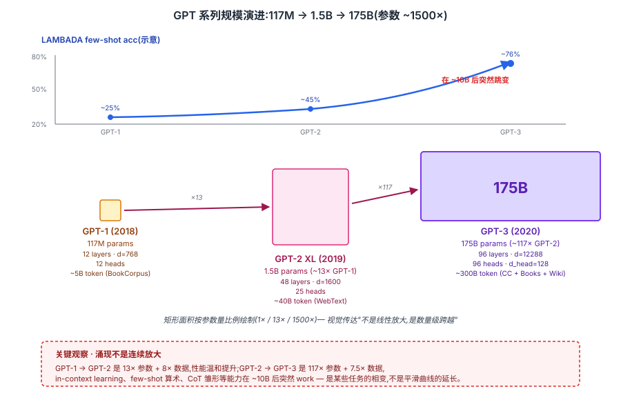
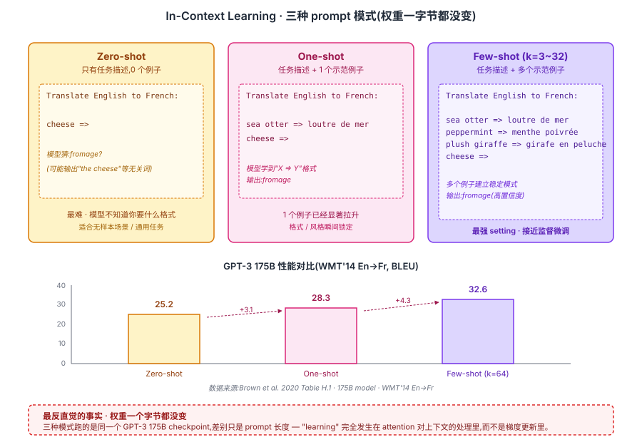

## 前作进展

[GPT-2](02-gpt2.md) 在 2019 年初证明了"规模 + zero-shot"的可行性,但留下了两个明确问题:

**1. 1.5B 仍不够大**——zero-shot 能力在多个标准 benchmark 上(比如 LAMBADA、CBT)能超过之前 SOTA,但在阅读理解、QA、翻译等任务上仍远低于监督学习水平。需要继续 scale 看天花板在哪里
**2. Prompt 不稳定**——zero-shot 触发任务需要精心设计 prompt(`TL;DR:` 触发摘要、`Q:...A:` 触发 QA),不同 prompt 效果差别很大;没有"标准化的任务接口"

同期社区的几个观察也在推动 scaling:

- **2020 年 1 月 Kaplan et al.** *Scaling Laws for Neural Language Models* — 用 GPT 系小模型实验,把 loss 随 N/D/C 的幂律刻画出来。**这篇论文给出了 175B 模型在数学上的可行性预测**——loss 还有很大下降空间,scaling 没到饱和
- **大规模并行训练成熟**——Megatron-LM(2019 NVIDIA)、DeepSpeed(2020 微软)等框架让 100B+ 模型训练在工程上可行;V100/A100 GPU 算力是 GPT-2 时代 P100 的 5-10×
- **微软投资 1B 美元**给 OpenAI(2019 年中)+ 专属超算集群

这些条件凑齐后,GPT-3 团队 2020 年 5 月发表《Language Models are Few-Shot Learners》:**把 GPT-2 架构基本不动,推到 175B 参数 + 300B token,看会涌现什么**。结果是 LLM 时代的开篇——**in-context learning** 这个能力突然出现,让"通用基础模型"从概念变成产品。

## 核心思想

### 直觉:把 GPT-2 的 zero-shot 苗头放大 100 倍 → in-context learning 涌现

要理解 GPT-3 真正需要先抓一件事:**它没有发明任何新机制**。架构是 GPT-2 的同款(decoder-only Transformer + Pre-LN + learned PE),目标函数还是 next-token prediction,数据混合配方只是把 GPT-2 的 WebText 路线扩到 CC + Books + Wiki。**唯一变量是规模——参数 ×117,数据 ×7.5,算力 ×3000**。

那为什么大家把 GPT-3 当成 LLM 时代的开端,而不是把 GPT-2 当成?因为 GPT-2 1.5B 里只是"若隐若现"的 zero-shot 现象——`TL;DR:` 触发摘要、`Q:...A:` 触发 QA,效果不稳定,需要精心 prompt 才能复现。GPT-3 把同样的现象**放大到工业可用**:同一个模型不改权重、只换 prompt,就能在翻译、QA、算术、代码、推理上同时拿到不平凡的分数。

这个"放大后才稳定 work"的能力有个正式名字:**in-context learning(ICL)**——在 prompt 里展示几个 `(输入, 输出)` 例子,然后给一个新输入,模型直接输出新答案,**整个过程模型权重一字节都不动**。learning 完全发生在 attention 对上下文的处理里。这是 GPT-3 论文的核心论点,也是它把 LLM 从研究对象变成产品的根本原因。

GPT-3 真正要回答的问题不是"模型能多强",而是"**GPT-2 显示的那条 scaling 曲线,再往前推两个数量级会发生什么**"。答案是:**某些能力出现了相变**——下面三个机制(规模 / ICL / 工程)缺一不可。


*图 1:GPT-1 → GPT-2 → GPT-3 的规模演进。矩形面积按参数量比例绘制(1× / 13× / 1500×),上方曲线是 LAMBADA few-shot 性能示意——GPT-1/2 阶段温和提升,GPT-3 在 ~10B 后出现明显跳变。底部 callout 强调:涌现不是连续放大,是某些任务的相变。*

### 机制一:175B 参数 — 沿 Kaplan scaling law 直接外推

GPT-3 为什么是 175B,不是 10B 也不是 1T?这不是拍脑袋,而是 Kaplan 等人 2020 年 1 月 *Scaling Laws for Neural Language Models* 给出的定量答案——**LM loss 随参数 / 数据 / 算力按幂律下降,1.5B(GPT-2 XL)远未到饱和点,继续把参数加两个数量级仍有显著收益**(详见 [04-scaling-laws.md](04-scaling-laws.md))。Kaplan 论文里那条 log-log 直线就是 GPT-3 决策的全部底气——OpenAI 敢投 460 万美元训这一规模,基本就是赌"经验拟合的直线还会继续延伸"。后来证明赌赢了,虽然两年后 Chinchilla 论文指出 175B + 300B token 是严重 under-trained(最优搭档应该是 9B + 200B token),但 GPT-3 还是用 absolute scale 把涌现现象推了出来。

参数分配是 Kaplan 配比的工程落地:

| 模型 | 层数 | d_model | h | d_head | batch (token) | 参数量 |
|------|------|------|------|------|------|------|
| GPT-3 Small | 12 | 768 | 12 | 64 | 0.5M | 125M |
| GPT-3 Medium | 24 | 1024 | 16 | 64 | 0.5M | 350M |
| GPT-3 Large | 24 | 1536 | 16 | 96 | 0.5M | 760M |
| GPT-3 XL | 24 | 2048 | 24 | 128 | 1M | 1.3B |
| GPT-3 2.7B | 32 | 2560 | 32 | 80 | 1M | 2.7B |
| GPT-3 6.7B | 32 | 4096 | 32 | 128 | 2M | 6.7B |
| GPT-3 13B | 40 | 5140 | 40 | 128 | 2M | 13B |
| **GPT-3 175B** | **96** | **12288** | **96** | **128** | **3.2M** | **175B** |

175B 的具体配置:**96 层、d_model=12288、96 个 head、d_head=128**。注意 `d_head = 128` 在整个 GPT-3 家族里保持不变(和 GPT-2 也一致)——scale 不靠加大每个头的容量,而靠加更多头 + 更宽 FFN(`d_ff = 4 × d_model = 49152`) + 更深网络。这套"d_head 固定、横纵均匀放大"的配方后来被 LLaMA 系完整继承。

GPT-3 训练数据是 5 个语料的加权混合(总计 300B token):Common Crawl(过滤后)410B token 占 60% 权重,WebText2 19B 占 22%,Books1/Books2 加起来 67B 占 16%,Wikipedia 3B 占 3% 但被采样 3.4 个 epoch——**按质量加权 + 不均匀采样**是 GPT-3 数据工程的核心,后来 LLaMA 等沿用。Common Crawl 过滤用了三层(质量分类器 + 跨文档去重 + benchmark 污染检测),这块工程量远大于论文里几页篇幅显示的。

### 机制二:In-Context Learning — 不更新权重的"伪学习"

光把参数堆到 175B 不会自动产生 in-context learning——它只是必要条件。真正让 GPT-3 区别于 GPT-2 的,是 ICL 这个**接口范式**:不再为每个任务做监督微调,而是把任务的实际定义推到 prompt 里,模型作为"通用执行器"按 pattern matching 输出答案。

GPT-3 论文给出了三种 ICL 模式,按 prompt 里示范例子的数量区分:

- **Zero-shot**:只给任务描述,0 个例子
- **One-shot**:任务描述 + 1 个示范例子
- **Few-shot**:任务描述 + k 个示范例子(典型 k=5~32,最多到 64+)


*图 2:ICL 与传统微调的根本区别——权重不变,所有"learning"发生在 prompt 内的 attention 计算里。*


*图 3:Zero-shot / one-shot / few-shot 三种模式并列对比,下方柱状图展示 GPT-3 175B 在 WMT'14 En→Fr 上的 BLEU 分:25.2 → 28.3 → 32.6,few-shot 比 zero-shot 高 7.4 分。底部 callout 强调最反直觉的事实:三种模式跑的是同一个 checkpoint。*

**为什么 175B 才显著拉开 zero / one / few-shot 差距**——这是论文 Figure 1.2 给出的关键发现:**小模型上 few-shot ≈ zero-shot,ICL 能力为 0;模型规模到某个阈值后,few-shot 开始显著领先,且差距随规模快速扩大**。具体数字:

- < 1.3B 参数:few-shot 比 zero-shot 强 < 2%,ICL 基本没"开启"
- 13B 参数:few-shot 比 zero-shot 强 5–10%
- 175B 参数:few-shot 比 zero-shot 强 20–30%

这就是涌现现象的标志性形态——**某种能力在模型规模到达某个阈值前为 0,过了阈值后突然出现并快速增长**。这条曲线后来被 Wei et al. 2022 的 *Emergent Abilities* 论文系统化为 137 个 emergent tasks 的统一观察,也被 Schaeffer 2023 *Are Emergent Abilities a Mirage?* 部分反驳(详见 [04-scaling-laws.md](04-scaling-laws.md) 的"涌现的争议"小节)。但无论争议如何,**GPT-3 首次展示了"参数 100× 之后,一个新接口范式从无到有出现"**——这是 ICL 的实证起点。

GPT-3 在 SuperGLUE 8 任务平均上的得分:监督 BERT-Large 69.0,GPT-3 Few-shot(k=32)71.8,监督 T5-11B 89.3,人类基准 89.8。Few-shot 没赢监督微调,但已经在合理区间内——证明了 ICL 是**可行的通用接口**。翻译任务上,GPT-3 Few-shot 在法译英 39.2 BLEU、德译英 40.6 BLEU 已经接近监督 SOTA 的 45.6 / 40.2。算术(3 位数加减法 80%+)、常识 QA(TriviaQA 64.3% 是开放问答 SOTA)、长文生成(人工评测和人写文章不可区分)是 ICL 真正震撼的领域。

### 机制三:Sparse Attention + 工程实现 — 让 175B 真的能训

175B 参数 × 2048 上下文 × 96 层在 2020 年是工程极限。光有 scaling law 的纸面外推不够——还得能在 10000 张 V100 上跑通且不崩。GPT-3 的工程实现栈是 LLM 训练基础设施的奠基:

**1. Sparse Transformer 风格的 alternating attention**——某些层用标准 dense attention,某些层用 strided sparse attention(继承 Child et al. 2019 *Generating Long Sequences with Sparse Transformers*)。Dense attention 在 d_model=12288、seq=2048 下,单层 attention 矩阵就有 96 × 2048² × 2 bytes ≈ 800MB 中间结果,光这一项就吃掉大量显存。Sparse 层把 attention pattern 限制到 O(N √N),省下显著的 FLOPs 和显存。这一选择论文里只有一句话,后续复现(GPT-NeoX、OPT、LLaMA)发现稀疏 attention 收益有限且实现复杂,2022 年 FlashAttention 出现后纯 dense + IO-aware 实现成为新标准,sparse attention 路线被淘汰。但**在 2020 年没有 FlashAttention 的条件下,sparse 是 175B 能跑起来的关键之一**。

**2. 3D parallelism — 张量 + Pipeline + 数据并行**——175B 模型单 GPU 完全装不下(光参数 fp16 就 350GB),必须切分:
   - **张量并行**(Megatron-LM 风格):把每个 layer 内的矩阵乘按列/行切到 8 张 GPU
   - **Pipeline 并行**:把 96 层切成若干 stage,每个 stage 跑在不同 GPU 节点
   - **数据并行**:剩下的维度复制模型 + 分 batch

   三者组合后,~10000 张 V100 才能让 175B 同时跑通 forward + backward + 优化器状态。每个细节都是当时的硬件极限。

**3. 训练 token batch + 长 warmup**——batch size 线性 warmup 到 3.2M token / step,learning rate 6e-5 + cosine 衰减到 10%,warmup 375M token。大 batch 在 175B 规模是必需的——小 batch 的 noise 会让训练发散。这套"大模型必须大 batch"经验后来被 Chinchilla 论文反思:Kaplan 实验的 batch 固定方式可能让大模型 underconverge,但 GPT-3 当时只能按这条工程路线走。

训练总算力 3.14 × 10²³ FLOPs(按 6ND 估算),~460 万美元成本(2020 V100 时价)。这是当时单一模型训练的最高纪录。

### 三件套协同:scale + prompt 范式 + 工程基础设施 缺一不可

GPT-3 真正改变行业,**不是 175B 参数本身**,而是三件事同时被装进一个系统——任何一个单拿出来都不足以产生 LLM 时代,这一点和 [ResNet](../01-cnn/05-resnet.md) 的 `shortcut + BN + He 初始化` 协同关系一致:

- **只有 175B scale,没有 ICL 接口范式** —— 模型还是要为每个任务做监督微调(像 BERT/T5 那样),"通用基础模型 + API"的产品形态不会出现。模型再大也只是研究对象
- **只有 ICL 范式,没有 175B scale** —— GPT-2 1.5B 上 ICL 几乎不 work(zero/one/few-shot 差异 < 2%),社区无法相信这条范式可行。GPT-2 时代的"通用 LM"只是学术概念
- **只有 scale + ICL,没有 3D parallelism + sparse attention 工程栈** —— 175B 在 2020 年硬件上根本跑不起来,scaling law 的纸面外推变不成可训练的工程对象。即使有 scaling law 的预测,没有工程实现就只是黑板上的曲线

三件套合起来才让"通用基础模型 + prompt 接口 + 商业 API"这条产品路径第一次跑通。这也是为什么 2018–2019 之间多个团队都摸到 scaling 的一面(BERT-Large 摸到 encoder scale,T5-11B 摸到 seq2seq scale)但没改变行业格局——直到 GPT-3 把三条同时打满。后续 ChatGPT、Claude、Gemini 全部沿用这套"scale + prompt + 工程栈"三件套,只是在每一条上分别迭代(scale 推到 1T+,prompt 接 RLHF,工程栈接 FlashAttention)。

## 训练细节

| 维度 | GPT-3 175B |
|------|------|
| 架构 | 96 层 decoder-only Transformer, d_model=12288, h=96, d_head=128, 175B 参数 |
| 上下文窗口 | 2048 token(GPT-2 是 1024) |
| Norm | Pre-LN |
| Attention | 部分层 dense,部分层 strided sparse(后续工作淘汰这一设计) |
| Tokenization | BPE, 50257 词表(同 GPT-2) |
| 数据 | 5 个语料加权混合,300B token / epoch |
| 优化器 | Adam(β1=0.9, β2=0.95, ε=1e-8),梯度裁剪 1.0 |
| Learning rate | 6e-5(175B), warmup 375M token, cosine 衰减到 10% |
| Batch | 3.2M token / step,线性 warmup 到这个大小 |
| 训练 token | 300B 训练步,每步 3.2M token = ~94000 steps |
| 训练硬件 | 微软 Azure 上的专属集群,~10000 V100 |
| 训练算力 | 3.14 × 10²³ FLOPs(根据 6ND 估算) |
| 训练成本 | ~460 万美元(2020 V100 时价) |

注意:**GPT-3 没用 FlashAttention**(那是 2022 才出现的),它的训练效率主要靠 Megatron 风格的张量并行 + Pipeline parallelism。今天复现 175B 用同等硬件 + FlashAttention 大约能省一半时间。

## 关键代码

GPT-3 架构和 [GPT-2](02-gpt2.md) 几乎一样,所以代码层面没什么新东西。真正"GPT-3 风格"的是 in-context learning 的使用模式:

```python
from openai import OpenAI
client = OpenAI()

# Few-shot 情感分类
prompt = """Classify the sentiment of the following reviews.

Review: This movie was amazing, best film of the year!
Sentiment: positive

Review: I fell asleep halfway through, very boring.
Sentiment: negative

Review: Solid performance from the lead actor but plot was weak.
Sentiment: mixed

Review: A masterpiece, will watch again.
Sentiment:"""

resp = client.completions.create(
    model="davinci-002",   # GPT-3 base 系列的 API 名字
    prompt=prompt,
    max_tokens=5,
    temperature=0,
)
print(resp.choices[0].text.strip())   # 输出: positive
```

注意几个 ICL 的最佳实践:

- **例子的顺序和数量都影响效果**——典型 k=5~32,例子顺序固定(不要 shuffle)
- **任务描述要简短明确**——`Classify the sentiment of the following reviews.` 这一行的措辞会影响后续模型行为
- **答案前缀(`Sentiment:`)必须一致**——模型按 pattern matching 学,前缀变了就找不到生成模式
- **`max_tokens` 配合 stop sequence 防止模型继续生成下一个例子**

这些"prompt 设计"细节后来发展成 prompt engineering 学科,影响了 LangChain、DSPy 等框架的设计。

## 影响 / 后续

GPT-3 是 AI 历史的分水岭——**它把 LLM 从"研究对象"变成了"产品"**。具体几条影响线:

**1. OpenAI API 模式**(2020 6 月发布,beta access)——GPT-3 是第一个以 API 形式商业化的 LLM。这种"通用基础模型 + API 接入"模式被 Anthropic Claude、Google Gemini、Cohere 等全部采用,成为商业 LLM 的事实标准

**2. ChatGPT 的直接前身**——ChatGPT(2022 11 月)是 GPT-3.5(text-davinci-003)+ RLHF 的产物,核心 in-context learning 能力来自 GPT-3。2023 年的 LLM 热潮直接源头是 GPT-3 显示了"通用智能产品化"的可能

**3. Prompt engineering 学科诞生**——围绕"怎么写 prompt 让 LLM 做得更好"形成了完整的研究子方向:CoT(思维链)、self-consistency、ReAct(agent + reasoning)、tool use 全部是 prompt 技术的延伸

**4. Scaling 成为研究主线**——GPT-3 的 175B 成本约 500 万美元,这是 2020 年单一模型训练的最高纪录。它催生了对 [Scaling Laws](04-scaling-laws.md) 的进一步研究(Chinchilla 修正了 Kaplan 的最优 N/D 比例),也直接推动了 Megatron-Turing NLG(530B)、PaLM(540B)、GPT-4 等更大模型

**5. 模型权重不公开成为常态**——GPT-3 没开源(只 API),引发学界激烈讨论。EleutherAI、Meta、BigScience 等组织开始推动开源 LLM:GPT-J(6B)、GPT-NeoX(20B)、BLOOM(176B)、OPT(175B),直到 [LLaMA](05-gpt4-llama.md)(2023)真正给社区一个高质量开源基础模型

GPT-3 留下的明确问题推动了后续节点:

- **In-context learning 不稳定**——同一任务用不同 prompt 效果差很多,且模型容易"幻觉" → 2022 InstructGPT 用 RLHF 对齐到 instruction following,见 [12-rlhf-alignment](../12-rlhf-alignment/)
- **没有定量的 scaling 预测**——175B 是不是最优?给定预算应该多大模型 + 多少数据? → [Scaling Laws](04-scaling-laws.md) 节点,Kaplan + Chinchilla 给出答案
- **训练效率底下**——175B 用 10K V100 训了一两个月,大部分模型甚至训不完 → FlashAttention(2022)、3D parallelism、ZeRO-3 等系统工程优化
- **架构 2018 配方**——learned PE + 部分 sparse attention 都被后续淘汰 → [LLaMA](05-gpt4-llama.md) 时代的 Pre-RMSNorm + RoPE + GQA + SwiGLU 现代化

→ [04-scaling-laws.md](04-scaling-laws.md) · Kaplan 给出 GPT-3 是否最优的定量答案
→ [05-gpt4-llama.md](05-gpt4-llama.md) · GPT-4 / LLaMA 时代,现代 LLM 配方定型
→ [02-gpt2.md](02-gpt2.md) · 父结构,GPT-3 是 GPT-2 范式 + 117× 规模化
→ [../12-rlhf-alignment/](../12-rlhf-alignment/) · InstructGPT / ChatGPT 在 GPT-3 之上加 RLHF
→ [../14-rag-agent/](../14-rag-agent/) · GPT-3 in-context learning 是 RAG / agent / tool use 的基座
→ [../05-transformer/05-flash-attention.md](../05-transformer/05-flash-attention.md) · 2022 之后的训练效率革命,GPT-3 量级的训练成本能压一半
