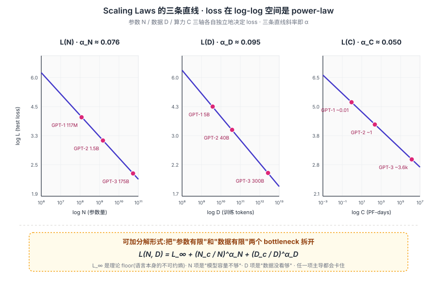
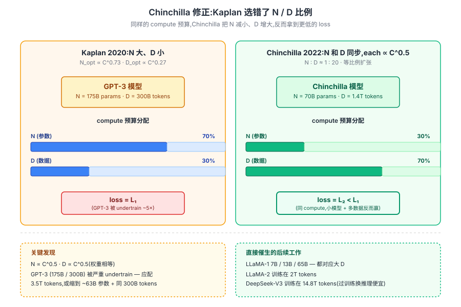

## 前作进展

[GPT-2](02-gpt2.md) 和 [GPT-3](03-gpt3.md) 显示了"加规模带来质变"的经验事实,但社区对几个根本问题没有定量回答:

1. **给定算力预算 C,最优的 N(参数量)和 D(数据量)是什么?**
2. **加规模会不会收益递减?何时饱和?**
3. **小模型实验能不能预测大模型行为?**

这些问题对工业实践极其重要——训练一个 175B 模型成本几百万到上千万美元,选错配比就是几百万美元的损失。研究上,如果能用 1B 模型的训练曲线预测 100B 模型的性能,就能在小成本上做架构对比实验。

Jared Kaplan(后来 Anthropic 联合创始人)2020 年 1 月在 OpenAI 发表 *Scaling Laws for Neural Language Models*,第一次系统地把这些关系刻画成数学:**LM loss 随 N / D / C 三者按幂律下降**。这篇论文直接催生了 GPT-3 的 175B 设计——它给出"175B 仍未饱和"的定量证据,让 OpenAI 敢投 500 万美元训练这一规模。

但 Kaplan 的结论也有问题。2022 年 3 月 DeepMind 的 Jordan Hoffmann 等人发表 *Training Compute-Optimal Large Language Models*(俗称 Chinchilla 论文),用更严谨的实验设计修正了 Kaplan 的关键参数:**计算预算固定时,Kaplan 推荐"N 大 D 小",但实际最优是 N 和 D 等比例扩张(N:D ≈ 1:20)**。这意味着 GPT-3(175B 参数 + 300B token)严重训练不足——它的最优搭档应该是约 9B 参数。

Chinchilla 修正直接催生了 2023 年的 LLaMA / Mistral 等"小模型多数据"路线——LLaMA-1 7B 训练在 1T token 上,数据/参数比 ≈ 143:1,远超 Chinchilla 的 20:1,验证了**继续推数据量比加参数更划算**。这是一个重要的范式转变:**LLM 不再单纯追求参数量**。

## 核心思想

### 直觉:深度学习也有自己的"摩尔定律"

要理解 scaling laws 真正需要先抓一件事:**LLM 的 test loss 并不是参数 / 数据 / 算力的某种复杂非线性函数,而是在 log-log 图上画出来后呈现为一条直线**。这就是幂律(power law)——`L ∝ x^{-α}`,两边取对数后 `log L = -α log x + const`。

这条直线意味着一件反直觉但极其重要的事:**scale 一个数量级(x 增大 10×),loss 下降一个固定 fraction(10^{-α})**。参数翻 10 倍,loss 下降到原来的 0.84(`10^{-0.076} ≈ 0.84`);数据翻 10 倍,loss 下降到 0.80(`10^{-0.095} ≈ 0.80`)。**这是可外推、可预测的**——你拿 1B 模型训练的曲线斜率,就能预测 100B 模型该有的 loss,即使后者还没训过。

为什么 LLM 性能竟然能用一个简单的 power law 预测?**这是经验科学,不是理论推导**。Kaplan 团队并没有先证明"loss 必然是幂律",而是先在大量小模型实验里画了 log-log 图,发现是直线;再用拟合得到的常数(α 和 N_c)成功外推到大模型上。整个 GPT-3 决策(175B 不会饱和)就是建立在"经验拟合出的直线还会继续延伸"的赌注上——结果赌赢了。

这条经验规律的存在本身就是深度学习领域的一个核心 puzzle。理论上还没人能完全解释为什么 loss 必须是幂律(物理学里幂律通常对应"无标度"现象或重整化不动点),但实践上它已经成为千亿美元规模算力投资的决策依据。


*图 1:三轴 scaling law 各画在 log-log 空间——L(N)、L(D)、L(C) 都是直线,斜率即 α。底部 callout 是可加分解形式 `L(N, D) = L_∞ + (N_c/N)^α_N + (D_c/D)^α_D`,把"参数有限"和"数据有限"两个 bottleneck 拆开。*

### 机制一:三轴 power law — L(N) / L(D) / L(C)

Kaplan 论文用一系列 GPT 风格小模型(参数从 700 到 1.5B,数据从 22M 到 23B token)系统训练,得到三条核心幂律:

**1. Loss vs 参数量 N**(数据无限大时):

$$
L(N) = \left(\frac{N_c}{N}\right)^{\alpha_N}, \quad \alpha_N \approx 0.076, \quad N_c \approx 8.8 \times 10^{13}
$$

参数翻倍,loss 大约下降 5%(`2^{-0.076} ≈ 0.95`)。慢但持续。

**2. Loss vs 数据量 D**(参数无限大时):

$$
L(D) = \left(\frac{D_c}{D}\right)^{\alpha_D}, \quad \alpha_D \approx 0.095, \quad D_c \approx 5.4 \times 10^{13}
$$

数据翻倍 loss 大约下降 6%。

**3. Loss vs 算力 C**(N 和 D 都最优分配时):

$$
L(C) = \left(\frac{C_c}{C}\right)^{\alpha_C}, \quad \alpha_C \approx 0.05
$$

算力翻倍 loss 大约下降 3.5%。

**Kaplan 的最优配比建议**——给定算力 C,**模型大小应该按 `C^{0.73}` 扩张,数据按 `C^{0.27}` 扩张**:

$$
N_{\text{opt}}(C) \propto C^{0.73}, \quad D_{\text{opt}}(C) \propto C^{0.27}
$$

也就是说,算力翻倍时,模型大小翻 1.66×,数据只翻 1.21×。这一结论意味着**应该把大部分预算用来加参数**——这直接指导了 GPT-3 的设计(175B 模型 + 相对少的 300B token)。

**对涌现现象的解释**——Kaplan 论文里还有一个重要发现:**loss 是平滑可预测的,但下游任务性能可能在某个 loss 阈值后跳变**。这就是涌现现象的数学解释——loss 在持续下降,但某些任务(算术、推理)需要 loss 跌到某个临界值才"开启"。这一观察后来被 Wei et al. 2022 的 *Emergent Abilities* 论文系统化,但 Kaplan 2020 已经有了萌芽。

### 机制二:Chinchilla 修正 — 参数 / 数据应等比例扩张

Chinchilla 论文(DeepMind, 2022 March)用更严谨的实验设计——**为每个算力预算 C 训练一组不同 (N, D) 配比的模型,看哪个 (N, D) 在该 C 下 loss 最低**——得到了和 Kaplan 截然不同的结论:

$$
N_{\text{opt}}(C) \propto C^{0.50}, \quad D_{\text{opt}}(C) \propto C^{0.50}
$$

**参数和数据应该按 1:1 等比例扩张**,而不是 Kaplan 的"参数 2.7× 而数据 1.4×"。具体地:

$$
\boxed{N : D \approx 1 : 20}
$$

也就是说,1B 参数最优搭配 20B 训练 token。

**对照 GPT-3**:175B 参数应该搭配 3.5T token,而 GPT-3 只训练了 300B token——**严重训练不足,大概 1/10**。如果让 GPT-3 训练在 3.5T token 上,要么 loss 显著更低,要么应该用更小模型(~63B)+ 同样 300B token 拿到更好性能。

Chinchilla 自己验证这一结论的方式是训了一个新模型 **Chinchilla-70B**——比 Gopher(280B)小 4 倍,但训练在 1.4T token(比 Gopher 多 4 倍)。结果:**Chinchilla 在几乎所有 benchmark 上击败 Gopher、GPT-3、Megatron-Turing NLG(530B)**,验证了"小模型多数据"是更优配比。

**为什么 Kaplan 错了?** Chinchilla 论文分析了三个原因:

1. **Kaplan 的实验只在单一固定 batch size 下做**,大模型在大 batch 上 underconverge,看起来"加参数更划算"
2. **Kaplan 把 learning rate schedule 简化处理**,大模型在短训练里没充分收敛
3. **Kaplan 用的 N 范围相对窄**(< 1.5B),外推到 100B+ 时累计误差大

这是科学方法论的好例子——Kaplan 论文的方法在小尺度上 work,但外推到大尺度时关键假设崩坏。Chinchilla 用了几个月专门设计实验、训练数十个模型才把这件事说清楚。


*图 2:三种策略在 N–D 平面的等算力线对比。**Kaplan 2020**——`N ∝ C^{0.73}`,沿"加参数"方向倾斜;**Chinchilla 2022**——`N ∝ D` 等比例对角线,1:20 是甜蜜点;**LLaMA 路线**——故意远离对角线、走"过训练小模型"方向,以训练效率换推理效率。GPT-3、Chinchilla-70B、LLaMA-3-8B 三个点在图上的位置一目了然地展示了三代认识的演进。*

### 机制三:从 scaling law 到训练 / 部署预算

理解了三轴幂律和 Chinchilla 修正后,scaling law 的真正价值在于**把"训练投资决策"变成可计算的工程问题**。三个直接推论:

**推论 1——Chinchilla 公式**:

给定算力预算 `C` FLOPs:
$$
N_{\text{opt}} \approx \sqrt{\frac{C}{6 \times 20}} \text{ params}, \quad D_{\text{opt}} \approx 20 \times N_{\text{opt}} \text{ tokens}
$$

(C ≈ 6ND 是训练 FLOPs 的标准估计,假设 forward + backward = 3 × 2 = 6 ops/parameter/token)

按这个公式:1B 参数 = 20B token = 1.2 × 10²⁰ FLOPs;100B 参数 = 2T token = 1.2 × 10²⁴ FLOPs;1T 参数 = 20T token = 1.2 × 10²⁸ FLOPs(超出地球目前所有训练算力)。

**推论 2——推理成本驱动小模型**:

工业实践里,**推理成本远大于训练成本**(一次性训练 vs 持续推理几百万次)。Chinchilla 公式给出的是"训练算力最优",但如果你模型要部署服务几亿用户,**小模型更划算——即使训练算力浪费一些**。

这一观察催生了 LLaMA 路线:**故意"过训练"小模型**,接受训练效率的浪费,换取推理时的高效。LLaMA-1 7B 在 1T token 上训练(数据/参数比 143:1,远超 Chinchilla 20:1),loss 比 Chinchilla 70B 略高但模型小 10 倍,推理时省 10× 算力。LLaMA-2 7B 推到 2T token(286:1 比例),LLaMA-3 8B 推到 15T token(1875:1 比例)——**Chinchilla 公式描述的是单次训练的最优,LLaMA 路线描述的是部署阶段的最优**。

**推论 3——算力预算决定模型规模**:

可以反过来用 scaling law 估计需要多少算力。比如要让 LM 达到 GPT-4 的水平(估计 1.8T 参数 / 13T token / 2 × 10²⁵ FLOPs):

- 用 H100(2 PFLOPs/s for fp16):需要 1.16 × 10⁹ 秒 = 36 年单 GPU 时间
- 1 万张 H100 并行(典型大模型训练集群):3.3 天满负荷
- 实际效率 50%(并行 + 数据传输 overhead):6-7 天

这种估算精度对训练规划至关重要——它告诉你"想达到 X 水平,需要多少 GPU、多长时间、多少电费"。今天所有大模型团队的预算决策都基于类似计算。

### 三件套协同:经验幂律 + 等比例配比 + 推理成本视角缺一不可

Scaling Laws 真正改变行业,**不是单条幂律的发现**,而是三件事同时被纳入一个统一的决策框架——任何一个单拿出来都不足以驱动今天的 LLM 工业,这一点和 [ResNet](../01-cnn/05-resnet.md) 的 `shortcut + BN + He 初始化` 协同关系一致:

- **只有 Kaplan 经验幂律,没有 Chinchilla 等比例修正** —— GPT-3 的 175B 路线会被无脑外推,模型越做越大但训练严重不足,真实 loss 永远拿不到外推预测的水平
- **只有 Chinchilla 1:20,没有推理成本视角** —— LLaMA 路线不会出现,所有人会按"训练算力最优"造 100B+ 模型,部署成本爆炸、开源生态起不来
- **只有推理成本视角,没有底层幂律的可外推性** —— 不知道"小模型继续 over-train 还能涨多少",无法做长期预算,等于盲赌

三件套合起来才让"模型该多大、训多久、谁能部署得起"这三个本来割裂的问题被装进一个公式。这也是为什么 2020–2022 之间多个团队都摸到 scaling 的一个面但没改变行业格局——直到 Chinchilla 把第二条补全、LLaMA 把第三条补全。

## 涌现的争议

涌现现象(emergent abilities)在 2022–2023 引起了一场学界争议:

**支持涌现派**(Wei et al. 2022, BIG-Bench 团队)——展示几十个任务在某个 loss 阈值前性能为 0,过阈值后迅速到 50%+。证据:few-shot 算术、CoT 推理、跨语言转移等

**质疑涌现派**(Schaeffer 2023 *Are Emergent Abilities a Mirage?*)——指出涌现现象高度依赖**评测指标的离散性**:
- 用 0/1 accuracy 评测时性能"突然跳变"
- 用连续指标(log-likelihood,token-level accuracy)评测时性能是**平滑增长**
- 涌现可能只是评测方法的伪影

这场争议没有 100% 结论,但社会共识是:**某些能力确实需要规模阈值才能稳定 work**,但具体阈值和"突然性"程度被评测方法夸大了。这对实践的意义是:**用连续指标做小模型实验仍能预测大模型趋势**,不必担心"小模型完全看不出来"。

## 关键代码

Chinchilla 公式作为一个简单计算器,辅助决定训练配置:

```python
def chinchilla_optimal(compute_flops):
    """给定算力预算,返回 Chinchilla 最优 (N, D)"""
    # C ≈ 6 N D 且 D = 20 N → N = sqrt(C / 120)
    N = (compute_flops / 120) ** 0.5
    D = 20 * N
    return N, D

# 例子:1e24 FLOPs (LLaMA-1 65B 量级)
N, D = chinchilla_optimal(1e24)
print(f"最优参数: {N/1e9:.1f}B, 最优 token: {D/1e9:.0f}B")
# 输出: 最优参数: 91.3B, 最优 token: 1825B

# 反向:给定模型大小,需要多少 token / 算力才"足够训练"?
def chinchilla_needed(N):
    D_needed = 20 * N
    C_needed = 6 * N * D_needed
    return D_needed, C_needed

# 例子: 7B 模型
D, C = chinchilla_needed(7e9)
print(f"7B 模型最优: {D/1e9:.0f}B token, {C:.2e} FLOPs")
# 输出: 7B 模型最优: 140B token, 5.88e+21 FLOPs

# LLaMA-3 8B 实际训练了 15T token,数据 / 参数比 ≈ 1875:1
# 远超 Chinchilla 20:1 — 这是"推理优先"的过训练
```

这个简单计算器在 2022 之后成为大模型团队的常用工具——它把"训练投资是否值得"这件事变成了几行代码就能算的问题。

## 影响 / 后续

Scaling Laws 作为方法论节点的影响:

**1. Chinchilla 配比成为新基准**——2022 之后所有 LLM 报告都会和 Chinchilla 配比对比:你模型相对 Chinchilla optimal 是 over-trained 还是 under-trained?

**2. LLaMA 路线的兴起**——"故意 over-train 小模型"成为开源 LLM 主流策略,因为部署成本主导。LLaMA-1 / 2 / 3 / Mistral / Qwen 全部走这条路

**3. Inverse scaling 的发现**——某些任务在大模型上反而变差(McKenzie 2023 *Inverse Scaling Prize*),说明 scaling law 在某些任务上有反例。这一观察推动了对齐研究——大模型可能更擅长某些"危险"行为(欺骗、越狱、目标错位)

**4. Compute-optimal 不等于 quality-optimal**——后续工作(MosaicML 2023, Phi-3)发现**高质量小数据集 + 长训练**能超过大量低质量数据。Chinchilla 把数据当同质量处理,实际数据质量是隐变量。今天 LLM 训练里"数据质量 + 多样性 + 课程"成为和 N/D 比例同等重要的研究方向

**5. Scaling 对预算决策的指导**——所有大模型公司现在都基于 scaling law 做长期算力规划。OpenAI / Anthropic / Google 的"5 年算力路线图"本质都是 scaling law 的外推

Scaling laws 留下的开放问题:

- **新模态(图像、视频)的 scaling law 是什么?** Multimodal scaling 是 2024 的活跃研究方向
- **RLHF / 推理阶段计算 (test-time compute) 的 scaling 怎么算?** o1 模型 ([15-reasoning-o1-r1](../15-reasoning-o1-r1/)) 把算力从训练阶段挪到推理阶段,scaling law 需要重写
- **后训练(post-training)的 scaling**——SFT / RLHF / DPO 阶段的数据 / 算力规律和预训练完全不同

→ [05-gpt4-llama.md](05-gpt4-llama.md) · LLaMA 路线就是 Chinchilla 修正 + "推理优先过训练"的产物
→ [03-gpt3.md](03-gpt3.md) · GPT-3 175B 设计基于 Kaplan,后被 Chinchilla 证明严重训练不足
→ [02-gpt2.md](02-gpt2.md) · GPT-2 的 zero-shot 涌现观察催生了 scaling law 研究
→ [../15-reasoning-o1-r1/](../15-reasoning-o1-r1/) · o1 的 test-time scaling 把算力轴扩展到推理阶段
→ [../13-moe-efficient/](../13-moe-efficient/) · MoE 是 scaling 的另一种形式 — 参数多但激活少
