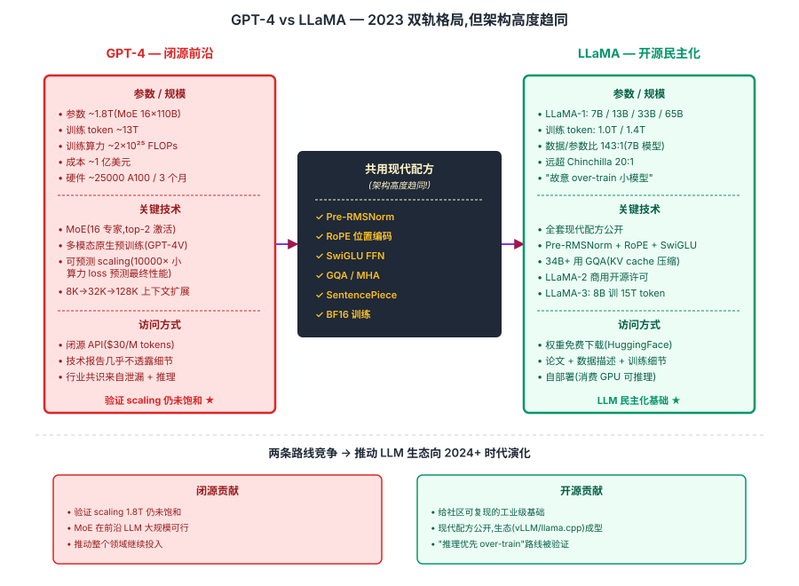
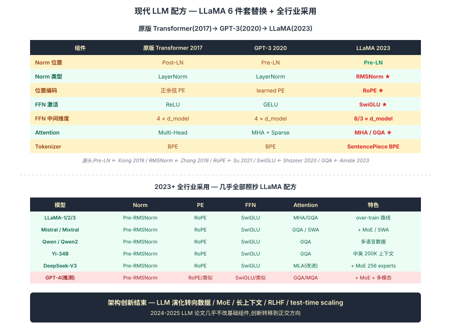

## 前作进展

到 2022 年底,LLM 领域的局面是:**[GPT-3](03-gpt3.md)(175B)+ [ChatGPT](../12-rlhf-alignment/)(2022 11 月)展示了通用 AI 助手的可能,但所有最强模型都是闭源的**。开源侧只有 GPT-J(6B)、GPT-NeoX(20B)、BLOOM(176B)、OPT(175B),这些模型质量普遍不如 GPT-3,而且数据集不公开、架构是 GPT-3 时代的"老配方"(learned PE / Post-LN / ReLU)。

社区急需两件事:

1. **更强的闭源模型**——证明 scaling 还没到天花板,推动整个领域继续投入
2. **可用的开源基础模型**——让学界和工业能在上面做对齐、微调、领域适配研究,不用从零训练

2023 年这两件事几乎同时发生:

- **2023 年 3 月,OpenAI 发布 GPT-4**——多模态、上下文窗口 8K/32K(后续 128K),在专业 benchmark(法律、医学、考试)上达到人类专家水平。技术报告里**几乎不透露任何架构和训练细节**——只说"performance"
- **2023 年 2 月,Meta 发布 LLaMA-1**(7B/13B/33B/65B)——架构和训练细节全部公开,7B 在多个 benchmark 上超过 GPT-3 175B,且权重以"研究用"形式开源
- **2023 年 7 月,Meta 发布 LLaMA-2**(7B/13B/70B)——商用开源许可证,质量进一步提升;开源 LLM 时代正式开启

GPT-4 和 LLaMA 代表了 LLM 的两条平行路线——**闭源前沿** vs **开源民主化**——但它们在架构选择上**高度趋同**:Pre-RMSNorm、RoPE、SwiGLU、GQA 这套现代配方两边都用。这一节把这两个 2023 年的标志事件放在一起,把"现代 LLM 长什么样"讲清楚。

## 核心思想

### 直觉:闭源前沿 + 开源民主化双轨,架构却高度趋同

理解 2023 LLM 转折点真正需要先抓一件事:**GPT-4 闭源把 LLM 推到万亿参数 + 多模态,LLaMA 开源给社区第一个工业级基础模型 — 两条平行路线**。但反直觉的是,两者在架构选择上**高度趋同** — Pre-RMSNorm + RoPE + GQA + SwiGLU 这套现代配方两边都用。这说明:**LLM 架构在 2023 年趋向收敛**,差异主要在数据 / 算力 / 后训练,而非基础结构。

三件事必须同时成立才让 2023 成为 LLM 的范式定型年:

- **GPT-4 验证 scaling 还没饱和** — 1.8T MoE / 13T token / 1 亿美元训练,在专业 benchmark 上达人类专家水平;**用 10000× 小算力 loss 准确预测 GPT-4 性能**,scaling law 在万亿参数级仍精确成立
- **LLaMA 给社区可复现的工业级基础模型** — 7B / 13B / 33B / 65B 四档,数据/参数/训练全部公开;**LLaMA 7B 在 1T token 上 over-train(143:1 vs Chinchilla 20:1)** 实证"推理优先小模型"路线
- **现代配方在 GPT-4 / LLaMA 上同时定型** — Pre-RMSNorm(替 LayerNorm)+ RoPE(替 learned PE)+ SwiGLU(替 ReLU/GELU FFN)+ GQA(替 MHA)+ SentencePiece(替 BPE);后续所有开源 LLM(Mistral / Qwen / Yi / DeepSeek)几乎照抄

三件事合起来:**2023 是 LLM 历史的"配方定型年"**。前沿 GPT-4 验证 scaling 仍可走,但训练成本上亿美元的天花板已显现;开源 LLaMA 把可用的 LLM 推到每个研究者手里,**差距从 GPT-3 时代的 18 个月缩短到 6 个月**。这套现代配方在 2024 → 2025 几乎没改动,LLM 架构创新主要转向 MoE、长上下文、test-time scaling 等正交方向。


*图 1:**左 GPT-4 闭源前沿** — 1.8T MoE / 13T token / 1 亿美元 / 25000 A100 / 128K 上下文 / 多模态原生;闭源 API。**右 LLaMA 开源民主** — 7B-65B / 1T-1.4T token / 公开权重 + 论文 + 数据描述;over-train 路线(143:1 数据参数比);自部署。**中央** 两者共用现代配方:Pre-RMSNorm + RoPE + GQA + SwiGLU + SentencePiece。底部 callout:两条路线竞争 → 推动整个 LLM 生态向 2024+ 时代演化。*

### 机制一:GPT-4 — 闭源前沿的形态(MoE + 多模态 + 可预测 scaling)

GPT-4 的技术细节几乎完全不公开,但通过观察、推理、社区泄漏,行业共识是:

| 维度 | GPT-4(估计) |
|------|------|
| 参数量 | ~1.8T(MoE 16 个专家,每次激活 ~280B) |
| 训练 token | ~13T |
| 上下文窗口 | 8K → 32K → 128K(逐步增加) |
| 训练算力 | ~2 × 10²⁵ FLOPs |
| 训练成本 | ~1 亿美元 |
| 训练硬件 | ~25000 A100 |
| 训练时长 | ~3 个月 |

**几个 GPT-4 特有的技术**:

**1. Mixture of Experts(MoE)**——根据 SemiAnalysis 和其他泄漏来源,GPT-4 是 **16 个专家 × 110B/expert** 的 MoE 架构。每次推理只激活 2 个专家(总 220B),让模型总参数到 1.76T 但每 token 计算量只相当于稠密 280B。这是 MoE 在前沿 LLM 上的第一次大规模应用(详见 [../13-moe-efficient/](../13-moe-efficient/))

**2. 多模态从一开始就训练**(不是事后接 vision encoder)——GPT-4V 据说是 vision encoder + LLM 端到端预训练,而不是 CLIP-style 独立预训练后桥接。这给视觉理解带来质变(图像里的细节、文字、复杂场景理解都远超 LLaVA-1 这类桥接模型)

**3. 可预测 scaling**——GPT-4 技术报告里展示了一张关键图:**用 10000× 小算力的预训练 loss 就能预测 GPT-4 的最终性能,误差 < 5%**。这说明 [Scaling Laws](04-scaling-laws.md) 在 GPT-4 这一规模上仍精确成立。这是大模型时代"押宝"的科学化标志——你不再是"训了才知道效果",而是"训之前就能预测"

**4. 8K → 32K → 128K 上下文扩展**——GPT-4 发布时是 8K,4 个月后扩到 32K,2023 年底扩到 128K。这是通过 [RoPE](../05-transformer/04-rope.md) 的 position interpolation / YaRN 类技术 + 持续 fine-tune 实现的。是 RoPE 数学结构允许的"长上下文外推 + 少量微调"的实际案例

### 机制二:LLaMA — 开源现代 LLM 的样板(可复现 + over-train 小模型)

LLaMA-1 论文(2023 2 月)的核心贡献是**给社区一个可复现、高质量、架构现代化的基础模型**。所有训练细节、架构选择、数据组成全部公开(数据集本身没开源但描述足够详细)。LLaMA-1 给出 4 个规模:

| 模型 | 层数 | d_model | num_heads | 训练 token | 性能特点 |
|------|------|------|------|------|------|
| LLaMA-1 7B | 32 | 4096 | 32 | 1.0T | 推理友好,大多数 benchmark 上和 GPT-3 175B 相当 |
| LLaMA-1 13B | 40 | 5120 | 40 | 1.0T | 多个 benchmark 上击败 GPT-3 175B |
| LLaMA-1 33B | 60 | 6656 | 52 | 1.4T | 单卡可推理(A100 80GB) |
| LLaMA-1 65B | 80 | 8192 | 64 | 1.4T | 旗舰,接近 Chinchilla 70B / PaLM 540B |

**关键观察:LLaMA-1 7B 在 1T token 上训练,数据/参数比 = 143:1,远超 Chinchilla 的 20:1**。这就是"故意 over-train 小模型"的实证——LLaMA-1 7B 的 loss 比 Chinchilla optimal 略高,但模型小 10 倍,推理时省 10× 算力,部署成本完全胜出。LLaMA-2 7B 推到 2T token(286:1),LLaMA-3 8B 推到 15T token(1875:1),数据/参数比持续推高。

### 机制三:现代 LLM 配方 — LLaMA 的 6 件套替换

LLaMA-1 的架构是**当时所有"现代 LLM 改进"的集大成**:

| 组件 | 原版 Transformer(2017) | GPT-3(2020) | LLaMA-1(2023) |
|------|------|------|------|
| Normalization 位置 | Post-LN | Pre-LN | Pre-LN |
| Normalization 类型 | LayerNorm | LayerNorm | **RMSNorm** |
| 位置编码 | 正余弦 PE | learned PE | **RoPE** |
| FFN 激活 | ReLU | GELU | **SwiGLU** |
| FFN 中间维度 | 4 × d_model | 4 × d_model | **8/3 × d_model**(配 SwiGLU 多一个矩阵) |
| Attention 类型 | Multi-Head | Multi-Head + Sparse | Multi-Head(7B/13B) / **GQA**(34B+) |
| Tokenizer | BPE | BPE | **SentencePiece BPE** |

把这套现代配方的源头标出来:

- **Pre-LN** ← Xiong 2019 / GPT-2(深层训练稳定)
- **RMSNorm** ← Zhang & Sennrich 2019(去掉 LayerNorm 的减均值,参数少一半,见 [RoPE 节点 callout](../05-transformer/04-rope.md))
- **RoPE** ← Su 2021,见 [../05-transformer/04-rope.md](../05-transformer/04-rope.md)(长上下文外推可行)
- **SwiGLU** ← Shazeer 2020(FFN 加门控,scaling 上略优)
- **GQA** ← Ainslie 2023,见 [../05-transformer/05-flash-attention.md](../05-transformer/05-flash-attention.md) callout(KV cache 压缩 8× 用于长上下文推理)
- **SentencePiece** ← Kudo 2018(中文 / 多语言更友好)

这套配方在 LLaMA-2 / 3 / Mistral / Qwen / Yi / DeepSeek 上**几乎完全一致**,只有数据组成 / 训练策略 / 后训练有差异。从架构看,2023 之后的开源 LLM 都长得很像 LLaMA。

### 三件套协同:GPT-4 + LLaMA + 现代配方 缺一不可

2023 年成为 LLM 的"配方定型年",**不是单一改进**,而是三件套同时调到协同点 —— 任何一个抽掉 2023 LLM 转折点都不成立,这一点和 [ResNet](../01-cnn/05-resnet.md) 的 `shortcut + BN + He 初始化` 协同关系一致:

- **只有 GPT-4 闭源前沿,没有 LLaMA 开源** — 整个生态停留在 OpenAI / Google 几家闭源公司,**没有 fine-tune / 对齐 / 领域适配 / 学术研究的开放底座**;LLM 民主化推后 2-3 年,fast.ai / HuggingFace / vLLM 等开源生态无法成型
- **只有 LLaMA 开源,没有 GPT-4 验证 scaling 仍可走** — 社区不知道继续投资 LLM 是否值得,**前沿停止推进 LLM 走向闭门造车**;chain of thought / reasoning / MoE 等下一代方向缺少前沿模型验证可行性
- **只有两条路线,没有现代配方定型(还用 GPT-3 旧架构)** — 每家模型架构各异,生态难以兼容(tokenizer / weights / inference engines);现在 LLaMA 风格的 Pre-RMSNorm + RoPE + GQA + SwiGLU 让 vLLM / llama.cpp / Transformers 等推理框架可以一套代码跑所有开源 LLM

三件套合起来才让 2023 成为 LLM 的范式定型年。**前沿 + 开源 + 配方收敛**三者形成正反馈循环:GPT-4 验证 scaling 可走 → 开源跟进 → 现代配方在双方收敛 → 工具生态成型 → 加速下一代 LLM 演化(MoE / 长上下文 / RLHF / o1 reasoning)。这也是为什么 2024-2025 LLM 进展速度比 2020-2022 快得多 —— **基础设施和共识在 2023 年就位**。


*图 2:**上半** 原版 Transformer(2017)→ GPT-3(2020)→ LLaMA(2023)6 个组件演化对比 — Post-LN → Pre-LN → Pre-LN / LayerNorm → LayerNorm → RMSNorm / 正余弦 PE → learned PE → RoPE / ReLU → GELU → SwiGLU / MHA → MHA+Sparse → MHA+GQA / BPE → BPE → SentencePiece。每个替换标注来源论文。**下半** 2023+ 全行业采用对比 — LLaMA / LLaMA-2/3 / Mistral / Mixtral / Qwen / Yi / DeepSeek-V3 几乎全部采用同一配方,差异只在数据 / 训练策略 / 后训练。底部 callout:架构创新结束,**LLM 演化转向 MoE / 长上下文 / RLHF / test-time scaling 等正交方向**。*

## 关键代码

LLaMA 的核心 block(基于 Meta 开源代码简化):

```python
import torch
import torch.nn as nn

class RMSNorm(nn.Module):
    def __init__(self, dim, eps=1e-6):
        super().__init__()
        self.eps = eps
        self.weight = nn.Parameter(torch.ones(dim))

    def forward(self, x):
        # 只除 RMS,不减均值
        norm = x * torch.rsqrt(x.pow(2).mean(-1, keepdim=True) + self.eps)
        return self.weight * norm

class SwiGLU(nn.Module):
    """FFN(x) = (SiLU(x W_gate) ⊙ x W_up) W_down"""
    def __init__(self, dim, hidden_dim):
        super().__init__()
        # 三个矩阵而不是两个;hidden_dim 通常是 8/3 × dim 保持参数量
        self.w_gate = nn.Linear(dim, hidden_dim, bias=False)
        self.w_up = nn.Linear(dim, hidden_dim, bias=False)
        self.w_down = nn.Linear(hidden_dim, dim, bias=False)

    def forward(self, x):
        return self.w_down(torch.nn.functional.silu(self.w_gate(x)) * self.w_up(x))

class LlamaBlock(nn.Module):
    def __init__(self, dim, num_heads, num_kv_heads, hidden_dim):
        super().__init__()
        self.norm1 = RMSNorm(dim)
        self.attn = GroupedQueryAttentionWithRoPE(dim, num_heads, num_kv_heads)
        self.norm2 = RMSNorm(dim)
        self.ffn = SwiGLU(dim, hidden_dim)

    def forward(self, x, freqs_cos, freqs_sin):
        # Pre-RMSNorm + Attention with RoPE
        h = x + self.attn(self.norm1(x), freqs_cos, freqs_sin)
        # Pre-RMSNorm + SwiGLU FFN
        h = h + self.ffn(self.norm2(h))
        return h
```

对比 [GPT-1 Block](01-gpt1.md) / [GPT-2 Block](02-gpt2.md) / 原版 Transformer Block——差异就是上面表格里那 6 个组件替换。每个替换单独看是小改动,但合起来让 LLaMA-2 7B 在性能、训练稳定、推理效率上都显著超过同规模 GPT-3。

## 影响 / 后续

GPT-4 + LLaMA 在 2023 年定义了 LLM 的现代形态。具体影响:

**1. 闭源前沿 + 开源民主化的双轨格局**——前沿模型(GPT-4, Claude 3, Gemini 1.5)闭源、API 服务;开源模型(LLaMA, Mistral, Qwen, DeepSeek)免费下载、自部署。两条线互相参考、互相推动,2024 年开源模型质量越来越接近前沿,差距从 GPT-3 时代的 18 个月缩短到 6 个月

**2. 现代 LLM 配方的固化**——Pre-RMSNorm + RoPE + GQA + SwiGLU 成为新模型的"默认选项"。新的 LLM 论文很少再改这些基础组件,创新主要在数据、训练策略、后训练对齐

**3. MoE 重新成为前沿方向**——GPT-4 的 MoE 架构 + Mixtral 8x7B(2023 12 月开源)+ DBRX(2024)+ DeepSeek-V3(2024)证明 MoE 是继续 scale 的可行路径。详见 [../13-moe-efficient/](../13-moe-efficient/)

**4. 多模态从插件变成原生**——GPT-4V 之前的多模态 LLM 都是 "vision encoder + LLM 桥接"(LLaVA, MiniGPT-4),效果有限。GPT-4 / GPT-4o / Gemini 把多模态训练放进预训练阶段,质变。详见 [../09-multimodal-clip/](../09-multimodal-clip/) + 后续节点

**5. 长上下文的工程化**——GPT-4 128K / Claude 200K / Gemini 1.5 1M / Llama-3.1 128K 全部基于 RoPE position interpolation 类技术,详见 [../05-transformer/04-rope.md](../05-transformer/04-rope.md)

**6. 训练成本的天花板**——GPT-4 ~1 亿美元、Gemini Ultra 估计 2-3 亿美元、Llama-3-405B 据估算 $50M+ 训练算力。**只有顶级公司能玩前沿 LLM**——这是 AI 中心化的一个核心问题。开源社区通过持续推动 7B–70B 规模的 LLaMA 路线提供反制

**未来方向**——LLaMA 之后的 LLM 演化已经从"加规模"转向几条新轴:

- **后训练规模化**:[RLHF/DPO](../12-rlhf-alignment/) 数据量从 GPT-3.5 的几万条推到 GPT-4 的几百万条
- **测试时推理算力**:[o1 / R1](../15-reasoning-o1-r1/) 把更多算力放在推理阶段做 chain-of-thought 思考
- **数据质量极致化**:Phi-3(微软)、Mistral 等用"小数据但极高质量"路线达到大模型水平
- **MoE + 长上下文**:DeepSeek-V3(671B MoE 激活 37B + 128K context)是 2024 年开源模型的新标杆

→ [04-scaling-laws.md](04-scaling-laws.md) · GPT-4 验证了 scaling law 在万亿参数级仍成立;LLaMA 是 Chinchilla "推理优先"的延伸
→ [03-gpt3.md](03-gpt3.md) · 父结构,GPT-4 是 GPT-3 + 1500× 算力 + MoE + 多模态
→ [../05-transformer/04-rope.md](../05-transformer/04-rope.md) · 现代配方的核心组件
→ [../05-transformer/05-flash-attention.md](../05-transformer/05-flash-attention.md) · GPT-4 / LLaMA 训练和推理的系统底座 + GQA callout
→ [../12-rlhf-alignment/](../12-rlhf-alignment/) · LLaMA-2 / GPT-4 后训练阶段
→ [../13-moe-efficient/](../13-moe-efficient/) · GPT-4 / Mixtral / DeepSeek 的 MoE 路线
→ [../15-reasoning-o1-r1/](../15-reasoning-o1-r1/) · LLM 的下一个能力扩展轴 — 测试时推理
