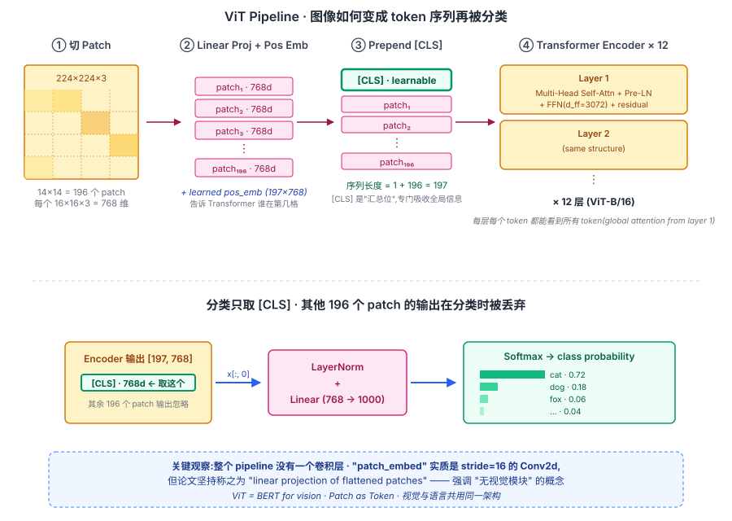
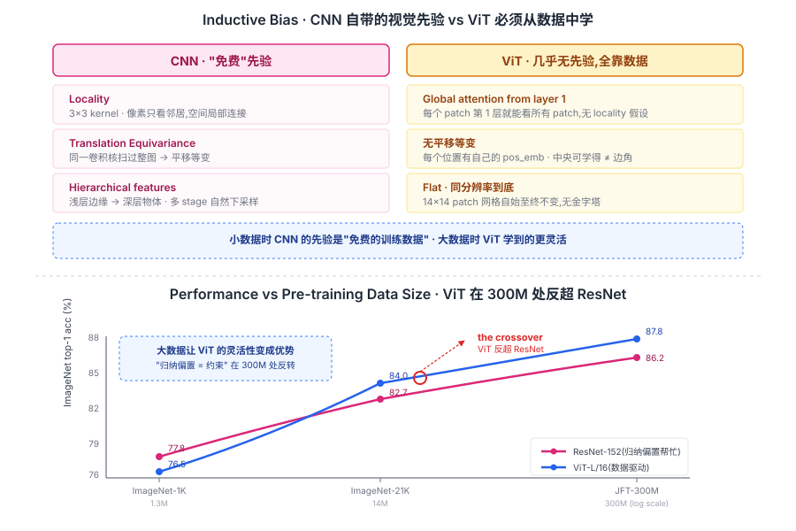

## 前作进展

到 2020 年中,CNN 在视觉领域已经主导了 8 年([AlexNet](../01-cnn/02-alexnet.md) 2012 之后),ResNet / EfficientNet 是 ImageNet 上的事实 SOTA。NLP 那边 [Transformer](../05-transformer/01-transformer.md) 一统天下,但视觉社区对"能不能用 Transformer 替代 CNN"持有几乎共识性的否定:

**为什么社区相信 CNN 不可替代?**

**1. attention 的 O(N²) 复杂度**——对一张 `224 × 224` 图像直接做 pixel-level attention 是 `(224 × 224)² = 2.5 × 10⁹` 次内积,不可行。CNN 的局部连接是绕开这个问题的天然解法

**2. CNN 的归纳偏置被认为"必需"**——卷积内置了三件事:**局部连接**(像素邻居更相关)、**参数共享**(同一滤波器在空间上扫)、**translation equivariance**(平移不变性)。社区相信这些先验对视觉是结构性必需,Transformer 没有就学不到

**3. 之前的混合架构尝试效果一般**——2018-2019 年的 ViT 前作(Bello *Attention Augmented Convolutions*, Ramachandran *Stand-Alone Self-Attention*)都是"CNN backbone + 部分 attention 替换 conv",效果有改进但不显著,且没有展示出"纯 Transformer > CNN"的论据

Google Brain 团队 2020 年 10 月发表 *An Image is Worth 16x16 Words: Transformers for Image Recognition at Scale*(ViT)做了完全相反的尝试:**完全不用卷积,把图像切成 patch 直接喂给 Transformer encoder**。结果令人惊讶——**在 JFT-300M(Google 内部 3 亿图像数据集)上预训练后,ViT 在 ImageNet 上击败了同等规模的 ResNet,且训练算力少 4×**。

这一结果直接打破了"CNN 不可替代"的共识。它的关键启示:**视觉归纳偏置不是必需的,只要数据足够多,Transformer 能从零学到**。这一观点在 2021 年的 CLIP / DALL-E、2022 年的 Stable Diffusion、2023 年的 DiT 上反复被验证,**Transformer 在 2022 之后几乎全面替代 CNN 成为视觉默认骨干**——只有需要极低算力的边缘场景(移动端)还在用 CNN。

## 核心思想

### 直觉:把图像当成"由 patch 组成的句子"

理解 ViT 真正需要先抓一件事:**2012 年以来视觉社区有一个几乎共识性的信念——"CNN 是 CV 的唯一正确答案"**。卷积的局部连接、参数共享、平移等变,这三件事被认为是处理图像必不可少的归纳偏置;十年来视觉 SOTA 全部基于这套先验,工业部署也几乎全部是 CNN 骨干。

但 2017 年之后,Transformer 在 NLP 一统天下——同样的架构,从机器翻译扫到语言模型,把 RNN 全部赶下台。一个反直觉的问题浮现出来:**既然 Transformer 在序列建模上这么强,那"图像"能不能也被看作一个序列?**

如果按像素粒度,`224 × 224 = 50176` 个 token,attention 的 `O(N²)` 直接爆炸——这是 2018-2019 年那批 "stand-alone self-attention" 工作都绕不开的硬伤。Dosovitskiy 团队的关键 trick 是**升一级粒度**:不按像素切,按 **16×16 的 patch** 切。这样 `224 × 224` 图像就变成 `14 × 14 = 196` 个 patch——和一句长度 200 的中等英文句子序列长度完全一致。

一旦把图像看成"由 196 个 patch 组成的句子",剩下的事就完全套用 Transformer:每个 patch 是一个 token,prepend 一个 `[CLS]` 当"分类汇总位"(直接抄 BERT),加 position embedding 告诉模型谁在第几格,然后 12 层标准 Transformer encoder 跑完——和 BERT 推一段话的流程一模一样。**ViT 没有发明任何新的视觉模块,它只是宣布"图像也是序列"**。

### 机制一:Patch Embedding — 把图像切成 token 序列

第一步是把图像转成 Transformer 能吃的 `[N, d_model]` token 序列。具体操作:

**1. Patchify**——把 `H × W × 3` 图像切成 `P × P` 的不重叠 patch。ViT-B/16 用 `P = 16`,所以 `224 × 224` 图像切成 `(224/16)² = 14 × 14 = 196` 个 patch,每个 patch 含 `16 × 16 × 3 = 768` 个数值,拉平成 768 维向量。

**2. Linear projection**——每个 patch 过一个 `768 → 768` 的线性层,得到该 patch 的 embedding。论文坚持把这一步称为 "linear projection of flattened patches" 而不是卷积,因为想强调"无视觉模块"的概念。但实现上**它等价于一个 `kernel=16, stride=16` 的 `Conv2d`**——这个细节后来被反复吐槽:ViT 不是真的"完全无卷积",它只是把卷积压缩到了 1 层、并且不重叠。

**3. 加 Position Embedding**——attention 是置换等变的,把 196 个 patch 打乱顺序输出也跟着打乱、数值不变。这对图像是致命的:左上角的 patch 和右下角的 patch 在 attention 看来无差别。ViT 给每个位置加一个 **learned 1D position embedding**(论文比较过 2D / 相对位置 PE,效果几乎一样),把"第几格"这件事显式告诉模型。

输出 `[196, 768]` 的 token 序列——形式上和 BERT 推一句 196 个 subword 的输入完全一样。

### 机制二:CLS Token + 标准 Transformer Encoder

把图像变成序列之后,后面所有事都是从 BERT 抄来的。

**Prepend `[CLS]` token**——在 196 个 patch token 前面加一个可学习的 `[CLS]` 向量(768 维,从零随机初始化、随梯度更新)。序列长度变成 `1 + 196 = 197`。这个 `[CLS]` 没有任何"输入信息",它的全部作用是**作为分类汇总位**——经过 12 层 attention 之后,它会"看到"所有 patch,被训练成"全图语义的浓缩向量"。

**12 层标准 Transformer encoder**——和 BERT-base 的结构完全一致:每层一个 Multi-Head Self-Attention + 一个 FFN(`d_ff = 3072`),外面包 Pre-LN 残差。Self-attention 不带 causal mask,完全双向——每个 token 在每一层都能看到所有其他 token,包括 `[CLS]` 看 patch、patch 看 `[CLS]`、patch 互相看。

**取 `[CLS]` 的输出过 MLP Head 分类**——12 层跑完得到 `[197, 768]` 的输出,**只取 `[0]` 位置的 `[CLS]` 输出**(其余 196 个 patch 的输出在分类任务上全部丢弃),过一个 LayerNorm + Linear(`768 → 1000`)+ Softmax,得到 ImageNet 1000 类的概率。

整个 pipeline 没有任何专门为视觉设计的模块——**ViT 就是 BERT 的视觉版**,唯一的差异是输入预处理(patchify 替代 tokenization)。


*图 1:ViT 完整前向流程——左侧图像切成 196 个 patch,中间 linear projection + pos_emb 把每个 patch 变成 768d token,prepend `[CLS]` 后序列长 197,送入 12 层 Transformer encoder。最终只取 `[CLS]` 位置的输出过 MLP head 分类。底部 callout 强调"patch_embed 实质是 stride=16 的 Conv2d",ViT 的"无卷积"口号是概念上的而非实现上的。*

**模型规格**——ViT 的命名遵循 `ViT-<size>/<patch_size>` 模式:

| 模型 | 层数 | d_model | h | d_ff | 参数 |
|------|------|------|------|------|------|
| ViT-B/16 | 12 | 768 | 12 | 3072 | 86M |
| ViT-L/16 | 24 | 1024 | 16 | 4096 | 307M |
| ViT-H/14 | 32 | 1280 | 16 | 5120 | 632M |

Patch size 越小(`14 < 16 < 32`),序列越长、attention 计算量越大,但表征更细粒度。ViT-H/14 是论文里最强配置——`224/14 = 16` patches each direction,共 256 个 token,配合 32 层 transformer 达到 ImageNet SOTA。

### 机制三:大数据 + 大模型 → 反超 CNN 的关键

光把图像切成 patch 不够——ViT 在小数据集上**反而比 CNN 差**。这一点是论文里最反直觉的发现:

| 预训练数据集 | 规模 | ViT-L/16 ImageNet acc | ResNet-152 ImageNet acc |
|------|------|------|------|
| ImageNet-1K | 1.3M | 76.5 | **77.8**(CNN 胜) |
| ImageNet-21K | 14M | 84.0 | 82.7(平手) |
| **JFT-300M** | **300M** | **87.8**(ViT 胜) | 86.2 |

**ViT 在小数据(1.3M)上不如 ResNet,在中等数据(14M)上持平,在 JFT-300M 上才明显胜出**。物理解释是:

- **CNN 的归纳偏置等于"免费的训练数据"**——locality + translation equivariance 这两条先验直接告诉模型"邻居相关 + 平移不变",省去了从数据中学这些事的成本。小数据时 CNN 用先验填补样本不足,样本效率高
- **ViT 几乎没有归纳偏置**——只有 position embedding 一项弱先验。它必须从数据中**自己学到**"locality 是有用的"、"平移近似不变"这些规律。小数据不够它学,所以拼不过 CNN;但大数据时,它学到的视觉表征**比 CNN 硬编码的先验更灵活**——可以学到非平移不变性的模式(如"图像中央比边角重要"),可以让浅层就建立长距离关联(CNN 要 7-10 层才能让感受野覆盖全图,ViT 第 1 层 self-attention 就做到了)


*图 2:上半 panel——CNN 自带 locality / translation equivariance / hierarchical features 三条先验,ViT 几乎一条都没有,全靠数据。下半 panel——`ResNet-152` 几乎是平的曲线(归纳偏置帮忙,小数据已经接近天花板),`ViT-L/16` 是陡峭上升的曲线(数据驱动,起点低但天花板高)。两条线在 ImageNet-21K 之后的某处交叉,300M 处 ViT 反超 ResNet 1.6 个点。callout:"大数据让 ViT 的灵活性变成优势 · 归纳偏置 = 约束 在 300M 处反转"。*

这一发现的方法论意义被 LeCun 在 2022 年称为 "the bitter lesson of vision"——它重复了 2012 [AlexNet](../01-cnn/02-alexnet.md) 击败 SIFT+SVM 时的故事:**学到的特征 > 设计的特征**,只要数据规模够大。

但 JFT-300M 是 Google 私有数据集,学界没访问权限——**这一限制让 ViT 发表后近半年内学界无法复现**,直到 [DeiT](02-deit.md)(2021)用 ImageNet-1K + 强增强 + 蒸馏在小数据上让 ViT 也 work,ViT 才真正普及到学界。

### 三件套协同:Patch 化 + 标准 Transformer + 大数据预训练 缺一不可

ViT 在 2020 年能打破 CNN 八年的统治,**不是单一改进**,而是三件套同时调到协同点——这和 [ResNet](../01-cnn/05-resnet.md) 的 `shortcut + BN + He 初始化`、[Transformer](../05-transformer/01-transformer.md) 的 `scaled attention + multi-head + position encoding` 是一模一样的"工程契约"关系。任何一个单拿出来都不够:

- **只有 patch 化,没有大数据**——这就是 ImageNet-1K 上的 ViT,76.5%,被 ResNet-152 的 77.8% 压住。社区会得出"Transformer 对视觉不 work"的错误结论,这正是 2018-2019 那批"局部 attention 替换 conv"工作没做大的原因
- **只有大数据 + Transformer,没有 patch 化**——直接做像素级 attention,`(224×224)² ≈ 2.5×10⁹` 次内积,JFT-300M 单 forward 都跑不起来。**patch 把序列长度从 5 万压到 200,是 attention 在视觉上变得可行的工程前提**
- **只有 patch + 大数据,但用 RNN 或 CNN 处理 patch 序列**——RNN 串行无法 scale 到 JFT 规模训练,CNN 又重新引入了归纳偏置(局部 kernel)。**Transformer 的并行 + 无局部假设是吃满 JFT-300M 数据红利的唯一选择**

三者合起来,才让"图像也是序列"这个 2017 年 Transformer 论文一出来就有人想过的念头,在 2020 年第一次跑到能击败 CNN 的水平。Dosovitskiy 团队的贡献不是"想到 patch as token"(这想法本身并不稀奇),而是**同时拿到了 JFT-300M 这一规模的数据 + 把工程跑通的耐心**——这两条加在一起,才把 patch + Transformer 这个组合从"看起来合理"推进到"真的 work"。

## 性能数据

ViT 在 ImageNet 上的成绩(论文 Table 2):

| 模型 | 预训练 | ImageNet top-1 | ImageNet ReaL | TPUv3 训练天数 |
|------|------|------|------|------|
| ResNet-152x4(Big Transfer) | JFT-300M | 87.5 | 90.5 | **9.9** |
| EfficientNet-L2 | ImageNet | 88.5 | 90.6 | 12.3 |
| **ViT-H/14** | **JFT-300M** | **88.6** | **90.7** | **2.5** |

ViT-H 在 ImageNet 上**比 EfficientNet-L2 略好,训练时间少 5×**——这是关键的工程论据。视觉 SOTA 在 EfficientNet 时代已经卡在 88.5%,ViT 突破到 88.6+,且训练算力少得多。

ImageNet ReaL(更严格的重标注版)上 ViT 90.7 也是 SOTA。在 19 个迁移学习任务上,ViT 平均也比 BiT(Big Transfer, ResNet-152x4)略好。

## 训练细节

| 维度 | ViT-L/16 in JFT |
|------|------|
| 架构 | 24 层 Transformer encoder, d=1024, h=16, d_ff=4096, 307M 参数 |
| Patch | 16×16,224 输入 → 196 patches |
| Position embedding | learned 1D(论文比较过 2D / 相对 PE,1D learned 效果一样好) |
| 预训练数据 | JFT-300M(300M 图像,18K 类) |
| 预训练目标 | 多标签分类(因为 JFT 有多标签) |
| 优化器 | Adam(β1=0.9, β2=0.999),线性 warmup + 线性 decay |
| Learning rate | 1e-3 |
| Weight decay | 0.1 |
| Batch | 4096 |
| 预训练 epoch | 7(对 JFT-300M ≈ 2.1B 图像) |
| 预训练时长 | TPUv3-2500 cores × 30 天 |
| 微调 | ImageNet 上微调,lr 0.01, batch 512 |
| 微调时长 | 几小时(几个 epoch) |

注意一个工程细节——**预训练时模型经常 collapse**(loss 突然 NaN)。Dosovitskiy 团队报告 ViT-H 训练在 30K 步左右经常发生这种情况,需要 restart from checkpoint + lr warm restart。这是大模型预训练的常见问题,后来 Pre-LN + RMSNorm 等改动让训练稳定性显著提升。

## 关键代码

ViT 的核心实现极其简洁(基于 timm / official 简化):

```python
import torch
import torch.nn as nn

class PatchEmbedding(nn.Module):
    def __init__(self, img_size=224, patch_size=16, in_channels=3, embed_dim=768):
        super().__init__()
        self.n_patches = (img_size // patch_size) ** 2
        # 等价于 stride=patch_size 的 conv2d,但论文坚持称为 "patch embedding"
        self.proj = nn.Conv2d(in_channels, embed_dim, kernel_size=patch_size, stride=patch_size)

    def forward(self, x):
        # x: [B, 3, 224, 224]
        x = self.proj(x)                 # [B, 768, 14, 14]
        x = x.flatten(2).transpose(1, 2) # [B, 196, 768]
        return x

class ViT(nn.Module):
    def __init__(self, img_size=224, patch_size=16, num_classes=1000,
                 embed_dim=768, depth=12, num_heads=12, mlp_ratio=4.0):
        super().__init__()
        self.patch_embed = PatchEmbedding(img_size, patch_size, 3, embed_dim)
        n_patches = self.patch_embed.n_patches
        # [CLS] token + position embedding
        self.cls_token = nn.Parameter(torch.zeros(1, 1, embed_dim))
        self.pos_emb = nn.Parameter(torch.zeros(1, n_patches + 1, embed_dim))
        # Transformer encoder(标准,Pre-LN)
        encoder_layer = nn.TransformerEncoderLayer(
            d_model=embed_dim, nhead=num_heads,
            dim_feedforward=int(embed_dim * mlp_ratio),
            activation='gelu', batch_first=True, norm_first=True,  # Pre-LN
        )
        self.encoder = nn.TransformerEncoder(encoder_layer, num_layers=depth)
        self.norm = nn.LayerNorm(embed_dim)
        self.head = nn.Linear(embed_dim, num_classes)

    def forward(self, x):
        B = x.size(0)
        x = self.patch_embed(x)                          # [B, 196, 768]
        cls = self.cls_token.expand(B, -1, -1)           # [B, 1, 768]
        x = torch.cat([cls, x], dim=1)                   # [B, 197, 768]
        x = x + self.pos_emb                             # 加位置编码
        x = self.encoder(x)                              # [B, 197, 768]
        x = self.norm(x[:, 0])                           # 只取 [CLS] 位置
        return self.head(x)
```

**注意几个工程要点**:

- **`patch_embed` 实质是 `Conv2d`**——论文坚持称"linear projection of flattened patches",但实现就是一个 stride=16 的 conv2d。这一"无视觉模块"的口号其实有点讨论价值
- **Pre-LN**(`norm_first=True`)——ViT 用 Pre-LN,深层稳定。这是从 GPT-2 之后的标准做法
- **`x[:, 0]` 取 [CLS]**——分类只用 `[CLS]` 位置的输出,其他 196 个 patch 的输出在分类任务上被丢弃(但在 detection/segmentation 等任务里会用)

## 影响 / 后续

ViT 在视觉历史的位置:**用一篇论文把视觉从 CNN 时代推进到 Transformer 时代**。具体影响:

**1. 视觉骨干全面 Transformer 化**——2020 之后视觉 SOTA 几乎全部是 Transformer 系:[Swin](03-swin.md) / [DeiT](02-deit.md) / BEiT / MAE / DINOv2 / SAM / CLIP / GPT-4V / Sora。CNN 退到边缘部署场景(移动端、嵌入式)

**2. 跨模态架构统一**——ViT 之后,视觉 + 语言用同一种架构(Transformer)。这让 CLIP(图像编码器 ViT + 文本编码器 Transformer)、DALL-E、BLIP 等多模态模型变得自然——所有模态共用同一计算框架

**3. 自监督视觉预训练复兴**——ViT 之后的 MAE(He 2021,*Masked Autoencoders Are Scalable Vision Learners*)把 [BERT](../06-bert-family/01-bert.md) 的 MLM 思想直接搬到视觉(随机遮 patch + 预测),自监督学习重新成为视觉研究热点

**4. 视觉 + scaling law**——ViT 论文展示了视觉模型的 scaling 行为(数据 + 参数 + 算力),这一观察催生了 ViT-G/14(2B 参数)、SoViT-22B 等超大视觉模型,后被 SAM / GPT-4V 等用作基座

**5. CNN "反击" 的 ConvNeXt**——2022 年 [ConvNeXt](../01-cnn/08-convnext.md) 用现代训练 recipe(大 kernel + LayerNorm + GELU + 强增强)把 ResNet 调到 ViT 水平。这说明 ViT 的胜利部分来自"更现代的训练 recipe",CNN 没死,只是 CNN 时代的训练方法过时了

ViT 留下的几个明确问题推动了后续节点:

- **小数据 work 不了**——依赖 JFT-300M,学界无法复现 → [DeiT](02-deit.md)
- **只能做分类**——detection / segmentation 等任务的层级特征图怎么搞? → [Swin](03-swin.md)
- **高分辨率不可行**——256+ patches 后 attention O(N²) 爆炸 → Swin 的 windowed attention
- **生成任务上 U-Net 仍主导**——diffusion 用 ViT 替代 U-Net 可行吗? → [DiT](04-dit.md)

→ [02-deit.md](02-deit.md) · 数据效率版,让 ViT 不依赖 JFT
→ [03-swin.md](03-swin.md) · 层级化 + windowed attention,支持 detection / segmentation
→ [04-dit.md](04-dit.md) · 把 ViT 用到 diffusion 生成,Sora 的基座
→ [../06-bert-family/01-bert.md](../06-bert-family/01-bert.md) · ViT 直接借鉴 [CLS] + 双向 encoder + 分类头
→ [../05-transformer/01-transformer.md](../05-transformer/01-transformer.md) · 父结构
→ [../01-cnn/08-convnext.md](../01-cnn/08-convnext.md) · CNN 的"现代化反击",回应 ViT 的胜利
→ [../09-multimodal-clip/](../09-multimodal-clip/) · CLIP 的图像编码器是 ViT
