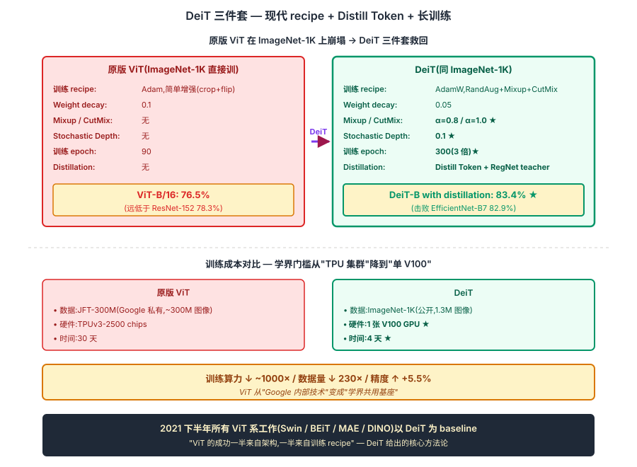
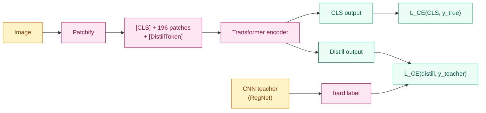
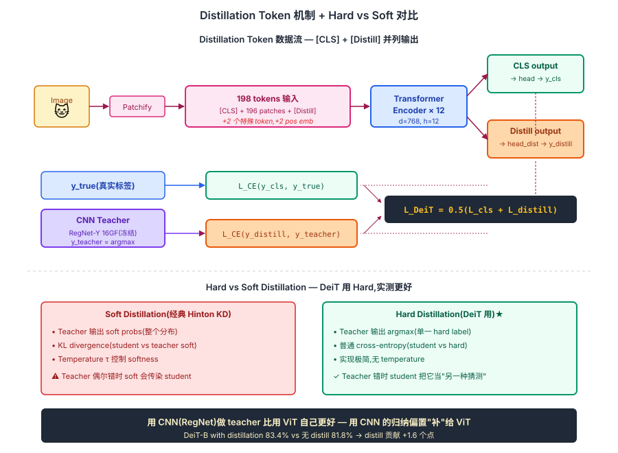

## 前作进展

[ViT](01-vit.md) 2020 年 10 月发表后,视觉社区进入了一个尴尬的局面:**论文报告 ViT 在 JFT-300M 上预训练后击败 ResNet,但 JFT-300M 是 Google 私有数据集,学界没访问权限**。直接用 ImageNet-1K(1.3M 图像)训 ViT 的效果远远比不上 ResNet——ViT-B/16 直接 ImageNet 训只能到 76.5%,而 ResNet-152 是 78%。

这造成 ViT 在学界半年时间无人复现/改进。社区开始怀疑:

- ViT 是不是只在"巨型数据 + 巨型算力"下才 work,根本不是通用方案?
- 视觉归纳偏置在小数据上是不是仍然必需?
- 学界没 JFT 是不是永远没法做 ViT 改进研究?

Facebook AI Research(Touvron 等人)2020 年底开始系统实验,目标是:**用 ImageNet-1K 上的标准训练流程让 ViT 击败 ResNet**。2021 年 1 月发表 *Training data-efficient image transformers & distillation through attention*(DeiT)给出了肯定答案:

**用一组合理的训练技巧 + 知识蒸馏,ViT 在 ImageNet-1K 上从零训练就能击败 ResNet,且只需要 1 张 V100 4 天**。

DeiT 的成功打破了"ViT 必须巨型数据"的迷信,让学界开始大规模实验 ViT 改进。Swin / BEiT / MAE / DINO 等后续 ViT 系工作都是站在 DeiT 让 ViT "可在 ImageNet-1K 上复现" 的肩膀上。

## 核心思想

### 直觉:ViT 不是必须巨型数据,而是必须配套的训练 recipe + 蒸馏

理解 DeiT 真正需要先抓一件事:**[ViT](01-vit.md) 2020 发表后引发的疑虑** —— 在 ImageNet-1K 直接训只有 76.5%(远低于 ResNet),只在 JFT-300M(Google 私有)预训练后才超过 ResNet。学界半年时间无人复现/改进,**怀疑 ViT 是不是只在巨型数据下才 work**。Touvron 等人 2021 反问:**ViT 真的需要 300M 图像?还是只是缺少了正确的训练 recipe + 知识蒸馏?**

三件事必须同时成立才让 DeiT 在 2021 年成立:

- **强数据增强 + 现代训练 recipe** — RandAugment / Mixup / CutMix / Random Erasing / Stochastic Depth / Label Smoothing / EMA / Repeated Augmentation;ViT 没有 CNN 的 translation equivariance,**必须从增强里显式看到平移 / 裁剪 / 混合**
- **Distillation Token + CNN teacher 的 hard distillation** — 加一个和 [CLS] 并列的 distill token 专门学 CNN teacher(RegNet)的 argmax;CNN 的 locality 归纳偏置通过蒸馏"补"给 ViT
- **300 epoch 长训练 + 1 V100 也能跑** — 训练时间是典型 ViT 的 3 倍,补偿小数据下的 underfit;单卡 4 天的训练成本让学界能复现

三件事合起来:**DeiT-B with distillation 在 ImageNet-1K 拿到 83.4%**(对比 ResNet-152 78.3% / EfficientNet-B7 82.9%),用 **1 张 V100 训 4 天** vs 原版 ViT 需要 TPUv3-2500 × 30 天。DeiT 打破了"ViT 必须巨型数据"的迷信,让 ViT 真正变成"学界可用"的技术 — 2021 下半年所有 ViT 系工作(Swin / BEiT / MAE / DINO)几乎都以 DeiT 而非原版 ViT 作为 baseline。


*图 1:**上半** 原版 ViT 训练崩塌 vs DeiT 解决方案对比 — 原版 Adam + 简单增强 + 90 epoch → 76.5%;DeiT AdamW + RandAug + Mixup + CutMix + ... + Stochastic Depth + 300 epoch + Distill → 83.4%。**下半** 训练成本对比 — 原版 ViT 在 JFT-300M + TPUv3-2500 × 30 天;DeiT 在 ImageNet-1K + 1 V100 × 4 天。底部 callout:DeiT 把 ViT 从"Google 内部技术"变成"学界共用基座"。*

## 机制一:强数据增强 + 现代训练 recipe

DeiT 的第一组贡献是**把现代 CNN 训练 recipe(原本为 EfficientNet / ResNet-RS 开发的)系统化应用到 ViT**:

| 训练设置 | 原版 ViT(JFT 预训练 + 微调) | DeiT(ImageNet-1K 从零) |
|------|------|------|
| 优化器 | Adam | **AdamW**(decoupled weight decay) |
| 学习率 schedule | linear warmup + linear decay | cosine schedule + 长 warmup |
| Weight decay | 0.1 | **0.05** |
| Stochastic depth(随机层丢弃) | 无 | **0.1**(随训练步增加) |
| Mixup | 无 | **0.8** |
| Cutmix | 无 | **1.0** |
| RandAugment | 无 | **9/0.5**(主要的图像变换增强) |
| Random erasing | 无 | **0.25** |
| Label smoothing | 无 | **0.1** |
| Repeated augmentation | 无 | **3 倍**(同一图像不同增强 3 次) |
| EMA(权重指数滑动平均) | 无 | **有** |

这一组合是 DeiT 论文 Table 9 的系统消融——**每一项都贡献 0.5-2 分准确率**,加起来让 ViT-S 从直接训的 73% 推到 79.8%(对比 ResNet-50 的 76.1%)。

关键观察:**ViT 比 ResNet 更依赖强增强**。CNN 有内置的 translation equivariance 这个增强免费提供;ViT 没有,需要从数据增强里"显式"看到平移、裁剪、混合等变体,才能学到 translation 鲁棒性。这一发现后来被反复验证——所有 ViT 系工作的强增强配置基本沿用 DeiT 这一套。

## 机制二:Distillation Token + CNN Teacher

DeiT 的第二个贡献是**专门为 ViT 设计的蒸馏方法**——加一个 **distillation token**,和 [CLS] token 并列:

```
原 ViT:  [CLS] + [196 patches]                  → encoder → CLS 接 head
DeiT:    [CLS] + [196 patches] + [DistillToken]  → encoder → CLS 接 student head,DistillToken 接 distill head
```

两个 token 各自有独立的最终 hidden state:

- **`[CLS]` token** —— 学 ground truth 标签(普通 cross-entropy)
- **`[DistillToken]`** —— 学 teacher(CNN,典型 RegNet)的预测

损失是两者平均:

$$
\mathcal{L}_{\text{DeiT}} = \frac{1}{2}\mathcal{L}_{\text{CE}}(y_{\text{CLS}}, y_{\text{true}}) + \frac{1}{2}\mathcal{L}_{\text{CE}}(y_{\text{distill}}, y_{\text{teacher}})
$$

注意 DeiT 用 **hard distillation**(teacher 输出 argmax 标签作为 hard target),不是经典 Hinton 那种 soft distillation(KL on soft probs)。论文消融显示 hard 比 soft 更好(原因:teacher 偶尔出错,soft target 会传染 student;hard target 把错变成"我猜测的另一标签")。

**为什么用 CNN 作 teacher?**直觉上 ViT 是新东西,应该用 ViT 互相蒸馏。但 DeiT 团队发现:**用 CNN(RegNet-Y 16GF, 84.2% top-1)当 teacher 比用更强的 ViT 当 teacher 效果还好**。原因推测是:CNN 学到的归纳偏置(locality/平移不变性)是 ViT 不内置的,蒸馏把这些"补"给 ViT。

DeiT-B with distillation 在 ImageNet 上达到 **83.4%**(无 distill 的 DeiT-B 是 81.8%)——distill token 贡献 1.6 分。



*图 1:DeiT 的 distillation token 设计 — [CLS] 学真实标签,distill token 学 CNN teacher 的预测,两者并列输出。*

## 机制三:300 Epoch 长训练 + 单卡可复现

DeiT 训练 **300 epoch**(典型 ViT 的 3 倍),这一选择关键但常被忽略:

- **ViT 在小数据上 underfits** — ImageNet-1K 的 1.3M 图像对 86M 参数 ViT 来说不够,需要更长训练让模型充分学到 patterns
- **强增强 + 长训练协同** — 每个 epoch 看到的图像因为增强不同变成"新数据",300 epoch 相当于看了 3.9 亿"虚拟图像",弥补数据稀缺
- **单卡可跑** — 1 张 V100 × 4 天的训练成本,学界研究者(没有 TPU 集群)也能复现并改进

这一组合后被 BEiT(400 epoch)、MAE(800-1600 epoch)、DINO(1600 epoch)等自监督 ViT 工作进一步推到极致。"训练时长是 ViT 的另一个超参"成为社区共识。

DeiT 论文 Table 1 的核心成绩:

| 模型 | 参数 | ImageNet top-1 | 训练硬件 | 训练时间 |
|------|------|------|------|------|
| ResNet-50 | 25M | 76.1 | 8 V100 | ~30 h |
| EfficientNet-B0 | 5.3M | 77.1 | 32 TPU | ~3 days |
| ViT-B/16(JFT 预训练 + 微调) | 86M | 77.9 | TPUv3-2500 | ~30 days |
| **DeiT-S** | **22M** | **79.8** | **1 V100** | **3 days** |
| **DeiT-B** | **86M** | **81.8** | **1 V100** | **4 days** |
| **DeiT-B with distillation** | **86M** | **83.4** | **1 V100** | **4 days** |

**DeiT-B with distillation(83.4%)击败 EfficientNet-B7(82.9%)**,但训练算力只有 EfficientNet 的 1/100。

## 三件套协同:现代 recipe + Distill Token + 长训练 缺一不可

DeiT 在 2021 年能让 ViT 在 ImageNet-1K 上从零训练击败 ResNet,**不是单一改进**,而是三件套同时调到协同点 —— 任何一个抽掉 DeiT 都不成立,这一点和 [ResNet](../01-cnn/05-resnet.md) 的 `shortcut + BN + He 初始化` 协同关系一致:

- **只有现代 recipe,没有 distill token** — 强增强 + AdamW + 长训练把 DeiT-B 推到 81.8%,比 EfficientNet-B7 略低,无法证明"ViT 在小数据上能赢";distill 那 1.6 分是反超的关键
- **只有 distill token,没有现代 recipe** — ViT 仍然在 Adam + 简单增强下训练,300 epoch 也救不回 underfit;distill 把 ViT 从 76.5% 推到 ~78%,仍输 ResNet,卖点不成立
- **只有 recipe + distill,没有 300 epoch 长训练** — 90 epoch 训出来 ViT 严重 underfit,即使 distill 也只能到 ~80%;长训练补偿小数据是关键,不能省

三件套合起来才让 ViT 在 ImageNet-1K + 1 张 V100 + 4 天上达到 83.4%。**核心方法论意义**:ViT 的成功一半来自架构,一半来自训练 recipe — 这一认知后来直接催生 ConvNeXt(2022)用 ViT 的训练 recipe 调 ResNet,反过来超过 EfficientNet,完成"训练 recipe 比算子重要"的对称论证。


*图 2:**上半** Distillation Token 数据流 — 输入 + [CLS] + [Distill] 一起进 encoder,两个 token 各自有独立输出 head;CLS 学 ground truth(`L_CE(CLS, y_true)`),Distill 学 CNN teacher 的 argmax(`L_CE(distill, y_teacher)`);损失 = 0.5 × 两者之和。**下半** Hard vs Soft distillation 对比 — Soft(Hinton 经典 KD,KL on soft probs)vs Hard(argmax 作 label);DeiT 用 Hard,实测比 Soft 更好(原因:teacher 偶尔错,soft 会传染,hard 只把错变成"另一种猜测")。底部 callout:**用 CNN(RegNet)做 teacher 比用 ViT 自己更好** — CNN 的 locality 归纳偏置通过蒸馏"补"给 ViT。*

## 性能 vs 资源

DeiT 在 ImageNet-1K 上的核心成绩(论文 Table 1):

| 模型 | 参数 | ImageNet top-1 | 训练硬件 | 训练时间 |
|------|------|------|------|------|
| ResNet-50 | 25M | 76.1 | 8 V100 | ~30 h |
| EfficientNet-B0 | 5.3M | 77.1 | 32 TPU | ~3 days |
| ViT-B/16(JFT 预训练 + 微调) | 86M | 77.9 | TPUv3-2500 | ~30 days |
| **DeiT-S** | **22M** | **79.8** | **1 V100** | **3 days** |
| **DeiT-B** | **86M** | **81.8** | **1 V100** | **4 days** |
| **DeiT-B↑384**(微调到 384 分辨率) | 86M | **83.1** | 1 V100 | +1 day |
| **DeiT-B with distillation** | **86M** | **83.4** | **1 V100** | **4 days** |

观察:

- **DeiT-B with distillation(83.4%)击败 EfficientNet-B7(82.9%)**,**1 张 V100 4 天 vs 32 TPU 3 周**
- DeiT-S(22M)在 ResNet-50 体量下达到 79.8%(ResNet-50 是 76.1%),参数相近但效果显著好
- 不需要 JFT 等私有数据——**ImageNet-1K + 8 V100(或 1 V100 慢点)就能复现**

这一结果让 ViT 真正变成"学界可用"的技术。2021 年下半年的 ViT 系论文几乎全部以 DeiT 而不是原版 ViT 作为 baseline。

## 训练细节

| 维度 | DeiT-B with distillation |
|------|------|
| 架构 | 同 ViT-B/16:12 层,d=768, h=12, d_ff=3072, **86M 参数** + 1 个 distill token(可忽略) |
| Patch | 16×16,224 输入 → 196 patches |
| 输入 token 数 | 198(196 patches + [CLS] + [DistillToken]) |
| Teacher | RegNet-Y 16GF, 84.2% ImageNet,完全冻结 |
| 优化器 | AdamW(β1=0.9, β2=0.999), weight decay 0.05 |
| Learning rate | 0.5e-3 × batch_size/512 = ~1e-3 |
| Schedule | linear warmup 5 epoch + cosine decay |
| Batch | 1024(8 V100,每卡 128;或 1 V100 256 + 4 step accum) |
| 训练 epoch | **300**(典型 ViT 训练的 ~3 倍——长训练补偿小数据) |
| 数据增强 | RandAug + Mixup 0.8 + Cutmix 1.0 + Random erasing 0.25 + Repeated 3× |
| Dropout | 0(完全不用)+ Stochastic depth 0.1 |
| EMA | decay 0.99996 |
| 训练硬件 | **1 张 V100 GPU × 4 天**(或 8 张 V100 × 12 小时) |

注意 **训练 300 epoch** 是关键——ViT 在小数据上 underfits,需要更长训练才能充分学到。后续 BEiT / DINO / MAE 等工作把训练拉到 400-1600 epoch,继续涨点。

## 关键代码

DeiT 的核心实现就是 [ViT](01-vit.md) + 一个 distill token + 两个 head:

```python
import torch
import torch.nn as nn
import torch.nn.functional as F

class DeiT(nn.Module):
    def __init__(self, img_size=224, patch_size=16, num_classes=1000,
                 embed_dim=768, depth=12, num_heads=12, mlp_ratio=4.0):
        super().__init__()
        self.patch_embed = PatchEmbedding(img_size, patch_size, 3, embed_dim)
        n_patches = self.patch_embed.n_patches
        # 两个特殊 token: [CLS] 和 [DistillToken]
        self.cls_token = nn.Parameter(torch.zeros(1, 1, embed_dim))
        self.dist_token = nn.Parameter(torch.zeros(1, 1, embed_dim))
        self.pos_emb = nn.Parameter(torch.zeros(1, n_patches + 2, embed_dim))  # +2

        encoder_layer = nn.TransformerEncoderLayer(...)
        self.encoder = nn.TransformerEncoder(encoder_layer, num_layers=depth)
        self.norm = nn.LayerNorm(embed_dim)
        # 两个分类 head
        self.head = nn.Linear(embed_dim, num_classes)         # for [CLS]
        self.head_dist = nn.Linear(embed_dim, num_classes)    # for [DistillToken]

    def forward(self, x):
        B = x.size(0)
        x = self.patch_embed(x)                          # [B, 196, 768]
        cls = self.cls_token.expand(B, -1, -1)
        dist = self.dist_token.expand(B, -1, -1)
        x = torch.cat([cls, dist, x], dim=1)             # [B, 198, 768]
        x = x + self.pos_emb
        x = self.encoder(x)
        x = self.norm(x)
        # 两个 head 各自从对应 token 出
        out_cls = self.head(x[:, 0])
        out_dist = self.head_dist(x[:, 1])
        if self.training:
            return out_cls, out_dist  # 训练时返回两个,损失分别算
        else:
            return (out_cls + out_dist) / 2  # 推理时平均

def deit_distill_loss(out_cls, out_dist, y_true, y_teacher):
    """Hard distillation: teacher 输出 argmax 作为 distill 目标"""
    loss_cls = F.cross_entropy(out_cls, y_true)
    loss_dist = F.cross_entropy(out_dist, y_teacher)  # y_teacher 是 hard label
    return 0.5 * loss_cls + 0.5 * loss_dist

# 训练循环
teacher = RegNetY16GF.pretrained_imagenet()
teacher.eval()

for batch in dataloader:
    images, y_true = batch
    with torch.no_grad():
        y_teacher = teacher(images).argmax(-1)  # hard label
    out_cls, out_dist = student(images)
    loss = deit_distill_loss(out_cls, out_dist, y_true, y_teacher)
    loss.backward()
    optimizer.step()
```

工程要点:

- **`y_teacher` 是 argmax 不是 logits**——hard distillation,简单稳定
- **推理时把两个 head 平均**——CLS head 学真实标签可能略保守,distill head 学 teacher 可能略激进,平均一下平衡
- **位置编码维度 +2** 而不是 +1——因为有两个特殊 token

## 影响 / 后续

DeiT 在 ViT 历史的位置:**把 ViT 从"Google 内部技术"变成"学界共用基座"**。具体影响:

**1. 让 ViT 复现门槛骤降**——之前需要 JFT-300M + TPU 集群,DeiT 之后 ImageNet-1K + 1 张 V100 就能复现。学界 ViT 改进研究在 2021 年下半年爆发(Swin / BEiT / MAE / DINO / CrossViT / CaiT 都基于 DeiT 训练流程)

**2. 强增强配方成为 ViT 标配**——后续所有 ViT 系工作都用 DeiT 那套 RandAug + Mixup + Cutmix + Stochastic depth 组合。这一组合后来也被用在视觉 SSL(self-supervised learning)和多模态训练里

**3. 知识蒸馏在视觉 Transformer 上 work**——DeiT 证明蒸馏对 ViT 仍有效,且 CNN 蒸 ViT 的"跨架构蒸馏"特别有效。这一观察催生了大量"跨架构蒸馏"研究

**4. "ViT 比 CNN 更需要训练 tricks"成为共识**——ViT 的成功一半来自架构,一半来自训练 recipe。这一认知影响了后续 ConvNeXt(2022) 用 ViT 的训练 recipe 调 ResNet 又拿回 SOTA 的故事

**5. Hard vs soft distillation 的讨论**——DeiT 推动了蒸馏方法的细化讨论。Hinton 经典 KD 是 soft,DeiT 用 hard,这一对比成为很多蒸馏论文的标准消融

DeiT 留下的几个方向被后续节点承接:

- **只能做分类**——和 [ViT](01-vit.md) 一样,detection / segmentation 仍需层级特征 → [Swin](03-swin.md)
- **预训练任务受限**——只能用 supervised classification 预训练 → MAE(自监督 masked image modeling)
- **不能高分辨率**——224 / 384 限制了细粒度任务 → [Swin](03-swin.md) 的 windowed attention

→ [03-swin.md](03-swin.md) · 层级化 + windowed attention,detection / segmentation SOTA
→ [04-dit.md](04-dit.md) · ViT 思想应用到生成任务
→ [01-vit.md](01-vit.md) · 父结构,DeiT 用同样的 12 层 768 维但训练完全不同
→ [../06-bert-family/04-distilbert.md](../06-bert-family/04-distilbert.md) · 知识蒸馏的另一个经典案例
→ [../01-cnn/08-convnext.md](../01-cnn/08-convnext.md) · DeiT 训练 recipe 被 ConvNeXt 借去调 ResNet
