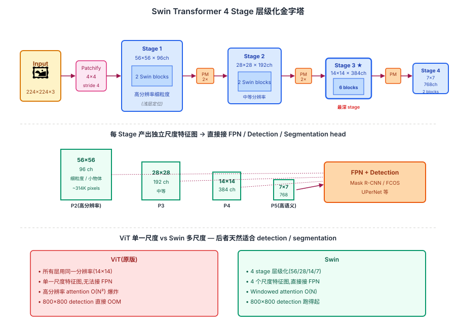
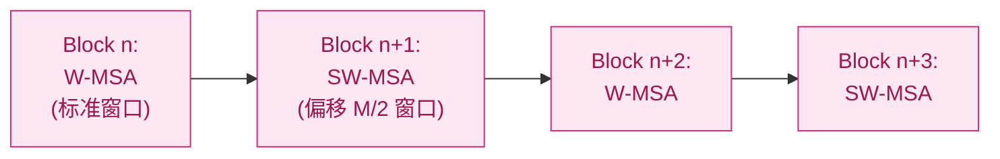
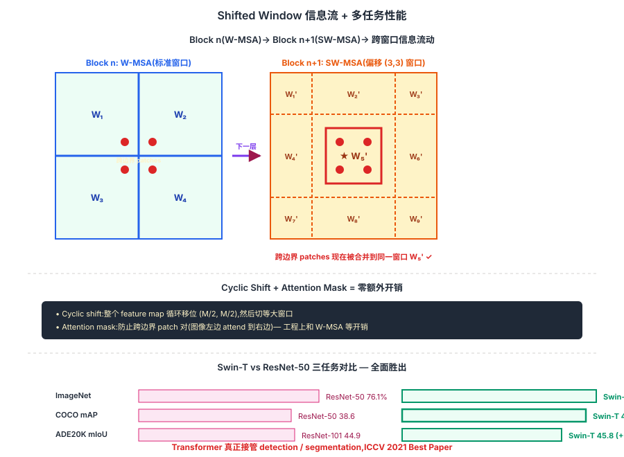

## 前作进展

[ViT](01-vit.md) 和 [DeiT](02-deit.md) 解决了"Transformer 能在视觉分类上击败 CNN"的问题,但留下两个明确局限:

**1. 只能做分类,不能直接套到 detection / segmentation**

CNN 时代的视觉骨干(ResNet, EfficientNet)产出**多尺度层级特征图**——浅层是高分辨率细粒度特征(适合定位小物体),深层是低分辨率语义特征(适合分类)。Faster R-CNN、Mask R-CNN、FPN 等检测/分割框架都依赖这种层级结构。

ViT 不行——所有 transformer 层用同样的 patch 数(14×14=196 个),所有层都是同样分辨率。这导致:

- 没法接 FPN 等层级 head 做 detection
- 分割任务需要密集预测,14×14 太粗
- 想做高分辨率(512+ pixels)直接超出显存

**2. 高分辨率不可行**

ViT 在 224 输入下是 196 patches,attention 是 `196² = 38K` 分数。如果输入推到 800×800(detection 常用分辨率),patch 数 `(800/16)² = 2500`,attention `2500² = 6.25M`——单层 6.25 倍内存,12 层加起来直接 OOM。

社区在 2021 年集中爆发了一波解决这两个问题的工作:

- **PVT**(Pyramid Vision Transformer, Wang 2021)—— 用 spatial reduction attention(把 K/V 下采样)降复杂度,产出层级特征。是第一个尝试
- **CvT** / **CoaT** / **PiT** —— 各种 CNN+Transformer 混合,部分保留 ViT 思想
- **Swin Transformer**(Microsoft Research Asia, Liu 2021)—— **完全保留 Transformer 思想**,用 windowed attention + shifted window + patch merging 同时解决两个问题

Swin 在 2021 年成为 detection / segmentation 的新 SOTA,并因为方法的优雅 + 强普适性获 ICCV 2021 Best Paper。这一节聚焦 Swin,因为它是后来 SwinV2 / MaskFormer / Mask2Former 等视觉 backbone 的直接母版。

## 核心思想

### 直觉:把 CNN 的"局部 + 层级"归纳偏置还给 ViT

理解 Swin 真正需要先抓一件事:**[ViT](01-vit.md) / [DeiT](02-deit.md) 解决了 Transformer 能做视觉分类,但留下两个明确局限** — 所有层用同一分辨率(无法接 FPN 做 detection)+ 高分辨率 attention O(N²) 爆炸(800×800 detection 直接 OOM)。CNN backbone(ResNet)的两条归纳偏置 — **局部连接 + 层级下采样** — 正是密集预测任务的关键,但 ViT 全部抛弃了。Liu 等人 2021 反问:**为什么不把 CNN 的这两条偏置还给 ViT,但保留 Transformer 的强表达力?**

三件事必须同时成立才让 Swin 在 2021 年成立:

- **Windowed Attention** — 把 attention 限制在 7×7 局部窗口里,复杂度从 O(N²) 降到 O(N·M²) = O(N),让 800×800 detection 不再 OOM
- **Shifted Window** — 交替用标准窗口和偏移窗口,让相邻 block 的窗口边界错开,两个 block 内信息跨窗口流动 — 通过 cyclic shift + attention mask 实现零额外开销
- **Patch Merging 层级下采样** — 每 stage 2× 减空间 / 2× 增 channel,模仿 ResNet 金字塔,产出 4 个尺度特征图(56/28/14/7)可以直接接 FPN

三件事合起来:**Swin-T 在 COCO Object Detection 上 mAP 46.0 vs ResNet-50 的 38.6(+7.4 mAP)**,ADE20K segmentation mIoU 53.5(Swin-L,2021 SOTA)。Swin 真正接管 detection / segmentation 任务,ICCV 2021 Best Paper。**核心方法论**:Transformer + 视觉归纳偏置(局部 + 层级)的组合比"纯 ViT"或"纯 CNN"都强 — 这一发现后被 ConvNeXt 反向用回 CNN,完成"两条路线互相借鉴"的演化对称。


*图 1:Swin 完整架构 4 stage 层级化金字塔。**Stage 1** 56×56 patches × 96ch + 2 Swin blocks(W-MSA + SW-MSA)→ **Patch Merging**(2× 空间减半 + 2× channel 翻倍) → **Stage 2** 28×28 × 192ch + 2 blocks → ... → **Stage 4** 7×7 × 768ch + 2 blocks。每 stage 产出独立尺度特征图,4 个尺度直接接 FPN / detection head。底部对比:ViT 单一 14×14 vs Swin 4 个尺度(56/28/14/7),后者天然适合 detection / segmentation。*

## 机制一:Windowed Attention

Swin 的第一个想法是**把 attention 限制在局部窗口里,不再做全图**。具体:把 feature map(H×W 个 patch)切成不重叠的 `M × M` 窗口(典型 M=7),每个窗口内 self-attention。

```
Feature map 56×56 patches → 切成 8×8 = 64 个窗口,每窗口 7×7 = 49 patches
窗口内 attention: 49² = 2401 次 / 窗口
总计算: 64 × 2401 = 154K 次
对比全图 attention: (56×56)² = 9.8M 次
```

**复杂度从 O(N²) 降到 O(N · M²) = O(N)**(M 固定时)。这让 Swin 可以处理任意大小的输入图像,detection 的 800×800 分辨率不再是问题。

但 windowed attention 有一个明显问题:**窗口之间没有信息交换**。如果一个物体跨在两个窗口边界上,模型永远看不到完整的它。

## 机制二:Shifted Window — 让信息跨窗口流动

Swin 的精华是 **shifted window** 机制——**交替用两种窗口划分**:

- **W-MSA**(Window Multi-head Self-Attention):标准窗口划分,从 (0, 0) 开始切 7×7 窗口
- **SW-MSA**(Shifted Window MSA):窗口往右下偏移 (M/2, M/2) = (3, 3) 再切 7×7 窗口



*图 1:Swin block 交替使用标准窗口和偏移窗口 — 偏移让相邻 block 的窗口边界错开,跨边界的信息能在两个 block 内传递。*

直觉:**第 n 层的窗口边界在第 n+1 层的窗口中央**,所以原本两个相邻窗口边界处的 patch,在下一层就被合并到同一个窗口里 attention。两个 block 配合就完成了"窗口间的信息混合"。

工程实现上,SW-MSA 有个小麻烦:**偏移后窗口数量不固定**,边缘有"破碎的小窗口"。Liu 团队用 **cyclic shift + 注意力 mask** 巧妙解决——把整个 feature map 循环移位,然后还是切等大窗口,但在 attention 里 mask 掉跨边界的 patch 对(防止"图像左边的 patch 突然 attend 到图像右边")。这一 trick 让 SW-MSA 和 W-MSA 在工程上完全等价的开销,没有任何额外计算。

## 机制三:Patch Merging — 层级化产出多尺度特征

Swin 的第三个改进是**周期性把 patch 合并以产出层级特征**——这模仿了 CNN 的下采样金字塔。

具体做法:每个 stage 结束后,做一次 **Patch Merging**:把 2×2 邻居 patch 沿 channel 维度拼接,然后过一个 linear 把 channel 减半:

```
Stage 1 输出: 56×56 patches × 96 channels
  ↓ Patch Merging
Stage 2 输入: 28×28 patches × 192 channels  (空间减半,channel 翻倍)
  ↓ Patch Merging
Stage 3 输入: 14×14 patches × 384 channels
  ↓ Patch Merging
Stage 4 输入: 7×7 patches × 768 channels
```

这个 `2×降空间、2×增 channel` 的模式和 CNN 完全一样(ResNet 的 stage 之间也是这么做的)。最终 Swin 产出 4 个尺度的特征图(56/28/14/7),可以直接接 FPN / 检测 / 分割 head。

完整 Swin 架构:

```
图像 → patchify(4×4 patches)
  ↓ Stage 1: × 2 Swin blocks    → 56×56, 96 channels
  ↓ Patch Merging
  ↓ Stage 2: × 2 Swin blocks    → 28×28, 192 channels
  ↓ Patch Merging
  ↓ Stage 3: × 18 Swin blocks   → 14×14, 384 channels(深 stage)
  ↓ Patch Merging
  ↓ Stage 4: × 2 Swin blocks    → 7×7, 768 channels
```

这就是 **Swin-S(small)**。Swin-T(tiny)/ B(base)/ L(large)用同样结构但调整层数和宽度。

## 三件套协同:Windowed + Shifted + Patch Merging 缺一不可

Swin 在 2021 年能让 Transformer 接管 detection / segmentation,**不是单一改进**,而是三件套同时调到协同点 —— 任何一个抽掉 Swin 都不成立,这一点和 [ResNet](../01-cnn/05-resnet.md) 的 `shortcut + BN + He 初始化` 协同关系一致:

- **只有 Windowed attention,没有 Shifted Window** — 窗口间永远不交互,跨边界物体被切割,信息孤岛;长距离依赖完全消失,**密集预测精度严重下降**(分割边界混乱)
- **只有 Windowed + Shifted,没有 Patch Merging** — 所有层同分辨率,失去多尺度特征图,**无法接 FPN / detection head**,密集任务依然做不了
- **只有 Patch Merging + 全局 Attention(无 windowed)** — 高分辨率(800×800)attention 直接 OOM,**detection / segmentation 在工程上根本跑不起来**

三件套合起来才让 Transformer 第一次能用同一个 backbone 同时做 classification(ImageNet 81.3%)+ detection(COCO mAP 46.0)+ segmentation(ADE20K 53.5 mIoU)。**Swin 的核心方法论**:Transformer 强大但需要视觉归纳偏置(局部 + 层级)的辅助 — 这条路线后被 ConvNeXt 反向用回 CNN,完成"ViT 借 CNN 偏置 ↔ CNN 借 ViT 训练 recipe"的对称演化。


*图 2:**上半** Shifted Window 机制图解 — Block n 用标准窗口 W-MSA(实线 7×7 网格),Block n+1 用偏移 (3,3) 窗口 SW-MSA(虚线网格);红框标出"两个 block 后,跨边界 patch 被合并到同一窗口"。Cyclic shift 把整个 feature map 循环移位 + attention mask 防跨边界混乱,实现零额外开销。**下半** 多任务性能对比 — Swin-T vs ResNet-50 在 ImageNet 分类(81.3 vs 76.1,+5.2)/ COCO mAP(46.0 vs 38.6,+7.4)/ ADE20K mIoU(45.8 vs 44.9,+0.9)。底部 callout:Transformer 真正接管 detection / segmentation,ICCV 2021 Best Paper。*

## 模型规格

| 模型 | depths(每 stage 层数) | C(初始 channel)| 参数量 | FLOPs |
|------|------|------|------|------|
| Swin-T | (2, 2, 6, 2) | 96 | 28M | 4.5G |
| Swin-S | (2, 2, 18, 2) | 96 | 50M | 8.7G |
| Swin-B | (2, 2, 18, 2) | 128 | 88M | 15.4G |
| Swin-L | (2, 2, 18, 2) | 192 | 197M | 34.5G |

注意第 3 个 stage 层数最深(6 或 18)——这是 ResNet 时代的经验法则,中间分辨率层数最多。

## 性能:多任务全面 SOTA

Swin 最重要的贡献是**在 detection / segmentation 上击败 CNN baseline**,而不仅是分类。

**ImageNet 分类**(supervised on ImageNet-1K):

| 模型 | 参数 | FLOPs | top-1 |
|------|------|------|------|
| RegNetY-4G | 21M | 4.0G | 80.0 |
| DeiT-S | 22M | 4.6G | 79.8 |
| **Swin-T** | **28M** | **4.5G** | **81.3** |
| Swin-B(384) | 88M | 47G | 86.4 |

**COCO Object Detection**(用 Mask R-CNN 框架):

| Backbone | mask mAP | box mAP |
|------|------|------|
| ResNet-50 | 35.7 | 38.6 |
| **Swin-T** | **41.7** | **46.0** |
| ResNeXt101-64x4d | 39.5 | 42.4 |
| **Swin-S** | **44.5** | **48.5** |

Swin-T(28M)击败 ResNet-50(25M)+ 6 mAP——这是 COCO 上几年才能达到的提升,Swin 一篇论文实现。

**ADE20K Semantic Segmentation**(用 UPerNet):

| Backbone | mIoU |
|------|------|
| ResNet-101 | 44.9 |
| Swin-T | **45.8** |
| **Swin-L(384)** | **53.5** |

Swin-L 在 ADE20K 上 53.5 mIoU 在 2021 年是 SOTA + ~3 分。这一结果直接让 Swin 成为 detection / segmentation 任务的新默认 backbone。

## 训练细节

| 维度 | Swin-T(ImageNet-1K supervised) |
|------|------|
| 架构 | 4 stages,depths (2,2,6,2), C=96, **28M 参数** |
| Patch | 4×4(比 ViT 的 16×16 细 16 倍) |
| Window | 7×7 |
| 训练数据 | ImageNet-1K(1.3M 图像) |
| 优化器 | AdamW(β1=0.9, β2=0.999) |
| Weight decay | 0.05 |
| Batch | 1024(8 V100) |
| 训练 epoch | 300 |
| 增强 | 同 DeiT(RandAug + Mixup + Cutmix + Random erasing) |
| Stochastic depth | 0.2 |
| 训练时间 | ~3 天 8 V100 |

注意 patch size 是 **4×4 而非 ViT 的 16×16**——因为 Swin 需要更高分辨率起步,经过 4 个 stage 的 2× 下采样后才得到 ViT-style 的 7×7 final feature。

## 关键代码

Swin block 的核心:

```python
import torch
import torch.nn as nn

def window_partition(x, window_size):
    """[B, H, W, C] → [B*num_windows, M, M, C]"""
    B, H, W, C = x.shape
    x = x.view(B, H // window_size, window_size, W // window_size, window_size, C)
    windows = x.permute(0, 1, 3, 2, 4, 5).contiguous().view(-1, window_size, window_size, C)
    return windows  # 每个窗口被当作一个独立的"序列"做 attention

def window_reverse(windows, window_size, H, W):
    """逆操作:[B*num_windows, M, M, C] → [B, H, W, C]"""
    B = int(windows.shape[0] / (H * W / window_size / window_size))
    x = windows.view(B, H // window_size, W // window_size, window_size, window_size, -1)
    x = x.permute(0, 1, 3, 2, 4, 5).contiguous().view(B, H, W, -1)
    return x

class SwinBlock(nn.Module):
    def __init__(self, dim, num_heads, window_size=7, shift_size=0, mlp_ratio=4.0):
        super().__init__()
        self.dim = dim
        self.window_size = window_size
        self.shift_size = shift_size  # 0 = W-MSA,window_size//2 = SW-MSA
        self.norm1 = nn.LayerNorm(dim)
        self.attn = WindowAttention(dim, window_size, num_heads)
        self.norm2 = nn.LayerNorm(dim)
        self.mlp = nn.Sequential(
            nn.Linear(dim, int(dim * mlp_ratio)),
            nn.GELU(),
            nn.Linear(int(dim * mlp_ratio), dim),
        )

    def forward(self, x, H, W):
        # x: [B, H*W, C]
        B, L, C = x.shape
        shortcut = x
        x = self.norm1(x).view(B, H, W, C)

        # Shifted window:cyclic shift
        if self.shift_size > 0:
            x = torch.roll(x, shifts=(-self.shift_size, -self.shift_size), dims=(1, 2))

        # Partition into windows,做 attention,逆操作
        x_windows = window_partition(x, self.window_size)  # [num_w*B, M, M, C]
        x_windows = x_windows.view(-1, self.window_size * self.window_size, C)
        attn_windows = self.attn(x_windows, mask=self.attn_mask)  # SW-MSA 需要 mask
        attn_windows = attn_windows.view(-1, self.window_size, self.window_size, C)
        x = window_reverse(attn_windows, self.window_size, H, W)  # [B, H, W, C]

        # Reverse cyclic shift
        if self.shift_size > 0:
            x = torch.roll(x, shifts=(self.shift_size, self.shift_size), dims=(1, 2))

        x = x.view(B, H * W, C)
        x = shortcut + x
        x = x + self.mlp(self.norm2(x))
        return x

class PatchMerging(nn.Module):
    def __init__(self, dim):
        super().__init__()
        # 2×2 邻居 → 4×dim 拼接,然后 linear 到 2×dim(空间减半 + channel 翻倍)
        self.reduction = nn.Linear(4 * dim, 2 * dim, bias=False)
        self.norm = nn.LayerNorm(4 * dim)

    def forward(self, x, H, W):
        # x: [B, H*W, C]
        B, L, C = x.shape
        x = x.view(B, H, W, C)
        x0 = x[:, 0::2, 0::2, :]  # 偶偶
        x1 = x[:, 1::2, 0::2, :]  # 奇偶
        x2 = x[:, 0::2, 1::2, :]  # 偶奇
        x3 = x[:, 1::2, 1::2, :]  # 奇奇
        x = torch.cat([x0, x1, x2, x3], -1)  # [B, H/2, W/2, 4*C]
        x = x.view(B, -1, 4 * C)
        x = self.norm(x)
        x = self.reduction(x)
        return x  # [B, H/2 * W/2, 2*C]
```

完整 Swin 模型是 4 个 stage 的堆叠,每个 stage 是 (Swin blocks 交替 W-MSA / SW-MSA) + Patch Merging。

## 影响 / 后续

Swin 在视觉历史的位置:**让 Transformer 真正接管 detection / segmentation**。具体影响:

**1. 成为新的视觉 backbone 默认**——2021-2023 期间几乎所有视觉论文的 backbone 不是 ResNet 就是 Swin。HuggingFace timm 库里 Swin 系列下载量长期靠前

**2. 多项 COCO / ADE20K 冠军**——2021 ICCV、CVPR 等会议的 detection / segmentation track 大多数 SOTA 都用 Swin。这是 Transformer 真正"占领"密集预测任务的标志

**3. Windowed attention 思想广泛传播**——后续多个工作借鉴:HaloNet(2021)、Focal Transformer(2021)、CSWin(2021)、MaxViT(2022)。Window 尺度、shift 策略、cross-window 通信都成为研究子方向

**4. SwinV2(2022)/ SwinV3** 持续迭代——SwinV2 把模型推到 3B 参数,继续 detection / segmentation SOTA;SAM(Segment Anything, 2023)的图像编码器也是 ViT 而不是 Swin,但 Mask2Former 等仍以 Swin 为主

**5. CNN 思想被借鉴回 Transformer**——Swin 的"局部连接 + 层级下采样"本质是把 CNN 的归纳偏置部分还给了 Transformer。这一思路被 ConvNeXt(2022)反向用,**把 Transformer 的"现代化训练 + 局部连接"还给 CNN**——视觉 + Transformer 的演化最后回归到"局部 + 层级"的混合智慧

**6. ICCV 2021 Best Paper**——Swin 是 ICCV 最高荣誉,这一奖项也反映了社区对"Transformer + 视觉归纳偏置"组合方案的认可

Swin 留下的开放问题:

- **复杂的工程实现**——cyclic shift + attention mask 看着优雅,但代码复杂度比 ViT 高得多
- **全局信息流弱化**——窗口注意力在长距离依赖上不如 ViT,需要多层堆叠
- **不是真正"纯 Transformer"**——和 CNN 一样依赖归纳偏置,这一让位换来效率和密集任务效果

→ [04-dit.md](04-dit.md) · ViT 应用到生成,与 Swin 形成"分别接管理解 vs 生成"格局
→ [01-vit.md](01-vit.md) · 父结构,Swin 是 ViT 的"层级化 + 高分辨率"扩展
→ [02-deit.md](02-deit.md) · Swin 训练 recipe 几乎完全沿用 DeiT
→ [../01-cnn/08-convnext.md](../01-cnn/08-convnext.md) · ConvNeXt 是 Swin 的"CNN 反向版"
→ [../10-diffusion/](../10-diffusion/) · 后期 diffusion 上用 Swin 做骨干的工作
