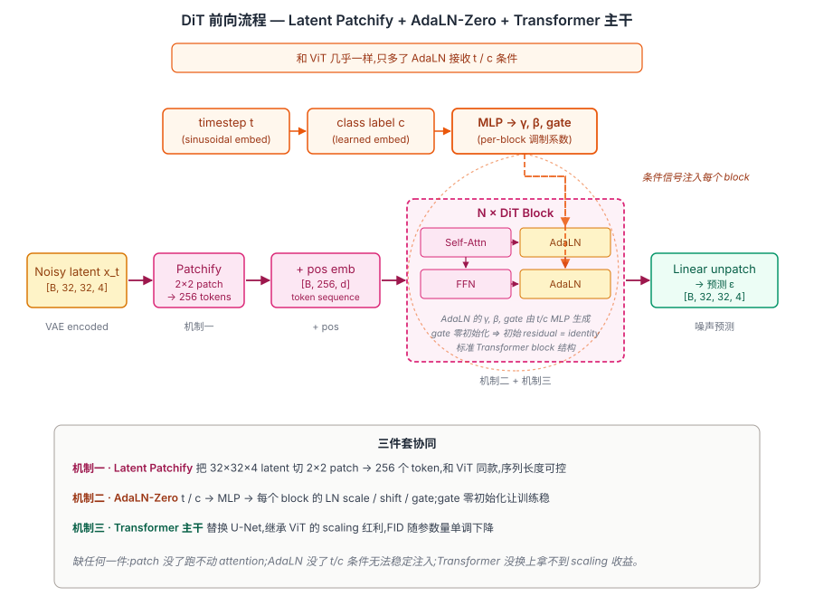
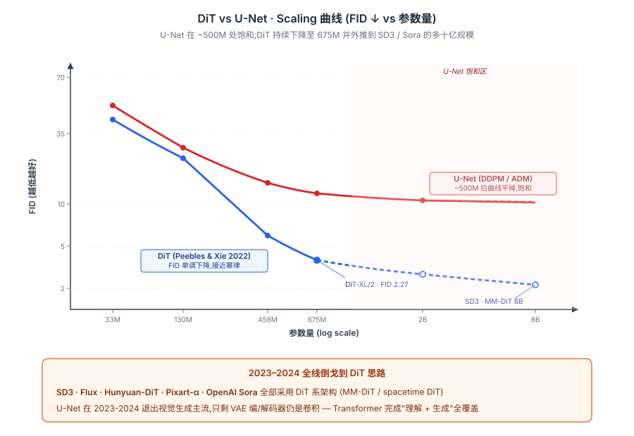

## 前作进展

到 2022 年中,生成式视觉模型的格局是:

- **GAN 系**(StyleGAN 等)—— 2014–2020 主流,但训练不稳、模式坍塌、难以条件生成
- **Autoregressive 系**(PixelRNN, ImageGPT)—— 顺序生成像素,慢且质量一般
- **Diffusion 系**(Stable Diffusion, Imagen, DALL-E 2)—— 2022 新王,质量高、稳定、可条件控制

但**所有 diffusion 模型的 backbone 都是 U-Net**——卷积下采样 + skip connection + 卷积上采样的经典视觉架构。U-Net 在 2015 年医学影像分割上提出,后来被 DDPM(2020 Ho)选作 diffusion 的去噪网络,从此成为 diffusion 的默认 backbone。

但 U-Net 有几个明显问题:

1. **不享受 Transformer 的 scaling law** —— 加参数 / 加数据,U-Net 的 loss 改善规律不像 Transformer 那么干净。在 [GPT/ViT scaling](../07-gpt-scaling/04-scaling-laws.md) 时代,这是结构性弱点
2. **架构选择多** —— U-Net 的下采样深度、skip 通道数、attention 插入位置都需要手调,没有统一原则
3. **跨任务难统一** —— 想从图像 diffusion 扩展到视频 / 3D / 多模态,U-Net 都要重新设计

2022 年 12 月 Peebles & Xie(UC Berkeley + NYU)发表 *Scalable Diffusion Models with Transformers*(DiT),做了一个简单又激进的实验:**把 diffusion 的 U-Net 完全替换成 ViT-style 的 Transformer,看看 scaling 性质如何**。结果:

- **DiT-XL/2(675M 参数)在 ImageNet 256² 类条件生成上拿到 FID 2.27**——SOTA,且训练稳定
- **scaling law 干净**——FID 随参数 / 算力按预测的幂律下降
- **架构选择极简**——一个超参 patch size,一个超参深度

这一结果在 2022 年并没引起太大反响——直到 2023 年的 **Stable Diffusion 3** 和 2024 年的 **OpenAI Sora** 公开声明用 DiT 作为基座,这才让 DiT 成为 2024 视觉生成的新基础架构。今天看 DiT 的影响力,这是把 Transformer 完成"视觉理解 → 视觉生成"全覆盖的关键一步。

## 核心思想

### 直觉:diffusion backbone 不必是 U-Net,Transformer 同样 work 且 scale 更好

理解 DiT 真正需要先抓一件事:**[DDPM](../10-diffusion/01-ddpm.md) / [LDM](../10-diffusion/02-ldm.md) 都用 U-Net 作 ε_θ,但 U-Net 的 scaling 难——加深加宽边际收益快速衰减**。在 [GPT/ViT scaling law](../07-gpt-scaling/04-scaling-laws.md) 时代,这是结构性弱点:LLM 已经验证"加参数 + 加算力 = loss 按幂律下降",但 diffusion 的 U-Net 不享受这条红利。Peebles & Xie 2022 反问:**[ViT](01-vit.md) 在 CV 已经全面替代 CNN,diffusion 的 backbone 为什么还要用 U-Net?直接用 ViT 风格 Transformer 替换 U-Net,把 Transformer 的 scaling 红利搬到生成上**。

为什么这件事在 2022 年才被做出来?三件事必须同时成立:

- **diffusion 已经搬到 latent 空间** —— pixel diffusion 算力爆炸,Transformer 在像素上跑不动;LDM 把 diffusion 压到 latent 让 Transformer 处理 256 个 patch 变得可行
- **条件注入方式找到 AdaLN-Zero** —— diffusion 必须告诉模型"现在是 t / 类别 c",简单 cross-attention 或 in-context 注入效果都不够,AdaLN-Zero 是关键工程贡献
- **算力到位 + ImageNet 数据** —— DiT-XL/2 训 7M steps 在 A100 集群上要 ~200K GPU 时,2022 年才有人愿意为"验证 backbone 替换"这件事砸这么多算力

三件事合起来才让 DiT-XL/2 在 ImageNet 256² 类条件生成上拿到 FID 2.27 SOTA,且**FID 随算力按幂律下降**(U-Net 在同尺度早就饱和)。这一结果当时反响不大,直到 2024 年的 SD3 / Sora 公开声明用 DiT 作 backbone,才让 DiT 成为视觉生成的新基础架构。

### 机制一:Latent Patchify — 把 latent 切成 patch 当 token

DiT 用在 latent space(同 [LDM](../10-diffusion/02-ldm.md)):图像先被 VAE 编码到 `32 × 32 × 4` latent,在 latent 上做 diffusion。然后 latent 切 `p × p` patch(典型 p=2),`32 × 32 / 4 = 256` 个 patch,每个 patch 拉平 + linear 投影到 `d_model` 维。

这一步和 [ViT](01-vit.md) 几乎一模一样 —— 把"图像"换成"latent",patch size 从 16 改到 2,其他完全沿用。整个流程**没有 U-Net、没有卷积下采样、没有 skip connection**。

更小的 patch size(2 vs 8)在同算力下显著好,因为 256 patches 比 16 patches 细粒度优势明显。这也是 DiT-XL/**2** 后缀的来源 —— /2 表示 patch size = 2。

### 机制二:AdaLN-Zero — 用 timestep + class embedding 调制每个 block

diffusion 必须告诉模型"现在是哪一步 t",这是和纯 ViT 不一样的地方。DiT 论文测试了 4 种条件注入方式:in-context(把 t/c 拼成额外 token)、cross-attention、AdaLN、AdaLN-Zero。**AdaLN-Zero 效果最好,FID 比 in-context 好 3+ 分**。

AdaLN(Adaptive LayerNorm)的想法不新 —— StyleGAN 早就用类似 AdaIN 做条件生成。但 DiT 把它应用到 diffusion + Transformer,且做了关键的"零初始化"改造:

$$
\text{AdaLN}(x, c) = \gamma(c) \cdot \frac{x - \mu}{\sigma} + \beta(c)
$$

`γ(c), β(c)` 由一个小 MLP 从条件 `c`(timestep + class embed)生成。条件信号注入到归一化层而不是加到 hidden state,**避免污染主信号流**。

**AdaLN-Zero 的零初始化**:DiT block 在每个 sublayer 输出处再加一个 gate `α(c)`,初始化为 0:

$$
\text{output} = x + \alpha(c) \cdot \text{sublayer}(x)
$$

训练开始时 `α(c) = 0` 让整个 block 是 identity function —— 网络输出 = 输入。这有两个好处:训练初期梯度直接流过 identity,稳定;`α(c)` 随训练逐渐学到非零,block 逐步"开启"。这让 DiT-XL 这种大模型从随机初始化到 SOTA 不需要 babysit lr 或加 warmup。

后续 SD3 / Sora / Pixart-α / Flux 全部沿用 AdaLN-Zero —— 这是 DiT 最具普适性的工程贡献。


*图 1:DiT 前向流程。latent (32×32×4) → patchify → 256 个 token + pos emb → N 层 DiT block(展开一个:Self-Attn → AdaLN → FFN → AdaLN,AdaLN 的 scale/shift/gate 来自 t/c embedding,顶部橙色线穿过所有 block 注入条件)→ 输出每个 patch 的噪声预测 → unpatchify。顶部 callout:和 ViT 几乎一样,只多了 AdaLN 接收 t/c。*

### 机制三:Scale 涌现 — 性能随参数量稳步上升,U-Net 看不到

DiT 论文的核心 selling point 是**系统验证 scaling**。Peebles & Xie 训了多组 DiT,从 S(33M)到 B(130M)到 L(458M)到 XL(675M),patch size 从 8 到 2:

| 模型 | 参数 | GFLOPs/forward | FID (400K steps) |
|------|------|------|------|
| DiT-S/8 | 33M | 1.4 | 68.4 |
| DiT-B/4 | 130M | 5.6 | 35.6 |
| DiT-L/2 | 458M | 23.0 | 9.62 |
| **DiT-XL/2** | **675M** | **29.1** | **6.40** |
| DiT-XL/2(7M steps) | 675M | 29.1 | **2.27** SOTA |

关键观察:**FID 随 GFLOPs 按幂律下降**,和 LM scaling law 一样的形式;而 U-Net 在同尺度早就饱和。这让 DiT 成为"可预测投资"的架构 —— 加算力直接换 FID,不像 U-Net 那样需要架构调整。


*图 2:FID 随参数量曲线。**U-Net 系**(DDPM / ADM)在 ~500M 后饱和;**DiT 系**持续下降到 675M(DiT-XL/2)和后续 SD3 用的 MM-DiT 8B+。底部 callout:SD3 / Flux / Hunyuan-DiT / Sora 全部采用 DiT 思路,U-Net 在 2023-2024 退出主流。*

### 三件套协同:patchify + AdaLN-Zero + Transformer 主干 缺一不可

DiT 在 2022 年能成立并改写 2024 年视觉生成格局,**不是单一改进**,而是三件套同时调到协同点 —— 任何一个抽掉 DiT 都不成立,这一点和 [ResNet](../01-cnn/05-resnet.md) 的 `shortcut + BN + He 初始化` 协同关系一致:

- **只有 Transformer 主干,没有 patchify** —— 没法把图像当 token 序列,Transformer 跑不起来。这是 ViT 已经验证过的前提
- **只有 patchify + Transformer,没有 AdaLN-Zero** —— diffusion 的 t / c condition 没法稳定注入,in-context / cross-attention 都试过,FID 差 3+ 分,大模型训练直接崩
- **只有 patchify + AdaLN-Zero,没有 Transformer 替换 U-Net** —— 把 AdaLN-Zero 装在 U-Net 上仍然在 ~500M 后饱和,拿不到 scaling 红利,SD3 / Sora 那种 8B+ 模型不会出现

三件套合起来才让"Transformer 在视觉生成上的 scaling 红利"在 2022 年第一次被验证,2024 年被 SD3 / Sora 工业化。至此 Transformer 完成"视觉理解 + 视觉生成"全覆盖,ConvNet 在视觉主流的最后阵地也守不住了。

## 训练细节

| 维度 | DiT-XL/2 |
|------|------|
| 架构 | 28 层 Transformer, d=1152, h=16, **675M 参数** |
| Patch size | 2(在 32×32 latent 上 = 256 patches) |
| 条件注入 | AdaLN-Zero |
| 输入 | VAE-encoded latent(32×32×4)+ timestep + class label |
| Diffusion schedule | DDPM,1000 steps |
| 训练数据 | ImageNet 256(1.3M 图像,1000 类条件) |
| 优化器 | AdamW,lr 1e-4,weight decay 0 |
| Batch | 256 |
| 训练 steps | 7M(对 ImageNet 1.3M 大约 1500 epoch) |
| EMA | decay 0.9999 |
| 训练硬件 | A100 集群,大约 200K GPU hours |

注意训练时间很长(7M steps,大约 200K GPU hours = 800 V100 天)——这是 DiT 在 ImageNet 上的"充分训练"。后来 Sora / SD3 在更大数据上训练时间更长。

## 关键代码

DiT block 的核心是 AdaLN-Zero:

```python
import torch
import torch.nn as nn

def modulate(x, shift, scale):
    """AdaLN 调制:γ * normed_x + β"""
    return x * (1 + scale) + shift

class DiTBlock(nn.Module):
    def __init__(self, hidden_size, num_heads, mlp_ratio=4.0):
        super().__init__()
        self.norm1 = nn.LayerNorm(hidden_size, elementwise_affine=False, eps=1e-6)
        self.attn = nn.MultiheadAttention(hidden_size, num_heads, batch_first=True)
        self.norm2 = nn.LayerNorm(hidden_size, elementwise_affine=False, eps=1e-6)
        self.mlp = nn.Sequential(
            nn.Linear(hidden_size, int(hidden_size * mlp_ratio)),
            nn.GELU(approximate="tanh"),
            nn.Linear(int(hidden_size * mlp_ratio), hidden_size),
        )
        # AdaLN-Zero:从条件 c 生成 6 个调制系数(每个 sublayer 3 个:shift/scale/gate)
        self.adaLN_modulation = nn.Sequential(
            nn.SiLU(),
            nn.Linear(hidden_size, 6 * hidden_size, bias=True)
        )

    def forward(self, x, c):
        # c: 条件向量 [B, hidden_size](timestep + class embed 之和)
        # 把 6 个系数拆出来
        shift_msa, scale_msa, gate_msa, shift_mlp, scale_mlp, gate_mlp = \
            self.adaLN_modulation(c).chunk(6, dim=1)
        # Self-attention with AdaLN modulation
        x_norm = modulate(self.norm1(x), shift_msa.unsqueeze(1), scale_msa.unsqueeze(1))
        attn_out, _ = self.attn(x_norm, x_norm, x_norm)
        x = x + gate_msa.unsqueeze(1) * attn_out  # gate 控制 block 贡献
        # MLP with AdaLN modulation
        x_norm = modulate(self.norm2(x), shift_mlp.unsqueeze(1), scale_mlp.unsqueeze(1))
        x = x + gate_mlp.unsqueeze(1) * self.mlp(x_norm)
        return x

class DiT(nn.Module):
    def __init__(self, input_size=32, patch_size=2, in_channels=4,
                 hidden_size=1152, depth=28, num_heads=16, num_classes=1000):
        super().__init__()
        self.patchify = nn.Conv2d(in_channels, hidden_size, patch_size, stride=patch_size)
        n_patches = (input_size // patch_size) ** 2
        self.pos_emb = nn.Parameter(torch.zeros(1, n_patches, hidden_size))
        self.t_embed = TimestepEmbedder(hidden_size)         # timestep → embed
        self.y_embed = LabelEmbedder(num_classes, hidden_size)  # class → embed
        self.blocks = nn.ModuleList([
            DiTBlock(hidden_size, num_heads) for _ in range(depth)
        ])
        # Final layer:输出每个 patch 的 patch_size² * in_channels 维噪声预测
        self.final = nn.Linear(hidden_size, patch_size ** 2 * in_channels)
        # AdaLN-Zero 的关键:adaLN_modulation 最后一层 Linear 权重和 bias 初始化为 0
        self._zero_init()

    def _zero_init(self):
        for block in self.blocks:
            nn.init.zeros_(block.adaLN_modulation[-1].weight)
            nn.init.zeros_(block.adaLN_modulation[-1].bias)

    def forward(self, x, t, y):
        # x: [B, 4, 32, 32] noisy latent
        x = self.patchify(x).flatten(2).transpose(1, 2) + self.pos_emb  # [B, 256, d]
        c = self.t_embed(t) + self.y_embed(y)  # [B, d]
        for block in self.blocks:
            x = block(x, c)
        x = self.final(x)  # [B, 256, p²*4]
        # Unpatch 回 [B, 4, 32, 32]
        return unpatchify(x, patch_size=2)
```

工程要点:

- **`elementwise_affine=False` 的 LayerNorm**——γ/β 由外部 AdaLN 提供,LayerNorm 本身不学
- **`_zero_init`**——AdaLN 调制系数的最后一层权重 + bias 全设为 0,这是 AdaLN-Zero 的精髓
- **`gate_msa`, `gate_mlp`** 是额外的 "gate" 调制——初始化为 0 后,整个 block 在训练初期是 identity

## 影响 / 后续

DiT 在视觉历史的位置:**让 Transformer 完成"理解 + 生成"全覆盖**。具体影响:

**1. Stable Diffusion 3(2024)采用 DiT 系架构**——SD3 用 MM-DiT(多模态 DiT,文本和图像在同序列里 attention),完全替代了 SD1/2 的 U-Net。SD3 在图像质量、文字渲染、复杂构图上比 SD1/2 显著提升,部分归因于 DiT scaling

**2. OpenAI Sora(2024 2 月)用 DiT**——Sora 是 OpenAI 第一个 SOTA 视频生成模型,公开声明 backbone 是 "Diffusion Transformer"。视频生成的 spacetime patches 是 DiT patchify 思想的 3D 扩展

**3. 视觉生成 backbone 全面 Transformer 化**——2023 后期 / 2024 几乎所有新出的视觉生成模型都用 DiT 或其变体:Pixart-α、Hunyuan-DiT、Flux 等

**4. AdaLN-Zero 成为条件生成的标配**——后续条件 diffusion / Flow Matching / Rectified Flow 模型几乎都用 AdaLN-Zero。这是 DiT 最具普适性的工程贡献

**5. 多模态生成的统一基础**——DiT 让"图像生成"和"视频生成"和"语音生成"用同一种架构。OpenAI 的 GPT-4o / Sora / Voice Engine 共享 Transformer backbone 是这条路线的延续

**6. ConvNet 在生成上的让位**——如果说 ViT 让 ConvNet 在视觉理解上让位,DiT 完成了同一件事在生成上。今天 ConvNet 在视觉生成的主流应用只剩 VAE 编码器(因为 latent 解码需要)

至此 08-vit 家族 4 节点完整:**[ViT](01-vit.md)(概念证明)→ [DeiT](02-deit.md)(数据效率)→ [Swin](03-swin.md)(层级窗口)→ [DiT](04-dit.md)(应用到生成)**——从 2020 概念到 2024 SOTA,完整覆盖视觉 Transformer 的演化主线。

→ [03-swin.md](03-swin.md) · 视觉 Transformer 在密集预测上的版本,与 DiT 在生成上的版本形成"理解 vs 生成"分工
→ [01-vit.md](01-vit.md) · 父结构,DiT 是 ViT 在生成任务上的应用
→ [../10-diffusion/](../10-diffusion/) · DiT 应用的 diffusion 家族,SD3 / Sora 的基座
→ [../09-multimodal-clip/](../09-multimodal-clip/) · CLIP 的图像编码器是 ViT,DiT 是它的生成版对应
→ [../07-gpt-scaling/04-scaling-laws.md](../07-gpt-scaling/04-scaling-laws.md) · DiT 展示了视觉生成的 scaling law,精神延续
