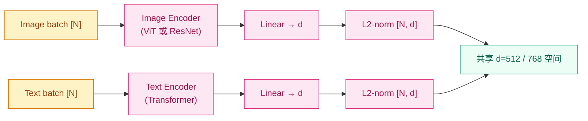
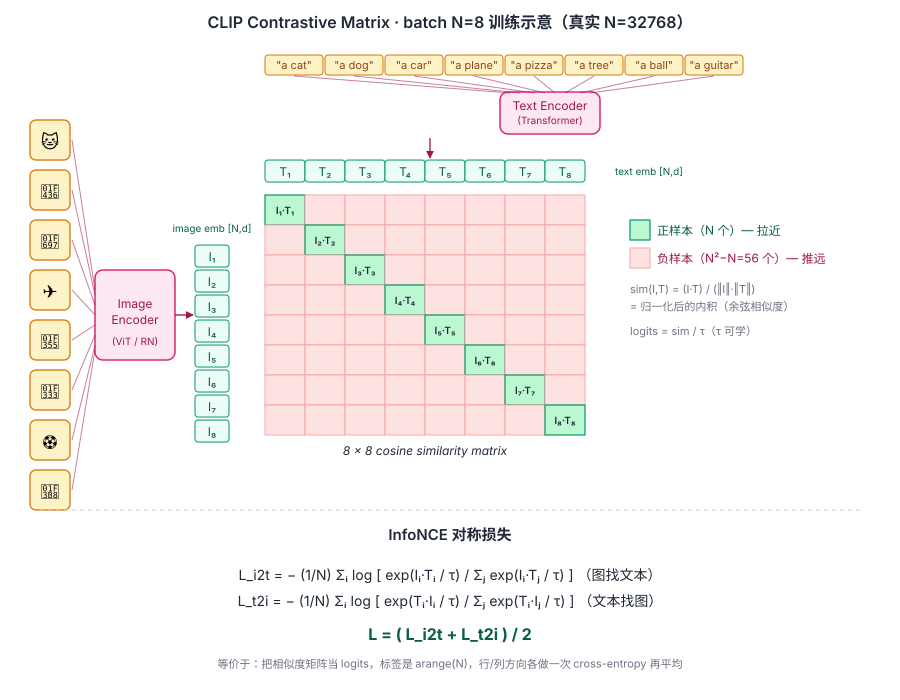
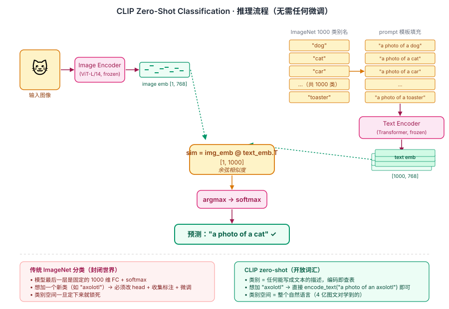

## 前作进展

到 2020 年底,计算机视觉的标准训练范式是:

- **预训练数据集** —— 用 ImageNet 1.3M 监督标注或 JFT-300M(Google 内部)预训练
- **训练目标** —— softmax cross-entropy 分类(预测 1000 / 21K 个固定类别之一)
- **下游任务** —— 用预训练 backbone + 任务 head + 任务数据微调

这套范式有几个根本性局限:

**1. 类别有限** —— ImageNet 1000 类、JFT 18K 类是天花板;现实里的"长尾"概念(罕见物种、特定品牌、抽象概念)模型完全不认识。要识别新概念必须收集新标注数据 + 重新微调

**2. 任务专用** —— ImageNet 预训练只学到"分类视角"的特征,做 detection / segmentation 要换 head 调结构,做检索 / 图文匹配几乎不工作

**3. 标注昂贵** —— ImageNet 1.3M 图像耗费几年人力 + 几十万美元;扩展到更大规模成本不可持续

**4. 监督信号脆弱** —— "这是一只猫"作为监督只学到"猫"这个标签,完全丢失了"一只橙色的猫蹲在沙发上"这种细致信息

OpenAI 团队 2021 年 1 月发表 *Learning Transferable Visual Models From Natural Language Supervision*(CLIP)给出了完全不同的方案——**完全跳过人工标注,直接用互联网上的"自然图文对"作为监督**:

1. 收集 **4 亿对图文**(WebImageText, WIT)—— 网页 alt-text、商品图说明、维基百科 caption
2. 用**对比学习**让图像编码器和文本编码器在同一向量空间对齐
3. zero-shot 分类:把类别名变成 prompt(`"a photo of a {label}"`),选相似度最高的

结果令人震惊:**CLIP 在 30+ 视觉分类 benchmark 上 zero-shot 性能匹配或超过 ImageNet 监督训练的 ResNet-50**。在 ImageNet 上 zero-shot 76.2%,比 ResNet-50 监督训练的 76.1% 还高。这意味着——**模型完全没在 ImageNet 数据集上训过,直接用文本 prompt 分类,效果就和专门为 ImageNet 训的模型一样好**。

更深远的影响是,CLIP 把"视觉表征"和"语言"绑在一起,这一对齐成为后续所有多模态系统(Stable Diffusion 的 text encoder、DALL-E 2 的 prior、LLaVA 的视觉特征提取器)的基础。今天 GPT-4V / Claude 3 视觉能力的源头,几乎都可以追溯到 CLIP 这一对齐思想。

## 核心思想

### 直觉:用"图文对"代替"图像-类别标签"

要理解 CLIP 真正需要先抓一件事:**为什么 2020 年之前的 CV 是封闭世界的 1000 类?因为监督信号是离散标签**。ImageNet 的每张图必须挂在 1000 个 ID 之一上,JFT-300M 也只是把这个数字推到 18K——本质都是"从一个有限集合里选一个"。这就强制了三件事:类别要预先定义、必须有人工标注、模型最后一层永远是 `vocab_size` 维 FC + softmax。要加一个新类(比如 "axolotl"),意味着 head 改维度 + 收集标注 + 重新微调,流程整套重来。

CLIP 反过来问:**互联网上已经躺着 4 亿对 `<图,文本描述>`,文本天然是开放词汇 + 自带细粒度信息("一只橙色的猫蹲在沙发上" vs 简单标签 "cat"),为什么不直接用它做监督?** 一旦把监督信号从"标签 ID"换成"自由形式的文本",视觉模型学到的就不再是"哪个 ID 该激活",而是"这张图的语义在文本空间里大概落在哪"——训完就能 zero-shot 到任何能用语言描述的类别。

这个心智模型一换,后面所有 CLIP 的工程细节都顺理成章——双塔结构是把图像和文本都映射到同一空间的最简实现、对比学习是"图文对要近、不配对要远"的最自然损失、文本 prompt 推理是把"分类"重新定义成"哪个文本描述跟这张图最像"。三件事都是从这个直觉演绎出来的。

### 机制一:Dual Encoder — 图像 / 文本各一个 encoder,投影到同一空间

CLIP 的架构是**双塔结构**——图像和文本各有独立编码器,在最后一层投影到同一维度的向量空间:



*图 1:CLIP 双塔——图像走 ViT/ResNet,文本走 Transformer,各自最后一层接 linear 投影到 d 维并做 L2 归一化,落到同一个单位球面上。*

**Image Encoder** —— 标准视觉骨干:CLIP 论文里测了 ResNet-50/101 + 几种 [ViT](../08-vit/01-vit.md)(ViT-B/32, B/16, L/14)。最终 production 模型(OpenAI 开源的 CLIP-ViT-L/14)用 ViT。取最后一层的 `[CLS]` token(或 ResNet 的 GAP 输出)作图像表征。

**Text Encoder** —— 12 层 [Transformer](../05-transformer/01-transformer.md) encoder(63M 参数),token 序列经过 attention + 取 `[EOS]` 位置的最终 hidden state 作为文本表征。注意——文本端不用预训练 BERT,而是 CLIP 训练时从零学。

**对齐头 + L2 归一化** —— 两个编码器各接一个 linear,投影到 `d=512` 维(ResNet)或 `d=768` 维(ViT-L)的共享空间。然后**两端都做 L2 归一化**——把所有向量放到单位球面上,后续相似度计算等价于余弦相似度(因为归一化后内积 = `cos(θ)`)。这一步看似不起眼,但缺了它训练就崩——L2 归一化是 InfoNCE 训稳的前提。

### 机制二:Contrastive Loss — N×N 矩阵里"对角线对,其它对错"

有了同一空间里的两组向量,怎么让"配对的图文"靠近、"不配对的图文"分开?CLIP 用 **InfoNCE 对比损失**——在一个 batch 内同时利用所有正负样本。

给定 batch 内 N 对真实图文 `(I_i, T_i)`,做一次 N×N 相似度矩阵 `S_{ij} = I_i · T_j`:

- **对角线 N 个格子** —— 是真实配对的图文,应该相似度高(正样本)
- **其它 N²−N 个格子** —— 都是"图 i 配文本 j(j≠i)",来自 batch 内随机配对,应该相似度低(负样本)

损失对称地从两个方向各做一次 cross-entropy:

$$
\mathcal{L}_{\text{i2t}} = -\frac{1}{N}\sum_i \log \frac{\exp(\text{sim}(I_i, T_i) / \tau)}{\sum_j \exp(\text{sim}(I_i, T_j) / \tau)}
$$

$$
\mathcal{L}_{\text{t2i}} = -\frac{1}{N}\sum_i \log \frac{\exp(\text{sim}(T_i, I_i) / \tau)}{\sum_j \exp(\text{sim}(T_i, I_j) / \tau)}
$$

$$
\mathcal{L}_{\text{CLIP}} = \frac{1}{2}(\mathcal{L}_{\text{i2t}} + \mathcal{L}_{\text{t2i}})
$$

`sim(I, T)` 是归一化后的内积(等价余弦相似度),`τ` 是 temperature(可学的,初始 0.07)。两个方向对称的物理含义——**图像找正确文本 + 文本找正确图像两个任务一起优化**,任何一个方向单独训都不够稳。

**Batch 越大效果越好** —— 负样本数 = N - 1,batch 32 时每个正样本只对抗 31 个噪声,batch 32768 时对抗 32767 个。CLIP 用 batch 32768 不是炫技,而是对比信号强度的本质需求。但单 GPU 装不下 32K 样本前向 + 反向,必须做多机分布式 + careful all-gather 把每张 GPU 的 embedding 汇总成完整矩阵——这是 CLIP 训练的核心工程难点。


*图 2:batch N=8 的 contrastive 矩阵示意(真实 N=32768)。8 张图过 image encoder 得到 `I₁..I₈`,8 条文本过 text encoder 得到 `T₁..T₈`,做 8×8 cosine 相似度矩阵。**对角线 8 个绿格是正样本要拉近**,其余 56 个浅红格是负样本要推远。底部 `L = (L_i2t + L_t2i) / 2` 等价于"把矩阵当 logits、标签 = arange(N)、行/列各做一次 cross-entropy 再平均"。*

### 机制三:Zero-Shot Classifier — 把"类别"变成"a photo of a {class}"

训练完得到一对编码器后,怎么做分类?CLIP 给的方案在 2021 年看几乎是反常识的——**完全不微调,把类别名变成 prompt,推理时把分类问题重定义成"哪个文本描述跟这张图最像"**。

具体流程(以 ImageNet 1000 类为例):

1. **把每个类别造一个 prompt** —— 1000 个类别 → `["a photo of a dog", "a photo of a cat", ..., "a photo of a toaster"]`
2. **离线算一次 text embedding** —— text encoder 把 1000 个 prompt 编成 `[1000, d]` 的矩阵,做一次就缓存,后面所有图共用
3. **来一张图算 image embedding** —— image encoder → `[1, d]`,L2 归一化
4. **相似度 → argmax** —— `logits = image_emb @ text_emb.T` 得到 `[1, 1000]`,argmax 即预测类别

```python
classes = ["dog", "cat", "bird", "car"]
prompts = [f"a photo of a {c}" for c in classes]

text_embs = clip.encode_text(prompts)                            # [4, d]
text_embs = text_embs / text_embs.norm(dim=-1, keepdim=True)

image_emb = clip.encode_image(image)                             # [1, d]
image_emb = image_emb / image_emb.norm(dim=-1, keepdim=True)

logits = (image_emb @ text_embs.T) * 100                         # 100 是 temperature 倒数
predicted = classes[logits.softmax(dim=-1).argmax()]
```

这一接口的革命性在于:

- **不需要任何训练数据** —— 给类别名就行,模型从来没在这个数据集上训过
- **类别空间 = 整个自然语言** —— `"a photo of a dog"` / `"a sketch of a dog"` / `"a cartoon dog"` / `"an axolotl"` 都能区分,不再受 1000 类天花板限制
- **Prompt 工程影响大** —— `"a photo of a {label}"` 比单独 `"{label}"` 通常好 1-3 分;CLIP 论文还提供了 80 个 prompt template ensemble 的最佳实践
- **传统分类的 head 不存在了** —— 没有 1000 维 FC、没有 softmax 投影矩阵,只有"两个 encoder + 一个文本提示库"


*图 3:左路图像走 image encoder 得 `[1,768]` embedding;右路 1000 个类别名各自包成 `"a photo of a {class}"` prompt,过 text encoder 得 `[1000,768]` embedding 矩阵;中间一次矩阵乘 + argmax 得到预测类别。**底部 callout 对比**——传统 ImageNet 分类的 head 是固定 1000 维 FC、加类必须改结构;CLIP 把类别空间换成"任何能写成文本的描述",加类只需 `encode_text("a photo of an axolotl")`。*

这一 zero-shot 范式被 CLIP 之后所有视觉理解系统沿用——OWL-ViT(zero-shot detection)、SAM(zero-shot segmentation)、LSeg(zero-shot semantic segmentation)都是 CLIP 思想的扩展。

### 三件套协同:大规模图文对 + 对比学习 + 文本 prompt 推理 缺一不可

CLIP 在 2021 年能 work,不是单一改进,而是**三件套同时调到协同点**——这一点和 [ResNet](../01-cnn/05-resnet.md) 里 `shortcut + BN + He 初始化` 的关系几乎一模一样,任何一件单拿出来都不够:

- **只有 dual encoder + 对比学习,没有大规模图文对** —— 早在 2017-2019 已有不少"图文对齐"工作(VisualBERT、CLIP 之前的 ConVIRT 等),都因为只有几十万对人工 caption 数据效果有限。CLIP 把数据量推到 **400M 对**才让"对齐"真正学到通用视觉概念,而不只是 caption 数据集的偏置。这一规模差是 CLIP zero-shot 鲁棒性远胜小规模对齐工作的根因
- **只有大规模图文对 + 对比学习,没有文本 prompt 推理接口** —— 训完得到一对 encoder 但只能用来算图文相似度做检索,无法替代分类器;视觉社区很难感知到"这是新范式"。`"a photo of a {class}"` 这一 prompt 化把 CLIP 从"图文检索模型"重定义成"通用 zero-shot 分类器",才让它在 27 个 benchmark 上和监督 ResNet 直接对比
- **只有大规模数据 + prompt 接口,没有对比学习 (改用 caption 生成)** —— OpenAI 论文 Figure 2 实测过:同样规模 + 同样模型,用 caption 生成式预训练(预测下一个 token)的 zero-shot 效率比对比学习**慢 4 倍**(达到同样精度需要 4× 算力)。对比学习把"区分图文对"这件事压成 N²-N 个二元判别,信号密度远高于"逐 token 重建文本"

三者合起来才让"用自然语言监督视觉"这一 2013 年就被 DeViSE 等工作提过的想法,在 2021 年第一次跑到"zero-shot 匹配监督 ResNet-50"的水平。这也是为什么 2013-2020 年之间多次有人摸到边但没做大——他们各自只调好了三件套里的一两件。

## 性能数据

CLIP 在 27 个公开 zero-shot 分类 benchmark 上的表现(论文 Figure 5):

| Benchmark | ResNet-50 监督 | CLIP-ViT-L/14 zero-shot |
|------|------|------|
| ImageNet | 76.1 | **76.2** |
| ImageNetV2 | 64.3 | **70.1** |
| ImageNet-Sketch | 24.1 | **60.2** |
| ImageNet-R(ndition) | 36.1 | **88.9** |
| ImageNet-A(dversarial) | 2.7 | **77.2** |
| Stanford Cars | 65.9 | **77.3** |
| Food101 | 86.4 | **92.9** |
| Country211 | 9.5 | **31.5** |

观察:

- **ImageNet 持平**——zero-shot CLIP 直接匹配监督训练 ResNet-50
- **分布外(ImageNetV2/Sketch/R/A)显著胜出** —— CLIP 学到的是真正的"视觉概念",不是 ImageNet 的特定分布;在风格变化的图像上鲁棒得多
- **细粒度任务(Cars/Food/Country)大胜** —— 因为这些类别(汽车型号、菜名、国家)在监督数据集里几乎没有但在 web 文本里频繁出现

ImageNet-A(adversarial 版本,故意收集模型容易错的图)上 ResNet-50 只有 2.7%,CLIP zero-shot 77.2%——**鲁棒性差 28×**。这是 CLIP 论文最震撼的结果之一,证明了"基于自然语言的视觉表征"在分布外远胜传统监督学习。

## 训练细节

| 维度 | CLIP ViT-L/14 |
|------|------|
| Image encoder | ViT-L/14,304M 参数 |
| Text encoder | 12 层 Transformer,63M 参数 |
| Embedding 维度 | 768 |
| 总参数 | ~430M |
| 训练数据 | WIT (WebImageText), 400M 对 |
| Batch size | **32768**(关键:大 batch 提供更多负样本) |
| 优化器 | AdamW,β1=0.9, β2=0.98 |
| Learning rate | 5e-4(cosine schedule, 2K warmup) |
| Temperature | 可学,clipped 到 ≤100 |
| 训练 epoch | 32(对 400M 数据 = 12.8B 样本) |
| 训练硬件 | **256 × V100**(ViT-L)或 **512 × V100**(ResNet-50x64) |
| 训练时间 | ~12 天(ViT-L) |
| 训练成本 | 估计 ~$1M |

注意几个工程要点:

- **超大 batch 32768** —— 远超 ImageNet 训练的 256-1024;需要 256 GPU 同步 + careful all-gather + gradient checkpointing
- **数据未公开** —— WIT 是 OpenAI 内部数据集,完整列表从未发布。社区复现(LAION-400M, LAION-2B, DataComp)用类似方法收集替代
- **训练完全从零** —— 没有用 ImageNet 预训练初始化,纯靠对比学习从图文对学到视觉表征

## 关键代码

CLIP 的核心实现(基于 OpenAI 开源版简化):

```python
import torch
import torch.nn as nn
import torch.nn.functional as F

class CLIP(nn.Module):
    def __init__(self, image_encoder, text_encoder, embed_dim=512):
        super().__init__()
        self.image_encoder = image_encoder        # ViT or ResNet
        self.text_encoder = text_encoder          # Transformer
        # 各自的对齐投影层
        self.image_projection = nn.Linear(image_encoder.output_dim, embed_dim, bias=False)
        self.text_projection = nn.Linear(text_encoder.output_dim, embed_dim, bias=False)
        # 可学的 temperature(logit_scale = ln(1/τ))
        self.logit_scale = nn.Parameter(torch.tensor(2.6593))  # 初始 e^2.66 ≈ 14.3,对应 τ=0.07

    def encode_image(self, images):
        features = self.image_encoder(images)             # [B, image_dim]
        features = self.image_projection(features)
        return features / features.norm(dim=-1, keepdim=True)  # L2 归一化

    def encode_text(self, tokens):
        features = self.text_encoder(tokens)              # [B, text_dim](取 [EOS] 位置)
        features = self.text_projection(features)
        return features / features.norm(dim=-1, keepdim=True)

    def forward(self, images, text_tokens):
        image_features = self.encode_image(images)        # [B, d] 归一化
        text_features = self.encode_text(text_tokens)     # [B, d] 归一化
        # 计算相似度矩阵(归一化后内积 = 余弦相似度)
        logit_scale = self.logit_scale.exp().clamp(max=100)  # τ 上限防止崩
        logits_per_image = logit_scale * image_features @ text_features.T  # [B, B]
        logits_per_text = logits_per_image.T  # [B, B]
        # InfoNCE 对称损失
        labels = torch.arange(len(images), device=images.device)  # 对角线是正样本
        loss_i2t = F.cross_entropy(logits_per_image, labels)
        loss_t2i = F.cross_entropy(logits_per_text, labels)
        return (loss_i2t + loss_t2i) / 2
```

工程要点:

- **`logit_scale.exp().clamp(max=100)`** —— temperature 的 exp + clamp 是 CLIP 工程的经典 trick;防止训练后期 temperature 学崩
- **`F.cross_entropy(logits, arange(N))`** —— InfoNCE 损失的等价形式;标签就是对角线索引
- **超大 batch 的分布式** —— 真实训练里要做 all_gather 把所有 GPU 的 image / text features 汇总,batch 才能真正到 32K(单 GPU 装不下)

## 影响 / 后续

CLIP 在 AI 历史的位置:**让"语言"成为视觉的通用接口**。具体影响:

**1. Zero-shot 视觉的范式革命** —— 视觉任务不再需要"为每个类别收集标注 + 训分类器";直接用文本 prompt 描述就行。这一范式被推广到 OWL-ViT(检测)、SAM(分割)、SAM 2(视频)、LSeg 等所有视觉理解任务

**2. 文生图的基础** —— Stable Diffusion v1/v2 用 CLIP text encoder 作为文本理解模块;DALL-E 2 把 CLIP 作为图像 prior;[Imagen](../10-diffusion/03-imagen.md) 是后来用 T5-XXL 替换 CLIP,但仍在 ImageNet 上以 CLIP score 评估

**3. 多模态助手的基础** —— [LLaVA](04-llava.md) / Qwen-VL / MiniGPT-4 等开源 VLM 几乎都用 CLIP ViT 提取视觉特征,通过 projection 接到 LLM。这一"CLIP visual + LLM"架构是开源 VLM 的事实标准

**4. 大规模图文数据集生态** —— OpenAI 不公开 WIT 让社区行动,LAION-400M / LAION-2B / LAION-5B / DataComp 等开源数据集相继发布,催生了 OpenCLIP / EVA-CLIP 等开源 CLIP 复现

**5. 视觉表征的通用基座** —— CLIP-ViT-L 成为视觉任务的"通用 backbone",在 detection / segmentation / OCR / video understanding 等下游任务上都比 ImageNet 预训练强。SAM、DINO 等纯视觉自监督模型在某些任务上甚至需要 CLIP 提供文本对齐能力

**6. 评估视觉生成的标准指标** —— CLIP score(生成图像 vs prompt 的 CLIP 相似度)成为评估文生图模型的标准指标,几乎所有文生图论文都会汇报

CLIP 留下的几个开放方向:

- **只能匹配不能生成** → [BLIP](02-blip.md) 把生成能力加到 CLIP 上
- **大规模数据需求** → SigLIP(2023)用 sigmoid loss 替代 InfoNCE,效果更好且 batch 不用那么大
- **视觉编码器仍较小** → EVA-CLIP / DFN-5B / SigLIP-SO400M 把 CLIP 推到 10B+ 参数
- **不能做对话 / 推理** → [Flamingo](03-flamingo.md) / [LLaVA](04-llava.md) 把 CLIP 接到 LLM 上

→ [02-blip.md](02-blip.md) · 加入生成能力,对比 + 生成 + 匹配三任务联合
→ [03-flamingo.md](03-flamingo.md) · 冻结 LLM + 视觉适配,少样本视觉学习范式
→ [04-llava.md](04-llava.md) · CLIP visual + LLaMA + instruction tuning,开源 VLM 标准
→ [../08-vit/01-vit.md](../08-vit/01-vit.md) · CLIP 的图像编码器
→ [../10-diffusion/02-ldm.md](../10-diffusion/02-ldm.md) · Stable Diffusion 用 CLIP text encoder
→ [../06-bert-family/01-bert.md](../06-bert-family/01-bert.md) · 文本编码器思想前作
