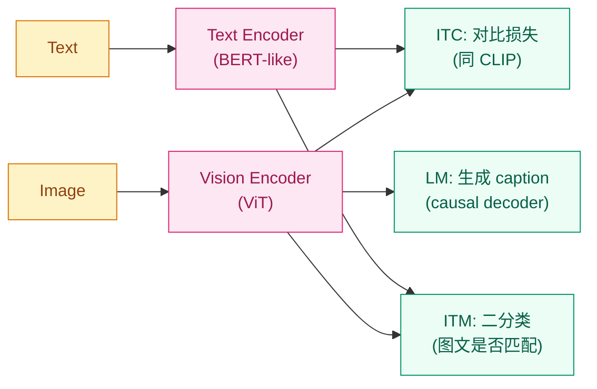
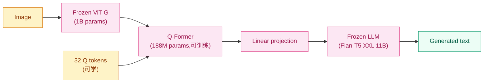

## 前作进展

[CLIP](01-clip.md) 解决了"图像和文本对齐"这件事,但它的本质是**判别式**的——只能做匹配(图文相似度),不能做生成(给图写 caption / 答 VQA)。这造成几个明显短板:

**1. 不能做 caption / VQA / 视觉对话** —— CLIP 不会输出文本,任何"生成式"任务都做不了

**2. 数据噪声问题** —— CLIP 用的网络图文对里有大量 noisy caption(网页 alt-text 经常和图不匹配),CLIP 对比学习对噪声不敏感但生成式任务对噪声很敏感

**3. 训练数据的隐式假设** —— CLIP 假设图文是"对齐"的,但实际网页数据里很多 caption 是"weakly related"(图是猫但 caption 是"我家的小可爱叫 Whiskers"),严格的匹配假设会被打破

Salesforce 团队 2022 年 1 月发表 *BLIP: Bootstrapping Language-Image Pre-training*,给出三件事的解法:

**1. 多任务联合预训练** —— 同一模型同时学三个任务:**Image-Text Contrastive(ITC,同 CLIP)**、**Image-Text Matching(ITM,二分类)**、**Image-Conditioned Language Modeling(LM,生成 caption)**

**2. CapFilt 数据 bootstrap** —— 用模型自身生成 caption(captioner)+ 自身过滤噪声样本(filter),让原始 noisy 数据变成 cleaner synthetic 数据

**3. 共享 vision encoder + 不同 text 模块** —— 一个 ViT 提取视觉特征,三个不同 task-specific text 解码器/编码器,共享底层提升效率

BLIP 在 COCO captioning / VQA / 检索任务上同时拿 SOTA,证明"对齐 + 生成 + 匹配三任务联合"可以一个模型做完。

2023 年 BLIP-2(同一团队)给出更激进的方案——**完全冻结视觉编码器和 LLM,只训练中间一个轻量级 Q-Former 模块来桥接**。这一思路把 VLM 训练成本降一个数量级,同时质量持续提升,催生了后续 InstructBLIP / Mini-GPT4 / LLaVA 等开源 VLM 浪潮。

## BLIP:三任务联合预训练

BLIP 的架构是**多任务共享 encoder + 三个 task-specific decoder**:



*图 1:BLIP 三任务联合 — 共享 vision encoder + text encoder,各自加 task head 算三个损失。三任务互补,生成能力让模型对长 caption 也敏感。*

**三任务损失**:

**ITC(Image-Text Contrastive)** —— 同 CLIP 的对称 InfoNCE。在 batch 内做对比学习,让正样本图文相似度高、负样本低

**ITM(Image-Text Matching)** —— 给定一对图文,二分类判断"是否匹配"。**关键:用 hard negative mining**——从 ITC 算的相似度矩阵里选"最像但不是正样本"的负例(让 ITM 学到的判别更细)

**LM(Language Modeling)** —— 给定图像作 condition,用 causal decoder 生成对应的 caption。这是 GPT-style 自回归损失:`-log p(token_t | tokens_{<t}, image)`

三任务加权 sum 作为总损失。BLIP 的工程细节是**三个任务的 text 模块部分共享**——ITC 用 unimodal text encoder(双向 attention),ITM 用 image-grounded text encoder(在 BERT-style 模型中插入 cross-attention),LM 用 image-grounded causal text decoder(causal mask + cross-attention)。三个共享 self-attention 但 cross-attention 层是任务专用。

## CapFilt:数据自举

BLIP 的另一个亮点是**用模型自己清理数据**。原始网络图文对很 noisy,直接训练效果有限。CapFilt(Captioner + Filter)流程:

1. **训练一个 captioner**(用 BLIP 的 LM head)—— 输入图像生成 synthetic caption
2. **训练一个 filter**(用 BLIP 的 ITM head)—— 判断 (image, caption) 是否真匹配
3. **数据扩增** —— 对原始数据 `(I, T_web)`:
   - filter 留下 `T_web` 是真匹配的 → 保留
   - filter 标记 `T_web` 不匹配的 → captioner 生成新 caption `T_syn`,用 filter 检查 `T_syn` 是否真匹配 → 留下匹配的
4. **用扩增后的数据重新训练 BLIP**

CapFilt 让 BLIP 训练数据从 14M 增加到 130M(扩增 9.3×),质量更高。COCO captioning CIDEr 从 117.5 提升到 133.3(+15.8 分),VQA 从 75.3 提升到 78.3(+3.0)——**数据 bootstrap 的价值有时比加模型大小还大**。这一观察后来被 GPT-4 / Phi-3 / SD3 等多个工作沿用——**synthetic data + 自动过滤**成为现代大模型训练的标配。

## BLIP-2:冻结大模型 + 轻量适配

BLIP-2(2023 年 1 月)是更激进的方案——**完全冻结视觉编码器和 LLM**,只训练中间一个 **Q-Former** 模块作为桥梁:

```
[冻结 ViT-G/14 (1B)] → 视觉特征 [N, d_vision]
                              ↓
[Q-Former 轻量模块 (188M,可训练)] → 用 Q tokens 学到"图像里的语言相关信息"
                                          ↓
                              [Q tokens, d_lm]
                                          ↓
[冻结 LLM (Flan-T5 XXL 11B 或 OPT 6.7B)] → 生成文本
```

**为什么 Q-Former?** 视觉特征(几百个 patch 向量)直接喂给 LLM 是浪费的——LLM 不需要每个 patch 都看,只需要"图像里的关键信息"。Q-Former 是一个 12 层 Transformer,有 32 个可学习的 **Query tokens**:

- 这些 Q tokens 通过 cross-attention "查询" 视觉特征,提炼出 32 个"图像-语言对齐"的向量
- 32 个向量再通过 linear projection 喂给 LLM
- 整个过程视觉编码器和 LLM 都不动,只训练 Q-Former + projection 层

Q-Former 训练分两阶段:

**Stage 1: 视觉-语言表征学习** —— 类似 BLIP 的三任务(ITC + ITM + ITG),让 Q tokens 学到"对齐的语言相关特征"

**Stage 2: 视觉-语言生成预训练** —— 接到 LLM 上,只训练"图像 → Q tokens → LLM 生成"这条路径



*图 2:BLIP-2 架构 — 12B 总参数里只有 188M Q-Former 可训练(1.5%),视觉和 LLM 都冻结;Q tokens 是 32 个可学习的查询向量。*

BLIP-2 的关键效率数字:

- **可训练参数 188M**(对比从零训 VLM 的几个 B)
- **训练算力 6 GPU 天**(对比 Flamingo 的几千 GPU 天)
- **VQA / COCO / NoCaps 全 SOTA**——和 Flamingo 70B 同水平,但参数小 6×

Q-Former 思想后来被推广到很多 VLM:**LLaVA** 用更简单的 linear projection 替代 Q-Former,**MiniGPT-4** 直接用单层 linear,但本质都是"冻结大模型 + 轻量桥接"。BLIP-2 定义了这一范式。

## 性能数据

BLIP-2(2023)在主流 VLM benchmark 上的成绩:

| 任务 | Flamingo-80B(2022) | BLIP-2(Flan-T5 XXL) | 改进 |
|------|------|------|------|
| VQA v2(zero-shot) | 56.3 | **65.2** | +8.9 |
| NoCaps CIDEr | 99.0 | **121.0** | +22 |
| COCO CIDEr | 65.3(zero-shot) | **80.3** | +15 |
| OK-VQA | 50.6 | **45.9** | -4.7 |

BLIP-2 用 ~12B 总参数(其中 188M 可训练)达到 Flamingo 80B 的水平,**参数效率 6×**,训练成本数量级降低。

## 训练细节

| 维度 | BLIP-2(ViT-G + Flan-T5 XXL) |
|------|------|
| Vision encoder | EVA CLIP ViT-G/14, **1B 参数,冻结** |
| Q-Former | 12 层 Transformer, 768 维, 32 Q tokens, **188M 可训练** |
| LLM | Flan-T5 XXL, **11B 参数,冻结** |
| 总参数 | 12.1B,**可训练只有 1.5%** |
| 训练数据 | COCO + Visual Genome + CC3M + CC12M + SBU + LAION-400M ≈ 130M 对 |
| Stage 1 训练步 | 250K |
| Stage 2 训练步 | 80K |
| Batch | 2400 |
| 优化器 | AdamW |
| 训练硬件 | **16 × A100 × 9 天**(对比 Flamingo 1500 × TPU × ~10 天) |
| 训练成本 | ~$10K(对比 Flamingo 估计 $1M+) |

注意训练成本差 100×——BLIP-2 的"冻结大模型 + 轻量桥接"范式让 VLM 训练从"只有大公司能做"变成"任何实验室能做"。这一可达性直接催生了 2023 年开源 VLM 的爆发。

## 关键代码

BLIP-2 Q-Former 的核心实现:

```python
import torch
import torch.nn as nn

class QFormer(nn.Module):
    """轻量级 cross-attention 模块,桥接冻结视觉特征和冻结 LLM"""
    def __init__(self, num_query_tokens=32, hidden_size=768, num_layers=12,
                 num_heads=12, vision_dim=1408, llm_dim=4096):
        super().__init__()
        # 32 个可学习的 query tokens
        self.query_tokens = nn.Parameter(torch.zeros(1, num_query_tokens, hidden_size))
        nn.init.normal_(self.query_tokens, std=0.02)
        # 12 层 Transformer with cross-attention
        self.layers = nn.ModuleList([
            QFormerLayer(hidden_size, num_heads, vision_dim) for _ in range(num_layers)
        ])
        # 最后投影到 LLM 的维度
        self.projection = nn.Linear(hidden_size, llm_dim)

    def forward(self, vision_features):
        # vision_features: [B, N_patches, vision_dim](冻结 ViT 输出)
        B = vision_features.size(0)
        queries = self.query_tokens.expand(B, -1, -1)  # [B, 32, hidden_size]
        for layer in self.layers:
            queries = layer(queries, vision_features)  # cross-attention 到视觉
        return self.projection(queries)  # [B, 32, llm_dim] - 喂给 LLM

class QFormerLayer(nn.Module):
    def __init__(self, hidden_size, num_heads, vision_dim):
        super().__init__()
        self.self_attn = nn.MultiheadAttention(hidden_size, num_heads, batch_first=True)
        # Cross-attention 把 Q tokens 链接到 vision features(投影到同维度)
        self.vision_proj = nn.Linear(vision_dim, hidden_size, bias=False)
        self.cross_attn = nn.MultiheadAttention(hidden_size, num_heads, batch_first=True)
        self.mlp = nn.Sequential(
            nn.Linear(hidden_size, 4 * hidden_size),
            nn.GELU(),
            nn.Linear(4 * hidden_size, hidden_size),
        )
        self.ln1 = nn.LayerNorm(hidden_size)
        self.ln2 = nn.LayerNorm(hidden_size)
        self.ln3 = nn.LayerNorm(hidden_size)

    def forward(self, queries, vision):
        # Self-attention 内 Q tokens 互相交互
        q, _ = self.self_attn(self.ln1(queries), self.ln1(queries), self.ln1(queries))
        queries = queries + q
        # Cross-attention: Q tokens 查询 vision features
        v_proj = self.vision_proj(vision)
        q, _ = self.cross_attn(self.ln2(queries), v_proj, v_proj)
        queries = queries + q
        # FFN
        queries = queries + self.mlp(self.ln3(queries))
        return queries

# BLIP-2 完整 forward
class BLIP2(nn.Module):
    def __init__(self, frozen_vision_encoder, frozen_llm, q_former):
        super().__init__()
        self.vision = frozen_vision_encoder
        self.llm = frozen_llm
        self.q_former = q_former
        # 冻结视觉和 LLM
        for p in self.vision.parameters(): p.requires_grad = False
        for p in self.llm.parameters(): p.requires_grad = False

    def generate(self, image, prompt):
        with torch.no_grad():
            vision_features = self.vision(image)         # 冻结 forward
        # Q-Former 提取视觉信息
        q_tokens = self.q_former(vision_features)        # [B, 32, llm_dim] 可训练
        # 把 Q tokens 拼到 prompt embedding 前面,喂 LLM
        prompt_emb = self.llm.embed(prompt)              # [B, L, llm_dim]
        inputs_emb = torch.cat([q_tokens, prompt_emb], dim=1)  # [B, 32+L, llm_dim]
        return self.llm.generate(inputs_embeds=inputs_emb)
```

工程要点:

- **`requires_grad = False`** —— 视觉和 LLM 完全冻结,只更新 Q-Former + projection
- **`torch.cat([q_tokens, prompt_emb])`** —— Q tokens 作为"图像 prompt"前置到文本 prompt,让 LLM 看到"图像内容 + 文本指令"
- **32 个 Q tokens 是关键超参** —— 太少(< 8)信息不够,太多(>64)训练慢且 marginal gain;BLIP-2 实验显示 32 是甜点

## 影响 / 后续

BLIP / BLIP-2 在多模态历史的位置:**定义了"冻结大模型 + 轻量桥接"的开源 VLM 范式**。具体影响:

**1. CapFilt 推动 synthetic data 时代** —— "用模型生成 + 过滤训练数据"在 BLIP 之后成为大模型工程标配;GPT-4 / Phi-3 / SD3 / Llama 3 都重度使用 synthetic data

**2. Q-Former 启发后续 VLM 设计** —— LLaVA(linear projection)、MiniGPT-4(单层 linear)、Qwen-VL(cross-attention + 2 层 MLP)等都是 Q-Former 思想的简化变体

**3. "冻结大模型 + 轻量适配"成为新范式** —— 这一思路不只在 VLM,在 [LoRA / PEFT](../11-peft-lora/)、Adapter、prompt tuning 等参数高效微调里也是核心;Q-Former 本质是"为视觉模态学一个 adapter"

**4. 开源 VLM 爆发的起点** —— BLIP-2 的低训练成本让任何实验室都能做 VLM 实验,2023 年涌现 LLaVA / MiniGPT-4 / InstructBLIP / Qwen-VL / VisualGLM 等几十个开源 VLM

**5. 推动 VLM 评估标准** —— BLIP-2 论文提出的 zero-shot 评估方法(VQA / Captioning / NoCaps)成为后续 VLM 的标准评估套件

BLIP-2 留下的几个方向被后续节点承接:

- **缺少对话/指令跟随能力** —— BLIP-2 只能做 captioning / 简单 VQA,不能做开放对话 → [LLaVA](04-llava.md) 加 visual instruction tuning
- **少样本能力弱** —— 没有 Flamingo 的 in-context learning → [Flamingo](03-flamingo.md) 的方案
- **Q-Former 仍然复杂** —— LLaVA 等用更简单的 linear projection 也能 work

→ [03-flamingo.md](03-flamingo.md) · 冻结 LLM 路线的另一条,通过 cross-attention 注入,有 few-shot 能力
→ [04-llava.md](04-llava.md) · 简化 Q-Former 到单 linear + 加 visual instruction tuning,开源 VLM 标准
→ [01-clip.md](01-clip.md) · 父方法,BLIP 在 CLIP 基础上加生成
→ [../07-gpt-scaling/05-gpt4-llama.md](../07-gpt-scaling/05-gpt4-llama.md) · BLIP-2 用 Flan-T5 / OPT 作 LLM backbone
→ [../11-peft-lora/](../11-peft-lora/) · Q-Former 思想和 PEFT 一脉相承
