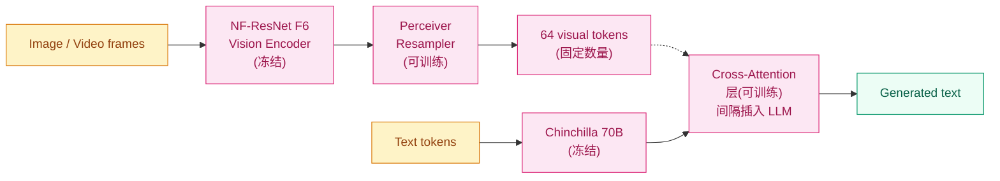

## 前作进展

到 2022 年中,VLM 训练有两条主流路线但都有明显缺陷:

**1. 从零联合训练**(ViLBERT / Unified-IO / Florence)—— 视觉和语言模块同时训练,计算成本极高;且 LLM 部分不能从顶级语言模型(GPT-3)起步(因为这些模型不开源/不能从零训)

**2. 双塔对比(CLIP)**—— 只能匹配不能生成 / 对话 / 推理

社区急需一条路线:**充分利用现有的顶级大 LLM(zero-shot 能力强、in-context learning 涌现)+ 加上视觉理解**。DeepMind 团队 2022 年 4 月发表 *Flamingo: a Visual Language Model for Few-Shot Learning* 给出答案——**冻结一个 70B Chinchilla LLM + 加上轻量视觉适配模块**,让模型同时拥有 LLM 的语言能力和视觉理解能力。

关键创新:**Flamingo 直接继承了 LLM 的 in-context learning 能力**。给 4-8 个 (图, 文本) few-shot 例子作为 prompt,Flamingo 就能 zero-shot 完成新视觉任务——这种 "show, don't tell" 的能力是之前所有 VLM 都不具备的。

Flamingo 在 16 个视觉理解 benchmark 上 4-shot in-context 达到 SOTA,在 6 个 benchmark 上甚至超过当时最强的 fine-tuned 模型。这是 VLM 第一次展现"通用智能"的雏形——一个模型不微调就能做任何视觉任务。

Flamingo 没开源,但它定义的 "冻结 LLM + 视觉适配 + cross-attention 注入" 架构直接影响了 IDEFICS(2023, HuggingFace 开源复现 Flamingo)、Otter、Qwen-VL 等后续模型。

## 核心思想:冻结 LLM + 视觉适配 + 间隔 Cross-Attention

Flamingo 的架构由三部分组成:



*图 1:Flamingo 架构 — 冻结视觉编码器 + 冻结 70B LLM,中间加 Perceiver Resampler 把视觉特征统一成 64 个 tokens,通过间隔插入的 cross-attention 注入 LLM。可训练参数只占 10%。*

**Stage 1: Vision Encoder(冻结)** —— NF-ResNet F6,一个 435M 参数的 ResNet 变体(DeepMind 自己的视觉模型)。从图像或视频帧中提取 patch features。

**Stage 2: Perceiver Resampler(可训练,200M)** —— **关键创新**。视觉编码器输出的 patch features 数量随图像分辨率变化(64×64 patches 还是 16×16?),且对视频是 frames × patches 的二维。Perceiver Resampler 用一组**固定数量的可学习 query tokens(64 个)**来"采样"任意大小的视觉特征:

- Query 是 64 个可学习 token
- Key 和 Value 是视觉编码器的输出 patches(数量变化)
- 多层 cross-attention 让 64 个 queries 提炼出"图像里关键的语言相关信息"
- 输出统一是 [64, hidden_dim] —— 不管输入图像/视频多大,输出都是 64 个 tokens

这一思路和 [BLIP-2 的 Q-Former](02-blip.md) 几乎一样,只是 Flamingo 早 9 个月发布。两者并行独立发现"用 learned queries 桥接视觉和语言"的范式。

**Stage 3: 间隔 Cross-Attention(可训练,200M)** —— Flamingo 不把视觉 tokens 直接拼到 LLM 输入,而是**在 LLM 内部每隔 N 层插入一个新的 cross-attention 层**,让 LLM 的 hidden state 可以 attend 到 64 个视觉 tokens:

```
LLM original block:
    self-attention → FFN
    
Flamingo block(在 LLM 内部交错插入):
    self-attention → FFN              ← 冻结
    gated cross-attention → FFN        ← 新加,只这层可训练
```

**Gated cross-attention** 的"gated"是关键——在残差连接里加一个可学习的 `tanh(α)` 门控,初始化为 0,**让训练初期 cross-attention 是 identity(不影响 LLM 原本能力)**,逐步开启视觉影响。这一设计避免了"加视觉模块导致 LLM 语言能力退化"的常见问题。

## In-Context Learning 能力

Flamingo 真正的差异化能力是**多模态 in-context learning**:

```
Example 1: [image of dog] -> "A photo of a dog."
Example 2: [image of cat] -> "A photo of a cat."
Example 3: [image of bird] -> "A photo of a bird."
Query:     [image of fish] -> ?
```

Flamingo 给出 "A photo of a fish." —— **完全没在这种任务上训过,但学到了 prompt 里的"看图生成 caption"格式**。

为什么 Flamingo 能 in-context learning,BLIP-2 不能?核心区别:

- **Flamingo backbone 是 Chinchilla 70B** —— 这是当时 SOTA LLM,in-context learning 能力强
- **BLIP-2 backbone 是 Flan-T5 / OPT** —— 都不到 11B,in-context learning 弱
- **Flamingo 训练数据混合了交错 image-text 序列** —— 论文用 MultiModal MassiveWeb(M3W, 43M 网页),每个网页是 "text image text image text..." 的交错序列。LLM 在这种数据上自然学到"看到图后预测对应文本"的模式

具体 in-context 能力(论文 Table 1):

| 任务 | 0-shot | 4-shot | 32-shot |
|------|------|------|------|
| VQAv2 | 49.2 | 56.3 | **60.0** |
| OK-VQA | 41.2 | 47.4 | **50.6** |
| TextVQA | 30.1 | 32.7 | **36.0** |
| NoCaps CIDEr | 92.7 | 99.0 | — |

从 0-shot 到 32-shot 提升 5-11 分,**clear in-context learning 信号**。在 6 个 benchmark 上 4-shot 甚至超过 fine-tuned SOTA,证明 Flamingo 实现了 "通用视觉智能" 的雏形。

## 训练数据:交错图文序列

Flamingo 的训练数据是它能 in-context learning 的物理基础:

| 数据集 | 描述 | 规模 |
|------|------|------|
| **M3W**(MultiModal MassiveWeb) | 交错 image-text 网页序列 | 43M 网页, 185M 图像 |
| **ALIGN**(Google) | 短 caption 图文对 | 1.8B 对 |
| **LTIP**(Long Text-Image Pairs) | 长 caption 图文对 | 312M 对 |
| **VTP**(Video-Text Pairs) | 短视频 + caption | 27M 对 |

**M3W 是关键** —— 普通图文对训练教不出"看几个例子学新任务",但交错网页序列(`"我看到一只狗。 [狗图]。这是只很可爱的小柯基。这是另一张图 [柯基图]。"`)有天然的 few-shot 模式,LLM 自然学到。

ALIGN / LTIP / VTP 提供大量"短 / 长 caption"对,补充图像理解和视频时序能力。四个数据集按比例混合采样训练。

## 训练细节

| 维度 | Flamingo 80B |
|------|------|
| Vision encoder | NF-ResNet F6, 435M, **冻结** |
| Perceiver Resampler | 200M, **可训练** |
| LLM | Chinchilla 70B, **冻结** |
| Cross-attention 层 | 插入到 LLM 每 7 层一次, 总计 ~200M, **可训练** |
| 总参数 | 80B(其中 ~10B 可训练 ≈ 12.5%) |
| 训练数据 | 4 个数据集混合,~3000B token-equivalent |
| Batch size | 1024(主要算力 = LLM 的 forward) |
| 训练硬件 | ~1500 × TPU v4 |
| 训练时间 | ~15 天 |
| 训练成本 | 估计 $1M+ |

注意 Flamingo 训练成本仍然很高(虽然不微调 LLM,但 70B 的 forward 在 1500 TPU 上也很贵)。**BLIP-2 用 Q-Former 把训练成本降到 1/100**,但 Flamingo 因为 LLM 更大、保留了 in-context learning,质量上限更高。

## 关键代码

Flamingo 的核心是 **Perceiver Resampler + gated cross-attention** 两个新组件。这里展示 gated cross-attention 块:

```python
import torch
import torch.nn as nn

class GatedCrossAttention(nn.Module):
    """Flamingo 在 LLM 内部插入的 cross-attention 层
    - 让 LLM hidden state 可以 attend 到视觉 tokens
    - 用 gated 残差,初始 identity,逐步开启"""
    def __init__(self, dim, num_heads):
        super().__init__()
        self.norm1 = nn.LayerNorm(dim)
        self.cross_attn = nn.MultiheadAttention(dim, num_heads, batch_first=True)
        # 关键:gated 残差,初始 tanh(0) = 0,不影响原 LLM 行为
        self.attn_gate = nn.Parameter(torch.tensor(0.0))

        self.norm2 = nn.LayerNorm(dim)
        self.ffn = nn.Sequential(
            nn.Linear(dim, 4 * dim),
            nn.GELU(),
            nn.Linear(4 * dim, dim),
        )
        self.ffn_gate = nn.Parameter(torch.tensor(0.0))

    def forward(self, x, visual_tokens):
        # x: [B, T_text, dim] LLM hidden state
        # visual_tokens: [B, T_vis, dim] Perceiver Resampler 输出
        attn_out, _ = self.cross_attn(
            query=self.norm1(x),
            key=visual_tokens,
            value=visual_tokens,
        )
        # 关键:tanh(gate) 让训练初期是 identity
        x = x + torch.tanh(self.attn_gate) * attn_out
        # FFN 也 gated
        ffn_out = self.ffn(self.norm2(x))
        x = x + torch.tanh(self.ffn_gate) * ffn_out
        return x

class PerceiverResampler(nn.Module):
    """把任意大小的视觉特征统一压成 64 个 tokens"""
    def __init__(self, dim, num_latents=64, num_layers=6, num_heads=8):
        super().__init__()
        self.latents = nn.Parameter(torch.randn(num_latents, dim))  # 可学的 query
        self.layers = nn.ModuleList([
            nn.MultiheadAttention(dim, num_heads, batch_first=True)
            for _ in range(num_layers)
        ])

    def forward(self, visual_features):
        # visual_features: [B, N_patches, dim] - 可变大小
        B = visual_features.size(0)
        latents = self.latents.unsqueeze(0).expand(B, -1, -1)  # [B, 64, dim]
        for layer in self.layers:
            # cross-attention: latents 查询 visual_features
            attn_out, _ = layer(latents, visual_features, visual_features)
            latents = latents + attn_out
        return latents  # [B, 64, dim] 固定大小

# Flamingo 完整结构(简化)
class Flamingo(nn.Module):
    def __init__(self, frozen_vision, frozen_llm, perceiver, dim, num_heads,
                 cross_attn_every_n_layers=7):
        super().__init__()
        self.vision = frozen_vision
        self.llm = frozen_llm  # 包含 num_layers 个 self-attention block
        self.perceiver = perceiver
        # 在 LLM 每 7 层插入一个 cross-attention
        self.cross_attns = nn.ModuleList([
            GatedCrossAttention(dim, num_heads)
            for _ in range(self.llm.num_layers // cross_attn_every_n_layers)
        ])

    def forward(self, image, text_tokens):
        with torch.no_grad():
            vision_feat = self.vision(image)               # 冻结 forward
        vis_tokens = self.perceiver(vision_feat)            # [B, 64, dim] 可训练
        # 走 LLM,在指定层插入 cross-attention
        x = self.llm.embed(text_tokens)
        for i, block in enumerate(self.llm.blocks):
            x = block(x)  # 冻结 self-attention + FFN
            # 每 7 层插入一次视觉 cross-attention
            if (i + 1) % 7 == 0:
                cross_idx = (i + 1) // 7 - 1
                x = self.cross_attns[cross_idx](x, vis_tokens)
        return self.llm.head(x)  # 输出 logits
```

工程要点:

- **`torch.tanh(self.attn_gate)` 初始 0** —— 让 Flamingo 训练初期完全等于原 LLM forward;gate 学到非零后视觉影响才开启,避免训练初期破坏 LLM 能力
- **`cross_attn_every_n_layers=7`** —— Flamingo-80B 用 7,小模型可以用更小(每 4 层一次);太密则参数多训练慢,太疏则视觉影响弱
- **with torch.no_grad() 视觉部分** —— 节省显存和算力

## 影响 / 后续

Flamingo 在 VLM 历史的位置:**展示了"大 LLM + 视觉接口"的 in-context learning 潜力**。具体影响:

**1. 定义了 VLM 的开源参考架构** —— Flamingo 没开源,但论文的"冻结 LLM + Perceiver Resampler + 间隔 cross-attention"被 IDEFICS(HuggingFace, 2023)开源复现,后被 Otter / OpenFlamingo / IDEFICS-2 等迭代

**2. In-context learning 在多模态上的实证** —— 证明 LLM 的 in-context learning 能力可以扩展到多模态,只要训练数据有"交错图文序列"。这一观察直接影响 GPT-4V / Claude 3 / Gemini 的多模态训练范式

**3. Gated cross-attention 思想被广泛采用** —— "在冻结模型里插可训练 gated 层"被 LoRA、prompt tuning 等参数高效微调方法借鉴

**4. Perceiver Resampler 与 Q-Former 并列**——同样是"用 learned queries 桥接视觉和语言"的范式,Flamingo 和 BLIP-2 几乎同时独立发现。后续 LLaVA 选了更简单的 linear projection,但思想都来自这一脉

**5. 推动 VLM 评估的 in-context 维度** —— Flamingo 论文设计的 0/4/8/16/32-shot 评估方法后被 VLM 社区广泛采用

Flamingo 留下的问题:

- **训练成本仍然高** —— 1500 TPU × 15 天对开源社区不可行 → BLIP-2(16 A100 × 9 天)
- **闭源** —— 学界等了一年才有 IDEFICS 复现 → 开源 VLM 浪潮在 2023 年才真正爆发
- **缺少对话 / 指令跟随** —— Flamingo 是 base model,需要后续指令微调才能做对话 → [LLaVA](04-llava.md) 加 instruction tuning

→ [04-llava.md](04-llava.md) · 简化架构 + instruction tuning,开源 VLM 标准
→ [02-blip.md](02-blip.md) · 平行路线,Q-Former 替代 Perceiver Resampler
→ [01-clip.md](01-clip.md) · 视觉特征对齐的基础
→ [../07-gpt-scaling/03-gpt3.md](../07-gpt-scaling/03-gpt3.md) · in-context learning 思想源头,Flamingo 把它扩展到多模态
→ [../07-gpt-scaling/05-gpt4-llama.md](../07-gpt-scaling/05-gpt4-llama.md) · Chinchilla 是 Flamingo 的 LLM backbone
