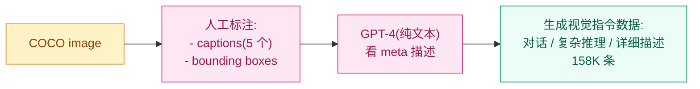
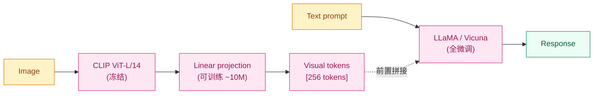

## 前作进展

到 2023 年初,VLM 领域出现一个明显矛盾:

**闭源前沿** —— OpenAI 在 2023 年 3 月发布 GPT-4 时附带演示了 GPT-4V(视觉版),展示惊人的多模态能力(读图答题、看图编程、分析图表、视觉推理)。但 **GPT-4V 闭源,且要到 2023 年 9 月才开放 API**

**开源现状** —— 已有开源 VLM(BLIP-2, MiniGPT-4)主要做 captioning 和简单 VQA,**不能做对话、指令跟随、复杂推理**。没有任何开源模型能接近 GPT-4V 的能力

社区急需 GPT-4V 风格的"视觉助手"——能对图像进行自然对话、回答开放问题、按指令做视觉任务。但训这种模型有两个核心问题:

**1. 缺少视觉指令数据** —— [InstructGPT](../12-rlhf-alignment/02-instructgpt.md) 用大量人工写的 instruction-following 数据训出 ChatGPT。**视觉版数据集**几乎不存在——之前的 VLM 数据都是 caption 或简单 QA,不是"按指令完成任务"形式

**2. 训练计算预算受限** —— BLIP-2 / Flamingo 等都还是 200M+ 参数训练,小实验室也不容易承担

威斯康星麦迪逊 + 微软研究院的 Liu 等人 2023 年 4 月发表 *Visual Instruction Tuning*(LLaVA)给出两件事的解法:

**1. 用 GPT-4 生成视觉指令数据** —— 既然没人写过视觉指令数据,**让 GPT-4 看图片的 caption + bounding box,自动生成 (指令, 回答) 对**。生成的 158K 条数据覆盖对话、复杂推理、详细描述三类

**2. 极简架构** —— 用预训练 CLIP ViT 做视觉编码器,**用单层 linear projection** 把视觉特征接到 LLaMA。没有 Q-Former、没有 Perceiver Resampler、没有 cross-attention 注入——就是把视觉 tokens 作为前置 prompt 喂给 LLM

LLaVA 用这两件事训出第一个开源的 GPT-4V 风格视觉助手。LLaVA-7B 在 90 GPU 小时(8 A100 × 12 小时)就能训完,**对比 BLIP-2 的 16 A100 × 9 天降 10×**。质量上 LLaVA 在科学问答(ScienceQA)上 92.5%,接近 GPT-4 的 84.9%(GPT-4 没看图,LLaVA 看了图)。

LLaVA 的发布(开源代码 + 数据 + 模型权重)在 2023 年 4 月引爆了开源 VLM 浪潮——MiniGPT-4、Otter、mPLUG-Owl、Qwen-VL、InternLM-XComposer、Yi-VL 等几十个开源 VLM 都基于 LLaVA 思路,把"视觉 + 对话"的能力带到所有人。今天的开源 VLM 标配架构,几乎都是 LLaVA 的"CLIP visual + projection + LLM"模式。

## 核心思想 1:Visual Instruction Tuning

LLaVA 的第一个关键贡献是**用 GPT-4 自动生成视觉指令数据**。流程:



*图 1:LLaVA 数据生成流程 — 关键 trick 是 GPT-4 不直接看图,而是看图的人工标注(captions + boxes),按提示生成多种类型的视觉指令对话。*

**GPT-4 不需要看图** —— 这是 LLaVA 数据生成的关键 insight。GPT-4(2023 年 4 月时只有纯文本 API)看 COCO 图像的 5 个 caption + bounding box 的类别和位置,就有足够信息生成"如果它看了图,会怎么回答用户"的对话。

具体 prompt 类型:

**类型 1: 对话(Conversation, 58K 条)** —— 模拟用户和助手关于图像的多轮对话

```
User: 图里有什么类型的车?
Assistant: 我看到图像里有一辆白色 SUV 停在路边。
User: SUV 旁边还有什么?
Assistant: 旁边有几辆停放的轿车,以及人行道上的几个行人。
```

**类型 2: 详细描述(Detailed description, 23K 条)** —— 让助手详细描述图像内容(物体、空间关系、动作、氛围)

**类型 3: 复杂推理(Complex reasoning, 77K 条)** —— 提问需要推理的问题

```
User: 这张图里的人面临什么挑战?
Assistant: 图中的两个人在大风中举着一把伞。挑战是大风可能把伞吹翻,
他们要努力保持平衡,同时避免被雨淋湿。
```

这一数据生成的方法学意义:

- **synthetic data 不需要重新标图** —— 利用现有的 COCO 标注,GPT-4 生成无穷多变种
- **数据质量受 GPT-4 上限** —— 比人工标注便宜但有 GPT-4 的偏见
- **可以快速迭代** —— 改 prompt 就能生成新数据类型,不需要重新雇佣标注员

LLaVA-1.5 后来扩展到 665K 数据,加入 OCR、表格、学术 VQA 等任务,质量进一步提升。

## 核心思想 2:极简架构 + 两阶段训练

LLaVA 的架构比 [BLIP-2](02-blip.md) / [Flamingo](03-flamingo.md) 简单得多——**就是 CLIP visual + 一个 linear projection + LLM**:



*图 2:LLaVA 架构 — 视觉 256 个 patch tokens 通过 linear projection 投到 LLM 词表维度,前置拼接到文本 prompt 喂给 LLM。极简到只有 10M 可训练参数(stage 1)。*

**Vision Encoder** —— CLIP ViT-L/14,**完全冻结**。输出 256 个 patch tokens(14²=196,加 [CLS] 等共 256)

**Projection** —— **就一个 nn.Linear**。把 768 维 CLIP 特征投到 LLaMA 的 4096 维。可训练参数 768 × 4096 = 3.1M(LLaVA-1.5 改成 2 层 MLP,参数稍多)

**LLM** —— LLaMA 7B / 13B 或者 Vicuna。LLaVA-1.0 训练时全微调 LLM,LLaVA-1.5 后改成 LoRA / 部分微调

**输入格式** —— 视觉 tokens 前置拼接到文本 token 序列:

```
[<image>] [256 visual tokens] [Human: 描述这张图. Assistant:]
```

这种"视觉 tokens as prompt"思路极其简洁——LLM 不需要任何架构改动,只是输入多了 256 个特殊的 embedding。

**两阶段训练**:

**Stage 1: Pretraining for feature alignment(预训练)** —— 只训 projection 层,让视觉特征对齐到 LLM 词表空间。数据是 CC3M 子集 595K 图文对(只用 caption 作 label)。**8 A100 × 4 小时**

**Stage 2: Instruction tuning(指令微调)** —— 训 projection + LLM,在 158K visual instruction 数据上微调。让模型学到"按视觉指令完成任务"。**8 A100 × 8 小时**

总计 **8 A100 × 12 小时 ≈ 90 GPU 小时**,成本约 $200 —— 比 BLIP-2 / Flamingo 低 10-1000×。这一可达性是开源 VLM 爆发的根本原因。

## 性能数据

LLaVA 在两类评估上的成绩:

**LLaVA-Bench**(论文自己提出的开放评估,90 张图 + 多种问题,GPT-4 作 judge):

| 模型 | Conversation | Detail | Reasoning | Overall |
|------|------|------|------|------|
| BLIP-2 | 54.6 | 29.1 | 32.9 | 38.1 |
| MiniGPT-4 | 65.0 | 67.3 | 76.6 | 69.7 |
| **LLaVA** | **83.1** | **75.3** | **96.5** | **85.1** |
| **GPT-4(text-only)** | **88.5** | **89.4** | **98.6** | **92.1** |

LLaVA 显著超过同期开源 VLM,且在 reasoning 任务上接近 GPT-4(85.1 vs 92.1)。

**ScienceQA**(科学问答,带图):

| 模型 | Accuracy |
|------|------|
| GPT-3.5 + CoT | 75.2 |
| GPT-4 + CoT | 84.9 |
| LLaMA-Adapter | 78.3 |
| **LLaVA + GPT-4 judge** | **92.5** |

ScienceQA 上 LLaVA 比 GPT-4 高 7.6 分——因为 LLaVA 真看了图,GPT-4 只看文字描述。

## LLaVA-1.5 的改进

LLaVA-1.5(2023 年 10 月)做了几个关键改进,质量进一步大幅提升:

1. **Projection 从单 linear 换成 2 层 MLP** —— 表达力更强,+1.4 分
2. **加入 academic VQA 数据** —— VQAv2 / GQA / OKVQA / OCR-VQA,共 665K 总数据
3. **更高分辨率** —— 从 224 升到 336,细粒度任务受益
4. **更好 prompt 格式** —— 标准化 ChatGPT-style system prompt

LLaVA-1.5 在 11 个 benchmark 上全面 SOTA,超过 IDEFICS / Otter / Qwen-VL 等同期开源 VLM。

## 训练细节

| 维度 | LLaVA-1.0(13B) |
|------|------|
| Vision encoder | CLIP ViT-L/14, **冻结** |
| Projection | nn.Linear(768, 5120), ~4M 参数, 可训练 |
| LLM | Vicuna-13B, Stage 1 冻结, Stage 2 全微调 |
| Stage 1 数据 | CC3M 595K(filter 后) |
| Stage 1 训练 | 1 epoch, lr 2e-3, 8 A100 × 4 小时 |
| Stage 2 数据 | 158K 视觉指令(GPT-4 生成) |
| Stage 2 训练 | 3 epoch, lr 2e-5, 8 A100 × 8 小时 |
| 总训练时间 | 8 A100 × 12 小时 ≈ 90 GPU 小时 |
| 总训练成本 | 约 $200 |

注意 **lr 在两阶段差 100×** —— Stage 1 只训新加的 projection 层,lr 大;Stage 2 训整个 LLM,lr 必须小避免破坏预训练知识。

## 关键代码

LLaVA 的核心实现极其简洁:

```python
import torch
import torch.nn as nn
from transformers import CLIPVisionModel, LlamaForCausalLM

class LLaVA(nn.Module):
    def __init__(self, vision_model_name="openai/clip-vit-large-patch14",
                 llm_name="lmsys/vicuna-13b-v1.5"):
        super().__init__()
        # CLIP 视觉编码器(冻结)
        self.vision_tower = CLIPVisionModel.from_pretrained(vision_model_name)
        for p in self.vision_tower.parameters():
            p.requires_grad = False
        # Projection: 768 → LLM 维度(4096 for 7B / 5120 for 13B)
        self.projection = nn.Linear(768, 5120)
        # LLaMA / Vicuna LLM
        self.llm = LlamaForCausalLM.from_pretrained(llm_name)

    def encode_images(self, images):
        """提取 CLIP 视觉特征,投到 LLM 词表空间"""
        with torch.no_grad():
            # CLIP 输出 [B, 257, 768] (256 patches + 1 [CLS])
            vision_features = self.vision_tower(images).last_hidden_state
            # LLaVA 用 256 patches(去掉 [CLS])
            vision_features = vision_features[:, 1:, :]
        return self.projection(vision_features)  # [B, 256, 5120]

    def forward(self, images, input_ids, attention_mask, labels=None):
        """前向 — 把 visual tokens 前置拼到 text tokens"""
        visual_tokens = self.encode_images(images)             # [B, 256, llm_dim]
        # 把文本 token id 转 embedding
        text_embeds = self.llm.get_input_embeddings()(input_ids)  # [B, T, llm_dim]
        # 拼接 visual + text
        inputs_embeds = torch.cat([visual_tokens, text_embeds], dim=1)
        # Padding mask 也要前置(visual tokens 全是有效的,mask=1)
        visual_mask = torch.ones(visual_tokens.shape[:2], device=images.device)
        attention_mask = torch.cat([visual_mask, attention_mask], dim=1)
        # Labels 前置 -100(忽略 visual token 位置的 loss)
        if labels is not None:
            visual_labels = torch.full(visual_tokens.shape[:2], -100, device=images.device)
            labels = torch.cat([visual_labels, labels], dim=1)
        return self.llm(
            inputs_embeds=inputs_embeds,
            attention_mask=attention_mask,
            labels=labels,
        )
```

工程要点:

- **`vision_features[:, 1:, :]`** —— LLaVA 用 patch tokens(256 个)不用 [CLS] token,与 CLIP 原本分类用 [CLS] 不同
- **`get_input_embeddings()` 拿到 LLM 的 embedding 层** —— 用它把 text token id 转成 embedding,然后和视觉 embedding 拼接
- **`visual_labels = -100`** —— 让 cross-entropy 忽略 visual token 位置(模型只学预测文本 token,不学预测 visual token 自身)
- **两阶段训练** —— Stage 1 设置 `for p in self.llm.parameters(): p.requires_grad = False`;Stage 2 解冻

## 影响 / 后续

LLaVA 在 VLM 历史的位置:**把"开源视觉助手"从空白变成现实,定义了开源 VLM 的标准范式**。具体影响:

**1. 开源 VLM 浪潮的核心模板** —— 2023 年下半年涌现的 MiniGPT-4 / mPLUG-Owl / Qwen-VL / InternVL / Yi-VL / Ovis / DeepSeek-VL 等几乎所有开源 VLM 都基于 LLaVA 架构(CLIP/SigLIP visual + projection + LLM + 两阶段训练)

**2. 视觉指令数据成为新资产** —— LLaVA-158K 数据集被广泛使用,后续 ShareGPT4V、LVIS-Instruct4V、SVIT 等更大的视觉指令数据集相继发布,质量持续提升

**3. "GPT-4 生成训练数据"成为通用方法** —— LLaVA 之后,各种领域(代码、数学、医学、法律)都用 GPT-4 生成 instruction tuning 数据训特定领域助手。Alpaca / Vicuna 等也是这条思路

**4. 极简架构胜过复杂设计** —— LLaVA 用单 linear projection 击败 BLIP-2 的 Q-Former、Flamingo 的 Perceiver Resampler;后续 LLaVA-1.5 才升级到 2 层 MLP。**简洁有效胜过复杂精巧** 在 VLM 领域被反复验证

**5. 推动 VLM 评估标准** —— LLaVA-Bench / MME / MMBench / MMMU 等 VLM 评估 benchmark 在 LLaVA 之后涌现,形成完整 VLM 评估生态

**6. 商业 VLM 也受影响** —— Anthropic Claude 3 / OpenAI GPT-4o / Google Gemini 等闭源 VLM 据推测都用类似"visual encoder + projection + LLM"架构,只是规模更大、训练数据更多

至此 09-multimodal-clip 家族 4 节点完整:**[CLIP](01-clip.md)(对齐基座)→ [BLIP / BLIP-2](02-blip.md)(加入生成)→ [Flamingo](03-flamingo.md)(冻结 LLM 少样本)→ LLaVA(开源 VLM 标准)**,覆盖 2021-2023 跨模态对齐的完整演化主线。

→ [03-flamingo.md](03-flamingo.md) · 平行路线,Flamingo 重 in-context, LLaVA 重 instruction
→ [02-blip.md](02-blip.md) · BLIP-2 的 Q-Former 被 LLaVA 简化成 linear
→ [01-clip.md](01-clip.md) · 视觉编码器,LLaVA 用 CLIP ViT-L/14
→ [../07-gpt-scaling/05-gpt4-llama.md](../07-gpt-scaling/05-gpt4-llama.md) · LLaMA 是 LLaVA 的 LLM backbone
→ [../12-rlhf-alignment/02-instructgpt.md](../12-rlhf-alignment/02-instructgpt.md) · LLaVA 把 instruction tuning 思路从 NLP 扩展到视觉
→ [../14-rag-agent/](../14-rag-agent/) · 视觉 agent 建立在 VLM 之上
